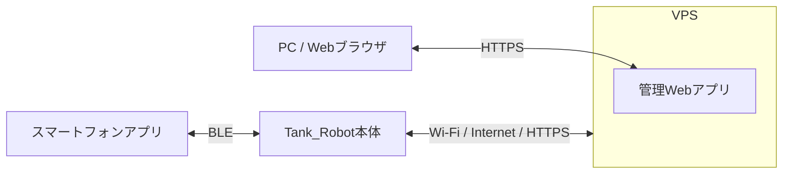
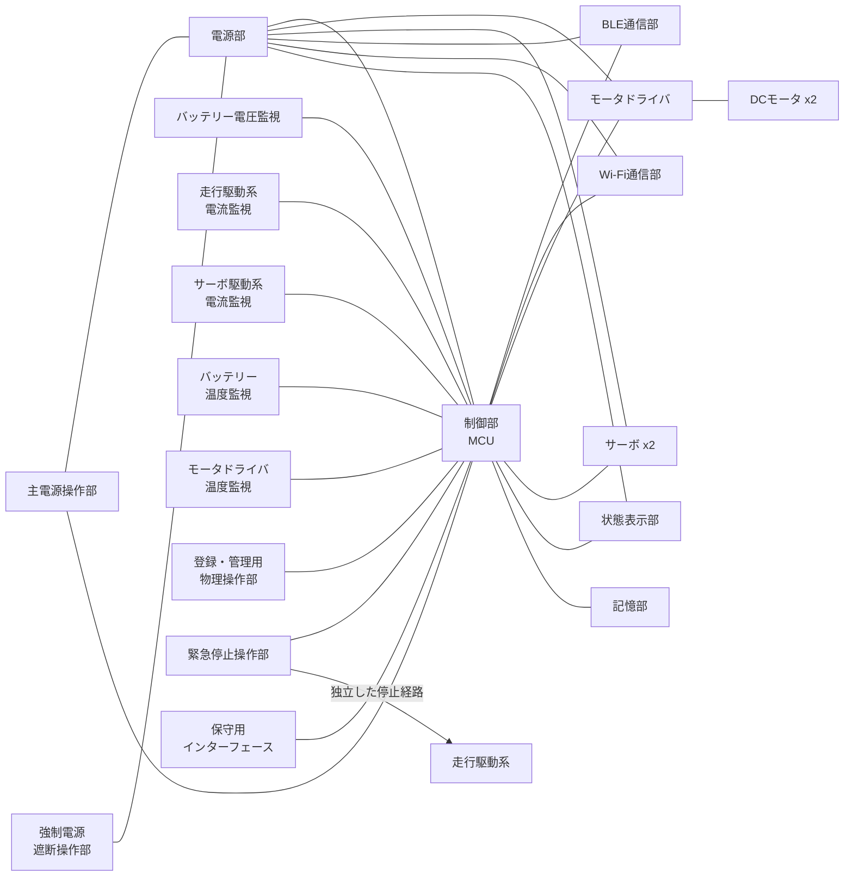

# Tank_Robot システム構成

## 1. 本書の目的
本書は、Tank_Robotシステムを構成する主要な構成と、それらの接続関係を定義することを目的とする。

Tank_Robot本体、スマートフォンアプリ、VPSおよび管理Webアプリからなるシステム全体の構成を明確にするとともに、Tank_Robot本体を構成する主要なハードウェアおよび各構成間の接続関係を整理する。

本書で定義したシステム構成を、後続のシステムアーキテクチャ、インターフェース、ハードウェア、ソフトウェア、安全、セキュリティ、その他の基本設計を行うための前提とする。
## 2. システムの対象範囲
Tank_Robotシステムは、次の構成を設計対象とする。
- Tank_Robot本体
- Tank_Robot本体をBLEで操作するスマートフォンアプリ
- Tank_Robot本体の管理・保守に使用するVPS
- VPS上の情報を管理する管理Webアプリ

スマートフォン端末、Wi-Fiアクセスポイント、インターネット回線、その他のTank_Robotシステムを利用または接続するために必要となる外部設備・通信基盤は、Tank_Robotシステムには含めず、外部システムまたは外部環境として扱う。

外部システム・外部環境との接続関係については、本書のシステム全体構成および構成間の接続で整理する。
## 3. システム全体構成

**【システム全体構成図】**

### 3.1 Tank_Robot本体
Tank_Robot本体は、走行、砲塔・砲身の制御、状態管理、安全制御、通信、状態表示、その他のロボット本体機能を実行する構成である。

スマートフォンアプリとはBLEで接続し、利用者からの操作指令の受付および本体状態の通知を行う。

VPSとはWi-Fiおよびインターネットを介して接続し、設定情報、ログ・診断情報、OTA更新、その他の管理・保守の通信を行う。

VPS経由の遠隔操作は行わない。
### 3.2 スマートフォンアプリ
スマートフォンアプリは、利用者がTank_Robot本体を操作し、本体状態を確認するためのユーザーインターフェースを提供する構成である。

Tank_Robot本体とはBLEで直接接続し、走行、砲塔・砲身、停止、緊急停止、その他の操作指令の送信および本体状態の受信を行う。

また、所有者登録、操作端末登録、登録済み端末の管理、その他の利用者による本体管理に必要な機能を提供する。
### 3.3 VPS
VPSは、Tank_Robot本体の管理・保守に必要な情報および機能を提供するサーバー側の構成である。

Tank_Robot本体とはインターネットを介して通信し、設定情報、ログ・診断情報、ファームウェア更新、その他の管理・保守に必要なデータを扱う。

管理Webアプリに対して、本体の管理・保守に必要な情報および操作機能を提供する。
### 3.4 管理Webアプリ
管理Webアプリは、開発者・管理者がVPS上のTank_Robotに関する情報を確認し、管理・保守操作を行うためのユーザーインターフェースを提供する構成である。

管理WebアプリはVPSを介してTank_Robot本体を管理し、Tank_Robot本体とは直接通信しない。
### 3.5 外部システム・外部環境
Tank_Robotシステムは、動作および通信のために次の外部システム・外部環境を利用する。
- スマートフォンアプリを実行するスマートフォン端末およびOS
- Tank_Robot本体がWi-Fi接続するアクセスポイント
- Tank_Robot本体とVPS間の通信に使用するインターネット回線
- 管理Webアプリを利用するためのWebブラウザおよび端末

これらはTank_Robotシステムの設計対象には含めないが、Tank_Robotシステムとの接続条件および利用上必要となる前提条件については、関連する基本設計で定義する。
## 4. Tank_Robot本体構成

**【Tank_Robot本体構成図】**

### 4.1 制御部
制御部は、Tank_Robot本体の各機能を統括して制御する構成である。

MCUを中心に構成し、BLE通信部、Wi-Fi通信部、走行部、砲塔・砲身部、状態表示部、記憶部、その他の本体機能を制御する。

また、システム状態の管理、安全・停止処理、異常監視、電源管理、その他の本体全体に関わる制御を行う。

保守用インターフェースを介して、本体の診断情報および保存済みログを参照するために必要な機能を提供する。
### 4.2 BLE通信部
BLE通信部は、Tank_Robot本体とスマートフォンアプリとの近距離無線通信を行う構成である。

スマートフォンアプリからの操作指令および管理要求を受信し、本体状態、操作結果、その他の必要な情報をスマートフォンアプリへ送信する。

BLE通信に必要な接続、認証および通信状態の管理は、制御部と連携して行う。
### 4.3 Wi-Fi通信部
Wi-Fi通信部は、Tank_Robot本体をWi-Fiアクセスポイントへ接続し、インターネットを介してVPSと通信するための構成である。

設定情報の取得、ログ・診断情報の送信、OTA更新、その他の管理・保守の通信に使用する。

Wi-Fi通信部は、Tank_Robot本体の遠隔操作には使用しない。
### 4.4 走行部
走行部は、Tank_Robot本体を前進、後退、旋回および停止させるための構成である。

モータドライバおよび左右のDCモータで構成し、制御部からの走行指令に基づいて各モータを駆動する。

通常停止、安全停止、緊急停止および異常時には、関連する安全・停止制御と連携して走行を停止する。
### 4.5 砲塔・砲身部
砲塔・砲身部は、砲塔および砲身の向きまたは位置を制御するための構成である。

砲塔用および砲身用のサーボで構成し、制御部からの指令に基づいて各サーボを制御する。

停止または異常時には、システム状態および安全・停止制御と連携して必要な停止処理を行う。
### 4.6 電源部
電源部は、Tank_Robot本体を構成する各部へ必要な電力を供給するとともに、電源状態を管理するための構成である。

バッテリー、電源変換部、電源制御部、保護機能、電圧・電流・温度監視機能、その他の電源関連機能・回路で構成する。

制御部、走行部、砲塔・砲身部、通信部、状態表示部、その他の本体構成へ必要な電力を供給する。

また、バッテリー電圧、走行駆動系およびサーボ駆動系の電流、バッテリー表面温度、モータドライバ温度を監視し、電源投入、電源遮断、省電力および電源異常時の処理に必要な情報を制御部へ提供する。
### 4.7 状態表示部
状態表示部は、Tank_Robot本体の状態および利用者に通知する必要がある情報を、本体上で表示するための構成である。

電源LED、状態表示用RGB LEDおよび2桁7セグ表示器で構成し、制御部からの指示に基づいてシステム状態、異常状態、その他の必要な情報を表示する。

通常の状態は主にLEDによって表示し、2桁7セグ表示器は異常停止状態または起動失敗状態における補助的な異常コード表示に使用する。

表示内容および表示方法の詳細は、状態表示・利用者通知の基本設計で定義する。
### 4.8 安全・操作部
安全・操作部は、利用者がTank_Robot本体に対して必要な物理操作を直接行うための構成である。

主電源操作部、登録・管理用物理操作部、緊急停止操作部、強制電源遮断操作部、その他の本体側操作部で構成する。

各操作部からの入力は、その目的に応じて制御部または電源部へ通知する。

本体側緊急停止操作については、制御ソフトウェアの通常処理およびモータドライバとの通常通信に依存せず、走行駆動出力を禁止または無効化できる独立した停止経路を備える。

各操作部の具体的な入力方式、緊急停止経路およびハードウェアとソフトウェアの役割分担は、関連する基本設計で定義する。
### 4.9 記憶部
記憶部は、Tank_Robot本体で継続して保持する必要があるデータを保存するための構成である。

設定情報、ログ・診断情報、認証情報、所有者・操作端末情報、OTA管理情報、その他の永続化が必要なデータを保存する。

保存するデータの種類、保存先、更新方法、完全性確認、削除および異常時の取扱いは、データ・設定・ログ・永続化の基本設計で定義する。
## 5. 構成間の接続
本章では、システム構成を明確にするために必要な接続方式および主な用途を定義する。  
通信プロトコルの詳細、信号仕様、コネクタ、端子割当て、通信パラメータ、その他の詳細なインターフェース仕様は、関連する基本設計または詳細設計で定義する。

Tank_Robotシステムを構成する主要な構成間の接続を以下に示す。
### 5.1 システム全体の接続

| 接続元          | 接続先          | 通信経路・方式             | 通信開始主体       | 主な用途                         | 主な制約                             |
| ------------ | ------------ | ------------------- | ------------ | ---------------------------- | -------------------------------- |
| スマートフォンアプリ   | Tank_Robot本体 | BLE                 | スマートフォンアプリ   | 本体操作、状態確認、所有者・操作端末管理、Wi-Fi設定 | 近距離操作に使用し、認証された端末のみ通常操作を許可する     |
| Tank_Robot本体 | VPS          | Wi-Fi、インターネット、HTTPS | Tank_Robot本体 | 設定取得、ログ・診断情報送信、OTA更新、管理・保守   | VPS側からTank_Robot本体へ直接接続して遠隔操作しない |
| Webブラウザ      | 管理Webアプリ     | HTTPS               | Webブラウザ      | 本体情報確認、設定、ログ・診断、OTA管理        | 管理者による管理・保守用途に限定する               |

Tank_Robot本体からVPSへの通信は、本体から開始するHTTPSによる要求・応答方式を基本とする。

Tank_Robot本体の走行、砲塔・砲身、通常停止、緊急停止その他の通常操作にはBLEを使用し、Wi-Fi、インターネットまたはVPSを経由した遠隔操作は行わない。

管理WebアプリはVPS上で動作し、Tank_Robot本体とは直接通信しない。

### 5.2 Tank_Robot本体内部の接続

| 接続元          | 接続先       | 接続方式                         | 主な用途                                    |
| ------------ | --------- | ---------------------------- | --------------------------------------- |
| 制御部          | BLE通信部    | SPI＋IRQ＋RESET                  | BLE通信モジュールの制御およびスマートフォンアプリとのデータ送受信      |
| 制御部          | Wi-Fi通信部  | UART1＋RTS/CTS                  | Wi-Fi通信モジュールの制御およびVPSとの通信               |
| 制御部          | モータドライバ   | I2C                          | 左右DCモータの駆動制御およびモータドライバ状態の取得             |
| モータドライバ      | 左右DCモータ   | モータ駆動出力                      | 左右DCモータへの駆動電力の供給                        |
| 制御部          | 砲塔・砲身用サーボ | PWM                          | 砲塔および砲身の位置制御                            |
| 制御部          | 状態表示部     | 未確定                          | 電源LED、RGB LEDおよび2桁7セグ表示器の制御             |
| 制御部          | 外付け不揮発メモリ | OSPI_B                       | ログ、OTAデータその他の永続データの読出しおよび書込み            |
| バッテリー電圧監視回路  | 制御部       | ADC                          | バッテリー電圧の監視                              |
| 走行駆動系電流監視回路  | 制御部       | ADC                          | 走行駆動系の合計電流監視                            |
| サーボ駆動系電流監視回路 | 制御部       | ADC                          | サーボ駆動系の合計電流監視                           |
| バッテリー温度センサ   | 制御部       | ADC                          | バッテリー表面温度の監視                            |
| モータドライバ温度センサ | 制御部       | ADC                          | モータドライバ温度の監視                            |
| 登録・管理用物理操作部  | 制御部       | GPIO                         | 所有者登録、操作端末登録、初期化等に必要な本体側操作の検出           |
| 主電源操作部       | 電源部・制御部   | AON hardware＋GPIO通知             | 起動および通常終了要求の入力                          |
| 強制電源遮断操作部    | 電源部       | AON hardware直接経路               | 通常終了できない場合の電源強制遮断                       |
| 緊急停止操作部      | 制御部       | GPIO/IRQ（NC sense contact）      | 緊急停止操作状態の検出                             |
| 緊急停止操作部      | 走行駆動系     | NC独立hardware gate              | 通常の制御ソフトウェアおよび通常通信に依存しない走行駆動出力の禁止または無効化 |
| 制御部          | 電源部       | GPIO enable＋PG/FLT等             | 電源状態の取得、電源保持および電源遮断制御                   |
| 電源部          | 本体各部      | 電源供給                         | 本体各部への電力供給                              |
| 保守用インターフェース  | 制御部       | 3.3 V UART                    | 本体へ直接接続した診断情報およびログの参照                   |

BLE、Wi-Fi、外付け不揮発メモリ、安全監視、電源・操作系および保守用インターフェースの基本接続方式は、後続のインターフェース・通信基本設計および電源・ハードウェア基本設計で具体化済みである。具体的なピン番号、通信クロック、信号極性、電気条件、回路定数、コネクタ／パッド等は詳細設計で確定する。

緊急停止操作部は、緊急停止操作を検出するNC接点による制御部への状態通知と、通常の制御ソフトウェアおよびモータドライバとの通常通信に依存しない独立したハードウェア遮断経路を分離する。独立停止経路における最終的なモータドライバの有効化信号または`PWR_DRIVE`の遮断方式は、モータドライバの実機仕様を踏まえて詳細設計および実機評価で確定する。
## 6. 使用する主要ハードウェア
Tank_Robot本体で使用する主要なハードウェアを以下に示す。

本章では、現時点で採用が決定しているハードウェアおよび、システム構成上必要であるが型式または具体的な構成を確定していないハードウェアを整理する。

| 区分       | ハードウェア       | 型式・仕様                                                  | 決定状況 | 主な用途・備考                                         |
| -------- | ------------ | ------------------------------------------------------ | ---- | ----------------------------------------------- |
| 制御部      | MCU          | Renesas RA8M2                                          | 確定   | Tank_Robot本体の統括制御                               |
| BLE通信部   | BLE通信モジュール   | RYZ012A1                                               | 確定   | スマートフォンアプリとのBLE通信                               |
| Wi-Fi通信部 | Wi-Fi通信モジュール | DA16200MOD                                             | 確定   | Wi-FiおよびVPSとの通信                                 |
| 走行部      | モータドライバ      | DPC-XGL1-JP付属モータドライバ                                   | 確定   | 左右DCモータの駆動。制御部とはI2Cで接続する                        |
| 走行部      | DCモータ        | DPC-XGL1-JP付属DCモータ ×2                                  | 確定   | 左右キャタピラの駆動                                      |
| 砲塔・砲身部   | サーボモータ       | DS3218 ×2                                              | 確定   | 砲塔旋回および砲身上下の駆動                                  |
| 電源部      | バッテリー        | 2S LiPoバッテリー                                           | 一部確定 | 本体全体の主電源。容量および具体的な型式は未確定                        |
| 電源部      | 電源変換・制御回路    | `VBAT_MAIN → VBAT_PROTECTED → VBAT_SWITCHED`＋`PWR_AON` | 一部確定 | `PWR_DRIVE`/`PWR_SERVO`を個別遮断可能とする。具体部品・回路定数は未確定 |
| 電源部      | バッテリー電圧監視回路  | ADC監視＋ハードウェア保護回路                                       | 一部確定 | バッテリー電圧の監視。具体回路・定数は未確定                          |
| 電源部      | 走行駆動系電流監視回路  | ハイサイド電流検出＋ADC                                          | 一部確定 | 走行駆動系の合計電流監視。具体部品・ゲイン等は未確定                      |
| 電源部      | サーボ駆動系電流監視回路 | ハイサイド電流検出＋ADC                                          | 一部確定 | サーボ駆動系の合計電流監視。具体部品・ゲイン等は未確定                     |
| 電源部      | バッテリー温度センサ   | NTC＋ADC                                                | 一部確定 | バッテリー表面温度の監視。具体型式・実装方法は未確定                      |
| 電源部      | モータドライバ温度センサ | NTC＋ADC                                                | 一部確定 | モータドライバ温度の監視。具体型式・実装方法は未確定                      |
| 状態表示部    | 電源LED        | 未確定                                                    | 未確定  | 電源状態の表示                                         |
| 状態表示部    | RGB LED      | 未確定                                                    | 未確定  | システム状態、警告、緊急停止、異常等の表示                           |
| 状態表示部    | 2桁7セグ表示器     | 未確定                                                    | 未確定  | 異常停止または起動失敗時の異常コード表示                            |
| 記憶部      | 外付け不揮発メモリ    | OSPI_B接続Serial NOR 8 MiB以上                             | 一部確定 | ログ、OTA更新用データ、その他の大容量永続データの保存。具体型式は未確定           |
| 時刻管理     | RTC          | RA8M2 internal RTC＋32.768 kHz SOSC                     | 一部確定 | `PWR_AON`からVBATTを供給。水晶振動子・回路は未確定                |
| 安全・操作部   | 主電源操作部       | モーメンタリスイッチ＋AONハードウェアラッチ                                | 一部確定 | 起動および通常終了の操作。具体型式は未確定                           |
| 安全・操作部   | 登録・管理用物理操作部  | モーメンタリ入力                                               | 一部確定 | 所有者登録、操作端末登録、初期化等の本体側操作。具体型式は未確定                |
| 安全・操作部   | 緊急停止操作部      | 機械式ラッチ＋2系統NC接点                                         | 一部確定 | 本体からの緊急停止操作および独立した走行停止。具体型式は未確定                 |
| 安全・操作部   | 強制電源遮断操作部    | 誤操作防止付きモーメンタリ操作部                                       | 一部確定 | 通常終了できない場合の強制電源遮断。具体型式は未確定                      |
| 保守       | 保守用インターフェース  | 3.3 V UART＋Boot Firmware 2-wire SCI                    | 一部確定 | 通常保守と有線復旧に使用。コネクタ／パッド／端子配置は未確定                  |

開発および評価では、RA8M2を搭載したEK-RA8M2、RYZ012A1を搭載したRTKYZ012A1B00000BEおよびDA16200MODを搭載したUS159-DA16200MEVZを使用する。  

これらの評価ボードは開発・評価環境として使用するものであり、Tank_Robot本体の製品構成を示すハードウェアとは区別する。

「一部確定」としたハードウェアは基本方式が関連基本設計で確定済みであり、具体部品、回路定数、ピン割当て、コネクタ／パッド等を後続の詳細設計・実機評価で確定する。「未確定」とした項目は、基本方式を含めて関連基本設計で継続して具体化する。
## 7. 未確定事項
本書のシステム構成に関する未確定事項を以下に示す。
1. 外付けシリアルNORフラッシュメモリの具体型式、パッケージ、クロックおよび電気条件
2. バッテリー容量および具体的な型式
3. `VBAT_MAIN → VBAT_PROTECTED → VBAT_SWITCHED`＋`PWR_AON`、`PWR_DRIVE`/`PWR_SERVO`個別遮断を前提とした電源変換・制御回路の具体部品、回路定数および定格
4. バッテリー電圧監視回路の分圧比、保護、ADC入力条件等の具体構成
5. 走行駆動系およびサーボ駆動系の電流検出回路のシャント抵抗、電流検出アンプ、ゲイン等の具体構成
6. バッテリー温度センサおよびモータドライバ温度センサの具体型式、実装方法および診断条件
7. 電源LED、RGB LEDおよび2桁7セグ表示器の具体的な型式、ドライバおよび接続方式
8. 主電源操作部、登録・管理用物理操作部、緊急停止操作部および強制電源遮断操作部の具体的な部品型式、定格、コネクタおよび実装構成
9. 緊急停止の独立走行停止経路について、DPC-XGL1-JP付属モータドライバのハードウェア有効化信号使用または`PWR_DRIVE` ハイサイド遮断のどちらで最終実装するか
10. 通常保守UARTとBoot Firmware 2-wire SCIの保守用コネクタ／パッド、端子配置および共用可否