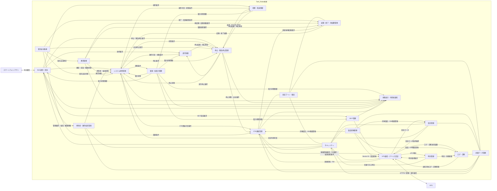

# Tank_Robot システムアーキテクチャ

## 目次

1. 本書の目的
2. 上位文書
3. アーキテクチャ設計方針
4. システム全体の機能配置
5. Tank_Robot本体の主要機能構成
6. Tank_Robot本体の主要機能の役割・責任分担
7. 主要な管理・判断主体
8. Tank_Robot本体の主要機能間の連携原則
9. 下位・関連基本設計で具体化する主要事項
10. 未確定事項

---

## 1. 本書の目的
本書は、Tank_Robotのシステム要求仕様およびシステム構成を実現するために、システム全体の機能構成・機能配置、主要機能の役割・責任分担、主要な機能間の連携および依存関係を定義することを目的とする。

本書では、Tank_Robot本体、スマートフォンアプリ、VPSおよび管理Webアプリの各システムへ機能を配置するとともに、Tank_Robot本体について主要な機能とその管理責任を明確にする。

本書で定義する機能は論理的な機能区分であり、そのままソフトウェアモジュール、タスク、クラス、関数またはハードウェア回路と一対一に対応することを前提としない。

本書を、本体ソフトウェアアーキテクチャ、インターフェース・通信、状態・停止・安全・異常、電源・ハードウェア、データ管理、セキュリティ、OTA、その他の基本設計を行うための共通前提とする。
## 2. 上位文書
本書は、次の文書を上位文書および共通設計文書として作成する。
- [`製品目的・製品目標`](../../00_project_overview/01_製品目的・製品目標.md)
- [`システム要求仕様`](../../10_requirements/)
- [`Tank_Robot 基本設計について`](../00_Tank_Robot%20基本設計について.md)
- [`Tank_Robotシステム構成`](../01_システム構成/Tank_Robotシステム構成.md)

本書の内容が製品目的・製品目標またはシステム要求仕様と矛盾する場合は、上位要求を優先する。

本書の変更によってシステム構成の変更が必要となる場合は、システム構成書を併せて見直す。
## 3. アーキテクチャ設計方針
### 3.1 システムの振る舞いを基本設計で明確にする
システム要求仕様に定められた要求について、製品またはシステムの振る舞い、外部インターフェース、機能間の取り決め、状態遷移、操作条件、安全条件、異常時動作、その他の仕様に影響する事項は、基本設計で明確にする。
### 3.2 管理主体および最終判断主体を明確にする
システム状態、停止状態、異常状態、認証状態、設定データ、その他の共有情報について、管理主体を明確にする。

同一の事項について複数の機能が独立して最終判断する構成とはせず、管理主体または最終判断主体を明確にし、関連する各機能は判断に必要な情報を提供して連携する。

複数の機能が関係する場合は、それぞれの役割および判断範囲を明確にし、システム全体として整合した判断結果となるようにする。
### 3.3 安全に関する最終判断はTank_Robot本体で行う
走行、砲塔・砲身、安全停止、緊急停止、電源保護および異常処理について、Tank_Robot本体を最終的な実行・安全判断主体とする。

スマートフォンアプリ、VPSおよび管理Webアプリから受信した要求だけを根拠として、安全条件を省略または無効化しない。
### 3.4 本体側の安全機能を外部通信へ依存させない
BLE、Wi-Fi、インターネット、VPSまたは管理Webアプリを利用できない場合でも、本体側の安全監視、停止処理、緊急停止、電源保護および異常監視を実行できる構成とする。
### 3.5 システム状態と各機能の内部状態を分離する
システム全体の状態はシステム状態管理機能が一元管理する。

BLE接続状態、Wi-Fi接続状態、認証状態、アクチュエータ状態、電力状態、異常状態、その他の各機能固有の状態は、それぞれの機能で管理し、必要な情報をシステム状態管理機能へ提供する。
### 3.6 安全関連処理を優先する
緊急停止、安全停止、重大な異常処理、その他の安全関連処理を、通常操作、通信、ログ、設定、OTA、その他の処理より優先する。

安全関連処理が、外部通信、ログ保存、セキュリティ処理、その他の非安全関連処理の完了待ちによって阻害されない構成とする。
### 3.7 操作を自動再開しない
起動、再起動、通信再接続、省電力状態からの復帰、異常復旧、緊急停止解除およびOTA更新後に、以前の走行指令または砲塔・砲身操作を自動的に再開しない。

通常操作を再開する場合は、現在のシステム状態、安全条件、認証状態および操作権限を確認した後、新たに受信した有効な操作指令を使用する。
## 4. システム全体の機能配置
Tank_Robotシステムの主要機能を、Tank_Robot本体、スマートフォンアプリ、VPSおよび管理Webアプリへ次のように配置する。

| システム         | 主な役割                                                                                                                                                                                             |
| ------------ | ------------------------------------------------------------------------------------------------------------------------------------------------------------------------------------------------ |
| Tank_Robot本体 | 起動・終了・再起動、システム状態管理、BLE接続・操作端末認証、所有者・操作端末管理、走行制御、砲塔・砲身制御、通常停止・安全停止・緊急停止、電源・省電力管理、バッテリー・電気安全監視、Wi-Fi接続、VPS通信・デバイス認証、製品情報管理、設定管理、ログ・診断、永続データ管理、異常検出・復旧、OTA更新、時刻管理、固定ブート・復旧、状態表示および本体側のセキュリティ処理を担当する |
| スマートフォンアプリ   | BLE接続および本体との認証、走行・砲塔・砲身・通常停止・緊急停止・緊急停止解除・通常終了の操作要求、本体状態・操作可否・異常状態・その他の利用者向け情報の表示、所有者・操作端末管理に必要な利用者操作および状態表示、Wi-Fi接続設定の入力・登録／変更要求ならびに所有者に許可された管理・復旧操作の要求を担当する                                     |
| VPS          | Tank_Robot本体とのデバイス認証およびHTTPS通信、設定データの管理・配信、ログ・診断情報の受信・管理、OTA更新情報およびファームウェアの管理・配信、更新結果の管理、システム時刻の提供ならびに管理Webアプリで使用する管理・保守情報の保持を担当する                                                               |
| 管理Webアプリ     | システム管理者・開発者の認証、管理対象デバイスの状態確認、設定データの登録・変更・配信対象設定・適用結果確認、ログ・診断情報の検索・閲覧、署名済みファームウェアの登録・確認、OTA更新対象の設定・更新結果確認および管理操作の監査情報確認を担当する                                                                      |

スマートフォンアプリはTank_Robot本体へ操作要求を送信し、操作可否の判断およびアクチュエータの制御はTank_Robot本体が行う。

所有者および操作端末の管理は、Tank_Robot本体とスマートフォンアプリ間のBLE通信を基本とし、VPSには所有者用アカウントおよび所有者とDevice IDとの関連付けはしない。
## 5. Tank_Robot本体の主要機能構成
Tank_Robot本体の主要な論理機能を以下に示す。

【注意】  
本図は、Tank_Robot本体の主要な論理機能および主要な連携関係を示すものであり、すべての機能間インターフェースおよび通知経路を網羅するものではない。

各機能間の詳細な連携、要求、状態、データおよび処理結果の受け渡しについては、本章以降の連携原則および各基本設計で定義する。

本図の接続は、ソフトウェア上の直接関数呼出し、タスク間通信方式または具体的なハードウェア信号を規定するものではない。

図の関係を目的別に確認する場合は、次の節を参照する。

- 操作要求と停止：8.1～8.3節。
- 異常・電源と起動・終了：8.4～8.5節および8.9節。
- VPSによる管理・保守とデータ更新：8.6～8.8節および8.10～8.12節。

## 6. Tank_Robot本体の主要機能の役割・責任分担
Tank_Robot本体の主要機能について、主な役割および責任を次に示す。

OTA更新と固定ブート・復旧で使用する領域名・状態名は、次の意味で用いる。詳しい定義はOTA更新基本設計の1.5節に従う。

| 名称 | 意味 |
| --- | --- |
| `PRIMARY` | 本体アプリケーションとして起動する領域 |
| `CANDIDATE` | 更新候補のファームウェアを保持する領域 |
| `PREVIOUS` | 更新前の直前正常ファームウェアを退避する領域 |
| `INSTALL_REQUESTED` | 更新候補と退避データの準備を終え、固定ブートで更新を開始してよいことを示す状態 |

| 機能           | 主な役割・責任                                                                                                                                                                                                                      |
| ------------ | ---------------------------------------------------------------------------------------------------------------------------------------------------------------------------------------------------------------------------- |
| 起動・終了・再起動管理  | 主電源投入または再起動後の起動処理、起動理由の識別、起動時初期化および診断、通常終了、終了処理中の電源保持、終了完了後の電源遮断ならびに再起動処理を管理する。 必要な処理の実行順序および完了条件を管理する。                                                                                                                   |
| システム状態管理     | システム全体の現在状態を一意に管理し、状態遷移条件、状態遷移の優先順位および状態遷移処理を管理する。 現在のシステム状態と各機能から提供される条件に基づき、処理および操作の許可条件を管理する。                                                                                                                          |
| BLE通信・認証     | BLE通信部の初期化、アドバタイズ、接続、切断、再接続、操作端末との認証処理、BLE通信状態および認証状態を管理する。 受信したメッセージを検証し、有効な操作要求および管理要求を対応する機能へ提供する。                                                                                                                     |
| 所有者・操作端末管理   | 所有者の登録状態、所有者端末および一般操作端末の登録情報、端末の役割および操作権限を管理する。 端末の追加・削除、所有者再登録ならびに工場出荷状態への初期化の開始および全体シーケンスを管理する。                                                                                                                         |
| 走行制御         | 走行指令の内容および走行固有の操作条件を確認し、左右DCモータの出力を生成・制御する。 加速・減速、旋回、モータドライバ制御ならびに走行固有の過負荷・拘束等を監視し、必要な停止要求または異常情報を提供する。                                                                                                                   |
| 砲塔・砲身制御      | 砲塔・砲身操作指令および砲塔・砲身固有の操作条件を確認し、砲塔旋回および砲身上下のサーボ出力を生成・制御する。 安全可動範囲、動作速度ならびに砲塔・砲身固有の過負荷・拘束等を監視し、必要な停止要求または異常情報を提供する。                                                                                                           |
| 停止・緊急停止管理    | 通常停止、安全停止および緊急停止を区別して管理し、停止要求の優先順位、停止対象、停止方法、停止完了および停止処理が正常に完了しない場合の追加の停止処理を管理する。 操作指令タイムアウトならびに緊急停止状態の維持・解除条件を管理する。                                                                                                      |
| 電源・省電力管理     | 制御部、通信部、走行駆動部、サーボ駆動部、状態表示部、その他の省電力対象機能について電力状態を管理する。 未操作状態の監視、システム全体の低消費電力状態への移行および復帰ならびに各機能の電力状態の切替えを管理する。                                                                                                               |
| 電気安全監視       | バッテリー電圧、走行駆動系およびサーボ駆動系の電流、バッテリー温度、モータドライバ温度、その他の電気安全に必要な状態を監視し、低電圧、過電流、短絡、異常発熱、その他の電気的異常を検出する。 必要な保護処理、停止要求または異常情報を提供する。                                                                                                  |
| 異常管理         | 各機能で検出された異常情報を収集・管理し、システム全体として通常操作を継続できるか、どの処置が必要か、および復旧可能かを判断する。 必要に応じて安全停止、異常停止、再起動、起動失敗または電源遮断に必要な要求を関連機能へ提供する。                                                                                                        |
| Wi-Fi管理      | Wi-Fi接続設定、Wi-Fi通信部の初期化、アクセスポイントへの接続、IP通信の確立、接続状態、切断および再接続を管理し、VPSとの通信に必要なIP通信が可能な状態を確立・維持する。                                                                                                                                 |
| VPS通信・デバイス認証 | VPS接続、接続先VPSの確認、本体のデバイス認証およびHTTPSによる要求・応答通信を管理する。 VPSとの通信フォーマットおよび通信手順に従ってメッセージの生成・検証・送受信を行い、設定データ取得、ログ・診断情報送信、OTA更新用通信および時刻取得に必要な通信機能を提供する。                                                                              |
| 設定管理         | VPSから取得する設定パッケージを識別・管理し、設定内容、形式、対象および新旧を確認する。 設定データの保存、適用、切戻し、起動時読込みおよび工場出荷設定への復元を管理する。                                                                                                                                   |
| ログ・診断        | イベントログ、診断情報および評価用トレースを区別して管理し、各機能から提供される記録対象情報の収集、識別、時刻または発生順序の付与、保存優先度、容量管理ならびにVPSへの送信を管理する。                                                                                                                                |
| 永続データ管理      | 再起動または電源再投入後にも必要なデータについて、不揮発性記憶領域への保存、読出し、完全性確認、更新中断対策、容量管理、初期化および記憶媒体異常への対応を管理する。保存するデータの機能上の意味および使用条件は各機能が管理する。                                                                                                            |
| OTA更新管理      | OTA更新情報および更新用ファームウェアを管理し、更新開始条件の確認、ファームウェア取得、CANDIDATE検証・保存、PREVIOUS退避・検証、`INSTALL_REQUESTED`の確定、制御された再起動要求ならびに更新後の試行起動の正常確認を管理する。 PRIMARYの消去・書込みは固定ブート・復旧が担当し、固定ブート・復旧から提供される起動・復旧結果に基づき、OTA更新としての成功、失敗および復旧結果を管理する。     |
| セキュリティ       | 秘密情報、鍵、証明書および信頼情報の保護、暗号用途乱数、HMAC／AEAD／ECDSA／SHA等の共通暗号処理、認証情報／鍵の利用可否、ファームウェア署名・セキュリティ世代（`SecurityGen`）等の暗号学的検証結果を関連機能へ提供する。 通信状態・シーケンス・リプレイ判定、外部入力の構文・意味検証、設定・OTA等の機能固有の受付・適用判断およびセキュアブートの起動対象最終判断は、それぞれの担当機能が管理する。        |
| 状態表示・利用者通知   | 各機能で確定したシステム状態、操作可否、停止状態、異常状態、電源状態、通信状態、OTA更新状態、その他の情報を、本体のLEDおよび7セグ表示器へ反映する。 表示対象となる状態や異常そのものの判定は行わない。                                                                                                                   |
| 時刻管理         | システム時刻ならびに時刻の同期状態および信頼可否を管理する。 VPS通信・デバイス認証から提供されたUTC時刻サンプルおよび通信相関情報を用い、サンプルの最終採否、RTC時刻の同期・補正および時刻の信頼可否を判断し、ログ・診断、セキュリティ、その他の時刻を必要とする機能へ時刻情報およびその有効性を提供する。                                                                |
| 固定ブート・復旧     | 本体アプリケーションファームウェアを起動する前に、署名、完全性およびセキュリティ世代（`SecurityGen`）を確認し、起動を許可されたファームウェアだけを起動対象とする。 `INSTALL_REQUESTED`時にはCANDIDATEを再検証し、PRIMARY消去・書込み開始直前に上書き開始状態を確定した上でMCUbootの上書き更新方式を実行する。更新後起動に失敗した場合は、直前正常ファームウェアを使用した復旧を担当する。 |
| 製品情報管理       | Device ID、製品・機種情報、ハードウェア構成情報、製造情報、校正情報、その他の製品固有情報を管理し、VPS通信・デバイス認証、設定管理、ログ・診断、OTA更新管理、その他の必要な機能へ提供する。 製品固有の秘密鍵、証明書、その他の秘密情報はセキュリティが管理する。                                                                                  |

## 7. 主要な管理・判断主体
複数の主要機能に関係する管理・判断対象について、主な管理主体または最終判断主体を次に示す。

| 管理・判断対象                                | 主な管理・最終判断主体              |
| -------------------------------------- | ------------------------ |
| システム状態および状態遷移                          | システム状態管理                 |
| 起動シーケンスの完了可否                           | 起動・終了・再起動管理              |
| 終了シーケンスの完了可否                           | 起動・終了・再起動管理              |
| 再起動シーケンス                               | 起動・終了・再起動管理              |
| 強制電源遮断操作に伴う制御側の安全処理                    | 起動・終了・再起動管理              |
| 強制電源遮断の実行                              | 電源部（システム構成書で定めるハードウェア経路） |
| システム全体としての通常操作可否                       | システム状態管理                 |
| 通常操作に使用するBLE認証済み操作セッション                | BLE通信・認証                 |
| 所有者登録状態、登録端末、役割および権限                   | 所有者・操作端末管理               |
| 通常操作に使用する端末の切替条件                       | 所有者・操作端末管理               |
| 操作指令タイムアウト                             | 停止・緊急停止管理                |
| 通常停止、安全停止および緊急停止の選択、優先順位および完了          | 停止・緊急停止管理                |
| 緊急停止状態の維持および解除                         | 停止・緊急停止管理                |
| 低消費電力状態への移行・復帰処理                       | 電源・省電力管理                 |
| システム全体の低消費電力状態遷移                       | システム状態管理                 |
| 各機能の電力状態                               | 電源・省電力管理                 |
| 電気安全状態および電気的保護の要否                      | 電気安全監視                   |
| 異常時の通常操作継続可否、処置および復旧可否                 | 異常管理                     |
| Wi-Fi通信の利用可否および接続状態                    | Wi-Fi管理                  |
| VPS認証済み通信の利用可否                         | VPS通信・デバイス認証             |
| VPSから取得した時刻のシステム時刻としての有効性              | 時刻管理                     |
| 設定パッケージの適用可否、適用完了および切戻し                | 設定管理                     |
| OTA更新の開始可否、更新処理の完了・失敗および更新結果           | OTA更新管理                  |
| 起動対象ファームウェアの起動可否および直前正常ファームウェアによる起動・復旧 | 固定ブート・復旧                 |
| 永続データの保存完了および保存データの完全性                 | 永続データ管理                  |
| 工場出荷状態への初期化の開始および全体シーケンス               | 所有者・操作端末管理               |
| 管理変更処理間の排他制御                           | システム状態管理                 |
| 共通セキュリティ機能および秘密情報の管理                   | セキュリティ                   |
| ログ・診断情報の共通管理                           | ログ・診断                    |
| 本体表示対象の優先順位                            | 状態表示・利用者通知               |
| Device ID、製品・機種、ハードウェア構成、製造情報および校正情報   | 製品情報管理                   |

## 8. Tank_Robot本体の主要機能間の連携原則
Tank_Robot本体の主要機能は、要求、状態、データおよび処理結果を明示的に受け渡して連携する。

各機能は、他の機能が管理する状態またはデータを直接変更せず、当該機能へ必要な要求または情報を提供する。

処理の実行主体と管理・最終判断主体が異なる場合、実行主体は処理結果を管理・最終判断主体へ提供し、管理・最終判断主体がシステム全体としての完了可否または次の処理を判断する。

本章では、Tank_Robot本体の主要機能間における基本的な連携原則を定義する。
### 8.1 操作要求
BLE通信・認証は、接続、認証、権限および通信データの妥当性を確認した要求のみを、対応する機能へ提供する。

走行制御および砲塔・砲身制御は、現在のシステム状態および各機能固有の操作許可条件を満たす場合に限り、操作要求を実行する。

実行できなかった過去の継続操作指令を、後から自動的に実行しない。
### 8.2 状態管理
各機能は、システム状態遷移の判断に必要な自身の状態および処理結果をシステム状態管理へ提供する。

システム状態管理は、それらの情報およびシステム要求で定められた状態遷移条件に基づいて、システム状態を決定する。

システム状態管理は、システム状態および状態遷移を管理し、各機能固有の処理は行わない。

各機能は、システム状態管理から提供される現在のシステム状態および操作可否条件に従って、それぞれの機能固有の処理を実行する。
### 8.3 停止および緊急停止
停止・緊急停止管理は、各機能からの停止要求および操作者からの停止要求を受け付け、停止種別と優先順位に基づいて必要な停止処理を決定し、停止対象となる機能へ停止要求を提供する。

走行制御および砲塔・砲身制御は、停止・緊急停止管理からの安全停止または緊急停止要求を通常操作より優先する。

本体側緊急停止操作については、ソフトウェアによる停止管理とは別に、システム構成書に定める独立した走行駆動停止経路を使用する。
### 8.4 異常管理
各機能は、自身が担当する監視対象について異常を検出する。

異常管理は、各機能から通知された異常情報を基に、通常操作継続可否、機能制限、安全停止、異常停止、再起動、起動失敗または電源遮断、その他の必要な処置を管理する。

異常管理は、各機能固有のセンサ値判定または通信異常判定を行わない。
### 8.5 電源・省電力および電気安全
電源・省電力管理は、システム状態および各機能の使用状況に基づいて本体各部の電力状態を管理する。

省電力処理によって、緊急停止、強制電源遮断、安全監視、異常監視または復帰に必要な機能を失わない。

電気安全監視は、バッテリー電圧、走行駆動系およびサーボ駆動系の電流、温度、その他の電気安全に必要な状態を監視し、検出した電気的異常を異常管理へ提供する。

安全な通常操作を継続できない電気的異常を検出した場合、電気安全監視は停止・緊急停止管理へ必要な安全停止要求を提供する。

安全停止だけでは危険な状態を解消できない場合、または安全な終了処理を継続できない電源状態となった場合は、電気安全監視、停止・緊急停止管理および起動・終了・再起動管理が連携し、必要な電源保護または電源遮断を実行する。

電気安全上、即時の保護を必要とする場合は、ログ記録、状態表示または外部通信の完了を待たず、安全確保に必要な処理を優先する。

強制電源遮断操作が行われた場合は、利用可能な範囲でアクチュエータ駆動出力の停止または無効化を行う。
ただし、当該安全処理を実行または完了できない場合でも、強制電源遮断そのものを妨げない。

強制電源遮断は、ソフトウェア処理の正常完了を条件とせず、システム構成書に定める電源部の強制電源遮断経路によって実行する。

電気安全監視は、走行制御および砲塔・砲身制御が過負荷・拘束判定に必要とする監視電流その他の電気状態を提供する。

短絡、重大な過電流、逆接続、危険な過放電、その他の制御ソフトウェアの正常動作だけでは安全を確保できない電気的異常については、システム構成書に定めるソフトウェアに依存しない電気保護手段を使用する。
### 8.6 VPSによる管理・保守
Wi-Fi管理は、VPSとの通信に必要なWi-Fi接続およびIP通信経路を確立・維持する。

VPS通信・デバイス認証は、Wi-Fi管理によって確立されたIP通信経路を使用して、VPSとの認証済みHTTPS通信を確立・管理する。

設定、ログ・診断およびOTA更新に関するデータの意味、適用可否および処理結果は、それぞれの管理機能が責任を持つ。

VPS通信機能は、VPSから受信した情報だけを理由として走行または砲塔・砲身を直接操作しない。
### 8.7 永続データ
各機能は、自身が管理するデータについて、その意味、更新条件および利用条件を定める。

製品情報管理は、Device ID、製品・機種情報、ハードウェア構成情報、製造情報、校正情報、その他の製品固有情報の意味および利用条件を管理する。

永続データ管理は、それらのデータを不揮発領域へ安全に保存し、読出し、完全性確認および領域管理を行う。

永続データ管理は、保存するデータの業務上または機能上の意味を判断しない。
### 8.8 セキュリティ機能との連携
BLE通信・認証、所有者・操作端末管理、Wi-Fi管理、VPS通信・デバイス認証、設定管理、永続データ管理、OTA更新管理、固定ブート・復旧、その他の機能は、鍵・秘密情報の保護、暗号用途乱数、HMAC／AEAD／ECDSA／SHA等の暗号処理、認証情報／鍵の利用可否、署名・MAC等の暗号学的検証を、必要に応じてセキュリティ機能へ要求する。

外部から受信する操作、設定、ファームウェア、その他の情報については、各入力を受け付ける担当機能が構文、長さ、シーケンス／リプレイ、対象、状態および機能上の意味を検証し、必要な暗号学的確認にはセキュリティ機能の結果を使用する。

セキュリティは、鍵・認証情報の利用可否、HMAC／AEAD／ECDSA／SHA等の暗号学的処理結果、ファームウェア署名・セキュリティ世代（`SecurityGen`）比較等の暗号学的検証結果を関連機能へ提供する。
通信状態・シーケンス／リプレイ、入力の構文・意味、設定・OTA等の各機能固有の受付・適用判断および起動対象ファームウェアの最終判断を代理しない。

暗号学的確認に失敗した情報は、通常操作、設定適用、OTA更新、起動対象選択、その他の処理に使用しない。

各機能は、暗号学的確認に成功したことだけを理由として処理を実行せず、システム状態管理から提供される現在のシステム状態、自身が管理する内部状態、ならびに関連機能から提供される権限、安全条件、その他の実行条件を確認する。

セキュリティ処理の異常または処理待ちによって、本体側の停止、緊急停止、電源保護、その他の安全関連処理を阻害しない。
### 8.9 起動・終了・再起動時の連携
起動・終了・再起動管理は、起動、終了および再起動に必要な各機能の処理順序を管理する。

各機能は、自身に必要な初期化、終了処理、安全確認、その他の処理を実行し、その結果を起動・終了・再起動管理へ提供する。

起動・終了・再起動管理は、各機能から提供された処理結果に基づいて全体としての処理完了可否を判断し、必要な結果をシステム状態管理へ提供する。
### 8.10 管理変更処理の連携
Wi-Fi接続設定の変更、所有者・操作端末情報の変更、設定パッケージの適用、工場出荷状態への初期化およびOTA更新開始、その他の管理変更処理は、システム状態管理による実行可否の判断に従って開始する。

各管理機能は、自身が管理する処理を実行し、その開始、完了または失敗に必要な情報をシステム状態管理および関連機能へ提供する。

複数の管理変更処理が同時に実行されることによって、設定、永続データ、所有者情報、その他の管理情報に不整合を生じさせない。
### 8.11 OTA更新および固定ブート・復旧の連携
OTA更新管理は、システム状態、アクチュエータ停止状態、緊急停止・異常状態、電源条件、Wi-FiおよびVPS通信状態、有効な更新情報、記憶領域、復旧可能性、その他の更新開始条件を関連機能から取得し、OTA更新の開始可否を判断する。

OTA更新管理は、更新用ファームウェアの取得、CANDIDATEの検証・保存、PREVIOUSの退避・検証、`INSTALL_REQUESTED`の確定および制御された再起動要求までを、VPS通信・デバイス認証、セキュリティ、永続データ管理、その他の関連機能と連携して実行する。通常アプリケーション側はPRIMARYを消去・書込みしない。

固定ブート・復旧は、`INSTALL_REQUESTED`を確認した場合にCANDIDATEを再検証し、PRIMARYの消去・書込み開始直前に`PRIMARY_OVERWRITE_STARTED`を確定した上でMCUbootの上書き更新方式を実行する。
起動対象ファームウェアの正当性、完全性および起動可否を確認し、その結果に基づいて本体アプリケーションファームウェアの起動またはPREVIOUSからの復旧を行う。

固定ブート・復旧は、復元PRIMARY検証後に`RECOVERY_BOOT_PENDING`を確定してアプリケーションへ引き渡すが、アプリケーション正常起動またはOTA最終結果を確定しない。
起動・終了・再起動管理は、アプリケーションの起動結果を確定する。システム状態管理は、BLE接続待機状態および通常操作の可否を確定する。

OTA更新管理は、これらの結果に基づき、`TRIAL_BOOT_VALIDATED`、`RECOVERY_SUCCEEDED`およびローカルOTAの最終結果を確定する。
永続データ管理は各状態の意味を判断せず、指定されたレコードを原子的に保存する。
### 8.12 時刻情報の連携
VPS通信・デバイス認証は、認証済みHTTPS通信でVPSから取得したUTC時刻サンプル、`requestId`、通信結果、要求送信時刻および応答受信時刻など、通信時間や要求・応答の対応関係を確認するための情報を時刻管理へ提供する。
VPS通信・デバイス認証は、取得した時刻をシステム時刻として採用するかどうかの最終判断を行わない。

時刻管理は、VPSから取得した時刻サンプルについて、日時としての有効範囲、RTT、受信時刻の推定値、現在のRTC時刻との差、補正可否および必要な再取得条件を確認する。
その結果に基づき、時刻サンプルの最終採否、RTC時刻の同期・補正、同期状態および時刻の信頼可否を管理する。
確定した時刻情報およびその有効性を、ログ・診断、セキュリティ、その他の時刻情報を必要とする機能へ提供する。

時刻が`TIME_UNTRUSTED`の場合、新しい通常VPS通信セッションを開始しない。
初期製品で`TRUSTED`を新たに確立できる時刻源は、管理された製造時のプロビジョニングまたは管理された有線保守とする。
認証済みVPSから取得したUTC時刻は、既存の`TRUSTED`状態を更新・補正する時刻源として使用する。

BLEまたはスマートフォンから受信した時刻、Wi-FiモジュールのRTC、DHCP等から取得した時刻は、初期製品において最初に信頼できる時刻を確立するための時刻源として使用しない。
### 8.13 ログ・診断および状態表示との連携
各機能は、自身で確定した状態、処理結果、警告、異常、その他の記録対象情報を、ログ・診断へ提供する。

ログ・診断は、各機能から提供された情報を共通のログ・診断情報として管理し、記録対象となる状態や処理結果そのものを決定しない。

各機能は、利用者へ提示する必要がある自身の状態および処理結果を状態表示・利用者通知へ提供する。

状態表示・利用者通知は、各機能で確定した情報に基づいて表示内容を決定し、システム状態、操作可否、安全処理、異常状態、その他の制御上の状態そのものを決定しない。
## 9. 下位・関連基本設計で具体化する主要事項
本システムアーキテクチャで定めたシステム構成、機能配置、役割・責任分担、管理・判断主体および主要機能間の連携原則に基づき、機能別、インターフェース別、その他の基本設計において、主に次の事項を具体化する。
- 各操作、要求および処理の受付条件、開始条件、継続条件、完了条件、禁止条件および取消し条件
- システム状態および各機能の内部状態、状態遷移条件、状態遷移結果、優先順位、排他制御および遷移失敗時の扱い
- 起動、終了、再起動、低消費電力移行・復帰、工場出荷状態への初期化、その他の主要処理シーケンス
- タイムアウト時間、監視時間、制御周期、通信周期、応答時間、その他の時間条件
- 再試行、再接続、再初期化、バックオフおよび再試行中止条件
- 異常判定条件、異常識別情報、しきい値、継続時間、処置、復旧条件および復旧方法
- 通常停止、安全停止および緊急停止の具体的な停止方式、停止確認方法、停止時間および停止失敗時の処理
- 入力値、出力値、指令値および監視値の範囲、単位、意味、変換方法、安全範囲および無効値の扱い
- 走行制御、砲塔・砲身制御、その他のアクチュエータ制御方式、制御周期、出力方式および安全条件
- 電源系統、各機能の電力状態、電源投入・遮断順序、省電力方式、スリープ方式および復帰方式
- バッテリー電圧、電流、温度、その他の電気安全監視方式、センサ構成、しきい値、保護方式および電源保護回路
- 緊急停止操作部、走行出力無効化手段、その他の安全関連ハードウェアおよび信号経路
- 主要なハードウェア、ソフトウェア、ミドルウェア、ライブラリ、SDK、フレームワーク、その他の採用技術およびそれらの役割
- BLE、Wi-Fiその他の通信モジュールと制御部とのインターフェース、内部状態および制御方式
- BLEのサービス、キャラクタリスティック、通信データ、操作セッション、認証手順、その他のBLE通信仕様
- VPSとの接続先情報、HTTPS API、要求・応答方式、通信データ形式、通信シーケンス、エラーおよび通信セッション管理
- システム間または機能間で受け渡す要求、状態、イベント、処理結果および共有データのインターフェース仕様
- システム時刻、時刻同期、時刻の信頼可否および時刻を使用する各機能との連携仕様
- 所有者および操作端末の登録情報、登録・削除・失効・再登録、所有者復旧情報および工場出荷状態への初期化の具体的な方式
- 設定データの項目、型、単位、値域、デフォルト値、形式・世代管理、適用条件、適用処理、適用結果および切戻し方式
- ログ、診断情報および評価用トレースの対象情報、識別方法、形式、重要度、記録条件、容量管理、送信および参照方式
- 永続データの分類、保存先、領域構成、形式、完全性確認、更新方式、電源断対策、容量管理、削除および異常時の扱い
- OTA更新の開始条件、CANDIDATE取得・検証・保存、PREVIOUS退避・検証、`INSTALL_REQUESTED`確定、制御された再起動、固定ブート・復旧によるPRIMARY書込み・起動確認・失敗・復旧の基本方式
- 固定ブート・復旧機能、起動対象ファームウェア、更新候補ファームウェアおよび直前正常ファームウェアの管理方式
- 認証、認可、暗号通信、署名検証、完全性確認、リプレイ防止、その他のセキュリティ仕様
- 鍵、証明書、信頼情報、認証情報、その他の秘密情報の生成、プロビジョニング、保存、使用、更新、失効および消去方式
- デバッグ、保守および有線復旧インターフェースの使用条件、アクセス制御および通常運用時の制限
- 本体、スマートフォンアプリ、VPSおよび管理Webアプリで扱うデータの分類、生成元、利用目的、保存場所、保存期間、閲覧・変更権限、削除およびプライバシー上の取扱い
- 本体のLEDおよび7セグ表示、スマートフォンアプリおよび管理Webアプリで表示する状態、異常、処理結果、表示優先順位および更新条件
- スマートフォンアプリの画面構成、画面遷移、操作方法、OSライフサイクル、OS権限および秘密情報保存方式
- VPSおよび管理Webアプリのソフトウェア構成、主要コンポーネント、Web API、データ管理、認証・セッション管理および主要画面
- システム全体および主要機能の時間性能、処理周期、CPU、RAM、Flashメモリ、スタック、通信バッファ、メッセージキュー、その他の資源配分および優先制御
- 使用環境、機械的・電気的・熱的条件、長時間動作、繰返し動作、その他の品質および耐久性を実現するための基本方針
- ハードウェア、ファームウェア、スマートフォンアプリ、通信プロトコル、設定形式、VPS API、その他の構成・バージョン・互換性の管理方式
- 故障解析、部品交換、ソフトウェア変更、有線復旧、その他の保守方法、および保守後に安全な状態へ復帰したことを確認する基本方式
- 実装および評価で必要となる状態、処理時間、監視値、異常情報、その他の観測・診断手段
## 10. 未確定事項
システムアーキテクチャ上の機能配置、役割・責任分担または管理主体について未確定事項が生じた場合は、本章へ明示し、下位設計へ暗黙に持ち越さない。

現時点では、システムアーキテクチャ上の未確定事項はない。
