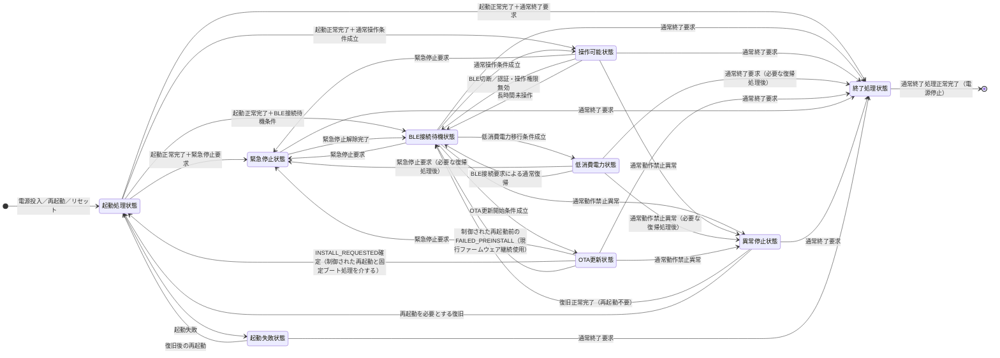

# Tank_Robot システム状態管理基本設計

## 目次

1. 本書の目的
2. システム状態管理の基本設計方針
3. システム状態
4. 状態遷移設計
5. 処理・操作許可管理
6. 他機能との連携
7. 状態表示・ログ・診断との連携
8. 要求との対応および後続設計事項

全体像を把握する場合は、2章の基本方針、3.1の状態一覧および4.3の状態遷移図を参照する。個々の遷移を確認する場合は、4.4.1で対象のNo.を確認し、同じNo.に対応する4.4.3の完了条件および4.4.4の失敗時の扱いを併せて参照する。

---

## 1. 本書の目的
### 1.1 目的
本書は、Tank_Robotのシステム要求仕様およびシステムアーキテクチャに基づき、Tank_Robot本体におけるシステム状態管理の基本設計を定める。

システム状態管理機能は、現在のシステム状態を一元管理する。各機能から提供される状態および処理結果に基づいて、状態遷移、処理の優先順位、通常操作可否ならびに管理・保守処理の許可を判断する。
本書では、これらの判断によってシステム要求仕様に定められたシステム状態および状態遷移を実現するための基本方式を定める。

また、システムアーキテクチャで定めた各機能の役割・責任分担を前提として、状態遷移に必要となる各機能との連携条件、受け渡す情報、処理の開始・完了および失敗時の扱いを具体化する。
これにより、後続の各機能基本設計および詳細設計で共通して使用するシステム状態管理上の前提を定める。
### 1.2 対象範囲
本書では、Tank_Robot本体のシステム状態管理に関する次の事項を対象とする。
- システム状態の定義および管理方針
- システム状態と各機能が管理する内部状態との関係
- 現在のシステム状態および状態遷移中であることの管理
- 状態遷移要求の受付、開始判定、実行中管理および完了判定
- 状態遷移中に発生した緊急停止、異常、その他の安全上重要な要求・事象を失わないための管理
- 許可する状態遷移および禁止する状態遷移
- 複数の状態遷移条件が成立した場合の優先順位および競合処理
- 状態遷移失敗およびタイムアウト時の基本的な処理
- 現在のシステム状態および各機能から提供される条件に基づく、システム全体の通常操作可否の判断
- 管理・保守処理に対する、現在のシステム状態に基づく実行可否の管理
- 管理・保守処理の排他管理
- 通常操作が許可されていない場合または状態遷移中に受信した操作指令の扱い、および状態遷移後の操作自動再開防止
- システムアーキテクチャで定めた責任分担に基づく、状態遷移時の各機能との連携条件および連携方法
- システム状態管理機能へ入力する情報およびシステム状態管理機能から出力する情報
- 状態表示、ログおよび診断機能へ提供するシステム状態管理情報

BLE接続状態、Wi-Fi接続状態、認証状態、アクチュエータ状態、電力状態、異常状態、その他の各機能固有の内部状態および内部処理は、それぞれの機能の基本設計で定め、本書ではシステム状態管理との連携に必要な範囲を対象とする。

また、ソフトウェアモジュール、タスク、クラス、関数、変数、具体的なデータ構造、その他の実装方法は、本書の対象外とし、後続の詳細設計で定める。
### 1.3 上位文書・関連文書
#### 1.3.1 上位文書
本書は、次の文書を上位文書および共通設計文書として作成する。
- [`docs/00_project_overview/01_製品目的・製品目標.md`](../../../00_project_overview/01_製品目的・製品目標.md)
- [`docs/10_requirements/02. システム状態管理.md`](../../../10_requirements/02.%20システム状態管理.md)
- [`docs/20_basic_design/00_Tank_Robot 基本設計について.md`](../../../20_basic_design/00_Tank_Robot%20基本設計について.md)
- [`docs/20_basic_design/01_システム構成/Tank_Robotシステム構成.md`](../../../20_basic_design/01_システム構成/Tank_Robotシステム構成.md)
- [`docs/20_basic_design/02_システムアーキテクチャ/Tank_Robotシステムアーキテクチャ.md`](../../../20_basic_design/02_システムアーキテクチャ/Tank_Robotシステムアーキテクチャ.md)
#### 1.3.2 関連するシステム要求仕様
システム状態の遷移条件、操作可否、状態遷移時の処理結果および他機能との連携については、必要に応じて次の公開用システム要求仕様を参照する。
以下に示す文書は、すべて `docs/10_requirements/` 配下の文書である。
- [`docs/10_requirements/01. 起動・終了・再起動.md`](../../../10_requirements/01.%20起動・終了・再起動.md)
- [`docs/10_requirements/03. 電源・省電力管理.md`](../../../10_requirements/03.%20電源・省電力管理.md)
- [`docs/10_requirements/05. BLE接続・認証.md`](../../../10_requirements/05.%20BLE接続・認証.md)
- [`docs/10_requirements/06. 所有者・操作端末管理.md`](../../../10_requirements/06.%20所有者・操作端末管理.md)
- [`docs/10_requirements/07. 走行制御.md`](../../../10_requirements/07.%20走行制御.md)
- [`docs/10_requirements/08. 砲塔・砲身制御.md`](../../../10_requirements/08.%20砲塔・砲身制御.md)
- [`docs/10_requirements/09. 停止・緊急停止.md`](../../../10_requirements/09.%20停止・緊急停止.md)
- [`docs/10_requirements/10. バッテリー・電気安全.md`](../../../10_requirements/10.%20バッテリー・電気安全.md)
- [`docs/10_requirements/13. 設定管理.md`](../../../10_requirements/13.%20設定管理.md)
- [`docs/10_requirements/14. ログ・診断.md`](../../../10_requirements/14.%20ログ・診断.md)
- [`docs/10_requirements/15. OTA更新.md`](../../../10_requirements/15.%20OTA更新.md)
- [`docs/10_requirements/17. 異常検出・復旧.md`](../../../10_requirements/17.%20異常検出・復旧.md)
- [`docs/10_requirements/21. 状態表示・利用者通知.md`](../../../10_requirements/21.%20状態表示・利用者通知.md)

#### 1.3.3 関連する基本設計
- [`docs/20_basic_design/03_機能別基本設計/05_電源・省電力管理/電源・省電力管理基本設計.md`](../)
- [`docs/20_basic_design/03_機能別基本設計/06_バッテリー・電気安全監視/バッテリー・電気安全監視基本設計.md`](../)
- [`docs/20_basic_design/03_機能別基本設計/15_OTA更新/OTA更新基本設計.md`](../)
- [`docs/20_basic_design/03_機能別基本設計/19_固定ブート・復旧/固定ブート・復旧基本設計.md`](../)
- [`docs/20_basic_design/03_機能別基本設計/21_状態表示・利用者通知/状態表示・利用者通知基本設計.md`](../)

本書の内容が製品目的・製品目標またはシステム要求仕様と矛盾する場合は、上位要求を優先する。

基本設計の過程でシステム要求仕様の不足、矛盾または変更が必要な事項が判明した場合は、本書で要求を暗黙に変更せず、システム要求仕様へのフィードバック事項として扱う。
## 2. システム状態管理の基本設計方針
本章では、システム要求仕様に定められたシステム状態管理の要求を実現するため、システムアーキテクチャで定めた機能構成、役割・責任分担および管理・判断主体を前提として、システム状態管理に適用する基本設計方針を定める。

本章では、システムアーキテクチャで定めた責任分担を変更または再定義せず、システム要求仕様に定められた状態管理、状態遷移、優先制御、操作可否、安全処理および操作再開に関する要求を、後続の設計で共通して適用できる基本方式として具体化する。
### 2.1 役割・責任範囲
システム状態管理機能は、Tank_Robot本体全体の現在状態を一元管理する。システム要求仕様に定められた状態遷移条件ならびに各機能から提供される状態、要求および処理結果に基づいて、システム状態および状態遷移を管理する。

システム状態管理機能は、主に次の事項を担当する。
- 現在のシステム状態の一元管理
- 状態遷移要求および状態遷移条件の管理
- 状態遷移の開始、進行、完了および遷移先状態の確定
- 状態遷移の完了監視、失敗およびタイムアウトの管理
- 複数の状態遷移条件が成立した場合の優先順位および競合の管理
- システム全体としての通常操作可否の判断
- 管理・保守処理に対するシステム状態上の実行可否の管理
- 管理・保守処理の排他管理
- 現在のシステム状態、状態移行処理中であることや遷移元・遷移先などの状態遷移情報、システム全体の操作可否と操作を制限する主な理由、および状態遷移結果の関連機能への提供

本機能は、本体アプリケーション上で自ら開始した状態移行処理について、完了およびタイムアウトを監視する。監視対象の処理は、状態移行処理の開始単位を識別する`transitionGeneration`によって区別する。
主電源投入または再起動開始からの処理全体の時間条件は、起動・終了・再起動管理機能が管理する。本機能は、本体アプリケーション起動前の区間を計時しない。

システム状態管理機能は、BLE通信、認証、所有者・操作端末管理、走行制御、砲塔・砲身制御、停止、電源制御、異常検出、設定適用、OTA更新、その他の各機能固有の処理を実行しない。

各機能は、自身が管理する状態、条件および処理結果を判断し、システム状態または状態遷移の判断に必要な情報をシステム状態管理機能へ提供する。

システム状態管理機能は、各機能の判断結果および現在のシステム状態に基づいて、システム全体として必要な状態遷移および操作可否を判断する。
### 2.2 システム状態と各機能内部状態の分離
システム状態と、BLE接続状態、Wi-Fi接続状態、認証状態、アクチュエータ状態、電力状態、異常状態、その他の各機能固有の内部状態は区別して管理する。

システム状態はシステム状態管理機能が管理し、各機能固有の内部状態は当該機能が管理する。

システム状態管理機能は、各機能の内部状態そのものを重複して管理せず、状態遷移または操作可否の判断に必要な情報を各機能から取得して使用する。

システム状態管理機能が判断に使用した情報であっても、その詳細情報の内容の確定および更新は、引き続き提供元機能が担当する。
対象には、バッテリー電圧・電流・温度、BLE接続の詳細、現在有効な異常の詳細、砲塔・砲身のPWM状態およびOTA進捗などを含む。
システム状態管理機能は、表示・通知のためにこれらを複製し、自身の判断で確定・更新する別の情報として扱わない。

各機能の内部状態が変化した場合でも、その変化だけを理由としてシステム状態が自動的に変化するものとはせず、システム要求仕様に定められた状態遷移条件に従ってシステム状態管理機能が状態遷移を判断する。

通常停止および安全停止は、停止・緊急停止管理機能が管理する停止処理として扱い、システム状態として追加しない。
### 2.3 システム状態の一意管理
システム状態管理機能は、同一時点において有効なシステム状態を一つだけ管理する。

システム状態を必要とする各機能は、システム状態管理機能が管理する現在のシステム状態を共通の判断基準として使用し、各機能が独立してシステム全体の状態を決定しない。

状態遷移が必要となった場合も、各機能が遷移先のシステム状態を独立して確定するのではなく、状態遷移に必要な要求、条件または処理結果をシステム状態管理機能へ提供し、システム状態管理機能が遷移先のシステム状態を確定する。
### 2.4 状態移行処理中の扱い
状態遷移に先立って完了確認を必要とする処理がある場合、システム状態管理機能は、遷移元状態を現在のシステム状態として維持し、現在状態とは別に状態移行処理中であることおよび移行予定先状態を管理する。

状態移行処理中であることを新たなシステム状態として追加せず、必要な完了条件が成立した後にのみ遷移先状態を有効とする。

状態移行処理中は、遷移先状態の成立を前提とした通常操作を許可しない。

状態移行処理における要求の受付、開始・完了判定、失敗時の扱い、高優先度要求との競合および中断・復元の具体的な方式は、4章「状態遷移設計」で定める。
### 2.5 安全関連処理の優先
システム状態管理では、通常の状態遷移、通常操作および管理・保守処理より、安全確保に必要な処理を優先する。

本体側緊急停止操作および強制電源遮断は、現在のシステム状態または状態移行処理中であることを理由として無効化せず、ログ記録、状態表示、外部通信その他の非安全関連処理の完了待ちによって遅延させない。

複数の状態遷移条件または安全処理条件が競合する場合の優先順位、中断可否および後続処理は、4.2「状態遷移の優先順位および競合処理」で定める。
### 2.6 操作の自動再開禁止
起動、再起動、BLE再接続、低消費電力状態からの復帰、緊急停止解除、異常復旧、OTA更新完了、その他の状態変化によって、状態変化前の走行指令、砲塔・砲身操作指令またはアクチュエータ出力を自動的に復元または再開しない。

通常操作を再開する場合は、現在のシステム状態、認証状態、操作権限、安全条件、その他の通常操作条件が成立していることを確認した後、新たに受信した有効な操作指令を使用する。

状態移行処理中に保持する要求・事象の原則は4.1.1「状態遷移要求の受付」、通常操作が許可されていない期間に受信した通常操作指令の扱いは5.4「操作禁止中に受信した指令の扱い」で定める。
### 2.7 外部通信への非依存
システム状態管理および本体側の安全に関する状態遷移は、Wi-Fi、インターネット、VPSまたは管理Webアプリとの通信を成立条件としない。

Wi-Fi、インターネット、VPSまたは管理Webアプリを利用できない場合でも、本体内部で取得可能な状態および条件に基づいて、BLEによる基本操作の可否判断、安全監視、停止、緊急停止、電源保護および異常処理に必要なシステム状態管理を継続する。

管理・保守処理のうち外部通信を必要とする処理については、当該通信を利用できない場合にその処理を実行不可または失敗として扱うことができるが、それによって本体側の安全関連処理を阻害しない。
### 2.8 状態・操作可否の読み取り専用スナップショット
システム状態管理機能は、自身の責任で管理または最終判断する状態情報を、関連機能へ読み取り専用スナップショットとして提供する。

スナップショットとは、ある時点の状態や判断結果を、互いに矛盾しない一組の情報として取得できるようにしたものである。参照する機能は、その内容を書き換えない。
本スナップショットは、新たなシステム状態を追加するものではない。既に管理している現在状態、状態移行処理および操作可否の判断結果を、関連機能が同一時点の情報として参照するために使用する。

少なくとも次の情報を含む。表中の「世代」は、異なる状態更新や状態移行処理を区別するための値を示す。

| 項目 | 意味 |
| --- | --- |
| `currentSystemState` | 現在有効なシステム状態 |
| `stateGeneration` | 現在状態の正常な確定・変更を識別する世代。単なる遷移要求受付では更新しない |
| `transitionInProgress` | 状態移行処理中であるか |
| `transitionSourceState` | 実行中の状態移行処理の遷移元状態 |
| `transitionTargetState` | 実行中の状態移行処理で成立を目指す遷移先状態 |
| `transitionGeneration` | 状態移行処理の開始単位を識別する世代。同一の状態移行処理中は変更しない |
| `operationAvailability` | システム全体の通常操作可否および制限を、`ALLOWED`、`LIMITED`、`PROHIBITED`または`UNKNOWN`で示す情報 |
| `primaryRestrictionReason` | `operationAvailability`が`LIMITED`または`PROHIBITED`となる主な理由を、利用者向け詳細情報とは分離した制限理由区分で示す情報 |

`stateGeneration`は、現在のシステム状態を新しい状態として正常に確定したときに更新する。状態移行処理を開始しただけでは更新せず、遷移失敗によって遷移元状態を維持した場合も、現在状態自体を再確定する必要がない限り更新しない。

`transitionGeneration`は、新しい状態移行処理を開始するときに更新し、当該状態移行処理の正常完了、失敗または高優先度処理による中断まで同じ値を維持する。
状態移行処理中でない場合、`transitionSourceState`および`transitionTargetState`は有効な遷移情報として扱わない。

`operationAvailability`は次の意味とする。
- `ALLOWED`：システム全体の通常操作可否が許可であり、システムレベルで把握している制限がない。
- `LIMITED`：システム全体として通常操作を全面禁止する必要はないが、担当機能から通知された機能制限等により利用可能な通常操作に制限がある。
- `PROHIBITED`：5.1「通常操作可否」に基づき、システム全体として通常操作を禁止する。
- `UNKNOWN`：必要な判断情報を取得できない、または相互に矛盾しており、操作可否を正常に確定できない。安全上の実行可否判断では`PROHIBITED`と同等に扱う。

`primaryRestrictionReason`は、状態表示・利用者通知基本設計で使用する安定した制限理由区分と整合させ、少なくとも`NONE`、`SYSTEM_STATE`、`SAFE_STOP`、`EMERGENCY_STOP`、`POWER_WARNING_OR_RESTRICTION`、`FAULT`、`OTA`、`STARTUP_INCOMPLETE`、`SHUTDOWN_IN_PROGRESS`、`TIME_TRUST_OR_VPS_RESTRICTED`、`OWNER_OR_REGISTRATION_REQUIRED`、`CONFIG_OR_PRODUCT_DATA_INVALID`、`UNKNOWN`を扱えるものとする。

制限理由が他機能の判断に由来する場合、システム状態管理機能は、担当機能が確定した操作への影響または制限理由区分を、システム全体の判断に反映できる。
ただし、異常原因、電気監視値、通信の詳細、PWM状態その他の詳細データは、提供元機能が引き続き管理する。システム状態管理機能は、これらを別の情報として確定・更新しない。
状態表示・利用者通知機能は、詳細表示が必要な場合、当該制限理由区分に対応する情報を管理している機能から詳細情報を取得する。

読み取り専用スナップショットの各項目は、同一の状態更新または操作可否判断に対応する整合した組として取得できるようにする。
具体的な排他方式、更新順序、世代値のビット幅および循環処理は詳細設計で定める。
## 3. システム状態
システム状態は、Tank_Robot本体全体として現在どの動作段階または安全状態にあるかを表す論理的な状態とする。

システム状態管理機能は、一つのシステム状態を現在状態として一意に管理する。

各システム状態において必要となる起動、BLE通信、走行、砲塔・砲身制御、停止、省電力、OTA更新、異常処理、その他の具体的な処理は、それぞれの担当機能が実行する。
システム状態管理機能は、それらの機能から提供される状態、条件および処理結果に基づいて、現在のシステム状態および状態遷移を管理する。

通常停止および安全停止は、停止・緊急停止管理機能が実行する停止処理であり、独立したシステム状態とはしない。

また、状態遷移中であること、再起動処理中であること、および電源供給が停止していることは、本章で定義する9つのシステム状態に追加しない。
これらの扱いは、状態遷移設計および関連機能の基本設計で定める。
### 3.1 システム状態一覧
Tank_Robot本体では、次の9つのシステム状態を管理する。

| No. | システム状態    | 基本的な意味                                                   | 通常の走行・砲塔・砲身操作 |
| --- | --------- | -------------------------------------------------------- | ------------- |
| 1   | 起動処理状態    | 電源投入、再起動またはリセット後に、通常動作へ移行するための初期化、診断および安全確認を行っている状態      | 禁止            |
| 2   | BLE接続待機状態 | 通常操作を開始しておらず、BLE接続・認証ならびに許可された管理・保守処理を受け付ける基本待機状態        | 禁止            |
| 3   | 操作可能状態    | システム全体として通常操作に必要な条件が成立し、新たに受信した有効な通常操作指令を実行可能な状態         | 許可            |
| 4   | 低消費電力状態   | 通常操作を行わず、安全監視および復帰に必要な機能を維持しながら本体を低消費電力化している状態           | 禁止            |
| 5   | OTA更新状態   | アクチュエータを安全状態に維持しながら、本体アプリケーションファームウェアのOTA更新を行っている状態      | 禁止            |
| 6   | 終了処理状態    | 通常終了要求に基づき、アクチュエータの安全確保、必要なデータ処理および電源停止に向けた終了処理を行っている状態  | 禁止            |
| 7   | 緊急停止状態    | 緊急停止に必要な安全処理を行い、明示的な解除が完了するまで安全状態および通常操作禁止を維持する状態        | 禁止            |
| 8   | 異常停止状態    | 通常操作を継続できない異常に対する安全処理後、異常原因の解消および必要な復旧が完了するまで安全状態を維持する状態 | 禁止            |
| 9   | 起動失敗状態    | 起動処理を正常に完了できず、通常動作へ移行できないため、安全状態を維持して復旧または終了を待つ状態        | 禁止            |

表中の「操作可能状態」は、走行中または砲塔・砲身が動作中であることを表すものではない。
システム全体として通常操作を許可可能であることを表し、個々の操作指令を実際に実行する場合は、各制御機能が自身の操作条件をあわせて確認する。

また、「BLE接続待機状態」は、BLEが必ず未接続であることを表す状態ではない。
BLE接続または認証が成立していても、通常操作に必要な条件が成立していない場合は、BLE接続待機状態を維持することがある。
### 3.2 各システム状態の定義
#### 3.2.1 起動処理状態
起動処理状態は、電源投入、再起動またはリセットの発生後、Tank_Robot本体を安全に使用可能な状態へ移行するための起動処理を行うシステム状態とする。

起動処理状態では、起動・終了・再起動管理機能が起動シーケンスを管理し、各機能は自身に必要な初期化、起動時診断、安全確認、設定・永続データの確認、その他の起動処理を実行する。

各機能は起動処理の結果を起動・終了・再起動管理機能へ提供する。
起動・終了・再起動管理機能は、それらを集約して本体アプリケーション側の起動処理の正常／失敗結果を確定する。
起動処理全体の完了は、システム状態管理機能が同じ起動の実行単位を識別する`bootAttemptId`について遷移先状態を確定し、その結果を起動・終了・再起動管理機能へ返した時点とする。

システム状態管理機能は、起動・終了・再起動管理機能から提供される起動結果、ならびに通常操作可否、緊急停止、異常、その他の状態遷移判断に必要な情報に基づいて、起動処理後のシステム状態を決定する。

起動を正常完了とするために必要な初期電気安全条件が成立しない場合、または当該条件を正常に確認できない場合は、操作可能状態またはBLE接続待機状態への遷移を許可しない。
起動・終了・再起動管理機能から起動失敗結果を取得した後は、起動失敗状態へ遷移して復旧を管理する。異常原因の解消または明示的な復旧操作を待つために、起動処理状態を維持しない。

固定ブート・復旧機能は、本体アプリケーションファームウェアを起動する前に、起動対象ファームウェアの正当性、完全性および起動可否を確認する。
固定ブート・復旧機能による起動対象ファームウェアの確認および復旧処理も、製品全体としては電源投入後の起動過程に含む。
一方、本体アプリケーション上のシステム状態管理機能は、自身が動作可能となった後の起動処理状態を管理する。

起動・終了・再起動管理機能から`bootAttemptId`を伴う起動正常完了または起動失敗結果を受けた場合、本機能は他の状態条件と合わせて遷移先状態を確定する。
確定した状態、`stateGeneration`、対応する`bootAttemptId`および正常／失敗を、起動後状態確定結果として起動・終了・再起動管理機能へ返す。
ただし、次のいずれかに該当する起動結果を、BLE接続待機状態その他の正常状態への遷移に使用しない。
- 起動・終了・再起動管理機能が、当該起動の処理全体のタイムアウトを既に確定している。
- 結果の`bootAttemptId`が、既に終了した起動に対応している。
- 結果が、現在実行している起動に対応していない。

固定ブート・復旧機能で得られた起動・復旧結果は、起動・終了・再起動管理機能、その他の関連機能を介して後続の起動処理へ引き継ぐ。

再起動後の安全判定に使用する緊急停止要求、異常終了情報、リセット要因およびOTA更新結果は、それぞれの担当機能が保持および妥当性確認を行い、起動処理に必要な判断結果を提供する。

システム状態管理機能は、再起動後の安全判定に必要な情報が破損または取得不能であり、安全に通常操作を許可できることを確認できない場合、操作可能状態への遷移を許可しない。

起動処理状態では、通常の走行、砲塔旋回および砲身上下操作を許可しない。

起動処理中に緊急停止要求、その他の安全上保持が必要な事象を検出した場合は、当該要求または事象を失わず、起動結果に応じた後続の安全処理へ引き継ぐ。
#### 3.2.2 BLE接続待機状態
BLE接続待機状態は、通常の走行、砲塔旋回および砲身上下操作を開始しておらず、BLE接続・認証ならびに許可された管理・保守処理を受け付ける基本待機状態とする。

BLE接続待機状態では、BLE接続・認証機能が操作端末からのBLE接続および認証を受け付ける。

BLE接続待機状態は、BLE未接続だけを表す状態ではない。
BLE接続および認証が成立した場合でも、通常操作に必要な条件がすべて成立するまでは、BLE接続待機状態を維持することができる。

Wi-Fi、VPS、設定、ログ、所有者・操作端末管理、OTA、その他の管理・保守処理は、BLE接続待機状態であることに加えて、それぞれの機能が定める実行条件が成立している場合に実行できる。

通常の走行、砲塔旋回および砲身上下操作は許可しない。
BLE接続待機状態で受信した通常操作指令を、後に操作可能状態へ遷移した際に実行する指令として保持しない。
#### 3.2.3 操作可能状態
操作可能状態は、システム全体として通常操作に必要な条件が成立し、認証済みかつ必要な操作権限を持つ操作端末から新たに受信した有効な通常操作指令を実行可能な状態とする。

アクチュエータが停止している場合であっても、通常操作条件が成立していれば操作可能状態を維持できる。

システム状態管理機能は、BLE接続・認証、操作権限、所有者情報、設定利用可否、電源状態、安全状態、異常状態、その他の関連機能から提供される条件に基づいて、システム全体としての通常操作可否を判断する。

走行制御および砲塔・砲身制御は、システム状態管理機能による通常操作可否に加えて、それぞれの機能固有の操作条件を確認した上で、個々の操作指令を実行する。

操作指令タイムアウトによって安全停止を実行した場合でも、BLE接続、認証およびその他の通常操作条件が維持されている場合は、操作可能状態を維持できる。
この場合も、停止前の操作指令を自動的に再開せず、新たな有効な操作指令を必要とする。
#### 3.2.4 低消費電力状態
低消費電力状態は、通常操作を行わない待機期間において、安全監視および復帰に必要な機能を維持しながら、本体各部を低消費電力化したシステム状態とする。

低消費電力状態への移行および復帰に必要な具体的な電力制御は、電源・省電力管理機能が実行する。

システム状態管理機能は、電源・省電力管理機能および関連機能から提供される状態、要求、条件および処理結果に基づいて、低消費電力状態への遷移ならびに低消費電力状態からの復帰後のシステム状態を管理する。

低消費電力状態の確定とMCU低消費電力モードへの移行を、一体として確定する処理を「低消費電力移行コミット」と呼ぶ。この処理が成立した時点を「コミット点」とする。

BLE接続待機状態から低消費電力状態への遷移では、電源・省電力管理機能が事前処理を完了し、「低消費電力移行コミット可能結果」と選択済みMCU低消費電力モードを提供する。この結果は、コミットの準備が整ったことを示すものであり、低消費電力状態への移行完了を示すものではない。
システム状態管理機能は、これらの結果および4.4.3の必須条件を確認した後にコミットを許可する。低消費電力状態の確定とRA8M2の選択済みモードへの移行は、論理上の同一コミット点として扱う。

選択済みMCU低消費電力モードは、通常はSoftware Standbyモードとする。省電力化を一部制限する縮退運転によって走行駆動系統またはサーボ系統への通電を維持し、通常周期の電気安全監視が必要な場合は、電源・省電力管理基本設計に定める浅い低消費電力モードを使用する。
システム状態管理機能は、モード内部の設定を決定しない。
電源・省電力管理機能から、選択理由、必要な監視を維持できること、および当該モードへ移行可能であることを取得する。

低消費電力状態では、通常の走行、砲塔旋回および砲身上下操作を許可しない。

低消費電力状態中も、BLEによる復帰要求、通常終了要求、緊急停止要求、通常動作を禁止する異常、その他の必要な復帰要因を検出できる状態を維持する。

通常の復帰後はBLE接続待機状態とし、低消費電力状態へ移行する前の操作状態または操作指令を自動的に復元しない。
#### 3.2.5 OTA更新状態
OTA更新状態は、通常操作を禁止してアクチュエータの安全状態を維持しながら、本体アプリケーションファームウェアのOTA更新処理を実行するシステム状態とする。

本節以降では、OTA更新基本設計に従い、更新候補ファームウェアをCANDIDATE、復旧用に退避する直前正常ファームウェアをPREVIOUS、本体アプリケーションを起動する領域をPRIMARYと表記する。必要な再起動前処理を行ってから実行する再起動を「制御された再起動」と呼ぶ。

OTA更新管理機能は、システム状態、アクチュエータ停止状態、緊急停止・異常状態、電源条件、Wi-Fi・VPS通信状態、更新情報、記憶領域、復旧可能性、その他のOTA固有条件に基づいて、OTA更新の開始可否を判断する。

システム状態管理機能は、BLE接続待機状態であること、およびOTA更新管理機能から得られる開始可否、その他の必要な条件に基づいて、OTA更新状態への状態遷移を管理する。

OTA更新状態では、通常の走行、砲塔旋回および砲身上下操作を許可しない。

OTA更新状態で本体アプリケーションが実行する更新処理は、CANDIDATEの取得・検証・保存、PREVIOUSの退避・検証、`INSTALL_REQUESTED`の原子的確定および制御された再起動要求までとする。
本体アプリケーション側はPRIMARYを消去・書込みしない。
ここで「原子的確定」とは、更新対象の情報を一つの処理単位として確定し、途中まで更新された情報を有効な確定結果として扱わないことを指す。

制御された再起動後は、固定ブート・復旧機能が次を担当する。
- CANDIDATEの再検証
- `PRIMARY_OVERWRITE_STARTED`、`TRIAL_ARMED`、`trialAttempted`および`RECOVERY_BOOT_PENDING`の確定
- PRIMARYの消去・書込みおよび必要なPREVIOUS復旧

本体アプリケーションの実行へ引き継がれた後は、新たに起動したシステム状態管理機能が起動処理状態から開始する。
`otaSettlementPending`は、更新後の試行起動の正常確認およびOTA最終確定が未完了であることを示す情報である。`otaSettlementPending=true`の間は、BLE接続待機状態から操作可能状態へ遷移させない。

システム状態管理機能は、起動・終了・再起動管理機能の起動結果と他の状態条件に基づいて、BLE接続待機状態への遷移および通常操作可否を確定する。一方、`TRIAL_BOOT_VALIDATED`、`RECOVERY_SUCCEEDED`および本体内で確定するOTAの最終結果は確定しない。これらのOTA管理上の状態と最終結果は、OTA更新管理機能が担当する。

OTA更新中に緊急停止、通常終了または通常動作を禁止する異常が発生した場合は、OTA更新管理機能、その他の関連機能による安全処理結果に基づき、状態遷移設計に従って後続のシステム状態を決定する。
#### 3.2.6 終了処理状態
終了処理状態は、通常終了要求を受け付けた後、安全に電源供給を停止するための通常終了処理を実行するシステム状態とする。

終了処理状態では、起動・終了・再起動管理機能が、アクチュエータの安全状態への移行、電源遮断前に必要なデータ処理、その他の必須終了処理について実行順序および完了条件を管理する。

システム状態管理機能は、終了処理状態への遷移および終了処理中のシステム状態を管理し、終了シーケンスそのものの完了可否は起動・終了・再起動管理機能の判断結果を使用する。

終了処理状態では、新たな通常の走行、砲塔旋回および砲身上下操作を許可しない。

終了処理が正常に完了した場合は、電源部による電源供給停止へ移行する。
電源停止は、本章で定義するシステム状態には含めない。

終了処理中に緊急停止、その他の安全上優先すべき要求が発生した場合は、安全確保に必要な処理を通常の終了処理より優先する。
#### 3.2.7 緊急停止状態
緊急停止状態は、緊急停止要求に基づく安全処理を行い、緊急停止の解除条件および明示的な解除操作が成立するまで、アクチュエータの安全状態および通常操作禁止を維持するシステム状態とする。

停止・緊急停止管理機能は、緊急停止要求、アクチュエータ停止処理、停止完了、緊急停止要因、緊急停止状態の維持条件および解除条件を管理する。

システム状態管理機能は、停止・緊急停止管理機能から提供される停止結果および解除結果、その他の情報に基づいて、緊急停止状態への遷移および緊急停止状態からの遷移を管理する。

緊急停止状態では、通常の走行、砲塔旋回および砲身上下操作を許可しない。

緊急停止状態を正常に解除した場合はBLE接続待機状態へ移行し、緊急停止前の操作状態または操作指令を自動的に復元しない。

緊急停止要求が存在することと、現在のシステム状態が緊急停止状態であることは区別する。

緊急停止要求を検出した場合でも、現在のシステム状態および実行中の処理によっては、必要な安全処理または復帰処理を行った後に緊急停止状態へ遷移する場合がある。
各システム状態における具体的な扱いは、4章「状態遷移設計」で定める。
#### 3.2.8 異常停止状態
異常停止状態は、異常管理機能によって通常操作を継続できないと判断された異常に対して必要な安全処理を行い、異常原因の解消および必要な復旧が完了するまで、安全状態および通常操作禁止を維持するシステム状態とする。

異常管理機能は、各機能から通知された異常情報を管理し、通常操作継続可否、必要な処置および復旧可否を判断する。

システム状態管理機能は、異常管理機能から提供される異常処置および復旧結果、停止・緊急停止管理機能から提供される必要な停止結果、その他の情報に基づいて、異常停止状態への遷移および異常停止状態からの遷移を管理する。

異常停止状態では、通常の走行、砲塔旋回および砲身上下操作を許可しない。

異常原因の解消を確認したことだけを復旧完了とは扱わない。
異常管理機能から必要な明示的復旧の正常完了結果を取得するまで、異常停止状態および通常操作禁止を維持する。

異常停止状態を正常に解除した場合はBLE接続待機状態へ移行し、異常停止前の操作状態または操作指令を自動的に復元しない。

異常停止中に緊急停止要求が発生した場合は、当該要求を失わず管理し、異常原因が解消した場合であっても緊急停止の解除が完了するまで通常操作を許可しない。
#### 3.2.9 起動失敗状態
起動失敗状態は、起動に必要な初期化、診断、安全確認、その他の処理を正常に完了できず、通常動作へ移行できない場合に、安全状態を維持して復旧、再起動または通常終了を待つシステム状態とする。

起動・終了・再起動管理機能および異常管理機能は、それぞれの責任範囲に従って、起動失敗原因、安全状態、復旧条件および復旧可否を管理する。

システム状態管理機能は、起動結果、異常状態、復旧可否、その他の関連機能から提供される情報に基づいて、起動失敗状態への遷移および起動失敗状態からの遷移を管理する。

起動失敗状態では、通常の走行、砲塔旋回および砲身上下操作を許可しない。

起動失敗原因の解消を確認したことだけを起動失敗からの復旧完了とは扱わない。
必要な明示的復旧操作の受付、復旧処理および再起動可否は異常管理機能ならびに起動・終了・再起動管理機能の結果を使用して判断する。

起動失敗状態から復旧する場合は、再起動処理を行った後、起動処理状態から起動処理を再実行する。
起動失敗状態から直接、操作可能状態へ復帰しない。

起動失敗中に緊急停止要求が発生した場合は、当該要求を失わず保持し、起動失敗から復旧した後も緊急停止の解除が完了するまで通常操作を許可しない。
## 4. 状態遷移設計
### 4.1 状態遷移の基本処理
本節では、2.4「状態移行処理中の扱い」に定めた基本方針を具体化し、状態遷移の要求受付、開始判定、処理、完了判定および失敗時の扱いを定める。

本書では、システム状態を別の状態へ変更することを「状態遷移」と呼ぶ。
その遷移を成立させるために、遷移先状態を有効にする前に実行する停止、復帰などの処理を「状態移行処理」と呼び、状態の変更そのものと区別する。

システム状態管理機能は、各機能から提供される要求、状態、条件、事象および処理結果に基づいて状態遷移の要否を判断し、必要な状態移行処理を管理する。
各機能の内部処理および内部状態は担当機能が管理し、本機能は状態遷移に必要な論理的な結果だけを使用する。

完了待ちを必要とする状態遷移では、2.4に従って遷移元状態を現在状態として維持し、必要な完了条件が成立した後に遷移先状態を有効とする。
完了待ちを必要としない場合は、状態遷移条件の成立を確認した後、遷移先状態を有効とする。
#### 4.1.1 状態遷移要求の受付
システム状態管理機能は、状態遷移の判断に必要となる要求、状態、条件、事象および処理結果を、各機能との論理的なインターフェースを通じて受け付ける。

状態遷移の要因には、他機能から明示的に通知される要求だけでなく、BLE接続・認証状態、安全状態、異常状態、電源状態、処理完了、その他の状態または条件の変化を含む。

システム状態管理機能は、受け付けた要求、状態、条件または事象を、そのまま遷移先状態の指定として扱わず、現在のシステム状態および関連する条件に基づいて遷移先状態を決定する。

明示的な要求に対する応答や処理結果の通知が必要かどうか、および通知する情報は、要求元機能との連携内容に応じて定める。

状態移行処理中に新たな要求、条件または事象を受け付けた場合も、状態遷移判断に必要な情報を適切に反映する。

状態移行処理後にも有効であり、かつ本基本設計または要求元機能の基本設計で「保持して後続処理へ引き継ぐ」と明示された要求・事象だけを保持する。
緊急停止要求、通常終了要求、低消費電力移行コミット中のBLE接続要求など、本書で個別に保持を定めたものはその規則に従う。

一方、状態移行処理中のため開始できなかった一時的な要求を、遷移完了後に自動実行するための待ち要求として暗黙に保持しない。
通常操作指令の扱いは5.4「操作禁止中に受信した指令の扱い」、管理変更処理の開始要求は5.3「管理変更処理の排他」に従う。
継続的な状態・条件については、古いイベントを再生するのではなく、担当機能が管理している現在値を遷移完了後に改めて参照する。

安全関連要求または安全事象を保持する場合でも、担当機能による即時の出力無効化、電源保護その他の安全処理を遅らせない。
また、情報を保持したことを、安全処理を実行したことの代わりに扱わない。
システム状態管理機能は、直ちに実行する安全処理と、その結果に基づいて後続の状態遷移を完了するために保持する情報とを区別して管理する。

状態移行処理中に受け付けた要求、条件または事象のうち、現在の処理を中断する必要がなく、遷移後に処理できるものについては、原則として現在の状態移行処理を継続する。
遷移完了後に、新しい現在状態に基づいて処理する。
この場合も、要求を自動実行用に保持できるのは、本基本設計または要求元機能の基本設計で保持を明示した対象に限る。

高い優先度を持つ安全関連要求または安全処理条件を受け付けた場合の扱いは、4.2「状態遷移の優先順位および競合処理」で定める。
#### 4.1.2 状態遷移開始判定
システム状態管理機能は、状態遷移の要因を受け付けた場合、現在のシステム状態および関連機能から提供される状態、条件、要求、事象および処理結果に基づいて、状態移行処理を開始できるかを判断する。

状態移行処理の具体的な開始条件は、4.4.2「遷移開始条件」に定める。

状態移行処理を開始するために必要な条件が成立していない場合は、状態遷移不成立として扱い、現在のシステム状態を維持する。

状態遷移不成立は、状態移行処理の開始後に発生する状態遷移失敗とは区別する。

状態移行処理の開始条件が成立し、遷移先状態を有効にする前に完了を確認すべき処理が存在する場合、システム状態管理機能は状態移行処理を開始する。

遷移先状態を有効にする前に完了を確認すべき処理が存在しない場合は、状態遷移条件の成立を確認した後、遷移先状態を有効にする。
#### 4.1.3 状態遷移処理
遷移先状態を有効にする前に必要な処理が存在する場合、システム状態管理機能は、当該処理を担当する機能へ状態移行処理の開始を要求する。

遷移先状態を成立させるために必要となる停止、省電力化、復帰、終了準備、安全確保、その他の状態移行処理は、それぞれの担当機能が自身の責任範囲に従って実行する。

システム状態管理機能は、担当機能の内部処理手順を管理せず、状態遷移の成立に必要な論理的な処理結果を管理する。

BLE接続待機状態から低消費電力状態への遷移では、電源・省電力管理機能がMCU低消費電力モード移行を除く事前処理を完了し、低消費電力移行コミット可能結果、選択済みMCU低消費電力モードおよび選択理由を提供する。
システム状態管理機能は、この結果を通常の移行完了結果として扱わず、4.4.3「遷移完了条件」の条件を確認して低消費電力移行コミットを許可する。

状態移行処理中は、遷移元状態を現在のシステム状態として維持し、現在のシステム状態とは別に、状態移行処理中であることおよび移行予定先状態を管理する。

状態移行処理中であることを理由として新たなシステム状態を追加せず、状態移行処理内部の詳細な進行状態は、それぞれの処理を担当する機能が管理する。

システム状態管理機能は、状態移行処理全体が完了したかを監視する。
各担当機能内部の個別処理に対する監視、タイムアウトおよび内部復旧は、それぞれの担当機能が管理する。

完了までに時間を要する状態移行処理について、監視に使用するタイマ、時刻源および通知方式の具体的な実装は、後続の詳細設計で定める。
ただし、システム要求または本基本設計で目標時間もしくは許容最大時間を定めた状態遷移は、その時間条件を詳細設計へ先送りしない。

電源投入、再起動またはリセット後の起動でも、本機能が監視するのは、本体アプリケーション上で自ら開始した状態移行処理である。
起動・終了・再起動管理機能が管理する次の時間条件を、本機能の動作開始時点から計り直さない。
- 主電源投入から起動後の状態確定まで：目標5秒以内、上限10秒以内。
- 再起動開始から再起動後の状態確定まで：目標10秒以内、上限15秒以内。

起動・終了・再起動管理機能から、現在の起動と同じ`bootAttemptId`に対応する起動正常完了結果を取得した場合は、処理全体のタイムアウトが確定していないことを確認した上で、他の状態条件に従って後続状態を確定する。

一方、現在の起動に対応する起動失敗結果を取得した場合は、タイムアウトによる失敗も含め、4.4.1「遷移元・遷移先」および4.4.3「遷移完了条件」のNo.2に従って起動失敗状態へ遷移する。

確定した状態の結果は、起動・終了・再起動管理機能へ返す。

No.13の低消費電力移行では、システム状態管理機能が状態移行処理を開始した時点を監視起点とし、第4.4.3節のコミット成立までを目標5秒以内、許容最大10秒以内で監視する。
コミット成立前に10秒を超えた場合は状態遷移失敗とし、低消費電力状態を有効にしない。

No.22のBLE接続要求による通常復帰では、電源・省電力管理機能がBLE接続要求を復帰要因として検出した時点を監視起点とし、BLE接続待機状態への遷移完了までを目標3秒以内、許容最大10秒以内で監視する。
システム状態管理機能は、電源・省電力管理機能から復帰要因と対応付けた検出時刻を取得し、10秒を超えた場合は状態遷移失敗として通常操作を許可しない。
#### 4.1.4 状態遷移完了判定
システム状態管理機能は、遷移先状態を有効にするために必要な処理結果および条件がすべて成立したことを確認した時点で、状態遷移条件が成立したものと判断する。

状態遷移の完了判定に使用する必須の処理結果および条件は、状態遷移ごとに4.4「状態遷移表」で定める。

複数の処理結果を必要とする場合は、状態遷移に必須と定めたすべての処理が正常に完了したことを確認する。

状態遷移条件が成立した場合、システム状態管理機能は遷移先状態を現在のシステム状態として有効にし、状態移行処理中であることを解除する。

システム状態の変更後、システム状態管理機能は、現在のシステム状態を必要とする関連機能へ状態変更結果を提供する。

状態変更後に各機能が実行する処理のうち、遷移先状態の成立に必須ではない処理は、状態遷移完了判定には含めない。

BLE接続待機状態から低消費電力状態への遷移では、MCU低消費電力モード移行とシステム状態の確定を、一体として実行する必要がある。
このため、通常の最終処理結果に代えて、電源・省電力管理機能から低消費電力移行コミット可能結果と選択済みMCU低消費電力モードを取得する。
システム状態管理機能は、選択済みモードで必要な安全監視を維持できることおよび他の必須条件を再確認した後にコミットを許可する。
遷移先状態の有効化と最終処理は、4.4.3「遷移完了条件」に定める方法により、同一コミット点で実行する。

この特則によって、必要処理の完了前に遷移先状態を他機能へ有効な現在状態として提供することは認めない。
コミット成立前はBLE接続待機状態を維持し、コミットが成立した時点を状態遷移の正常完了とする。
#### 4.1.5 状態遷移失敗
状態移行処理を開始した後、遷移先状態の成立に必須の処理が失敗した場合、または状態移行処理全体が規定時間内に正常完了しない場合は、状態遷移失敗として扱う。

状態遷移失敗時は、遷移先状態を現在のシステム状態として有効にしない。

状態移行処理によって遷移元状態から一部の機能状態が変更されており、遷移元状態を安全に維持するために中断または復元処理が必要な場合、システム状態管理機能は当該処理の担当機能へ必要な中断または復元処理を要求する。

具体的な中断、復元および機能内部の復旧処理は、それぞれの担当機能が実行し、その処理結果をシステム状態管理機能へ提供する。

必要な中断または復元処理の完了後、遷移元状態を安全に維持できる場合は、遷移元状態を現在のシステム状態として維持する。

遷移元状態を安全に維持できない場合、または必要な中断もしくは復元処理を正常に完了できない場合は、異常管理機能、その他の関連機能と連携し、安全側の処理へ移行する。

状態移行処理中に緊急停止、異常停止、強制電源遮断、その他の高い優先度を持つ安全処理条件が成立した場合の中断可否および後続処理は、4.2「状態遷移の優先順位および競合処理」で定める。
### 4.2 状態遷移の優先順位および競合処理
システム状態管理機能は、同一時点に複数の状態遷移または安全処理条件が成立した場合、あらかじめ定めた優先順位に基づいて実行する処理を一意に決定する。

状態遷移の優先順位は、単に遷移先状態の優先順位を示すものではなく、複数の状態遷移または安全処理条件が競合した場合に、どの処理を優先して開始または継続するかを判断するために使用する。

状態移行処理中に新たな要求、条件または事象が発生した場合は、現在実行中の状態移行処理、新たに成立した状態遷移または安全処理条件、およびそれぞれの優先順位に基づいて処理する。
#### 4.2.1 基本優先順位
システム状態管理機能は、システム要求仕様に従い、複数の状態遷移または安全処理条件が成立した場合、次の順に安全性を優先して処理する。
1. 強制電源遮断
2. 緊急停止
3. 異常停止
4. 通常終了
5. その他の通常状態遷移

強制電源遮断は、通常のシステム状態遷移とは区別し、電源供給中のシステム状態または状態移行処理中であることを理由として無効化しない。

その他の通常状態遷移について複数の異なる状態遷移が成立する可能性がある場合は、競合時に遷移先を一意に決定できるよう、現在のシステム状態ごとに各状態遷移へあらかじめ異なる固定の優先順位を定める。

BLE接続待機状態から低消費電力状態へのNo.13の状態移行処理とBLE接続要求が競合する場合は、BLE接続要求をNo.13より優先する。具体的な中断および復元規則は4.2.2節に従う。

同一の状態移行処理を必要とする複数の要求、条件または事象が成立した場合は、当該状態移行処理を一つだけ実行し、重複して開始しない。

遷移先状態が同一であっても、異なる原因、要求または事象によって発生した情報については、遷移先状態が同一であることだけを理由として重複要求として破棄しない。

各現在状態から成立し得る具体的な状態遷移およびその優先順位は、4.4「状態遷移表」で定める。
#### 4.2.2 状態移行処理中の高優先要求

システム状態管理機能は、状態移行処理中に、現在実行中の状態移行処理より高い優先度を持つ安全処理条件が成立した場合、当該安全処理を優先する。

システム状態管理機能は、高優先度の安全処理を優先する必要がある場合、現在の状態移行処理に関係する担当機能から、各機能が実行中の処理を安全に中断できるかを示す情報を取得する。

各担当機能は、自身が実行している処理について、安全に中断可能かを判断し、その結果をシステム状態管理機能へ提供する。

システム状態管理機能は、各担当機能から提供される中断可否および現在のシステム状態、その他の必要な情報に基づいて、状態移行処理全体としての中断可否を最終的に判断する。

状態移行処理を安全に中断できる場合、システム状態管理機能は必要な担当機能へ中断処理を要求し、現在の状態移行処理を中断した後、高優先度の安全処理へ移行する。

状態移行処理を安全に中断できない場合は、現在の状態移行処理に必要な処理を継続する。

状態移行処理に必要な処理の完了後、遷移先状態を有効にする前に高優先度の安全処理へ移行可能な場合は、遷移先状態を有効にせず、当該安全処理へ移行する。

遷移先状態を有効にした後でなければ高優先度の安全処理へ移行できない場合は、遷移先状態を現在のシステム状態として有効にした後、当該安全処理へ移行する。

システム状態管理機能は、各担当機能から提供される中断可否および処理結果に基づいて、状態移行処理全体としての中断可否ならびに高優先度の安全処理へ移行する時点を判断する。

高優先度の安全処理を優先するために状態移行処理を中断した場合は、当該中断を状態移行処理そのものの異常による状態遷移失敗とは区別する。

低消費電力移行コミットでは、通常タスクや低優先度イベントによる中断を許さず、状態の確定とMCU低消費電力モードへの移行を連続して実行する区間を設ける。
この区間を「コミット用クリティカル区間」と呼ぶ。

コミットを許可する前に高優先度要求が成立した場合は、コミットを許可せず、当該要求を優先する。許可後であっても、コミット用クリティカル区間の開始前であれば、許可を取り消して当該要求を優先する。
コミット用クリティカル区間の開始後は、通常タスクおよび低優先度イベントによって中断しない。
その間に成立した安全関連事象および復帰要因は、発生した事実を失わないよう、ハードウェアまたは保持領域に保持する。これを「ラッチする」と呼ぶ。
定義された復帰要因が成立した場合は、低消費電力状態の成立後に直ちに復帰処理へ進み、保持した要因の優先順位に従って処理する。強制電源遮断は、このコミット処理にかかわらずハードウェア経路で実行する。

No.13の状態移行処理中にBLE接続要求が成立した場合は、コミット用クリティカル区間の開始前後で次のように扱う。
- 開始前：No.13を中断し、電源・省電力管理機能へ中断・復元要求を提供する。必要な復元が正常に完了した後も現在状態をBLE接続待機状態として維持し、その状態で当該BLE接続要求を処理する。
- 開始後：BLE接続要求を復帰要因として保持し、低消費電力状態の成立直後にNo.22の通常復帰へ進む。

現在の状態移行処理より優先度の低い要求または通常の条件変化については、原則として現在の状態移行処理を中断しない。
遷移後にも継続して有効な状態・条件については、遷移完了後に提供元が管理する現在値を再参照する。
その上で、新しい現在状態を基準に処理可否および状態遷移の要否を判断する。
要求・イベントを遅延実行するために保持するのは、本書または担当機能の基本設計で保持を明示したものに限る。
その他の低優先度要求を、後で自動実行するためのキューに入れない。
#### 4.2.3 重複要求
システム状態管理機能は、同一の状態遷移要求がすでに受け付けられている場合、または当該要求に基づく状態移行処理が実行中である場合、同じ状態移行処理を重複して開始しない。

重複した状態遷移要求を受け付けた場合も、実行中の状態移行処理を最初から再実行せず、状態移行処理の完了監視またはタイムアウト監視を重複要求によって再開始しない。

遷移先状態が同じであっても、異なる原因、要求または事象によって発生した情報については、遷移先状態が同一であることだけを理由として重複要求として破棄しない。

異なる要求または事象が状態移行処理中に発生した場合は新たな要求または事象として受け付け、保持対象・非保持対象の扱いは4.1.1「状態遷移要求の受付」に従う。
通常操作指令については、5.4「操作禁止中に受信した指令の扱い」に従う。

重複要求に対する応答の要否は、要求元機能との基本設計で定めた取り決めに従う。
状態移行処理中に保持する要求・事象の範囲は、本書および関連機能の基本設計で明示し、詳細設計で新たな遅延実行対象を追加しない。
#### 4.2.4 禁止遷移
システム状態管理機能は、現在のシステム状態から許可されていない状態遷移を実行しない。

各機能から受け付けた要求、条件または事象について、現在のシステム状態では対応する状態遷移が許可されていない場合は、状態移行処理を開始せず、現在のシステム状態を維持する。

現在のシステム状態では許可されていない要求を受け付けたこと自体は、システム内部の異常として扱わない。

許可される状態遷移は、4.4「状態遷移表」に定義された遷移を基準とする。

システム状態管理機能の内部判断によって、存在しないシステム状態、未定義のシステム状態、または4.4「状態遷移表」に定義されていない状態遷移が生成された場合は、内部整合性の異常として扱う。

内部整合性の異常を検出した場合は、当該状態遷移を実行せず、未定義または不明な状態を現在のシステム状態として有効にしない。
また、異常管理機能、その他の関連機能へ必要な情報を提供し、現在のシステム状態および安全状態に応じて安全側の処理を行う。
### 4.3 状態遷移図
Tank_Robot本体のシステム状態遷移の全体関係を次に示す。

本図はシステム状態間の関係を俯瞰することを目的とし、状態遷移条件は主要な内容に簡略化して記載する。  
各状態遷移の正式な条件・事象、優先順位、遷移開始条件、遷移完了条件および遷移失敗時の扱いは、4.4「状態遷移表」に定める。

図中の開始点および終了点は、9つのシステム状態とは区別する。

電源投入、再起動またはリセット後は、本体アプリケーション上のシステム状態管理機能が動作可能となった後、起動処理状態からシステム状態管理を開始する。

通常終了処理が正常に完了した場合は電源供給を停止する。  
電源停止はシステム状態として管理しないため、図では終了点として表現する。

再起動はシステム状態として管理しない。  
OTA更新、異常復旧または起動失敗からの復旧によって再起動する場合、再起動前に起動処理状態へ直接遷移するものではなく、再起動後の本体アプリケーションが起動処理状態から開始する。

OTA更新状態で`INSTALL_REQUESTED`を確定して制御された再起動を開始した後、再起動前のシステム状態管理機能はそこで実行を終える。
PRIMARYの再検証・消去・書込みおよび必要なPREVIOUS復旧は、固定ブート・復旧機能が実行する。
固定ブート・復旧機能から本体アプリケーションの実行へ引き継ぐことができた場合、新たなシステム状態管理機能が起動処理状態を確立する。
固定ブート段階で本体アプリケーションを起動できない場合、本機能はまだ動作していないため、未定義のシステム状態へ遷移したものとして表現しない。この場合は、固定ブート・復旧、起動・終了・再起動管理および異常管理の責任範囲で扱う。

緊急停止要求が発生しても、現在のシステム状態または実行中の処理によって必要な安全処理を直ちに完了できない場合は、当該要求を保持し、必要な処理を実行可能となった後に緊急停止状態への遷移を完了する。

強制電源遮断は通常のシステム状態遷移とは区別するため、本図の状態遷移線には含めない。  
強制電源遮断操作または強制電源遮断を必要とする条件が成立した場合は、電源供給中のいずれのシステム状態または状態移行処理中であっても、通常の状態遷移より優先して強制電源遮断処理を実行する。

操作指令タイムアウトによる安全停止は、必ずしもシステム状態の変更を伴わないため、本図には状態遷移として記載しない。  
安全停止完了後もBLE接続、認証、操作権限およびその他の通常操作条件が維持されている場合は、操作可能状態を維持する。
### 4.4 状態遷移表
本節では、各システム状態から成立し得る状態遷移について、遷移元、遷移先、優先順位、状態移行処理開始条件、状態遷移条件および状態遷移失敗時の扱いを定める。

状態遷移の優先順位は、同一の現在状態において複数の状態遷移が成立した場合に、実行する状態遷移を一意に決定するために使用する。

表中の優先順位は、数値が小さいほど高いものとする。

強制電源遮断は通常のシステム状態遷移とは区別し、電源供給中のすべてのシステム状態および状態移行処理中において、表中のすべての状態遷移より優先する。

本節で使用するNo.は、本節内で状態遷移を対応付けるためのものであり、ソフトウェア上のイベントID、状態ID、その他の実装上の識別子を規定するものではない。
#### 4.4.1 遷移元・遷移先
##### 電源投入、再起動およびリセット

|No.|遷移元|条件・事象|遷移先|優先順位|
|---|---|---|---|---|
|1|電源停止中、または再起動・リセット前の状態|電源投入、再起動またはリセット|起動処理状態|―|

電源停止はシステム状態として管理しない。

再起動またはリセットが発生した場合は、発生前のシステム状態にかかわらず、再起動またはリセット後の本体アプリケーションは起動処理状態から開始する。
##### 起動処理状態
起動処理状態では、まず起動処理結果が正常完了または起動失敗のいずれであるかを判定する。

起動失敗の場合は起動失敗状態へ遷移する。

起動を正常完了とするために必要な初期電気安全条件が成立しない、または確認できないことによって起動失敗結果を取得した場合も、No.2を適用する。
原因解消の監視、復旧可否の判断および必要な明示的復旧操作は、起動失敗状態で行う。
それらの完了を待つために、起動処理状態を維持しない。

起動正常完了の場合は、保持している要求および通常操作条件に基づいて後続状態を決定する。
起動正常完了後に複数の遷移候補が成立する場合は、次の優先順位で処理する。

1. 緊急停止要求
2. 通常終了要求
3. その他の通常状態遷移

| No. | 条件・事象                                | 遷移先       |
| --- | ------------------------------------ | --------- |
| 2   | 起動失敗                                 | 起動失敗状態    |
| 3   | 起動正常完了かつ保持中の緊急停止要求あり                 | 緊急停止状態    |
| 4   | 起動正常完了かつ保持中の通常終了要求あり                 | 終了処理状態    |
| 5   | 起動正常完了かつ`otaSettlementPending=false`で、通常操作条件成立 | 操作可能状態    |
| 6   | 起動正常完了かつ`otaSettlementPending=true`             | BLE接続待機状態 |
| 7   | 起動正常完了かつ`otaSettlementPending=false`で、通常操作条件未成立 | BLE接続待機状態 |

起動処理中に緊急停止要求を受け付けた場合は、当該要求を失わず保持する。
起動処理が正常に完了した場合は、保持している緊急停止要求を起動正常完了後の状態遷移判断に反映し、緊急停止状態への遷移を優先する。
起動処理が失敗した場合は、起動失敗状態へ遷移し、保持している緊急停止要求を引き続き保持する。

起動処理中に通常終了要求を受け付けた場合も、当該要求を保持する。
起動処理が正常に完了した場合は、緊急停止要求が保持されていないことを確認した上で、保持している通常終了要求に基づいて終了処理状態へ遷移する。
起動処理が失敗した場合は、まず起動失敗状態へ遷移し、その後、保持している通常終了要求に基づいて終了処理状態への遷移を判断する。
##### BLE接続待機状態

| No. | 条件・事象                   | 遷移先     | 優先順位 |
| --- | ----------------------- | ------- | ---- |
| 8   | 緊急停止要求                  | 緊急停止状態  | 1    |
| 9   | 通常動作を禁止する異常             | 異常停止状態  | 2    |
| 10  | 通常終了要求                  | 終了処理状態  | 3    |
| 11  | OTA更新開始条件成立かつ`otaSettlementPending=false` | OTA更新状態 | 4    |
| 12  | 通常操作条件成立かつ管理変更処理を実行中でなく、`otaSettlementPending=false` | 操作可能状態  | 5    |
| 13  | 低消費電力移行条件成立かつ`otaSettlementPending=false` | 低消費電力状態 | 6    |

`otaSettlementPending=true`の間は、更新後の試行起動の正常確認およびOTA最終確定を優先し、新しい管理変更処理、別のOTA更新、操作可能状態への遷移および低消費電力移行を開始しない。
##### 操作可能状態

| No. | 条件・事象                 | 遷移先       | 優先順位 |
| --- | --------------------- | --------- | ---- |
| 14  | 緊急停止要求                | 緊急停止状態    | 1    |
| 15  | 通常動作を禁止する異常           | 異常停止状態    | 2    |
| 16  | 通常終了要求                | 終了処理状態    | 3    |
| 17  | BLE接続切断、認証無効または操作権限無効 | BLE接続待機状態 | 4    |
| 18  | 長時間未操作条件成立            | BLE接続待機状態 | 5    |

操作指令タイムアウトが発生した場合は安全停止を実行する。  
安全停止完了後もBLE接続、認証、操作権限およびその他の通常操作条件が維持されている場合は、操作可能状態を維持できるため、当該処理を本表の状態遷移には含めない。
##### 低消費電力状態

| No. | 条件・事象          | 遷移先       | 優先順位 |
| --- | -------------- | --------- | ---- |
| 19  | 緊急停止要求         | 緊急停止状態    | 1    |
| 20  | 通常動作を禁止する異常    | 異常停止状態    | 2    |
| 21  | 通常終了要求         | 終了処理状態    | 3    |
| 22  | BLE接続要求による通常復帰 | BLE接続待機状態 | 4    |

低消費電力状態で検出した各要求または事象については、必要な復帰処理を実行した後に対応する状態へ遷移する。
##### OTA更新状態

| No. | 条件・事象 | 遷移先 | 優先順位 |
| --- | --- | --- | --- |
| 23 | 緊急停止要求 | 緊急停止状態 | 1 |
| 24 | 通常動作を禁止する異常 | 異常停止状態 | 2 |
| 25 | 通常終了要求 | 終了処理状態 | 3 |
| 26 | CANDIDATE/PREVIOUS準備が完了し、`INSTALL_REQUESTED`の原子的確定に成功し、制御された再起動を開始可能 | 起動処理状態（制御された再起動および固定ブート・復旧を介する） | 4 |
| 27 | 制御された再起動開始前に`FAILED_PREINSTALL`としてOTA更新が終了し、現在有効な正常PRIMARYを継続使用可能 | BLE接続待機状態 | 4 |

No.26は、OTA更新状態から起動処理状態へ直接状態を変更するものではない。
OTA更新管理機能からCANDIDATE/PREVIOUS準備完了と`INSTALL_REQUESTED`確定結果を取得し、起動・終了・再起動管理機能から制御された再起動の開始可能結果を取得した後に、再起動を開始する。再起動前に起動処理状態を現在状態として設定しない。
再起動後は、固定ブート・復旧機能がCANDIDATEを再検証し、必要なPRIMARY書込みまたはPREVIOUS復旧を行う。
本体アプリケーションの実行へ引き継がれた後、新たなシステム状態管理機能が起動処理状態を確立する。

No.27は、制御された再起動を開始する前で、PRIMARYを書き換えていない段階に限る。
OTA更新管理機能から、`FAILED_PREINSTALL`の後処理が完了し、PRIMARYが未変更であり、現在有効なPRIMARYを引き続き正常に使用できることを確認できた場合に、BLE接続待機状態へ戻る。

旧設計でNo.28として扱っていた「本体アプリケーション動作中にPRIMARY書換え開始後の失敗からPREVIOUS復旧へ進む状態遷移」は、現行設計では使用しない。
制御された再起動後のファームウェア書換え段階および復旧は固定ブート・復旧機能が担当し、再起動前のシステム状態管理機能は動作していないため、OTA更新状態からの独立したシステム状態遷移として管理しない。
##### 終了処理状態

| No. | 条件・事象      | 処理   | 優先順位 |
| --- | ---------- | ---- | ---- |
| 29  | 通常終了処理正常完了 | 電源停止 | 1    |

電源停止はシステム状態として管理しない。

終了処理状態では、緊急停止要求または通常動作を禁止する異常が発生した場合であっても、原則として他のシステム状態へ遷移せず、必要な安全処理を優先して実行した上で終了処理を継続する。

緊急停止要求が発生した場合は、緊急停止に必要な安全処理を優先し、安全を確保した後に終了処理を継続する。

通常動作を禁止する異常が発生した場合は、異常管理機能および関連機能による必要な安全処理を実行し、安全に終了処理を継続できる場合は終了処理を継続する。

終了処理を正常に完了できない場合は、通常終了失敗として扱い、「起動・終了・再起動」に定める最大電源保持時間および電源停止条件に従う。

強制電源遮断操作が成立した場合は、終了処理の完了を待たず、「起動・終了・再起動」に定める強制電源遮断処理へ移行する。
##### 緊急停止状態

| No. | 条件・事象                    | 遷移先       | 優先順位 |
| --- | ------------------------ | --------- | ---- |
| 30  | 通常終了要求                   | 終了処理状態    | 1    |
| 31  | 緊急停止解除条件成立かつ明示的な解除操作正常完了 | BLE接続待機状態 | 2    |

通常操作再開を禁止する異常が存在する場合は、緊急停止解除条件が成立したものとして扱わず、No.31を開始しない。
##### 異常停止状態

| No. | 条件・事象                             | 遷移先             | 優先順位 |
| --- | --------------------------------- | --------------- | ---- |
| 32  | 通常終了要求                            | 終了処理状態          | 1    |
| 33  | 復旧条件成立かつ復旧操作完了し、再起動を必要としない復旧が正常完了 | BLE接続待機状態       | 2    |
| 34  | 再起動を必要とする復旧条件成立                   | 起動処理状態（再起動を介する） | 2    |

異常停止状態で緊急停止要求を受け付けた場合は、当該要求を保持し、異常停止状態を維持する。

保持中の緊急停止要求について解除が完了していない場合は、通常操作を許可せず、No.33によるBLE接続待機状態への遷移を開始しない。

No.34は、異常停止状態から起動処理状態へ直接状態を変更するものではない。  
異常管理機能によって安全状態が確保され、当該異常に定める再起動許可条件が成立したことを確認した後に再起動を実行し、再起動後の本体アプリケーションが起動処理状態から開始する。
##### 起動失敗状態

| No. | 条件・事象            | 遷移先             | 優先順位 |
| --- | ---------------- | --------------- | ---- |
| 35  | 通常終了要求           | 終了処理状態          | 1    |
| 36  | 最終の復旧正常完了、未復旧情報更新完了かつ再起動可能 | 起動処理状態（再起動を介する） | 2    |

起動失敗状態で緊急停止要求を受け付けた場合は、当該要求を保持し、起動失敗状態を維持する。

No.36では、次の条件がすべて成立していることを確認する。
1. 異常原因が解消していること。
2. 明示的な復旧操作が受け付けられていること。
3. 機能固有の復旧診断が正常に完了していること。
4. 異常管理機能から、最終的な復旧正常完了の結果を取得していること。
5. 永続保持対象の未復旧情報について、更新または削除が正常に完了していること。
6. 起動・終了・再起動管理機能から、再起動可能結果を取得していること。

すべて成立した場合に、当該再起動要求識別子を伴う再起動開始許可を、起動・終了・再起動管理機能へ提供する。
異常管理機能が再起動要求を受け付けたことだけを、再起動可能であることの確認結果として扱わない。
また、再起動開始許可を提供したことを、再起動が完了したこととして扱わない。
起動失敗状態から起動処理状態へ直接状態を変更せず、再起動処理を実行した後、起動処理状態から起動処理を再実行する。

起動失敗状態中に新たな異常を検出した場合は、当該異常を異常管理機能で管理し、必要な安全処理を実行する。
新たな異常の検出だけを理由として異常停止状態へ遷移せず、起動失敗状態を維持する。
#### 4.4.2 遷移開始条件
システム状態管理機能は、4.4.1「遷移元・遷移先」に定める条件・事象が成立した場合、次の条件を確認し、状態移行処理を開始できるかを判断する。
1. 現在のシステム状態が、当該状態遷移の遷移元状態と一致していること。
2. 当該状態遷移が、4.4.1に定義された許可された状態遷移であること。
3. 当該状態遷移の判断に必要な要求、条件、事象および処理結果を、関連機能から取得できていること。
4. 同一の状態移行処理がすでに実行中でないこと。
5. 複数の状態遷移条件または安全処理条件が成立している場合、4.2「状態遷移の優先順位および競合処理」に従って、当該状態遷移が実行対象として選択されていること。
6. 他の状態移行処理を実行中である場合、4.2に定める中断可否および競合処理に従って、当該状態移行処理を開始可能であること。

各状態遷移に固有の条件・事象は4.4.1に定め、本節では重複して定義しない。

状態遷移に先立って関連機能による処理が必要な場合、システム状態管理機能は、本節に定める開始条件の成立後に状態移行処理を開始する。

状態移行処理を開始した場合であっても、遷移先状態は直ちに現在のシステム状態として有効にしない。  
状態遷移に必要な処理が正常に完了し、4.4.3「遷移完了条件」に定める条件が成立した後に、遷移先状態を現在のシステム状態として有効にする。

状態遷移に先立つ処理を必要とせず、4.4.1に定める条件・事象の成立によって直ちに遷移可能な場合は、本節に定める開始条件の成立後、4.4.3に定める遷移完了条件を確認して遷移先状態を有効にする。

強制電源遮断は通常のシステム状態遷移とは区別する。  
強制電源遮断操作または強制電源遮断を必要とする条件が成立した場合は、現在のシステム状態または状態移行処理中であることを理由として、強制電源遮断処理の開始を妨げない。
#### 4.4.3 遷移完了条件
システム状態管理機能は、4.4.2「遷移開始条件」に従って状態移行処理を開始した後、遷移先状態を有効にするために必要な処理結果および条件を確認し、当該状態遷移の完了可否を判断する。

状態遷移を完了し、遷移先状態を現在のシステム状態として有効にする場合は、次の共通条件を満たすこと。
1. 当該状態遷移について本節に定める必須の処理結果および条件がすべて成立していること。
2. 状態移行処理中に、当該状態遷移より優先する安全処理へ移行することが4.2「状態遷移の優先順位および競合処理」に従って決定されていないこと。
3. 状態移行処理中に必須の処理が失敗していないこと。
4. 完了監視対象の状態移行処理について、状態遷移失敗と判定する条件が成立していないこと。

担当機能が複数の内部処理を実行する場合であっても、システム状態管理機能は担当機能の内部処理手順を個別に管理しない。  
システム状態管理機能は、当該状態遷移の完了判定に必要な論理的な処理結果を担当機能から取得し、その結果に基づいて状態遷移を完了する。

各状態遷移について、システム状態管理機能が完了判定に使用する必須の処理結果および条件を次に示す。

| No. | 遷移元                   | 遷移先または処理             | 状態遷移の完了判定に使用する必須の処理結果・条件                                                                                                                         |
| --- | --------------------- | -------------------- | ------------------------------------------------------------------------------------------------------------------------------------------------ |
| 1   | 電源停止中、または再起動・リセット前の状態 | 起動処理状態               | 電源投入、再起動またはリセット後、本体アプリケーション上のシステム状態管理機能が動作可能となり、起動処理状態を現在のシステム状態として確立可能であること                                                                     |
| 2   | 起動処理状態                | 起動失敗状態               | 起動・終了・再起動管理機能から起動失敗結果を取得していること。追加の状態移行処理の完了待ちは行わない                                                                                               |
| 3   | 起動処理状態                | 緊急停止状態               | 起動・終了・再起動管理機能から起動正常完了結果を取得し、停止・緊急停止管理機能から緊急停止処理正常完了結果を取得していること                                                                                   |
| 4   | 起動処理状態                | 終了処理状態               | 起動・終了・再起動管理機能から起動正常完了結果を取得していること。通常終了処理そのものは終了処理状態で実行するため、追加の状態移行処理の完了待ちは行わない                                                                    |
| 5   | 起動処理状態                | 操作可能状態               | 起動・終了・再起動管理機能から起動正常完了結果を取得し、`otaSettlementPending=false`で、通常操作に必要な条件が成立していること                                                                               |
| 6   | 起動処理状態                | BLE接続待機状態            | 起動・終了・再起動管理機能から起動正常完了結果を取得し、`otaSettlementPending=true`であること                                                                                               |
| 7   | 起動処理状態                | BLE接続待機状態            | 起動・終了・再起動管理機能から起動正常完了結果を取得し、`otaSettlementPending=false`で、通常操作に必要な条件が成立していないこと                                                                              |
| 8   | BLE接続待機状態             | 緊急停止状態               | 停止・緊急停止管理機能から緊急停止処理正常完了結果を取得していること                                                                                                               |
| 9   | BLE接続待機状態             | 異常停止状態               | 異常管理機能から、異常停止状態への移行に必要な安全処理が正常に完了したこと、または追加の安全処理を必要としないことを確認していること                                                                               |
| 10  | BLE接続待機状態             | 終了処理状態               | 追加の状態移行処理の完了待ちは行わない。通常終了処理は終了処理状態で実行する                                                                                                           |
| 11  | BLE接続待機状態             | OTA更新状態              | `otaSettlementPending=false`であり、OTA更新管理機能からOTA更新開始可能であることを取得していること。OTA更新処理そのものはOTA更新状態で実行するため、追加の状態移行処理の完了待ちは行わない                                                                |
| 12  | BLE接続待機状態             | 操作可能状態               | 通常操作に必要な条件がすべて成立し、管理変更処理を実行中でなく、`otaSettlementPending=false`であること。追加の状態移行処理の完了待ちは行わない                                                                                          |
| 13  | BLE接続待機状態             | 低消費電力状態              | `otaSettlementPending=false`であり、電源・省電力管理機能から低消費電力移行コミット可能結果と選択済みMCU低消費電力モードを取得していること。コミット前の確認、コミット処理および完了条件は、本表直後の「No.13：低消費電力移行の完了条件」に従う |
| 14  | 操作可能状態                | 緊急停止状態               | 停止・緊急停止管理機能から緊急停止処理正常完了結果を取得していること                                                                                                               |
| 15  | 操作可能状態                | 異常停止状態               | 異常管理機能から、異常停止状態への移行に必要な安全処理が正常に完了したことを確認していること                                                                                                   |
| 16  | 操作可能状態                | 終了処理状態               | 追加の状態移行処理の完了待ちは行わない。アクチュエータの安全確保、その他の通常終了処理は終了処理状態で実行する                                                                                          |
| 17  | 操作可能状態                | BLE接続待機状態            | 停止・緊急停止管理機能から、BLE接続切断、認証無効または操作権限無効に伴う安全停止の正常完了結果を取得していること                                                                                       |
| 18  | 操作可能状態                | BLE接続待機状態            | BLE接続・認証機能から、長時間未操作に伴うBLE接続終了処理の正常完了結果を取得していること                                                                                                  |
| 19  | 低消費電力状態               | 緊急停止状態               | 電源・省電力管理機能から緊急停止処理に必要な復帰処理正常完了結果を取得し、停止・緊急停止管理機能から緊急停止処理正常完了結果を取得していること                                                                          |
| 20  | 低消費電力状態               | 異常停止状態               | 電源・省電力管理機能から異常処理に必要な復帰処理正常完了結果を取得し、異常管理機能から異常停止状態への移行に必要な安全処理が正常に完了したことを確認していること                                                                 |
| 21  | 低消費電力状態               | 終了処理状態               | 電源・省電力管理機能から通常終了処理を開始するために必要な復帰処理正常完了結果を取得していること。通常終了処理そのものは終了処理状態で実行する                                                                          |
| 22  | 低消費電力状態               | BLE接続待機状態            | 電源・省電力管理機能からBLE接続要求の検出時刻と対応付けた通常復帰処理正常完了結果を取得し、検出時刻から許容最大10秒以内であること                                                                                   |
| 23  | OTA更新状態               | 緊急停止状態               | OTA更新管理機能から緊急停止処理へ移行するために必要なOTA更新処理の安全な中断または終了の正常完了結果を取得し、停止・緊急停止管理機能から緊急停止処理正常完了結果を取得していること                                                     |
| 24  | OTA更新状態               | 異常停止状態               | OTA更新管理機能から異常処理へ移行するために必要なOTA更新処理の安全な中断または終了の正常完了結果を取得し、異常管理機能から異常停止状態への移行に必要な安全処理が正常に完了したことを確認していること                                            |
| 25  | OTA更新状態               | 終了処理状態               | OTA更新管理機能から通常終了処理へ移行するために必要なOTA更新処理の安全な中断または終了の正常完了結果を取得していること。通常終了処理そのものは終了処理状態で実行する                                                            |
| 26  | OTA更新状態               | 起動処理状態（制御された再起動および固定ブート・復旧を介する） | OTA更新管理機能から、CANDIDATE/PREVIOUS準備完了および`INSTALL_REQUESTED`原子的確定結果を取得していること。起動・終了・再起動管理機能から制御された再起動の開始可能結果を取得し、再起動を開始すること。再起動前に起動処理状態を設定しないこと。固定ブート・復旧を経て本体アプリケーションの実行へ引き継がれた後、新たなシステム状態管理機能が起動処理状態を確立すること |
| 27  | OTA更新状態               | BLE接続待機状態            | 制御された再起動開始前にOTA更新管理機能から`FAILED_PREINSTALL`の後処理完了、PRIMARY未変更および現在有効な正常PRIMARYを継続使用可能であることを確認した結果を取得していること                                                        |
| 29  | 終了処理状態                | 電源停止                 | 起動・終了・再起動管理機能から通常終了処理正常完了結果を取得していること。電源停止は、起動・終了・再起動管理機能と電源部との取り決めに従って実行し、本機能は追加の電源停止許可を発行しない |
| 30  | 緊急停止状態                | 終了処理状態               | 緊急停止状態で必要な安全状態が維持されていること。通常終了処理そのものは終了処理状態で実行するため、追加の状態移行処理の完了待ちは行わない                                                                            |
| 31  | 緊急停止状態                | BLE接続待機状態            | 停止・緊急停止管理機能から緊急停止解除正常完了結果を取得し、通常操作再開を禁止する異常が存在しないことを確認していること                                                                                     |
| 32  | 異常停止状態                | 終了処理状態               | 異常停止状態で必要な安全状態が維持されていること。通常終了処理そのものは終了処理状態で実行するため、追加の状態移行処理の完了待ちは行わない                                                                            |
| 33  | 異常停止状態                | BLE接続待機状態            | 異常管理機能から、通常操作を禁止するすべての異常について復旧条件が成立し、再起動を必要としない復旧処理が正常に完了した結果を取得していること。また、通常操作に必要な安全機能が使用可能であり、保持中の緊急停止要求の解除が完了していること                            |
| 34  | 異常停止状態                | 起動処理状態（再起動を介する）      | 異常管理機能から、安全状態が確保され、当該異常に定める再起動許可条件が成立した結果を取得していること。その後に再起動を実行し、再起動後の本体アプリケーション上で起動処理状態を現在状態として確立すること                                             |
| 35  | 起動失敗状態                | 終了処理状態               | 起動失敗状態で必要な安全状態が維持されていること。通常終了処理そのものは終了処理状態で実行するため、追加の状態移行処理の完了待ちは行わない                                                                            |
| 36  | 起動失敗状態                | 起動処理状態（再起動を介する）      | 異常管理機能から、原因解消、必要な復旧操作の受付および機能固有診断を経た最終の復旧正常完了結果を取得していること。永続保持対象では、未復旧情報の更新または削除正常完了結果も取得していること。起動・終了・再起動管理機能から、再起動要求識別子を伴う再起動可能結果を取得していること。同じ識別子で再起動開始許可を提供した後、再起動が開始され、再起動後の本体アプリケーション上で起動処理状態を現在状態として確立すること |

No.28は現行設計では使用しない。
制御された再起動後のPRIMARY書込み・復旧は固定ブート・復旧機能が担当する。
その間は本体アプリケーション上のシステム状態管理機能が動作していないため、本機能の状態遷移完了条件として管理しない。

緊急停止状態への遷移では、停止・緊急停止管理機能が管理する個々の走行停止処理、砲塔・砲身PWM停止処理、その他の内部処理を、システム状態管理機能が個別に監視しない。  
システム状態管理機能は、停止・緊急停止管理機能によって緊急停止に必要な停止処理が正常に完了したと判定された結果を使用して、緊急停止状態への遷移完了を判断する。

異常停止状態への遷移では、異常管理機能が当該異常に必要な安全処理を管理し、必要に応じて停止・緊急停止管理機能、その他の関連機能の処理結果を確認する。  
システム状態管理機能は、異常管理機能から、異常停止状態への遷移に必要な安全状態が確保されたことを示す結果を取得し、遷移完了を判断する。

##### No.13：低消費電力移行の完了条件

低消費電力状態への遷移および低消費電力状態からの復帰では、電源・省電力管理機能が各電源系統および対象機能の具体的な停止、低消費電力化、復帰、安全監視確保、その他の内部処理を管理する。

BLE接続待機状態から低消費電力状態への遷移では、電源・省電力管理機能が事前処理を完了した後、低消費電力移行コミット可能結果を提供する。
この結果は、コミットの準備が整ったことを示すものであり、低消費電力状態への移行正常完了を示すものではない。

コミットを許可する前に、システム状態管理機能は次の条件をすべて確認する。
- `otaSettlementPending=false`であること。
- 移行識別子および縮退情報を含む低消費電力移行コミット可能結果を取得していること。
- 選択済みMCU低消費電力モードと、その選択理由を取得していること。
- 選択済みモードで必要な安全監視を維持できること。
- その他の必須条件が成立していること。
- 移行識別子が現在の状態移行処理と対応していること。
- より優先度の高い要求が成立していないこと。

すべての条件が成立した場合に、電源・省電力管理機能へコミットを許可する。

###### コミットで一体として実行する処理

コミット許可後は、コミット用クリティカル区間内で次の処理を連続して実行する。
1. 現在のシステム状態を低消費電力状態へ更新する。
2. 状態移行処理中を示す情報を解除する。
3. 電源・省電力管理機能が移行正常完了結果を確定する。
4. RA8M2を選択済みMCU低消費電力モードへ移行させる。

これらは一体の処理として扱い、MCUのモード移行前に、低消費電力状態だけが他機能から有効に見える期間を設けない。

###### 移行完了の扱い

前記のコミットが成立した時点で、低消費電力状態への状態遷移を正常完了とする。

選択済みモードへの移行を含むコミットが成立しない場合は、低消費電力状態を有効にせず、4.4.4「遷移失敗時の扱い」に従う。
定義された復帰要因がコミット用クリティカル区間内で成立した場合の扱いは、4.2.2「状態移行処理中の高優先要求」に従う。

低消費電力状態からの復帰では、電源・省電力管理機能から対象となる復帰処理の正常完了結果を取得して、状態遷移の完了を判断する。

OTA更新状態からNo.23～No.25またはNo.27へ遷移する場合は、再起動前の本体アプリケーション上でOTA更新管理機能がOTA更新内部処理の安全な中断、終了または`FAILED_PREINSTALL`後処理を管理する。
No.26で制御された再起動を開始した後は、PRIMARY書込み・復旧を固定ブート・復旧機能へ引き渡し、再起動前のシステム状態管理機能はその完了を監視しない。

再起動を介して起動処理状態へ移行するNo.26、No.34およびNo.36では、再起動前に起動処理状態を現在のシステム状態として設定しない。  
再起動前のシステム状態管理機能は、再起動に必要な条件および処理結果を確認した後に再起動処理へ引き渡す。  
再起動によって本体アプリケーションが再開始された後、新たに動作を開始したシステム状態管理機能が起動処理状態を現在のシステム状態として確立する。

No.29の電源停止はシステム状態として管理しない。
システム状態管理機能は、起動・終了・再起動管理機能から通常終了処理正常完了結果を取得し、終了処理が完了したことを確認する。
ただし、`MAIN_POWER_RELEASE`の発行可否を再判定せず、電源停止に対する追加の許可または確認応答を発行しない。
正常終了後の主電源保持解除は、起動・終了・再起動管理機能と電源部との取り決めに従う。電源停止は、システム状態管理機能による追加の実行可否判定を待たずに実行する。

状態遷移の完了条件が成立した場合、システム状態管理機能は遷移先状態を現在のシステム状態として有効にし、状態移行処理中であることおよび移行予定先状態の管理を終了する。
ただし、No.13では、これらの状態更新を前述の低消費電力移行コミット内で実行し、コミット外で重ねて状態を更新しない。

本節に定める必須の処理結果を取得できない場合、必須の処理が失敗した場合、または状態移行処理全体が規定時間内に正常完了しない場合は、4.4.4「遷移失敗時の扱い」に従う。
#### 4.4.4 遷移失敗時の扱い
システム状態管理機能は、状態移行処理を開始した後、4.4.3「遷移完了条件」に定める必須の処理結果を正常に取得できない場合、必須の処理が失敗した場合、または状態移行処理全体が規定時間内に正常完了しない場合、状態遷移失敗として扱う。

状態遷移失敗時は、次の共通原則に従う。
1. 遷移先状態を現在のシステム状態として有効にしない。
2. 中間的な状態、未定義の状態または状態遷移の成否を確認できない状態を、通常操作を許可するシステム状態として扱わない。
3. 状態移行処理によって担当機能の状態が変更されている場合、遷移元状態を安全に維持するために必要な中断、復元または安全処理を担当機能へ要求する。
4. 必要な中断、復元または安全処理が正常に完了し、遷移元状態を安全に維持できる場合は、遷移元状態を現在のシステム状態として維持する。
5. 遷移元状態を安全に維持できない場合、または必要な中断、復元もしくは安全処理を正常に完了できない場合は、異常管理機能、停止・緊急停止管理機能、その他の関連機能と連携し、安全側の処理へ移行する。
6. 状態移行処理中に、4.2「状態遷移の優先順位および競合処理」に従って高優先度の安全処理を優先するために状態移行処理を中断した場合は、当該中断を状態移行処理そのものの異常による状態遷移失敗とは扱わない。

4.4.2「遷移開始条件」が成立せず、状態移行処理を開始していない場合は、状態遷移失敗ではなく状態遷移不成立として扱う。

また、遷移先状態を現在のシステム状態として正常に有効にした後に、遷移先状態で実行する処理が失敗した場合は、当該状態への状態遷移失敗とは扱わない。  
当該処理を担当する機能の処理失敗として扱い、その結果に基づいて後続の状態遷移を判断する。

4.4.1「遷移元・遷移先」に定める各状態遷移について、状態遷移失敗時または関連処理失敗時の扱いを次に示す。

| 対象No.                   | 対象となる遷移・処理                                       | 失敗時の扱い                                                                                                                                                                  |
| ----------------------- | ------------------------------------------------ | ----------------------------------------------------------------------------------------------------------------------------------------------------------------------- |
| 1                       | 電源投入、再起動またはリセット後の起動処理状態の確立                       | 本体アプリケーション上のシステム状態管理機能が動作を開始する前の起動失敗は、本機能が管理する通常の状態遷移失敗とは扱わない。固定ブート・復旧機能、起動・終了・再起動管理機能および異常管理機能の責任範囲に従って処理する                                                            |
| 2、4～7、10～12、16、30、32、35 | 遷移先状態を有効にする前に完了待ちする状態移行処理がない遷移                   | 4.4.2の開始条件および4.4.3の完了条件が成立した後に遷移先状態を有効にするため、通常の状態移行処理失敗は発生しない。遷移先状態を有効にする前に必要条件が成立しなくなった場合は状態遷移不成立として扱う。遷移後に開始する処理の失敗は当該遷移の失敗とは区別する                                     |
| 3、8、14                  | 緊急停止状態への遷移                                       | 緊急停止処理が正常に完了しない場合は緊急停止状態への正常な状態遷移完了として扱わない。停止・緊急停止管理機能に定める独立した走行出力無効化手段、必要に応じたアクチュエータ駆動電源遮断、その他の追加安全処理を実行し、停止処理失敗を異常管理機能へ通知する                                           |
| 9、15                    | 異常停止状態への遷移                                       | 異常停止状態を成立させるために必要な安全処理を正常に完了できない場合は、異常停止状態を正常成立したものとして扱わない。異常管理機能および関連機能の結果に基づき、必要な追加停止、その他の安全側の処理を実行する                                                                 |
| 13                      | BLE接続待機状態から低消費電力状態への遷移                           | 低消費電力状態を有効にしない。コミット用クリティカル区間内で一時更新していた場合は未成立の更新を取り消す。BLE接続待機状態を安全に維持できる場合は復元し、維持できない場合は安全側の処理へ移行する。詳細は本表直後の「No.13：低消費電力移行失敗時の扱い」に従う |
| 17                      | BLE接続切断、認証無効または操作権限無効による操作可能状態からBLE接続待機状態への遷移    | 安全停止を正常に完了できない場合はBLE接続待機状態への正常な状態遷移完了として扱わない。停止・緊急停止管理機能に定める停止処理失敗時の追加安全処理を実行し、異常管理機能へ必要な情報を提供する                                                                        |
| 18                      | 長時間未操作による操作可能状態からBLE接続待機状態への遷移                   | BLE接続終了処理を正常に完了できない場合はBLE接続待機状態を有効にしない。操作可能状態を安全に維持できる場合は当該状態を維持し、維持できない場合は関連機能および異常管理機能と連携して安全側の処理へ移行する                                                                |
| 19                      | 低消費電力状態から緊急停止状態への遷移                              | 緊急停止処理に必要な復帰処理を正常に完了できない場合は、緊急停止要求を失わず保持し、復帰失敗を異常管理機能へ通知する。復帰後の緊急停止処理が失敗した場合は、停止・緊急停止管理機能に定める追加安全処理を実行する。必要な完了条件が成立するまで緊急停止状態を正常成立したものとして扱わない                           |
| 20                      | 低消費電力状態から異常停止状態への遷移                              | 異常処理に必要な復帰処理を正常に完了できない場合は復帰失敗を異常管理機能へ通知する。復帰後に異常停止状態を成立させるための安全処理を正常に完了できない場合は、異常管理機能および関連機能に従って追加の安全側処理を実行する                                                           |
| 21                      | 低消費電力状態から終了処理状態への遷移                              | 通常終了処理を開始するために必要な復帰処理を正常に完了できない場合は終了処理状態を有効にせず、通常終了要求を失わず保持する。復帰失敗を異常管理機能へ通知し、安全状態および電源状態に応じた後続処理を判断する                                                                  |
| 22                      | 低消費電力状態からBLE接続待機状態への通常復帰                         | 通常復帰処理を正常に完了できない場合はBLE接続待機状態を有効にせず、通常操作を許可しない。復帰失敗を異常管理機能へ通知し、安全側の処理を実行する                                                                                               |
| 23                      | OTA更新状態から緊急停止状態への遷移                              | 制御された再起動開始前であれば、OTA更新処理を直ちに安全に中断できない場合は4.2.2に従って必要な最小処理を継続し、可能となった時点で緊急停止処理へ移行する。必要な中断・終了処理または緊急停止処理が失敗した場合は状態遷移失敗として扱い、緊急停止要求を保持したまま追加安全処理を実行する。制御された再起動開始後は本機能ではなく固定ブート・復旧および起動後の安全処理へ引き継ぐ |
| 24                      | OTA更新状態から異常停止状態への遷移                              | 制御された再起動開始前にOTA更新処理を安全に中断または終了するために必要な処理、または異常停止状態を成立させるための安全処理が正常に完了しない場合は異常停止状態を有効にせず、OTA更新管理機能および異常管理機能の結果に基づいて安全側の処理を実行する。制御された再起動開始後のファームウェア書換え段階では固定ブート・復旧および起動後の異常処理へ引き継ぐ |
| 25                      | OTA更新状態から終了処理状態への遷移                              | 制御された再起動開始前にOTA更新処理を通常終了へ移行可能な状態まで安全に中断または終了できない場合は終了処理状態を有効にしない。通常終了要求を保持し、OTA更新管理機能、異常管理機能、その他の関連機能の結果に基づいて後続処理を判断する。制御された再起動開始後は固定ブート・復旧および起動後の終了処理へ引き継ぐ |
| 26                      | OTA更新状態から制御された再起動を介した起動処理状態への移行 | `INSTALL_REQUESTED`を確定できない場合、または制御された再起動を正常に開始できない場合は起動処理状態へ移行したものとして扱わない。PRIMARYが未変更であることを確認し、OTA更新管理機能に`FAILED_PREINSTALL`の後処理を実行させる。現在有効なPRIMARYを引き続き正常に使用できる場合は、No.27に従ってBLE接続待機状態へ戻す。確認できない場合は、異常管理機能と連携して安全側の処理へ移行する |
| 27                      | 制御された再起動前のOTA更新失敗後、BLE接続待機状態へ戻る遷移       | `FAILED_PREINSTALL`の後処理を完了できない場合、PRIMARYが未変更であることを確認できない場合、または現在有効なPRIMARYを引き続き正常に使用できることを確認できない場合は、BLE接続待機状態を有効にしない。OTA更新管理機能および異常管理機能の結果に基づいて、安全側の処理を判断する |
| 29                      | 終了処理状態における通常終了完了後の電源停止                           | 通常終了処理が正常完了しない場合は、No.29の条件が成立しないため、通常の状態遷移失敗とは扱わない。終了処理状態を維持し、起動・終了・再起動管理機能に定める通常終了失敗および最大電源保持時間の扱いに従う                                                                  |
| 31                      | 緊急停止解除後のBLE接続待機状態への遷移                            | 緊急停止解除が正常に完了しない場合、または解除処理中に通常操作再開を禁止する異常が成立した場合は、No.31の開始条件が成立しないため状態遷移失敗とは扱わず、緊急停止状態を維持する                                                                              |
| 33                      | 異常停止状態から再起動を必要としない復旧によるBLE接続待機状態への遷移             | 必要な復旧処理が正常に完了しない場合、または復旧条件が成立しなくなった場合は、No.33の開始条件が成立しないため状態遷移失敗とは扱わず、異常停止状態を維持する                                                                                        |
| 34                      | 異常停止状態から再起動を介した起動処理状態への移行                        | 安全状態および再起動許可条件を確認した後、再起動を正常に開始できない場合は起動処理状態へ移行したものとして扱わず、異常停止状態を安全に維持する。再起動後に起動処理状態を確立した後の起動失敗は、No.34の状態遷移失敗ではなく起動処理結果として扱う                                             |
| 36                      | 起動失敗状態から再起動を介した起動処理状態への移行                        | 最終の復旧正常完了、永続保持対象に関する未復旧情報の更新または削除正常完了、および起動・終了・再起動管理機能による再起動可能結果のいずれかを確認できない場合、または再起動を正常に開始できない場合は起動処理状態へ移行したものとして扱わず、起動失敗状態を維持する。再起動後に起動処理状態を確立した後の起動結果は、新たな起動処理結果として扱う |

##### No.13：低消費電力移行失敗時の扱い

###### 移行を成立させない条件

次のいずれかに該当する場合は、低消費電力状態への移行を成立させない。
- 低消費電力移行コミット可能結果を取得できない。
- 有効な選択済みMCU低消費電力モードを取得できない。
- コミット許可前に必須条件が成立しなくなった。
- 選択済みモードへの移行を含むコミットが成立しない。

この場合、低消費電力状態を現在のシステム状態として有効にしない。

###### 一時更新の取消し

コミット用クリティカル区間内で状態を一時更新した後にコミットが成立しなかった場合は、他機能へ状態変更結果を提供する前に、同じ区間内で次を取り消す。
- 現在のシステム状態を低消費電力状態へ更新したこと。
- 電源・省電力管理機能が移行正常完了結果を確定したこと。
- 状態移行処理中を示す情報を解除したこと。

取消し後も、状態移行処理中としての管理を継続したまま後続の失敗処理へ引き継ぐ。
他機能へ低消費電力状態を提供せず、低消費電力状態を有効にしない。

コミット用クリティカル区間内で定義された復帰要因が成立した場合は、単純な移行失敗として扱わず、4.2.2「状態移行処理中の高優先要求」に従う。

###### 復元とその後の扱い

BLE接続待機状態を安全に維持できる場合は、電源・省電力管理機能へ復元要求を出す。
復元正常完了結果を取得した後、BLE接続待機状態を現在のシステム状態として維持する。

BLE接続待機状態を安全に維持できない場合、または必要な復元処理を正常に完了できない場合は、異常管理機能と連携して安全側の処理へ移行する。

No.11によってOTA更新状態を正常に有効にした後に発生する、CANDIDATE取得・検証・保存、PREVIOUS退避・検証、`INSTALL_REQUESTED`確定までのOTA更新処理そのものの失敗は、BLE接続待機状態からOTA更新状態への状態遷移失敗とは扱わない。
制御された再起動開始前に`FAILED_PREINSTALL`として処理を完了し、現在有効なPRIMARYを引き続き正常に使用できる場合は、No.27の遷移可否を判断する。

制御された再起動開始後の固定ブート再検証、`PRIMARY_OVERWRITE_STARTED`確定、PRIMARY消去・書込み、試行起動またはPREVIOUS復旧の失敗は、再起動前のシステム状態管理機能における状態遷移失敗とは扱わない。
起動・復旧の判断には、固定ブート・復旧機能およびOTA更新管理機能が管理する永続状態を使用する。
本体アプリケーションの実行へ引き継ぐことができた場合は、新たなシステム状態管理機能が起動処理状態から状態管理を開始する。
引き継ぐことができない場合は、固定ブート・復旧、起動・終了・再起動管理および異常管理の責任範囲で扱う。

No.4、No.10、No.16、No.21、No.25、No.30、No.32およびNo.35によって終了処理状態を正常に有効にした後に発生する通常終了処理の失敗は、終了処理状態への状態遷移失敗とは扱わない。  
起動・終了・再起動管理機能の通常終了処理結果として扱い、通常終了を正常完了できない場合は終了処理状態を維持したまま、最大電源保持時間および電源停止条件に従う。

状態移行処理の失敗原因、失敗した遷移、遷移元状態、移行予定先状態および関連機能から取得した失敗結果は、ログ・診断に必要な情報として提供する。

状態表示・利用者通知へ提供する情報は、7.1「状態表示へ提供する情報」に従う。
## 5. 処理・操作許可管理
### 5.1 通常操作可否
システム状態管理機能は、現在のシステム状態および関連機能から提供される条件に基づいて、Tank_Robot全体として通常の走行、砲塔旋回および砲身上下操作を許可できるかを判断する。

通常操作可否の判断に使用する条件は、必要に応じて操作可能状態への遷移または操作可能状態からの遷移の判断にも使用する。

現在のシステム状態が操作可能状態であっても、その時点で通常操作を許可できるとは限らない。
通常操作可否は、その時点の条件に基づいて判断する。

個々の走行指令、砲塔旋回指令および砲身上下指令を実行できるかは、それぞれの制御機能が判断する。

システム状態管理機能は、次の条件をすべて満たしている場合に限り、システム全体として通常操作を許可する。
1. 現在のシステム状態が操作可能状態であること。
2. 状態移行処理中でないこと。
3. 通常操作に使用するBLE接続および認証が有効であること。
4. 通常操作を行う端末に必要な操作権限があること。
5. 所有者情報および操作端末情報が通常操作に使用可能な状態であること。
6. 通常操作および安全制御に必要な設定データが使用可能であること。
7. 通常操作に必要な電源条件が成立していること。
8. 通常操作に必要な安全監視を使用可能であること。
9. 通常操作を禁止する異常が存在しないこと。
10. 緊急停止その他の通常操作を禁止する安全条件が成立していないこと。
11. 安全停止または緊急停止その他の通常操作を禁止する停止処理を実行中でないこと。
12. `otaSettlementPending=false`であること。

システム状態管理機能は、上記条件の判断に必要となる各機能の内部状態を重複して管理しない。  
BLE接続・認証、所有者・操作端末、設定、電源、安全監視、異常、停止、OTA更新、その他の各条件については、それぞれの担当機能が自身の責任範囲で判断した結果をシステム状態管理機能へ提供する。

通常操作可否の判断に必要な条件のいずれかが成立していない場合、または必要な条件を正常に確認できない場合、システム状態管理機能は通常操作を禁止する。

操作可能状態において通常操作を許可している間に、通常操作可否の判断に使用する条件が変化した場合、システム状態管理機能は変化後の条件に基づいて通常操作可否を再判断する。

通常操作を禁止する条件が成立した場合は、遷移先状態の成立を待たずに通常操作を禁止する。
その上で、必要な安全停止その他の処理、および4章「状態遷移設計」に定める状態遷移を実行する。

操作指令タイムアウト等によって安全停止を実行した後も、現在のシステム状態が操作可能状態であり、通常操作に必要な条件がすべて成立している場合は、安全停止処理の完了後にシステム全体として通常操作を再び許可できる。  
この場合も、安全停止前の操作指令またはアクチュエータ出力を自動的に復元せず、新たに受信した有効な操作指令を必要とする。

BLE接続待機状態、その他の通常操作を許可しないシステム状態から操作可能状態へ遷移する場合は、4章「状態遷移設計」に従って操作可能状態への遷移条件が成立したことを確認した後に操作可能状態を有効とし、通常操作を許可する。

システム状態管理機能が通常操作を許可した場合であっても、それだけを理由として個々の走行、砲塔旋回または砲身上下操作を実行しない。  
個々の操作指令を実行する場合は、走行制御機能または砲塔・砲身制御機能が、システム状態管理機能による通常操作許可に加えて、それぞれの機能固有の操作条件を確認する。

本節の通常操作可否は、走行制御および砲塔・砲身制御が使用する、システム全体としての「許可／禁止」の二値の判断結果である。
一方、2.8の`operationAvailability`は、この判断結果に担当機能から通知された制限情報を合わせ、状態表示・利用者通知等へ提供するための情報である。個々の制御機能は、通常操作可否の二値の判断結果に代えて`operationAvailability`を使用しない。
### 5.2 管理・保守処理
システム状態管理機能は、現在のシステム状態と状態移行処理中かどうかに基づいて、管理・保守処理を開始または継続してよいかを判断する。

本節では、この判断結果を「システム状態上の実行可否」と呼び、当該処理を担当する機能へ提供する。
これは、各機能固有の条件まで含めた最終的な実行許可とは区別する。

本節で扱う管理・保守処理には、Wi-Fi接続設定の登録・変更、VPSとの管理・保守用通信、設定パッケージの取得・適用、ログ・診断情報の送信・参照、OTA更新情報の確認およびOTA更新開始、所有者・操作端末情報の変更、工場出荷状態への初期化ならびにVPSからの時刻取得を含む。

異常停止状態または起動失敗状態でも、安全状態および必要な安全監視を維持でき、異常管理機能が当該異常の復旧に必要と判断した場合に限り、限定的な復旧処理をシステム状態上許可できる。
対象は、BLE接続・認証、所有者権限の確認、明示的復旧操作の受付、原因解消の監視および復旧診断に必要な処理とする。
通常操作または当該復旧に不要な管理変更処理は、この許可に含めない。
認証、復旧権限、原因解消および機能固有の復旧条件は、各担当機能が判断する。

システム状態管理機能は、各管理・保守処理の内部処理および機能固有の実行条件を判断しない。  
各管理・保守処理を担当する機能は、システム状態管理機能によるシステム状態上の許可に加えて、認証、権限、通信状態、電源状態、データの妥当性、その他の当該機能に定める条件を確認して、処理の実行可否を判断する。

次の管理変更処理は、現在のシステム状態がBLE接続待機状態であり、状態移行処理中ではなく、`otaSettlementPending=false`で、当該処理に必要な安全条件が成立している場合に限り開始する。
1. Wi-Fi接続設定の登録または変更。
2. 設定パッケージの適用。
3. 所有者・操作端末情報の変更。
4. 工場出荷状態への初期化。
5. OTA更新の開始。

`otaSettlementPending=true`の間は、試行起動の正常確認およびOTA最終確定に必要な処理と、安全上優先される処理だけを継続し、上記の新しい管理変更処理を開始しない。
通常終了、緊急停止、異常処理および強制電源遮断は、この制限の対象外とする。

管理変更処理中に通常操作と管理情報の変更が並行しないよう、システム状態管理機能は、これらの管理変更処理が正常に完了するか、安全に中断されるまで、操作可能状態への遷移を開始しない。

OTA更新については、OTA更新開始条件が成立した後、4章「状態遷移設計」に従ってBLE接続待機状態からOTA更新状態へ遷移する。  
OTA更新状態では、OTA更新管理機能がCANDIDATE取得・検証・保存、PREVIOUS退避・検証、`INSTALL_REQUESTED`確定および制御された再起動要求までを実行する。
PRIMARYの再検証・消去・書込みと必要なPREVIOUS復旧は、制御された再起動後に固定ブート・復旧機能が担当する。

設定パッケージの取得、ログ・診断情報の送信または参照、OTA更新情報の確認、VPSからの時刻取得、その他、本体の現在有効な管理情報または通常操作条件を直接変更しない管理・保守処理は、BLE接続待機状態以外でも、担当機能が定める実行条件に従って実行できる。
ただし、`otaSettlementPending=true`の間は、試行起動の正常確認およびOTA最終確定に必要な処理を阻害しない範囲に限定する。
現在有効な管理情報を変更する処理は開始しない。

低消費電力状態では、通常のWi-Fi通信およびVPS通信を使用する管理・保守処理を実行しない。  
低消費電力状態から通常復帰した場合はBLE接続待機状態へ遷移し、その後、必要な管理・保守処理について改めて実行可否を判断する。

管理・保守処理の実行中であっても、緊急停止、異常停止、通常終了または強制電源遮断を必要とする条件が成立した場合は、それらの処理を妨げない。  
管理・保守処理の継続、中断または終了が必要な場合は、4.2「状態遷移の優先順位および競合処理」に従って処理する。

Wi-FiまたはVPSを使用する管理・保守用の通信が実行中であることだけを理由として、低消費電力状態への移行を無期限に延期しない。  
低消費電力状態への移行条件が成立した場合は、当該通信を担当する機能が必要な通信を正常終了または安全に中断した後、低消費電力状態への移行処理を行う。

複数の管理変更処理が競合した場合の排他および実行順序は、5.3「管理変更処理の排他」に定める。
### 5.3 管理変更処理の排他
システム状態管理機能は、5.2「管理・保守処理」で管理変更処理として定義した処理について、同一時点に複数を実行しないよう排他管理を行う。

システム状態管理機能は、管理変更処理を実行中かどうか、および実行中の処理の種類を管理する。

管理変更処理を担当する機能が処理を開始する場合、システム状態管理機能は、少なくとも次の条件に基づいてシステム状態上の開始可否を判断する。
1. 現在のシステム状態がBLE接続待機状態であること。
2. 状態移行処理中でないこと。
3. 他の管理変更処理を実行中でないこと。
4. `otaSettlementPending=false`であること。
5. 当該管理変更処理より優先して処理すべき緊急停止、異常処理、通常終了または強制電源遮断が成立していないこと。
6. 5.2「管理・保守処理」に定める当該管理変更処理のシステム状態上の開始条件が成立していること。

システム状態管理機能は、管理変更処理の開始を許可する場合、当該処理を実行中の管理変更処理として確定した後に、担当機能が処理を開始できるようにする。

管理変更処理の開始許可と、当該処理を実行中として確定する処理との間に、別の管理変更処理を開始可能となる期間を設けない。  
これにより、複数の管理変更処理が同時に開始されることを防止する。

管理変更処理を実行中に、同一または別の管理変更処理の開始要求を受け付けた場合、システム状態管理機能は新たな管理変更処理の開始を許可しない。

開始を許可しなかった管理変更処理の要求は、実行中の管理変更処理が完了した後に自動的に開始する要求として保持しない。  
管理変更処理を新たに開始する場合は、実行中の管理変更処理の終了後、その時点のシステム状態および実行条件に基づいて改めて開始可否を判断する。

管理変更処理の内部処理、正常完了条件、失敗条件および機能内部の中断処理は、それぞれの管理変更処理を担当する機能が管理する。  
システム状態管理機能は、担当機能から管理変更処理の正常完了、失敗後の処理完了または安全な中断・終了を示す結果を取得し、当該管理変更処理が終了したことを判断する。

管理変更処理が正常に完了した場合は、当該処理の実行中管理を終了する。失敗または中断した場合は、必要な後処理が完了し、管理情報を変更中ではなくなったことを確認してから、実行中管理を終了する。

OTA更新開始については、OTA更新状態への遷移が正常に成立した時点で、管理変更処理としてのOTA更新開始は完了したものとして扱う。  
OTA更新状態ではCANDIDATE/PREVIOUS準備と`INSTALL_REQUESTED`確定までをOTA更新管理機能が担当し、制御された再起動後のPRIMARY書込み・復旧は固定ブート・復旧機能が担当する。
更新後の本体アプリケーションでは`otaSettlementPending=true`を管理変更禁止条件として使用し、`CONFIRMED`まで新しい管理変更処理を開始しない。

管理変更処理の実行中に、緊急停止、異常処理、通常終了または強制電源遮断を必要とする条件が成立した場合は、管理変更処理の排他状態を理由として当該処理の受付または開始を禁止しない。

実行中の管理変更処理を中断または終了する必要がある場合は、当該管理変更処理の担当機能が安全な中断または終了の可否を判断し、その結果をシステム状態管理機能へ提供する。  
システム状態管理機能は、その結果および4.2「状態遷移の優先順位および競合処理」に基づいて後続処理を判断する。

設定パッケージの取得、ログ・診断情報の送信または参照、OTA更新情報の確認、VPSからの時刻取得など、5.2で管理変更処理に分類していない管理・保守処理は、本節の排他対象としない。  
これらの処理については、それぞれの担当機能に定める実行条件および他処理との競合条件に従う。
### 5.4 操作禁止中に受信した指令の扱い
次のいずれかに該当する場合、通常の走行指令、砲塔旋回指令および砲身上下指令を実行しない。
1. 現在のシステム状態が操作可能状態でない場合。
2. 操作可能状態であっても、5.1「通常操作可否」に定める通常操作可否が禁止である場合。
3. 状態移行処理中である場合。

上記の期間中に受信した通常操作指令は、通常操作が許可された後に実行する指令として保持しない。

通常操作が再び許可された場合は、それ以前に受信した通常操作指令を自動的に実行または再開せず、通常操作が許可された後に新たに受信した有効な通常操作指令を使用する。

本節の扱いは通常の走行、砲塔旋回および砲身上下指令を対象とする。緊急停止要求、通常終了要求その他の通常操作指令以外の要求は、それぞれに定める受付条件および処理方法に従う。
## 6. 他機能との連携
### 6.1 連携の基本方針
本章では、2章で定めた責任分担に基づき、システム状態管理機能と各担当機能の間で受け渡す論理的な情報を定める。

各担当機能は、自身の内部状態、条件および処理結果を自身の責任範囲で判断し、システム状態管理に必要な論理的な情報だけをシステム状態管理機能へ提供する。
システム状態管理機能は、それらの結果と現在のシステム状態に基づいて、システム状態、状態遷移、通常操作可否および管理・保守処理の状態上の実行可否を判断する。

システム状態管理機能は、自身が管理または判断した結果のうち、各担当機能の処理に必要な情報を提供する。各担当機能は、その情報と自身が管理する機能固有の条件を併せて処理可否を判断する。

状態遷移時の開始条件、完了条件、失敗時の扱いおよび優先順位は4章「状態遷移設計」に従い、通常操作および管理・保守処理の実行可否は5章「処理・操作許可管理」に従う。本章では、これらの条件を重複して定義しない。

本章で定める連携は論理的な情報の受け渡しを示すものとし、関数呼出し、タスク間通信、共有データその他の具体的なソフトウェア実装方式は後続の詳細設計で定める。
### 6.2 システム状態管理への入力情報
システム状態管理機能は、システム状態、状態遷移、通常操作可否および管理・保守処理の状態上の実行可否を判断するため、各担当機能から次の情報を取得する。

本章でいう「主通知」は、異常管理機能へ異常を登録・更新するための通知を指し、ログ記録や利用者向け表示への通知とは区別する。
「異常通知取引識別子」は、個々の通知とその受付結果を対応付けるために使用する。

| 提供元機能       | 主な入力情報                                                            | 主な使用目的                                     |
| ----------- | ----------------------------------------------------------------- | ------------------------------------------ |
| 起動・終了・再起動管理 | 通常終了要求、起動正常完了、起動失敗、通常終了および再起動に関する処理結果、再起動可能結果 | 終了処理状態への遷移、起動処理状態および再起動を介する状態遷移の判断         |
| BLE接続・認証    | BLE接続状態、認証状態、BLE切断結果                                              | 通常操作可否およびBLE接続待機状態との状態遷移の判断                |
| 所有者・操作端末管理  | 所有者・操作端末情報の利用可否、操作権限、所有者・操作端末情報変更および工場出荷状態への初期化に関する処理結果           | 通常操作可否、管理変更処理の排他および状態遷移の判断                 |
| 停止・緊急停止管理   | 安全停止の実行状態・処理結果、緊急停止要求、緊急停止処理結果、緊急停止解除結果                           | 通常操作可否ならびに緊急停止状態への遷移および解除後の状態遷移の判断         |
| 電源・省電力管理    | 通常操作に必要な電源条件、長時間未操作条件、低消費電力状態への移行条件、低消費電力移行コミット可能結果（移行識別子および縮退情報を含む）、選択済みMCU低消費電力モードと選択理由、低消費電力状態からの復帰要因と検出時刻、低消費電力移行・復帰・中断・復元処理結果、処理中状態 | 通常操作可否、BLE接続待機状態への遷移、低消費電力移行コミットの許可、状態移行処理の中断・復元、および低消費電力状態からの復帰判断 |
| バッテリー・電気安全監視 | 通常操作に必要な電気安全条件、電気安全監視使用可能、通常操作開始可能、通常操作継続可能、低消費電力移行可能、電気安全上の操作禁止理由 | 通常操作可否、低消費電力移行可否および安全状態に関係する状態遷移判断 |
| 異常管理        | 通常操作継続可否、異常停止を必要とする判断結果、異常原因の解消状態、復旧可否、明示的復旧操作の受付結果、最終の復旧正常完了または復旧失敗結果、永続保持対象に関する未復旧情報の更新または削除結果、異常通知取引識別子に対応する通知受付結果、確定異常識別子および主通知完了可否 | 通常操作可否、異常停止・起動失敗状態への遷移および当該状態からの復旧判断、状態管理異常通知の受付確認       |
| 設定管理        | 通常操作に必要な設定データの利用可否、設定パッケージ適用に関する処理結果                              | 通常操作可否および管理変更処理の排他                         |
| Wi-Fi管理     | Wi-Fi接続設定の登録・変更に関する処理結果                                           | 管理変更処理の排他                                  |
| OTA更新管理     | OTA更新開始可否、`otaSettlementPending`、CANDIDATE/PREVIOUS準備結果、`INSTALL_REQUESTED`確定結果、更新後の試行起動正常確認状態、OTA最終確定、`FAILED_PREINSTALL`および復旧結果 | OTA更新状態への遷移、制御された再起動前の後続判断、更新後の操作・管理変更禁止、起動後の状態遷移判断 |

5.3「管理変更処理の排他」の対象となる管理変更処理を担当する機能は、処理を開始する前に管理変更処理の開始要求をシステム状態管理機能へ提供し、処理の完了、失敗または安全な中断・終了後にその結果を提供する。

各担当機能は、自身の内部状態、監視値および内部処理の詳細ではなく、システム状態管理機能の判断に必要な論理的な状態、条件および処理結果を提供する。

状態遷移ごとに必要となる具体的な入力情報は4章「状態遷移設計」に従い、通常操作および管理・保守処理の判断に必要となる入力情報は5章「処理・操作許可管理」に従う。
本節では、それらの成立条件を重複して定義しない。
### 6.3 システム状態管理からの出力情報
システム状態管理機能は、自身が管理または判断したシステム状態および処理可否について、各担当機能が自身の処理を判断または実行するために必要な情報を提供する。

主な出力情報を次に示す。

| 出力情報              | 主な提供先                                                                    | 用途                                                |
| ----------------- | ------------------------------------------------------------------------ | ------------------------------------------------- |
| 現在のシステム状態および`stateGeneration` | 起動・終了・再起動管理、BLE接続・認証、所有者・操作端末管理、走行制御、砲塔・砲身制御、停止・緊急停止管理、電源・省電力管理、バッテリー・電気安全監視、異常管理、Wi-Fi管理、設定管理、OTA更新管理、状態表示・利用者通知 | 各機能における処理開始、継続または禁止の判断、および状態更新の新旧識別 |
| 状態移行処理中、遷移元、遷移先および`transitionGeneration` | 状態移行処理または通常操作に関係する機能、状態表示・利用者通知 | 状態遷移中に開始してはならない処理および通常操作の抑止、表示・通知における遷移中状態の識別 |
| `operationAvailability`および`primaryRestrictionReason` | 状態表示・利用者通知、ログ・診断その他のシステム全体の操作可否および制限の情報を必要とする機能 | システム全体の操作可否・制限を一貫した情報として提供。個々の制御の実行可否判定には使用しない |
| 状態遷移およびシーケンス実行に関係する状態条件 | 起動・終了・再起動管理 | 通常終了または再起動の開始・継続可否、およびシーケンスと状態遷移の対応確認 |
| 状態移行処理の開始・中断・復元要求 | 当該状態移行処理を担当する機能（低消費電力移行では電源・省電力管理） | 状態遷移に必要な処理の開始、高優先度処理への切替えまたは状態遷移失敗時に必要な中断・復元処理の実行 |
| 低消費電力移行コミット許可   | 電源・省電力管理                                                               | 低消費電力状態への状態移行処理開始要求の最終段階として、状態確定とMCU低消費電力モード移行を協調して実行 |
| 優先要求              | 電源・省電力管理                                                               | 強制電源遮断、緊急停止、通常動作禁止異常、通常終了またはBLE接続要求のうち、現在の状態移行より優先して処理する要求を通知 |
| 状態遷移結果            | 当該状態遷移の結果を必要とする機能                                                        | 遷移後の処理開始または状態遷移失敗後の処理判断                           |
| 起動後状態確定結果 | 起動・終了・再起動管理 | 確定した状態、`stateGeneration`、`bootAttemptId`および正常／失敗を返し、起動・再起動処理全体の完了を確認 |
| 再起動開始許可           | 起動・終了・再起動管理                                                               | 起動失敗状態からの復旧において、再起動可能結果と最終復旧結果を確認した後に、同じ再起動要求識別子の再起動前処理開始を許可                 |
| 通常操作可否            | 走行制御、砲塔・砲身制御                                                             | システム全体として通常操作を許可するか禁止するかを、二値の判断結果として提供 |
| 管理・保守処理の状態上の実行可否  | Wi-Fi管理、VPS通信・デバイス認証、所有者・操作端末管理、設定管理、ログ・診断、OTA更新管理、時刻管理                  | 各管理・保守処理を現在のシステム状態で開始または継続できるかの判断                 |
| 限定復旧処理の状態上の実行可否   | BLE接続・認証、所有者・操作端末管理、異常管理、復旧処理を担当する機能                                      | 異常停止・起動失敗状態で安全監視を維持しながら、許可された明示的復旧に必要な処理だけを実行できるかの判断 |
| 管理変更処理の開始可否       | Wi-Fi管理、所有者・操作端末管理、設定管理、OTA更新管理                                          | 5.3「管理変更処理の排他」に従った管理変更処理の開始判断                     |

状態表示・利用者通知等へ提供する場合は、`currentSystemState`、`stateGeneration`、`transitionInProgress`、`transitionSourceState`、`transitionTargetState`、`transitionGeneration`、`operationAvailability`および`primaryRestrictionReason`を、2.8に定める一つの読み取り専用スナップショットとして整合した組で参照できるようにする。

状態遷移失敗または状態管理異常を異常管理機能へ主通知する場合は、次の情報を提供する。
- 異常通知取引識別子、および予約済みの場合は異常識別子
- 対象となる状態遷移、および失敗した条件・処理
- 現在状態、安全を維持できるかどうか、および取得できない情報

システム状態管理機能は、異常管理機能から、同じ異常通知取引識別子に対応する通知受付結果および確定異常識別子を取得する。
新規登録、既存情報の更新、または同一通知の受領済みを確認できた場合だけ、主通知が完了したものとして扱う。
受付結果が否定を示す場合、結果が不明な場合、識別子が一致しない場合、または受付結果を取得できない場合は、主通知未完了として保持する。
ただし、通知完了を待つことで、必要な状態移行処理の中断、復元または安全処理を遅らせない。

システム状態管理機能が提供する実行可否は、システム状態上の判断結果を示す。
各担当機能は、この判断結果だけを理由として処理を実行せず、自身が管理する機能固有の実行条件をあわせて確認する。

本節で定める出力情報は論理的な情報を示すものであり、情報の保持形式、通知方式、参照方式および更新方法は後続の詳細設計で定める。
## 7. 状態表示・ログ・診断との連携
### 7.1 状態表示へ提供する情報
システム状態管理機能は、状態表示・利用者通知機能へ、2.8に定める読み取り専用スナップショットを提供する。
状態遷移結果のうち利用者への通知が必要な情報についても、必要に応じて提供する。

状態移行処理中は、遷移先状態の成立条件をすべて満たすまで、遷移先状態を現在のシステム状態として提供しない。  
状態遷移が正常に完了し、遷移先状態を現在のシステム状態として有効にした後に、`stateGeneration`を更新した現在状態を提供する。

低消費電力移行コミットでは、コミット用クリティカル区間内で通常の状態変更通知処理を実行しない。状態変更結果を保持し、選択済みMCU低消費電力モードへ移行した後、次に通常の命令実行が可能となった時点で関連機能へ提供する。
この通知の完了は、状態遷移の完了条件に含めない。
通電維持監視モードで周期的に安全監視タスクを実行する場合も、そのタスクから通常の状態変更通知を実行しない。

通常操作が禁止または制限されている理由のうち、異常、停止、電源、通信、OTA、時刻、所有者・登録、設定・製品情報、その他の各機能が管理する詳細情報は、当該機能が状態表示・利用者通知機能へ提供する。
システム状態管理機能は、それらを状態遷移または操作可否判断に使用した場合でも、詳細な監視値・異常内容・通信状態・PWM状態・進捗情報を、表示用の別の情報として重複して管理しない。

`primaryRestrictionReason`は、システム全体で操作を制限する主な理由の区分を示すものであり、詳細な原因そのものではない。状態表示・利用者通知機能は、詳細表示が必要な場合、その区分に対応する情報を管理している機能から詳細情報を取得する。

本体LED、7セグ表示器、スマートフォンアプリ、その他の表示手段における具体的な表示内容、表示優先順位および表示方法は、状態表示・利用者通知機能の基本設計で定める。

状態表示または利用者通知の完了を、状態遷移、通常操作可否の変更または安全関連処理の成立条件としない。
### 7.2 ログ・診断へ提供する情報
システム状態管理機能は、ログ・診断機能へ、システム状態管理に関する次の情報を提供する。
- 現在のシステム状態
- 状態移行処理の開始
- 状態遷移の正常完了
- 状態遷移失敗
- 高優先度処理への切替えによる状態移行処理の中断
- 4.4.4「遷移失敗時の扱い」で定める状態遷移失敗時の情報

現在のシステム状態は、保守・解析時に参照可能な診断情報として提供する。

状態移行処理の開始、状態遷移の正常完了、状態遷移失敗および高優先度処理への切替えによる中断は、それぞれを識別可能なイベントとしてログ・診断機能へ提供する。

システム状態が正常に遷移した場合は、遷移元状態、遷移先状態および主要な遷移要因を、当該状態遷移を識別するための情報としてログ・診断機能へ提供する。

システム状態管理機能は、ログ識別子、ログ形式、時刻または発生順序、ログ種別、重要度、不揮発保存、容量管理、その他の共通ログ管理を行わない。  
これらはログ・診断機能が管理する。

各機能固有の異常、停止、電源状態、通信状態、OTA更新結果、その他の情報は、それぞれの担当機能がログ・診断機能へ提供する。  
システム状態管理機能は、状態遷移の判断に使用したことだけを理由として、同じ機能固有情報をログ向けに重複生成しない。

ログの記録または診断情報の提供を正常に完了できない場合であっても、その完了待ちによって状態遷移、緊急停止、異常処理その他の安全関連処理を妨げない。
## 8. 要求との対応および後続設計事項
### 8.1 関連システム要求
本基本設計と「システム状態管理」のシステム要求との対応を次に示す。

| システム要求            | 主な対応箇所                                                                       |
| ----------------- | ---------------------------------------------------------------------------- |
| SYS-STATE-001～004 | 2章「システム状態管理の基本設計方針」、3章「システム状態」                                               |
| SYS-STATE-005～008 | 2.4「状態移行処理中の扱い」、2.5「安全関連処理の優先」、5.1「通常操作可否」、5.2「管理・保守処理」、5.4「操作禁止中に受信した指令の扱い」 |
| SYS-STATE-009～016 | 4章「状態遷移設計」                                                                   |
| SYS-STATE-017～019 | 2.6「操作の自動再開禁止」、2.7「外部通信への非依存」、5.1「通常操作可否」、5.4「操作禁止中に受信した指令の扱い」               |
| SYS-STATE-030～034 | 3.2.1「起動処理状態」、4章「状態遷移設計」                                                     |
| SYS-STATE-040～043 | 3.2.2「BLE接続待機状態」、4章「状態遷移設計」、5.2「管理・保守処理」、5.3「管理変更処理の排他」                      |
| SYS-STATE-050～053 | 3.2.3「操作可能状態」、4章「状態遷移設計」、5.1「通常操作可否」                                         |
| SYS-STATE-060～062 | 3.2.4「低消費電力状態」、4章「状態遷移設計」                                                    |
| SYS-STATE-070～071 | 3.2.5「OTA更新状態」、4章「状態遷移設計」、5.2「管理・保守処理」、5.3「管理変更処理の排他」                        |
| SYS-STATE-080     | 3.2.6「終了処理状態」、4章「状態遷移設計」                                                     |
| SYS-STATE-090～093 | 3.2.7「緊急停止状態」、4章「状態遷移設計」                                                     |
| SYS-STATE-100～103 | 3.2.8「異常停止状態」、4章「状態遷移設計」                                                     |
| SYS-STATE-110～113 | 3.2.9「起動失敗状態」、4章「状態遷移設計」                                                     |
| SYS-STATE-120～122 | 3章「システム状態」、4章「状態遷移設計」、5.1「通常操作可否」、6章「他機能との連携」                                |
| SYS-STATE-130～132 | 2.8「状態・操作可否の読み取り専用スナップショット」、7章「状態表示・ログ・診断との連携」                                                           |

各システム状態における起動、終了、省電力、BLE通信、停止、異常処理、OTA更新、その他の機能固有処理については、それぞれの機能基本設計で具体化する。
### 8.2 詳細設計事項
後続の詳細設計では、本基本設計を変更しない範囲で、主に次の事項を具体化する。
1. システム状態を表す状態ID、`stateGeneration`、状態移行処理中であること、移行予定先状態、`transitionGeneration`および管理変更処理を実行中であることを保持する具体的なデータ表現。
2. 各機能との入力・出力情報に対応する関数、イベント、通知、共有データその他のソフトウェアインターフェース。
3. 状態遷移要求、遷移要因および遷移結果を識別するためのイベントIDおよびデータ表現。
4. 状態遷移要求、各種条件および処理結果を受け付ける具体的な処理方式。
5. 複数の要求、条件および処理結果が近接して発生した場合に、状態遷移判断および状態更新の一貫性を保つ具体的な排他・同期方式。
6. 完了までに時間を要する状態移行処理の監視方式および、上位要求で定める時間条件を満たすためのタイムアウト管理方式。
7. 4.4.4に定める遷移別の安全維持・中断・復元判断を実装するための、担当機能から受け取った処理結果の照合方法および内部判定処理。
8. 本書および関連基本設計で保持対象と定めた要求・事象と、保持しない要求を管理するための具体的なデータ構造、キュー、ラッチその他の内部実装。詳細設計で新たな遅延実行対象を追加しない。
9. 管理変更処理の開始許可、実行中管理および終了時の排他解除を実現する具体的な方式。
10. 各基本設計で再起動前後の引継ぎ対象と定めた安全判定情報を、起動後に取得・照合する具体的なインターフェースおよびデータ参照方式。
11. 状態表示・利用者通知およびログ・診断へ提供する読み取り専用スナップショットの具体的なインターフェース、同一スナップショット内の整合性確保、通知タイミングおよび`stateGeneration`／`transitionGeneration`の循環処理。
12. 低消費電力移行コミットにおけるクリティカル区間、状態更新、メモリ同期、安全関連事象・復帰要因の保持、選択済みMCU低消費電力モードへの移行確認、および失敗時に未成立の更新を取り消す処理（ロールバック）の具体的な実装方式。
