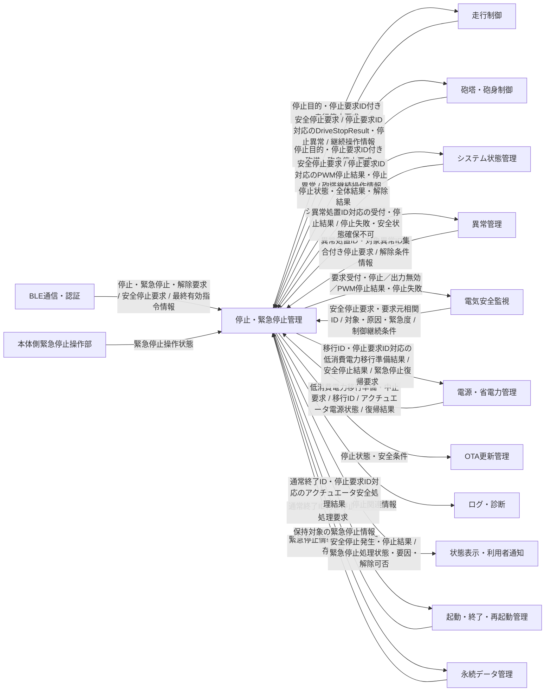

# Tank_Robot 停止・緊急停止管理基本設計

## 目次

1. 本書の目的
2. 停止・緊急停止管理の基本設計方針
3. 機能間連携およびインターフェース
4. 停止管理の共通処理
5. 通常停止管理
6. 安全停止管理
7. 緊急停止管理
8. 停止処理失敗および追加安全処理
9. 状態通知および記録との連携
10. 要求との対応
11. 詳細設計事項

---

## 1. 本書の目的
### 1.1 目的
本書は、Tank_Robotのシステム要求仕様およびシステムアーキテクチャに基づき、Tank_Robot本体における停止・緊急停止管理の基本設計を定義することを目的とする。

停止・緊急停止管理機能は、通常停止、安全停止および緊急停止を区別して管理し、停止要求の受付、停止目的・停止要求識別子・優先順位の管理、停止対象機能との連携、停止完了の判断、停止処理失敗時の追加安全処理、操作指令タイムアウトならびに緊急停止の維持・解除を管理する。

また、システムアーキテクチャおよび「システム状態管理基本設計」で定めた責任分担を前提として、走行制御、砲塔・砲身制御、システム状態管理、異常管理、電気安全監視、起動・終了・再起動管理ならびに関連機能との連携条件、機能間で受け渡す情報、処理の開始・完了および失敗時の扱いを具体化し、後続の詳細設計で具体的な実装を決定するための基本方針を定める。
### 1.2 対象範囲
本書では、Tank_Robot本体の停止・緊急停止管理に関する次の事項を対象とする。
- 通常停止、安全停止および緊急停止の区別
- 操作者および関連機能から提供される停止要求の受付
- 停止目的、停止要求識別子および要求元の相関識別情報の管理
- 複数の停止要求が成立した場合の停止種別および優先順位の管理
- 同一または異なる停止要求が近接して発生した場合の停止処理の管理
- 操作指令タイムアウトの監視および安全停止要求の生成
- 停止対象となる走行制御および砲塔・砲身制御への停止要求
- 走行停止および砲塔・砲身PWM出力停止の結果取得
- 通常停止、安全停止および緊急停止の停止完了判定
- 停止処理中に受信した新たな操作指令の扱い
- スマートフォンから受け付ける緊急停止要求
- 本体側緊急停止操作部からの緊急停止要求
- 本体側緊急停止操作に使用する独立した走行駆動停止経路との機能上の連携
- 現在のシステム状態によって緊急停止処理を直ちに完了できない場合の緊急停止要求の保持
- 緊急停止要因、安全状態および緊急停止解除条件の管理
- 再起動または電源再投入後にも必要となる緊急停止情報の引継ぎ
- 緊急停止解除要求の受付および解除条件の確認
- 停止処理失敗の判定および追加の停止処理
- 独立した走行出力無効化手段およびアクチュエータ駆動電源遮断との連携
- 停止種別、停止要因、停止結果、停止処理失敗および緊急停止解除結果の関連機能への提供

本体側緊急停止操作から走行駆動出力を禁止または無効化する独立した停止経路について、本書では停止・緊急停止管理機能との機能上の関係および基本方式を対象とする。
具体的な部品、端子、回路定数、配線および電気的仕様は、後続のハードウェア設計で定める。

また、ソフトウェアモジュール、タスク、関数、変数、具体的なデータ構造、イベントID、排他・同期の実装方法、タイマの具体的な実装、MCUのレジスタ設定およびドライバ内部処理は、本書の対象外とし、後続の詳細設計で定める。
### 1.3 上位文書・関連文書
#### 1.3.1 上位文書
本書は、次の文書を上位文書および共通設計文書として作成する。
- [`docs/00_project_overview/01_製品目的・製品目標.md`](../../../00_project_overview/01_製品目的・製品目標.md)
- [`docs/10_requirements/09. 停止・緊急停止.md`](../../../10_requirements/09.%20停止・緊急停止.md)
- [`docs/20_basic_design/00_Tank_Robot 基本設計について.md`](../../../20_basic_design/00_Tank_Robot%20基本設計について.md)
- [`docs/20_basic_design/01_システム構成/Tank_Robotシステム構成.md`](../../../20_basic_design/01_システム構成/Tank_Robotシステム構成.md)
- [`docs/20_basic_design/02_システムアーキテクチャ/Tank_Robotシステムアーキテクチャ.md`](../../../20_basic_design/02_システムアーキテクチャ/Tank_Robotシステムアーキテクチャ.md)

#### 1.3.2 関連するシステム要求仕様
停止および緊急停止時の状態遷移、操作要求、アクチュエータ制御、安全条件、異常処理、電源条件、情報保持ならびに他機能との連携については、必要に応じて次のシステム要求仕様を参照する。
- [`docs/10_requirements/01. 起動・終了・再起動.md`](../../../10_requirements/01.%20起動・終了・再起動.md)
- [`docs/10_requirements/02. システム状態管理.md`](../../../10_requirements/02.%20システム状態管理.md)
- [`docs/10_requirements/03. 電源・省電力管理.md`](../../../10_requirements/03.%20電源・省電力管理.md)
- [`docs/10_requirements/04. スマートフォンアプリ.md`](../../../10_requirements/04.%20スマートフォンアプリ.md)
- [`docs/10_requirements/05. BLE接続・認証.md`](../../../10_requirements/05.%20BLE接続・認証.md)
- [`docs/10_requirements/06. 所有者・操作端末管理.md`](../../../10_requirements/06.%20所有者・操作端末管理.md)
- [`docs/10_requirements/07. 走行制御.md`](../../../10_requirements/07.%20走行制御.md)
- [`docs/10_requirements/08. 砲塔・砲身制御.md`](../../../10_requirements/08.%20砲塔・砲身制御.md)
- [`docs/10_requirements/10. バッテリー・電気安全.md`](../../../10_requirements/10.%20バッテリー・電気安全.md)
- [`docs/10_requirements/14. ログ・診断.md`](../../../10_requirements/14.%20ログ・診断.md)
- [`docs/10_requirements/15. OTA更新.md`](../../../10_requirements/15.%20OTA更新.md)
- [`docs/10_requirements/17. 異常検出・復旧.md`](../../../10_requirements/17.%20異常検出・復旧.md)
- [`docs/10_requirements/18. 永続データ管理.md`](../../../10_requirements/18.%20永続データ管理.md)
- [`docs/10_requirements/20. セキュリティ管理.md`](../../../10_requirements/20.%20セキュリティ管理.md)
- [`docs/10_requirements/21. 状態表示・利用者通知.md`](../../../10_requirements/21.%20状態表示・利用者通知.md)
- [`docs/10_requirements/22. 性能・品質・耐久性.md`](../../../10_requirements/22.%20性能・品質・耐久性.md)

#### 1.3.3 関連する基本設計
- [`docs/20_basic_design/03_機能別基本設計/01_システム状態管理/Tank_Robotシステム状態管理基本設計.md`](../01_システム状態管理/Tank_Robotシステム状態管理基本設計.md)
- [`docs/20_basic_design/03_機能別基本設計/02_起動・終了・再起動管理/起動・終了・再起動管理基本設計.md`](../02_起動・終了・再起動管理/起動・終了・再起動管理基本設計.md)
- [`docs/20_basic_design/03_機能別基本設計/07_走行制御/走行制御基本設計.md`](../07_走行制御/走行制御基本設計.md)
- [`docs/20_basic_design/03_機能別基本設計/08_砲塔・砲身制御/砲塔・砲身制御基本設計.md`](../08_砲塔・砲身制御/砲塔・砲身制御基本設計.md)
- [`docs/20_basic_design/03_機能別基本設計/16_永続データ管理/永続データ管理基本設計.md`](../16_永続データ管理/永続データ管理基本設計.md)
- [`docs/20_basic_design/03_機能別基本設計/08_性能・品質・検証/Tank_Robot性能・品質・検証基本設計.md`](../08_性能・品質・検証/Tank_Robot性能・品質・検証基本設計.md)

本書の内容が製品目的・製品目標またはシステム要求仕様と矛盾する場合は、上位要求を優先する。

基本設計の過程でシステム要求仕様の不足、矛盾または変更が必要な事項が判明した場合は、本書で要求を暗黙に変更せず、システム要求仕様へのフィードバック事項として扱う。

機能の管理主体または最終判断主体がシステムアーキテクチャから一意に判断できない場合は、本書で独自に責任を割り当てず、システムアーキテクチャへのフィードバック事項として扱う。
## 2. 停止・緊急停止管理の基本設計方針
本章では、システム要求仕様に定められた通常停止、安全停止および緊急停止に関する要求を実現するため、システムアーキテクチャで定めた機能構成、役割・責任分担および管理・判断主体を前提として、停止・緊急停止管理に適用する基本設計方針を定める。

本章では、システムアーキテクチャで定めた責任分担を変更または再定義せず、停止要求の受付、停止種別および優先順位の管理、停止対象機能との連携、停止完了、停止処理失敗時の追加安全処理ならびに緊急停止の維持・解除に関する基本方式を定める。
### 2.1 役割・責任範囲
停止・緊急停止管理機能は、Tank_Robot本体の通常停止、安全停止および緊急停止、ならびに通常終了・低消費電力移行等に伴うアクチュエータ停止準備について、停止要求を受け付け、必要な停止処理を決定し、停止対象となる機能と連携して停止処理全体を管理する。

停止・緊急停止管理機能は、主に次の事項を担当する。
- 通常停止、安全停止および緊急停止の区別
- 停止要求の受付および停止要因の管理
- 停止取引ごとの停止目的、停止要求識別子および要求元の相関識別情報の管理
- 複数の停止要求が成立した場合の優先順位の管理
- 操作指令タイムアウトの監視および安全停止要求の生成
- 停止対象および適用する停止方法の決定
- 走行制御および砲塔・砲身制御への停止要求
- 停止対象機能から提供される停止結果の確認
- 停止処理全体の完了判定
- 停止処理が正常に完了しない場合の追加安全処理の管理
- 緊急停止要因、緊急停止状態の維持に必要な条件および解除条件の管理
- 停止結果、停止処理失敗および緊急停止解除結果の関連機能への提供
- 現在の安全停止・緊急停止状態を表す読み取り専用の`StopStatusSnapshot`および`stopStatusGeneration`の管理

停止・緊急停止管理機能は、左右DCモータへの具体的な駆動出力、砲塔旋回軸および砲身上下軸への具体的なPWM出力、システム状態遷移、異常の影響度および復旧可否の判断、電気的異常の検出ならびに各機能固有の内部処理を代行しない。

各関連機能は、自身が担当する処理および判断を実行し、停止・緊急停止管理機能が停止処理を管理するために必要な要求、状態または処理結果を提供する。
### 2.2 停止種別の管理
停止・緊急停止管理機能は、停止処理を次の3種類に区別して管理する。
- **通常停止**  
    操作者からの通常停止要求に基づき、通常操作の一部として走行を停止する処理とする。
- **安全停止**  
    通信断、操作指令タイムアウト、認証無効、異常または安全上の条件に基づき、走行および砲塔・砲身を安全状態へ移行するために実行する停止処理とする。
- **緊急停止**  
    操作者による明示的な緊急停止操作に基づき、安全確保を最優先としてアクチュエータを停止し、所定の解除条件および明示的な解除操作が成立するまで通常操作を禁止する停止処理とする。

停止・緊急停止管理機能は、受け付けた要求および停止要因に基づいて停止種別を識別し、当該停止種別に対応する停止処理を管理する。

停止種別とは別に、停止取引の目的を管理する。停止目的は少なくとも、通常停止、安全停止、緊急停止、通常終了準備および低消費電力移行準備を区別できるものとする。通常終了準備および低消費電力移行準備は新たな停止種別ではなく、それぞれの上位シーケンスに必要なアクチュエータ停止・電力変更準備を相関して管理するための目的情報とする。

通常停止および安全停止はシステム状態として追加せず、停止・緊急停止管理機能が管理する停止処理として扱う。

緊急停止については、停止・緊急停止管理機能が緊急停止処理、停止完了、緊急停止要因、維持条件および解除条件を管理し、システム状態としての緊急停止状態およびその状態遷移はシステム状態管理機能が管理する。
### 2.3 停止処理の優先順位
複数の停止要求が同時または近接して成立した場合は、次の順で優先する。
1. 緊急停止
2. 安全停止
3. 通常停止

実行中の停止処理より優先度の高い停止要求が成立した場合は、より優先度の高い停止処理に必要な安全処理を優先する。

同一の停止要求を複数回受け付けた場合は、同じ停止処理を多重に開始しない。

停止要求の競合時に、優先度の低い要求を処理したことによって、より優先度の高い停止要求またはその発生要因を失わない。

停止処理の優先制御は、通常操作、通信、ログ記録、状態表示、設定処理、その他の非安全関連処理の完了待ちによって阻害しない。
### 2.4 システム状態管理との責任分担
停止・緊急停止管理機能は、通常停止、安全停止および緊急停止に必要な停止処理ならびに緊急停止の維持・解除を管理し、その結果をシステム状態管理機能へ提供する。

システム状態管理機能は、停止・緊急停止管理機能から提供される停止結果、緊急停止解除結果およびその他の必要な情報に基づいて、システム状態および状態遷移を管理する。

通常停止および安全停止はシステム状態として追加せず、緊急停止状態への遷移および緊急停止状態からの遷移はシステム状態管理機能が管理する。
### 2.5 走行制御・砲塔／砲身制御との責任分担
停止・緊急停止管理機能は、停止種別、停止目的、停止対象および必要な停止方法に基づいて、走行制御機能ならびに砲塔・砲身制御機能へ停止要求を提供する。

走行制御機能および砲塔・砲身制御機能は、自身が担当するアクチュエータについて、同じ停止要求識別子に対応する停止処理、新規出力禁止、保留中指令の破棄その他の局所処理を実行し、自身が確認可能な範囲の受付状態、進行状態、局所完了、失敗または中止結果を停止・緊急停止管理機能へ提供する。

停止・緊急停止管理機能は、各アクチュエータの具体的な出力値、PWM生成、モータドライバ制御、その他のアクチュエータ固有処理を直接実行しない。

走行制御が返す`DriveStopResult`は、左右の新規通常走行指令禁止、未実行通常指令破棄、左右目標出力および適用出力の零化、モータドライバへの零出力または停止要求の反映結果、旧非零ドライバ要求の不存在、ソフトウェア走行出力禁止状態、および確認手段がある場合の独立出力禁止状態等の**走行制御が確認可能な制御側・ドライバ応答側の証拠**を示す。エンコーダ等による実速度フィードバックを持たない構成では、この結果を車体速度零または物理的完全停止を実測確認した結果へ読み替えない。停止距離、停止時間、滑り、転倒および停止後の残留移動は、走行制御基本設計と実機評価で成立性を確認する。

砲塔・砲身制御がPWM出力停止を確認した結果は、砲塔・砲身制御の制御側出力が停止したことを示す局所証拠として扱う。位置または速度を直接取得するセンサを備えない構成では、この結果を砲塔・砲身の機械的な完全停止を実測確認した結果へ読み替えない。PWM停止後の機構上の安全性、無信号時挙動、電源遮断時挙動および逆給電等は、砲塔・砲身制御、電源・ハードウェア設計および実機評価で成立性を確認する。

停止・緊急停止管理機能は、各機能から提供された局所結果に基づいて停止取引全体の完了可否を集約して判断する。各アクチュエータ制御機能は、自身が直接確認できないシステム全体の停止完了を確定しない。
### 2.6 異常管理・電気安全監視との責任分担
異常管理機能は、異常に対する処置として安全停止が必要と判断した場合、停止・緊急停止管理機能へ停止要求を提供する。

電気安全監視機能は、電気安全上、安全停止が必要な条件を検出した場合、停止・緊急停止管理機能へ安全停止要求を提供する。

停止・緊急停止管理機能は、これらの要求に基づいて必要な停止処理を管理し、停止結果または停止処理失敗を要求元を含む関連機能へ提供する。電気安全監視機能から受け付けた危険過電流を原因とする安全停止が失敗した場合は、異常管理機能の処置判断を待たず、停止失敗および確認できている停止状態を電気安全監視機能へ直接提供する。

異常の影響度、処置および復旧可否の判断ならびに電気的異常の判定および電気的保護の要否は、それぞれを担当する機能が管理し、停止・緊急停止管理機能は重複して判断しない。
### 2.7 安全関連処理の優先
停止・緊急停止管理機能が管理する安全停止および緊急停止は、通常操作および非安全関連処理より優先して実行する。

緊急停止または安全停止に必要な処理は、Wi-Fi、インターネット、VPSへの接続、ログ保存、状態表示、設定処理、その他の非安全関連処理の完了を条件としない。

走行制御および砲塔・砲身制御は、安全停止または緊急停止要求を受け付けた場合、新たな通常操作より停止処理を優先する。

安全停止または緊急停止の開始後は、新たな走行指令および砲塔・砲身操作指令を実行しない。

本体側緊急停止操作については、ソフトウェアによる通常の停止管理とは別に、システム構成およびシステムアーキテクチャで定める独立した走行駆動停止経路を使用する。

独立した走行駆動停止経路による安全確保は、BLE、Wi-Fi、インターネット、VPSまたはモータドライバとの通常通信の成立を前提としない。
## 3. 機能間連携およびインターフェース
本章では、停止・緊急停止管理機能が停止処理を管理するために、関連機能から受け取る停止要求および状態、関連機能へ提供する停止要求、ならびに停止処理の結果として受け渡す情報と、その連携関係を定める。

本章で定めるインターフェースは、機能間で受け渡す情報および連携関係を示すものであり、関数呼出し、イベント、メッセージ、共有メモリ、タスク間通信、その他の具体的なソフトウェア実装方式を規定しない。
### 3.1 機能間連携の基本方針
停止・緊急停止管理機能は、停止要求を発生させる機能、停止対象となる機能および停止結果を使用する機能との間で、停止処理に必要な要求、状態および処理結果を明示的に受け渡す。

停止要求を発生させる各機能は、自身が担当する条件を判断した上で停止・緊急停止管理機能へ停止要求を提供する。

停止・緊急停止管理機能は、受け付けた停止要求に基づいて停止種別、停止目的、優先順位、停止対象および停止方法を管理し、停止対象となる機能へ必要な停止要求を提供する。

停止対象となる機能は、自身が担当する停止処理を実行し、同じ停止要求識別子に対応する局所結果を停止・緊急停止管理機能へ提供する。

停止・緊急停止管理機能は、各機能から提供された結果に基づいて停止取引全体の状態および完了可否を管理し、その結果を必要とする関連機能へ提供する。

安全停止および緊急停止に必要な情報の受け渡しは、通常操作、状態通知、ログ記録その他の非安全関連処理の完了を前提としない。
### 3.2 停止処理に関して受け取る情報
停止・緊急停止管理機能は、停止処理の開始または継続判断に必要な情報として、主に次の情報を受け取る。
#### BLE通信・認証から受け取る情報
- 認証済みかつ必要な権限が確認された通常停止要求
- 認証済み操作端末からの緊急停止要求
- 認証済み操作端末からの緊急停止解除要求
- BLE切断、認証無効、操作権限無効または通常操作を継続できないBLE通信異常に伴う安全停止要求
- 操作指令タイムアウト判定に使用する、対象操作、操作セッション、受信順序または要求識別情報、BLE受信時刻および制御機能の受付結果と対応付いた最終有効受信情報

操作指令タイムアウト判定に使用する最終有効受信情報の通信側正本はBLE通信・認証が管理する。BLE通信・認証は、通信上の妥当性、認証および必要な操作権限の確認に加えて、対応する走行制御または砲塔・砲身制御が当該指令のペイロード意味および受付可否を確認した結果を反映し、タイムアウト更新対象として成立した指令だけで最終有効受信情報を更新する。停止・緊急停止管理機能は、BLE受信時刻、制御側の別時刻または過去の受信情報から独自の最終有効受信情報を再構成しない。
#### 走行制御から受け取る情報
- 安全な走行を継続できない場合の安全停止要求
- 走行停止処理に関する異常情報
- 走行が継続操作中であること、および当該継続操作の対象セッション・操作世代または同等の相関情報
- 走行停止要求識別子に対応する`DriveStopResult`。少なくとも新規走行指令禁止、未実行指令破棄、左右目標・適用出力零、モータドライバ零出力反映、旧非零要求不存在、ソフトウェア出力禁止、独立停止経路の確認可否、証拠範囲、`powerChangeReady`を区別する
#### 砲塔・砲身制御から受け取る情報
- 安全な砲塔・砲身動作を継続できない場合の安全停止要求
- 砲塔・砲身停止処理に関する異常情報
- 砲塔旋回が継続操作中であること、および当該継続操作の対象セッション・操作世代

走行および砲塔旋回の操作指令タイムアウト判定では、BLE通信・認証が通信側正本として提供する最終有効受信情報と、それぞれの制御機能が提供する継続操作中情報・対象セッション・操作世代を対応付ける。走行制御または砲塔・砲身制御から別の最終受信時刻を受け取って正本を二重化しない。
#### 電気安全監視から受け取る情報
- 電気安全上、安全停止が必要と判断された場合の安全停止要求
- 要求元が管理する電気安全停止要求識別子または同等の相関識別情報、および対応する電気安全事象識別子
- 安全停止の対象となる電源系統またはアクチュエータ
- 低電圧、危険過電流その他の安全停止原因、および要求の緊急度
- 停止処理中にも継続している危険状態
- 安全停止・終了制御継続可能
#### 異常管理から受け取る情報
- 異常処置要求識別子および対象異常識別子集合を伴う、異常に対する処置として必要となる安全停止要求
- 緊急停止解除条件の確認に必要な、通常操作再開を禁止する異常の有無
- 異常通知取引識別子に対応する通知受付結果、確定異常識別子および主通知完了可否
#### システム状態管理から受け取る情報
- 停止処理または緊急停止処理の実行条件を判断するために必要な現在のシステム状態および状態条件
#### 本体側緊急停止操作部から受け取る情報
- 本体側緊急停止操作が行われていること
- 本体側緊急停止操作部が、操作者によって緊急停止操作前の位置へ戻されていること
- 本体側緊急停止操作部からの入力信号が正常であり、緊急停止操作が解除されていることを確認できること

本体側緊急停止操作部による独立した走行駆動停止そのものは、本項のインターフェースによる通知の成立を前提としない。
#### 起動・終了・再起動管理から受け取る情報
- 通常終了識別子を伴う、通常終了準備目的のアクチュエータ停止・電力変更準備要求
- 強制電源遮断時に、電源供給停止前に実行可能なアクチュエータの停止または出力無効化要求、および取得可能な相関識別情報
#### 電源・省電力管理から受け取る情報
- 移行識別子を伴う低消費電力移行準備要求および中止要求
- アクチュエータ電源の実状態
- 緊急停止処理に必要な復帰要求識別子に対応する復帰正常完了、失敗または不明結果
#### 永続データ管理から受け取る情報
- 再起動または電源再投入後に引き継ぐ緊急停止情報およびその読出し結果
- 緊急停止情報の保存または更新結果
### 3.3 アクチュエータ制御機能へ提供する停止要求
停止・緊急停止管理機能は、決定した停止種別、停止目的および停止方法に基づいて、停止対象となる機能へ停止要求を提供する。

通常停止では、走行制御機能へ通常停止用の走行停止要求を提供する。

安全停止および緊急停止では、走行制御機能へ安全優先の走行停止要求を提供するとともに、砲塔・砲身制御機能へ砲塔旋回軸および砲身上下軸の出力停止要求を提供する。

通常終了準備または低消費電力移行準備では、上位シーケンスで必要な停止対象と電力変更準備条件に基づいて、必要な局所停止・出力無効化・保留指令破棄・電力変更準備を各アクチュエータ制御機能へ要求する。既に要求された局所状態を満たしている場合は、同じ物理停止を再実行させず、既存の停止状態を根拠として準備結果を返せるものとする。

停止対象となる機能へ提供する情報には、少なくとも次の情報を含める。
- 停止要求識別子
- 停止要求
- 停止種別
- 停止目的
- 適用する停止方法の区分
- 停止対象
- 停止状態の維持要求
- 要求元の通常終了識別子、低消費電力移行識別子、異常処置要求識別子、電気安全事象識別子その他の上位相関識別情報のうち、当該停止取引との対応確認に必要な情報

停止・緊急停止管理機能は、新しい停止取引ごとに単調増加する停止要求識別子を一つ割り当て、要求受付、実行中、局所結果の集約、全体完了、失敗または中止まで同じ識別子で相関する。要求元が管理する識別子は停止要求識別子で置き換えず、停止要求識別子との対応を保持する。

停止対象機能は、同じ停止要求識別子について、少なくとも受付済み、処理中、局所完了、失敗または中止を区別できる意味の結果を返せるものとする。具体的な列挙値、API名および通知方式は詳細設計で定める。

電気安全監視機能から受け付けた要求では、停止要求識別子と要求元の電気安全停止要求識別情報および電気安全事象識別子を対応付け、重大度変更または複数事象の同時成立時も要求元事象を一意に識別する。緊急停止処理に必要な復帰要求には復帰要求識別子を付け、電源・省電力管理機能の復帰結果と対応付ける。低消費電力移行準備要求、受付、正常完了、失敗および中止結果には同じ移行識別子を含める。識別子の具体値、データ形式および通知方式は詳細設計で定める。

異常管理機能から受け付けた安全停止要求については、異常処置要求識別子と対象異常識別子集合を一つの停止要求識別子へ対応付ける。受付、正常完了、失敗または中止結果には三者を含め、対象異常識別子集合に含まれない異常へ当該結果を適用しない。処理中に別の異常処置要求を受けた場合は、停止動作を不要に多重開始せず、新しい要求との対応だけを追加して各要求へ個別に結果を返す。

通常終了準備では、起動・終了・再起動管理機能から受け取った通常終了識別子と停止要求識別子を対応付ける。同じ通常終了識別子に対して、既に実行中または完了済みの停止取引が要求する物理停止を満たしている場合は、停止動作を重複して開始せず、現在の局所結果を当該通常終了識別子へ対応付けて集約する。

低消費電力移行準備では、電源・省電力管理機能が管理する移行識別子と停止要求識別子を対応付ける。既に必要なアクチュエータ停止状態が成立している場合は、同じ停止を再実行せず、各担当機能が電力変更準備完了を確認した結果を集約する。
### 3.4 関連機能から取得する停止結果
停止・緊急停止管理機能は、停止処理の進行および完了を判断するため、走行制御機能ならびに砲塔・砲身制御機能から、同じ停止要求識別子に対応する局所停止結果を取得する。

走行制御機能からは、`DriveStopResult`として少なくとも次の判断に必要な情報を取得する。
- 新しい通常走行指令が禁止されていること
- 未実行の通常走行指令が破棄されていること
- 左右の目標出力が0であること
- 左右の適用出力が0であること
- モータドライバへ左右0出力または停止要求を反映し、その取引結果を確認できていること
- 未完了の旧非零モータドライバ要求が存在しないこと
- ソフトウェア走行出力許可が禁止されていること
- 独立した走行出力禁止経路の状態を確認できる場合は、その確認結果。確認手段がない場合は確認不能として区別すること
- 通常終了または低消費電力移行で必要な場合、`powerChangeReady`が成立していること
- 局所結果の証拠範囲
- 停止処理を正常に完了できないこと

走行制御の局所完了は上記の制御側・モータドライバ応答側の確認を根拠とし、車体速度零または物理的な完全停止の実測確認を意味しない。エンコーダ等を使用しない現行構成では、実速度は`UNKNOWN`として扱う。停止・緊急停止管理機能は、評価済み停止時間の経過だけを独自に実速度零の測定値へ変換しない。

砲塔・砲身制御機能からは、少なくとも次の判断に必要な情報を取得する。
- 砲塔旋回軸へのPWM出力が停止していること
- 砲身上下軸へのPWM出力が停止していること
- PWM出力停止状態を維持できていること
- 保留中の通常操作指令を破棄し、新規PWM出力が禁止されていること
- 通常終了または低消費電力移行で必要な場合、砲塔・砲身側の電力変更準備が完了したこと
- 停止処理を正常に完了できないこと

各局所結果は、自機能が直接確認できる制御側証拠の範囲を示すものとする。砲塔・砲身制御からのPWM停止結果は機械的な完全停止の実測結果ではなく、停止・緊急停止管理機能もこれを機械的位置または速度の実測確認へ読み替えない。

停止・緊急停止管理機能は、取得した局所結果に基づいて、停止目的および停止種別ごとに必要な停止対象の処理が完了したかを集約して判断する。
### 3.5 停止状態・停止結果として提供する情報
停止・緊急停止管理機能は、自身が管理する停止状態および停止結果を、それらを必要とする関連機能へ提供する。
停止取引に対する受付、実行中、全体完了、失敗または中止の結果は、停止要求識別子および必要な要求元相関識別情報と対応付ける。

#### 現在の停止状態の提供（StopStatusSnapshot）

個々の停止取引に対する処理結果（RESULT）とは別に、現在の安全停止・緊急停止状態を、読み取り専用の`StopStatusSnapshot`として関連機能へ提供する。

スナップショットは、同じ世代に対応する一組の情報である。その情報の意味を定め、更新するのは停止・緊急停止管理機能とする。参照する機能は、内容を書き換えない。

少なくとも次の情報を、同じ世代の組として含める。

- `safeStopActive`
- `safeStopCauseClass`
- `safeStopCompleted`
- `emergencyStopActive`
- `emergencyStopReleaseAllowed`
- `emergencyStopReleaseBlockReason`
- `stopStatusGeneration`
- スナップショットの有効性および適用対象となる起動単位識別情報

##### 世代値の有効範囲と初期値

`stopStatusGeneration`は、本体アプリケーションの同一起動内で有効な32ビット符号なし整数（uint32）とする。

- 0は、スナップショットが未確立であることを示す予約値とする。
- 初回の有効なスナップショットを公開するときは、1から開始する。

##### 世代を更新する場合

次のように、関連機能へ公開するスナップショットの内容の意味が変化したときは、世代値を1回進め、更新後の全項目とともに公開する。

- 安全停止の開始・終了・完了状態が変化した場合。
- 緊急停止の成立・維持・解除の状態が変化した場合。
- 解除可否または解除阻害理由などが変化した場合。

##### 世代を更新しない場合

次の場合は、世代値を進めない。

- 単にスナップショットを再参照した場合。
- 意味が変化しない重複要求を受けた場合。
- 同じ停止取引の結果を再通知した場合。

##### 上限到達時と比較時の注意

上限を超えて値が循環する場合も、0を使用しない。

スナップショットは原子的に公開し、異なる世代の項目が混在しないようにする。
参照する機能は、異なる本体アプリケーション起動の値を、起動単位識別情報なしに単純比較しない。

##### 停止要求識別子との違い

`stopRequestId`は、個々の停止取引について、受付から完了までの処理と結果を対応付ける識別子である。
スナップショットの世代を表す`stopStatusGeneration`の代替として使用しない。

#### システム状態管理へ提供する情報

- 停止処理の状態および結果
- 緊急停止処理の完了結果
- 緊急停止状態の維持に必要な情報
- 緊急停止解除可否および解除処理結果

#### 異常管理へ提供する情報

- 異常通知取引識別子、予約済みの場合は異常識別子、停止処理失敗および追加安全処理の結果
- 通常の停止手段または追加の停止手段によって安全状態を確保できないことを示す情報
- 異常管理機能から受けた安全停止について、異常処置要求識別子、対象異常識別子集合および停止要求識別子に対応する受付、正常完了、失敗または中止結果

#### 電気安全監視へ提供する情報

- 停止要求識別子、要求元の電気安全停止要求識別情報および電気安全事象識別子に対応する安全停止要求の受付状態
- 同じ識別情報に対応する走行停止、走行出力無効化ならびに砲塔旋回軸および砲身上下軸のPWM出力停止の状態および結果
- 同じ識別情報に対応する停止処理失敗、および独立した走行出力無効化手段による追加安全処理の結果

#### 電源・省電力管理へ提供する情報

- 移行識別子および停止要求識別子に対応する低消費電力移行準備の受付、正常完了、失敗または中止結果
- 安全停止結果
- 低消費電力状態で緊急停止処理に必要な復帰要求識別子を伴う復帰要求

#### OTA更新管理へ提供する情報

- OTA更新の安全条件確認に必要な停止状態および停止結果

#### 起動・終了・再起動管理へ提供する情報

- 通常終了識別子および停止要求識別子に対応する、通常終了準備の受付、処理中、アクチュエータ安全処理の全体完了、失敗または中止結果
- 強制電源遮断時に要求された制御側安全処理について、取得可能な停止・出力無効化結果および相関識別情報

#### 永続データ管理へ提供する情報

- 再起動または電源再投入後も保持する必要がある緊急停止情報

#### ログ・診断へ提供する情報

安全停止、緊急停止および停止処理失敗について、少なくとも次の情報を提供する。

- 停止種別
- 停止目的
- 停止要求識別子
- 発生要因
- 発生時のシステム状態
- 停止結果

#### 状態表示・利用者通知へ提供する情報

- `StopStatusSnapshot`として提供する`safeStopActive`、`safeStopCauseClass`および`safeStopCompleted`
- 同じスナップショットとして提供する`emergencyStopActive`、`emergencyStopReleaseAllowed`および`emergencyStopReleaseBlockReason`
- 停止・緊急停止管理機能が確定した`stopStatusGeneration`、スナップショットの有効性および適用対象となる起動単位識別情報

停止・緊急停止管理機能は、ログへの保存方法、表示内容または表示優先順位を管理せず、各機能が必要とする停止関連情報を提供する。

#### 安全停止中に安全条件が失われた場合

安全停止中に「安全停止・終了制御継続可能」が不成立または不明となった場合は、制御出力を新たに発生させる停止方式を継続しない。
直ちに、利用可能な出力無効化および独立停止経路へ切り替える。

停止・緊急停止管理機能は、その結果を停止要求識別子および電気安全事象識別子に対応付けて電気安全監視機能へ返す。
電気安全監視機能による上位の電源保護または遮断判断を待たせない。

#### 低消費電力移行準備要求への応答

##### 正常完了を返す条件

低消費電力移行準備要求を受け付けた場合は、同じ移行識別子および停止要求識別子に対応する各担当機能の局所結果を用いて、次の条件をすべて確認する。
取得する局所結果の詳細は、3.4「関連機能から取得する停止結果」に従う。

- 実行中の停止処理と競合しないこと。
- 走行制御の`DriveStopResult`から、左右モータについて必要な制御側停止条件と`powerChangeReady`が成立していることを確認できること。
- 砲塔・砲身制御が、PWM停止・指令無効化などに基づき、電力変更準備が完了したと判断していること。

すべての条件が成立した場合だけ、正常完了結果を返す。

##### 停止結果が示す範囲

この正常完了結果は、走行の実速度が零であること、または砲塔・砲身が機械的に完全停止したことをセンサで観測した結果ではない。
電力変更後の物理的安全性は、走行制御、砲塔・砲身制御および電源・ハードウェア設計の成立条件に従う。

##### 失敗または優先要求がある場合

次のいずれかに該当する場合は、低消費電力移行準備を正常完了としない。

- 緊急停止、安全停止その他の上位優先要求が成立した場合。
- 必要な状態を確認できない場合。
- 準備処理が失敗した場合。

この場合は、失敗または中止結果を返して、上位優先処理を実行する。

##### 中止要求への対応

電源・省電力管理機能から同じ移行識別子の中止要求を受けた場合は、低消費電力移行のためだけに開始した未完了処理を安全に中止し、その結果を返す。

中止要求または結果の待機によって、緊急停止その他の安全処理を遅延させない。

### 3.6 主な関連機能との連携
停止・緊急停止管理機能と主な関連機能との関係を次に示す。

本図は機能間の連携関係を示すものであり、具体的なソフトウェア通信方式またはハードウェア配線を示すものではない。

また、本体側緊急停止操作部から走行駆動出力を禁止または無効化する独立した停止経路は、本図に示す停止・緊急停止管理機能への状態通知とは別に成立するものとする。
## 4. 停止管理の共通処理
本章では、通常停止、安全停止および緊急停止に共通する、停止要求の受付、停止種別の決定、複数要求の競合、重複要求の扱い、停止処理中の操作指令および停止完了判定の基本方式を定める。

通常停止、安全停止および緊急停止に固有の開始条件、停止対象および処理手順は、後続の各章で定める。
### 4.1 停止要求の受付
停止・緊急停止管理機能は、3章に定める関連機能および本体側緊急停止操作部から、停止処理に必要な要求および情報を受け取る。

停止要求を受け取った場合は、要求元、要求内容および発生要因を確認し、新しい停止取引として扱う場合は停止要求識別子を割り当て、停止目的、停止種別、優先順位、停止対象および必要な停止処理を判断する。要求元が管理する通常終了識別子、低消費電力移行識別子、異常処置要求識別子、電気安全事象識別子その他の相関識別情報がある場合は、停止要求識別子との対応を保持する。

BLE通信・認証から受け取る通常停止要求および緊急停止要求は、BLE通信・認証側で認証、操作権限および通信上の妥当性が確認された要求を使用する。
停止・緊急停止管理機能では、これらを重複して確認しない。

安全停止要求は、BLE通信・認証、走行制御、砲塔・砲身制御、電気安全監視または異常管理が、それぞれの担当範囲で安全停止が必要と判断した場合に受け取る。
停止・緊急停止管理機能は、その判断結果を受けて必要な停止処理を管理する。

本体側緊急停止操作では、停止・緊急停止管理機能による処理とは独立して、走行駆動出力を禁止または無効化する。
独立した走行駆動停止経路は、停止・緊急停止管理機能による緊急停止処理の開始を待たずに動作する。

通常終了では、起動・終了・再起動管理機能から、通常終了識別子を伴う通常終了準備目的のアクチュエータ停止・電力変更準備を要求される。停止・緊急停止管理機能は、当該通常終了識別子を停止要求識別子と相関し、走行制御および砲塔・砲身制御の局所結果を集約して通常終了準備の全体結果を返す。

低消費電力移行では、電源・省電力管理機能から、移行識別子を伴う低消費電力移行準備要求を受ける。停止・緊急停止管理機能は、当該移行識別子を停止要求識別子と相関し、必要なアクチュエータ停止・電力変更準備を集約する。既に必要な停止状態が成立している場合は、同じ物理停止を重複して実行しない。

強制電源遮断では、起動・終了・再起動管理機能から、電源供給停止前に実行可能なアクチュエータの停止または出力無効化を要求される。この処理結果を取得可能な範囲で相関して返すが、停止・安全処理の完了待ちによって強制電源遮断を遅延させない。

通常終了準備、低消費電力移行準備または強制電源遮断前の制御側安全処理は、それらを理由として通常停止、安全停止または緊急停止の発生としては扱わない。
### 4.2 停止種別の決定
停止・緊急停止管理機能は、停止要求の発生元および発生要因に基づいて、停止種別を次のように決定する。

|停止種別|主な成立条件|
|---|---|
|通常停止|認証済みかつ必要な操作権限が確認された操作端末から、有効な通常停止要求を受け付けた場合|
|安全停止|操作指令タイムアウトを検出した場合、またはBLE通信・認証、走行制御、砲塔・砲身制御、電気安全監視もしくは異常管理から安全停止要求を受け付けた場合|
|緊急停止|認証済み操作端末から有効な緊急停止要求を受け付けた場合、または本体側緊急停止操作が成立した場合|

停止種別を決定した後は、当該停止種別に対応する停止対象および停止方法を使用して停止処理を管理する。

安全停止の発生要因ごとに異なる停止種別を追加せず、安全停止として共通に管理する。

緊急停止と異常、安全停止条件、その他の停止要因が同時に存在する場合は、実行する停止種別とは別に、それぞれの発生要因を失わず管理する。

通常終了準備または低消費電力移行準備に伴うアクチュエータ安全処理要求は、本項の停止種別の決定対象とはせず、その停止目的に必要なアクチュエータ停止・電力変更準備として管理する。
### 4.3 複数停止要求の競合および優先処理
通常停止、安全停止および緊急停止の複数の停止要求が同時または近接して成立した場合は、次の優先順位を適用する。
1. 緊急停止
2. 安全停止
3. 通常停止

実行中の停止処理より優先度の高い停止要求を受け付けた場合は、実行中の停止処理の完了を待たず、より優先度の高い停止処理に必要な処理を優先する。

優先度の高い停止処理へ切り替える場合でも、それまでに受け付けた停止要因のうち、緊急停止の維持、異常管理、記録、その他の後続処理に必要な要因を失わない。

同じ停止対象に対して既に実行中または完了済みの局所停止処理が、後から受け付けた要求に必要な停止状態を満たす場合は、同じアクチュエータに対する物理停止処理を不要に重複して開始しない。必要な場合は、新しい停止要求識別子または要求元相関識別情報と既存の局所結果との対応を追加し、上位要求ごとの結果を返す。

通常終了準備または低消費電力移行準備に伴うアクチュエータ安全処理中に、安全停止または緊急停止が必要となった場合は、安全停止または緊急停止に必要な処理を優先する。

強制電源遮断では、停止・安全処理の完了を強制電源遮断の前提条件としない。
### 4.4 重複する停止要求の扱い
同一の停止要求を複数回受け付けた場合は、同じ停止処理を多重に開始しない。

同一の停止要求識別子または同一の要求元相関識別情報に対応する停止取引を実行中に、同一の発生要因による同一目的の停止要求を再度受け付けた場合は、新たな停止処理を開始せず、実行中の停止処理を継続して現在の取引状態を返す。

同一の停止種別または停止目的であっても、異なる発生要因による停止要求を受け付けた場合は、新たな停止処理を不要に多重起動せず、後続の停止管理に必要となる発生要因および要求元相関識別情報を失わず保持する。

実行中の停止処理より優先度の高い停止要求を受け付けた場合は、重複要求として扱わず、4.3に定める優先処理を行う。

本体側緊急停止操作が継続している場合は、同じ緊急停止処理を繰り返し開始せず、緊急停止要因が継続している状態として管理する。
### 4.5 停止中の新規操作指令の扱い
安全停止または緊急停止を開始した後は、新たな走行指令および砲塔・砲身操作指令を実行しない。

通常停止の開始後は、走行停止処理が完了するまで新たな走行駆動を開始しない。
通常停止は走行のみを対象とするため、通常停止要求だけを理由として砲塔・砲身操作を停止対象へ追加しない。

停止処理中に受信し、停止処理または現在の操作許可条件によって実行されなかった操作指令は、停止処理完了後に自動的に実行しない。

通常操作を再開できる場合は、停止処理完了後の現在のシステム状態、認証状態、操作権限、安全条件、その他の操作許可条件を満たした上で、新たに受信した有効な操作指令を使用する。走行指令はさらに、停止開始時に走行制御が更新し、BLE接続・認証が現在の操作contextとして通知した`driveEpoch`をwire上の`actuationEpoch`に含み、当該通知後の新しい利用者入力から生成されたものだけを再開対象とする。停止前のepochを持つ遅延指令、送信待ち指令または再送指令を、同じBLE session内で`commandSeq`が未受信の値であることだけを理由に新しい指令として扱わない。

通常終了または低消費電力移行に伴うアクチュエータ安全処理中の通常操作可否は、システム状態管理、起動・終了・再起動管理および電源・省電力管理で定める条件に従い、停止・緊急停止管理機能が独自に通常操作を許可しない。
### 4.6 停止完了判定の基本方式
停止・緊急停止管理機能は、停止対象となる各機能から同じ停止要求識別子に対応する局所結果を取得し、停止目的または停止種別ごとに要求した制御側停止処理の全体完了を判定する。

走行停止については、走行制御機能の`DriveStopResult`から、停止目的に応じて必要な次の条件を確認した場合に、走行制御側の局所停止処理が完了したものとして扱う。
- 新規通常走行指令禁止および未実行通常指令破棄が成立していること
- 左右目標出力および適用出力が0であること
- モータドライバへの零出力または停止要求の反映結果を確認できていること
- 未完了の旧非零ドライバ要求が存在しないこと
- ソフトウェア走行出力禁止状態を維持できること
- 通常終了・低消費電力移行では必要に応じて`powerChangeReady`が成立していること

本項の走行停止完了は制御側・モータドライバ応答側の局所結果であり、車体速度零または物理的な完全停止の実測結果ではない。走行停止方法の物理的成立性は、走行制御基本設計に定める停止方式について停止距離・停止時間・滑り・転倒・電流・機構影響を実機評価して確認する。

砲塔・砲身停止については、砲塔・砲身制御機能から、砲塔旋回軸および砲身上下軸へのPWM出力が停止し、新しいPWM出力が禁止されていることを確認した場合に、砲塔・砲身制御側の停止処理が完了したものとして扱う。

砲塔・砲身制御側の停止処理完了は、PWM出力停止を制御側で確認した結果であり、位置または速度センサを持たない構成における機械的な完全停止の実測確認を意味しない。安全停止・緊急停止・電力変更時に必要な機構上の安全性は、サーボ無信号時挙動、PWM停止、電源状態、機構条件および実機評価を組み合わせて成立させる。

通常停止は走行のみを停止対象とするため、走行制御側の停止処理完了を確認した場合に通常停止取引が完了したものと判定する。

安全停止および緊急停止は、走行制御側の停止処理ならびに砲塔・砲身制御側のPWM出力停止処理の両方について必要な局所結果を確認した場合に、停止・緊急停止管理が担当するアクチュエータ停止取引が完了したものと判定する。

通常終了準備または低消費電力移行準備では、上位シーケンスで要求された局所停止結果に加え、各対象機能から必要な電力変更準備完了結果を取得した場合に、停止・緊急停止管理が担当する準備取引を完了とする。実際の電源系統のON/OFFおよびその実状態の管理は電源・省電力管理機能の責任とする。

停止対象の一部について必要な局所結果を取得できない場合、停止処理が失敗した場合、または要求した制御側停止状態を確認できない場合は、停止取引を正常完了したものとして扱わない。

停止取引の制御側完了監視には、次の基本設計初期値を使用する。

| 制御側metric ID | 停止種別 | 監視起点 | 制御側停止取引の完了監視上限 |
| --- | --- | --- | ---: |
| `T_CTRL_NORMAL_STOP_TX_MAX` | 通常停止 | 有効な通常停止要求を受け付け、通常停止取引を開始した時点 | 500 ms |
| `T_CTRL_SAFE_STOP_TX_MAX` | 安全停止 | 安全停止条件が成立し、安全停止取引を開始した時点 | 300 ms |
| `T_CTRL_ESTOP_TX_MAX` | 緊急停止 | 有効な緊急停止要求が成立し、緊急停止取引を開始した時点 | 300 ms |

これらのmetricと値は本書を正本とし、4.6に定める制御側停止結果を取得して停止取引を完了するまでの監視上限を表す。車体の実速度零または砲塔・砲身の機械的完全停止を実測する時間ではない。監視上限内に必要な局所結果を集約できない場合は8.1に従って停止処理失敗と判定する。

操作指令タイムアウトは最後の有効な操作指令受信から300 msで成立し、その後の安全停止取引を`T_CTRL_SAFE_STOP_TX_MAX`以内に制御側完了させる。このため、操作指令タイムアウト起因の安全停止について、最後の有効な操作指令受信から4.6の制御側停止取引を完了するまでのmetricを`T_CTRL_COMMAND_TIMEOUT_TO_TX_MAX`とし、600 ms以内を初期基本設計基準とする。

停止出力の更新開始に関する上位時間要求は、前記の停止完了監視上限とは別に満たす。通常停止または安全停止条件の検出から走行停止出力更新開始まで100 ms以内、本体側緊急停止入力変化の検出から走行停止出力または走行駆動出力無効化開始まで50 ms以内、本体が有効な緊急停止要求を受信してから走行駆動出力無効化開始まで50 ms以内とする。スマートフォンでの緊急停止操作から本体側の走行停止出力または走行駆動出力無効化開始までの総合時間は150 ms以内の暫定要求値とする。

`T_CTRL_NORMAL_STOP_TX_MAX`、`T_CTRL_SAFE_STOP_TX_MAX`、`T_CTRL_ESTOP_TX_MAX`および`T_CTRL_COMMAND_TIMEOUT_TO_TX_MAX`は本書が定める制御側metricである。性能・品質・検証基本設計が所有する車体物理停止metricは、開始点が一部同じで値が同じ場合も終了点と合否判定が異なる。一方の合格を他方の合格へ読み替えず、実機評価で変更が必要となった場合は、それぞれの正本文書へフィードバックして関係文書を整合改訂する。

停止処理を正常完了できない場合の追加安全処理は、8章「停止処理失敗および追加安全処理」に定める。
## 5. 通常停止管理
本章では、操作者からの通常停止要求に基づいて走行を停止する場合の、開始条件、停止対象、処理手順、完了後の扱いおよび停止に失敗した場合の基本処理を定める。

通常停止は、通常操作の一部として走行を停止する処理であり、安全停止または緊急停止とは区別して管理する。
### 5.1 通常停止の開始条件
停止・緊急停止管理機能は、BLE通信・認証から、認証、操作権限および通信上の妥当性が確認された通常停止要求を受け取った場合、通常停止処理を開始する。

通常停止要求の認証、操作権限および通信上の妥当性はBLE通信・認証が確認し、停止・緊急停止管理機能では重複して確認しない。

通常停止要求を受け取った時点で、安全停止または緊急停止が必要となっている場合は、通常停止より優先度の高い停止処理を優先する。

通常停止処理中に安全停止要求または緊急停止要求を受け取った場合も、4.3に定める優先順位に従って処理する。
### 5.2 通常停止の対象
通常停止の対象は、左右のDCモータによる走行動作とする。

停止・緊急停止管理機能は、通常停止要求に基づいて走行制御機能へ通常停止用の走行停止要求を提供する。

通常停止要求だけを理由として、砲塔旋回軸および砲身上下軸を停止対象に含めない。

通常停止はシステム状態ではなく、停止・緊急停止管理機能が管理する停止処理として扱うため、通常停止の開始だけを理由としてシステム状態を変更しない。
### 5.3 通常停止シーケンス
通常停止は、次の流れを基本として処理する。

| 順序  | 処理        | 処理内容                                          |
| --- | --------- | --------------------------------------------- |
| 1   | 通常停止要求の受付 | BLE通信・認証から有効な通常停止要求を受け取り、停止要求識別子を割り当てる |
| 2   | 停止種別・目的の決定 | 通常停止として扱い、より優先度の高い停止要求が成立していないことを確認する |
| 3   | 走行停止要求    | 同じ停止要求識別子を伴う通常停止用の走行停止要求を走行制御機能へ提供する |
| 4   | 走行停止処理    | 走行制御機能が未実行指令を破棄し、左右目標出力を0とし、走行制御基本設計で定める通常減速率に従って左右適用出力を0へ移行し、モータドライバへ零出力を反映する |
| 5   | 停止結果の取得   | 走行制御機能から同じ停止要求識別子に対応する`DriveStopResult`を取得する |
| 6   | 通常停止完了判定  | 4.6に定める走行停止完了条件に基づいて通常停止取引の完了を判定する |

通常停止処理中は、新たな走行駆動を開始しない。

停止・緊急停止管理機能は、左右モータの具体的な出力値、出力変化率、モータドライバへの具体的な指令その他の走行制御内部の処理を管理せず、走行制御機能から提供される`DriveStopResult`を使用して通常停止の完了を判断する。

走行制御基本設計では、通常停止時に左右目標出力を0とし、`R_DECEL=1200 permille/s`を現行の初期基本設計値として適用出力を0へ移行させ、モータドライバへの零出力反映と旧非零要求不存在を確認する方式を採用する。急な逆方向駆動による制動は使用しない。

通常停止用の走行停止方法は、機体の転倒、過大な滑り、過大な電気的負荷または機構破損を発生させない方法とする。`R_DECEL`、停止時間および停止距離は実機評価で妥当性を確認し、変更が必要な場合は走行制御基本設計および性能・品質・検証基本設計へフィードバックして改訂する。詳細設計だけで別値へ変更しない。
### 5.4 通常停止完了後の扱い
通常停止が正常に完了した場合は、通常停止処理を終了する。

通常停止の完了だけを理由としてシステム状態を変更せず、現在のシステム状態を継続するか、別の条件によって状態遷移するかはシステム状態管理機能が判断する。

通常停止完了後も、現在のシステム状態、BLE接続、認証、操作権限、安全条件、その他の通常操作に必要な条件が維持されている場合は、その後に新たに受信した有効な走行指令によって走行を開始できる。

通常停止処理中に受信した走行指令または通常停止前の走行指令を、通常停止完了後に自動的に実行しない。

通常停止完了後に通常操作の許可条件が成立していない場合は、新しい走行指令を実行しない。

通常停止は走行のみを対象とするため、通常停止の完了によって砲塔・砲身制御の状態を変更しない。
砲塔・砲身操作の可否は、現在のシステム状態および当該機能の操作許可条件に従う。
### 5.5 通常停止失敗時の安全停止への移行
通常停止について、4.6に定める停止完了条件を`T_CTRL_NORMAL_STOP_TX_MAX`（500 ms）以内に満たすことができない場合、またはそれ以前に走行制御から停止失敗結果を取得した場合は、通常停止を正常完了したものとして扱わない。

通常停止が正常に完了しない場合は、通常停止処理を継続するのではなく、安全停止へ移行する。

安全停止へ移行した場合は、通常停止用の走行停止方法ではなく、安全停止に使用する安全優先の停止方法を適用し、走行ならびに砲塔・砲身を安全停止の対象として扱う。

安全停止の具体的な処理は、6章「安全停止管理」に従う。

安全停止によっても必要な停止状態を確保できない場合は、8章「停止処理失敗および追加安全処理」に定める処理へ移行する。
## 6. 安全停止管理
本章では、通信断、操作指令タイムアウト、認証または操作権限の無効化、アクチュエータ制御異常、電気安全上の条件、その他の安全上の要因によって通常操作を安全に継続できない場合に実行する安全停止について、開始条件、操作指令タイムアウト、処理手順、停止対象および停止完了後の扱いを定める。

安全停止は、走行および砲塔・砲身を安全状態へ移行するための停止処理であり、通常停止より優先して実行する。

安全停止はシステム状態ではなく、停止・緊急停止管理機能が管理する停止処理として扱う。
### 6.1 安全停止の開始条件
停止・緊急停止管理機能は、次のいずれかが成立した場合に安全停止を開始する。
- 操作指令タイムアウトを検出した場合
- BLE通信・認証から安全停止要求を受け取った場合
- 走行制御から安全停止要求を受け取った場合
- 砲塔・砲身制御から安全停止要求を受け取った場合
- 電気安全監視から安全停止要求を受け取った場合
- 異常管理から安全停止要求を受け取った場合
- 通常停止が正常に完了せず、安全停止へ移行する場合

BLE切断、認証無効、操作権限無効または通常操作に必要なBLE通信を継続できない異常については、BLE通信・認証が当該条件を判断し、安全停止要求を停止・緊急停止管理機能へ提供する。

走行制御、砲塔・砲身制御、電気安全監視および異常管理における安全停止の必要性は、それぞれの機能が自身の責任範囲で判断する。
停止・緊急停止管理機能は、各機能が担当する異常判定または安全判定を重複して行わない。

不正、欠損、矛盾または範囲外の操作指令についても、当該指令を検出した機能が安全な動作継続を保証できないと判断した場合は、安全停止要求として停止・緊急停止管理機能へ通知する。

安全停止処理中に緊急停止要求を受け取った場合は、4.3に定める優先順位に従って緊急停止を優先する。
### 6.2 操作指令タイムアウト
操作指令タイムアウトは、継続的な操作指令によって動作を継続する走行および砲塔旋回を対象とする。

砲身上下操作は目標位置を指定して実行する操作であるため、操作指令タイムアウトの監視対象としない。

停止・緊急停止管理機能は、BLE通信・認証が通信側正本として提供する最終有効受信情報と、走行制御または砲塔・砲身制御が提供する継続操作状態および対象セッション・操作世代を使用して、走行または砲塔旋回の継続操作中に規定時間内に次の有効な操作指令を受信したかを監視する。

タイムアウト判定には、監視対象となる走行または砲塔旋回について、通信上の妥当性・認証・権限確認に加え、対応する制御機能の受付結果まで反映された最終有効受信情報を使用する。BLE通信・認証は通信側の受信時刻、操作セッション、連番または要求識別情報を正本として管理し、走行制御または砲塔・砲身制御は指令ペイロードの意味、値域および現在の受付可否を判断する。停止・緊急停止管理機能はこれらの責任を重複して持たない。

不正、未認証、権限不足、通信上の妥当性確認失敗、重複・旧指令、対象機能の現行操作世代と不一致、または対応する制御機能が有効な継続操作指令として受け付けなかった指令は、操作指令タイムアウト判定に使用する最終有効受信情報を更新しない。

本基本設計における操作指令監視の基本値を次に定める。

| 項目 | 基本設計値 | 適用範囲 |
| --- | ---: | --- |
| 継続操作指令の基本送信周期 | 50 ms | スマートフォンアプリから送信する走行操作指令および継続操作中の砲塔旋回指令 |
| 操作指令タイムアウト判定時間 | 300 ms | 走行および砲塔旋回の各継続操作 |

スマートフォンアプリは、走行または砲塔旋回の継続操作中、現在の操作入力に対応する有効な操作指令を50 ms周期を基本として送信する。50 msは継続操作の更新周期であり、利用者が操作を終了した場合に300 msのタイムアウトを待って停止させるための値ではない。操作終了、入力キャンセル、画面遷移またはOSによる入力中断を検出した場合は、スマートフォンアプリ側の要求に従って操作終了を示す指令または中立・停止側の指令を速やかに送信し、通常の操作終了応答性能を満たす。

停止・緊急停止管理機能は、監視対象となる継続操作について、BLE通信・認証が保持する最後の有効な操作指令のBLE受信時刻からの経過時間が300 ms以上となった時点で、当該操作の操作指令タイムアウトが成立したものと判定する。タイムアウト判定時間の起点には、対応する制御機能が有効な継続操作指令として受け付けたことまで確認された最終有効受信情報を使用する。

50 ms周期の一部に通信遅延、処理ジッタまたは一時的な指令欠落が発生しても、300 ms未満で次の有効な操作指令を確認できた場合は、それだけを理由として操作指令タイムアウトを成立させない。一方、無効な指令の到着を理由として300 msの監視時間を延長しない。

走行および砲塔旋回を同時に継続操作している場合は、各操作について対象セッション・操作世代と対応した最終有効受信情報を個別に監視する。いずれか一方の継続操作について300 msのタイムアウトが成立した場合は、当該操作だけを停止して通常操作を継続するのではなく、安全停止を開始し、6.3および6.4に従って走行ならびに砲塔・砲身を安全停止の対象とする。

監視対象となる走行または砲塔旋回が、有効な中立・停止・操作終了指令によって停止し、対応する制御機能が継続操作終了を確定した場合は、当該動作について操作指令タイムアウト監視を終了する。その後に新たな継続操作を開始する場合は、以前の操作世代の最終有効受信情報を新しい監視起点へ流用しない。

BLE切断、認証無効、操作権限無効または通常操作を継続できないBLE通信異常が300 msより前に成立した場合は、BLE通信・認証からの安全停止要求を優先して処理し、操作指令タイムアウトの成立を待たない。

操作指令タイムアウトが成立した後に、タイムアウト成立前の操作世代に属する遅延指令、保留指令または再送指令を受信しても、安全停止を取り消さず、当該指令によって操作を自動再開しない。走行では、同じ`sessionId`かつ未受信の大きい`commandSeq`であっても、wire上の`actuationEpoch`が走行制御の現行`driveEpoch`と一致しない指令を旧操作として拒否する。安全停止完了後の再開は6.5に従い、現在のシステム状態、BLE接続、認証、操作権限および安全条件を満たした上で、安全停止完了後に通知された現行操作世代を持ち、新しい利用者入力から生成された有効な操作指令だけを使用する。

操作指令タイムアウトの最終的な判定主体および300 msという判定時間の所有者は停止・緊急停止管理機能とする。BLE通信・認証、走行制御、砲塔・砲身制御およびスマートフォンアプリは、停止判定用に独自の異なるタイムアウト値を正本として持たない。50 msの基本送信周期および300 msのタイムアウト判定時間は、通常のBLE通信、走行・砲塔同時操作、通信遅延および処理ジッタを含む実機・結合評価で妥当性を確認する。変更が必要となった場合は詳細設計だけで値を変更せず、本基本設計へフィードバックして改訂する。
### 6.3 安全停止シーケンス
安全停止は、次の流れを基本として処理する。

|順序|処理|処理内容|
|---|---|---|
|1|安全停止条件の成立|操作指令タイムアウトを検出する、または関連機能から安全停止要求を受け取る|
|2|安全停止の開始|停止要求識別子を割り当て、安全停止目的として管理し、通常停止より優先して処理する|
|3|新規操作の禁止|新たな走行指令および砲塔・砲身操作指令を実行しない|
|4|走行停止要求|同じ停止要求識別子で走行制御機能へ安全優先の走行停止要求を提供する|
|5|砲塔・砲身停止要求|同じ停止要求識別子で砲塔・砲身制御機能へ砲塔旋回軸および砲身上下軸のPWM出力停止要求を提供する|
|6|停止結果の取得|走行制御機能および砲塔・砲身制御機能から同じ停止要求識別子に対応する局所停止結果を取得する|
|7|安全停止完了判定|必要な局所結果を集約して、安全停止取引の全体完了を判定する|

安全停止処理中に同一または異なる停止要求を受け取った場合は、4.3および4.4に定める競合処理および重複要求の扱いに従う。

停止・緊急停止管理機能は、走行制御および砲塔・砲身制御の具体的なアクチュエータ出力を直接制御せず、各機能へ停止要求を提供し、その処理結果に基づいて安全停止全体を管理する。

安全停止取引は、4.6に定める監視起点から`T_CTRL_SAFE_STOP_TX_MAX`（300 ms）以内に制御側停止完了条件を満たすことを基本設計初期値とする。同metricの上限内に完了を確認できない場合は、安全停止を継続待ちせず8.1の停止処理失敗として扱い、8.3以降の追加安全処理へ移行する。
### 6.4 走行停止および砲塔・砲身PWM停止
安全停止では、左右のDCモータによる走行ならびに砲塔旋回軸および砲身上下軸を停止対象とする。

停止・緊急停止管理機能は、走行制御機能へ安全優先の走行停止要求を提供する。

走行制御基本設計では、安全停止時に通常減速ランプの完了を待たず、通常指令を失効・破棄して左右目標出力を0とし、通常ランプをバイパスしてモータドライバへ最短の評価済み零出力／停止要求を開始する。安全停止のために一時的な反対方向駆動を生成しない。DPC-XGL1-JP付属モータドライバの零出力時のcoast/brake等の実電気動作は実機評価で確定するため、本書が特定の物理制動方式を追加で仮定しない。

走行停止処理を開始した後は、新しい走行駆動出力を禁止する。

停止・緊急停止管理機能は、砲塔・砲身制御機能へ砲塔旋回軸および砲身上下軸へのPWM出力停止要求を提供する。

停止・緊急停止管理機能は、4.6に定める停止完了判定に従い、走行制御側の`DriveStopResult`ならびに砲塔旋回軸および砲身上下軸のPWM出力停止結果を確認した場合に、安全停止に必要な制御側アクチュエータ停止取引が完了したものと判定する。この判定は、走行の実速度零または砲塔・砲身の機械的位置・速度を実測して完全停止を確認したことを意味しない。
### 6.5 安全停止完了後の扱い
安全停止が正常に完了した場合は、安全停止結果をシステム状態管理機能へ提供する。

安全停止の完了だけを理由としてシステム状態を変更せず、安全停止の発生要因、現在のシステム状態および関連機能から提供される条件に基づいて、必要な状態遷移をシステム状態管理機能が判断する。

安全停止完了後は、安全停止前に実行していた走行指令または砲塔・砲身操作指令を自動的に再開しない。

安全停止完了後も現在のシステム状態、BLE接続、認証、操作権限、安全条件、その他の通常操作に必要な条件が成立している場合は、その後に新たに受信した有効な操作指令を通常操作の対象とすることができる。走行については、安全停止開始時に失効した`driveEpoch`を持つ指令を対象とせず、BLE接続・認証から通知された現行epochを含む新しい利用者入力の指令を必要とする。ただし、各アクチュエータ制御機能が安全停止後に固有の再開条件を定めている場合は、その条件の成立を追加で必要とする。

砲塔・砲身制御は、安全停止によるPWM停止後に`OFF_UNREFERENCED`となり、`MANUAL_DATUM_ARM`（手動基準合わせ後のARM＝サーボ動作許可）を再開条件とする。したがって、システム状態が操作可能状態を維持していても、新しい砲塔・砲身操作指令だけでは再開しない。砲塔・砲身制御基本設計に従って基準合わせとARMを完了した後の新しい操作指令だけを通常操作の対象とする。

安全停止の発生要因によって通常操作の許可条件が成立しなくなった場合は、当該条件が解消され、システム状態管理機能によって通常操作が許可されるまで、新しい操作指令を実行しない。

安全停止を正常に完了できない場合、または必要な停止状態を確認もしくは維持できない場合は、安全停止を正常完了したものとして扱わず、8章「停止処理失敗および追加安全処理」に定める処理へ移行する。
## 7. 緊急停止管理
本章では、操作端末または本体側緊急停止操作部からの明示的な緊急停止操作に基づいて実行する緊急停止について、要求の受付、本体側緊急停止操作部との連携、独立した走行駆動停止経路との関係、緊急停止処理、各システム状態における扱い、緊急停止状態の維持、再起動または電源再投入後の扱い、および緊急停止解除を定める。

停止・緊急停止管理機能は、緊急停止要求、緊急停止要因、アクチュエータの停止処理、停止完了、緊急停止状態の維持に必要な条件および解除条件を管理する。

緊急停止状態への遷移および緊急停止状態からの遷移は、停止・緊急停止管理機能から提供される処理結果に基づいてシステム状態管理機能が管理する。
### 7.1 緊急停止要求の受付
停止・緊急停止管理機能は、次のいずれかによって緊急停止要求が成立した場合、緊急停止処理を開始する。
- BLE通信・認証から、認証および通信上の妥当性が確認された緊急停止要求を受け取った場合
- 本体側緊急停止操作部から、緊急停止操作が成立したことを示す状態を受け取った場合

BLEを使用する緊急停止要求の認証および通信上の妥当性はBLE通信・認証が確認し、停止・緊急停止管理機能では重複して確認しない。

本体側緊急停止操作は、BLE接続、操作端末認証、Wi-Fi、インターネットまたはVPSの状態にかかわらず成立する。

緊急停止は安全停止および通常停止より優先し、実行中の安全停止または通常停止の完了を待たず、緊急停止に必要な処理を優先する。

緊急停止要求を受け付けた時点で必要な安全処理を直ちに実行できない場合は、当該要求を失わず保持し、必要な処理を実行可能となった時点で緊急停止処理を行う。
### 7.2 本体側緊急停止操作部との連携
停止・緊急停止管理機能は、本体側緊急停止操作部から、少なくとも次の判断に必要な状態を受け取る。
- 本体側緊急停止操作が行われていること
- 本体側緊急停止操作部が、操作者によって緊急停止操作前の位置へ戻されていること
- 本体側緊急停止操作部からの入力信号が正常であり、緊急停止操作が解除されていることを確認できること

本体側緊急停止操作が成立している場合は、当該操作を緊急停止要因として管理する。

本体側緊急停止操作部が操作者によって緊急停止操作前の位置へ戻されていない場合、または断線、コネクタ外れ、その他の理由によって入力信号から緊急停止操作が解除されていることを確認できない場合は、本体側緊急停止要因が解消したものとして扱わない。

本体側緊急停止操作部は、通常使用時に操作者が直接操作でき、主電源およびその他の操作部と識別できる構成とする。

また、緊急停止操作後の状態を機械的に保持し、操作者による明示的な復帰操作によってのみ緊急停止操作前の位置へ戻る方式とする。

具体的なスイッチ形式、接点方式、配置、識別方法、入力回路および断線検出方式は、ハードウェア設計で定める。
### 7.3 独立した走行駆動停止経路との関係
本体側緊急停止操作では、停止・緊急停止管理機能によるソフトウェア処理とは独立して、走行駆動出力を禁止または無効化する走行駆動停止経路を使用する。

独立した走行駆動停止経路は、停止・緊急停止管理機能による緊急停止要求の受付または緊急停止処理の開始を待たずに動作する。

独立した走行駆動停止経路による走行駆動出力の禁止または無効化と並行して、停止・緊急停止管理機能は、本体側緊急停止操作部の状態を受け取り、ソフトウェア側で実行可能な走行停止処理、砲塔・砲身停止処理、緊急停止要因の管理および関連機能への結果提供を行う。

独立した走行駆動停止経路は、少なくとも走行駆動出力の禁止または無効化を目的とするものであり、当該経路だけによって砲塔旋回軸および砲身上下軸の停止を行うことを前提としない。

電源・ハードウェア基本設計で定めるE-STOP sense経路と独立した走行駆動停止経路の状態またはread-back結果が矛盾する場合は、本体側緊急停止操作が正常に解除された状態として扱わない。走行駆動出力を禁止または無効化した状態に維持し、当該不一致をhardware faultとして異常管理機能へ提供する。

停止・緊急停止管理機能は、当該不一致が解消し、E-STOP senseおよび独立停止経路の双方から安全な解除状態を確認できるまで、緊急停止要因が解消したものとして扱わない。

独立した走行駆動停止経路の具体的な回路構成、使用する信号および部品は、ハードウェア設計で定める。
### 7.4 緊急停止シーケンス
緊急停止は、次の流れを基本として処理する。

| 順序  | 処理         | 処理内容                                   |
| --- | ---------- | -------------------------------------- |
| 1   | 緊急停止要求の成立  | 操作端末から有効な緊急停止要求を受け取る、または本体側緊急停止操作が成立する |
| 2   | 緊急停止の開始    | 停止要求識別子を割り当て、緊急停止目的として管理し、安全停止および通常停止より優先する |
| 3   | 新規操作の禁止    | 新たな走行指令および砲塔・砲身操作指令を実行しない |
| 4   | 走行停止要求     | 同じ停止要求識別子で走行制御機能へ緊急停止に使用する安全優先の走行停止要求を提供する |
| 5   | 砲塔・砲身停止要求  | 同じ停止要求識別子で砲塔・砲身制御機能へ砲塔旋回軸および砲身上下軸のPWM出力停止要求を提供する |
| 6   | 停止結果の取得    | 走行制御機能および砲塔・砲身制御機能から同じ停止要求識別子に対応する局所停止結果を取得する |
| 7   | 緊急停止処理完了判定 | 必要な局所結果を集約し、緊急停止取引の全体完了を判定する |
| 8   | 処理結果の提供    | 緊急停止要求および緊急停止処理結果をシステム状態管理機能へ提供する |

緊急停止に使用する走行停止方法は、走行制御基本設計に定める安全停止と同じ安全優先停止方式とする。通常減速ランプの完了を待たず、通常指令を失効・破棄して左右目標出力を0とし、通常ランプをバイパスして最短の評価済み零出力／停止要求を開始する。安全停止・緊急停止のために反対方向駆動を生成しない。

停止・緊急停止管理機能は、走行制御および砲塔・砲身制御の具体的なアクチュエータ出力を直接制御せず、各機能から提供される局所停止結果に基づいて緊急停止取引全体の完了を判断する。走行の`DriveStopResult`および砲塔・砲身のPWM停止結果を機械的な完全停止の実測結果へ読み替えない。

緊急停止取引は、4.6に定める監視起点から`T_CTRL_ESTOP_TX_MAX`（300 ms）以内に制御側停止完了条件を満たすことを基本設計初期値とする。同metricの上限内に完了を確認できない場合は8.1の停止処理失敗として扱い、8.3以降の追加安全処理へ移行する。本体側緊急停止の独立した走行駆動停止経路はこの制御側取引完了待ちを前提とせず、入力変化検出から50 ms以内の走行停止出力または走行駆動出力無効化開始要求を満たす。

緊急停止処理を正常に完了できない場合は、緊急停止状態への正常な状態遷移完了に必要な結果を提供できたものとして扱わず、8章「停止処理失敗および追加安全処理」に定める処理を行う。
### 7.5 各システム状態における緊急停止要求の扱い
停止・緊急停止管理機能は、現在のシステム状態にかかわらず、受け付けた緊急停止要求を失わない。

現在のシステム状態によって緊急停止に必要な処理を直ちに実行できない場合は、緊急停止要求を保持し、当該処理を実行可能となった時点で緊急停止処理を行う。

各システム状態における緊急停止要求の基本的な扱いを次に示す。

| システム状態    | 停止・緊急停止管理機能における扱い                                                                                                          |
| --------- | -------------------------------------------------------------------------------------------------------------------------- |
| 起動処理状態    | 緊急停止要求を保持する。起動処理が正常に完了した場合は、保持している緊急停止要求に基づいて緊急停止処理を行う。起動に失敗した場合も要求を失わず保持する |
| BLE接続待機状態 | 緊急停止処理を実行し、その結果をシステム状態管理機能へ提供する |
| 操作可能状態    | 新たな操作を禁止し、走行および砲塔・砲身の緊急停止処理を実行して、その結果をシステム状態管理機能へ提供する |
| 低消費電力状態   | 緊急停止要求を保持し、復帰要求識別子を付けて電源・省電力管理機能へ緊急停止処理に必要な復帰を要求する。同じ識別子に対応する復帰正常完了後に緊急停止処理を実行する。復帰失敗、不明または期限超過の場合は要求を保持し、独立した走行停止経路と利用可能な出力無効化を継続し、異常管理機能へ失敗を提供する。電気安全保護が同時に成立した場合は、その即時保護または遮断を待たせない |
| OTA更新状態   | 緊急停止要求を保持する。OTA更新処理を安全に中断または終了可能となった後に緊急停止処理を実行する |
| 終了処理状態    | 緊急停止に必要な安全処理を通常の終了処理より優先する |
| 緊急停止状態    | 緊急停止に必要な停止状態の維持を管理する。新たな緊急停止要因がある場合は当該要因を追加して管理する |
| 異常停止状態    | 緊急停止要求を失わず保持する。異常原因が解消し、異常停止状態からの復旧条件が成立した場合でも、保持している緊急停止要求が解除されていないことをシステム状態管理機能へ提供する |
| 起動失敗状態    | 緊急停止要求を失わず保持する。起動失敗状態から復旧する場合は、保持している緊急停止要求を再起動後の起動処理へ引き継ぐ。起動処理が正常に完了した場合は、保持している緊急停止要求に基づいて緊急停止処理を行い、その結果をシステム状態管理機能へ提供する |

具体的なシステム状態遷移および遷移完了判定はシステム状態管理基本設計に従い、停止・緊急停止管理機能が遷移先のシステム状態を独自に決定しない。
### 7.6 緊急停止状態の維持
緊急停止状態では、停止・緊急停止管理機能は、緊急停止解除が正常に完了するまで、緊急停止に必要な停止状態の維持を管理する。

停止・緊急停止管理機能は、緊急停止状態中、走行制御機能に対して、走行駆動出力を禁止または無効化した状態を維持するよう要求する。

停止・緊急停止管理機能は、緊急停止状態中、砲塔・砲身制御機能に対して、砲塔旋回軸および砲身上下軸へのPWM出力を停止した状態を維持するよう要求する。

停止・緊急停止管理機能は、各機能から提供される状態または処理結果に基づいて、緊急停止に必要な制御側停止状態が維持されていることを確認する。走行制御では`DriveStopResult`のソフトウェア出力禁止、左右適用出力0、旧非零要求不存在および独立停止経路の確認可能範囲を使用し、砲塔・砲身についてはPWM出力停止状態の維持を使用する。いずれも実速度または機械的位置・速度の実測確認を行うものではない。

緊急停止状態を解除するまで、未解消の緊急停止要因を識別できる状態で保持する。

通常操作再開を禁止する異常の有無は異常管理機能から取得し、停止・緊急停止管理機能が異常の内容、影響度または復旧可否を重複して判断しない。

緊急停止状態中に新たな緊急停止要因が成立した場合は、既存の緊急停止処理を不要に多重起動せず、新たな緊急停止要因を失わず管理する。

必要な停止状態を確認または維持できない場合は、8章「停止処理失敗および追加安全処理」に定める処理を行う。
### 7.7 再起動・電源再投入後の緊急停止情報
緊急停止が解除されていない状態で再起動または電源再投入が発生しても、緊急停止が解除済みであるものとして通常操作を許可しない。

停止・緊急停止管理機能は、再起動または電源再投入後にも緊急停止解除の判断に必要となる意味情報を所有し、永続データ管理機能へ保存を要求する。少なくとも次を保持対象とする。
- 未解除の緊急停止が存在することを示すラッチ状態
- 未解消の緊急停止要因。少なくとも本体側緊急停止操作とBLE経由の緊急停止を区別し、複数要因が成立した場合はすべてを保持する
- 緊急停止解除前であり、通常操作を再開してはならないことを判断できる情報

緊急停止要求が成立した場合は、走行出力無効化、走行停止および砲塔・砲身停止等の即時安全処理を永続書込み完了待ちによって遅らせず、同時に未解除ラッチを成立させ、現在の緊急停止要因を永続データ管理機能へ保存要求する。緊急停止中に新たな緊急停止要因が成立した場合は、既存の未解除ラッチを維持したまま要因を追加する。

未解除ラッチまたは緊急停止要因の保存・更新に失敗したことを、緊急停止解除済みとして扱わない。現在通電中は通常操作禁止を維持し、永続データ異常として必要な情報を異常管理機能へ提供する。計画的な再起動を開始する場合は、再起動後に未解除状態を判定できることを確認できないまま再起動を開始しない。強制電源遮断または予期しない電源喪失は、この保存結果待ちによって妨げない。

停止・緊急停止管理機能は、起動時に永続データ管理機能から提供される緊急停止情報および読出し結果を使用し、前回の緊急停止が解除されていないことを確認した場合は、当該緊急停止要因を引き継いで管理する。

保持している緊急停止情報を正常に確認できない場合は、緊急停止が解除済みであるものとして扱わず、安全に通常操作を許可できることを確認できない状態として、必要な情報をシステム状態管理機能および異常管理機能へ提供する。

再起動または電源再投入によって、緊急停止前の走行指令または砲塔・砲身操作指令を復元または自動再開しない。

緊急停止の未解除ラッチは、7.8の解除条件がすべて成立し、認証済み操作端末からの新しい明示的解除要求に対する解除処理が成功した場合に限って解除する。解除時は、未解除ラッチと当該解除で解消する緊急停止要因を同一の論理更新として永続データ管理機能へ更新要求する。更新が正常完了しない場合は緊急停止解除を正常完了とせず、通常操作禁止を維持する。

具体的なレコード形式、ビット割付け、識別子表現、保存領域、A/Bレコード、CRC、commit marker、書込み方式および完全性確認方式は、永続データ管理設計または停止・緊急停止管理の詳細設計で具体化する。詳細設計で未解除の意味、保持対象となる緊急停止要因または解除可能条件を変更しない。
### 7.8 緊急停止解除
停止・緊急停止管理機能は、認証済み操作端末から明示的な緊急停止解除要求を受け取った場合に、緊急停止解除条件を確認する。

解除要求を受け取っていない場合は、緊急停止要因が解消していても自動的に緊急停止を解除しない。

解除要求を受け付けた後、少なくとも次の条件を確認する。
- すべての緊急停止要因が解消していること
- 異常管理機能から、通常操作再開を禁止する異常が存在しないことが確認できること
- 走行ならびに砲塔・砲身について、緊急停止に必要な安全状態を確認できること
- 本体側緊急停止操作が緊急停止要因となっている場合は、本体側緊急停止操作部が操作者によって緊急停止操作前の位置へ戻されていること
- 本体側緊急停止入力から、緊急停止操作が解除されていることを正常に確認できること

本体側緊急停止操作が緊急停止要因となっている場合は、本体側緊急停止操作部を緊急停止操作前の位置へ戻すだけでは解除せず、認証済み操作端末からの有効な緊急停止解除要求も必要とする。

すべての解除条件が成立した場合は、7.7に定める未解除ラッチおよび緊急停止要因の解除更新を永続データ管理機能へ要求する。解除更新の正常完了を確認した場合に限り、緊急停止解除処理を正常完了し、その結果をシステム状態管理機能へ提供する。

解除条件が成立していない場合、解除更新が失敗した場合、または解除更新結果を確認できない場合は、緊急停止解除を正常完了したものとして扱わず、解除未完了であることをシステム状態管理機能へ提供する。この解除要求を、後から条件が成立した時点で自動的に解除するための保留要求として保持しない。条件成立後に解除する場合は、認証済み操作端末から新たな有効な緊急停止解除要求を必要とする。

緊急停止解除処理中に通常操作再開を禁止する異常が成立した場合、緊急停止要因が再成立した場合、または必要な安全状態を維持できなくなった場合は、解除処理を中止し、未解除ラッチを維持したまま緊急停止状態を維持するために必要な結果をシステム状態管理機能へ提供する。

緊急停止解除が正常に完了した後のシステム状態はシステム状態管理機能が決定する。

緊急停止解除後も、緊急停止前の走行指令または砲塔・砲身操作指令を自動的に再開しない。走行再開には、緊急停止開始時に走行制御が更新した現行`driveEpoch`をBLE接続・認証から取得した後、新しい利用者入力から生成され、wire上の`actuationEpoch`が当該epochと一致する指令を必要とする。

砲塔・砲身制御は、緊急停止によるPWM停止後も`OFF_UNREFERENCED`のままであり、緊急停止解除の正常完了だけでは砲塔・砲身の通常操作を再開しない。砲塔・砲身制御基本設計に定める基準合わせと`MANUAL_DATUM_ARM`を完了した後、新しい操作指令によって再開する。

本体側緊急停止入力のチャタリング除去、入力安定確認の具体的なサンプリング方式・時間および入力異常のソフトウェア判定方式は、独立した走行駆動停止経路の即時動作および上位時間要求を変更しない範囲で、後続の詳細設計および実機評価で具体化する。解除要求は条件未成立時に保留しないため、入力安定確認待ちだけを理由として古い解除要求を後から自動成立させない。
## 8. 停止処理失敗および追加安全処理
本章では、通常停止、安全停止または緊急停止を正常に完了できない場合、または停止後に必要な停止状態を確認もしくは維持できない場合について、停止処理失敗の判定、追加安全処理、独立した走行出力無効化手段、アクチュエータ駆動電源遮断との連携および異常管理への引渡しを定める。

停止・緊急停止管理機能は、停止対象となる機能から提供される状態または処理結果に基づいて停止処理失敗を判定し、停止種別および確保できている安全状態に応じて追加安全処理を管理する。

停止・緊急停止管理機能は、走行制御および砲塔・砲身制御の具体的なアクチュエータ出力、電気的保護の要否、電源遮断処理、異常の影響度、異常に対する処置または復旧可否を重複して判断しない。
### 8.1 停止処理失敗の判定
停止・緊急停止管理機能は、停止処理について次のいずれかが成立した場合、当該停止処理を正常完了したものとして扱わず、停止処理失敗と判定する。
- 4.6で定めた停止種別ごとの制御側完了監視上限内に停止完了を確認できない場合
- 停止対象となる機能から、停止処理を正常に完了できないことを示す結果を受け取った場合
- 4.6に定める停止完了条件を確認できない場合
- 一度確認した停止状態を維持できない場合
- 停止完了または停止状態の維持に必要な状態もしくは処理結果を取得できず、安全な停止状態を確認できない場合

通常停止については、走行停止処理の`DriveStopResult`に基づいて停止処理失敗を判定する。特に、左右適用出力0を確認できない、モータドライバへの零出力／停止要求の取引結果が失敗または不明、片側だけ反映、旧非零要求の残存を排除できない、出力禁止後に非零要求が再反映された、または結果の証拠範囲が要求した停止条件を満たさない場合は正常完了としない。

安全停止および緊急停止については、走行制御側の`DriveStopResult`ならびに砲塔旋回軸および砲身上下軸のPWM出力停止の両方について、4.6で要求する制御側停止状態を確認できることを正常完了の条件とする。走行の実速度または砲塔・砲身の機械的位置・速度を直接取得しないこと自体は停止処理失敗とはせず、それぞれの物理的停止・安全性は別途の設計・評価条件として扱う。

停止・緊急停止管理機能は、走行制御機能から提供される停止結果に基づいて走行停止の完了を判断する。

通常停止は`T_CTRL_NORMAL_STOP_TX_MAX`（500 ms）、安全停止は`T_CTRL_SAFE_STOP_TX_MAX`（300 ms）、緊急停止は`T_CTRL_ESTOP_TX_MAX`（300 ms）を制御側停止取引の停止失敗判定上限とする。操作指令タイムアウト起因の安全停止は、最後の有効な操作指令受信から300 msでタイムアウトを成立させ、その後`T_CTRL_SAFE_STOP_TX_MAX`以内に停止取引を完了できない場合、`T_CTRL_COMMAND_TIMEOUT_TO_TX_MAX`（最後の有効受信から600 ms以内）を満たさない停止処理失敗として扱う。

これらの時間は実速度零を検出する時間ではなく、4.6に定める制御側停止結果の集約上限である。物理的な停止時間・停止距離は性能・品質・検証基本設計の初期評価基準と実機評価で確認し、成立しない場合は基本設計へフィードバックする。
### 8.2 通常停止失敗時の扱い
通常停止が正常に完了しない場合は、通常停止を正常完了したものとして扱わず、安全停止を開始する。

安全停止では、6章「安全停止管理」に従い、走行制御機能へ安全優先の走行停止要求を提供するとともに、砲塔・砲身制御機能へ砲塔旋回軸および砲身上下軸のPWM出力停止要求を提供する。

安全停止の完了は、安全停止に必要な停止結果に基づいて判定する。

安全停止によっても必要な停止状態を確保できない場合は、8.3に定める安全停止失敗時の追加安全処理へ移行する。
### 8.3 安全停止・緊急停止失敗時の扱い
安全停止または緊急停止について、8.1に定める停止処理失敗が成立した場合は、当該停止を正常完了したものとして扱わない。

電気安全監視機能から受け付けた安全停止について停止処理失敗が成立した場合は、停止失敗、対象、停止原因、走行停止・出力無効化・PWM停止の状態、および取得済みの処理結果を、電気安全監視機能へ直ちに提供する。特にソフトウェアで検出した危険過電流を原因とする場合は、電気安全監視機能が停止後の電流状態または停止失敗に基づいて対象電源系統の遮断を判断できるよう、異常管理機能による処置判断の完了を待たない。

停止・緊急停止管理機能は、安全停止または緊急停止を正常に完了できない場合、利用可能な独立した走行出力無効化手段を使用する。

独立した走行出力無効化手段を使用した場合は、その結果を確認し、安全な走行状態を確保できたかを判断する。

安全停止または緊急停止に失敗したこと、および独立した走行出力無効化手段による安全確保の結果を、異常管理機能へ提供する。

独立した走行出力無効化手段を使用しても必要な安全状態を確保できない場合は、8.5に定めるアクチュエータ駆動電源遮断との連携を行う。

ただし、ソフトウェアで検出した危険過電流を原因とする停止処理失敗では、独立した走行出力無効化手段の実行または結果確認と並行して8.5に定める連携を開始し、その完了を対象電源系統遮断の開始条件としない。
### 8.4 独立した走行出力無効化手段
独立した走行出力無効化手段は、走行制御機能による通常の走行停止処理またはモータドライバとの通常通信を正常に使用できない場合でも、走行駆動出力を禁止または無効化するための追加安全手段とする。

当該手段は、モータドライバとの通常の制御通信が正常に成立することを前提としない。

停止・緊急停止管理機能は、独立した走行出力無効化手段の使用を管理し、その結果を取得可能な範囲で確認する。

独立した走行出力無効化手段を使用した後は、通常の走行操作へ自動的に復帰しない。

本体側緊急停止操作で使用する独立した走行駆動停止経路と、停止処理失敗時に使用する独立した走行出力無効化手段の具体的な関係、回路構成、制御信号、状態確認方法および故障時の安全側動作は、後続のハードウェア設計で具体化する。
### 8.5 アクチュエータ駆動電源遮断との連携
独立した走行出力無効化手段を使用しても必要な安全状態を確保できない場合は、停止・緊急停止管理機能は、停止処理失敗および安全状態を確保できないことを異常管理機能へ提供する。

停止・緊急停止管理機能は、アクチュエータ駆動電源を直接遮断せず、電源遮断の要否または電気的保護の要否を独自に判断しない。

電気安全監視以外を要求元とする停止処理失敗では、異常管理機能が停止処理失敗および関連する異常情報に基づいて、対象電源系統の遮断を含む必要な処置を判断する。

電気安全監視機能を要求元とする停止処理失敗では、停止・緊急停止管理機能は、停止失敗および確認できている停止状態を電気安全監視機能と異常管理機能の双方へ提供する。電気安全監視機能は、停止後も危険過電流が継続している場合、または危険過電流に対する停止処理が失敗した場合に、必要な電気的保護を判断する。

`PWR_DRIVE`または`PWR_SERVO`の対象電源系統遮断が必要となった場合は、電気安全監視機能または異常管理機能が電源・省電力管理機能へ対象系統遮断要求を提供し、電源・省電力管理機能がソフトウェア制御可能な対象系統の遮断および遮断結果の確認を管理する。ソフトウェアで検出した危険過電流について停止処理失敗が成立した場合は、電気安全監視機能が停止失敗結果を受け取った時点で対象系統遮断を要求し、異常管理機能による影響度または追加処置の判断完了を待たない。

本体電源の遮断が必要となった場合は、起動・終了・再起動管理機能が本体電源遮断時の制御側処理を管理し、電源部が本体電源の遮断を実行する。短絡または重大な過電流に対するハードウェアの即時遮断・電流制限は、停止結果の通知、電気安全監視機能のソフトウェア判断またはこれらの制御側処理を待たない。

停止・緊急停止管理機能は、電源供給が継続している範囲で、実行可能な停止処理または走行出力無効化処理を継続する。

必要な電源保護または電源遮断は、ログ保存、状態表示、Wi-Fi通信、VPS通信、その他の非安全関連処理の完了を待たずに実行する。

アクチュエータ駆動電源遮断の対象となる電源系統、遮断回路、制御信号、遮断確認方法およびソフトウェアに依存しない保護手段の具体的な構成は、後続の電源・ハードウェア設計で具体化する。
### 8.6 異常管理への引渡し
停止・緊急停止管理機能は、停止処理失敗を検出した場合、停止処理失敗の内容および追加安全処理の結果を異常管理機能へ提供する。

この通知には異常通知取引識別子を付け、予約済みの異常識別子がある場合は併せて提供する。停止・緊急停止管理機能は、異常管理機能から同じ異常通知取引識別子の通知受付結果および確定異常識別子を取得し、新規登録、既存更新または同一通知受領済みであることを確認した場合だけ主通知完了として扱う。受付結果が否定、不明、識別子不一致または取得不能の場合は主通知未完了として保持するが、停止処理、追加安全処理または電気安全監視機能への結果提供を待たせない。

停止要求元が電気安全監視機能である場合は、同じ停止処理失敗を、対象、停止原因、停止要求との対応、走行停止・出力無効化・PWM停止の状態、および追加安全処理の結果とともに電気安全監視機能へも直接提供する。電気安全監視機能への提供と異常管理機能への提供は相互の完了待ちを条件としない。

異常管理機能は、提供された情報に基づいて、異常としての影響度、通常操作継続可否、必要な処置および復旧可否を判断する。

電気安全監視機能が停止後の危険過電流継続または停止失敗に基づいて直接判断する対象電源系統遮断を除き、停止処理失敗後の異常停止、再起動、起動失敗または追加の電源遮断の要否は異常管理機能が判断する。必要なシステム状態遷移はシステム状態管理機能が管理し、本体電源遮断時の制御側処理は起動・終了・再起動管理機能が管理する。

停止・緊急停止管理機能は、停止処理失敗を異常管理機能へ提供した後も、実行可能な停止処理および追加安全処理を継続する。

停止処理失敗からの復旧について、停止・緊急停止管理機能が独自に通常操作への復帰を許可しない。
## 9. 状態通知および記録との連携
本章では、停止・緊急停止管理機能が管理する安全停止、緊急停止および停止処理失敗について、ログ・診断ならびに状態表示・利用者通知へ提供する情報と、その連携方針を定める。

停止・緊急停止管理機能は、自身が確定した停止状態、発生要因および処理結果を関連機能へ提供する。

ログの生成・保存方法、ログ種別、保存優先度、時刻または発生順序の付与、VPS送信、表示内容、表示手段および表示優先順位は、それぞれログ・診断機能または状態表示・利用者通知機能が管理し、停止・緊急停止管理機能では重複して管理しない。

また、ログ記録または状態表示の完了を、安全停止、緊急停止、停止処理失敗時の追加安全処理、その他の安全関連処理の完了条件としない。
### 9.1 ログ・診断への提供情報
停止・緊急停止管理機能は、安全停止、緊急停止および停止処理失敗について、ログ・診断機能へ少なくとも次の情報を提供する。
- 停止種別
- 停止目的
- 停止要求識別子
- 発生要因
- 発生時のシステム状態
- 停止結果

停止処理失敗が発生した場合は、停止処理失敗を識別できる情報および実行した追加安全処理の結果を、取得可能な範囲で提供する。

停止・緊急停止管理機能は、自身が管理する停止要因および停止結果を提供し、異常の詳細内容、電気的異常の内容、その他の関連機能が管理する情報を重複して生成または判断しない。

ログ・診断機能は、提供された情報を共通のログ・診断方式に従って管理する。

停止・緊急停止管理機能は、ログの保存完了またはVPSへの送信完了を待たず、必要な停止処理および安全関連処理を継続する。
### 9.2 状態表示・利用者通知への提供情報
停止・緊急停止管理機能は、状態表示・利用者通知機能へ、第3.5節で定めた読み取り専用の`StopStatusSnapshot`を提供する。少なくとも次を同じ`stopStatusGeneration`の組として提供する。
- 安全停止が発生中であること、その要因区分および停止完了状態
- 緊急停止が発生中であること
- 緊急停止解除可否および解除阻害理由
- スナップショットの有効性および適用対象となる起動単位識別情報

状態表示・利用者通知機能は、`stopStatusGeneration`を生成または更新しない。
停止・緊急停止管理機能から取得した世代を、提供されたスナップショットの新旧・整合確認に使用する。

安全停止後に通常操作が可能であるかどうかは、停止・緊急停止管理機能が独自に判断せず、システム状態管理機能が管理する通常操作可否に従う。

緊急停止を解除できない場合は、停止・緊急停止管理機能が管理している未解消の緊急停止要因および解除可否を、状態表示・利用者通知機能が利用できるようにする。

状態表示・利用者通知機能は、停止・緊急停止管理機能、システム状態管理機能、異常管理機能、その他の関連機能から提供される情報に基づいて、利用者へ提示する内容および表示方法を決定する。

停止・緊急停止管理機能は、LED、7セグ表示器またはスマートフォンアプリに表示する具体的な内容、表示形式、色、点灯・点滅方法および表示優先順位を管理しない。

状態表示または利用者通知を正常に実行できない場合でも、それを理由として停止処理、安全関連処理または緊急停止に必要な停止状態の維持を中断しない。
## 10. 要求との対応
### 10.1 停止・緊急停止に関するシステム要求
本基本設計と「停止・緊急停止」のシステム要求との主な対応を次に示す。

| システム要求           | 主な対応箇所                                                             |
| ---------------- | ------------------------------------------------------------------ |
| SYS-STOP-001～004 | 2.2「停止種別の管理」、2.3「停止処理の優先順位」、4章「停止管理の共通処理」 |
| SYS-STOP-010～014 | 5章「通常停止管理」 |
| SYS-STOP-020～022 | 6.1「安全停止の開始条件」、6.2「操作指令タイムアウト」 |
| SYS-STOP-030～033 | 6.3「安全停止シーケンス」、6.4「走行停止および砲塔・砲身PWM停止」 |
| SYS-STOP-040～042 | 3.4「関連機能から取得する停止結果」、4.6「停止完了判定の基本方式」、6.3「安全停止シーケンス」、7.4「緊急停止シーケンス」 |
| SYS-STOP-050～055 | 7.1「緊急停止要求の受付」、7.2「本体側緊急停止操作部との連携」、7.3「独立した走行駆動停止経路との関係」 |
| SYS-STOP-060～061 | 7.4「緊急停止シーケンス」 |
| SYS-STOP-062     | 4.2「停止種別の決定」、4.4「重複する停止要求の扱い」、7.6「緊急停止状態の維持」 |
| SYS-STOP-070     | 7.5「各システム状態における緊急停止要求の扱い」 |
| SYS-STOP-080～084 | 7.4「緊急停止シーケンス」、7.6「緊急停止状態の維持」、7.7「再起動・電源再投入後の緊急停止情報」 |
| SYS-STOP-090～093 | 7.8「緊急停止解除」 |
| SYS-STOP-100～103 | 4.6「停止完了判定の基本方式」、8章「停止処理失敗および追加安全処理」 |
| SYS-STOP-110～111 | 9章「状態通知および記録との連携」 |

本表は、各システム要求の実現責任を停止・緊急停止管理機能だけに割り当てることを意味しない。

各要求のうち、走行制御、砲塔・砲身制御、システム状態管理、異常管理、電気安全監視、起動・終了・再起動管理、その他の関連機能が担当する判断および処理については、それぞれの担当機能の基本設計で具体化し、本基本設計では停止・緊急停止管理との連携に必要な範囲を定める。
### 10.2 性能・品質要求との対応
本基本設計に直接関係する「性能・品質・耐久性」の安全関連処理の時間性能要求との対応を次に示す。

|システム要求|主な対応箇所|
|---|---|
|SYS-QUAL-020|4.6「停止完了判定の基本方式」、5章「通常停止管理」、6章「安全停止管理」|
|SYS-QUAL-021|4.6「停止完了判定の基本方式」、7.2「本体側緊急停止操作部との連携」、7.3「独立した走行駆動停止経路との関係」|
|SYS-QUAL-022|4.6「停止完了判定の基本方式」、7.1「緊急停止要求の受付」、7.4「緊急停止シーケンス」|
|SYS-QUAL-023|4.6「停止完了判定の基本方式」、7.4「緊急停止シーケンス」|

停止・緊急停止管理機能は、安全停止および緊急停止を通常操作および非安全関連処理より優先し、ログ保存、状態表示、Wi-Fi通信、VPS通信、その他の非安全関連処理の完了待ちによって、停止処理の開始を遅延させない。

制御側停止取引の開始・完了・失敗判定に関する時間条件は4.6および8.1を正本とする。停止・緊急停止管理機能内部の処理時間、関連機能との連携時間およびアクチュエータ制御側の内部時間配分は、これらの基本設計値および上位時間要求を変更しない範囲で詳細設計する。車体の物理停止時間・停止距離は性能・品質・検証基本設計を正本とし、本節の制御側metricによる合格で代替しない。
## 11. 詳細設計事項
後続の詳細設計では、本基本設計で定めた責任分担、停止種別、停止目的、優先順位、開始条件、停止対象、停止シーケンス、完了条件、緊急停止の維持・解除および停止処理失敗時の扱いを変更しない範囲で、主に次の事項を具体化する。
1. 通常停止、安全停止、緊急停止、通常終了準備および低消費電力移行準備について、現在の停止種別、停止目的、停止要求識別子、要求元相関識別情報、処理状態、発生要因、停止対象、局所結果、全体結果および停止処理失敗を管理するための具体的なデータ表現。
2. システム状態管理、BLE通信・認証、走行制御、砲塔・砲身制御、異常管理、電気安全監視、起動・終了・再起動管理、電源・省電力管理、永続データ管理、ログ・診断、状態表示・利用者通知、その他の関連機能との間で使用する、関数、イベント、通知、共有データ、その他の具体的なソフトウェアインターフェース。
3. 停止要求識別子、停止目的、停止種別、停止要因、停止対象、要求元相関識別情報、受付、処理中、局所完了、全体完了、失敗、中止、緊急停止解除要求および緊急停止解除結果を識別するための具体的な識別子およびデータ表現。
4. 複数の停止要求が同時または近接して発生した場合について、2.3および4.3～4.4で定めた優先順位・切替え・重複防止を実現する具体的な処理方式。詳細設計で新しい停止優先順位または別のユースケース上の切替え規則を追加しない。
5. 同一停止要求または同一停止処理を多重に開始しないための、停止要求識別子、要求元相関識別情報および現在の局所停止状態を用いた具体的な重複判定方式。
6. 操作指令タイムアウトについて、BLE通信・認証が管理する通信側最終有効受信情報と、走行制御・砲塔旋回の継続操作情報を対応付け、本基本設計で定める300 msを監視する具体的なタイマ管理方式、監視周期、同時更新時の排他・境界条件および時刻差計算方式。走行では`DRIVE_COMMAND.actuationEpoch`と走行制御の現行`driveEpoch`の照合結果を同じ指令へ相関し、不一致指令で最終有効受信情報を更新しない。
7. 停止対象機能から同じ停止要求識別子に対応する局所結果を取得し、通常停止、安全停止、緊急停止、通常終了準備および低消費電力移行準備の全体完了を判定する具体的な処理方式。
8. 停止完了に必要な結果を取得できない場合、要求した制御側停止状態を確認できない場合、または停止状態を維持できない場合の具体的な検出方式。
9. 4.6および8.1で定めた`T_CTRL_NORMAL_STOP_TX_MAX`、`T_CTRL_SAFE_STOP_TX_MAX`、`T_CTRL_ESTOP_TX_MAX`および`T_CTRL_COMMAND_TIMEOUT_TO_TX_MAX`の制御側停止完了監視・停止失敗判定値を変更しない範囲で、具体的なタイマ、監視周期、境界条件および同時更新時の排他方式。
10. 安全停止または緊急停止に失敗した場合に使用する独立した走行出力無効化手段について、ハードウェア設計で定めるインターフェースとの具体的な連携方式および結果確認方式。
11. 緊急停止要求を直ちに処理できない場合に、当該要求および発生要因を保持し、実行可能となった後に処理するための具体的な管理方式。
12. 緊急停止状態中に、走行駆動出力の禁止または無効化、および砲塔・砲身PWM出力停止を維持するための具体的な要求・結果確認方式。
13. 7.7で定めた未解除ラッチ、未解消緊急停止要因および解除更新の意味・条件を変更しない範囲で、具体的なレコード表現、識別子、永続データ管理機能との要求・応答インターフェースおよび更新実装。
14. 7.8で定めた「条件未成立の解除要求を保留せず、新しい明示的解除要求を必要とする」振る舞いを変更しない範囲で、解除要求受付、条件照合、永続解除更新、解除成功・未完了・中止を実現する具体的な処理方式。
15. 本体側緊急停止入力について、解除判断に必要な入力安定確認、チャタリング除去および入力異常を扱う具体的なソフトウェア処理。独立停止経路の即時性、4.6の上位時間要求および7.8の明示的解除要件を変更しない。
16. 停止処理失敗および追加安全処理の結果を異常管理機能ならびに要求元の電気安全監視機能へ提供する具体的なインターフェース、要求との対応付けおよび通知タイミング。
17. 安全停止、緊急停止および停止処理失敗について、ログ・診断ならびに状態表示・利用者通知へ提供する情報の具体的なインターフェースおよび通知タイミング。`StopStatusSnapshot`の具体的なデータ型、原子的公開方式、`stopStatusGeneration`の更新・値の循環処理および起動単位識別情報との組合せ。
18. 停止・緊急停止管理機能内部で複数の停止要求、停止結果、解除要求または安全関連事象が近接して発生した場合に、停止管理の一貫性を保つための排他・同期方式。

通常停止用の走行停止方法、安全停止および緊急停止に使用する安全優先の走行停止方法、停止時の具体的な走行出力ならびに`DriveStopResult`の意味と証拠範囲は走行制御基本設計で定める。`U_MAX=300`、`R_DECEL=1200 permille/s`等の現行走行安全プロファイルは走行制御の基本設計値であり、詳細設計だけで変更しない。具体的なI2Cコマンド、ドライバAPI、出力表現、零出力時のモータドライバ電気動作および独立停止経路のread-back実装は、走行制御詳細設計、電源・ハードウェア設計および実機評価で具体化する。停止・緊急停止管理機能ではこれらを重複して設計しない。

砲塔旋回軸および砲身上下軸のPWM出力停止方式ならびに停止結果の生成方式は、砲塔・砲身制御基本設計または詳細設計で具体化する。PWM停止結果は制御側証拠として扱い、機械的な完全停止の実測結果としては扱わない。無信号時・電源遮断時の挙動、機構安全、逆給電その他の実機依存事項は電源・ハードウェア設計および実機評価で確認する。

操作指令の基本送信周期50 msおよび操作指令タイムアウト判定時間300 msは、6.2で定めた基本設計値とする。後続の詳細設計ではこれらの値自体を変更せず、具体的なタイマ管理、監視周期、境界条件、並行更新時の排他・同期および時刻差計算を設計する。実機・結合評価によって値の変更が必要と判断した場合は、詳細設計だけで変更せず、本基本設計へフィードバックして改訂し、BLE通信・認証、走行制御、砲塔・砲身制御およびスマートフォンアプリへ同一の性能配分として展開する。

本体側緊急停止操作部のスイッチ形式、機械的保持方式、接点方式、配置および識別方法、入力回路、断線検出方式、独立した走行駆動停止経路、停止処理失敗時の独立した走行出力無効化手段、アクチュエータ駆動電源遮断手段、その他のハードウェア構成は、関連する電源・ハードウェア基本設計または詳細設計で具体化する。ただし、機械的保持、NC fail-safe、独立停止経路および解除時にsense/read-back双方の安全確認を必要とする基本構成は、既存基本設計から変更しない。

通常停止、安全停止および緊急停止の制御側停止完了監視・停止失敗判定時間は4.6および8.1の`T_CTRL_*` metricを使用する。物理的な停止時間、停止距離、滑り、転倒、電流、発熱および機構への影響は、性能・品質・検証基本設計の`T_PHYS_*` metricおよび初期評価基準に従って独立に実機評価する。本体側緊急停止入力の解除側チャタリング除去・安定確認時間その他の回路・入力特性に依存する内部値は、独立停止経路の即時性および明示的解除要件を変更しない範囲で詳細設計・実機評価する。評価の結果、基本設計値またはユースケース上の振る舞いを変更する必要がある場合は、詳細設計だけで変更せず関係する基本設計へフィードバックする。

停止関連の評価用トレースについて、取得項目、取得方法および評価時の利用方法は、ログ・診断基本設計または後続の評価・テスト設計で具体化する。