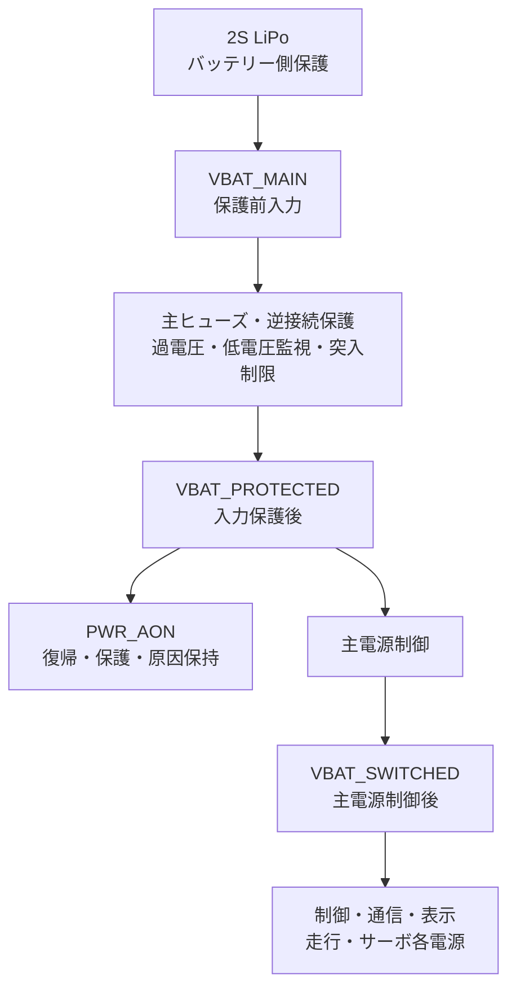

# Tank_Robot バッテリー・電気安全監視基本設計

## 目次

1. 本書の目的
2. バッテリー・電気安全監視の基本設計方針
3. バッテリーおよび電源保護構成
4. 電気安全監視モデル
5. バッテリー電圧監視および低電圧保護
6. 電流監視および過電流・短絡保護
7. 温度監視および異常発熱保護
8. 処理別の電源条件
9. 電源安全監視異常
10. 電気安全事象の処理
11. 機能間連携および論理インターフェース
12. 状態通知、ログおよび診断
13. 設定値および校正値の管理
14. 要求との対応
15. 後続設計および評価で具体化する事項

---

## 1. 本書の目的

### 1.1 目的

本書は、Tank_Robotのシステム要求仕様、システム構成およびシステムアーキテクチャに基づき、Tank_Robot本体におけるバッテリー・電気安全監視の基本設計を定義することを目的とする。

システム要求仕様で定められたバッテリー電圧、走行駆動系電流、サーボ駆動系電流、バッテリー表面温度およびモータドライバ温度の監視を実現するため、監視対象、監視経路、取得周期、判定状態、判定しきい値、継続時間、ヒステリシス、監視異常の検出方法ならびに異常時の保護処理を定める。

また、システムアーキテクチャで定めた各機能の役割・責任分担を前提として、電気安全監視機能が電気安全状態および電気的保護の要否を判断し、停止・緊急停止管理、起動・終了・再起動管理、電源・省電力管理、異常管理、OTA更新管理、永続データ管理、ログ・診断および状態表示・利用者通知と連携するための基本方式を具体化する。

### 1.2 対象範囲

本書では、Tank_Robot本体のバッテリー・電気安全監視に関する次の事項を対象とする。

- 2S LiPoバッテリーの電気安全上の基本仕様、使用・充電・保管条件
- 電源入力、電源分配、逆接続、逆給電および突入電流に対する電気安全条件と必要な保護作用
- 電源配線、コネクタ、スイッチおよび保護部品が満たすべき電流・温度・誤接続防止その他の安全条件
- バッテリー電圧の監視方式、判定状態、しきい値、継続時間およびヒステリシス
- 走行駆動系およびサーボ駆動系の合計電流について必要な測定範囲、精度、品質および判定条件
- 通常負荷、一時的な起動電流、危険な電気的過電流および短絡の区別
- バッテリー表面温度およびモータドライバ温度について必要な測定範囲、精度、品質および判定条件
- 温度警告、通常操作継続不能温度および重大な異常発熱の区別
- ソフトウェア監視と、ソフトウェアに依存しないハードウェア保護との分担
- 起動、通常操作、安全停止、通常終了、低消費電力、OTA更新および重要な不揮発データ書込みに必要な電源条件
- 安全監視用センサ、監視回路および監視処理の異常検出
- 複数の電気安全事象が競合した場合の優先順位
- 電気安全状態、監視値スナップショット、保護要求および処理結果を他機能へ提供する論理インターフェース
- 電気安全状態に関するログ、診断情報および利用者通知情報
- 判定値、校正値および設定値の管理方針

本体内でLiPoバッテリーを充電する機能、セルバランス制御、セルごとの電圧を本体制御へ取り込む機能、残容量を高精度に推定する機能およびバッテリー劣化度を推定する機能は対象外とする。

充電は、本体から取り外したバッテリーに対し、指定する2S LiPo対応外部バランス充電器を使用して行う。

物理電源ツリー、railへの対応、保護回路方式、部品、配線、コネクタ、信号電気条件、監視回路および保護作用点は電源・ハードウェア基本設計を正本とする。本書は、それらが満たすべき監視性能、判定threshold、継続時間、hysteresis、安全条件および必要な保護作用を定義し、電源・ハードウェア基本設計の物理設計を別の正本として再定義しない。

異常の影響度、システム全体として必要な処置および復旧可否の最終判断は異常管理機能、通常停止・安全停止・緊急停止の実行は停止・緊急停止管理機能、通常終了および強制電源遮断時の制御側シーケンスは起動・終了・再起動管理機能、各電源系統の通常の電力状態変更は電源・省電力管理機能が担当する。本書では、これらの機能との連携に必要な範囲を対象とする。

ソフトウェアモジュール、タスク、クラス、関数、変数およびイベント形式はソフトウェア詳細設計で定める。物理電源ツリー、監視・保護回路の基本方式、作用点、信号電気条件、配線およびコネクタは電源・ハードウェア基本設計、端子番号、ADCチャネル、レジスタ設定、具体部品、回路定数およびPCB layoutは後続の詳細設計で定める。

### 1.3 上位文書・関連文書

#### 1.3.1 上位文書

本書は、次の文書を上位文書および共通設計文書として作成する。

- [`docs/00_project_overview/01_製品目的・製品目標.md`](../../../00_project_overview/01_製品目的・製品目標.md)
- [`docs/10_requirements/10. バッテリー・電気安全.md`](../../../10_requirements/10.%20バッテリー・電気安全.md)
- [`docs/20_basic_design/00_Tank_Robot 基本設計について.md`](../../../20_basic_design/00_Tank_Robot%20基本設計について.md)
- [`docs/20_basic_design/01_システム構成/Tank_Robotシステム構成.md`](../../../20_basic_design/01_システム構成/Tank_Robotシステム構成.md)
- [`docs/20_basic_design/02_システムアーキテクチャ/Tank_Robotシステムアーキテクチャ.md`](../../../20_basic_design/02_システムアーキテクチャ/Tank_Robotシステムアーキテクチャ.md)

#### 1.3.2 関連するシステム要求仕様

電気安全状態に基づく起動、停止、終了、省電力、異常処理、設定、OTA更新、永続データ処理、記録および通知については、必要に応じて次の公開用システム要求仕様を参照する。以下に示す文書は、すべて `04_Project/10_Tank_Robot/40_公開用システム要求仕様/` 配下の文書である。

- [`docs/10_requirements/01. 起動・終了・再起動.md`](../../../10_requirements/01.%20起動・終了・再起動.md)
- [`docs/10_requirements/02. システム状態管理.md`](../../../10_requirements/02.%20システム状態管理.md)
- [`docs/10_requirements/03. 電源・省電力管理.md`](../../../10_requirements/03.%20電源・省電力管理.md)
- [`docs/10_requirements/07. 走行制御.md`](../../../10_requirements/07.%20走行制御.md)
- [`docs/10_requirements/08. 砲塔・砲身制御.md`](../../../10_requirements/08.%20砲塔・砲身制御.md)
- [`docs/10_requirements/09. 停止・緊急停止.md`](../../../10_requirements/09.%20停止・緊急停止.md)
- [`docs/10_requirements/13. 設定管理.md`](../../../10_requirements/13.%20設定管理.md)
- [`docs/10_requirements/14. ログ・診断.md`](../../../10_requirements/14.%20ログ・診断.md)
- [`docs/10_requirements/15. OTA更新.md`](../../../10_requirements/15.%20OTA更新.md)
- [`docs/10_requirements/17. 異常検出・復旧.md`](../../../10_requirements/17.%20異常検出・復旧.md)
- [`docs/10_requirements/18. 永続データ管理.md`](../../../10_requirements/18.%20永続データ管理.md)
- [`docs/10_requirements/21. 状態表示・利用者通知.md`](../../../10_requirements/21.%20状態表示・利用者通知.md)
- [`docs/10_requirements/22. 性能・品質・耐久性.md`](../../../10_requirements/22.%20性能・品質・耐久性.md)
- [`docs/10_requirements/24. 法令・規格・量産移行.md`](../../../10_requirements/24.%20法令・規格・量産移行.md)

#### 1.3.3 関連する基本設計

- [`docs/20_basic_design/03_機能別基本設計/01_システム状態管理/Tank_Robotシステム状態管理基本設計.md`](../01_システム状態管理/Tank_Robotシステム状態管理基本設計.md)
- [`docs/20_basic_design/03_機能別基本設計/02_起動・終了・再起動管理/起動・終了・再起動管理基本設計.md`](../02_起動・終了・再起動管理/起動・終了・再起動管理基本設計.md)
- [`docs/20_basic_design/03_機能別基本設計/03_停止・緊急停止管理/停止・緊急停止管理基本設計.md`](../03_停止・緊急停止管理/停止・緊急停止管理基本設計.md)
- [`docs/20_basic_design/03_機能別基本設計/04_異常管理/異常管理基本設計.md`](../04_異常管理/異常管理基本設計.md)
- [`docs/20_basic_design/03_機能別基本設計/05_電源・省電力管理/電源・省電力管理基本設計.md`](../05_電源・省電力管理/電源・省電力管理基本設計.md)

#### 1.3.4 参考技術資料

暫定基本値および採用方式の検討には、次の製造元技術資料を参照する。正式部品選定後は、採用する型式の最新版データシートを設計基準とする。

- [Renesas RA8M2製品情報](https://www.renesas.com/en/products/ra8m2)
- [DSservo DS3218データシート配布ページ](https://www.dsservo.com/en/show_down.asp?id=22)
- [Texas Instruments INA240製品情報](https://www.ti.com/product/INA240)
- [Texas Instruments TPS25940製品情報](https://www.ti.com/product/TPS25940)
- [Gens ace & Tattu LiPo Battery Guide](https://genstattu.com/bw/)

本書の内容が製品目的・製品目標またはシステム要求仕様と矛盾する場合は、上位要求を優先する。

基本設計の過程でシステム要求仕様の不足、矛盾または変更が必要な事項が判明した場合は、本書で要求を暗黙に変更せず、システム要求仕様へのフィードバック事項として扱う。

### 1.4 暫定基本値の扱い

本書で「暫定基本値」と明記した数値は、未確定のバッテリー型式、DPC-XGL1-JP付属モータドライバの詳細定格、DCモータの実測電流、電源変換回路および保護部品を選定するための初期設計値である。

本書が所有する暫定基本値は、監視値の有効範囲・精度、判定threshold、継続時間、hysteresis、復旧条件および必要な保護作用である。電源・ハードウェア基本設計が所有するrail定格、回路方式、部品、配線、コネクタ、信号電気条件および物理作用点を本書で参照する場合は、電気安全判断の前提を示すための引用とし、本書から独立して変更しない。

暫定基本値であっても、後続設計で値を未定義のままにしてよいことを意味しない。詳細設計および実機評価では暫定基本値を初期値として使用し、第15章に定める部品仕様確認および実機評価を行う。

正式値は、次のすべてを満たす値として確定する。

- 採用するバッテリー、モータドライバ、DCモータ、サーボ、電源変換回路、配線、コネクタ、スイッチおよび保護部品の定格を超えないこと
- 通常使用および許容する起動電流で不要な保護動作を発生させないこと
- 危険な電圧、電流または温度に到達する前に必要な保護処理を開始できること
- センサ精度、部品公差、温度特性、経年変化および個体差を含む安全余裕を確保すること
- 最大想定負荷、低バッテリー、周囲温度上限および同時動作条件で成立性を評価済みであること

評価結果または正式部品選定により、本書で定めた暫定基本値のうち、警告、通常操作可否、安全停止、出力禁止、電源遮断、復旧その他のユースケース上の振る舞いへ影響するしきい値、継続時間、ヒステリシス、復旧値または時間上限を変更する場合は、安全側・非安全側の変更方向にかかわらず、詳細設計だけで変更しない。根拠および評価結果を示して本基本設計を改訂し、改訂後の値を正式値として管理する。安全余裕を減少させる変更では、これに加えて安全性の再評価を必須とする。

### 1.5 用語

| 用語 | 本書での意味 |
| --- | --- |
| 電気安全事象 | 電圧、電流、温度、電源系統または監視経路について、警告、異常または保護を必要とする条件 |
| 通常操作継続不能 | 安全な通常操作を継続できないが、安全停止および通常終了を実行する時間的・電力的余裕がある状態 |
| 危険状態 | 通常の安全停止または終了の完了を待つと危険が増大するため、出力無効化、電流制限または電源遮断を優先する状態 |
| 危険過電流 | 異常管理基本設計の「危険な電気的過電流」に対応する電流判定 |
| 通常操作継続不能温度 | 異常管理基本設計の「通常操作継続不能異常温度」に対応する温度判定 |
| 重大な異常発熱・短絡 | 異常管理基本設計の同名異常に対応する、重大な異常発熱または短絡の判定 |
| 保護ラッチ | 保護原因および出力禁止を、原因が一時的に消失しても明示的な解除条件まで保持する状態または回路 |
| 零点許容範囲 | 対象電源系統が停止しているときに、センサ誤差および残留電流として許容する範囲 |
| 計測更新世代 | 一つの監視対象または派生計測値について、新しいサンプル集合または品質変化に基づくスナップショットを以前のスナップショットと区別する単調増加世代 |
| 監視値スナップショット | 工学値または派生値と、取得時刻、計測更新世代、品質状態、時間窓成立状態および有効サンプル数を一体として他機能へ提供する論理情報 |

---

## 2. バッテリー・電気安全監視の基本設計方針

### 2.1 役割・責任範囲

本書では、バッテリー・電気安全監視機能を、以下「電気安全監視機能」という。

電気安全監視機能は、Tank_Robot本体のバッテリー電圧、走行駆動系およびサーボ駆動系の合計電流、バッテリー表面温度、モータドライバ温度、電源保護回路の状態ならびに監視経路の健全性を監視する。

電気安全監視機能は、主に次の事項を担当する。

- 監視値および監視値の有効性の管理
- 電気安全状態の判定
- 低バッテリー警告および温度警告の判定
- 通常操作を安全に継続できない低電圧、過電流および異常温度の判定
- 危険低電圧、短絡、重大な過電流および重大な異常発熱の判定
- 安全停止、通常終了、対象電源系統遮断または本体電源遮断の要否の判断
- 起動、通常操作、通常終了、低消費電力、OTA更新および重要な不揮発データ書込みに必要な電源条件の提供
- 電気安全状態、監視異常、監視値スナップショット、保護要求および保護結果に必要な情報の関連機能への提供

上記の監視値・品質、判定threshold、継続時間、hysteresis、安全条件および必要な保護作用の意味はバッテリー・電気安全監視を正本とする。これらを成立させる物理rail、監視・保護回路、部品、配線、信号および作用点は電源・ハードウェア基本設計を正本とする。

電気安全監視機能は、バッテリー電圧、走行駆動系電流、サーボ駆動系電流、バッテリー表面温度およびモータドライバ温度について、値そのものに加えて品質、有効性、取得時刻、計測更新世代および時間窓情報を含む監視値スナップショットの正本とする。他機能は、電気安全監視機能から取得した数値だけを複製して独自の最新値正本とせず、当該スナップショットに含まれる品質・鮮度・世代を用いて利用可否を判断する。

走行制御および砲塔・砲身制御は、電気安全監視機能が提供する正本の電流スナップショットを、機能固有の過負荷・拘束判定へ使用できる。ただし、機能固有判定によって電気安全監視機能の危険過電流、短絡、低電圧、温度またはその他の電気保護判定を解除、緩和または置換しない。

電気安全監視機能は、システム状態を直接変更せず、アクチュエータの停止シーケンス、通常終了シーケンス、異常の影響度・復旧可否の最終判断または通常の電力状態変更を重複して管理しない。

### 2.2 関連機能との責任分担

| 機能 | 責任 |
| --- | --- |
| 電気安全監視 | 電気安全状態、電気的保護の要否、対象および緊急度を判断する |
| システム状態管理 | 電気安全監視から受け取る通常操作条件等に基づき、システム状態およびシステム全体の通常操作可否を判断する |
| 停止・緊急停止管理 | 電気安全監視からの安全停止要求を受け、走行および砲塔・砲身の停止処理と停止完了確認を行う |
| 起動・終了・再起動管理 | 電気安全監視からの通常終了要求または電源遮断必要結果を受け、通常終了または強制電源遮断時の制御側処理を管理する |
| 電源・省電力管理 | 電気安全監視が決定した保護要求に従い、通常制御可能な電源系統の遮断・復帰および監視モード変更を管理する |
| 電源・ハードウェア基本設計／電源部・ハードウェア保護 | バッテリー・電気安全監視が定める保護必要条件を満たす物理回路、作用点およびread-backを提供し、短絡、重大な過電流、危険低電圧、逆接続および重大な異常発熱に対する遮断・制限・ラッチを実行する |
| 異常管理 | 電気安全監視から受け取る異常情報に基づき、システム全体としての通常操作継続可否、追加処置および復旧可否を判断する |
| 走行制御 | 走行固有の過負荷・拘束を判断し、電気安全監視から受け取る走行駆動系電流スナップショットをその判断に使用する |
| 砲塔・砲身制御 | 砲塔・砲身固有の過負荷・拘束を判断し、電気安全監視から受け取るサーボ駆動系電流スナップショットをその判断に使用する |
| OTA更新・永続データ管理 | 電気安全監視が提供する電源条件を、自機能の処理開始・継続・安全な中断判断に使用する |

通常の電源投入・停止要求を生成する主体は電源・省電力管理機能とする。電気安全監視機能が電源部へ提供する安全許可信号は、電気安全監視の初期化後に投入するソフトウェア制御可能な負荷側電源系統を許可または禁止する系統別の安全ゲートとする。対象は少なくとも`PWR_DRIVE`、`PWR_SERVO`、`PWR_BLE`、`PWR_WIFI`および`PWR_DISPLAY`とし、実効的な系統Enableは「電源・省電力管理機能の投入要求 AND 当該系統に対する電気安全監視機能の安全許可」とする。

`PWR_DRIVE`および`PWR_SERVO`の安全許可は、次の規則に従う。

1. OFFからONへ切り替える場合、ならびに保護後に再投入する場合は、通常操作開始可能を必須とする。これが不成立または不明の間は、安全許可を成立させない。
2. 対象系統が既知のONである間は、通常操作開始可能だけが不成立となったことを理由として安全許可を直ちに解除しない。
3. 通常操作継続可能が不成立となった場合は、新規出力禁止と原因別の安全停止を開始し、停止後に定めた遮断または終了処理へ進む。
4. 危険低電圧、ハードウェア即時保護、監視不能その他、本設計で即時遮断を定める条件では、停止完了を待たず安全許可を解除する。
5. 対象系統がOFFとなった後の再投入には、通常操作開始可能を改めて確認する。

限定復旧に使用する`PWR_BLE`、表示その他の非アクチュエータ系統は、通常操作開始可能とは分離し、当該系統の電気安全条件と限定復旧の状態上の実行許可に基づいて許可する。

電気安全監視機能は、安全許可の解除、出力無効化または強制OFFを要求できるが、電源・省電力管理機能の投入要求がない負荷側系統を単独でONにできない。

`PWR_CTRL`および`PWR_SAFETY`の初期投入は、このソフトウェア安全許可ゲートの対象外とする。これらは、`PWR_AON`上で常時動作する逆接続、過電圧、低電圧および主保護の独立入力保護が投入を許可し、起動・終了・再起動管理の起動経路が主電源投入を要求した場合に確立する。`PWR_CTRL`および`PWR_SAFETY`の確立後に電気安全監視を初期化し、負荷側電源系統の安全許可を生成する。

電気安全監視機能が「対象系統遮断必要」と判断した場合は電源・省電力管理機能へ要求し、「本体電源遮断必要」と判断した場合は起動・終了・再起動管理機能へ直接要求する。通常のソフトウェア制御が可能である間も、この責任分界に従って連携し、本体電源遮断必要を電源・省電力管理機能の中継または異常管理機能の追加判断待ちにしない。

ソフトウェア処理の完了を待つことが危険である場合、またはソフトウェアを正常に使用できない場合は、ハードウェア保護がこれらの処理結果を待たずに遮断または電流制限を実行する。

### 2.3 予防監視と独立保護の二層構成

電気安全は、次の二層で構成する。

| 層 | 主な目的 | 主な処理 |
| --- | --- | --- |
| 予防監視層 | 危険状態に至る前に警告、通常操作禁止、安全停止および通常終了を行う | RA8M2による監視値取得、フィルタ、継続時間判定、警告通知、安全停止要求、通常終了要求 |
| 独立保護層 | ソフトウェア停止、短絡、重大な過電流、危険低電圧、逆接続または重大な異常発熱時にも危険を制限する | ヒューズ、逆接続保護、過電圧・低電圧監視、電流制限、電子ヒューズ、温度比較器、保護ラッチ、バッテリー側保護 |

予防監視層の正常動作を、独立保護層の成立条件としない。

独立保護層の作動状態は、可能な範囲で電気安全監視機能が取得し、異常管理、ログ・診断および状態表示・利用者通知へ提供する。

### 2.4 安全優先

電気安全監視では、次の順に処理を優先する。

1. 短絡、重大な過電流、重大な異常発熱、逆接続または危険低電圧に対するハードウェア保護
2. 危険事象に対する新規出力禁止および必要な出力無効化
3. 安全停止および通常終了に必要な処理
4. 停止後も危険が継続する場合または停止に失敗した場合の対象電源系統もしくは本体電源の遮断
5. 監視異常に伴う通常操作禁止および安全側への移行
6. 低バッテリー警告および温度警告
7. ログ記録、状態表示および外部通信

上記は安全上の優先関係を示す。ソフトウェアで検出する危険過電流では、第6.5節に従って新規出力禁止、安全停止、停止反映後の電流確認を順に行い、過電流継続または停止失敗を確認する前に通常の系統遮断を開始しない。短絡・重大過電流に対するハードウェア即時保護は、この順序を待たず第6.6節に従う。

ログ記録、状態表示、BLE通信、Wi-Fi通信またはVPS通信の完了待ちによって、安全停止、出力無効化、電流制限または電源遮断を遅延させない。

### 2.5 一時変動の除外と危険事象の即時保護

通常のモータ起動、サーボ起動、PWM変動または電源系統の投入に伴う一時的な変動だけを理由として、低バッテリー、通常操作継続不能または危険状態と判定しない。

予防監視層では、監視対象ごとにフィルタ、継続時間およびヒステリシスを適用する。

ただし、短絡、ハードウェア保護しきい値を超える重大な過電流、危険低電圧または重大な異常発熱については、通常のフィルタおよびソフトウェア判定周期を待たず、独立保護層で保護する。

### 2.6 安全側判断

監視値が無効、更新停止、範囲外、相互矛盾または監視経路異常である場合は、当該監視対象を正常と判定しない。

電気安全上の通常操作継続可否を判断できない場合は、通常操作を禁止する側の結果を提供する。

監視異常時の具体的な保護対象および処理は第9章に従う。

### 2.7 自動再開の禁止

低電圧、危険な過電流、短絡、通常操作継続不能温度、重大な異常発熱または電源安全監視異常によって停止または電源遮断を行った場合、監視値が一時的に正常範囲へ戻ったことだけを理由として、同一起動中にアクチュエータ出力または対象電源系統を自動的に再開しない。

復旧は、第5章から第9章に定める原因解消条件、異常管理基本設計に定める復旧権限および明示的な復旧操作に従う。

### 2.8 外部通信への非依存

電圧、電流、温度および監視健全性の判定、安全停止要求、出力無効化ならびに電源遮断は、スマートフォン、Wi-Fi、インターネット、VPSまたは管理Webアプリとの通信を成立条件としない。

外部通信を利用できない場合でも、本体内部の監視経路およびハードウェア保護を使用して電気安全監視を継続する。

### 2.9 安全値の変更制限

短絡、重大な過電流、危険低電圧および重大な異常発熱に対するハードウェアしきい値は、VPS設定によって変更できない固定値とする。

通常操作継続不能しきい値、保護継続時間および復旧条件は、採用するハードウェア構成と一体の安全設計値として管理し、通常の遠隔設定変更対象としない。

低バッテリー警告および温度警告の一部は、第13章に定める安全範囲内に限って、正当性および完全性を確認した設定パッケージから変更できる。

---

## 3. バッテリーおよび電源保護構成

### 3.1 バッテリー基本仕様

本体は、一つの2S LiPoバッテリーを主電源として使用する。

初期試作で採用するバッテリーの暫定基本仕様を次に示す。

| 項目 | 暫定基本仕様 | 設計上の扱い |
| --- | --- | --- |
| 種類 | 2S LiPoバッテリーパック | 他のセル数または化学系を通常使用対象としない |
| 公称電圧 | 7.4 V | システム要求による確定値 |
| 満充電電圧 | 8.4 V | 4.2 V/セルとして扱う |
| 公称容量 | 2,200 mAh | 初期選定値。2,000 mAh以上を必須とし、搭載寸法および駆動時間評価で正式確定する |
| 放電能力 | 連続15 A以上、1秒間20 A以上 | 本体側最大想定電流および保護動作より大きいことを確認する |
| バッテリー側保護 | セル過放電、過電流および短絡に対するパック内保護回路を備える | 本体側保護を省略する根拠には使用しない |
| 使用時温度 | 0 ℃以上60 ℃未満を満たす製品 | Tank_Robotの通常使用環境は10 ℃以上35 ℃以下とする |
| 充電方式 | 本体から取り外し、指定する2S LiPo対応外部バランス充電器で充電 | 本体内充電および本体給電中の充電を禁止する |

主電源コネクタおよび外部充電用バランス端子の型式・接点構造・物理接続先は電源・ハードウェア基本設計の第5.1節および第16章を正本とする。本書は、逆接続、短絡、本体給電中の充電および本体回路へのバランス端子接続を防止する安全条件を所有する。

バッテリー型式を正式選定する際は、上表に加えて、外形寸法、質量、端子極性、配線長、許容充放電温度、最大連続電流、最大瞬間電流、保護回路仕様、輸送・保管条件および取扱説明を確認する。

個別セル電圧は本体で取得しない。セルの不均衡を抑制するため、外部充電時は2Sバランス充電を必須とし、膨張、損傷、液漏れ、配線損傷またはセル不均衡が確認されたバッテリーを使用しない。

外部充電器は、採用バッテリーの製造元が指定または許容する2S LiPoバランス充電器とする。充電電流は、製造元がより小さい値を指定しない限り1 C以下とし、セル数、LiPoモード、充電電流および端子極性を充電開始前に確認する。本体内、可燃物の近傍、0 ℃未満または45 ℃を超える環境、および無人状態では充電しない。

3か月を超えて保管する場合は、本体からバッテリーを取り外し、製造元指定を優先したうえで、暫定的に1セル当たり3.6～3.9 Vの保管電圧、23±5 ℃の乾燥した不燃性保管場所を使用する。

バッテリー交換は、一般操作者が主電源OFF操作による通常終了を要求し、起動・終了・再起動管理機能が通常終了を正常完了した後、制御部を含む主電源の供給停止を確認してから行う。通常終了を正常完了できない場合は、強制電源遮断手順に従い、アクチュエータ出力無効化と実際の主電源供給停止を確認してから交換する。`VBAT_SWITCHED`、`PWR_CTRL`、`PWR_DRIVE`または`PWR_SERVO`のいずれかが通電中、電源供給停止を確認できない状態、あるいは充電器その他の外部電源が接続された状態では、バッテリーコネクタを挿抜しない。交換後は、温度センサの所定位置への接触、配線・コネクタの損傷および極性キーの正常な嵌合を確認してから主電源を投入する。

### 3.2 電源ドメインの電気的基本条件

電源domainの識別子、論理的役割および状態変更の意味は電源・省電力管理、各domainと物理railの対応、電源ツリー、回路、部品および実際の電気的成立は電源・ハードウェア基本設計を正本とする。

次の表は、電源・ハードウェア基本設計が所有するrail電圧・電流容量・物理保護構成の現行値を、バッテリー・電気安全監視の監視範囲、安全判定および保護必要条件の前提として引用したものである。バッテリー・電気安全監視は表の物理定格または電源ツリーを独自に変更せず、監視値・判定threshold・継続時間・hysteresisおよび必要な保護作用は第5章から第10章で管理する。

| 電源ドメイン | 電圧の暫定基本条件 | 電流・容量の暫定基本条件 | 主な保護 |
| --- | --- | --- | --- |
| `VBAT_MAIN` | バッテリー接続中に存在する保護前の入力。監視可能範囲0～10.0 V | 連続10 A、1秒間15 Aを供給可能 | 主ヒューズおよび逆接続・逆流防止の入力側として扱う |
| `VBAT_PROTECTED` | 主ヒューズ、逆接続・逆流防止、過電圧・低電圧保護および突入電流制限後の入力。通常使用時7.0～8.4 V | 連続10 A、1秒間15 Aを供給可能 | 入力保護作動時に後段への給電を停止または制限する |
| `VBAT_SWITCHED` | 主電源制御後の主負荷入力。主電源ON中だけ存在する | 接続する主負荷の最大同時電流および突入電流を供給可能 | 主電源制御、電源良好確認および下流の系統別保護 |
| `PWR_AON` | `VBAT_PROTECTED`から生成 | 主電源OFF時の`PWR_AON`全体の消費電流50 µA以下をハードウェアsub-budget目標とする | 低電圧時のハードウェア遮断、常時有効な保護ラッチ |
| `PWR_CTRL` | 3.3 V ±5 % | 連続3 A以上 | 電流制限、短絡保護、過温度保護、低電圧ロックアウト |
| `PWR_BLE` | 3.3 V ±5 % | 採用モジュールの最大電流に20 %以上の余裕 | ロードスイッチ電流制限、逆給電防止 |
| `PWR_WIFI` | 3.3 V ±5 % | 採用モジュールの最大電流に30 %以上の瞬時余裕 | ロードスイッチ電流制限、逆給電防止 |
| `PWR_DRIVE` | 保護後バッテリー電圧 | 連続4.0 A、200 ms間6.0 A | 高側電流監視、電子ヒューズ、出力無効化、モータドライバ内蔵保護 |
| `PWR_SERVO` | 5.0 V ±5 % | 連続4.0 A、200 ms間5.0 A | 高側電流監視、電子ヒューズ、電源変換部の電流制限・短絡・過温度保護 |
| `PWR_DISPLAY` | 3.3 V ±5 % | 最大同時点灯電流に20 %以上の余裕 | ロードスイッチまたは出力ドライバによる電流制限 |
| `PWR_SAFETY` | 3.3 V ±5 % | 監視回路の最大電流に30 %以上の余裕 | `PWR_CTRL`と物理電源を共有し、低消費電力時に停止するスイッチの下流へ配置しない |

`PWR_CTRL`、`PWR_DRIVE`、`PWR_SERVO`、`PWR_BLE`、`PWR_WIFI`および`PWR_DISPLAY`は、原則として`VBAT_SWITCHED`の下流に配置する。`PWR_AON`は主電源制御の上流に残し、復帰要因、入力保護状態および保護原因を保持する。

`PWR_CTRL`、`PWR_SAFETY`および停止機能に必要な電源は、`PWR_DRIVE`または`PWR_SERVO`の負荷変動または保護動作によって定格範囲を外れない構成とする。

各電源変換回路は、入力電圧6.0～8.6 V、周囲温度10～35 ℃および最大想定負荷で、上表の電圧範囲を維持する。

`PWR_DRIVE`および`PWR_SERVO`の暫定電流値は、採用部品の定格確認および実測により正式確定する。定格の最も小さい部品が上表の暫定値を満たさない場合は、当該部品を変更するか、電流しきい値を安全側へ引き下げる。電流しきい値を変更する場合は、第1.4節に従って本基本設計へ反映し、正式値として確定する。

### 3.3 電源入力および分配保護

電源入力・分配の物理構成、主ヒューズ、逆接続・逆流防止、突入制限、系統別保護回路および原因保持回路は電源・ハードウェア基本設計を正本とする。本節の構成図および物理方式は電源・ハードウェア基本設計の現行設計を参照用に示すものであり、バッテリー・電気安全監視の正本は保護が必要となる条件、threshold、継続時間、安全側の作用および復旧へ渡す情報の意味である。

電源入力および分配は、次の論理構成を前提とする。

主ヒューズは、バッテリーコネクタから分岐が発生する前の位置に配置し、バッテリー、共通配線、コネクタおよび電源分配部を保護する。初期定格は15 Aとし、配線およびコネクタの連続定格以下、かつ最大正常負荷および許容突入電流で不要に溶断しない時間電流特性とする。

逆接続保護は、極性キー付きコネクタに加えて、背中合わせMOSFETまたは同等の低損失なハードウェア方式で構成する。逆接続時は、後段電源系統へ危険な電圧または電流を供給しない。

入力保護回路は、少なくとも誤って3S LiPo相当の12.6 Vが接続された場合に直ちに通常操作を開始せず、後段回路を損傷させないよう16 V以上の入力耐圧を確保する。通常使用可能範囲は8.6 V未満とし、ハードウェア過電圧遮断の暫定公称値は8.7 V、部品公差を含む作動範囲は8.6～8.8 Vとする。

低消費電力中の1秒周期監視の間を保護するため、常時有効なハードウェア危険低電圧検出を、残留負荷を遮断するハードウェア低電圧遮断とは別に設ける。暫定公称値を6.5 V、許容差を±0.1 V、検出継続時間を50 ms以内とし、作動時は走行出力許可およびサーボPWM許可を直接無効化するとともに、`PWR_AON`へ原因をラッチし、RA8M2が動作可能な場合は復帰入力として通知する。RA8M2が復帰できない場合または電圧低下が継続する場合も、公称6.2 Vのハードウェア低電圧遮断によって主負荷を独立して遮断する。

`PWR_DRIVE`および`PWR_SERVO`には、それぞれ独立した電子ヒューズまたは電流制限付きロードスイッチを設ける。各保護回路はラッチオフ方式を基本とし、異常原因が継続している間に投入と遮断を無期限に繰り返さない。

`PWR_AON`が保持できるのは、`VBAT_PROTECTED`が存在し主電源制御だけがOFFである期間の情報である。バッテリー取外し、主ヒューズ溶断または`PWR_AON`自身の低電圧遮断後にも必要な原因は、不揮発性の保護原因ラッチへ保持する。事前に原因を保持できず電源を喪失した場合は、次回起動時に「原因不明の予期しない電源喪失」として扱う。

モータドライバ、サーボ用5 V電源変換回路および3.3 V制御系電源変換回路は、部品自体の過電流、短絡および過温度保護を備える。部品内蔵保護は、主ヒューズおよび系統別保護を省略する根拠にしない。

### 3.4 配線、コネクタおよびスイッチ

配線、コネクタ、スイッチ、保護部品、strain relief、誤接続防止および露出導体防止の物理仕様は、電源・ハードウェア基本設計の第16章および第17章を正本とする。

バッテリー・電気安全監視は、第3.2節および第6章で定める連続電流・過渡電流・短絡条件、監視範囲ならびに保護開始条件を電源・ハードウェア基本設計へ設計入力として提供する。電源・ハードウェア基本設計はこれらに対する定格余裕、電圧降下、温度上昇、時間電流特性、挿抜時短絡防止および機械的保持の成立結果をバッテリー・電気安全監視の安全判断・診断へ提供する。

バッテリー・電気安全監視はAWG、コネクタ型式、接点配置、配線経路または固定方法を独自に変更せず、電源・ハードウェア基本設計で確定した物理構成がバッテリー・電気安全監視の監視・保護条件を満たさない場合は、関係文書を同時に改訂する。

### 3.5 電源投入、突入電流および逆給電

#### 関連する設計との分担

起動全体の処理順序は、「起動・終了・再起動管理基本設計」で定める。
各電源ドメインの論理電力状態を変更する処理は、「電源・省電力管理基本設計」で定める。

ソフトスタート、電源電圧の安定、投入間隔、突入電流および逆給電防止に関する物理的な成立条件は、「電源・ハードウェア基本設計」で定める。
本節では、これらの設計で定めた条件を、電気安全監視機能が起動継続可否を判断するために参照する。

#### 主電源投入時の順序

主電源投入時は、次の順序を基本とする。

1. 入力逆接続、過電圧、低電圧および主保護状態をハードウェアで確認する。
2. 突入電流制限を有効にした状態で`PWR_AON`、`PWR_CTRL`および`PWR_SAFETY`を確立する。
3. 3.3 V電源が定格範囲内で10 ms以上安定したことを確認する。
4. RA8M2および安全関連機能を初期化し、電気安全監視の起動時診断を行う。
5. 後続の起動を継続できる電気安全条件を起動・終了・再起動管理機能へ提供する。
6. `PWR_DRIVE`および`PWR_SERVO`は、出力禁止状態と電気安全条件の成立後に、必要な系統だけを順次投入する。

#### 投入間隔と突入電流

`PWR_DRIVE`と`PWR_SERVO`は同時に投入しない。
一方の電源安定を確認した後、50 ms以上の間隔を設けて他方を投入する。
実測でより長い安定時間が必要な場合は、安全側へ延長し、第1.4節に従って本基本設計へ正式値を反映する。

突入電流と制御・安全監視電源は、次の条件を満たすことを評価する。

- 突入電流が、主ヒューズ、コネクタ、スイッチ、配線および保護回路の瞬間定格の70 %以下であること。
- 突入中も、`PWR_CTRL`および`PWR_SAFETY`が3.3 V ±5 %を外れないこと。

#### 逆給電の防止とリセット時の出力禁止

電源OFF中の機能へ接続される信号は、直列抵抗、バススイッチ、レベル変換、オープンドレイン構成または高インピーダンス化によって逆給電を防止する。
回路解析および実測で、次の両方を確認する。

- 電源OFF側の信号端子へ流入する合計電流が、当該部品の絶対最大定格を超えないこと。
- 電源OFF側の電圧が、有効動作電圧まで上昇しないこと。

制御部の電源低下検出およびウォッチドッグリセット時は、ソフトウェア初期化を待たず、走行出力許可およびサーボPWM許可をハードウェア既定値で無効とする。

### 3.6 電源制御・保護信号の電気的基本条件

制御・状態・保護信号の電圧、プルアップ／プルダウン、レベル変換、非通電時の状態、逆給電防止および出力許可・電源投入を制御するハードウェア論理回路は、「電源・ハードウェア基本設計」の第19章で定める。

本書では、それらの信号を安全許可、保護作動、不明状態および復旧判断にどのように使用するかを定める。
以下の表は、電気安全監視機能の判定に必要な条件として、同基本設計の電気的基本条件を参照したものである。

異なる電源ドメイン間の制御・状態信号は、電源OFF側への逆給電と、起動・停止中の不定出力を防ぐため、次の論理条件を満たす。

| 信号区分 | 電気的基本条件 | 非通電・初期化中の扱い |
| --- | --- | --- |
| 走行出力許可、サーボPWM許可 | 3.3 Vプッシュプル出力を基本とし、受信側にプルダウンを設ける。Lowを出力禁止とする。電源・省電力管理の要求と電気安全監視の安全許可の論理積を、ハードウェアで出力許可に反映する | いずれかの送信側の電源喪失、リセットおよび端子高インピーダンス時も出力禁止を維持する |
| 負荷側電源系統の投入許可 | `PWR_DRIVE`、`PWR_SERVO`、`PWR_BLE`、`PWR_WIFI`および`PWR_DISPLAY`について、電源・省電力管理機能の投入要求と電気安全監視機能の安全許可を個別の3.3 V論理入力として受け、ハードウェア論理積がHighの場合だけ対象系統を投入する。いずれかのLowを電源停止とする | いずれかの入力が不成立、不明、電源喪失または高インピーダンスの場合は、受信側プルダウンによって対象系統を停止する。`PWR_CTRL`および`PWR_SAFETY`の初期投入には本信号を使用せず、`PWR_AON`上の独立入力保護許可を使用する |
| 各電源系統の電源良好 | 3.3 V論理入力とし、受信側にプルダウンを設ける。Highを電源良好とする | 信号源の電源停止、断線または未初期化時は電源良好と扱わない |
| 保護作動通知 | `PWR_SAFETY`へのプルアップを持つオープンドレインを基本とし、Lowを保護作動とする | 信号源停止時にも保護作動または不明として安全側に判定できるよう、電源良好信号と組み合わせる |
| 保護ラッチ・復帰入力 | `PWR_AON`で保持または取得できる構成とする | 主電源OFF中も必要な原因および復帰要因を失わない |
| 通信バス | 3.3 V系とし、電源OFFとなり得る側にバススイッチ、I/Oアイソレーションまたは同等の逆給電防止を設ける | 電源OFF側端子を高インピーダンスとし、バスを有効レベルへ駆動しない |

端子名、GPIO極性、プル抵抗値、電圧変換回路およびタイミング余裕は詳細設計で定める。
ただし、上表の安全側論理および逆給電防止条件は変更しない。

---

## 4. 電気安全監視モデル

### 4.1 電気安全監視機能の内部状態

電気安全監視機能は、システム状態とは別に、次の内部状態を管理する。

| 内部状態 | 定義 |
| --- | --- |
| 初期化中 | 監視回路、ADC、比較器、保護ラッチ、校正値およびセンサ健全性を確認している状態 |
| 正常監視中 | 必須監視値を正常に取得でき、警告、通常操作継続不能条件または保護条件が成立していない状態 |
| 警告監視中 | 低バッテリー警告または温度警告が一つ以上成立しているが、通常操作継続不能条件が成立していない状態 |
| 安全処理中 | 通常操作継続不能条件に対し、安全停止、通常終了または対象系統遮断を関連機能へ要求し、結果を確認している状態 |
| 保護ラッチ中 | 危険低電圧、短絡、重大な過電流、重大な異常発熱またはハードウェア保護作動を保持し、対象出力または電源系統の再開を禁止している状態 |
| 監視異常 | 必須監視値または監視回路を正常に使用できず、当該対象を正常と判定できない状態 |
| 復旧待ち | 安全処理を完了し、原因解消確認、異常管理からの復旧開始要求、機能固有の復旧診断および異常管理による復旧正常完了結果を待っている状態 |

複数の条件が同時に成立した場合の内部状態優先順位は、保護ラッチ中、安全処理中、監視異常、復旧待ち、警告監視中、正常監視中の順とする。危険条件、ハードウェア保護作動または必須監視経路異常を検出していない期間に限り、初期化が正常に完了するまでは初期化中とする。初期化中にこれらを検出した場合は、初期化完了を待たず保護ラッチ中または監視異常へ遷移し、必要な安全処理を開始する。複数事象は内部状態の一つだけで表現せず個別に保持し、保護処理を監視異常によって取り消さない。

内部状態は、システム状態管理機能が管理するシステム状態へ追加しない。

### 4.2 内部状態遷移

| 現在内部状態 | 条件またはイベント | 次内部状態 | 主な処理 |
| --- | --- | --- | --- |
| 初期化中 | 必須監視経路の初期化・診断が正常完了し、最初の有効な監視値に通常操作継続不能条件、危険条件、未復旧原因または警告がない | 正常監視中 | 起動に必要な電気安全条件を提供する |
| 初期化中 | 必須監視経路の初期化・診断が正常完了し、最初の有効な監視値に警告だけが成立 | 警告監視中 | 警告情報と起動に必要な電気安全条件を提供する |
| 初期化中 | 必須監視経路の初期化・診断が正常完了し、最初の有効な監視値に通常操作継続不能条件が成立 | 安全処理中 | 通常操作条件を不成立とし、起動失敗または必要な安全処理へ引き継ぐ |
| 初期化中 | 異常管理から明示的復旧が未完了の温度異常を正常に引き継ぎ、現在の危険条件および監視異常がない | 復旧待ち | 通常操作条件を不成立とし、現在の原因状態を異常管理へ提供する |
| 初期化中 | 必須監視経路の初期化または診断に失敗 | 監視異常 | 通常操作禁止結果および監視異常を提供する |
| 正常監視中 | 警告条件成立 | 警告監視中 | 警告情報を記録・通知する |
| 正常監視中または警告監視中 | 通常操作継続不能条件成立 | 安全処理中 | 安全停止等を要求する |
| 各状態（初期化中を含む） | 危険条件またはハードウェア保護作動 | 保護ラッチ中 | 出力無効化または電源遮断を最優先する |
| 正常監視中または警告監視中 | 必須監視経路異常 | 監視異常 | 正常判定を中止し、安全側の処理を要求する |
| 警告監視中 | すべての警告解除条件成立 | 正常監視中 | 現在警告を解除し、発生履歴は保持する |
| 安全処理中 | 必要処理完了 | 復旧待ち、保護ラッチ中または監視異常 | 原因別の復旧方式を確定し、同一起動中の自動再開を禁止する |
| 復旧待ち | 原因解消を確認し、異常管理から有効な復旧開始要求を受け、機能固有の復旧診断を完了 | 復旧待ち | 異常管理へ復旧診断結果を提供し、出力禁止および通常操作禁止を維持する |
| 監視異常 | 開発・保守者による有効な復旧開始要求を受け、全監視診断を完了 | 監視異常 | 異常管理へ復旧診断結果を提供し、監視異常による安全処理を維持する |
| 保護ラッチ中 | 規定の電源再投入または有効な明示的復旧開始要求を受け、原因解消および全監視診断を確認 | 保護ラッチ中 | 異常管理へ復旧診断結果を提供し、保護ラッチによる再使用禁止を維持する |
| 復旧待ち、監視異常または保護ラッチ中 | 異常管理から復旧正常完了結果を受け、現在の危険条件、監視異常、保護ラッチおよび他の未復旧電気安全異常がない | 正常監視中または警告監視中 | 復旧対象に対応する通常操作条件の再判定を開始する |
| 復旧待ち、監視異常または保護ラッチ中 | 異常管理から復旧失敗結果を受ける、または復旧処理中に安全条件が不成立 | 現在状態を維持、またはより高優先度の状態 | 復旧対象による禁止を解除せず、必要な安全処理を優先する |

安全処理中または保護ラッチ中に別の電気安全事象を検出した場合は、既存事象を上書きせず、各事象を個別に保持する。

### 4.3 監視情報

監視対象ごとに、少なくとも次の情報を管理する。

- 監視対象識別子
- 取得元および監視経路
- 生値
- 工学値へ変換した値および単位
- フィルタ後の判定値
- 最終正常更新時刻または単調増加する更新順序
- 計測更新世代
- 最新サンプルまたは派生値の取得・確定時刻
- 有効、未初期化、更新停止、範囲外、断線、短絡、相互矛盾その他の品質状態
- 時間窓を持つ派生値では、名目窓長、有効サンプル数、必要サンプル数、取得済み有効区間および全窓成立可否
- 現在の判定状態
- 判定に使用したしきい値、継続時間および設定世代
- 判定状態へ入った時刻および継続時間
- 警告、異常または保護のラッチ状態
- 監視時点のシステム状態、対象電源系統状態およびアクチュエータ出力状態

生値、工学値、フィルタ後値および判定状態を区別し、フィルタ後値だけからセンサ異常を判定しない。

計測更新世代は、個々の監視対象または派生計測値のスナップショット更新を識別するための世代であり、第8.1節で処理別電源条件を原子的に評価する「監視更新世代」とは区別する。同じ計測更新世代のスナップショットを複数回読み出した場合、それを新しい測定または新しい継続時間の証拠として扱わない。

#### 4.3.1 他機能提供用監視値スナップショット

電気安全監視機能が、走行制御、砲塔・砲身制御、OTA更新管理、ログ・診断その他の機能へ数値監視値または派生値を提供する場合は、値だけではなく少なくとも次の論理情報を一つのスナップショットとして対応付ける。

- 監視対象および計測種別
- 工学値または派生値と単位
- 計測更新世代
- 取得時刻または派生値確定時刻
- 品質状態および値の有効性
- 時間窓を持つ派生値では名目窓長、取得済み有効区間、有効サンプル数、必要サンプル数および全窓成立可否
- 対象電源系統状態および、必要な場合は監視モード

時間窓内に欠損、無効サンプル、取得周期の断絶または更新停止が存在する場合、未取得区間を0または直前値で補完しない。連続有効サンプルが必要な派生値では、断絶後の最初の有効サンプルから窓成立状態を再構築し、全窓が成立するまで「全窓成立可」として提供しない。

値自体を取得できる場合でも、名目時間窓を満たしていない場合は、取得済み有効区間と有効サンプル数を明示する。利用側は、全窓未成立の値を名目時間窓が成立した値として扱わず、自機能の判定で必要とする窓成立条件を明確にする。

### 4.4 監視経路および取得周期

| 監視対象 | 予防監視経路 | 独立保護・比較経路 | 通常時取得周期 | 低消費電力時 |
| --- | --- | --- | --- | --- |
| バッテリー電圧 | 0～10.0 V対応の保護付き・切替式分圧回路からRA8M2 ADCへ入力 | 独立電圧監視器による過電圧・低電圧判定信号、遮断およびバッテリー側保護 | 1 msで取得し、10 msごとに判定更新 | 1秒周期の監視バーストと、常時有効なハードウェア低電圧保護 |
| 走行駆動系合計電流 | 高側シャントおよびPWM耐性を持つ電流検出増幅器からADCへ入力 | 電子ヒューズまたは高速比較器による電流制限・遮断 | `PWR_DRIVE`通電中は1 ms | 原則監視不要。通電を維持する縮退時は通常周期 |
| サーボ駆動系合計電流 | 高側シャントおよび電流検出増幅器からADCへ入力 | 電子ヒューズまたは高速比較器による電流制限・遮断 | `PWR_SERVO`通電中は1 ms | 原則監視不要。通電を維持する縮退時は通常周期 |
| バッテリー表面温度 | 10 kΩ、B定数3950 K、1 %相当のNTCサーミスタからADCへ入力 | 同じ温度検出点または独立比較点による過温度遮断 | 100 ms | 1秒周期およびハードウェア過温度保護 |
| モータドライバ温度 | 10 kΩ、B定数3950 K、1 %相当のNTCサーミスタからADCへ入力 | 温度比較器およびモータドライバ内蔵過温度保護 | `PWR_DRIVE`通電中は100 ms。停止後も温度が回復するまで継続 | `PWR_DRIVE`停止中は1秒周期 |
| 保護回路状態 | 電子ヒューズ、電圧監視器、電源変換回路および保護ラッチの状態入力 | 各保護回路自身 | 状態変化時の割込みおよび100 ms周期確認 | 復帰入力として保持し、1秒周期で確認 |

#### 実行優先度と独立した期限監視

RA8M2の安全監視処理は、ログ、表示、Wi-FiまたはVPS処理より高い実行優先度とする。
DMAまたは独立ADCスキャンを使用し、通常処理の負荷変動による取得停止を防止する。

標準低消費電力監視では、LOCOをクロック源とするRA8M2のAGT1を主周期復帰経路とする。
1秒ごとの周期復帰時に、最大50 msの監視バーストを実行する。
監視バーストは、一時的に動作した制御部が、その周期に必要な測定・診断・判定をまとめて行う処理である。

AGT1の周期復帰経路とは独立した期限監視に、IWDTCLKで動作する独立ウォッチドッグ（IWDT）を使用する。
IWDTはSoftware Standby中も停止させず、期限超過時にRA8M2をリセットする設定とする。NMI通知だけには依存しない。

#### 監視世代の開始と測定

##### 監視世代と移行識別子

各監視周期には、単調増加する監視世代を付ける。
標準低消費電力監視では、電源・省電力管理機能が低消費電力安全監視世代を発行する。

1. 電源・省電力管理機能は、周期復帰ごとに、現在の移行識別子と単調増加する監視世代を付けた開始要求を提供する。
2. 電気安全監視機能は、両識別情報が一致する開始要求だけを実行する。
3. 周期復帰後に`LP_MON_START`（監視世代、開始時刻）を記録する。
4. `LP_MON_START`、`LP_MON_COMPLETE`または失敗結果のすべてに、同じ移行識別子および監視世代を返す。

電源・省電力管理機能は、遅延した旧移行または旧世代の結果を、現在の監視完了またはIWDT更新の根拠へ使用しない。
通常監視および通電維持縮退監視の監視世代は、電気安全監視機能が発行し、実監視モードと対応付ける。

##### 監視バーストで取得する値

分圧回路およびADCの安定を確認した後、次の測定と確認を行う。

| 対象 | 取得方法 | 使用する値と用途 |
| --- | --- | --- |
| バッテリー電圧 | 1 ms周期で16個取得し、中央値、平均値および最小値を生成する | 低バッテリー警告、通常操作継続不能低電圧および指定外高電圧の候補には平均値を使用する。危険低電圧の候補には最小値を使用する |
| バッテリー温度、通電していないモータドライバ温度 | 10 ms以上の間隔を置いて2個以上取得する | 低温候補には最小値、高温候補には最大値を使用する |
| 保護回路状態 | バーストの開始時と終了時に確認する | 当該監視世代の保護状態として扱う |

電圧の中央値は、次の情報と組み合わせて、スパイク、張付き、範囲外または経路矛盾の候補判定に使用する。

- 平均値との偏差
- サンプル間のばらつき
- 生値の範囲
- 独立電圧監視器の区分信号

#### 監視異常通知用情報の保持

各低消費電力安全監視世代では、`LP_MON_START`を確定する前に、監視異常用の異常通知取引識別子と予約済み異常識別子を確保する。
これらを移行識別子、監視モードおよび監視世代へ対応付け、監視開始・完了状態、主通知状態および通知結果とともに、IWDTリセット後も取得可能な保持情報へ記録する。
通常監視および通電維持縮退監視でも、各監視世代に同等の監視異常識別子と主通知状態を対応付ける。

監視異常識別子の予約から通知完了までを、次の通知取引状態で管理する。

| 時点または確認結果 | 主通知状態と扱い |
| --- | --- |
| `LP_MON_START`の確定前 | 「通知待機（事象未確定）」として保持する |
| 監視世代が正常完了した場合 | 「通知不要（正常完了）」へ確定する。この識別子群を後発の監視異常へ使用しない |
| 監視失敗が確定した場合 | 同じ識別子群を用いて「未通知」へ移す |
| 異常管理機能への通知を開始する前 | 当該識別子を用いて「通知中」へ更新する |
| 同じ異常通知取引識別子の受付結果および確定異常識別子を確認した場合 | 「通知完了」とする |

ここでいう「未通知」は、監視失敗が確定した後、通知を開始する前の状態である。
通知結果を確認できない場合は「通知完了」とせず、リセット後の主通知判断へ引き継ぐ。

周期復帰未起動のように、対象監視世代自体が開始されていない事象へ、直前の正常完了世代の識別子群を流用しない。
保持領域、完全性確認および原子的な更新方法は詳細設計で定め、第15章で成立性を確認する。

#### 監視世代の正常完了とIWDT更新

同じ監視世代について、次の両方を満たす場合だけ、`LP_MON_COMPLETE`（監視世代、完了時刻、判定結果）を正常完了として確定する。

- バッテリー電圧、必要な温度および保護回路状態の全必須測定が有効であること。
- 経路矛盾・更新停止を含む診断が完了していること。

IWDT更新と候補検出時の扱いは、次の規則に従う。

1. 電源・省電力管理機能は、この正常完了結果を受け取り、移行識別子および監視世代が現在処理と一致することを確認した直後に限ってIWDTを更新し、更新受付結果を返す。
2. AGT1割込み受付、バースト開始、必須測定の一部完了または無関係なタスクの実行では更新しない。
3. 警告・危険・異常候補を有効な測定で検出した場合も監視バースト自体は正常完了とし、当該世代を一度だけIWDT更新可能な世代として提供する。
4. 前項の場合は、同時に監視継続要求または安全要因による復帰要求を成立させ、安全処理および通常周期監視への切替えを開始する。
5. これらの開始はIWDT更新受付結果を待たず、危険条件またはハードウェア保護作動時の出力無効化・電源保護をIWDT更新処理によって遅延させない。
6. 監視継続要求または安全要因による復帰要求は、その後の再入眠を禁止するものであり、成立済みの正常完了世代を取り消さない。

再入眠とは、一時的に動作したRA8M2を、再び低消費電力モードへ移行させることである。
監視バーストが正常完了したことと、再入眠できることは区別する。

#### 候補または監視失敗を検出した場合

##### 新しい候補と、継続中の警告の区別

監視バーストで、現在の確定済み判定状態から次のいずれかへ変化する未確定候補を一つでも検出した場合は、候補検出時刻を診断用に保持する。
バースト処理を終了する前に、監視継続要求を成立させる。

- 警告成立または警告解除
- 通常操作継続不能または危険
- センサ・監視経路異常
- 保護作動

確定済みの警告状態が同じ区分のまま継続し、新たな成立・解除・悪化候補がない場合は、その警告情報を`LP_MON_COMPLETE`へ含める。
同じ警告状態だけを理由として、監視継続要求を繰り返し成立させない。

##### 全必須測定を正常完了できない場合

監視バーストの起動後にADC、DMA、測定または妥当性確認のいずれかが失敗し、全必須測定を正常完了できない場合は、当該世代を正常完了としない。
この場合は、次のすべてを成立させる。

- 監視継続要求
- 安全要因による復帰要求
- 電源安全監視異常

電源・省電力管理機能は、これらの要求が成立している間、RA8M2を再入眠させない。

##### 通常周期監視と診断の開始

電気安全監視機能は、候補または失敗の検出から10 ms以内に、候補対象に必要な通常周期監視および診断を開始する。
成立または解除を確認するまで、次の監視・確認を継続する。

| 候補の対象 | 開始する監視・確認 |
| --- | --- |
| 電圧 | 1 ms周期の電圧取得 |
| 温度 | 100 ms周期の対象温度取得 |
| センサ・監視経路異常、保護作動 | 対応する生値、電源良好、比較器、保護ラッチ、ADC・DMAおよび更新状態の確認 |

未確定候補を検出した場合は、候補事象識別子を付けた監視継続要求を提供する。
通常周期監視および必要な安全処理の開始を、次の情報の待ち合わせによって遅延させない。

- 電源・省電力管理機能からの監視モード変更要求
- IWDT更新受付結果

#### 通常監視モードへの切替え

候補検出後の通常監視モードへの切替えは、次の規則に従う。
この切替えの要求待ちによって、前記の通常周期監視や安全処理の開始を遅らせない。

1. 電源・省電力管理機能から候補事象識別子、現在の移行識別子および監視モード変更要求識別子を伴う通常監視モード変更要求を受けた後は、同じ識別情報を切替処理へ対応付ける。
2. 切替後の全必須測定および診断を正常完了した最初の正常監視世代とともに監視モード変更正常完了を提供する。それ以前に変更完了を提供しない。
3. 候補の成立または解除を確認中は、以後の有効な通常監視世代を継続して電源・省電力管理機能へ提供する。
4. 候補を検出した低消費電力安全監視世代または休止前の通常監視世代をIWDT更新根拠として再使用しない。
5. 監視モード変更失敗または正常監視世代の更新停止を検出した場合は、監視継続要求と出力禁止を維持し、再入眠を許可しない。

#### フィルタ履歴と正式な継続時間

##### 通常監視用フィルタの再構築

通常監視へ切り替えるときは、切替え後の最初の有効サンプルから通常監視用フィルタを再構築する。
休止前の古い通常監視履歴および低消費電力監視バーストの履歴を、通常監視の時系列へ流用しない。

| 判定に使用する値 | 再構築・有効化の条件 |
| --- | --- |
| 電圧の100 ms移動平均値 | 候補検出後110 ms以内に有効化する |
| 温度の1秒移動平均値 | 候補検出後1.1秒以内に有効化する |
| 温度の重大異常判定に使用する500 ms最大側温度 | 切替え後の有効な100 ms周期サンプルだけで再構築する |

通常監視用と低消費電力監視用のフィルタ履歴は分離する。
低消費電力監視用履歴を、通常監視の1 ms時系列へ混在させない。

##### 候補検出時刻と継続時間の起点

候補検出時刻は、診断情報としてフィルタ履歴と別に保持し、正式な継続時間には算入しない。
正式フィルタが初めて有効となり、当該しきい値の成立を確認した時点を、継続時間の起点とする。

判定に必要なフィルタが有効となる前は、候補を解除しない。
ゼロ値または古い値で、未取得部分を補完しない。
監視モードの切替えだけを理由として、成立済みの警告、保護ラッチまたは候補検出時刻を解除しない。

##### 最大検出遅延

低消費電力中のソフトウェア事象の最大検出遅延は、次の時間の合計とする。

- 1秒の周期待ち
- 通常周期監視を開始するまでの10 ms
- 正式フィルタの再構築時間
- 各事象に規定した継続時間

電圧の100 ms移動平均値を使用する条件は候補検出後110 ms、温度の1秒移動平均値を使用する条件は候補検出後1.1秒を超えて、正式な継続時間判定の開始を遅延させない。
危険事象は、この確認を待たず独立保護する。

#### 監視継続要求の解除と標準低消費電力監視への復帰

##### 監視継続要求を解除する条件

次のいずれかに該当する場合に、監視継続要求を解除する。

- 候補が解除された場合。
- 成立・解除した事象を必要な処理へ引き継ぎ、確定済みの判定状態で通常周期監視を維持する必要がなくなった場合。

監視継続要求の解除と、再入眠が可能となることは区別する。
標準低消費電力監視へ戻して再入眠する場合は、次の確認も必要とする。

##### 標準低消費電力監視へ戻す手順

システム状態を低消費電力状態のまま標準低消費電力監視へ戻す場合は、次の手順で処理する。

1. 電源・省電力管理機能から、要求モードを標準低消費電力監視とする新しい監視モード変更要求を受ける。要求には、監視モード変更要求識別子、現在の移行識別子および必要な候補事象識別子を含める。
2. 切替元の通常監視を維持したまま、新しい低消費電力安全監視世代について`LP_MON_START`および`LP_MON_COMPLETE`を成立させる。
3. 同じ要求識別子および移行識別子を伴う監視モード変更正常完了、実監視モードおよび当該最初の正常監視世代を返す。
4. 電源・省電力管理機能から、同じ世代のIWDT更新受付正常完了を受け、受領確認を返す。

受領確認を返すまでは、再入眠可能としない。
以前の正常完了世代を再使用しない。

##### 切替えを正常完了できない場合

変更失敗、識別子不一致または期限超過の場合は、次のすべてを維持する。

- 切替元の通常監視
- 監視継続要求
- 再入眠禁止
- アクチュエータ出力禁止

#### IWDT更新受付結果の確認と異常通知

##### 結果の対応付けと受領確認

電気安全監視機能は、IWDT更新命令を直接実行しない。
電源・省電力管理機能から受け取るIWDT更新受付結果について、次の情報の対応関係を確認し、同じ更新取引識別子を伴う受領確認を返す。

- 更新取引識別子および更新元区分
- 監視モードおよび監視世代
- システム監視進行世代
- 移行識別子
- 更新許可根拠
- 判定結果および理由

更新許可根拠を含め、当該監視世代が提供した根拠と一致しない結果へ受領確認を返さない。

電気安全監視機能は、自身が提供した監視世代、監視モードおよび移行識別子との一致を確認する。
システム監視進行世代そのものの正常性は、重複して判定しない。

| 判断・処理 | 担当 |
| --- | --- |
| システム監視進行世代の成立判断 | システム監視経路 |
| IWDT更新許可条件の最終判定と更新実行 | 電源・省電力管理機能 |
| 自身が提供した監視世代などと更新受付結果の対応確認 | 電気安全監視機能 |

##### 更新済みとして扱わない場合

次のいずれかに該当する場合は、当該世代を更新済みとして扱わず、監視継続要求を維持する。

- 更新受付正常完了を確認できない。
- 結果が否定または不明である。
- 相関情報が一致しない。

同じ世代を再送することによって、追加更新を要求しない。

##### リセット前後の主通知と補足情報

電源・省電力管理機能が、リセット前に次のいずれかを検出し、異常管理機能への主通知受付結果を確認できた場合は、同機能がIWDT更新制御失敗の主通知を行う。

- 世代不一致または相関識別子不一致
- 更新命令失敗
- 更新ウィンドウ違反
- 更新受付結果通知失敗

IWDTリセットが主通知より先に発生した場合は、次回起動時に起動・終了・再起動管理機能が、更新取引の照合結果に基づいて主通知する。
電気安全監視機能は、取得可能な次の情報を、確定した同じ異常識別子へ補足する。

- 監視世代
- 候補事象および測定結果
- 監視異常識別子
- 主通知状態

電気安全監視機能は、同じ事象を別の電源安全監視異常として重複通知しない。
再入眠禁止と出力禁止を維持して、IWDTリセットへ引き継ぐ。

#### 各監視モードでの正常監視世代と切替え完了

通常監視、通電維持縮退監視および復帰中は、次の情報を対応付ける。

- 実監視モード
- 開始・完了時刻
- 全必須測定・診断の完了可否
- 判定結果

各監視モードで、一組の必須監視値と保護状態を正常に更新するたびに、正常監視世代を提供する。

監視モードの切替えでは、次の結果が成立するまで、切替元の監視を停止せず、監視モード変更完了を返さない。

| 切替先 | 変更完了に必要な最初の結果 |
| --- | --- |
| 標準低消費電力監視 | 最初の正常な`LP_MON_COMPLETE` |
| 通常監視 | 最初の正常監視世代 |

監視モード変更正常完了には、切替後最初の正常監視世代を含める。
これにより、電源・省電力管理機能がIWDT更新許可根拠を切れ目なく移管できるようにする。

#### 通電維持縮退時の監視

縮退により`PWR_DRIVE`または`PWR_SERVO`への通電を維持する場合は、走行出力を無効、サーボPWMを停止とし、各通電系統の電流が零点許容範囲内であることを確認する。

| 通電を維持する系統 | 監視周期 | 常時有効にする保護 |
| --- | --- | --- |
| `PWR_DRIVE` | 走行駆動系電流は1 ms周期、モータドライバ温度は100 ms周期 | モータドライバの独立過電流・短絡・過温度保護 |
| `PWR_SERVO` | サーボ駆動系電流は1 ms周期、バッテリー表面温度は100 ms周期 | サーボ用5 V電源変換部の過電流・短絡・内蔵過温度保護および保護状態入力 |

この監視を継続できる浅い低消費電力モードを使用し、標準の低消費電力モードへ移行しない。

#### 安全停止要求と独立保護の開始時間

論理的な安全停止条件を確定してから、停止・緊急停止管理機能へ要求を提供するまでの時間は10 ms以内とする。

短絡またはハードウェア保護しきい値超過の場合は、ソフトウェア通知を待たず、対象出力の制限または遮断を開始する。
開始時間は、暫定目標1 ms以内、許容上限10 ms以内とする。

### 4.5 電流および温度センサの基本構成

電流・温度の監視回路、シャント抵抗、増幅器、bias、NTC、配線、物理配置およびPCB layoutは電源・ハードウェア基本設計の第11章および第17章を正本とする。バッテリー・電気安全監視は次の測定性能と診断条件を正本として電源・ハードウェア基本設計へ提供する。

| 監視対象 | 測定範囲 | 総合精度の暫定目標 | 必須条件 |
| --- | --- | --- | --- |
| 走行駆動系合計電流 | 0～20 A | 校正後、読値の±5 %以内 | motor PWM/common-mode変動下でも第6章の判定が成立し、零電流と監視経路異常を区別できる |
| サーボ駆動系合計電流 | 0～8 A | 校正後、読値の±5 %以内 | 2軸合計電流として第6章の判定が成立し、零電流と監視経路異常を区別できる |
| バッテリー表面温度 | -10～80 ℃ | 使用する判定点で校正後±3 ℃以内 | バッテリー交換後を含め、所定位置への接触不良・断線・短絡を正常温度と扱わない |
| モータドライバ温度 | -10～125 ℃ | 使用する判定点で校正後±3 ℃以内 | 発熱部品温度との相関を評価し、断線・短絡を正常温度と扱わない |

電源・ハードウェア基本設計で定める物理方式を変更する場合も、上表の範囲・精度・診断条件、第6章および第7章のthreshold、継続時間または保護開始条件を本書の改訂なしに変更しない。

### 4.6 監視値の有効性および更新停止

監視値は、次のすべてを満たす場合に有効とする。

- 監視回路およびADCの初期化が正常に完了していること
- 校正値の完全性および対象ハードウェアとの適合を確認できること
- 生値が電気的に成立可能な範囲内であること
- 規定周期内に新しい値へ更新されていること
- センサ断線、短絡または保護回路異常を検出していないこと
- 独立監視経路がある場合、ADC値が示す電圧区分と独立監視器の低電圧・正常・過電圧判定信号が、各経路の公差およびヒステリシスを考慮して矛盾していないこと
- 対象電源系統の状態と監視値が矛盾していないこと

更新停止判定の暫定基本値を次に示す。

| 監視対象 | 通常時の更新停止判定 | 低消費電力時の更新停止判定 |
| --- | --- | --- |
| バッテリー電圧 | 最終正常更新から100 ms超過 | 最終正常更新から3秒超過 |
| 走行・サーボ電流 | 対象系統通電中に最終正常更新から50 ms超過 | 対象系統停止時は更新停止としない。通電維持縮退中は50 ms超過 |
| バッテリー・モータドライバ温度 | 最終正常更新から2秒超過 | 標準低消費電力時は3秒超過。通電維持縮退中のモータドライバ温度は2秒超過 |
| 保護回路状態 | 状態入力の周期確認が300 ms超過 | 周期確認または復帰要因確認が3秒超過 |

更新停止時間内であっても、監視処理タスクの停止、ADCスキャン停止、DMA停止、割込み停止または安全監視用ウォッチドッグ異常を検出した場合は、直ちに監視異常として扱う。

低消費電力中の更新停止は、次の二つを区別する。

- AGT1で周期復帰して`LP_MON_START`を記録した後に必須測定または診断を完了できない場合は、電気安全監視機能が当該世代の失敗を検出し、第4.4節に従って再入眠禁止、安全要因による復帰および安全処理へ連携する。
- AGT1、LOCO、割込みまたは復帰経路の異常によって監視バースト自体が起動しない場合は、同じ周期復帰経路に依存して失敗回数を数えない。Software Standby中も動作するIWDTが最終正常完了からの期限超過を検出し、RA8M2をリセットして第9.3節の起動時安全処理へ移す。

### 4.7 起動時自己診断

起動時は、アクチュエータ電源を投入する前に少なくとも次を確認する。

- ADC基準電圧および既知基準入力の診断結果
- バッテリー電圧ADC値と独立電圧監視器の判定の整合
- `PWR_DRIVE`および`PWR_SERVO`停止中の電流センサ零点
- バッテリー温度およびモータドライバ温度センサの断線・短絡有無
- 電子ヒューズ、保護ラッチ、過電圧・低電圧監視器および電源変換回路の故障状態
- 校正データ、しきい値および設定世代の完全性・整合性
- 安全監視処理の周期実行および安全監視用ウォッチドッグ

必須項目を正常に確認できない場合、起動正常完了に必要な電気安全条件を成立させず、`PWR_DRIVE`および`PWR_SERVO`の投入を禁止する。

初期化・診断が正常完了したことと、取得した監視値が通常操作を許可できることは区別する。最初の有効な監視値で通常操作継続不能条件、危険条件または未復旧原因を確認した場合は、初期化成功によって正常監視中へ遷移せず、第4.2節に従って安全処理中、保護ラッチ中または復旧待ちへ遷移し、起動継続可能、通常操作開始可能および起動禁止理由をそれぞれの条件に従って提供する。

---

## 5. バッテリー電圧監視および低電圧保護

### 5.1 電圧取得およびフィルタ

バッテリー電圧は、保護前の`VBAT_MAIN`と保護後の`VBAT_PROTECTED`を区別できる構成とし、通常の電圧判定には`VBAT_PROTECTED`を使用する。入力異常および保護作動原因の診断には、可能な範囲で`VBAT_MAIN`も取得する。主電源制御後の供給状態は`VBAT_SWITCHED`の電源良好信号および下流電源の状態で確認する。

電圧ADC入力は0～10.0 Vを測定可能とし、最大入力時にもRA8M2のADC端子定格を超えない。分圧回路は主電源OFF時の消費電流を抑えるため測定時だけ有効化できる方式とし、入力抵抗を二つ以上の直列部品で構成して単一短絡故障時のADC端子電流を制限する。

通常時は1 ms周期で取得し、次の値を生成する。

- 直近5サンプルの中央値によるスパイク除去値
- 直近100 msの移動平均値
- 直近10 msの最小値

低バッテリー警告、通常操作継続不能低電圧、通常操作開始可能電圧、起動継続可能電圧、OTA更新開始可能電圧、重要データ書込み開始可能電圧、および通常監視中の指定外高電圧の判定には100 ms移動平均値を使用する。各条件の継続時間は、100個の連続した有効サンプルによって移動平均値が有効となり、当該しきい値の成立を最初に確認した時点から測定する。危険低電圧のソフトウェア判定、および安全停止・終了制御継続可能の電圧条件には10 ms最小値を使用する。安全停止・終了制御継続可能は10 ms最小値が6.4 V超で、ハードウェア危険低電圧検出および低電圧遮断が未作動の場合に成立し、停止または終了処理中に一度不成立となった後は同じ処理中に再成立させない。ハードウェア低電圧保護は独立したアナログ遅延を使用する。終了時最小保存の開始・継続判定は、第8.4節に定める100 ms移動平均値と10 ms最小値の組合せを使用する。

起動時の指定外高電圧1回判定は、`PWR_SAFETY`およびADC基準の安定確認後に1 ms周期で取得した16個の連続した有効サンプルの平均値を使用する。平均値が8.6 V以上、または独立過電圧監視器が作動している場合は、その1回の判定で指定外高電圧を成立させる。16個のサンプルがそろわない、中央値との偏差が許容範囲を超える、または独立監視器との整合を確認できない場合は正常電圧とせず、監視異常として起動を継続しない。

電圧測定の総合精度は、6.0～8.6 Vの範囲で校正後±2 %以内とする。しきい値間には、測定誤差、部品公差および負荷変動を含む余裕を設ける。

### 5.2 電圧判定値

暫定基本値を次に示す。

| 判定または条件 | しきい値 | 継続時間 | 解除・復旧条件 | 主な処理 |
| --- | --- | --- | --- | --- |
| 通常操作開始可能電圧 | 7.4 V以上 | 2秒 | 起動時または復旧時に再判定 | 通常操作開始条件の一部とする |
| 低バッテリー警告 | `V_BAT_WARN_SET`以下。工場出荷値7.2 V | 3秒 | `V_BAT_WARN_SET + 0.2 V`以上が10秒継続。発生履歴は当該起動中保持 | 警告、ログおよび状態表示情報を提供する |
| 通常操作継続不能低電圧 | 7.0 V以下 | 500 ms | 同一起動中は解除しない。次回起動時に7.4 V以上を確認 | 安全停止後に通常終了を要求する |
| 危険低電圧 | 6.4 V以下 | 100 ms | 同一起動中は解除しない | 出力無効化および安全な電源遮断を最優先する |
| ハードウェア危険低電圧検出 | 公称6.5 V、許容差±0.1 V。作動範囲6.4～6.6 V | 50 ms以下 | バッテリー交換または充電後の電源再投入および原因確認 | 出力許可を直接無効化し、原因ラッチ、RA8M2復帰通知および遮断処理を開始する |
| ハードウェア低電圧遮断 | 公称6.2 V、許容差±0.1 V。最低作動値6.1 V以上 | 50 ms以下 | バッテリー交換または充電後の電源再投入および原因確認 | ソフトウェアに依存せず主負荷を遮断し、原因をラッチする |
| 指定外高電圧 | 8.6 V以上 | 100 msまたは起動時1回 | 正しいバッテリーへの交換および電源再投入 | 通常操作を開始せず、アクチュエータ電源を禁止する |
| ハードウェア過電圧遮断 | 公称8.7 V、許容差±0.1 V。作動範囲8.6～8.8 V | 10 ms以下 | 正しいバッテリーへの交換および電源再投入 | 後段への給電を遮断または制限し、原因をラッチする |

しきい値の大小関係は、次を必須とする。

`6.2 V（ハードウェア低電圧遮断の公称値） < 6.4 V（危険低電圧） <= 6.5 V（ハードウェア危険低電圧検出の公称値） < 7.0 V（通常操作継続不能低電圧） < V_BAT_WARN_SET < V_BAT_WARN_SET + 0.2 V < 8.6 V（指定外高電圧境界）`

低バッテリー警告の解除値は、設定値に対して常に0.2 Vのヒステリシスを持たせる。警告中でも通常操作継続不能条件が成立していなければ通常操作を継続でき、通常操作開始可能電圧と警告解除値の大小関係は制約しない。このため、警告を保持したまま通常操作開始条件が成立する場合がある。

採用するバッテリーの製造元が、上表より高い最低放電電圧または低い最大使用温度を指定する場合は、製造元指定を優先して安全側へ変更する。この変更によって本書の判定値または復旧条件が変わる場合は、第1.4節に従って本基本設計へ正式値を反映する。

### 5.3 低バッテリー警告

低バッテリー警告が成立した場合、電気安全監視機能は警告状態、測定電圧、しきい値および成立時刻を状態表示・利用者通知およびログ・診断へ提供する。

低バッテリー警告だけでは、直ちに安全停止または通常終了を要求しない。通常操作を継続する間も監視を継続し、通常操作継続不能低電圧へ到達した場合は第5.4節へ移行する。

警告の設定・解除を短時間に繰り返さないよう、設定しきい値と解除しきい値を分離する。解除後も当該起動中に警告が発生した履歴は診断情報として保持する。

### 5.4 通常操作継続不能低電圧

通常操作継続不能低電圧が成立した場合は、次の順序で処理する。

1. 通常操作に必要な電気安全条件を不成立とする。
2. 停止・緊急停止管理へ、低電圧を原因とする安全停止要求を提供する。
3. 新しい走行および砲塔・砲身操作の開始を禁止するために必要な情報を関連機能へ提供する。
4. 安全停止結果を待つ間も、電圧、電流、温度およびハードウェア保護状態を監視する。
5. 安全停止が正常に完了した場合、起動・終了・再起動管理へ低電圧による通常終了要求を提供する。安全停止に失敗した場合は、停止・緊急停止管理による独立した出力無効化を継続し、失敗対象に対応する`PWR_DRIVE`または`PWR_SERVO`の遮断を要求する。遮断正常完了と実状態を確認でき、かつ安全停止・終了制御継続可能が成立する場合だけ通常終了へ進む。遮断失敗、実状態不明または安全停止・終了制御継続不能の場合は本体電源遮断必要を確定し、停止失敗、遮断結果および確認済み状態を異常管理へ提供する。
6. アクチュエータ停止後に第8.4節の終了時最小保存開始可能条件を判定し、成立時だけ終了時最小保存を許可する。
7. 終了時最小保存が未完了、中止または失敗であることが確定した場合は通常終了正常完了とせず、取得済みの理由を保持して電源遮断へ進む。終了時最小保存の結果を取得できない場合は、正常終了識別情報の確定へ進まず、起動・終了・再起動管理基本設計に従って必須保存結果の取得失敗またはタイムアウトとして扱う。正常終了識別情報の確定要求後にその確定結果だけを確認できない場合は、未受信だけで正常完了または失敗を断定せず、確定結果未確認として扱う。
8. 通常終了中に終了時保存中止条件へ到達した場合、電気安全監視機能は保存中止要求を提供する。実際に保存または正常終了識別情報の確定を中止できたかは永続データ管理機能の結果で確認し、コミット点より後に到着した中止要求によって確定済み情報を遡って取り消さない。必要な安全な電源遮断は結果確認待ちによって妨げず、危険低電圧またはその他の上位危険条件が成立した場合だけ、第5.5節の危険処理へ切り替える。
9. 同一起動中は低電圧原因を解除せず、通常操作へ復帰しない。

安全停止処理の実行主体および停止完了判定は、停止・緊急停止管理基本設計に従う。通常終了処理の実行主体および完了判定は、起動・終了・再起動管理基本設計に従う。

### 5.5 危険低電圧

危険低電圧が成立した場合、ログ保存、表示、通信および通常終了の完了より、アクチュエータ出力無効化および電源遮断を優先する。

ソフトウェアを実行できる場合は、次を並行して開始する。

- 走行出力許可およびサーボPWM許可の無効化
- `PWR_DRIVE`および`PWR_SERVO`の遮断要求
- 起動・終了・再起動管理への電源遮断必要結果の提供
- 異常管理への危険低電圧情報の提供
- 保護原因の保持領域およびハードウェアラッチへの記録

安全停止またはデータ保存を完了できない場合でも、電源遮断を妨げない。

独立電圧監視器のハードウェア危険低電圧検出が作動した場合は、RA8M2の状態にかかわらず出力許可を無効化し、`PWR_AON`へ原因をラッチして、利用可能であればRA8M2へ復帰通知する。電圧低下が継続してハードウェア低電圧遮断が作動した場合は、RA8M2の状態にかかわらず主負荷を遮断し、不揮発性の保護原因ラッチへ原因を保持する。

### 5.6 一時的な電圧低下の扱い

3秒未満の`V_BAT_WARN_SET`以下または500 ms未満の7.0 V以下で、6.4 V以下の危険低電圧条件およびハードウェア低電圧保護が成立しない場合は、一時的な電圧低下として扱う。

一時的な電圧低下は、低バッテリー警告または通常操作継続不能低電圧として確定しない。ただし、次の診断情報を更新する。

- 当該起動中の最小電圧
- 電圧低下回数
- 継続時間の最大値
- 発生時の走行・サーボ電流および電源系統状態

一時的な電圧低下について、回数、最小電圧、最大継続時間および発生時の動作状況をイベントログへ記録する。これらの履歴だけを用いた劣化予測、予防保守判定または通常操作制限は本設計の対象としない。

### 5.7 低消費電力状態および主電源OFF状態

低消費電力状態では、電源・省電力管理基本設計に定める`T_LP_SAFETY_MONITOR = 1秒`でRA8M2を周期復帰させ、第4.4節の監視バーストによってバッテリー電圧、必要な温度および保護状態を監視する。

1秒周期では間に合わない危険低電圧は、作動範囲の下限が6.4 Vである常時有効なハードウェア危険低電圧検出によって50 ms以内に出力許可を無効化し、電圧低下が継続する場合はハードウェア低電圧遮断へ接続する。重大な過電流または重大な異常発熱も、常時有効な各ハードウェア保護で処理する。

主電源OFF状態ではソフトウェア監視を前提とせず、バッテリー側保護および`PWR_AON`の低電圧遮断を有効とする。主電源OFF時の主バッテリーからのシステム総待機電流は、性能・品質・検証基本設計を正本として100 µA以下を評価目標とする。このうち、`PWR_AON`全体は電源・ハードウェア基本設計を正本とする50 µA以下のハードウェアsub-budgetとし、RTC VBATT branch 5 µA以下をその内数として扱う。公称6.2 V、最低6.1 V以上で本体の残留負荷をハードウェア遮断する。

長期保管時は本体からバッテリーを取り外すことを取扱条件とし、主電源OFF状態の低消費電流だけを長期保管手段としない。

---

## 6. 電流監視および過電流・短絡保護

### 6.1 監視対象および測定位置

走行駆動系電流は、`PWR_DRIVE`からDPC-XGL1-JP付属モータドライバおよび左右2基のDCモータへ供給される合計電流として監視する。左右モータを個別に監視することは必須としない。

サーボ駆動系電流は、サーボ用5 V電源変換部から砲塔旋回および砲身上下のDS3218 2基へ供給される合計電流として監視する。

電流検出は各系統の高側へ配置し、制御・安全監視の基準電位へモータ電流またはサーボ電流を流さない。電流センサによる電圧降下が、各負荷の最低動作電圧または配線の許容温度上昇へ影響しないことを確認する。

本体全体の合計バッテリー電流は必須監視対象としない。主電源入力および共通配線の保護は、主ヒューズ、入力保護回路ならびに走行・サーボ系統別保護の組合せで実現する。

### 6.2 電流判定状態

走行駆動系およびサーボ駆動系ごとに、次の電流状態を管理する。

| 電流状態 | 定義 |
| --- | --- |
| 非通電 | 対象電源系統が停止しており、正常時の電流が零点許容範囲内である状態 |
| 通常負荷 | 対象機能の連続電流しきい値以下である状態 |
| 許容起動電流 | 許可された起動電流区間内で、起動電流上限以下かつ許容時間内である状態 |
| 過負荷兆候 | 連続電流しきい値を超えているが、危険な電気的過電流の継続条件には到達していない状態 |
| 危険過電流 | 高速または継続過電流のソフトウェア判定条件が成立した状態 |
| 短絡・重大過電流 | ハードウェア保護しきい値が成立し、電流制限または遮断を必要とする状態 |
| 電流監視異常 | 電流値を正常に取得または更新できず、正常負荷であることを確認できない状態 |

起動電流区間は、対象電源系統の投入、走行出力の有効化、DCモータの停止からの起動、走行方向反転、またはサーボPWMの停止からの開始を起点として最大200 msとする。同一系統の起動電流区間は重複させず、PWMの一時停止・再開や同じ起動処理中の通知更新によって開始時刻を後ろへずらさない。新しい起動区間を開始できるのは、対象出力が通常負荷または非通電へ戻った後に、担当機能が新しい起動・方向反転を開始した場合だけとする。

走行制御または砲塔・砲身制御から起動区間情報を受け取れない場合は、対象系統の電源投入時刻および実測電流変化から開始時刻を管理する。起動電流区間の通知は、短絡・重大過電流保護、ハードウェア上限または許容時間を無効化しない。

### 6.3 電流判定値

暫定基本値を次に示す。

| 対象 | 測定範囲 | 通常連続電流 | 許容起動電流 | 危険過電流・継続 | 危険過電流・高速 | ハードウェア遮断 |
| --- | --- | --- | --- | --- | --- | --- |
| 走行駆動系 | 0～20 A | `I_RMS2000`が4.0 A以下 | 許可された起動区間中に`I_RMS20`が6.0 A以下、200 ms以内 | `I_RMS500`が4.5 A超、または`I_RMS2000`が4.0 A超 | `I_RMS20`が7.0 A超 | 8.0 A以上で10 ms以内に制限または遮断 |
| サーボ駆動系 | 0～8 A | `I_RMS2000`が3.6 A以下 | 許可された起動区間中に`I_RMS20`が5.0 A以下、200 ms以内 | `I_RMS500`が4.0 A超、または`I_RMS2000`が3.6 A超 | `I_RMS20`が6.0 A超 | 6.5 A以上で10 ms以内に制限または遮断 |

DS3218の暫定電流設計は、5 V時の1基当たりロック電流1.8 A、2基合計3.6 Aを基準とする。ロック電流は安全な連続運転電流を意味しないため、砲塔・砲身制御は位置変化、指令値および機構状態を使用して拘束を別途判定する。

DPC-XGL1-JP付属モータドライバおよびDCモータの詳細な連続・起動・拘束電流が公開情報だけでは確定できないため、走行駆動系の値は保守的な暫定基本値とする。正式値は、左右直進、進行しながらの旋回、片側停止旋回、起動、急停止、方向反転、傾斜、最大機体質量および片側拘束の実測結果と、モータドライバの部品定格を使用して確定する。

正式値は、次の関係を満たす。

- 通常連続電流しきい値は、系統内で最も小さい連続定格以下とする。
- 許容起動電流は、バッテリー、配線、コネクタ、電源変換回路およびドライバのパルス定格以下とする。
- 危険過電流しきい値は、実測する最大正常電流に測定誤差および個体差を加えた値より大きく、保護対象の安全限界より小さくする。
- ハードウェア遮断しきい値は、危険過電流しきい値より大きく、系統内の最小パルス定格および主保護定格より小さくする。

実測結果により上表のしきい値、起動許容時間または保護開始時間を変更する場合は、第1.4節に従って本基本設計へ反映し、正式値として確定する。

### 6.4 電流フィルタおよび判定

電流は1 ms周期で取得し、次の値を管理する。

- 直近1 msの生値および最大値
- 直近20 msの実効値`I_RMS20`
- 直近500 msの実効値`I_RMS500`
- 直近2,000 msの実効値`I_RMS2000`
- 起動電流区間中の最大値および継続時間

各実効値は、対象窓内の有効な1 msサンプルを用いて平方平均平方根で算出する。高速危険過電流は`I_RMS20`、継続危険過電流は`I_RMS500`または`I_RMS2000`を使用して判定する。時間窓そのものを継続時間とし、窓がしきい値を超えた後に同じ長さの追加継続時間を要求しない。

`I_RMS20`は起動直後から取得済みの連続サンプルで算出し、未取得部分を零電流として扱わない。`I_RMS20`の外部提供時は、名目窓長20 ms、取得済み有効区間、有効サンプル数、必要サンプル数20および全20 ms窓成立可否を同じ監視値スナップショットへ含める。20個未満の連続有効サンプルで算出した値を提供する場合も、全20 ms窓成立済みとして扱わない。欠損または無効サンプルが発生した場合は0または直前値で補わず、連続サンプル数を断絶後から再構築する。

`I_RMS500`および`I_RMS2000`による継続危険過電流判定は、それぞれ500個および2,000個の連続した有効サンプルがそろった時点から有効とする。許可された起動電流区間中のサンプルは起動診断値として別に保持し、`I_RMS500`および`I_RMS2000`の通常負荷判定履歴へ含めない。起動電流区間の開始時に長時間窓を無効化し、区間終了後の最初のサンプルから再構築する。長時間窓の再構築中も、`I_RMS20`およびハードウェア保護は継続する。

起動電流区間を繰り返して長時間窓の判定を回避できないよう、全1 msサンプルを対象とする直近2,000 msの超過電流エネルギー`E_EXCESS2000`を、`Σ max(I² - I_CONT², 0) × 0.001秒`で管理する。`I_CONT`は対象系統の通常連続電流しきい値とし、起動電流区間中のサンプルも除外しない。暫定上限は、走行駆動系を4.00 A²s、サーボ駆動系を2.41 A²sとする。これは、それぞれ許容起動電流上限を200 ms使用した場合の超過エネルギーに相当する。履歴が2,000 ms未満の場合も取得済み全サンプルを合計し、未取得時間を零電流として加算しない。

許可された200 msの起動区間が終了した時点で、`I_RMS20`が当該系統の通常連続電流しきい値を超えている場合は、新しい出力を禁止し、安全停止を要求する。500 ms窓の成立を待って起動許容時間を延長しない。

起動区間中に`I_RMS20`が許容起動電流上限を超え、かつ高速危険過電流しきい値以下である場合は「過負荷兆候」とし、直ちに新しい出力を禁止して安全停止を要求する。この段階だけでは危険過電流としてラッチしない。`I_RMS20`が高速危険過電流しきい値を超えた場合は危険過電流として第6.5節を、ハードウェア遮断条件が成立した場合は短絡・重大過電流として第6.6節を直ちに実行する。

`E_EXCESS2000`が上限を超えた場合も「過負荷兆候」として新しい起動・方向反転を禁止し、安全停止を要求する。直近2,000 msから古いサンプルが外れて上限以下となっても、開始済みの安全停止を取り消さず、担当機能および異常管理による次の処置判断へ引き継ぐ。

短絡・重大過電流は独立比較器または電子ヒューズで判定し、ソフトウェアフィルタを使用しない。

モータPWMによる周期的な電流変動を誤判定しないよう、ADC取得をPWMと同期するか、PWM同相過渡耐性を持つ増幅器および十分なサンプリング数を使用する。ただし、フィルタによって高速危険過電流を見落とさない。

### 6.5 危険過電流時の処理

危険過電流のソフトウェア条件が成立した場合は、次の順序で処理する。

1. 当該系統の通常使用可能条件を不成立とする。
2. 走行制御または砲塔・砲身制御へ電気安全上の新規出力禁止を提供し、禁止受付結果を取得する。受付結果を待って安全停止要求を遅延させない。
3. 停止・緊急停止管理へ、対象系統および電流状態を対応付けた安全停止要求を提供する。
4. 停止処理中も1 ms周期の電流監視およびハードウェア保護を継続する。
5. 出力無効化またはPWM停止の結果を取得した後、電流が50 ms以内に零点許容範囲へ低下することを確認する。
6. 電流が低下した場合も、同一起動中は当該系統を自動的に再開せず、異常管理へ危険過電流情報を提供する。
7. 電流が50 msを超えて継続する場合は、対象電源系統の遮断を電源・省電力管理へ要求し、ハードウェア保護が未作動であれば電源部へラッチオフ要求を出力する。

停止・緊急停止管理が規定する停止処理失敗が成立した場合は、その完了を待たず、対象系統の使用禁止をラッチし、電源・省電力管理へ当該系統の遮断を要求する。電源部へラッチオフ要求を出力できる場合はこれを並行して実行する。遮断実行結果の正本は電源・省電力管理が要求元である電気安全監視機能と異常管理へ提供し、電気安全監視機能は受信結果を対応する電気安全事象へ反映する。

電気的保護を目的として必要と確定した対象系統遮断が失敗した場合、または対象系統の実状態を確認できない場合は、その後に測定電流だけが零点許容範囲へ低下しても保護成功へ読み替えず、電気安全監視機能が本体電源遮断必要を直ちに確定する。同じ電気安全事象識別子を伴う本体電源遮断必要を起動・終了・再起動管理機能へ直接提供し、異常管理機能へ同じ判断結果を通知する。起動・終了・再起動管理機能は受付結果を返し、強制電源遮断時の制御側処理を開始して電源部へ引き渡し、電源供給が維持され通信可能な範囲でその結果を返す。この判断および引渡しは、対象系統遮断の再試行、異常管理の追加判断、ログまたは通知を待たず、低消費電力移行用の通電維持縮退へ読み替えない。

### 6.6 短絡・重大過電流時の処理

電子ヒューズまたは高速比較器が短絡・重大過電流を検出した場合は、RA8M2の処理状態にかかわらず、対象系統の電流制限または遮断を開始する。

ハードウェア保護は、次を満たす。

- 走行駆動系とサーボ駆動系を独立して保護できること
- 短絡電流を配線、コネクタ、スイッチ、シャント、電源変換回路および負荷の許容エネルギー以下に制限すること
- 保護作動原因を電源再投入まで保持できること
- 自動復帰を基本とせず、異常が継続している状態で投入・遮断を繰り返さないこと
- RA8M2へ保護作動通知を出力し、通知を受け取れない場合でも保護を継続すること

保護作動後にRA8M2が動作可能である場合、電気安全監視機能は、対象、保護種別、監視電流、ハードウェアラッチ状態および発生時の電源状態を取得し、異常管理、ログ・診断および状態表示・利用者通知へ提供する。

RA8M2が動作可能な場合に行う後続の安全停止要求、停止状態・零電流・保護ラッチ・他系統影響の確認、および確認不能時の本体電源遮断判断は、第10.5節に従う。これらの後続処理は、ハードウェアによる即時の電流制限または遮断開始を待たせない。

主ヒューズが溶断した場合または共通入力保護が作動した場合は、`PWR_CTRL`を失う可能性がある。この場合は、`PWR_AON`または不揮発性の保護原因ラッチによって、次回起動時に主保護作動または予期しない電源喪失を識別できる構成とする。

### 6.7 過電流保護後の復旧

危険過電流、短絡または重大過電流からの復旧は、開発・保守者による原因確認を必要とする。

復旧前に、少なくとも次を確認する。

- 短絡、配線損傷、コネクタ溶損、異物、モータまたはサーボの拘束原因が除去されていること
- 主ヒューズおよび系統別保護部品が正常であること
- 電流センサ零点および測定経路が正常であること
- アクチュエータを停止し出力禁止状態に維持したまま、対象電源系統を投入できること
- 制限電源または保守モードで、無負荷電流が正常範囲であること
- 異常管理が復旧を許可していること

保護ラッチ解除後の初回投入は出力禁止状態で行い、通常監視を確立した後にのみ対象機能を使用可能とする。同じ異常を再検出した場合は、自動再試行せず保護ラッチを維持する。

### 6.8 走行制御および砲塔・砲身制御への情報提供

電気安全監視機能は、走行制御へ走行駆動系合計電流の監視値スナップショットを提供する。少なくとも現在の電流状態、`I_RMS20`、必要な場合の`I_RMS500`および`I_RMS2000`、最大値、計測更新世代、取得・確定時刻、品質状態、値の有効性、各時間窓の有効サンプル数・必要サンプル数・全窓成立可否、および対象電源系統状態を対応付ける。

砲塔・砲身制御へも、サーボ駆動系合計電流について同じ構造の監視値スナップショットを提供する。

走行制御および砲塔・砲身制御は、同じ計測更新世代のスナップショットを繰り返し読み出したことを、新しいサンプル取得または過負荷・拘束状態の継続時間が進んだ証拠として扱わない。時間継続を判定する場合は、計測更新世代および取得時刻の更新を確認する。

`I_RMS20`の名目窓は20 ms、1 ms周期時の必要サンプル数は20とする。20個の連続有効サンプルがそろっていない場合、電気安全監視機能は取得済み連続サンプルから値を算出できるが、全20 ms窓成立可否を不成立として提供する。利用側は全20 ms窓未成立の値を、20 ms全体を表すRMS値として扱わない。欠損区間を零値または直前値で補完しない。

走行制御および砲塔・砲身制御は、これらの正本スナップショットと指令値、出力値、位置変化その他の機能固有情報を使用して過負荷または拘束を判断する。機能固有の過負荷・拘束判定は各制御機能の責任とし、電気安全監視機能は、左右モータまたは個別サーボの機械的拘束を合計電流だけで最終判断しない。

制御機能が機能固有の過負荷・拘束判定に使用するしきい値、時間および復旧条件は、電気安全監視機能の危険過電流・短絡・電源保護条件を緩和または置換しない。電気安全監視機能による安全停止要求、出力禁止または電源保護は、制御機能側の過負荷・拘束判定が未成立であっても独立して有効とする。

---

## 7. 温度監視および異常発熱保護

### 7.1 監視対象

主電源が投入されている間、バッテリー表面温度およびモータドライバ発熱部近傍温度を継続して監視する。

サーボ、DCモータ、3.3 V電源変換回路、5 Vサーボ電源変換回路、配線、コネクタおよびスイッチには恒久的な個別温度センサを必須としない。これらは、部品内蔵過温度保護、電流保護、定格余裕、試作評価時の温度測定および機構上の放熱によって安全性を確認する。

評価で監視対象外の部品が先に安全限界へ到達することが判明した場合は、その部品へ恒久温度センサを追加するか、関連する電流・出力・使用時間の上限を安全側へ変更し、本基本設計を改訂する。

### 7.2 温度取得およびフィルタ

温度は100 ms周期で取得し、直近1秒の移動平均値を、温度警告、低温による通常操作禁止、通常操作継続不能高温、通常操作開始可能、OTA更新開始可能および重要データ書込み開始可能の各温度条件に使用する。10個の連続した有効サンプルがそろった時点で1秒移動平均値を有効とし、各条件の継続時間は、当該移動平均値でしきい値成立を最初に確認した時点から測定する。起動時も1秒移動平均値が有効になるまで温度条件を正常成立としない。

重大な異常発熱判定には、直近500 msの最大側温度を使用する。5個の連続した有効サンプルがそろった時点で最大側温度を有効とし、重大な異常発熱の継続時間は、その値でしきい値成立を最初に確認した時点から測定する。ハードウェア温度比較器は、ソフトウェアフィルタの有効化または継続時間を待たず独立して動作する。

NTCサーミスタの抵抗値から温度への変換には、採用部品のB定数式またはSteinhart-Hart係数を使用する。変換係数、分圧抵抗およびADC基準値は校正データと対応付ける。

温度上昇率は異常成立時の解析用情報としてイベントログへ記録する。温度上昇率だけを用いた劣化予測、予防保守判定、通常操作制限またはハードウェア遮断は本設計の対象としない。

### 7.3 温度判定値

暫定基本値を次に示す。

| 対象 | 判定 | しきい値 | 継続時間 | 解除・復旧条件 |
| --- | --- | --- | --- | --- |
| バッテリー | 低温警告 | `T_BAT_WARN_LOW`以下。工場出荷値5 ℃ | 5秒 | `T_BAT_WARN_LOW + 5 ℃`以上が60秒継続 |
| バッテリー | 低温による通常操作禁止 | 0 ℃以下 | 2秒 | 10 ℃以上が60秒継続したことを原因解消条件とし、同一起動中および次回起動後のいずれも所有者による明示的復旧時に再診断 |
| バッテリー | 高温警告 | `T_BAT_WARN_HIGH`以上。工場出荷値45 ℃ | 5秒 | `T_BAT_WARN_HIGH - 5 ℃`以下が30秒継続 |
| バッテリー | 通常操作継続不能高温 | 50 ℃以上 | 2秒 | 40 ℃以下が60秒継続し、所有者による明示的復旧時に再診断 |
| バッテリー | 重大な異常発熱 | 60 ℃以上 | 500 ms | 同一起動中は解除しない。バッテリー交換および開発・保守者確認 |
| モータドライバ | 温度警告 | `T_MOTOR_DRIVER_WARN`以上。工場出荷値70 ℃ | 5秒 | `T_MOTOR_DRIVER_WARN - 10 ℃`以下が30秒継続 |
| モータドライバ | 通常操作継続不能高温 | 85 ℃以上 | 2秒 | 65 ℃以下が60秒継続し、所有者による明示的復旧時に再診断 |
| モータドライバ | 重大な異常発熱 | 100 ℃以上 | 500 ms | 同一起動中は解除しない。開発・保守者確認 |

採用するバッテリーまたはモータドライバの製造元が、上表より厳しい温度上限を指定する場合は、製造元指定より十分に低いしきい値へ変更する。この変更によって上表の判定値、継続時間または復旧条件が変わる場合は、第1.4節に従って本基本設計へ正式値を反映する。

警告解除値は、現在有効な警告設定値から上表の差分で動的に算出する。したがって、許容範囲内のどの設定値でも、警告成立側と解除側の温度範囲は重ならない。警告の判定途中に設定世代を変更した場合は、第13.3節に従い、新設定世代で継続時間を改めて管理する。

モータドライバ温度センサの測定位置と半導体接合温度の差を熱評価で求め、接合温度が絶対最大定格へ到達する前に保護できることを確認する。上表の100 ℃は基板上またはパッケージ近傍の測定値であり、接合温度の許容値を示さない。

### 7.4 温度警告

温度警告が成立した場合は、対象、現在温度、上昇率、しきい値および成立時刻を状態表示・利用者通知およびログ・診断へ提供する。

温度警告だけでは直ちに安全停止しない。走行制御または砲塔・砲身制御が機能固有の負荷低減を実行できる場合は、異常管理の判断に従って対象機能を制限できる。

温度警告中も温度監視を継続し、通常操作継続不能温度または重大な異常発熱へ到達した場合は、警告処理より安全処理を優先する。

### 7.5 通常操作継続不能温度

バッテリーまたはモータドライバの通常操作継続不能温度が成立した場合は、次の処理を行う。

1. 通常操作に必要な電気安全条件を不成立とする。
2. 停止・緊急停止管理へ、対象および温度状態を対応付けた安全停止要求を提供する。
3. 安全停止中も温度、電圧、電流および保護回路状態を監視する。
4. バッテリー高温の場合は、システム状態を問わず、アクチュエータ出力無効化または安全停止を確認した後に通常終了を要求する。起動処理中に検出した場合も通常起動の完了を待たず、起動失敗状態を経由して終了処理へ引き継ぐ。
5. モータドライバ高温の場合は、`PWR_DRIVE`遮断を要求する。遮断正常完了と実状態を確認した後も通常操作禁止を維持し、異常管理へ異常停止状態への移行判断に必要な情報を提供して、異常停止状態で温度回復監視および明示的復旧を待つ。遮断失敗または実状態不明の場合は、本体電源遮断必要を確定する。
6. 安全停止中に重大な異常発熱へ到達した場合は、第7.6節へ切り替える。

低温による通常操作禁止は、起動時に検出した場合はアクチュエータ電源を投入せず起動失敗へ引き継ぐ。動作中に検出した場合は安全停止後もアクチュエータ出力禁止を維持し、異常管理による異常停止および明示的復旧判断へ引き継ぐ。低温だけを理由として緊急にバッテリー電源を遮断せず、温度回復監視と所有者による復旧に必要な限定機能を維持できない場合に限り、通常終了または電源遮断へ移行する。

### 7.6 重大な異常発熱

バッテリーの重大な異常発熱を検出した場合は、走行出力およびサーボPWMを無効化し、`PWR_DRIVE`、`PWR_SERVO`および本体主負荷の遮断を最優先する。ログ、表示、通信または通常終了の完了を待たない。

モータドライバの重大な異常発熱を検出した場合は、走行出力をハードウェアで無効化し、`PWR_DRIVE`を遮断する。`PWR_CTRL`および安全監視を安全に維持できる場合は、それらを維持して原因情報を通知する。

バッテリー温度比較器は公称58 ℃、モータドライバ温度比較器は公称95 ℃を暫定ハードウェアしきい値とし、センサおよび比較器公差を含む最高作動温度がそれぞれ60 ℃および100 ℃を超えないようにする。RA8M2が停止している場合でも対応する遮断経路を作動させる。

ハードウェア比較器のセンサ断線または短絡が安全側の保護動作になるか、監視異常としてラッチされる回路構成とする。

### 7.7 温度異常からの復旧

低温による通常操作禁止からの復旧は、同一起動中か次回起動後かにかかわらず、異常管理基本設計に従って認証済み所有者による明示的な復旧を必要とする。低温による復旧未完了原因は電源断を越えて保持し、温度が回復したことまたは再起動したことだけで消去しない。

通常操作継続不能高温からの復旧は、同一起動中か次回起動後かにかかわらず、温度が復旧範囲へ低下しても自動では行わず、認証済み所有者による明示的な復旧を必要とする。

低温および通常操作継続不能高温について、電気安全監視機能は、第7.3節の復旧温度が60秒継続し、監視経路が正常であることを確認した時点で「原因解消済み」を異常管理へ提供する。原因解消確認は復旧許可または復旧完了を意味せず、復旧未完了原因、出力禁止および通常操作禁止を維持する。

明示的復旧を開始する前に、次のすべての確認結果をそろえる。

- 第7.3節の復旧温度が60秒以上継続していること
- 温度センサおよび監視回路が正常であること
- バッテリーに膨張、変形、液漏れ、変色、損傷または異臭がないことを、所有者または開発・保守者が現物確認していること
- モータドライバ、配線およびコネクタに変色、溶融または損傷がないことを、所有者または開発・保守者が現物確認していること
- 異常原因となった拘束、過負荷、冷却阻害または配線異常が除去されていることを、所有者または開発・保守者が確認していること
- 異常管理が復旧を許可していること

温度、センサ・監視回路および保護状態は電気安全監視機能が確認する。外観、異臭、損傷および原因除去のように本体のセンサだけでは確認できない事項は、所有者・操作端末管理または保守インターフェースを介して取得した確認者、確認時刻および確認対象を、異常管理が対象異常へ対応付ける。電気安全監視機能は、これらを自動測定した情報として扱わない。

異常管理が原因解消結果、必要な現物確認結果および認証済み所有者による対象異常を指定した有効な復旧操作を確認した後に、電気安全監視機能へ復旧開始要求を提供する。電気安全監視機能は、現在温度、センサ・監視回路および保護状態を再診断し、機能固有の復旧診断結果を異常管理へ返す。異常管理が未復旧情報の更新を含めて復旧を正常完了と判断し、その結果を電気安全監視機能へ提供するまで、通常操作開始可能および通常操作継続可能を成立させない。

同一起動中の明示的復旧後に同じ温度異常を再検出した場合、または所有者による復旧診断が失敗した場合は、同一異常について所有者による再復旧を許可せず、開発・保守者による確認を必要とする。

バッテリーの重大な異常発熱からの復旧は、当該バッテリーの交換に加えて、開発・保守者によるバッテリー、配線および保護回路の確認を必要とする。モータドライバの重大な異常発熱からの復旧は、開発・保守者によるモータドライバ、配線、負荷および保護回路の確認を必要とする。いずれの場合も、温度低下だけで自動的に再使用可能と判定しない。

---

## 8. 処理別の電源条件

### 8.1 電源条件の種類

電気安全監視機能は、個別監視値を他機能が重複して判定しないよう、処理目的ごとに次の論理条件を提供する。

| 論理条件 | 成立条件 | 主な提供先 |
| --- | --- | --- |
| 電気安全監視使用可能 | 必須監視経路、しきい値、校正値、保護回路状態および安全監視処理が正常 | システム状態管理、起動・終了・再起動管理、異常管理 |
| 起動継続可能 | バッテリー電圧が7.0 V超かつ8.6 V未満、通常操作継続不能条件・危険条件・監視異常・保護ラッチなし、明示的復旧が未完了の電気安全異常なし、起動時自己診断正常、制御・安全監視電源が安定 | 起動・終了・再起動管理 |
| 通常操作開始可能 | 電圧7.4 V以上が2秒継続、バッテリー温度10～40 ℃、モータドライバ温度60 ℃以下、全必須監視正常、保護ラッチなし、明示的復旧が未完了の電気安全異常なし | システム状態管理、走行制御、砲塔・砲身制御 |
| 通常操作継続可能 | 通常操作継続不能条件、危険条件、監視異常または保護ラッチが成立していない | システム状態管理、異常管理 |
| 通常操作に必要な電気安全条件 | 通常操作開始前は「通常操作開始可能」、通常操作開始後は「通常操作継続可能」が成立 | システム状態管理 |
| 安全停止・終了制御継続可能 | `VBAT_PROTECTED`の直近10 ms最小値が6.4 V超、ハードウェア危険低電圧検出・低電圧遮断が未作動、`PWR_CTRL`および`PWR_SAFETY`が定格内、危険な異常発熱なし | 停止・緊急停止管理、起動・終了・再起動管理 |
| 低消費電力移行可能 | 通常操作継続不能条件なし、バッテリー・温度監視正常、低消費電力中のハードウェア保護および1秒周期監視が使用可能 | 電源・省電力管理、システム状態管理 |
| OTA更新開始可能 | 電圧7.6 V以上が5秒継続、バッテリー温度10～40 ℃、全必須監視正常、警告・保護ラッチなし、アクチュエータ電源停止 | OTA更新管理 |
| 重要データ書込み継続可能 | `VBAT_PROTECTED`の100 ms移動平均値が現在の`V_BAT_WARN_SET`より大きく、最新サンプル取得から10 ms以内、バッテリー温度が0 ℃超かつ50 ℃未満、`PWR_CTRL`・`PWR_SAFETY`安定、現在の低バッテリー警告・通常操作継続不能条件・危険条件・監視異常・保護ラッチがすべて不成立 | 永続データ管理 |
| 重要データ書込み開始可能 | 重要データ書込み継続可能が成立し、`VBAT_PROTECTED`の100 ms移動平均値が`max(7.4 V, V_BAT_WARN_SET + 0.2 V)`以上で1秒継続し、その間に電源条件定義世代が変化していない | 永続データ管理 |
| 終了時最小保存開始可能 | アクチュエータ出力無効化済み、`VBAT_PROTECTED`の100 ms移動平均値および直近10 ms最小値がともに6.8 V以上、最新サンプル取得から10 ms以内、`PWR_CTRL`・`PWR_SAFETY`安定、監視異常・危険条件・ハードウェア保護作動なし | 起動・終了・再起動管理、永続データ管理 |
| 終了時最小保存継続可能 | `VBAT_PROTECTED`の直近10 ms最小値が6.6 V超、最新サンプル取得から10 ms以内、`PWR_CTRL`・`PWR_SAFETY`安定、監視異常・重大な異常発熱・ハードウェア保護作動なし | 起動・終了・再起動管理、永続データ管理 |

`PWR_CTRL`または`PWR_SAFETY`が安定しているとは、対象3.3 V電源が3.135 V以上3.465 V以下の端点を含む範囲内であり、対応する電源良好信号が成立し、電源・保護異常がなく、最新の電圧および電源良好確認から10 ms以内であることをいう。測定値または電源良好信号が無効、未知、更新期限超過もしくは相互不一致の場合は不成立とする。終了時最小保存開始可能では両電源の安定を10 ms以上継続して確認し、重要データ書込み開始可能では上表の開始条件全体に含めて1秒以上継続して確認する。処理開始後は各判定周期で同条件を再確認する。

論理条件は、同一の必須監視値集合を原子的に評価した「監視更新世代」および判定時刻に対応付けて更新する。監視更新世代は必須監視値集合を更新するたびに進める。これとは別に、現在有効なしきい値、ヒステリシス、校正値または判定論理が変わった場合だけ進める「電源条件定義世代」を管理する。開始・継続可能結果には両世代と判定時刻を含める。必要な監視値が無効となった場合は、当該条件を直ちに不成立とする。

「安全停止・終了制御継続可能」は、停止および電源遮断の制御を進められることを表し、終了時最小保存の可否または正常終了を保証しない。

明示的復旧が未完了の低温または高温異常が存在する場合は、温度が復旧範囲へ戻り原因解消を確認した後も、異常管理から当該異常の復旧正常完了結果を受け取るまで通常操作開始可能および通常操作継続可能を成立させない。原因解消状態、復旧許可および復旧完了は別の情報として管理する。

「通常操作に必要な電気安全条件」は、システム状態管理基本設計で定める同名の入力情報とする。通常操作開始前には開始時の保守的な電圧・温度条件を使用し、操作可能状態へ遷移した後は、警告状態での継続を許容しつつ通常操作継続不能条件を確実に検出するため、継続用条件へ切り替える。この切替えによって、操作可能状態への遷移直後に条件が不連続となることを防ぐ。

### 8.2 起動時の電気安全条件

電気安全監視機能は、起動時自己診断を完了した後、起動継続可能結果を起動・終了・再起動管理へ提供する。

起動継続可能であっても、通常操作開始可能条件が成立するまではアクチュエータ電源および通常操作を許可しない。

起動時の電圧が7.0 V以下の場合は、制御部が動作可能な範囲で低電圧情報を通知し、アクチュエータ電源を投入せず通常終了する。6.4 V以下またはハードウェア低電圧保護作動時は、通常終了を前提とせず危険低電圧として処理する。

8.6 V以上の入力、温度の通常操作禁止条件、保護ラッチまたは必須監視異常を検出した場合は、起動正常完了に必要な電気安全条件を成立させない。

起動時自己診断そのものが正常でも、最初の有効な監視値で通常操作継続不能条件、危険条件または明示的復旧未完了原因を確認した場合は、起動継続可能を不成立とし、起動・終了・再起動管理へ起動禁止理由と必要な安全処理要求を提供する。起動・終了・再起動管理はこれを安全確認不成立による起動失敗として確定し、通常操作継続不能低電圧など通常終了が必要な原因では、起動失敗状態を経て通常終了へ進む。

低温、高温または明示的復旧未完了の温度異常を起動時に確認した場合は、起動時間上限内に起動失敗結果を確定し、60秒の温度回復継続確認を起動シーケンスの完了条件として待たない。現在もバッテリー高温が成立して通常終了を必要とする場合は、通常終了要求を保持し、起動失敗状態を確立した後に終了処理状態へ移行する。低温、モータドライバ高温、または現在温度は回復済みであるが明示的復旧が未完了の高温異常では、より優先する通常終了・電源遮断条件がなく、安全監視と制御電源を維持できる場合に限り、起動失敗状態でアクチュエータ出力禁止を維持しながら原因解消監視を継続し、原因解消後も第7.7節の所有者による明示的復旧を待つ。

### 8.3 OTA更新の電源条件

OTA更新管理は、電気安全監視機能からOTA更新開始可能結果を取得した後に更新を開始する。

OTA更新開始可能条件は、本体アプリケーション側で実行する更新情報確認、ファームウェア取得・検証、CANDIDATE保存、PREVIOUS退避、OTA状態保存および`INSTALL_REQUESTED`確定へ進むための電源条件として使用する。PRIMARYの消去・書込みは固定ブート・復旧機能の責任とし、本体アプリケーション側のOTA更新管理は実行しない。OTA更新管理が定めるその他の開始条件を置き換えない。

本体アプリケーション側のOTA更新処理中は通常周期で電圧および温度を監視し、次のいずれかが成立した場合は、100 ms以内にOTA更新管理へ電源条件喪失を提供する。

- 低バッテリー警告が成立した場合
- バッテリー温度が0 ℃以下または50 ℃以上となった場合
- `PWR_CTRL`が定格範囲を外れた場合
- 電圧または温度監視が無効となった場合
- 過電流、危険低電圧または重大な異常発熱を検出した場合

OTA更新管理は、通知を受けて安全に中断または確定できる処理境界を判断する。電気安全監視機能は、危険低電圧または重大な異常発熱時にOTA更新の処理境界を待たず、電源保護を優先する。

CANDIDATE/PREVIOUS準備完了後にcontrolled rebootへ進む場合、OTA更新管理は再起動直前に最新のOTA継続可能条件を確認する。ただし、再起動前に取得した`OTA更新開始可能`または継続可能の結果を、再起動後の固定ブート・復旧機能におけるPRIMARY消去・書込み開始許可としてそのまま流用しない。固定ブート・復旧段階では本体アプリケーション上の電気安全監視機能は動作主体ではないため、固定ブート・復旧基本設計において、destructive phase開始前に必要な電源・保護状態の確認方法と、電源断・リセット時に安全側へ復旧できる処理を定める。固定ブート段階の電源喪失または危険保護は、本体アプリケーションの電気安全監視機能からの通知を成立条件としない。

### 8.4 重要な不揮発データ書込みの電源条件

設定管理、所有者・操作端末管理その他のデータ管理機能は、安全性またはデータ整合性に影響する重要データの保存を永続データ管理機能へ要求する。実際の不揮発メモリ書込みを実行する永続データ管理機能は、重要な書込みを開始する前に、重要データ書込み開始可能結果を確認する。各データ管理機能が電気安全監視機能の条件を個別に判定したり、永続データ管理機能を介さずに重要書込みを開始したりしない。

重要データ書込み開始可能は、開始可能を問い合わせた時点の現在状態を表すレベル条件とし、新たな警告イベントの発生時だけでなく、すでに成立中の低バッテリー警告、通常操作継続不能条件、監視異常および保護ラッチを評価する。開始可能結果には電源条件定義世代、監視更新世代および判定時刻を付ける。永続データ管理機能は実書込み開始直前に、同じ電源条件定義世代のまま、鮮度内の最新監視更新世代で開始可能が現在も成立していることを再確認する。開始可能結果が不成立、電源条件定義世代不一致、監視値の期限超過または再確認不能の場合は書込みを開始しない。正常な監視値更新によって監視更新世代が進んだこと自体は開始を禁止する理由とせず、必ず最新世代の結果へ置き換えて判断する。

警告設定値または解除値を含む電源条件定義世代が変更された場合は、変更後の世代で開始条件の1秒継続時間を最初から測定する。この1秒間に監視更新世代は複数回進むが、各最新世代で開始条件が連続して成立していなければならない。設定候補を書き込んでいる間は現在有効な電源条件定義世代で監視し、候補を永続保存しただけで監視しきい値を切り替えない。設定管理が設定全体の受入れと保存成功を確認し、判定周期境界で新設定世代を確定した後に、電気安全監視機能が電源条件定義世代を進め、新しい警告・解除条件を評価する。

書込み中は重要データ書込み継続可能を最新の監視更新世代ごとに評価する。既存または新規の低バッテリー警告、通常操作継続不能条件、危険条件、監視異常もしくは保護ラッチが成立した場合、電圧・温度の鮮度または範囲を満たさない場合、`PWR_CTRL`もしくは`PWR_SAFETY`が不安定となった場合、または電源条件定義世代が処理開始時と一致しなくなった場合は、条件確定から100 ms以内に永続データ管理機能へ電源条件喪失、理由、電源条件定義世代、監視更新世代および判定時刻を提供する。監視更新世代が正常に進むこと自体では継続可能を失効させない。

処理担当機能は、永続データ管理基本設計に従って、未完了データを有効として確定しない。危険低電圧または重大な異常発熱時は、書込み完了を電源遮断の条件としない。

低電圧を原因とする通常終了では、新しい設定、所有者情報、履歴集計その他の通常書込みを開始せず、終了時最小保存開始可能および終了時最小保存継続可能を使用して、電源遮断前に必要な最小保存だけを行う。

終了時最小保存の保存内容および保存要否は各データの管理機能が決定する。起動・終了・再起動管理機能は、低電圧終了識別子に対応付けて各管理機能から「保存不要」「既に正常保存済み」「今回保存が必要」のいずれかを取得し、今回保存が必要な必須情報を終了時最小保存集合として固定する。永続データ管理機能は、各管理機能が提供した保存内容を、あらかじめ確保した固定長領域または同等の電源断耐性を持つ更新方式で保存し、書込み、読戻しおよび更新整合性を管理する。電気安全監視機能は他機能が所有する保存内容または保存要否を決定せず、自機能が管理する電圧、保護状態および保存開始・継続可能条件だけを提供する。

起動・終了・再起動管理機能は、終了時最小保存集合を固定した後、低電圧終了識別子を付けた「低電圧終了保存監視開始」を電気安全監視機能へ提供する。これを保存電源条件の監視区間を開始する唯一の要求とする。電気安全監視機能は、同じ識別子を付けた終了時最小保存開始可能および継続可能を、電源条件定義世代、監視更新世代および判定時刻とともに提供する。永続データ管理機能は、起動・終了・再起動管理機能から同じ識別子の保存要求を受け、実書込み中状態を電気安全監視機能へ、保存結果を起動・終了・再起動管理機能へ提供する。

終了時最小保存継続可能が不成立となった場合、電気安全監視機能は、同一の低電圧終了識別子について保持する現在の継続可否を、電源条件定義世代、監視更新世代および判定時刻とともに原子的に不成立へ更新する。その後、同じ識別子および相関情報を付けた一つの終了時最小保存中止要求を、条件確定から10 ms以内に起動・終了・再起動管理機能および永続データ管理機能へ同報する。起動・終了・再起動管理機能はこの電気安全上の中止要求を永続データ管理機能へ再転送せず、保存結果および終了結果を集約する。両受信機能は、同じ識別子の重複通知または遅延通知を冪等に扱う。終了時最小保存中止要求は、保存継続不能を通知して中止を要求する情報であり、実際の保存中止、正常終了識別情報のコミット点前の中止確定または確定失敗を示す結果ではない。

正常終了識別情報を確定する場合は、起動・終了・再起動管理機能が、同じ低電圧終了識別子、確定要求直前に有効な電源条件定義世代、鮮度内の最新監視更新世代および判定時刻を付けて永続データ管理機能へ要求する。永続データ管理機能は、正常終了識別情報を有効化する原子的なコミット点と、同じ識別子の終了時最小保存中止確定を直列化する。コミット点の直前に、電気安全監視機能が原子的に保持する最新の継続可否と相関情報を確認し、コミット点より前の判定時刻で中止が確定している場合、継続可能が不成立・不明・期限超過である場合、または電源条件定義世代が一致しない場合は、正常終了識別情報を有効化しない。コミット点より後に成立したことを確認した電気安全事象、電源喪失またはリセットは、正常終了成立後の別事象として扱い、正常終了識別情報の有効性とは別に保持する。中止要求が遅延して到着した場合は、到着時刻だけで当該事象の成立時点または正常終了の成立有無を判定せず、同じ終了識別子に対応する判定時刻と、永続データ管理機能による確定結果または確定状況照会結果を使用する。コミット点到達を確認済みの正常終了識別情報は、遅延通知の受信だけを理由として変更しない。メッセージ到着順だけでこの勝敗規則を変更しない。

正常終了の成立は、永続データ管理機能が正常終了識別情報を原子的に有効化したコミット点を基準とする。起動・終了・再起動管理機能による確定結果の受信または確定状況照会は、正常終了を成立させる条件ではなく、その成立を確認して終了結果を通知するための条件とする。コミット点より前に中止または失敗が確定した場合は正常終了を成立させない。コミット点より後に成立した電気安全事象および電源停止原因は、正常終了識別情報の有効性とは別に保持する。

確定結果を受信できずコミット点への到達を確認できない場合、起動・終了・再起動管理機能は確定結果未確認として扱い、安全に実行可能な範囲で同じ低電圧終了識別子の確定状況を永続データ管理機能へ照会する。確認できない場合も必要な電源遮断を妨げず、次回起動時に対象の正常終了識別情報の有効性と電源停止原因を別々に確認する。新しい終了識別子による再確定または過去の別の終了に対応する正常終了識別情報の流用を行わない。「確定結果未確認」は起動・終了・再起動管理における処理結果の確認状況であり、新しいシステム状態ではない。

永続データ管理機能の書込みまたは読戻し終了だけでは監視区間を終了しない。起動・終了・再起動管理機能は、確定正常完了結果または確定状況照会結果によって正常終了識別情報のコミット点到達を確認した後、コミット点前の中止・失敗を確認して異常終了・強制電源遮断へ引き渡した後、または確定結果未確認のまま必要な異常終了・強制電源遮断へ引き渡した後に、同じ識別子の「低電圧終了保存監視終了」を提供する。電気安全監視機能は、この終了を受けるまで電源条件監視を継続する。保存開始前に開始条件が成立しない場合も、起動・終了・再起動管理機能が異常終了・電源遮断へ引き渡して監視終了を提供するまで同様とする。監視終了は保存、確定または正常終了の成否を示す結果ではない。

終了時最小保存は、アクチュエータ出力無効化後に、`VBAT_PROTECTED`の100 ms移動平均値および直近10 ms最小値がともに6.8 V以上であり、最新サンプルの取得から10 ms以内であることを確認して開始する。保存中は電圧を1 ms周期で取得し、直近10 ms最小値が6.6 V超、かつ`PWR_CTRL`および`PWR_SAFETY`が第8.1節の安定条件を満たす間だけ継続する。直近10 ms最小値が6.6 V以下、`PWR_CTRL`もしくは`PWR_SAFETY`の不安定・期限超過、重大な異常発熱、監視異常またはハードウェア保護作動を検出した場合は、条件確定から10 ms以内に保存中止を通知し、未完了レコードを有効化せず、出力無効化および電源遮断を優先する。6.6 V以下だけでは危険低電圧を成立させず、6.4 V以下が100 ms継続した場合またはハードウェア危険低電圧検出が作動した場合は、第5.5節の危険処理へ切り替える。

6.8 Vの開始値は、危険低電圧6.4 Vに対して0.4 V、保存中止値6.6 Vに対して0.2 Vの開始余裕を確保する暫定値とする。6.6 Vの保存中止値は、危険低電圧6.4 Vへ到達する前に保存を打ち切るための暫定値とし、測定誤差および200 msの保存処理中に生じる電圧低下を含む成立性を第15.1節で確認する。

電気安全監視機能は、終了時最小保存開始可能、終了時最小保存継続可能および終了時最小保存中止要求を提供するが、保存成否または正常終了成否を判断しない。これらの条件、要求および結果は低電圧終了識別子で相関する。永続データ管理機能は、終了時最小保存集合について、受付拒否（未開始）、正常完了、中止、書込み失敗、読戻し不一致またはタイムアウトを区別した保存結果を起動・終了・再起動管理機能へ提供する。これとは別に、正常終了識別情報についてコミット点到達、コミット点前の中止・失敗確定、または確定状況を確認できないことを区別した確定結果もしくは確定状況照会結果を提供する。未完了レコードを有効化せず、電源遮断後も有効な一つ前のレコードを保持する。

終了時最小保存の正常完了は、通常終了正常完了に必要な結果の一つにすぎない。起動・終了・再起動管理機能は、終了時最小保存に成功しても、他の必須情報が「保存不要」「既に正常保存済み」または「今回保存成功」のいずれでもない場合、あるいは他の必須終了処理が未完了の場合は、正常終了識別情報の確定を要求しない。終了時最小保存開始条件不成立、中止、保存失敗、読戻し不一致またはタイムアウトが正常終了識別情報のコミット点より前に確定した場合も、正常終了を成立させず、低電圧終了では保存結果を無期限に待たず異常終了として安全な電源遮断へ進む。コミット点より後に成立した電気安全事象または遅延して到着した中止要求によって確定済みの正常終了識別情報を取り消さない。確定結果を確認できない場合は、未受信だけで正常終了または失敗と断定せず、確定結果未確認として扱う。

### 8.5 低消費電力移行・維持・復帰

標準の低消費電力移行前に、電気安全監視機能は次を確認する。

- バッテリー電圧および温度監視が正常であること
- `PWR_DRIVE`および`PWR_SERVO`が停止し、電流が零点許容範囲内であること
- 低消費電力中の独立低電圧、短絡および過温度保護が有効であること
- AGT1とLOCOによる1秒周期の安全監視復帰要因が有効で、Software Standbyから復帰可能であること
- IWDTがIWDTCLKで動作し、Software Standby中も停止せず、監視期限超過時にRA8M2をリセットすること
- 最終正常監視世代、低消費電力監視中であることを示す保持情報およびIWDTリセット原因を次回起動へ引き継げること
- 保護回路状態および安全関連事象を復帰後へ引き継げること

低消費電力移行のための遮断要求について、電源・省電力管理機能から`PWR_DRIVE`または`PWR_SERVO`の遮断失敗と、独立確認済みの既知ON状態を受け取った場合、電気安全監視機能は次の条件を判定する。すべて成立した場合は、対象系統、実状態、監視条件および保護状態を含む通電維持縮退情報を成立として返す。電源・省電力管理機能は、この成立結果を受けた場合に通電維持縮退を選択して低消費電力移行を継続し、上記の停止条件を次の条件へ置き換える。

- 走行出力が無効、サーボPWMが停止し、新しい出力を受け付けないこと
- 通電を維持する各系統の電流が零点許容範囲内であること
- `PWR_DRIVE`通電維持時は、走行駆動系電流1 ms周期およびモータドライバ温度100 ms周期の監視を継続できること
- `PWR_SERVO`通電維持時は、サーボ駆動系電流1 ms周期およびバッテリー表面温度100 ms周期の監視を継続し、サーボ用5 V電源変換部の保護状態を確認できること
- 通電系統の独立過電流、短絡および過温度保護が有効であること
- 上記監視を継続できるRA8M2の浅い低消費電力モードを選択していること

いずれかを確認できない場合は通電維持縮退を選択せず、低消費電力移行可能を成立させずに移行中断要因を提供する。電気的保護を目的とする遮断失敗は、この低消費電力移行用の縮退へ読み替えず、第6.5節の本体電源遮断判断を適用する。通電維持縮退中に電流が零点許容範囲を外れた場合、監視更新が停止した場合または保護作動を検出した場合は、安全要因による復帰要求と出力無効化・系統遮断要求を並行して提供する。この保護目的の系統遮断に失敗した場合または遮断後の実状態を確認できない場合は、電流が後に低下しても保護成功へ読み替えず、第6.5節に従って本体電源遮断必要を直接提供する。

低消費電力状態中に通常操作継続不能条件または監視異常を検出した場合は、電源・省電力管理へ安全要因による復帰要求を提供する。監視バースト起動後の測定失敗では、同時に監視継続要求を成立させ、通常周期監視および異常処理へ引き継ぐまで再入眠を許可しない。周期復帰自体が起動しない場合はIWDTリセットを安全処理の起点とし、ソフトウェア復帰要求の発行を成立条件としない。

危険低電圧、重大な異常発熱またはハードウェア保護作動時は、通常復帰の完了を待たず、独立保護を実行し、復帰可能な場合に原因を後続処理へ引き継ぐ。

低消費電力状態からの復帰時は、通常操作に必要な機能より先に通常周期の電気安全監視を復帰し、電気安全監視使用可能および通常操作開始可能条件を再確認する。

監視モードは「通常監視」「標準低消費電力監視」「通電維持縮退監視」の三つを識別する。電源・省電力管理から移行識別子を伴う監視モード変更要求を受けた場合、現在の監視を継続したまま要求モードのADC、周期復帰要因、保護入力および必要な監視資源を準備する。要求モードで最初の一組の有効な監視値と保護状態を取得した時点で切替えを確定し、同じ移行識別子に対して変更完了、実監視モードおよび監視利用可否を返す。

要求モードを成立させられない場合は、成立している現在の監視モードを維持し、変更失敗、失敗理由および継続監視条件を返す。現在の監視も維持できない場合は監視異常を成立させ、安全要因による復帰要求を提供する。完了済みまたは現在処理中より古い移行識別子の要求は状態を変更せず、現在結果を返す。監視バーストで候補を検出した場合の監視継続要求は、監視モード変更結果とは独立した高優先度要求として提供する。

### 8.6 システム状態ごとの監視方針

| システム状態または処理 | 必須監視 | 電気安全上の主な出力 |
| --- | --- | --- |
| 起動処理状態 | 電圧、温度、保護回路、監視自己診断。電流は対象系統投入後に開始 | 起動継続可能、通常操作開始可能、起動禁止理由 |
| BLE接続待機状態 | 電圧・温度を通常周期、通電中系統の電流 | 通常操作開始可能、警告、異常 |
| 操作可能状態 | 全監視を通常周期 | 通常操作継続可能、安全停止要求、保護要求 |
| OTA更新状態 | 電圧・温度・制御電源・監視健全性を通常周期 | OTA更新電源条件および条件喪失 |
| 低消費電力移行中 | 全監視を通常周期で維持 | 低消費電力移行可能、移行中断要因 |
| 低消費電力状態 | 標準時は第4.4節のAGT1による1秒周期監視バーストと、Software Standby中も動作するIWDTによる独立期限監視。通電維持縮退時は、`PWR_DRIVE`の電流1 ms・モータドライバ温度100 ms、または`PWR_SERVO`の電流1 ms・バッテリー表面温度100 ms・5 V電源変換部保護状態を監視。独立保護は常時 | 監視世代・開始・完了結果、監視継続要求、安全要因による復帰、独立保護作動。周期復帰未起動時はIWDTリセット |
| 復帰中 | 通常周期監視を最初に確立 | 監視復帰結果、通常操作開始可能 |
| 終了処理状態 | 電圧・温度・通電中系統電流・保護状態 | 安全停止・終了制御継続可能、電源遮断必要 |
| 緊急停止・異常停止・起動失敗状態 | 状態維持および復旧判断に必要な監視を継続 | 電源遮断必要、原因解消状態、復旧前診断結果 |

---

## 9. 電源安全監視異常

### 9.1 監視異常の種類

電気安全監視機能は、少なくとも次の監視異常を識別する。

| 監視異常 | 主な検出方法 |
| --- | --- |
| 取得値更新停止 | 第4.6節の最大更新間隔超過、ADC・DMA・割込み・監視タスクの停止検出 |
| ADC基準異常 | 内部または外部基準入力が許容範囲外、ADC自己診断失敗 |
| バッテリー電圧経路異常 | ADC生値の電気範囲外、ADC電圧区分と独立電圧監視器の判定信号との論理矛盾が100 ms継続、分圧回路診断失敗 |
| 電流センサ断線・短絡 | 0.33 Vの零電流基準から外れてADC範囲の2 %未満または98 %超へ張り付く、電源停止時零点診断または診断入力に応答しない |
| 電流零点異常 | 対象系統停止中に走行0.20 A超またはサーボ0.10 A超が100 ms継続 |
| 温度センサ断線・短絡 | NTC分圧入力がADC範囲の2 %未満または98 %超となる状態が200 ms継続 |
| 温度範囲異常 | 変換結果が測定範囲外、または物理的に成立しない変化率 |
| 保護回路異常 | 電子ヒューズ、電圧監視器、温度比較器または保護ラッチの自己診断・状態確認失敗 |
| 電源状態矛盾 | 電源停止中に有意な電流を検出、電源投入中に電圧を確認できない、要求状態と保護回路状態が不一致 |
| 電源喪失異常 | 電源・省電力管理による正常な停止要求がない状態で、必要な電源系統の電源良好信号が不成立、または電圧が定格範囲外となる |
| 校正・しきい値異常 | 校正データ破損、対象ハードウェア版不一致、しきい値の大小関係不成立 |
| 安全監視処理異常 | 安全監視用ウォッチドッグ、周期監視、イベントキューまたは必要資源の異常 |

単一のADC値が零または最大となったことだけで、実際の零電流、低温、高温または短絡を区別できない場合は、対象系統状態、診断入力、独立保護状態および前後の値を使用して判定する。区別できない場合は監視異常として扱う。

独立電圧監視器は数値電圧を提供する前提としない。ADC値が、独立監視器の公差とヒステリシスを含めても低電圧判定領域にあるのに低電圧信号が不成立、正常領域にあるのに低電圧または過電圧信号が成立、または過電圧判定領域にあるのに過電圧信号が不成立となる状態を論理矛盾とする。しきい値近傍の公差帯では不一致と判定しない。

### 9.2 監視異常時の安全側処理

| 異常対象 | 対象系統が停止中 | 対象系統が動作中 |
| --- | --- | --- |
| バッテリー電圧監視 | 起動および通常操作を許可しない | 安全停止を要求し、電源状態を保証できない場合は通常終了または電源遮断必要結果を提供する |
| 走行電流監視 | `PWR_DRIVE`の投入を禁止する | 安全停止および`PWR_DRIVE`遮断を要求する |
| サーボ電流監視 | `PWR_SERVO`の投入を禁止する | 安全停止および`PWR_SERVO`遮断を要求する |
| バッテリー温度監視 | 起動および通常操作を許可しない | 安全停止後に通常終了を要求する |
| モータドライバ温度監視 | `PWR_DRIVE`の投入を禁止する | 安全停止および`PWR_DRIVE`遮断を要求する |
| 独立保護回路 | アクチュエータ系統の投入を禁止する | 通常操作を継続せず、利用可能な独立出力無効化および電源遮断を使用する |
| 安全監視処理 | アクチュエータ系統の投入を禁止する | 安全監視用ウォッチドッグから出力無効化を開始し、異常停止または電源遮断へ連携する |
| `PWR_DRIVE`または`PWR_SERVO`の予期しない電源喪失 | 当該系統の投入を禁止する | 対象アクチュエータの安全停止確認を要求し、通常操作を継続しない |
| `PWR_CTRL`または`PWR_SAFETY`の電源喪失 | 起動を正常完了しない | ハードウェア出力許可を無効化し、保持可能な原因を次回起動へ引き継ぐ |

監視異常を検出した場合、当該監視値を正常判定、警告解除、異常解除または復旧判定の根拠として使用しない。

### 9.3 安全監視用ウォッチドッグ

通常動作および通電維持縮退監視では、電気安全監視処理が100 ms以内に監視世代を更新する。通常監視用の高優先度監督処理が300 ms以内に正常世代の更新を確認できない場合は、安全監視処理異常とする。この300 msの論理期限と、標準低消費電力中に使用するIWDTの期限を同一の値として扱わない。

標準低消費電力監視では、AGT1とLOCOを1秒周期の主復帰経路、IWDTとIWDTCLKを独立した更新期限監視経路とする。IWDTはOFSによるオートスタート方式を基本とし、リセット直後からSoftware Standby中および復帰後まで継続動作させる。標準低消費電力監視では、最終正常監視世代から3秒以内に次の正常な`LP_MON_COMPLETE`が成立しない場合、クロック許容差および処理ジッタを含む最悪条件でも3秒以内にRA8M2をリセットする構成とする。具体的なタイムアウト、分周、更新ウィンドウおよびOFS設定は詳細設計で選定し、第15章の成立性確認でこの上限を満たすことを確認する。選択可能な設定で満たせない場合は期限を暗黙に緩和せず、本基本設計を改訂する。

IWDT更新命令の実行主体は電源・省電力管理機能に一元化する。電気安全監視機能は、通常監視、通電維持縮退監視および復帰中には各モードの全必須測定・診断を完了した正常監視世代を、標準低消費電力監視中には第4.4節の`LP_MON_COMPLETE`を更新許可根拠として提供する。監視モード切替え時は、切替先の最初の正常監視世代が成立するまで切替元の監視を停止しない。監視バースト起動後の測定失敗では、監視継続要求と安全要因による復帰要求を成立させ、再入眠を禁止し、出力許可を安全側へ遷移させて異常管理へ電源安全監視異常を主通知する。周期復帰自体が起動しない場合はIWDTが期限超過を検出してRA8M2をリセットするため、停止した復帰経路上のソフトウェアによる検出または通知を前提としない。

IWDT更新受付を正常に確認できない場合は更新済みと扱わず、監視継続要求と出力禁止を維持する。電気安全監視機能は第4.4節に定める相関確認および受領確認を行う。監視バースト失敗または通常監視更新停止を自ら主通知する場合は、当該監視世代に予約した監視異常識別子を使用し、異常管理機能から通知受付結果および確定した異常識別子を取得して主通知完了を確定する。リセット前に電源・省電力管理機能が検出して主通知を完了できた更新制御失敗と、IWDTリセットが主通知より先行して次回起動時に起動・終了・再起動管理機能が主通知する更新制御失敗を区別し、電気安全監視機能は同じ事象を重複通知しない。当該異常を検出した起動中の失敗処理では再入眠せず、追加のIWDT更新を行わないままリセット経路へ引き継ぐ。ただし、既に必要と判断した本体電源遮断を、IWDTリセット待ちによって遅延させない。リセット後の新しい起動で使用する正常監視世代と、通電復旧待ちまたは電源遮断への分岐は、本節の後続規則に従う。

RA8M2のリセット時初期値では、走行出力許可およびサーボPWM許可を無効とし、`PWR_DRIVE`および`PWR_SERVO`の新規投入を許可しない。起動・終了・再起動管理機能は、IWDTリセット要因を失われる前に取得して電源・省電力管理機能へ提供する。電源・省電力管理機能は、IWDTリセット後に取得可能な保持領域へ記録した更新トランザクション情報、低消費電力監視中情報、リセット時の選択済みMCU低消費電力モードおよび最終正常監視世代と照合し、「IWDT更新制御失敗（リセット先行）」「周期復帰未起動」「低消費電力監視バースト未完了」「通常監視更新停止」または識別不能を区別した照合・分類結果を起動・終了・再起動管理機能へ返す。電気安全監視機能は、起動・終了・再起動管理機能からこの照合・分類結果を受けた場合、対応する監視世代、監視異常識別子、主通知状態・通知結果、候補事象および取得可能な測定結果を返す。

起動・終了・再起動管理機能は、両結果を未復旧の電源安全監視異常として異常管理へ引き継ぎ、通常操作または低消費電力状態を自動再開しない。起動失敗状態で通電したまま復旧を待つか、本体電源遮断へ進むかは、起動・終了・再起動管理基本設計の第4.7節に定める条件に従う。保持情報または照合結果を取得できない場合も正常復帰とは扱わず、原因不明の監視期限超過または予期しないリセットとして保持し、同じ待機・遮断条件を適用する。

電気安全監視機能は、前回の未復旧異常情報と、現在の起動で取得した監視値の品質状態を分離する。現在の通常監視について、全必須測定および診断が有効に完了した場合は、前回異常の明示的復旧が未完了であっても、新しい正常監視世代を提供できる。これは現在の監視処理の実行結果であり、前回異常の復旧正常完了結果ではない。

現在の必須測定が無効である場合、監視経路の診断が失敗した場合、または監視更新が停止した場合は、正常監視世代を成立させない。過去の正常値の流用、無効値の正常値への置換、必要な監視対象の除外、または監視異常の一時的な無視によって、IWDT更新条件を成立させない。

電気安全監視機能は、現在の監視利用可否、通常監視の最新正常監視世代、判定時刻、現在の監視経路および独立保護の診断結果を、起動・終了・再起動管理機能へ提供する。必要な監視を確立・維持できない場合は、失敗または取得不能理由を提供し、既存の電気安全条件によって本体電源遮断が必要な場合は、その必要情報を直接提供する。電気安全監視機能が結果を返せない場合も、起動・終了・再起動管理機能は規定期限後に待機条件成立とみなさない。

通電復旧待ちの間は、通常監視の取得・判定周期および安全監視処理の更新期限を維持する。前回異常の保持だけでは現在の正常監視世代を無効化しないが、現在の異常、監視停止、電源条件喪失または独立保護の喪失を検出した場合は、待機条件喪失として処理する。正常監視世代を継続提供できたことだけで、未復旧異常、出力禁止または通常操作禁止を解除しない。

いずれの監視モードでも、周期監視の間およびRA8M2リセット中に独立低電圧、短絡および過温度保護を維持する。独立保護の作動はIWDT期限を待たない。

### 9.4 監視異常の通知

異常管理へ、少なくとも次の情報を提供する。

- 監視異常識別子
- 対象監視値および監視経路
- 検出理由
- 最終正常値および最終正常更新時刻
- 取得できた生値、ADC値、診断値および独立保護状態
- 発生時のシステム状態、電源系統状態およびアクチュエータ状態
- 実行済みまたは要求済みの安全処理
- 監視を継続できる範囲および利用不能な機能
- 復旧に必要な診断項目

監視異常の通知に失敗しても、通常操作禁止、出力無効化または電源遮断を解除しない。

### 9.5 監視異常からの復旧

電源安全監視異常からの復旧は、開発・保守者による原因確認を必要とする。

復旧時は、起動時自己診断と同じ診断を再実行し、対象センサだけでなく、ADC基準、校正値、保護回路、更新周期および安全監視用ウォッチドッグを確認する。

一時的に値を再取得できたことだけで監視異常を解除しない。認証・権限確認済みの復旧開始要求を受けた後に全診断の結果を異常管理へ提供し、異常管理から最終の復旧正常完了結果を受けた後にのみ監視異常を解除する。現在の復旧可否または復旧開始要求だけでは解除しない。

---

## 10. 電気安全事象の処理

### 10.1 共通処理

電気安全監視機能は、ソフトウェアで判定する電気安全事象について、次の共通処理を行う。

1. 監視値を取得し、生値および監視経路の有効性を確認する。
2. 校正値を使用して工学値へ変換し、対象ごとのフィルタを適用する。
3. 現在の電源系統状態、アクチュエータ出力状態、起動電流区間およびシステム状態を対応付ける。
4. しきい値、継続時間およびヒステリシスに従って判定状態を更新する。
5. 警告、通常操作継続不能、危険または監視異常の事象を一意に識別し、必要な事象をラッチする。
6. 安全処理が必要な場合は、ログまたは表示を待たずに安全停止、出力無効化または電源遮断に必要な要求を提供する。
7. 関連機能から処理結果を取得し、監視値およびハードウェア保護状態から危険が解消したかを確認する。
8. 異常管理、ログ・診断および状態表示・利用者通知へ必要な情報を提供する。

ハードウェア保護は、第1項から第5項のソフトウェア処理を待たずに作動できる。電気安全監視機能は、ハードウェア保護作動を検出した時点から、第6項以降の処理を実行する。

### 10.2 事象識別および重複処理

各電気安全事象には、少なくとも事象識別子、対象、判定種別、最初の成立時刻、最終更新時刻および発生順序を対応付ける。

同一対象・同一判定種別が継続中に同じ条件を再検出した場合は、新しい安全処理を多重に開始せず、監視値、最大・最小値および継続時間を更新する。

既存事象より重大な状態へ移行した場合は、同じ事象の重大度を更新し、より高い優先度の処理へ切り替える。例えば、低バッテリー警告中に通常操作継続不能低電圧へ移行した場合は安全停止を開始し、通常終了中に危険低電圧へ移行した場合は電源遮断を優先する。

### 10.3 複数事象の競合および優先順位

複数の電気安全事象が近接または同時に成立した場合は、次の優先順位を適用する。

| 優先度 | 事象 | 基本処理 |
| --- | --- | --- |
| 1 | 逆接続、入力短絡、主保護作動、重大な異常発熱、ハードウェア短絡・重大過電流、ハードウェア低電圧・過電圧遮断 | 独立保護、出力無効化、対象系統または本体電源遮断 |
| 2 | ソフトウェア危険低電圧、ソフトウェア危険過電流、通常操作中の必須監視喪失 | 危険低電圧および必須監視喪失では出力無効化と必要な遮断を安全停止と並行して開始する。危険過電流では新規出力禁止後に安全停止し、停止後も過電流が継続する場合または停止失敗時に対象系統を遮断する |
| 3 | 通常操作継続不能低電圧、通常操作継続不能温度 | 安全停止後に通常終了または対象系統遮断 |
| 4 | 電源安全監視異常 | 通常操作禁止、対象系統投入禁止、異常停止または安全終了への連携 |
| 5 | 低バッテリー警告、温度警告 | 警告およびイベントログの提供 |

優先度の低い事象を破棄せず、原因分析および復旧判断のため個別に保持する。

緊急停止要求が電気安全事象と同時に成立した場合は、緊急停止処理と電気保護を並行して実行し、いずれの要因も失わない。第6.5節でソフトウェア危険過電流の継続または停止失敗による遮断条件が成立した後は、緊急停止処理の完了を待たず対象系統遮断へ進む。第6.6節の短絡・重大過電流およびその他のハードウェア即時保護は、緊急停止処理の開始または完了を一切待たない。緊急停止処理は、電源が維持され実行可能な範囲で並行して継続する。

### 10.4 低電圧による安全停止・通常終了シーケンス

低電圧による安全停止・通常終了は、次の順序で実行する。

1. **電気安全監視**
   - **処理**：7.0 V以下が500 ms継続したことを確定し、通常操作継続可能を不成立とする
   - **完了または切替条件**：判定事象をラッチ

2. **電気安全監視**
   - **処理**：停止・緊急停止管理へ安全停止要求を提供する
   - **完了または切替条件**：要求受付または上位処理への切替え

3. **停止・緊急停止管理**
   - **処理**：走行停止、走行出力無効化およびサーボPWM停止を実行する
   - **完了または切替条件**：停止基本設計の安全停止完了条件

4. **電気安全監視**
   - **処理**：電圧および電流を継続監視し、停止結果を取得する
   - **完了または切替条件**：安全停止完了、危険低電圧または停止失敗

5. **電気安全監視**
   - **処理**：安全停止正常完了時は低電圧による通常終了を要求する。停止失敗時は独立出力無効化を維持し、失敗対象の`PWR_DRIVE`または`PWR_SERVO`遮断を要求する。遮断正常完了と実状態を確認でき、安全停止・終了制御継続可能が成立する場合だけ通常終了へ進み、それ以外は本体電源遮断必要を確定する
   - **完了または切替条件**：通常終了要求受付、対象系統遮断確認後の通常終了要求受付、または本体電源遮断への切替え

6. **起動・終了・再起動管理**
   - **処理**：低電圧終了識別子を発行し、各データ管理機能から保存要否を集約して終了時最小保存集合を固定した後、同じ識別子で低電圧終了保存監視開始を提供する
   - **完了または切替条件**：保存不要・既に正常保存済み・今回保存必要の全件確定および監視開始、または集約失敗

7. **電気安全監視、起動・終了・再起動管理、永続データ管理**
   - **処理**：同じ識別子、電源条件定義世代および最新監視更新世代の開始可能結果を確認した場合だけ最小保存を開始し、永続データ管理が200 ms以内に書込み、読戻しおよび更新整合性を確認する
   - **完了または切替条件**：未開始、正常完了、中止、書込み失敗、読戻し不一致またはタイムアウト

8. **電気安全監視**
   - **処理**：監視開始から監視終了まで電圧、制御電源および保護状態を監視し、終了時最小保存継続可能が不成立となった時点で、同じ識別子を伴う中止要求、理由、電源条件定義世代、監視更新世代および判定時刻を起動・終了・再起動管理と永続データ管理へ同報する
   - **完了または切替条件**：保存継続可能、保存中止または上位処理への切替え

9. **起動・終了・再起動管理、永続データ管理**
   - **処理**：最小保存結果、他の必須情報の保存状態およびその他の必須終了処理を集約する。正常終了識別情報の確定要求に同じ低電圧終了識別子、電源条件定義世代、最新監視更新世代および判定時刻を付け、永続データ管理が同じ識別子の中止確定と原子的コミットを直列化する。正常終了はコミット点で成立し、結果受信または同じ識別子による確定状況照会は起動・終了・再起動管理がその成立を確認するために使用する。正常終了識別情報の有効性とコミット点後の電源停止原因を別々に管理し、コミット点到達確認後、コミット点前の中止・失敗を確認して異常終了・強制電源遮断へ引き渡した後、または確定結果未確認のまま必要な異常終了・強制電源遮断へ引き渡した後に監視終了を提供して、駆動電源および主電源を安全に停止する
   - **完了または切替条件**：コミット点到達を確認した場合は正常終了成立。コミット点前の中止・失敗を確認した場合は正常終了不成立。到達有無を確認できない場合は確定結果未確認とし、確認可能なら同じ識別子で照会し、確認不能でも必要な電源遮断へ引き渡す

シーケンス中に6.4 V以下の危険低電圧、ハードウェア保護作動、重大な異常発熱または強制電源遮断要求が成立した場合は、実行中の通常処理を中断し、上位優先度の電源遮断へ切り替える。

### 10.5 過電流・短絡シーケンス

危険過電流をソフトウェアで検出した場合は、対象系統の新規出力を禁止した後、直ちに安全停止を要求する。停止出力反映後も電流が50 ms以内に零点許容範囲へ低下しない場合、または停止・緊急停止管理が停止失敗を通知した場合に限り、対象系統遮断へ切り替える。停止要求の受付待ちまたはログ・通知によって新規出力禁止と安全停止要求を遅延させない。

短絡・重大過電流をハードウェアで検出した場合は、対象系統を直ちに電流制限または遮断し、その後に停止・緊急停止管理へ安全停止要求を提供する。遮断によってすでに対象アクチュエータへの電力が失われた場合でも、停止・緊急停止管理は停止状態を可能な範囲で確認する。

ハードウェア遮断後は、電流が零点許容範囲へ低下したこと、保護ラッチが有効であることおよび他系統へ危険な影響がないことを確認する。確認できない場合は、本体電源遮断が必要であることを提供する。

ソフトウェア危険過電流または停止失敗により必要と確定した対象系統遮断が失敗した場合、または遮断後の実状態を確認できない場合も、第6.5節に従って本体電源遮断必要を直接提供する。その後に測定電流だけが低下しても、この終端を取り消さない。

### 10.6 異常温度シーケンス

通常操作継続不能温度では、安全停止を先に実行し、バッテリー高温の場合は通常終了、モータドライバ高温の場合は`PWR_DRIVE`遮断へ進む。動作中にモータドライバ高温を検出した場合は、遮断正常完了と実状態を確認した後、異常管理へ異常停止状態への移行判断に必要な情報を提供し、異常停止状態で温度回復監視および明示的復旧を待つ。遮断失敗または実状態不明の場合は本体電源遮断へ切り替える。起動処理中に現在もバッテリー高温が成立している場合は、通常起動を完了せず起動失敗状態を経由して通常終了へ進む。低温、モータドライバ高温、または現在温度は回復済みであるが明示的復旧が未完了の高温異常は、より優先する終了・遮断要求がなく限定機能を安全に維持できる場合に限り、起動失敗状態で温度回復監視および明示的復旧待ちを継続する。

重大な異常発熱では、対応するハードウェア温度比較器が遮断を開始し、ソフトウェアは利用可能な範囲で出力無効化、停止要求、異常情報保持および電源遮断連携を行う。

温度が低下しても、保護処理を自動的に取り消さない。現在温度、最大温度、上昇率、継続時間および復旧温度継続時間を保持し、第7.7節の復旧条件に使用する。

### 10.7 原因別の復旧および保護作動後の起動

起動時に保護原因ラッチまたは前回の予期しない電源喪失を検出した場合、電気安全監視機能は原因情報を取得するまでラッチを消去しない。

原因別の復旧方式を次に示す。

| 原因 | 同一起動中の扱い | 復旧条件および権限 |
| --- | --- | --- |
| 通常操作継続不能低電圧、危険低電圧、ハードウェア低電圧遮断 | 通常操作へ復旧しない | 充電済みまたは正常なバッテリーで次回電源投入し、起動時自己診断、通常操作開始可能電圧および保護解除を確認する。診断が正常なら開発・保守者操作を一律には要求しない |
| 指定外高電圧、ハードウェア過電圧遮断 | 電源を再投入しない | 正しい2S LiPoへ交換し、電源再投入後の入力電圧および保護回路診断を確認する。原因を確認できない場合は開発・保守者確認を必要とする |
| 危険過電流、短絡、重大過電流 | 自動再開しない | 第6.7節に従い、開発・保守者が負荷、配線および保護回路を確認し、異常管理が復旧を許可する |
| 低温による通常操作禁止 | 同一起動中は自動再開せず、復旧未完了原因を電源断越しに保持する | 同一起動中および次回起動後のいずれも、第7.7節の温度・外観・原因解消条件成立後、認証済み所有者による明示的復旧を必要とする。次回起動では起動時間上限内に起動失敗を確定し、起動失敗状態で温度回復監視と明示的復旧待ちを継続する。明示的復旧後に同じ起動中に再発した場合は開発・保守者確認を必要とする |
| 通常操作継続不能高温 | 自動再開せず、復旧未完了原因を電源断越しに保持する。現在もバッテリー高温である場合は安全停止後に通常終了し、モータドライバ高温または回復済み未復旧高温では、安全に維持できる限定機能だけで復旧待ちを継続できる | 同一起動中および次回起動後のいずれも、第7.7節の温度・外観・原因解消条件成立後、認証済み所有者による明示的復旧を必要とする。次回起動で現在もバッテリー高温の場合は、起動時間上限内に起動失敗を確定して通常終了へ進む。モータドライバ高温または現在温度が回復済みで明示的復旧が未完了の場合は、より優先する終了・遮断要求がなく限定機能を安全に維持できる場合に限り、起動失敗状態で温度回復監視と明示的復旧待ちを継続する。同一起動中の再発後は開発・保守者確認を必要とする |
| バッテリーの重大な異常発熱 | 自動再開しない | 当該バッテリーを交換し、バッテリー、配線および保護回路について開発・保守者確認を必要とする |
| モータドライバの重大な異常発熱 | 自動再開しない | モータドライバ、配線、負荷および保護回路について開発・保守者確認を必要とする |
| 電源安全監視異常 | 正常値を一時取得しても復旧しない。IWDTリセット後の通電復旧待ちは第9.3節の条件を満たす場合に限り、満たさない場合は本体電源遮断へ進む | 第9.5節の全監視診断と開発・保守者確認を必要とする。電源遮断または再投入だけでは未復旧異常を解除しない |
| 原因を識別できない予期しない電源喪失 | 原因不明のまま通常操作を開始しない | 起動時自己診断と保護回路診断を行い、原因を識別できない、または診断に失敗した場合は開発・保守者確認を必要とする |

原因を示す保護ラッチの保持は、復旧権限を一律に決めるものではない。電気安全監視機能は、上表に従う復旧方式、原因解消状態および診断結果を異常管理へ提供し、異常管理から最終の復旧正常完了結果を受けるまで、対象異常による禁止またはラッチを解除しない。

保護原因を取得した後も、次の共通条件を満たすまでアクチュエータ電源を投入しない。

- 保護対象、保護種別および前回値を識別できること
- センサ、配線、保護回路および対象負荷の診断が正常であること
- 異常管理が復旧を許可していること
- 上表で当該原因に必要とした電源再投入、所有者操作または開発・保守者操作が成立していること

保護原因ラッチを消去した時刻、実行者区分および診断結果をログ・診断へ提供する。

### 10.8 時間条件

電気安全監視に関する主な時間条件を次に示す。

| 項目 | 基本値または上限 |
| --- | --- |
| 電圧・電流の通常取得周期 | 1 ms |
| 温度の通常取得周期 | 100 ms |
| 低消費電力中の電圧・温度監視周期 | 1秒 |
| 低消費電力中の1回の監視バースト | 50 ms以内 |
| 低消費電力監視の最終正常完了からIWDTリセットまで | クロック許容差および処理ジッタを含め3秒以内 |
| 論理的な安全停止条件確定から安全停止要求提供 | 10 ms以内 |
| 短絡・重大過電流のハードウェア保護開始 | 目標1 ms以内、上限10 ms |
| ハードウェア危険低電圧検出による出力禁止開始 | 条件成立から50 ms以内 |
| ハードウェア低電圧遮断開始 | 条件成立から50 ms以内 |
| ハードウェア過電圧保護開始 | 条件成立から10 ms以内 |
| 出力無効化後の残留過電流確認 | 50 ms以内 |
| OTA・重要書込み中の電源条件喪失通知 | 条件確定から100 ms以内 |
| 終了時最小保存の中止通知 | 条件確定から10 ms以内 |
| 終了時最小保存の書込み・読戻し確認 | 開始から200 ms以内 |
| 通常時の安全監視処理更新 | 100 ms以内、300 msで異常判定 |

安全停止出力を開始するまでのシステム全体の時間は、性能・品質・耐久性要求および停止・緊急停止管理基本設計に従い100 ms以内とする。上表の10 msは、そのうち電気安全監視機能へ割り当てる通知時間である。

---

## 11. 機能間連携および論理インターフェース

### 11.1 連携の基本方針

電気安全監視機能は、各機能が個別の電圧、電流または温度しきい値を重複して実装しないよう、監視値の有効性、電気安全状態、処理別電源条件および保護要否を判断して提供する。

電圧、電流および温度の数値を他機能へ提供する場合は、第4.3.1節の監視値スナップショットを使用する。利用側は、数値だけを保持して新しい測定値として扱わず、計測更新世代、取得時刻、品質状態および時間窓成立情報を合わせて使用する。

各連携情報は論理的な情報の受け渡しを示す。関数呼出し、イベント、メッセージキュー、共有メモリ、割込みまたはハードウェア信号の具体的な実装方式は詳細設計で定める。

ただし、短絡、重大過電流、危険低電圧および重大な異常発熱に対する独立保護信号は、通常のソフトウェアメッセージ経路だけに依存しない。

### 11.2 論理インターフェース

本節では、連携先ごとに受渡し情報を示す。
「受け取る情報」は電気安全監視機能が当該連携先から受け取る情報、「提供する情報」は電気安全監視機能が当該連携先へ提供する情報を表す。
情報量の多い連携先では、使用する場面ごとに分けて示す。

#### システム状態管理

##### 受け取る情報

- 現在のシステム状態
- 状態移行処理中であること
- 限定復旧処理の状態上の実行可否

##### 提供する情報

- 通常操作に必要な電気安全条件
- 電気安全監視使用可能
- 通常操作開始可能および通常操作継続可能
- 低消費電力移行可能
- 電気安全上の操作禁止理由

#### 起動・終了・再起動管理

##### 受け取る情報

**起動診断と終了処理の状態**

- 起動診断要求
- 通常終了中であること
- 強制電源遮断処理中であること

**低電圧終了と正常終了の確認**

- 低電圧終了識別子
- 低電圧終了保存監視の開始・終了
- 正常終了識別情報について、次の区分を識別できる終了処理結果
  - コミット点到達確認済み
  - コミット点前の中止もしくは失敗確認済み
  - 確定結果未確認
- 正常終了成立後の電源停止原因

**本体電源遮断とIWDTリセット後の連携**

- 本体電源遮断必要の受付結果
- 制御側安全処理・電源部引渡し結果
- 電源・省電力管理機能が確定した、IWDT更新取引の照合・分類結果
- 主通知受付結果および確定異常識別子

##### 提供する情報

**起動と通常終了の判断**

- 起動継続可能および通常操作開始可能
- 起動禁止理由
- 必要な安全処理要求
- 通常終了要求および終了理由
- 安全停止・終了制御継続可能

**低電圧終了時の最小保存**

- 低電圧終了識別子に対応する、終了時最小保存開始可能・継続可能・中止要求
- 電源条件定義世代および監視更新世代
- 判定時刻および中止理由

**電源遮断、保護原因およびリセット後の引継ぎ**

- 本体電源遮断必要
- 前回保護原因
- リセット後に取得可能な監視モード、監視世代および移行識別子
- 監視異常用の異常通知取引識別子
- 予約済みまたは確定済みの監視異常識別子
- 識別子群の適用対象
- 主通知状態・通知結果
- 候補事象および測定結果

**通電復旧待ちの可否確認**

- 現在起動の監視利用可否
- 通常監視の最新正常監視世代および判定時刻
- 現在の監視経路・独立保護の診断結果
- 監視停止・取得不能理由

#### 停止・緊急停止管理

##### 受け取る情報

次の情報を、停止要求識別子および電気安全事象識別子に対応付けて受け取る。

- 安全停止要求の受付状態
- 走行停止・出力無効・サーボPWM停止の状態および結果
- 停止失敗

##### 提供する情報

- 停止要求識別子および電気安全事象識別子を伴う、電気安全起因の安全停止要求
- 対象、原因および緊急度
- 停止中に継続する危険状態
- 安全停止・終了制御継続可能

#### 電源・省電力管理

##### 受け取る情報

**電力状態と変更結果**

- 各電源系統の要求状態・実状態
- 電力状態変更中情報
- 電力状態変更結果。遮断失敗および失敗理由を含む
- 実状態の独立確認結果

**監視モード変更と低消費電力監視の開始**

- 監視モード変更要求および要求監視モード
- 監視モード変更要求識別子、候補事象識別子および移行識別子
- AGT1周期復帰設定・IWDT継続動作・リセット設定の確認結果
- 現在の移行識別子と単調増加する監視世代を含む、低消費電力安全監視世代の開始要求

**IWDT更新結果と異常通知の確認**

- 独立監視期限の更新受付結果。次の情報を含む
  - 更新取引識別子および更新元区分
  - 監視モードおよび監視世代
  - システム監視進行世代
  - 移行識別子および更新許可根拠
  - 判定結果および理由
- 主通知受付結果および確定異常識別子

##### 提供する情報

**電力状態の変更に使用する安全条件・保護要求**

- 通常操作に必要な電気安全条件
- 電気安全監視使用可能
- 通常操作開始可能および通常操作継続可能
- 低消費電力移行可能
- 電源状態の安全可否
- 対象系統使用禁止および系統遮断要求

**監視モードの変更結果**

- 監視モード変更完了・失敗
- 実監視モードおよび監視利用可否
- 継続監視条件
- 各監視モードの正常監視世代
- 監視モード変更正常完了時の最初の正常監視世代
- 通電維持縮退情報
- 監視モード変更失敗理由

**低消費電力監視の結果とIWDT受領確認**

- 低消費電力安全監視世代の`LP_MON_START`・`LP_MON_COMPLETE`・失敗結果。移行識別子、監視世代および判定時刻を含む
- IWDT更新受付結果受領確認

**監視継続、復帰および異常通知**

- 候補事象識別子を含む監視継続要求
- 安全要因による復帰要求
- 電気安全事象
- 監視異常用の異常通知取引識別子
- 監視異常識別子および識別子群の適用対象
- 主通知状態および通知結果

#### 電源部・保護回路

##### 受け取る情報

- 保護前後電圧
- 電流・温度比較器状態
- 電子ヒューズ状態
- 電源変換部異常
- 保護ラッチ
- 電源良否

##### 提供する情報

- 安全許可信号（系統許可ゲート）
- 出力無効化
- 遮断・ラッチオフ要求
- 保護ラッチ読出し・許可された解除要求

#### 異常管理

##### 受け取る情報

**異常通知の受付・確定結果**

- 異常通知取引識別子に対応する通知受付結果
- 確定異常識別子
- 主通知完了可否

**異常処置と復旧**

- 異常処置方針および復旧方式
- 未復旧電気安全異常の引継ぎ情報
- 現在の復旧可否
- 認証・権限・必要な現物確認済みの復旧開始要求
- 復旧正常完了・失敗結果
- 機能制限要求

##### 提供する情報

**異常の識別と判断情報**

- 異常通知取引識別子
- 予約済みまたは確定済みの異常識別子
- 対象、測定値および監視品質
- 重大度候補および影響範囲
- 実行済み保護
- 通常操作継続可否

**復旧と電源遮断の結果**

- 原因解消状態
- 復旧診断結果および復旧後の監視利用可否
- 本体電源遮断必要
- 起動・終了・再起動管理機能から得た受付・引渡し結果

#### 走行制御

##### 受け取る情報

- 走行出力状態
- 出力有効化・方向反転・停止の時刻
- 停止結果
- 機能利用状態

##### 提供する情報

- 走行駆動系電流スナップショット
  - `I_RMS20`と、必要に応じた`I_RMS500`・`I_RMS2000`
  - 電流状態および最大値
  - 計測更新世代および取得・確定時刻
  - 品質・有効性
  - 各時間窓の有効サンプル数、必要サンプル数および全窓成立可否
  - 対象電源系統状態
- `PWR_DRIVE`使用可否
- 電気安全上の出力禁止

#### 砲塔・砲身制御

##### 受け取る情報

- サーボPWM状態
- PWM開始・停止時刻
- 停止結果
- 機能利用状態

##### 提供する情報

- サーボ駆動系電流スナップショット
  - `I_RMS20`と、必要に応じた`I_RMS500`・`I_RMS2000`
  - 電流状態および最大値
  - 計測更新世代および取得・確定時刻
  - 品質・有効性
  - 各時間窓の有効サンプル数、必要サンプル数および全窓成立可否
  - 対象電源系統状態
- `PWR_SERVO`使用可否
- 電気安全上の出力禁止

#### OTA更新管理

##### 受け取る情報

- OTA更新開始可否の問い合わせ
- OTA処理中であることおよび処理段階
- 安全中断結果

##### 提供する情報

- OTA更新開始可能
- 電源条件喪失および危険条件
- 監視値スナップショット
- 電源条件定義世代、監視更新世代および判定時刻

#### 永続データ管理

##### 受け取る情報

**重要書込みと終了時最小保存の進行状況**

- 重要書込み開始可否の問い合わせ
- 重要書込み中であること
- 低電圧終了識別子を伴う、終了時最小保存の受付・実書込み中状態
- 同じ低電圧終了識別子に対応する保存中止結果

**正常終了識別情報の確定**

- 正常終了識別情報の確定要求に含まれる相関情報
- 次の区分を識別できる、正常終了識別情報の確定結果または確定状況照会結果
  - コミット点到達
  - コミット点前の中止もしくは失敗
  - 確認不能

##### 提供する情報

**保存の開始・継続・中止**

- 重要データ書込み開始可能および重要データ書込み継続可能
- 低電圧終了識別子に対応する、終了時最小保存開始可能・継続可能・中止要求
- 同じ識別子について原子的に保持する現在の継続可否

**電源条件と判定情報**

- 電源条件喪失および危険条件
- 電源条件定義世代および監視更新世代
- 判定時刻および理由

終了時最小保存中止要求は、中止完了結果を意味しない。

#### 設定管理

##### 受け取る情報

- 検証済み設定候補
- 設定世代
- 適用開始・切戻し・確定結果

##### 提供する情報

- 設定値の機能固有検証結果
- 適用可能結果
- 現在使用中のしきい値世代
- 設定異常

#### ログ・診断

##### 受け取る情報

- 記録結果
- 診断要求
- トレース開始・停止要求

##### 提供する情報

- 監視値スナップショットおよび品質状態
- 警告・異常・保護事象
- 処理要求・結果
- 統計値
- 校正・設定情報

#### 状態表示・利用者通知

##### 受け取る情報

- 表示結果または表示異常

##### 提供する情報

- 低バッテリー警告および温度警告
- 過電流、短絡および異常発熱
- 監視異常
- 保護ラッチ
- 通常操作禁止理由

### 11.3 事象および処理要求に含める情報

電気安全監視機能が提供する警告、異常、保護要求、監視値スナップショットおよび処理結果には、可能な範囲で次を含める。

- 事象識別子および事象世代
- 監視対象および電源系統
- 判定状態および緊急度
- 生値、フィルタ後値、単位および値の有効性
- 計測更新世代および取得・確定時刻
- 時間窓を持つ値では名目窓長、取得済み有効区間、有効サンプル数、必要サンプル数および全窓成立可否
- 判定しきい値、継続時間および設定世代
- 発生時刻または単調増加する発生順序
- 発生時のシステム状態、電力状態およびアクチュエータ状態
- ソフトウェア判定またはハードウェア保護の別
- 要求する処理および処理対象
- すでに実行された保護処理
- 通常操作継続可否および安全停止・終了制御継続可能の成立可否
- 低消費電力監視の場合は、移行識別子、監視世代、`LP_MON_START`、`LP_MON_COMPLETE`または失敗結果の別、開始・完了時刻、全必須測定の完了可否およびIWDT更新可否
- リセットを経由した場合は、IWDTリセット原因、低消費電力監視中情報、最終正常監視世代および取得できない情報
- 監視停止またはIWDTリセットに関係する場合は、監視異常識別子、異常通知取引識別子、識別子群の適用対象、主通知状態、通知結果および確定異常識別子

停止・緊急停止管理へ提供する各安全停止要求には停止要求識別子を付け、電気安全事象識別子へ対応付ける。停止・緊急停止管理から受け取る受付、完了または失敗結果には両識別子を含め、複数の電気安全事象または重大度変更が同時に存在しても要求元事象を一意に識別する。

電力状態変更要求には電源・省電力管理機能が発行する電力状態変更要求識別子を、監視モード変更要求には監視モード変更要求識別子を使用し、それぞれの結果へ同じ識別子を含める。電気的保護に基づく対象系統遮断要求では、電力状態変更要求識別子と電気安全事象識別子を対応付ける。異常管理が要求元である場合は異常識別子も対応付け、低消費電力移行の一部である場合に限って移行識別子を追加する。本体電源遮断必要は電気安全事象識別子を相関識別情報とし、起動・終了・再起動管理の受付・引渡し結果まで同じ識別子で追跡する。

正常監視世代には、実監視モード、監視世代、開始・完了時刻、全必須測定および診断の完了可否ならびに判定結果を含める。IWDT更新受付結果受領確認には、更新取引識別子、受領可否および確認時刻を含める。電源・省電力管理から受け取る更新受付結果にシステム監視進行世代が含まれる場合は、当該更新取引との相関情報として保持するが、その世代の正常性を電気安全監視機能が重複判定しない。

状態表示や通常ログへすべての生値を常時提供する必要はないが、異常管理および評価用トレースでは原因分析に必要な値を取得できるようにする。

### 11.4 処理結果の確認

電気安全監視機能は、安全停止、対象電源系統遮断または本体電源遮断を要求した後、利用可能な範囲で次を確認する。

- 要求が担当機能へ受け付けられたこと
- 走行出力無効およびサーボPWM停止の状態
- 対象電源系統の実状態
- 電流が零点許容範囲へ低下したこと
- 危険な温度上昇または電圧低下が継続していないこと
- ハードウェア保護ラッチの状態

必要な結果を取得できない場合は、処理成功とみなさず、現在確認できる状態および未確認項目を異常管理へ提供する。より安全な独立保護を利用できる場合は、結果待ちによってその実行を遅延させない。

---

## 12. 状態通知、ログおよび診断

### 12.1 状態表示・利用者通知へ提供する情報

電気安全監視機能は、状態表示・利用者通知機能へ少なくとも次の論理情報を提供する。

- 低バッテリー警告の成立・解除および現在電圧区分
- バッテリー低温・高温警告
- モータドライバ温度警告
- 通常操作継続不能低電圧または温度
- 走行駆動系またはサーボ駆動系の危険過電流
- 短絡、主保護作動または系統別ハードウェア保護作動
- 危険低電圧または重大な異常発熱
- 電源安全監視異常
- 通常操作禁止、通常終了中または電源遮断必要
- 保護ラッチ中および復旧可否

具体的なLED色、点灯・点滅周期、7セグメント表示コード、スマートフォン表示文言および表示優先順位は、状態表示・利用者通知の基本設計で定める。

表示失敗または利用者通知失敗によって、安全停止、電源遮断または保護ラッチを遅延・解除しない。

### 12.2 ログ・診断へ提供する事象

少なくとも次の事象をログ・診断へ提供する。

- 起動時自己診断の開始、結果および失敗項目
- 監視開始、監視モード変更および監視停止
- 低バッテリー警告および温度警告の成立・解除
- 通常操作継続不能低電圧、危険低電圧および指定外高電圧
- 危険過電流、短絡、重大過電流および系統別保護作動
- 通常操作継続不能温度および重大な異常発熱
- 監視値更新停止、断線、短絡、相互矛盾および監視処理異常
- 安全停止、通常終了、系統遮断および本体電源遮断の要求・結果
- 保護ラッチの成立、読出し、解除要求および解除結果
- OTA更新または重要書込みに関する電源条件の成立・喪失
- 電気安全異常からの復旧開始、診断結果および復旧結果
- 設定または校正データの適用、切戻しおよび異常

### 12.3 ログへ提供する情報

電気安全事象ごとに、少なくとも次の情報を提供する。

- 事象識別子、種別、対象および発生元
- 発生・更新・解除時刻または発生順序
- 生値、フィルタ後値、最大・最小値および単位
- 値の有効性および監視品質
- 計測更新世代、取得・確定時刻、および時間窓を持つ値の窓成立情報・有効サンプル数
- しきい値、継続時間、ヒステリシスおよび設定世代
- システム状態、電力状態、走行・サーボ出力状態および起動電流区間
- ハードウェア保護状態および保護原因
- 要求した処理、担当機能からの結果および未確認項目
- 同時に成立していた他の電気安全事象
- 復旧方式、復旧操作区分および復旧診断結果

通常監視中は、電圧および通電中系統電流の直近100 ms分を1 ms周期で常時更新するリングバッファとして保持する。安全事象が成立した場合は、成立前100 ms分を確保したまま、電源と監視が利用可能で安全処理を遅延させない範囲で成立後100 msまで収集し、その後に評価用トレースを凍結する。

即時の出力無効化または電源遮断が必要な場合は後100 msの収集を待たず、遮断時点までに取得できたデータだけを凍結する。低消費電力中は1 ms周期データが存在する監視バーストまたは通電維持縮退の範囲だけを保存し、取得していない区間を補間しない。永続保存するサンプル数および圧縮方式はログ・診断詳細設計で定める。

ログ保存を正常に完了できない場合でも、安全処理を妨げない。電源断前に永続化できない保護原因は、`PWR_AON`の原因ラッチまたは電源断保持可能な領域へ最小情報を保持し、次回起動後にログ化する。

### 12.4 診断情報

開発・保守者が少なくとも次を確認できるようにする。

- 各監視値の生値、工学値、フィルタ後値、有効性、計測更新世代および最終更新時刻
- 時間窓を持つ派生値の名目窓長、有効サンプル数、必要サンプル数および全窓成立可否
- 当該起動中の最小バッテリー電圧、最大電流および最大温度
- 電圧低下、過負荷兆候、警告、異常および保護の発生回数
- 監視周期の最大遅延および更新停止回数
- ADC基準、電流零点、NTC入力および独立監視経路の診断結果
- 電子ヒューズ、電圧監視器、温度比較器、主保護および保護ラッチ状態
- 現在の判定しきい値、継続時間、設定世代および校正データ世代
- 各処理別電源条件の現在値および不成立理由
- 直近の安全停止、通常終了、系統遮断または本体電源遮断結果
- 復旧可否および未完了の復旧診断項目

診断情報の取得によって安全監視周期を遅延させない。大量のトレース取得要求を受けた場合は、安全監視を優先し、診断データの取得頻度または量を制限できる。

---

## 13. 設定値および校正値の管理

### 13.1 設定値の区分

設定値は、次の区分で管理する。

| 区分 | 主な項目 | 変更方法 |
| --- | --- | --- |
| ハードウェア固定安全値 | 主ヒューズ定格、ハードウェア過電圧・低電圧・過電流・過温度しきい値、入力耐圧 | 部品・基板改版を伴う設計変更だけで変更する |
| ファームウェア固定安全値 | 通常操作継続不能・危険しきい値、保護継続時間、復旧条件、監視異常条件 | ファームウェアおよび本基本設計の改訂で変更する |
| 管理設定可能な警告値 | 低バッテリー警告、バッテリー低温・高温警告、モータドライバ温度警告 | セキュリティ管理に定める正当性および完全性確認に成功した設定パッケージから、安全範囲内だけ変更可能 |
| 製造・保守校正値 | 電圧・電流の利得・オフセット、NTC変換係数、ハードウェア版 | 製造または開発・保守用の校正手順だけで更新する |

一般操作者および所有者は、安全しきい値または校正値を変更できない。

### 13.2 管理設定可能な警告値

管理設定で変更できる暫定項目を次に示す。

| 設定項目 | 工場出荷値 | 許容範囲 | 安全制約 |
| --- | --- | --- | --- |
| `V_BAT_WARN_SET` | 7.2 V | 7.2～7.4 V、0.1 V単位 | 低い方向へ変更できない。解除値は設定値+0.2 Vとする |
| `T_BAT_WARN_HIGH` | 45 ℃ | 40～45 ℃、1 ℃単位 | 高い方向へ変更できない。通常操作継続不能50 ℃未満とし、解除値は設定値-5 ℃とする |
| `T_MOTOR_DRIVER_WARN` | 70 ℃ | 60～70 ℃、1 ℃単位 | 高い方向へ変更できない。通常操作継続不能85 ℃未満とし、解除値は設定値-10 ℃とする |
| `T_BAT_WARN_LOW` | 5 ℃ | 5～10 ℃、1 ℃単位 | 低い方向へ変更できない。通常操作禁止0 ℃より高くし、解除値は設定値+5 ℃とする |

管理設定は、警告をより早く出す安全側の変更だけを許可する。通常操作継続不能、危険判定またはハードウェア保護を遅らせる変更は許可しない。

設定値が許容範囲外、必須項目欠損、大小関係不整合または対象ハードウェア版不一致である場合は受け入れず、設定管理へ機能固有検証失敗を提供する。値を暗黙に上限または下限へ補正して適用しない。

### 13.3 設定適用

電気安全監視設定は、設定管理基本設計に従い、BLE接続待機状態、アクチュエータ停止、対象電源系統の安全状態および重要データ書込み開始可能条件が成立している場合に適用する。

設定適用中も現在有効な旧設定で監視を継続する。新設定全体の検証および反映が正常に完了した時点で、判定周期の境界において新しい設定世代へ一括して切り替える。

一つの判定事象について旧設定と新設定を混在させない。設定切替時に警告条件が成立する場合は、新設定世代による新しい警告事象として識別する。

適用に失敗した場合は、旧設定を維持する。旧設定を復元できず工場出荷設定も正常に使用できない場合は、電源安全監視異常として通常操作を許可しない。

### 13.4 校正値

校正データは、少なくとも次を含む。

- 対象ハードウェア識別子および基板版
- 電圧監視の利得およびオフセット
- 走行電流監視の利得および零点
- サーボ電流監視の利得および零点
- バッテリー温度およびモータドライバ温度の変換係数
- 校正日時、校正手順版および校正データ世代
- 完全性確認値

電圧は6.5 V付近および8.4 V付近の2点以上、電流は零点および測定範囲の50～80 %に相当する既知電流、温度は25 ℃付近および各保護判定に近い温度の2点以上で校正または精度確認する。

校正データは永続データ管理に従って保持し、通常の工場出荷初期化またはVPS設定更新で消去・変更しない。

校正値の完全性、基板版または合理的範囲を確認できない場合は、工場既定の未校正値で通常操作せず、電源安全監視異常として扱う。

### 13.5 工場出荷設定

工場出荷設定には、本書の暫定基本値、または実機評価後に第1.4節に従って本基本設計へ反映し正式確定した値を含める。

工場出荷設定は通常の設定パッケージで上書きまたは消去できない。

正式部品選定および評価が完了するまでは、本書の暫定値を安全評価用の初期値として扱い、未評価の機体を一般操作者向け通常運用へ移行しない。

---

## 14. 要求との対応

### 14.1 バッテリー・電気安全要求との対応

本基本設計と「10. バッテリー・電気安全」のシステム要求との対応を次に示す。

| システム要求 | 主な対応箇所 |
| --- | --- |
| SYS-PWRSAFE-001～003 | 3.1「バッテリー基本仕様」、3.2「電源ドメインの電気的基本条件」、3.3「電源入力および分配保護」、3.5「電源投入、突入電流および逆給電」 |
| SYS-PWRSAFE-010～013 | 3.2「電源ドメインの電気的基本条件」～3.6「電源制御・保護信号の電気的基本条件」 |
| SYS-PWRSAFE-020～022 | 4.4「監視経路および取得周期」、5.1「電圧取得およびフィルタ」、5.2「電圧判定値」、5.6「一時的な電圧低下の扱い」 |
| SYS-PWRSAFE-030～034 | 5.2「電圧判定値」～5.7「低消費電力状態および主電源OFF状態」、8.4「重要な不揮発データ書込みの電源条件」、10.4「低電圧による安全停止・通常終了シーケンス」 |
| SYS-PWRSAFE-040～042 | 4.4「監視経路および取得周期」、4.5「電流および温度センサの基本構成」、6.1「監視対象および測定位置」～6.4「電流フィルタおよび判定」 |
| SYS-PWRSAFE-050～056 | 3.3「電源入力および分配保護」、6.5「危険過電流時の処理」～6.7「過電流保護後の復旧」、10.5「過電流・短絡シーケンス」 |
| SYS-PWRSAFE-070～074 | 4.4「監視経路および取得周期」、4.5「電流および温度センサの基本構成」、7章「温度監視および異常発熱保護」 |
| SYS-PWRSAFE-080～084 | 3.1「バッテリー基本仕様」、3.3「電源入力および分配保護」、3.4「配線、コネクタおよびスイッチ」 |
| SYS-PWRSAFE-090～094 | 3.2「電源ドメインの電気的基本条件」～3.5「電源投入、突入電流および逆給電」、15.3「評価設計で具体化する事項」 |
| SYS-PWRSAFE-100～101 | 8.1「電源条件の種類」、8.3「OTA更新の電源条件」、8.4「重要な不揮発データ書込みの電源条件」 |
| SYS-PWRSAFE-110 | 1.2「対象範囲」、3.1「バッテリー基本仕様」、15.3「評価設計で具体化する事項」 |
| SYS-PWRSAFE-120～122 | 4.3「監視情報」、4.3.1「他機能提供用監視値スナップショット」、4.6「監視値の有効性および更新停止」、4.7「起動時自己診断」、9章「電源安全監視異常」、11章「機能間連携および論理インターフェース」 |
| SYS-PWRSAFE-130 | 12章「状態通知、ログおよび診断」 |

### 14.2 関連要求との対応

| 関連要求 | 主な対応箇所 |
| --- | --- |
| SYS-STATE-050～053、SYS-STATE-120～122 | 2.2「関連機能との責任分担」、8.1「電源条件の種類」、11章「機能間連携および論理インターフェース」 |
| SYS-PM-050～053、SYS-PM-060～066、SYS-PM-080～081 | 5.7「低消費電力状態および主電源OFF状態」、8.5「低消費電力移行・維持・復帰」、8.6「システム状態ごとの監視方針」 |
| SYS-STOP-002、SYS-STOP-022、SYS-STOP-030～042、SYS-STOP-100～103 | 2.2「関連機能との責任分担」、5.4、6.5、7.5、10.3～10.6、11.2～11.4 |
| SYS-BOOT-020～024、SYS-BOOT-033、SYS-SHUT-010～043 | 3.5「電源投入、突入電流および逆給電」、4.2「内部状態遷移」、4.7「起動時自己診断」、8.2「起動時の電気安全条件」、8.4「重要な不揮発データ書込みの電源条件」、10.4、11.2 |
| SYS-FAULT-001～007、SYS-FAULT-020～033、SYS-FAULT-050、SYS-FAULT-070～076 | 2.6「安全側判断」、4章、7.7、9章、10章、11章 |
| SYS-CFG-020～033、SYS-CFG-040～054、SYS-CFG-090～102 | 2.9「安全値の変更制限」、13章「設定値および校正値の管理」 |
| SYS-OTA-020、SYS-OTA-101～104 | 8.3「OTA更新の電源条件」、11.2「論理インターフェース」 |
| SYS-PERSIST-020～043、SYS-PERSIST-050～052、SYS-PERSIST-082 | 8.4「重要な不揮発データ書込みの電源条件」、10.4「低電圧による安全停止・通常終了シーケンス」、11.2「論理インターフェース」、12.3「ログへ提供する情報」、13.4「校正値」 |
| SYS-DIAG-001～014、SYS-DIAG-030～041、SYS-DIAG-060～074 | 12.2「ログ・診断へ提供する事象」～12.4「診断情報」 |
| SYS-IND-001～020、SYS-IND-030～041、SYS-IND-090～093 | 12.1「状態表示・利用者通知へ提供する情報」 |
| SYS-QUAL-001～003、SYS-QUAL-020、SYS-QUAL-050～052 | 2.4「安全優先」、4.4「監視経路および取得周期」、9.3「安全監視用ウォッチドッグ」、10.8「時間条件」 |
| SYS-QUAL-070～074、SYS-QUAL-100～102、SYS-QUAL-120～123、SYS-QUAL-130～133 | 3章、4章、8.6、12章、15.3「評価設計で具体化する事項」 |

---

## 15. 後続設計および評価で具体化する事項

### 15.1 基本設計上の成立性確認事項

次の事項は、本書で方式および暫定基本値を決定済みであるが、採用部品および実機条件に基づく確認後に正式値を確定する。

1. 2S LiPoバッテリーの具体的な型式、容量、放電能力、保護回路、外形寸法、質量、コネクタおよび許容温度。
2. DPC-XGL1-JP付属モータドライバおよびDCモータの連続電流、起動電流、拘束電流、パルス定格、入力電圧範囲および内蔵保護仕様。
3. DS3218実機2基の同時起動、同時拘束および通常機構負荷における電流。
4. 3.3 Vおよび5 V電源変換回路の容量、効率、入力範囲、負荷過渡応答、過電流・短絡・過温度保護ならびに低電圧ロックアウト。
5. 主ヒューズ、逆接続保護、過電圧・低電圧保護、電子ヒューズおよび温度比較器の定格・時間特性。
6. バッテリー表面温度センサおよびモータドライバ温度センサの取付位置と、監視温度・内部温度・接合温度の関係。
7. 電圧、電流および温度の暫定しきい値、継続時間、ヒステリシスおよび復旧値。
8. 最大想定負荷時、低電圧時および周囲温度35 ℃時の配線、コネクタ、スイッチ、電源回路および保護部品の温度余裕。
9. 2,200 mAhバッテリーによる通常操作、BLE接続待機および低消費電力待機の実時間。
10. 低電圧終了時に、アクチュエータ停止後6.8 Vから保存中6.6 V超までの範囲で、終了時最小保存の書込み・読戻し確認を200 ms以内に完了できること。また、保存監視開始から正常終了識別情報の確定または異常終了・強制電源遮断への引渡しまで、監視および必要な制御処理を継続できる電力余裕があること。200 msを低電圧終了全体の保持可能時間とはみなさない。
11. AGT1とLOCOによる1秒周期復帰、およびIWDTとIWDTCLKによるSoftware Standby中の独立期限監視について、採用するRA8M2型式、クロック許容差、処理ジッタおよび選択可能なOFS設定を含め、最終正常監視完了から3秒以内にリセットできること。
12. IWDTリセット時に走行出力許可およびサーボPWM許可が安全側の初期値となり、IWDT更新主体、更新実行権移管識別子、更新取引識別子、更新状態、更新許可根拠、監視異常識別子、異常通知取引識別子、主通知状態・通知結果、低消費電力監視中情報、最終`LP_MON_START`、最終正常監視世代およびIWDTリセット原因を次回起動で取得できること。
13. IWDTリセット後について、未復旧異常情報と現在の測定品質・監視利用可否を分離し、必要な通常監視を維持できる場合だけ通電復旧待ちを成立させられること。監視故障が継続する場合は正常監視世代を生成せず、起動・終了・再起動管理への失敗結果提供と本体電源遮断への連携が成立すること。遮断要求の保持およびリセットとの競合は、電源・省電力管理基本設計の成立性確認と合わせて確認する。

第4.4節および第9.3節の方式については、Renesasの一次資料である[RA Flexible Software Package AGT](https://renesas.github.io/fsp/group___a_g_t.html)、[RA Flexible Software Package IWDT](https://renesas.github.io/fsp/group___i_w_d_t.html)、[RA8 MCU Quick Design Guide](https://www.renesas.com/en/document/apn/ra8-mcu-quick-design-guide)および[Getting Started with RA8 Power Management Techniques](https://www.renesas.com/ja/document/apn/getting-started-ra8-power-management-techniques)により、AGT1がLOCO使用時にSoftware Standbyから復帰できること、IWDTが独立クロック・低消費電力中継続・リセットを選択できること、およびIWDTリセット原因を取得できることを確認した。ただし、具体的なOFS設定、最終基板での信号初期値、消費電力、クロック誤差および故障注入結果は未確認であり、上記11、12および第15.3節で確認する。

上記事項の確認によって本書の暫定値を満たせない場合は、部品変更、定格強化または安全側の設計変更を優先する。本書で暫定基本値として定めた判定しきい値、継続時間、ヒステリシス、復旧条件、時間上限その他のユースケース上の振る舞いへ影響する値を変更する場合は、変更方向にかかわらず第1.4節に従って本基本設計を改訂し、評価結果を反映した値を正式値として確定する。安全余裕を減少させる変更は、基本設計改訂に加えて安全性を再評価する。

### 15.2 詳細設計事項

後続のハードウェアおよびソフトウェア詳細設計では、本基本設計で確定したユースケース上の振る舞い、安全条件、判定条件、優先順位および復旧条件を変更しない範囲で、実現方法を具体化する。

1. バッテリーコネクタ、主ヒューズ、MOSFET、電子ヒューズ、電源監視IC、温度比較器、電源変換ICおよび受動部品の型式。
2. 分圧抵抗、シャント抵抗、増幅率、本書で定めたハードウェア作動条件および許容差を実現する比較器回路、遅延回路、フィルタ回路、MOSFETゲートおよび保護ラッチの回路定数。
3. 電源分配、接地、電流帰路、デカップリング、バルク容量、放熱、沿面・空間距離およびプリント基板パターン。
4. 各コネクタのピン割付け、極性、キー、配線色、ハーネス長、固定方法およびサービスラベル。
5. RA8M2のADCチャネル、ADC基準、サンプリング同期、DMA、比較器入力、割込み、I/O、AGT1・LOCOによる1秒周期復帰、IWDTのタイムアウト・分周・更新ウィンドウ・低消費電力中継続・リセット選択を含むOFS設定、および低消費電力復帰設定。ただし、第4章、第9章および第10.8節で定めた監視周期、更新停止判定および3秒以内のリセット上限を変更しない。
6. 監視値スナップショットのデータ型、単位、分解能、無効値、取得・確定時刻、品質状態、計測更新世代、時間窓長、有効サンプル数、必要サンプル数、全窓成立可否、対象電源系統状態およびAPI上での原子的な受渡し方法。既存の「監視更新世代」と「計測更新世代」を混同しない表現を含む。
7. 本書で定めたフィルタ窓、継続時間、ヒステリシス、状態遷移、重複事象抑止および複数事象の優先順位を実現する内部アルゴリズム、計算方法、内部変数および処理配置。判定値、継続時間、ヒステリシス、状態遷移条件または優先順位そのものを詳細設計で変更しない。
8. 安全停止、通常終了、電源遮断、低消費電力復帰、OTA更新および永続データ管理とのAPI、イベントおよびハードウェア信号。
9. 本書で定めた保護ラッチ成立・保持・復旧条件を実現する、ハードウェア保護原因のラッチ方式、電源断保持方式、起動時読出しおよび許可済み解除時の具体的な信号・処理手順。解除条件または解除権限を詳細設計で追加・緩和しない。
10. 校正データおよび固定安全値の保存形式、完全性確認、版管理および更新権限制御。
11. リングバッファ、評価用トレース、ログ識別子、状態表示情報および診断情報の具体的形式。
12. 本書および異常管理基本設計で定めた復旧権限・復旧条件を変更しない範囲の、保守モードにおける制限電源投入、センサ診断、保護回路試験および復旧操作の具体的な内部手順・保守コマンド。
13. 低電圧終了識別子、電源条件定義世代、監視更新世代、正常終了識別情報のコミット点および中止確定を、重複・遅延通知とカウンタ周回を含めて直列化する方式、ならびに確定結果未確認時に同じ終了識別子で確定状況を照会し、別の終了に対応する結果を使用しない方式。
14. IWDT更新主体、更新実行権移管識別子、IWDT更新取引識別子、システム監視進行世代、監視異常識別子、異常通知取引識別子、更新状態、主通知状態および通知結果をリセット後に取得可能な保持領域へ原子的に記録し、未完了取引を上書きしない方式。

詳細設計または実機評価で、本書に定めた警告成立・解除、通常操作可否、安全停止、出力禁止、電源遮断、復旧、自動再開禁止、処理優先順位またはそれらの成立時刻が変わることが判明した場合は、詳細設計内だけで調整せず、第1.4節に従って本基本設計へフィードバックする。ユースケース上は発生しない内部不整合、競合、境界条件、内部API異常その他の防御処理は、本書の安全側原則および外部結果を変更しない範囲で詳細設計に定めてよい。

### 15.3 評価設計で具体化する事項

評価設計およびシステムテスト設計では、少なくとも次の試験条件、測定方法、試行数および合否基準を定める。

1. 電圧、電流、温度の測定精度、分解能、直線性、温度特性、個体差および校正後誤差。
2. 電圧低下の継続時間・ヒステリシス・一時低下除外ならびに低電圧安全停止・通常終了・危険遮断の境界値試験。
3. モータ起動、方向反転、旋回、拘束、サーボ同時起動・拘束および最大機体質量における電流測定。
4. 危険過電流、短絡、主保護、系統別保護、ラッチオフおよび復旧禁止の故障注入試験。
5. バッテリー温度およびモータドライバ温度の警告、停止、遮断、ヒステリシス、センサ応答遅延および復旧試験。
6. バッテリー膨張を生じさせない模擬熱源による温度センサ位置およびハードウェア比較器の試験。
7. センサ断線、短絡、張付き、更新停止、ADC基準異常、保護回路異常、校正データ破損および監視タスク停止の故障注入試験。
8. バッテリー逆接続、指定外電圧、コネクタ誤接続および正規挿抜時短絡防止の試験。実バッテリーを危険状態にせず、電流制限電源および適切な保護設備を使用する。
9. 主電源投入、各系統投入および低消費電力復帰時の突入電流、電圧降下、制御部リセットおよび意図しないアクチュエータ出力の試験。
10. 最大同時負荷、低バッテリーおよび周囲温度35 ℃における電源回路、バッテリー、モータドライバ、モータ、サーボ、配線、コネクタ、スイッチおよび保護部品の温度試験。
11. 低消費電力状態のAGT1による1秒周期復帰、監視バースト開始後のADC・DMA・測定・診断失敗、AGT1・LOCO・割込み経路停止によるバースト未起動、IWDTの3秒以内のリセット、リセット時出力禁止、起動時の原因引継ぎ、危険事象による復帰、ハードウェア保護、主電源OFF時のシステム総待機電流100 µA以下、`PWR_AON` 50 µA以下およびRTC VBATT branch 5 µA以下の消費電流試験。デバッガ接続時にIWDTが停止する設定の影響を除外し、非接続条件でも実施する。
12. OTA更新および重要データ書込みの開始電源条件、低電圧終了時の終了時最小保存条件・200 ms上限・保存中止、処理中の条件喪失通知ならびに危険低電圧時の保護優先試験。低電圧終了では、コミット点前の中止、コミット点後かつ確定結果応答前の電源喪失、確定結果応答の喪失、同じ終了識別子による確定状況照会の成功・確認不能、および正常終了識別情報とコミット点後の電源停止原因を次回起動時に別々に判定できることを含める。
13. ログ、状態表示、Wi-FiおよびVPS処理を同時実行した場合の安全監視周期、通知時間および保護時間試験。
14. 電源投入・終了・強制遮断、走行・サーボ動作、低消費電力移行・復帰およびバッテリー交換の繰返し耐久試験。
15. 通常使用として想定する振動、砲塔可動、転倒および軽微な衝突後の配線、コネクタ、センサ接触、バッテリー保持および絶縁の確認。
16. 指定する外部バランス充電器、充電設定、バッテリー取外し、充電前外観確認、保管電圧および廃棄を含む取扱手順の確認。
17. IWDTリセット後の通電復旧待ちおよび本体電源遮断の試験。少なくとも、前回異常が未復旧でも現在の監視・更新処理が正常な場合に出力禁止のまま待機できること、センサ断線・ADC異常・監視更新停止・IWDT更新取引失敗が継続する場合に待機せず遮断へ進むこと、待機中の監視喪失時に遮断へ切り替わること、前回の失敗取引または正常監視世代を今回の更新根拠に流用しないこと、遮断要求受理前後のリセットで遮断を取り消さないこと、および未復旧のまま再度IWDTリセットした場合に通常の起動確認を繰り返さないことを確認する。明示的復旧または主電源再投入による繰返し防止情報の初期化と、未復旧異常の保持が混同されないことも確認する。

正式な法令・規格適合、第三者認証、量産検査および出荷判定は本基本設計の対象外とし、実際の製品化へ進む時点で対象市場、製品区分、バッテリー型式および充電器に基づいて別途定める。
