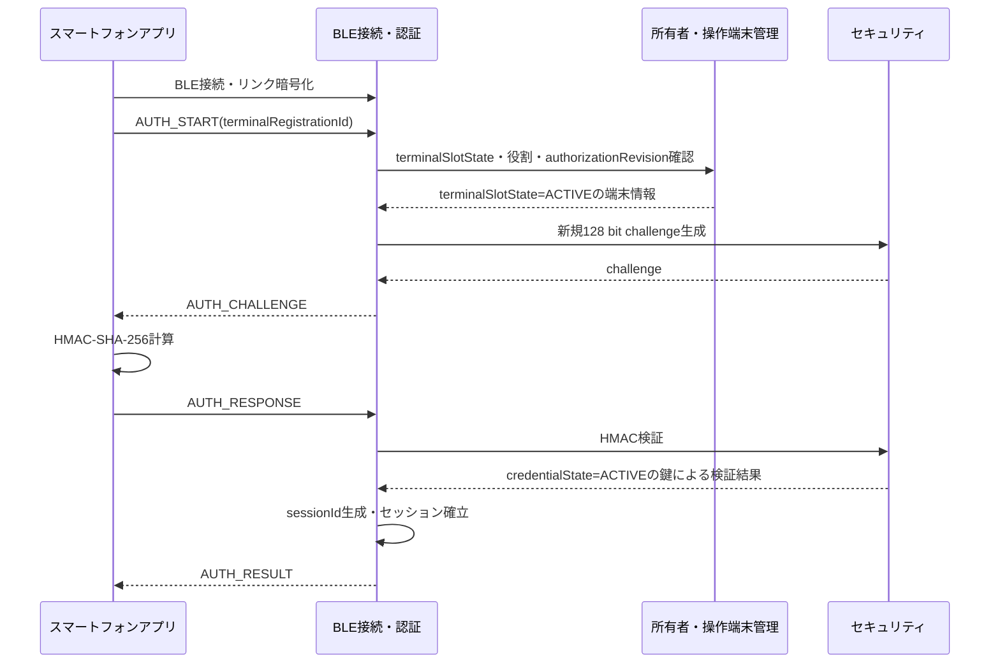

# Tank_Robot BLE接続・認証基本設計

## 目次

1. 本書の目的
2. 設計方針と適用範囲
3. 責任分界と共通条件
4. RYZ012A1とのホストインターフェース
5. 内部状態と管理情報
6. アドバタイズと本体発見
7. BLE接続・暗号化・ボンディング
8. アプリケーション層認証と操作セッション
9. GATT Service・Characteristic構成
10. アプリケーションメッセージ共通形式
11. 連番・重複・遅延・旧操作の排除
12. 操作指令の受付・振分け・最終有効受信情報
13. 通常停止・緊急停止との連携
14. 切断・再接続・通信監視
15. システム状態・電源・低消費電力との連携
16. 所有者・操作端末登録との連携
17. BLE異常検出と復旧
18. 状態通知・ログ・設定との連携
19. 実行時間・通信性能・資源方針
20. 検証方針と確認ケース
21. 主対象要求との対応
22. 設計判断・後続事項
23. 他文書へのフィードバック
24. 初版の自己確認結果と引継ぎ条件

---

## 1. 本書の目的

### 1.1 目的

本書の目的は、公開用システム要求仕様「05. BLE接続・認証」を実現するために、BLE通信部とスマートフォンアプリの間で共通して使用する通信基本方式と、Tank_Robot本体内のBLE接続・認証機能が担う責務を、詳細設計へ展開可能な粒度まで具体化することである。

### 1.2 対象範囲

本書は、スマートフォンアプリとTank_Robot本体間の近距離BLE通信について、RYZ012A1の制御、アドバタイズ、接続、Bluetooth LE Secure Connections、ボンディング、アプリケーション層認証、操作セッション、GATT、アプリケーションメッセージ、操作指令の振分け、通信断、安全停止連携、低消費電力連携および異常復旧の基本方式を具体化する。

BLEリンクが接続・暗号化済みであること、登録済み操作端末としてアプリケーション層認証に成功していること、要求された操作の権限を持つこと、およびシステム全体として操作可能であることは、それぞれ別の条件として扱う。BLE通信だけを安全判断またはアクチュエータ制御の最終判断主体としない。

本書では、BLEを通常の走行、砲塔・砲身操作、通常停止、緊急停止、緊急停止解除、通常終了、状態確認および所有者向け管理通信に使用する。Wi-Fi、インターネットまたはVPSをTank_Robot本体の遠隔操作経路として使用しない。

### 1.3 上位文書・関連文書

本書の主対象要求は公開用システム要求仕様「05. BLE接続・認証」とし、関連要求および完成済み基本設計についてはBLE接続・認証との責任分界および連携に必要な箇所を参照する。

本書は`20_要求仕様`または`30_コア要求仕様`を上位要求として使用しない。要求仕様で未確定の実現方式について本基本設計で設計値または方式を定める場合は、本書の設計判断として明示する。

#### 1.3.1 上位文書

- [`docs/00_project_overview/01_製品目的・製品目標.md`](../../../00_project_overview/01_製品目的・製品目標.md)
- [`docs/10_requirements/05. BLE接続・認証.md`](<../../../40_公開用システム要求仕様/05. BLE接続・認証.md>)
- [`04_Project/10_Tank_Robot/50_基本設計/00_Tank_Robot 基本設計について.md`](<../../00_Tank_Robot 基本設計について.md>)
- [`04_Project/10_Tank_Robot/50_基本設計/01_システム構成/Tank_Robotシステム構成.md`](../../01_システム構成/Tank_Robotシステム構成.md)
- [`04_Project/10_Tank_Robot/50_基本設計/02_システムアーキテクチャ/Tank_Robotシステムアーキテクチャ.md`](../../02_システムアーキテクチャ/Tank_Robotシステムアーキテクチャ.md)

#### 1.3.2 関連するシステム要求仕様

- [`docs/10_requirements/04. スマートフォンアプリ.md`](<../../../40_公開用システム要求仕様/04. スマートフォンアプリ.md>)
- [`docs/10_requirements/06. 所有者・操作端末管理.md`](<../../../40_公開用システム要求仕様/06. 所有者・操作端末管理.md>)
- [`docs/10_requirements/07. 走行制御.md`](<../../../40_公開用システム要求仕様/07. 走行制御.md>)
- [`docs/10_requirements/08. 砲塔・砲身制御.md`](<../../../40_公開用システム要求仕様/08. 砲塔・砲身制御.md>)
- [`docs/10_requirements/09. 停止・緊急停止.md`](<../../../40_公開用システム要求仕様/09. 停止・緊急停止.md>)
- [`docs/10_requirements/11. Wi-Fi接続.md`](<../../../40_公開用システム要求仕様/11. Wi-Fi接続.md>)
- [`docs/10_requirements/13. 設定管理.md`](<../../../40_公開用システム要求仕様/13. 設定管理.md>)
- [`docs/10_requirements/14. ログ・診断.md`](<../../../40_公開用システム要求仕様/14. ログ・診断.md>)
- [`docs/10_requirements/17. 異常検出・復旧.md`](<../../../40_公開用システム要求仕様/17. 異常検出・復旧.md>)
- [`docs/10_requirements/20. セキュリティ管理.md`](<../../../40_公開用システム要求仕様/20. セキュリティ管理.md>)
- [`docs/10_requirements/21. 状態表示・利用者通知.md`](<../../../40_公開用システム要求仕様/21. 状態表示・利用者通知.md>)
- [`docs/10_requirements/22. 性能・品質・耐久性.md`](<../../../40_公開用システム要求仕様/22. 性能・品質・耐久性.md>)

#### 1.3.3 関連する基本設計

- [`docs/20_basic_design/03_機能別基本設計/01_システム状態管理/Tank_Robotシステム状態管理基本設計.md`](../01_システム状態管理/Tank_Robotシステム状態管理基本設計.md)
- [`docs/20_basic_design/03_機能別基本設計/02_起動・終了・再起動管理/起動・終了・再起動管理基本設計.md`](../02_起動・終了・再起動管理/起動・終了・再起動管理基本設計.md)
- [`docs/20_basic_design/03_機能別基本設計/03_停止・緊急停止管理/停止・緊急停止管理基本設計.md`](../03_停止・緊急停止管理/停止・緊急停止管理基本設計.md)
- [`docs/20_basic_design/03_機能別基本設計/04_異常管理/異常管理基本設計.md`](../04_異常管理/異常管理基本設計.md)
- [`docs/20_basic_design/03_機能別基本設計/05_電源・省電力管理/電源・省電力管理基本設計.md`](../05_電源・省電力管理/電源・省電力管理基本設計.md)
- [`docs/20_basic_design/03_機能別基本設計/06_バッテリー・電気安全監視/バッテリー・電気安全監視基本設計.md`](../06_バッテリー・電気安全監視/バッテリー・電気安全監視基本設計.md)
- [`docs/20_basic_design/03_機能別基本設計/07_走行制御/走行制御基本設計.md`](../07_走行制御/走行制御基本設計.md)
- [`docs/20_basic_design/03_機能別基本設計/08_砲塔・砲身制御/砲塔・砲身制御基本設計.md`](../08_砲塔・砲身制御/砲塔・砲身制御基本設計.md)
- [`docs/20_basic_design/03_機能別基本設計/10_所有者・操作端末管理/所有者・操作端末管理基本設計.md`](../10_所有者・操作端末管理/所有者・操作端末管理基本設計.md)
- [`docs/20_basic_design/03_機能別基本設計/17_セキュリティ管理/セキュリティ管理基本設計.md`](../17_セキュリティ管理/セキュリティ管理基本設計.md)

### 1.4 用語

| 用語 | 本書での意味 |
| --- | --- |
| BLEリンク | Bluetooth LEの物理・リンク層接続が成立している状態 |
| 暗号化リンク | Bluetooth LE Secure Connectionsおよびボンディング情報によってリンク暗号化が成立している状態 |
| アプリケーション層認証 | 登録済み操作端末ごとの長期認証鍵を使用するHMAC-SHA-256チャレンジレスポンス認証 |
| 初回所有者登録追加認証 | 製品ラベルの登録用QRコードに対応する本体固有の256 bit登録秘密情報を使用し、初回所有者登録時に登録相手の正当性を追加確認する認証。Bluetooth OOBペアリングそのものではない |
| 操作セッション | アプリケーション層認証成功後、現在のBLEリンクへ対応付けて生成する一回限りの論理セッション |
| 最終有効受信情報 | 停止管理の操作指令タイムアウト判定に使用する、機能検証まで正常完了した最新操作指令の受信情報 |
| `connectionGeneration` | BLEリンクの確立・再初期化ごとに以前の接続と区別する本体内世代 |
| `sessionId` | アプリケーション層認証成功ごとに生成する操作セッション識別子 |
| `commandSeq` | 同一操作セッション内の新旧・重複を識別するアプリ→本体方向の単調増加連番 |
| `requestId` | 再送を含む一つの論理要求を対応付ける識別子 |
| `authorizationRevision` | 登録端末の有効性・役割・権限情報の世代を識別する情報 |
| `actuationEpoch` | アクチュエータ機能が管理する操作許可期間の世代。以前の操作許可に属する指令を再実行しないために使用する |
| 登録用秘密情報の暗号化転送データ | セキュリティ管理が生成する、端末長期認証鍵および登録経路に応じた所有者復旧用の秘密情報を、登録取引固有の一時保護鍵で認証付き暗号化した転送用データ |

---

## 2. 設計方針と適用範囲

### 2.1 基本方針

BLE接続・認証は次の原則で設計する。

1. Tank_Robot本体を操作可否および安全処理の最終判断主体とする。
2. BLE接続、リンク暗号化、登録時追加認証、アプリケーション層認証、端末権限およびシステム操作可否を分離して管理する。
3. 同時BLE物理接続を1台に限定する。
4. 通常操作に使用する接続ではBluetooth LE Secure Connectionsおよびボンディングを使用する。
5. Secure Connectionsのペアリング方式は初期製品ではJust Worksを採用し、新規ボンディングを本体側の明示的な登録受付期間に限定する。
6. 初回所有者登録ではJust Worksだけで所有者端末を登録せず、公開用システム要求仕様「20. セキュリティ管理」に定める製品QRの256 bit登録秘密情報による追加認証成功を長期認証情報登録の前提とする。通常利用では、登録済み端末ごとの256 bit長期認証鍵を用いたHMAC-SHA-256アプリケーション層認証を必須とする。
7. 初回OWNER、GENERAL追加およびOWNER再登録で新端末へ渡す長期認証鍵と所有者復旧用の秘密情報は、Just Worksによるリンク暗号化だけに機密性・完全性を依存して転送しない。セキュリティ管理が各登録経路で定める登録取引固有の一時保護鍵でAES-256-GCM保護した登録用秘密情報の暗号化転送データだけをBLE transportで配送する。
8. 通信再接続、再認証、低消費電力復帰、異常復旧または緊急停止解除を契機として、以前の操作指令を自動再開しない。
9. 緊急停止および通常停止のBLE処理を、通常状態通知、管理通信および診断通信より優先する。
10. 継続操作指令を無制限のFIFOへ蓄積せず、最新の操作意図を優先する。
11. BLE内部資源は固定上限を持つ静的資源とし、無制限キューおよび`malloc`/`free`を使用しない。
12. 登録済み端末に対する役割ごとに定める固定の権限規則は所有者・操作端末管理が定め、本機能はBLE `messageType`／subtypeを必要permissionへ対応付けて通信境界で権限を検査・適用する。所有者・操作端末管理のpolicyにないoperationを暗黙許可しない。

### 2.2 対象範囲

本書は次を対象とする。

- RA8M2からRYZ012A1を制御する基本方式
- BLE通信部初期化・正常性確認
- アドバタイズ、接続、切断、再接続
- BLEリンク暗号化、Secure Connections、ボンディング
- 初回所有者登録追加認証に必要なBLE transportおよび取引相関
- アプリケーション層認証、認証失敗、セッション生成・無効化
- GATT Service・Characteristic
- アプリケーションメッセージ共通形式
- 通信上の形式、長さ、セッション、連番、重複、遅延、権限の検証
- 所有者・操作端末管理の役割ごとの権限規則をBLE messageType／subtypeへ対応付けるenforcement
- 操作指令・管理要求の関連機能への提供
- 最終有効受信情報の正式な管理
- 通信断・認証無効・権限無効時の安全停止連携
- 緊急停止通信の高優先処理
- 低消費電力移行・復帰連携
- BLE通信異常、再初期化、自動復旧
- 状態通知、ログ、診断、設定情報
- 初回OWNER、GENERAL追加およびOWNER再登録の登録用秘密情報の暗号化転送データを64 byteメッセージ上限内で行う有界配送と受領確認

### 2.3 対象外

次は各担当機能で定め、本書で重複して最終判断しない。

- システム状態および状態遷移の決定
- 走行、砲塔・砲身のアクチュエータ制御アルゴリズム
- 操作指令タイムアウトの最終判定。基本送信周期50 msおよびタイムアウト300 msの値は停止・緊急停止管理基本設計で定め、本書も従う
- 通常停止、安全停止、緊急停止の停止処理そのもの
- 端末の登録情報・役割・失効状態および役割ごとに定める固定の権限規則の正式な管理
- 長期認証鍵および初回所有者登録用登録秘密情報の生成・暗号演算・秘密情報保護の内部実装。ただしセキュリティ管理が定める登録鍵エンベロープの保護契約をBLE配送時に弱めたり省略したりしない
- 低消費電力状態のシステム状態遷移および電源系統制御
- 異常の影響度・処置区分・復旧可否の最終判断
- スマートフォン画面および操作UI
- RYZ012A1の具体的なSPIコマンド、端子、クロック、DMA設定

---

## 3. 責任分界と共通条件

### 3.1 関連機能との責任分界

| 機能 | 主な責任 |
| --- | --- |
| BLE接続・認証 | BLEモジュール制御、接続、暗号化状態、登録認証通信、アプリ認証、操作セッション、`sessionId`、`commandSeq`、`requestId`、BLE受信時刻、通信層の重複・旧指令排除、共通メッセージ検証、所有者・操作端末管理の役割ごとの権限規則のBLE境界での権限検査・適用、振分け、最終有効受信情報、3経路の登録用秘密情報の暗号化転送データの有界配送・受領相関 |
| システム状態管理 | BLE接続・認証を開始可能な状態、システム全体の通常操作可否、状態遷移 |
| 所有者・操作端末管理 | 所有者・一般端末の登録、役割、失効、役割ごとに定める固定の権限規則、登録受付、`authorizationRevision`の正式な管理、登録成立の最終確定 |
| セキュリティ | 長期認証鍵、初回OWNER登録秘密、GENERAL ticket、所有者復旧用の秘密情報、各登録時の認証用の証明データ、登録用一時保護鍵、登録用秘密情報の暗号化転送データの暗号学的生成・検証、暗号用途乱数、HMAC-SHA-256、鍵・秘密情報保護、セキュリティ事象の方針 |
| 停止・緊急停止管理 | 継続操作指令50 msおよび操作指令タイムアウト300 msの値の決定、タイムアウト最終判定、安全停止、緊急停止、停止結果集約 |
| 走行制御 | `driveEpoch`の生成・更新、走行指令データの意味・値域・中立・現在の状態での実行可否・通信データ内の`actuationEpoch`一致の機能固有検証、実行、局所停止結果、走行継続操作情報 |
| 砲塔・砲身制御 | 砲塔・砲身指令データの意味・値域・現在の状態での実行可否の機能固有検証、`actuationEpoch`、ARM、PWM制御、局所停止結果 |
| 電源・省電力管理 | `PWR_BLE`、通常・低消費電力への切替、復帰、低頻度アドバタイズ要求 |
| 異常管理 | BLE異常の影響度・処置・自動復旧許可および最大試行回数 |
| スマートフォンアプリ | 接続開始、ペアリング操作、登録経路別QRまたコード読取り・認証用の証明データの生成、登録用秘密情報の暗号化転送データ受領・再構成・復号・秘密情報保護領域への保存・受領結果通知、通常アプリ認証、現行操作context取得、当該epochを含む指令生成、送信待ち指令の最新化・失効時破棄、安全操作、再接続 |
| ログ・診断 | BLEイベントの記録方式、保存容量、保持期間、VPS送信 |

BLE接続・認証は、共通ヘッダ、セッション、連番、再送識別、受信時刻および通信上の妥当性を判断する。一方、対象機能に固有のデータ本体の意味、値域、現在状態での実行可否、実際の実行および機能結果は各対象機能が判断する。BLE側の通信検証成功を、対象機能の受付成功または実行成功へ読み替えない。

### 3.2 操作権限の基本区分

登録済み端末に対する**役割ごとに定める固定の権限規則は所有者・操作端末管理が定める**。本節の表は、そのpolicyをBLE `messageType`／subtypeへ適用するenforcement要約であり、本書が独自の権限体系を定義するものではない。

| 区分 | BLE境界で許可する処理 |
| --- | --- |
| 未認証接続 | ペアリング・登録条件確認・初回所有者登録追加認証・アプリ認証に必要な最小通信のみ。登録・復旧transactionは所有者・操作端末管理の受付条件とセキュリティ管理のproof条件に従う |
| 一般操作端末 | 所有者・操作端末管理のpolicyでGENERALへ許可された走行、砲塔、砲身、ARM、通常停止、緊急停止、緊急停止解除、通常終了、主要状態確認 |
| 所有者端末 | 所有者・操作端末管理のpolicyでOWNERへ許可されたGENERAL共通機能に加え、端末管理、Wi-Fi設定、OWNER確認付き工場初期化要求その他のOWNER-only管理要求 |

BLE接続・認証は、各`messageType`／subtypeを所有者・操作端末管理のoperation categoryへ対応付け、現在端末のrole、`terminalSlotState=ACTIVE`、`authorizationRevision`および現在sessionを照合して権限を検査・適用する。所有者・操作端末管理のpolicyで明示許可されていない、または必要permissionへ一意に対応付けられないoperationはfail-closedで拒否する。BLE接続・認証だけの変更でGENERALまたはOWNERの権限を拡張しない。

初回OWNER登録、GENERAL候補端末のproof／secret受領、OWNER再登録等は登録済み端末の通常role-permissionとは別の登録・復旧transactionであり、所有者・操作端末管理の現在管理取引とセキュリティ管理のproof条件に基づいて許可する。

BLE境界のauthorization成功後も、対象機能へ認証済み端末識別情報、役割、`authorizationRevision`および要求情報を提供する。システム状態管理と対象domain機能が自身のstate／Safety条件を含めて最終判断し、BLE authorization成功だけを実行成功へ読み替えない。

### 3.3 安全優先

安全関連受信経路は通常操作・状態通知・ログ・管理要求と論理的に分離する。緊急停止要求を受け付けた後、ログ記録、アプリへの通常応答、状態通知、所有者管理、Wi-Fi設定その他の処理完了を待って停止・緊急停止管理への通知を遅延させない。

---

## 4. RYZ012A1とのホストインターフェース

### 4.1 採用方式

RA8M2とRYZ012A1間はSPIを使用する。RA8M2をホスト側制御主体とし、RYZ012A1内でBLEスタックおよび無線処理を実行する。

基本構成は次とする。

- SPI：コマンド、応答、イベントデータ転送
- IRQ：RYZ012A1からRA8M2への非同期イベント通知
- RESET：RA8M2からRYZ012A1のハードウェアリセット
- `PWR_BLE`：電源・省電力管理が制御するBLE通信部電源

具体的なSPI端子、クロック周波数、CPOL/CPHA、CS制御、DMA使用、ベンダコマンドおよびフレーム形式は詳細設計で定める。

### 4.2 ホスト通信の基本規則

RA8M2は、RYZ012A1への一つの制御要求について、要求識別、応答待ち、正常完了、否定応答、タイムアウトを区別する。同一の初期化、アドバタイズ開始・停止、切断、再初期化処理を重複開始しない。

IRQを受けた場合は、通常の周期処理待ちだけに依存せず、RYZ012A1のイベントを読み出す。安全関連Characteristicへの書込みイベントは、通常状態通知や管理通信より優先して本体内へ引き渡す。

### 4.3 BLE通信部初期化

初期化は次の順序を基本とする。

1. `PWR_BLE`の供給および電気安全上の使用許可を確認する。
2. RYZ012A1を既知のリセット状態へ移行する。
3. SPI通信を確立する。
4. モジュールの応答および識別情報を確認する。
5. GATT Service・Characteristicおよび必要なBLE設定を確立する。
6. ボンディング情報の利用可否を確認する。
7. IRQイベント受信経路を確認する。
8. システム状態で許可されている場合にアドバタイズを開始する。
9. 起動・終了・再起動管理へ初期化結果を返す。

初期化完了前は通常操作メッセージを有効化しない。

### 4.4 モジュール正常性

通常動作中は、SPI要求の応答、非同期イベントの整合、接続状態取得およびモジュール状態取得によってBLE通信部の正常性を監視する。操作可能状態でRYZ012A1との制御通信を失い、現在の接続状態を確認できない場合は、認証済み接続が継続しているものとして扱わない。

安全停止性能はRYZ012A1の定期ヘルスチェック周期だけに依存させず、操作指令タイムアウトおよび通信イベント異常を別経路で使用する。

### 4.5 ボンディング情報

Bluetoothのボンディング情報と、アプリケーション層の登録端末情報・長期認証鍵は別の情報として扱う。BLEアドレスまたはボンドハンドルだけをアプリケーション上の端末識別子としない。

削除・失効した端末に対応するボンド情報は削除対象とする。ボンド削除に失敗しても、所有者・操作端末管理で端末が無効である限りアプリケーション層認証を成功させない。

---

## 5. 内部状態と管理情報

### 5.1 状態を分離して管理する

BLE接続・認証では、単一の巨大な状態列挙へまとめず、少なくとも次を分離して管理する。

#### BLEモジュール状態

- `MODULE_OFF`
- `MODULE_INITIALIZING`
- `MODULE_READY`
- `MODULE_RECOVERING`
- `MODULE_FAULTED`

#### アドバタイズ状態

- `ADV_OFF`
- `ADV_NORMAL`
- `ADV_LOW_POWER`

#### BLEリンク状態

- `NO_LINK`
- `LINK_CONNECTED`
- `LINK_SECURED`
- `DISCONNECTING`

#### アプリ認証状態

- `UNAUTHENTICATED`
- `AUTHENTICATING`
- `AUTHENTICATED`
- `INVALIDATING`

#### 登録通信状態

- `REGISTRATION_CLOSED`
- `REGISTRATION_OPEN`
- `REGISTRATION_IN_PROGRESS`

これらはシステム状態ではない。システム状態はシステム状態管理が一元管理する。

### 5.2 接続世代

新しいBLEリンクを確立した場合、BLE通信部を再初期化した場合、または以前の接続状態を安全に継続できない状態から復旧した場合、`connectionGeneration`を更新する。

以前の`connectionGeneration`に属する接続別認証試行、challenge、nonce、認証用の証明データの検証成功状態、登録用一時session key、fragment、受信途中メッセージ、送信待ちメッセージ、要求結果または操作セッションを新しい接続へ引き継がない。

所有者・操作端末管理が所有する`managementTransactionId`、登録対象roleおよび60秒受付期限はBLE接続世代とは別の管理取引情報である。proof成功前に所有者・操作端末管理が残り受付時間内の再接続を許可する場合、またはGENERAL追加でOWNER接続から新GENERAL接続へ計画的に切り替える場合、これらの管理取引情報を維持できる。GENERAL追加ではセキュリティ管理が許可する`K_GENERAL_REG_AUTH`とticket検証情報だけを管理取引に対応付けて維持し、旧OWNER操作セッションその他の接続別情報は維持しない。

### 5.3 操作セッション情報

認証済みセッションは少なくとも次の情報を管理する。

| 情報 | 用途 |
| --- | --- |
| `sessionId` | 現在の認証済み操作セッション識別 |
| `connectionGeneration` | 現在のBLEリンクとの対応 |
| `terminalRegistrationId` | 所有者・操作端末管理上の登録端末 |
| `terminalRole` | 所有者／一般操作端末 |
| `authorizationRevision` | 現在の登録・権限世代 |
| `lastAcceptedCommandSeq` | 再送・重複・逆順判定 |
| `authenticatedAt` | 認証成立時刻 |

`sessionId`は認証成功ごとに暗号用途乱数生成機能を用いて生成する64 bit値とする。値0は未認証を表す予約値とし、有効な`sessionId`として使用しない。

### 5.4 最終有効受信情報

最終有効受信情報の正式な管理元はBLE接続・認証とする。走行および砲塔旋回を別の監視対象として管理し、一方の操作または状態照会によって他方の最終有効受信時刻を更新しない。

最終有効受信情報には少なくとも次を含める。

- 対象操作区分
- `sessionId`
- `authorizationRevision`
- `commandSeq`
- `actuationEpoch`（対象機能が使用する場合）
- `rxMonotonicTime`
- 機能検証結果

走行については走行制御が`driveEpoch`の値と更新を所有し、BLE接続・認証は走行制御から取得した現行値を`ACTUATION_CONTEXT`でスマートフォンアプリへ通知し、`DRIVE_COMMAND`のwire上`actuationEpoch`として走行制御へ配送する。BLE接続・認証は値を生成・再採番せず、走行タイムアウトの相関には`sessionId`、`authorizationRevision`、`commandSeq`、`actuationEpoch`、元の`rxMonotonicTime`および走行制御の継続操作情報を使用する。

---

## 6. アドバタイズと本体発見

### 6.1 通常アドバタイズ

通常のBLE接続待機では、接続可能アドバタイズ間隔を100 msとする。100 msは初期基本設計値とし、iPhoneからの発見時間、消費電力、周辺BLE環境への影響を実機評価する。公開用システム要求仕様「22. 性能・品質・耐久性」の通常評価条件では、BLE探索開始から本体発見まで5秒以内を満たすことを成立条件とする。

アドバタイズは、システム状態管理からBLE接続受付を許可され、RYZ012A1が正常で、現在BLEリンクが存在しない場合に限り接続可能とする。

### 6.2 低消費電力アドバタイズ

低消費電力状態の接続可能アドバタイズ間隔は電源・省電力管理で確定している1,022.5 msを使用する。BLE接続・認証は独自の異なる値を持たない。

### 6.3 アドバタイズ情報

アドバタイズ情報には、少なくともTank_Robot用Service UUIDを含める。Scan Responseを利用できる場合は、製品情報管理から提供される秘密情報ではない短縮本体識別子を用いて、`TankRobot-XXXXXX`形式の識別用ローカル名を提供する。

`XXXXXX`は利用者が複数の本体から対象を識別するための公開識別子であり、所有者氏名、端末情報、長期認証鍵、登録秘密情報、ボンディング情報その他の秘密情報を含めない。

BLEアドレス自体をアプリケーション層の本体識別子または端末認証根拠として使用しない。

### 6.4 接続中の扱い

同時物理接続は1台だけとする。BLEリンク成立後は接続可能アドバタイズを停止する。リンク終了後、現在のシステム状態で接続受付が許可されている場合だけ再開する。

---

## 7. BLE接続・暗号化・ボンディング

### 7.1 同時接続数

Tank_Robot本体が同時に保持するBLEリンクは1接続とする。通常操作用接続と管理用接続を並行保持しない。

現在接続中に別端末から接続を試行された場合、2台目を通常操作または管理操作へ使用可能としない。端末切替えは、現在の接続・操作セッションを終了した後、新しい端末が接続、暗号化、アプリケーション層認証および権限確認を改めて行う方式とする。

### 7.2 接続パラメータ

通常操作用の接続は次を基本設計値とする。

| 項目 | 基本設計値 |
| --- | --- |
| Preferred Connection Interval | 30～45 ms |
| Peripheral Latency | 0 |
| Supervision Timeout | 6 s |
| PHY | LE 1M必須、LE 2Mは双方対応時に使用可 |
| LE Coded PHY | 初期製品の通常操作では使用しない |
| ATT MTU | 185を目標、67以上を必須条件 |
| Data Length | 251 octetsを要求可能。成立性を必須条件としない |

Supervision Timeout 6 sはリンク層切断検出の上限であり、操作中に6 s動作を継続してよいことを意味しない。走行・砲塔旋回の無指令継続は停止・緊急停止管理が所有する300 msの操作指令タイムアウトによって別に保護し、BLE接続・認証は判定に必要な最終有効受信情報を提供する。

公開用システム要求仕様「22. 性能・品質・耐久性」の通常評価条件では、アプリがBLE接続を開始してからアプリケーション層認証完了まで10秒以内を満たす。第8.4節の認証タイムアウト10秒および未認証接続最大20秒は異常・滞留を打ち切る上限であり、通常接続の10秒性能予算として使い切ってよい値ではない。

### 7.3 Secure Connectionsとボンディング

通常操作に使用するBLEリンクはBluetooth LE Secure Connectionsによって暗号化し、ボンディングを使用する。BLE Legacy Pairingを通常運用で使用しない。

初期製品では、Tank_Robot本体に十分な数値入力・比較表示手段を設けない前提からSecure Connections Just Worksを採用する。

Just Worksによるリンク成立だけを操作端末認証成功とは扱わない。初回所有者登録では第16.3節の登録秘密情報による追加認証を必須とし、登録済み端末の通常操作開始前には第8章のアプリケーション層認証を必須とする。

製品ラベルのQRコードに対応する登録秘密情報は、Bluetooth LE Secure ConnectionsのOOBペアリング情報として使用しない。Just Worksによるリンク暗号化と、初回所有者登録の追加認証を別の層として扱う。

### 7.4 新規ペアリングを許可する条件

新しい端末とのペアリング・ボンディングは、所有者・操作端末管理が登録受付を開始し、本体側の明示的な物理登録操作を含む登録条件が成立している期間だけ許可する。

通常運用中に未登録・未ボンディング端末からペアリング要求を受けても、新規ボンディングを開始しない。

登録済み端末のボンド情報をスマートフォン側または本体側で失った場合、以前のアプリケーション層登録情報だけを根拠として無条件に再ボンディングしない。再び使用する場合は、所有者・操作端末管理が許可する登録または再登録手順を要求する。

### 7.5 ボンディングとアプリ認証の分離

ボンディング済みであっても、登録済みアプリケーション端末として認証できなければ通常操作へ使用しない。逆に、アプリケーション上の登録記録が残っていても、必要なBLEリンク暗号化を確立できない接続を通常操作へ使用しない。

---

## 8. アプリケーション層認証と操作セッション

### 8.1 認証方式

アプリケーション層認証は公開用システム要求仕様「20. セキュリティ管理」およびセキュリティ管理の方式を使用する。

- 登録済み端末ごとに異なる256 bit長期認証鍵
- HMAC-SHA-256
- 認証試行ごとに新しい128 bitチャレンジ
- 暗号用途乱数生成機能を使用
- チャレンジは一回限り
- 過去接続、失敗済み認証、期限切れチャレンジを再使用しない

長期認証鍵の生成・保存・HMAC計算はセキュリティ機能が担当し、BLE接続・認証は認証通信シーケンスと結果管理を担当する。

### 8.2 認証シーケンス

認証は次の順序を基本とする。

BLE接続・認証は、所有者・操作端末管理から`terminalSlotState=ACTIVE`を取得できた端末だけを通常認証候補とし、セキュリティ管理が`credentialState=ACTIVE`の鍵でHMACを正常検証した場合だけ`sessionId`を生成する。BLE接続・認証は`terminalSlotState`および`credentialState`を更新しない。片方だけがACTIVE、状態取得不能または対応revision不一致の場合は認証セッションを成立させず、登録後処理中または不整合として所有者・操作端末管理/セキュリティ管理へ再照合を要求し、必要に応じて異常管理へ通知する。

### 8.3 認証対象データ

HMAC-SHA-256の認証対象は固定順序のバイナリ列とし、少なくとも次を含める。

1. `protocolMajor`
2. `protocolMinor`
3. Tank_Robotの公開本体識別情報
4. `terminalRegistrationId`
5. `authAttemptId`
6. `connectionGeneration`
7. 128 bitチャレンジ

認証対象バイト列は10章と同じlittle-endian規則で生成する。曖昧な文字列連結を使用しない。セキュリティ管理はこの意味を変更せず、暗号学的検証を担当する。

### 8.4 認証時間

チャレンジ有効時間および1回のアプリケーション層認証処理タイムアウトを10 sとする。認証開始後10 s以内に有効なレスポンスを確認できない場合は当該認証試行を失敗とし、チャレンジを破棄する。

暗号化リンク成立後20 sを超えてもアプリケーション層認証または登録通信を開始・完了できない接続は、通常操作へ使用せず切断対象とする。

これらは異常時の打切り値であり、公開用システム要求仕様「22. 性能・品質・耐久性」の「BLE接続開始からアプリケーション層認証完了まで通常条件で10秒以内」という性能要求を緩和しない。

### 8.5 認証成功

認証成功時は新しい64 bit `sessionId`を生成し、現在の`connectionGeneration`、端末登録識別子、役割および`authorizationRevision`に対応付ける。

`commandSeq`の期待初期値を1とする。認証成功以前の受信操作、旧セッションの連番および旧セッションの送信待ちデータを引き継がない。

初期製品では有効なBLEリンクが継続している間の時間経過だけを理由とする周期再認証は行わない。再認証は、切断・再接続、BLE再初期化、現在端末の認証情報・権限世代変更、端末失効、セッション連番枯渇その他のセッション無効化条件で要求する。

### 8.6 認証失敗

認証失敗時は操作セッションを生成せず、通常操作Characteristicを有効な操作経路として扱わない。

同じ端末識別情報または同じボンド済みピアから短時間に認証失敗が繰り返された場合、3回連続失敗で当該接続を切断し、30 sのアプリケーション認証待機時間を設ける。待機時間は初期基本設計値であり、DoS耐性、利用者操作性および誤操作時の復旧性を評価する。

長期間の失敗回数を永続保持する高度な攻撃検出は初期製品の対象外とする。

### 8.7 セッション無効化

次のいずれかで現在の操作セッションを直ちに無効化する。

- BLE切断
- BLE通信部再初期化
- 現在端末の失効・削除
- 現在端末の認証情報無効化
- `authorizationRevision`不一致
- BLE通信状態を確認できない異常
- 低消費電力移行に伴う接続終了
- 工場出荷状態への初期化
- 所有者再登録による旧端末群の失効

無効化時は新しい通常操作の受付を禁止し、未処理通常指令を破棄する。操作中であった場合は停止・緊急停止管理へ安全停止要求を提供する。

---

## 9. GATT Service・Characteristic構成

### 9.1 基本構成

Tank_Robot固有通信は一つの128 bit Vendor Specific Serviceへ集約する。標準GAP/GATT ServiceはRYZ012A1の標準機能として扱い、本表のCharacteristic数に含めない。

**Tank_Robot Service UUID**  
`8fca2489-39fd-4939-99a5-84258c961a1c`

### 9.2 Characteristic

| 論理名 | UUID | Property | 主用途 |
| --- | --- | --- | --- |
| `CONTROL_RX` | `0e15940f-a143-4130-915c-a703ff5e57b8` | Write Without Response | 走行、砲塔、砲身の通常操作 |
| `SAFETY_RX` | `39f4d6e8-f050-4d63-9995-9f727a072c02` | Write Without Response | 通常停止、緊急停止 |
| `REQUEST_RX` | `4bd689eb-d988-49e6-b5f2-9cb62e00f5dd` | Write | 認証、登録追加認証、ARM、緊急停止解除、通常終了、状態照会、所有者管理、Wi-Fi設定 |
| `RELIABLE_TX` | `f19d76b9-2d91-48f4-b642-959ddec5400e` | Indicate | 認証チャレンジ、登録追加認証結果、登録鍵エンベロープ、認証結果、管理・離散要求結果 |
| `SAFETY_STATE_TX` | `3384a88f-d11a-4af9-adb0-97495885ae4d` | Notify + Indicate | 緊急停止受付・緊急停止状態等の重要安全状態 |
| `STATE_TX` | `7c4309f8-c07a-4edb-a92d-82d973f10de5` | Notify | 通常状態、接続・認証・操作可否、主要機能状態 |

`STATE_TX`用UUIDは本基本設計で固定する。上記UUID群を一つのプロトコル世代として管理し、意味を変更して再利用しない。

### 9.3 アクセス制御

- `CONTROL_RX`および`SAFETY_RX`は、暗号化リンクかつアプリケーション層認証済みセッションを必須とする。
- `REQUEST_RX`は暗号化リンクを必須とする。未認証時は認証・登録に必要なメッセージ種別だけを許可する。
- `RELIABLE_TX`は暗号化リンクを必須とし、認証または登録処理に必要な範囲では未認証セッションへ使用できる。
- `STATE_TX`は原則としてアプリケーション層認証後に通知する。
- `SAFETY_STATE_TX`は認証済み接続へ安全状態を通知する。

アプリケーション層認証または初回所有者登録追加認証を開始する前に、スマートフォンアプリは少なくとも`RELIABLE_TX`のIndicationを有効化する。通常のアプリケーション層認証成功後、`SAFETY_STATE_TX`および`STATE_TX`を有効化する。

### 9.4 ATT応答の意味

GATT WriteのATT応答はBLEスタックが値を受領したことだけを意味し、対象機能が要求を受け付けたこと、実行したこと、安全状態へ遷移したこと、登録追加認証に成功したこと、または処理が正常完了したことを意味しない。

処理結果が必要な要求は、`requestId`に対応するアプリケーション層結果を`RELIABLE_TX`、`SAFETY_STATE_TX`または`STATE_TX`で通知する。

---

## 10. アプリケーションメッセージ共通形式

### 10.1 基本形式

アプリケーションメッセージはバイナリ形式とし、初期プロトコル版を`1.0`とする。整数はlittle-endianとする。

ATT MTU 67のときに1回のCharacteristic Valueへ収まるよう、**1個のBLEアプリケーションメッセージ**の最大長を64 byteとする。共通ヘッダ24 byteを除くpayloadは最大40 byteであり、アプリケーション層で64 byteを超える通常操作メッセージを定義しない。

64 byteは一つのメッセージ上限である。通常操作を任意分割して遅延再生する方式は採用しない。一方、セキュリティ管理が初回OWNER、GENERAL追加およびOWNER再登録で生成する登録用秘密情報の暗号化転送データは第10.8節、Wi-Fi接続のWi-Fi設定は第10.9節の有界な複数メッセージ取引を使用する。分割対象は本書で明示した登録管理データと`WIFI_SETTING`に限定し、走行・砲塔等の通常操作へ拡張しない。

### 10.2 共通ヘッダ

共通ヘッダは24 byte固定とする。

| Offset | フィールド | 型・長さ | 内容 |
| ---: | --- | --- | --- |
| 0 | `protocolMajor` | uint8 | 初期値1 |
| 1 | `protocolMinor` | uint8 | 初期値0 |
| 2 | `messageType` | uint8 | メッセージ種別 |
| 3 | `flags` | uint8 | 再送・応答要求・重要度等 |
| 4 | `headerLength` | uint16 | 初期版24 |
| 6 | `payloadLength` | uint16 | 0～40 |
| 8 | `sessionId` | uint64 | 未認証時0、認証後は現行セッション |
| 16 | `messageSeq` | uint32 | 認証済みアプリ→本体メッセージでは`commandSeq`として使用 |
| 20 | `requestId` | uint32 | 論理要求の対応付け。不要時0可 |

実際のCharacteristic Value長は`headerLength + payloadLength`との一致を必須とする。予約値、未定義flag、未対応`messageType`または過大長を正常メッセージとして処理しない。

`sessionId`、`commandSeq`、`requestId`、BLE受信時刻および共通ヘッダの妥当性はBLE接続・認証が所有する通信契約である。対象機能に固有のデータ本体の意味・値域・現在の状態での実行可否は各対象機能が所有する。

### 10.3 flag

初期版では次だけを定義する。

- bit0 `RETRY`：同一`requestId`の再送
- bit1 `RESPONSE_EXPECTED`：アプリケーション層結果を要求
- bit2 `CRITICAL`：安全関連メッセージ
- bit3～7：予約。受信時0を要求する

### 10.4 メッセージ種別

#### メッセージの用途と使用するCharacteristic

初期版で少なくとも次を定義する。

| 種別 | 使用Characteristic | 内容 |
| --- | --- | --- |
| `AUTH_START` | `REQUEST_RX` | アプリ認証開始 |
| `AUTH_RESPONSE` | `REQUEST_RX` | HMACレスポンス |
| `SESSION_END` | `REQUEST_RX` | 明示的なセッション終了 |
| `DRIVE_COMMAND` | `CONTROL_RX` | 走行継続指令 |
| `TURRET_COMMAND` | `CONTROL_RX` | 砲塔LEFT/STOP/RIGHT継続指令 |
| `BARREL_TARGET` | `CONTROL_RX` | 砲身0～1000目標位置 |
| `TURRET_ARM` | `REQUEST_RX` | `MANUAL_DATUM_ARM`要求 |
| `NORMAL_STOP` | `SAFETY_RX` | 走行通常停止 |
| `EMERGENCY_STOP` | `SAFETY_RX` | 緊急停止 |
| `EMERGENCY_STOP_RELEASE` | `REQUEST_RX` | 明示的な緊急停止解除要求 |
| `NORMAL_SHUTDOWN` | `REQUEST_RX` | 通常終了要求 |
| `STATUS_QUERY` | `REQUEST_RX` | 状態再取得要求 |
| `OWNER_MANAGEMENT` | `REQUEST_RX` | 所有者・端末管理通信。初回OWNER登録、GENERAL追加、OWNER再登録の認証用証明データ、登録秘密情報エンベロープの受領確認および取消しを含む |
| `WIFI_SETTING` | `REQUEST_RX` | 認証済みOWNERによるWi-Fi設定の分割データおよび受信取消し |
| `AUTH_CHALLENGE` | `RELIABLE_TX` | 認証チャレンジ |
| `AUTH_RESULT` | `RELIABLE_TX` | 認証結果 |
| `REQUEST_RESULT` | `RELIABLE_TX` | 個別要求の結果。登録認証の証明データの検証結果、GENERAL追加用チケット一式、登録秘密情報エンベロープの分割データ、およびWi-Fi設定の受付・取消し・最終結果を含む |
| `SAFETY_EVENT` | `SAFETY_STATE_TX` | 緊急停止受付、状態遷移等 |
| `STATE_SNAPSHOT` | `STATE_TX` | 状態表示・利用者通知機能の`STATUS_SUMMARY`をBLE通信で送るための表現（`STATUS_SUMMARY_V1`） |
| `ACTUATION_CONTEXT` | `STATE_TX` | 操作の前提情報。現行`authorizationRevision`、走行制御機能の`driveEpoch`、砲塔・砲身制御機能の`actuationEpoch`および各値の有効性を通知する |

#### 状態通知の内容と通信形式

`STATE_SNAPSHOT`は、状態表示・利用者通知機能が管理する`STATUS_SUMMARY`の内容を、BLE通信で送るためのメッセージである。

BLE接続・認証機能は、状態表示・利用者通知機能が確定した`statusGeneration`、`faultListGeneration`およびサマリの各項目を通信形式へシリアライズする。
システム状態、システム全体の操作可否、主制限理由、表示パターン、表示する異常の選択、およびOTA・時刻・通信・バッテリー情報の意味を、再判定または再採番しない。

プロトコル1.0のペイロード形式は、第10.10節で定める。

#### 登録済み端末による通常の権限確認

受信する`messageType`と、その配下のサブタイプ（処理の区分）には、所有者・操作端末管理機能の役割ごとの権限規則に対応する、必要な権限を設定する。
通常の操作・管理通信は、次のように扱う。

| 対象 | 権限の扱い |
| --- | --- |
| `DRIVE_COMMAND`、`TURRET_COMMAND`、`BARREL_TARGET`、`TURRET_ARM` | GENERAL／OWNER共通 |
| `NORMAL_STOP`、`EMERGENCY_STOP`、`EMERGENCY_STOP_RELEASE`、`NORMAL_SHUTDOWN` | GENERAL／OWNER共通 |
| `STATUS_QUERY` | GENERAL／OWNER共通 |
| 通常の端末管理変更、`WIFI_SETTING` | OWNERだけに許可することを基本とする |
| OWNER確認付き工場初期化要求 | OWNERだけに許可する。所有者・操作端末管理機能が定める物理確認条件も別途必要とする |

登録済みOWNERによる端末追加・削除・失効などの管理変更サブタイプでは、所有者・操作端末管理機能の権限規則に従い、BLE接続・認証機能がOWNERであることを確認する。

#### 初回登録・候補端末・所有者再登録の認可条件

`OWNER_MANAGEMENT`配下には、次の処理を区別するサブタイプを設ける。

- 初回OWNER登録の追加認証
- GENERAL追加用チケットの受渡しと、認証用証明データ（proof）の検証
- OWNER再登録の認証用証明データの検証
- 登録秘密情報エンベロープの分割データ
- アプリの秘密情報保護領域への保存完了を示す受領確認
- 登録の取消しと結果

次の登録・復旧サブタイプには、前記の通常の役割ごとの権限規則とは別の認可条件を適用する。

- 初回OWNER登録
- GENERAL候補端末の認証用証明データの検証と、登録秘密情報の受領
- OWNER再登録

これらでは、所有者・操作端末管理機能が管理する現在の管理取引と、セキュリティ管理機能が定める証明データの検証条件を、必要な認可条件として扱う。

#### Wi-Fi設定の要求と結果

`WIFI_SETTING`配下には、次のサブタイプを設ける。

- `WIFI_SETTING_DATA_FRAGMENT`
- `WIFI_SETTING_CANCEL`

`REQUEST_RESULT`配下には、同じ`requestId`に対応する次の結果を区別するサブタイプを設ける。

- `WIFI_SETTING_ACCEPTED`
- `WIFI_SETTING_REJECTED`
- `WIFI_SETTING_CANCELLED`
- `WIFI_SETTING_TIMEOUT`
- Wi-Fi接続機能の最終結果

サブタイプの具体的な数値は詳細設計で確定するが、第10.9節の上限、状態遷移および結果の意味は変更しない。

#### 詳細設計で定める形式と互換性

`OWNER_MANAGEMENT`に関する次の項目は、セキュリティ管理基本設計で確定した認証・鍵保護の意味を変更しない範囲で、詳細設計に定める。

- サブタイプの具体的な数値
- 各認証対象バイト列における項目の配置位置
- 第10.8節以外のペイロード配置

メッセージ種別の具体的な数値も、本書で定めた意味を保ったまま詳細設計で確定する。
数値の変更は、互換性管理の対象とする。

新しい受信`messageType`またはサブタイプを追加する場合は、所有者・操作端末管理機能の権限規則における操作区分と、必要な権限を同時に定義する。
権限確認に未対応のまま、許可する側に倒して受け付けない。

#### 通常状態メッセージへの格納禁止情報

次の情報を通常状態メッセージへ格納しない。

- 登録秘密情報そのもの
- 長期認証鍵そのもの（暗号化等で保護する前の値）
- 登録用の一時保護鍵

### 10.5 通常操作ペイロード共通情報

通常操作のペイロード先頭には、対象機能が必要とする範囲で次を含める。

- `authorizationRevision`：uint32
- `actuationEpoch`：uint32。`DRIVE_COMMAND`では走行制御が所有する`driveEpoch`、砲塔・砲身指令では砲塔・砲身制御が所有する`actuationEpoch`を設定し、アクチュエータ操作世代を使用しないメッセージでは0
- 対象機能固有の指令値

`DRIVE_COMMAND`は、共通情報に続いて次の走行固有値をlittle-endianで格納する。

- `longitudinal`：int16、`-1000..+1000`。正を前進、負を後退、0を中立とする。
- `turn`：int16、`-1000..+1000`。正を機体向きの右旋回、負を左旋回、0を直進とする。

`DRIVE_COMMAND`では、走行制御が所有しBLE接続・認証の`ACTUATION_CONTEXT`で通知した現行`driveEpoch`を、通信データ内の`actuationEpoch`へ設定する。0は未確立または無効な操作contextを表し、有効な走行指令へ使用しない。走行制御は受信値と現行`driveEpoch`の一致を受付前と実行直前に確認する。BLE接続・認証は`driveEpoch`を推測・再採番せず、受信時点の現行値を旧指令へ後付けしない。

BLE接続・認証は上記fieldの存在・長さ・整数表現を確認するが、`longitudinal`/`turn`の値域、中立処理、走行mix、現在の走行実行可否は走行制御が最終検証する。範囲外値をBLE側でクランプして有効指令へ変更しない。

砲塔・砲身は砲塔・砲身制御に従い、砲塔LEFT/STOP/RIGHT、砲身0～1000、`authorizationRevision`および`actuationEpoch`を配送する。

### 10.6 認証メッセージ

`AUTH_RESPONSE`は64 byte以内へ収めるため、ペイロードを次の40 byte以内とする。

- `authAttemptId`：uint32
- `terminalRegistrationId`：uint32
- HMAC-SHA-256：32 byte

`AUTH_CHALLENGE`は少なくとも`authAttemptId`、`connectionGeneration`、公開本体識別情報および128 bitチャレンジを含める。

### 10.7 プロトコル互換性

`protocolMajor`が異なるメッセージを通常処理しない。`protocolMinor`は同一Major内の後方互換拡張に使用し、受信側が意味を理解できないmessageTypeまたは必須項目を含む場合は拒否する。

本基本設計の初期protocol 1.0は詳細設計・実装開始前のbaselineとして、`DRIVE_COMMAND.actuationEpoch`へ走行制御の現行`driveEpoch`を格納する。本修正前の設計案であった固定値0を互換動作として残さず、0の走行指令を有効化しない。将来この意味を変更する場合はprotocol versionと互換性管理を伴って改訂する。

プロトコル不一致を安全条件の無効化や互換モードによる強制操作で回避しない。

### 10.8 登録データの有界分割配送

セキュリティ管理が生成する登録用秘密情報の暗号化転送データの中核サイズは次とする。

| 登録経路 | protected plaintext | AES-GCM nonce/tagを含む中核サイズ |
| --- | --- | ---: |
| 初回OWNER | 32 byte terminal key＋16 byte 所有者復旧用の秘密情報 | 76 byte |
| GENERAL追加 | 32 byte terminal key | 60 byte |
| OWNER再登録 | 32 byte terminal key＋16 byte新しい所有者復旧用の秘密情報 | 76 byte |

version、予約領域その他の固定fieldを含む一つの登録論理データは96 byte以下とする。セキュリティ管理が生成する内容がこの上限を超える場合は暗黙に切り詰めたりfragment数を増やしたりせず、本書とセキュリティ管理のprotocol契約を改訂する。

protocol 1.0では、一つの40 byte payloadへ収まらない登録論理データを`RELIABLE_TX`のIndicationによる**最大3メッセージの有界分割取引**として配送する。fragment payloadの先頭8 byteを次の固定headerとし、残り最大32 byteをfragment dataとする。

| Offset | field | 型・長さ | 内容 |
| ---: | --- | --- | --- |
| 0 | `registrationSubtype` | uint8 | 初回OWNER、GENERAL追加、OWNER再登録および配送対象の区別 |
| 1 | `fragmentIndex` | uint8 | 0開始、最大2 |
| 2 | `fragmentCount` | uint8 | 1～3 |
| 3 | `reserved` | uint8 | 0固定 |
| 4 | `totalLength` | uint16 | 登録論理データ全長、最大96 |
| 6 | `fragmentOffset` | uint16 | 登録論理データ先頭からのoffset |

整数はlittle-endianとする。subtypeの具体数値および登録論理データ内部のbyte layoutは詳細設計で固定するが、8 byte fragment header、32 byte fragment data、96 byte総長および最大3分割を変更しない。

次を基本規則とする。

- 同時に保持する分割配送は現在のBLE接続に対して一つだけとし、固定96 byte bufferを超えて拡張しない。
- `requestId`を現在の所有者・操作端末管理 `managementTransactionId`へ対応付け、`registrationSubtype`、現在の`connectionGeneration`および登録認証試行と合わせて相関する。
- Indicationは順次送信し、前のIndication確認なしに次のfragmentを無制限送信キューへ積まない。確認待ちは第19.4節の1秒上限に従う。
- 同一fragmentの再送は、同じ`requestId`、subtype、index、offset、totalLengthおよび同一暗号文byte列を用いる冪等なtransport再送とする。再送だけを理由にAES-GCM nonceまたは登録用秘密情報の暗号化転送データを作り直さない。
- 異なる内容の重複fragment、範囲重複、範囲欠落、旧`connectionGeneration`、旧管理取引、不正なindex/count/offset/totalLengthまたは96 byte超過を受け入れない。
- アプリは全fragmentを再構成してセキュリティ管理の方式で認証付き復号を正常完了し、長期認証鍵および対象経路で必要な所有者復旧用の秘密情報をOSの秘密情報保護領域へ保存した後、同じ管理取引に対する受領完了receiptを`OWNER_MANAGEMENT`で返す。
- 本体は全fragmentのIndication確認をアプリ側の復号・秘密領域保存正常完了へ読み替えない。application receiptを取得した後にだけセキュリティ管理/所有者・操作端末管理へ登録用秘密情報の配送が正常に完了した結果を提供する。
- 分割不足、復号・保存失敗、receipt timeout、BLE切断、登録取消しまたは取引前提喪失では当該接続の分割配送を失敗とし、部分受領状態から登録を確定しない。
- `connectionGeneration`変更時はfragment、送信途中・再構成途中状態および接続別一時session keyを破棄する。所有者・操作端末管理がproof成功前の再試行またはGENERAL追加の計画的接続切替えで管理取引の維持を許可した場合も、旧接続のfragmentを新接続へ持ち越さず先頭から新しい接続別認証試行として処理する。
- 分割配送とapplication receiptは所有者・操作端末管理の60秒登録受付期限内に完了しなければならず、transport再送によって受付期限を延長しない。
- GENERAL追加でproof成功後に接続または配送が失敗した場合は、所有者・操作端末管理に従い同じticket・proof・envelopeを再利用せず、新しい管理取引とticketを要求する。

この分割方式は登録管理データの有限transportに限定し、走行・砲塔等の通常操作メッセージを分割・蓄積して後から実行する機能には使用しない。

### 10.9 Wi-Fi設定の有界分割受信

Wi-Fi接続が所有する初期製品の論理Wi-Fi設定を、認証済みOWNERアプリから`REQUEST_RX`の`WIFI_SETTING_DATA_FRAGMENT`で受信する。Wi-Fi接続はSSID、security mode、passphraseの意味・値域・保存条件を所有し、本書はBLE通信データ形式、再構成上限、接続・session相関およびtransport結果を所有する。

論理Wi-Fi設定V1のbyte列は次とし、C文字列終端を含めない。

| Offset | field | 型・長さ | 内容 |
| ---: | --- | --- | --- |
| 0 | `formatVersion` | uint8 | 1固定 |
| 1 | `securityMode` | uint8 | `WPA2_PERSONAL_AES_CCMP`を示す値。具体数値はprotocol詳細で固定 |
| 2 | `ssidLength` | uint8 | 1～32 |
| 3 | `passphraseLength` | uint8 | 8～63 |
| 4 | `ssid` | 1～32 byte | 正規化・切詰め前のSSID octet列 |
| `4 + ssidLength` | `passphrase` | 8～63 byte | WPA2-Personal passphrase octet列 |

`totalLength`は`4 + ssidLength + passphraseLength`と一致し、13～99 byteとする。Wi-Fi接続が完全な論理設定を受理して意味・値域を検証した後、セキュリティ管理が`wifiCredentialRevision`を単調revisionとして採番するため、このBLE論理データへ含めない。

`WIFI_SETTING_DATA_FRAGMENT`のpayload先頭8 byteは次の固定headerとし、残り最大32 byteをfragment dataとする。

| Offset | field | 型・長さ | 内容 |
| ---: | --- | --- | --- |
| 0 | `wifiSettingSubtype` | uint8 | `WIFI_SETTING_DATA_FRAGMENT` |
| 1 | `fragmentIndex` | uint8 | 0開始、最大3 |
| 2 | `fragmentCount` | uint8 | 1～4 |
| 3 | `reserved` | uint8 | 0固定 |
| 4 | `totalLength` | uint16 | 論理Wi-Fi設定全長、13～99 |
| 6 | `fragmentOffset` | uint16 | 論理Wi-Fi設定先頭からのoffset |

整数はlittle-endianとする。8 byte fragment header、32 byte fragment data、論理データ99 byte上限および最大4 fragmentはprotocol 1.0の基本設計値とし、詳細設計だけで変更しない。

受信規則を次に示す。

- 認証済みOWNER sessionだけを許可し、非0の同一`requestId`を全fragmentと最終結果へ使用する。各物理送信は新しい`commandSeq`を使用する。
- 先頭fragmentは`fragmentIndex=0`かつ`fragmentOffset=0`とし、以後はindexを1ずつ増加させ、offsetを直前までの受理済みデータ末尾へ一致させる。`fragmentCount`は`ceil(totalLength / 32)`と一致させる。
- 同時にactiveなWi-Fi設定受信は1件とし、固定99 byteの再構成上限を超えてbufferを拡張しない。受信中の別`requestId`は`BUSY`として開始しない。
- 同一fragmentのtransport再送は、`RETRY` flag、同じ`requestId`、index、count、offset、totalLengthおよび同一data byte列の場合だけ冪等に許可する。再送でも新しい`commandSeq`を使用する。
- 異なる内容の重複、逆順、欠落、範囲重複、範囲外offset、不正なcount、長さ不一致または99 byte超過を検出した場合は当該取引を拒否し、部分bufferをゼロで上書きして消去する。
- 再構成timeoutは先頭の正常fragment受理から10秒とし、後続fragmentまたは再送で開始時刻を延長しない。timeout時は部分bufferをゼロで上書きして消去し、同じ`requestId`へ`WIFI_SETTING_TIMEOUT`を返す。
- `WIFI_SETTING_CANCEL`は同じ`requestId`の再構成中だけ受け付ける。部分bufferのzeroize完了後に`WIFI_SETTING_CANCELLED`を返す。Wi-Fi接続への完全オブジェクト引渡し後はtransport取消しを成立させず、`TOO_LATE`または現在の処理結果を返す。
- BLE切断、`connectionGeneration`変更、session終了、OWNER権限失効またはシステム前提喪失時は部分bufferと取引metadataをゼロで上書きして消去し、再接続後へ継続しない。再試行は新しいセッション・新`requestId`のfragment 0から開始する。
- 全fragment、共通header、長さ関係および論理形式が整合した場合だけ、完全な論理Wi-Fi設定と`requestId`をWi-Fi接続へ一度だけ引き渡す。部分設定をWi-Fi接続の候補、永続データ管理の永続データまたはDA16200設定へ使用しない。
- GATT WriteのATT応答はfragment受領だけを示す。Wi-Fi接続が完全オブジェクトを受け付けた場合に`WIFI_SETTING_ACCEPTED`を返し、その後の保存・接続確認結果を同じ`requestId`の最終`REQUEST_RESULT`で通知する。Wi-Fi接続の接続確認最大30秒は10秒の再構成timeoutと別に管理する。
- SSID、passphraseおよび部分bufferを通常log、診断payloadまたは状態通知へ出力しない。分割受信処理は`SAFETY_RX`処理を待たせない。

登録分割配送とWi-Fi設定分割受信を合わせ、同一BLE接続でactiveにする分割管理transactionは1件とする。この制約を理由に安全関連通信を拒否または遅延させない。

### 10.10 `STATUS_SUMMARY_V1`の通信形式

状態表示・利用者通知は、利用者向け`STATUS_SUMMARY`の内容と確定条件を管理する。概要の各項目、`statusGeneration`、通知内容が変化したと判断する条件、および提供元の値を再判定しない原則を定める。BLE接続・認証は、そのスナップショットをBLEで送信するための通信形式を定める機能とし、`STATE_TX`の`STATE_SNAPSHOT`メッセージで搬送する。

プロトコル1.0の`STATUS_SUMMARY_V1`では、データ本体を固定28 byteとし、各項目を次のように配置する。

| オフセット | フィールド | 型・長さ | 意味を定める担当機能 |
| ---: | --- | --- | --- |
| 0 | `statusGeneration` | uint32 | 状態表示・利用者通知 |
| 4 | `faultListGeneration` | uint32 | 異常管理。状態表示・利用者通知経由で搬送 |
| 8 | `systemState` | uint8 | システム状態管理の確定値を、状態表示・利用者通知が概要情報へ変換 |
| 9 | `operationAvailability` | uint8 | システム状態管理 |
| 10 | `primaryRestrictionReason` | uint8 | システム状態管理 |
| 11 | `bodyDisplayPattern` | uint8 | 状態表示・利用者通知 |
| 12 | `indicatorCode` | uint8 | 状態表示・利用者通知 |
| 13 | `reserved0` | uint8 | 0固定 |
| 14 | `flags` | uint16 | 状態表示・利用者通知が定める`STATUS_SUMMARY`のフラグ |
| 16 | `selectedFaultClass` | uint8 | 状態表示・利用者通知 |
| 17 | `activeFaultCount` | uint8 | 異常管理のスナップショットを、状態表示・利用者通知が概要情報へ変換 |
| 18 | `otaStageSummary` | uint8 | OTA更新の情報を、状態表示・利用者通知が概要情報へ変換 |
| 19 | `otaResultSummary` | uint8 | OTA更新の情報を、状態表示・利用者通知が概要情報へ変換 |
| 20 | `otaSettlementReportSummary` | uint8 | OTA更新の情報を、状態表示・利用者通知が概要情報へ変換 |
| 21 | `bleSummary` | uint8 | BLE接続・認証の情報を、状態表示・利用者通知が概要情報へ変換 |
| 22 | `wifiSummary` | uint8 | Wi-Fi接続の情報を、状態表示・利用者通知が概要情報へ変換 |
| 23 | `vpsSummary` | uint8 | VPS接続・デバイス認証の情報を、状態表示・利用者通知が概要情報へ変換 |
| 24 | `timeQualitySummary` | uint8 | 時刻管理の情報を、状態表示・利用者通知が概要情報へ変換 |
| 25 | `batteryStateSummary` | uint8 | バッテリー・電気安全監視の情報を、状態表示・利用者通知が概要情報へ変換 |
| 26 | `detailAvailabilityBitmap` | uint16 | 状態表示・利用者通知 |

uint16/uint32は第10.1節どおりlittle-endianとする。payloadLengthは28、共通ヘッダ込みのメッセージ長は52 byteとし、64 byte上限を超えない。`reserved0`は送信時0とし、受信側は将来版で意味が定義されるまで無視する。

uint8型で表す各概要項目の意味・状態区分は、状態表示・利用者通知および情報の提供元機能が定める。BLE接続・認証は、通信上のコードと意味の対応をプロトコル定数として固定し、別の状態判断を行わない。

`flags`はプロトコル1.0で少なくとも次を表す。

- bit0：安全停止中
- bit1：緊急停止中
- bit2：電源に関する警告または制限あり
- bit3：管理中の異常あり
- bit4：OTAの状態または結果に注意が必要
- bit5：時刻が信頼できない、または品質が低下
- bit6：提供元の情報が揃っていない
- bit7～15：予約。送信時0

BLE接続・認証は、状態表示・利用者通知が確定した上記の結果だけを各bitへ符号化する。提供元の状態から独自に判断し直してflagsを再構成しない。

`STATE_SNAPSHOT`の共通ヘッダは次の規則で使用する。

- `messageType=STATE_SNAPSHOT`、Characteristic=`STATE_TX`とする。
- 認証済みセッションでは、現在の`sessionId`を設定する。
- 本体から現在のスナップショットを通知する場合は`messageSeq=0`とする。情報の現在性は、データ本体に含まれる、状態表示・利用者通知の`statusGeneration`で確認する。
- 通知内容の変化に伴い、要求を受けずに送るNotificationでは、`requestId=0`とする。
- `STATUS_QUERY`は、認証済みGENERAL/OWNERからの状態再取得要求とし、非0の`requestId`を必要とする。応答する`STATE_SNAPSHOT`には同じ`requestId`を設定する。
- `STATUS_QUERY`では、`STATE_SNAPSHOT`に加え、第11.5節の`ACTUATION_CONTEXT`も同じ`requestId`で返してよい。両メッセージの意味と世代を混在させない。

初回同期・購読・再取得は次のとおりとする。

1. `STATE_TX`のNotificationが有効で認証が成立した時点、または認証済みセッションで`STATE_TX`のNotificationが新たに有効化された時点で、状態表示・利用者通知の現在の`STATUS_SUMMARY`を1回、`STATE_SNAPSHOT`として送信する。
2. 以後、状態表示・利用者通知が通知内容の変化を反映して新しい`statusGeneration`を公開した場合、最新のスナップショットをNotificationの対象とする。
3. 未送信の通常の`STATE_SNAPSHOT`が存在する間に、より新しい`statusGeneration`が公開された場合、履歴FIFOへ蓄積せず、未送信のスナップショットを最新の内容に置き換えてよい。これは現在のスナップショットを配送するための規則であり、状態表示・利用者通知の`statusGeneration`を巻き戻したり再採番したりしない。
4. `SAFETY_STATE_TX`の安全イベントは、前項の置換対象に含めない。通常の概要情報の滞留を理由に、安全通知または本体内の安全処理を遅延させない。
5. Notificationの欠落、世代番号の飛び、再接続・再認証後の現在状態を確認する場合、アプリは`STATUS_QUERY`を発行する。同じ`requestId`の現在の`STATE_SNAPSHOT`を受け取り、現在状態へ同期する。
6. BLE切断、`connectionGeneration`の変更またはセッション無効化の後に、旧`STATE_SNAPSHOT`を新しいセッションの現在状態として再利用しない。
7. `faultListGeneration`が前回の取得値から変化している場合、アプリは状態表示・利用者通知の詳細取得規則に従う。取得中の異常一覧のページを破棄し、ページ0から取得し直す。

`statusGeneration`は、本体アプリケーションの同一起動内でのみ有効である。異なる起動をまたぐ値の大小比較だけで新旧を決定しない。BLE接続・認証は、状態表示・利用者通知の値を変更せずに搬送する。

---

## 11. 連番・重複・遅延・旧操作の排除

### 11.1 `commandSeq`

認証済みアプリ→本体方向の状態変更メッセージでは、共通ヘッダ`messageSeq`を32 bit `commandSeq`として使用する。

- 認証成功後の最初の値は1
- 同一セッション内で単調増加
- 0は使用しない
- 受信済み値以下を新しい操作として扱わない
- wraparoundを許可しない
- 次の採番で`0xFFFFFFFF`を超える場合、セッションを終了して再認証する

これにより砲塔・砲身制御で未確定であった`commandSeq`のビット幅・循環規則を本書で確定する。

### 11.2 `requestId`

再送が必要な離散要求には32 bit `requestId`を使用する。同一論理要求を再送する場合は同じ`requestId`を使用し、各送信の`commandSeq`は新しい値とする。

受信側は、同じ`requestId`によって同じ処理を不必要に多重開始しない。緊急停止は同じ`requestId`の再送を安全側に冪等処理する。

初回OWNER、GENERAL追加およびOWNER再登録のproof・登録用秘密情報の暗号化転送データ配送を含む登録取引も、登録受付識別子と`requestId`を対応付け、同じ認証試行または配送再送によって別の管理取引、長期認証鍵登録または復旧情報登録を多重開始しない。

`WIFI_SETTING`は全fragment、transport取消し、Wi-Fi接続による受付および最終結果を同じ非0 `requestId`へ対応付ける。同じ論理設定を新しい`requestId`で並行開始せず、再送は第10.9節の同一byte条件に従う。

### 11.3 セッション境界

過去の`sessionId`に属するメッセージは、`commandSeq`が大きい値であっても無効とする。再接続・再認証後に以前の連番の続きを使用しない。

### 11.4 `authorizationRevision`

所有者・操作端末管理から提供される現在端末の`authorizationRevision`と、受信メッセージまたは操作セッションが保持する値が一致しない場合、新しい通常操作へ使用しない。

現在端末の失効または権限変更が現在セッションへ影響する場合はセッションを無効化する。

### 11.5 `actuationEpoch`

走行制御および砲塔・砲身制御では、操作禁止・再許可の境界をまたぐ旧操作を排除するため、通信データ内の`actuationEpoch`を使用する。走行では走行制御が所有する`driveEpoch`、砲塔・砲身では砲塔・砲身制御が所有する`actuationEpoch`を同じfieldで運ぶ。field名が同じでも、対象機能間で値を比較または流用しない。

BLE接続・認証は、認証成功時、走行制御/砲塔・砲身制御から提供されたepochの変更時、通常操作可否の再成立時および`STATUS_QUERY`応答時に、現行`authorizationRevision`、各対象のepochおよび有効性を`ACTUATION_CONTEXT`として`STATE_TX`で通知する。これは状態表示・利用者通知が所有する利用者向け`STATUS_SUMMARY`とは別のcommand execution contextであり、BLE接続・認証は情報の提供元機能の値を生成・再採番しない。Notificationを取得できない場合、アプリは`STATUS_QUERY`で再取得し、現行contextを確認できるまで通常操作指令を生成・送信しない。

アプリは、現在sessionで通知された現在の操作世代を、その通知後の新しい利用者入力から生成する操作指令へ含める。停止、切断、再認証、操作可否喪失、`authorizationRevision`変更または操作世代の変更時に未送信・送信待ちの旧指令を破棄し、次の操作世代を推測して事前生成しない。対象機能のuint32実行世代がwrapする場合は同じセッションで値を再利用せず、現在の操作セッションを失効させて再認証後の新しいセッションで再初期化する。

BLE接続・認証は共通header、session、権限、sequenceおよびfield形式を検証して対象機能へ配送する。走行制御/砲塔・砲身制御は自身が所有する現在の操作世代との一致を最終確認し、BLE側の確認だけでアクチュエータ実行を許可しない。

### 11.6 送信待ち指令の扱い

スマートフォンアプリおよびBLE通信処理は、継続操作指令について無制限FIFOを使用しない。

- 走行継続指令：未送信は最新1件を保持
- 砲塔継続指令：未送信は最新1件を保持
- 新しい指令が発生した場合、未送信の古い同種指令を置換
- 操作終了、切断、再認証、操作可否喪失、対象機能で使用する`actuationEpoch`変更、アプリライフサイクル変更で未送信指令を破棄

走行では、通常停止、安全停止・緊急停止、セッション・権限変更等で走行制御の`driveEpoch`が更新されるため、BLE/アプリ側も停止・操作不可または`ACTUATION_CONTEXT`変更を受けた時点で未送信走行指令を破棄する。再許可後は現行`driveEpoch`の通知を取得し、その後の新しい利用者入力から新しい指令を生成する。

送信済みで遅延した旧指令については`sessionId`、`commandSeq`、`authorizationRevision`および`actuationEpoch`を相関して拒否する。同じセッション内で未受信の大きい`commandSeq`を持っていても、停止前のepochであれば新しい指令として扱わない。

---

## 12. 操作指令の受付・振分け・最終有効受信情報

### 12.1 受付処理順序

認証済み操作メッセージを受信した場合、次の順序で処理する。

1. GATT CharacteristicとmessageTypeの組合せを確認する。
2. 全体長、共通ヘッダ長、payload長、予約bitを確認する。
3. プロトコル版を確認する。
4. 現在の`sessionId`と一致することを確認する。
5. `commandSeq`を確認する。
6. 所有者・操作端末管理が定める役割ごとの権限規則に基づき、現在端末のrole、`terminalSlotState=ACTIVE`、`authorizationRevision`と、当該`messageType`／subtypeに必要なpermissionを照合する。
7. システム状態管理から提供される当該通信の受付可否を確認する。
8. 対象機能へ`rxMonotonicTime`を保持したまま引き渡す。
9. 対象機能が機能固有のpayload形式・値域・状態・必要な操作世代・現在の状態での実行可否等を検証する。
10. 機能検証結果を同じ`sessionId`、`commandSeq`および必要な`requestId`へ対応付ける。

所有者・操作端末管理のpolicyに定義のないoperation、required permissionへ一意にmappingできないmessage、または現在roleで許可されないmessageは対象機能へ渡さない。BLE接続・認証は、走行・砲塔・砲身の機能固有値や現在の状態での実行可否を重複して最終判断しない。BLEが確定するのは通信上の受信成立、共通妥当性、所有者・操作端末管理のpolicyに基づくauthorizationおよび機能検証結果との相関であり、対象機能の実行結果そのものではない。

### 12.2 `rxMonotonicTime`

`rxMonotonicTime`は、RYZ012A1から当該GATTメッセージ全体を正常に取得した直後のRA8M2単調増加時刻を使用する。

対象機能へ転送した時刻または機能検証が完了した時刻で上書きしない。

### 12.3 最終有効受信情報の確定

操作指令タイムアウトに使用する最終有効受信情報は、BLE共通検証だけで更新しない。

対象機能から、同一`sessionId`、`commandSeq`、`authorizationRevision`および通信データ内の`actuationEpoch`に対応する機能検証成功結果を受け取った場合だけ、当該指令の元の`rxMonotonicTime`を最終有効受信時刻として確定する。

機能検証結果が返るまでにセッション、権限世代または対象機能の操作世代が変わった場合、および受信epochが対象機能の現在の操作世代と不一致であった場合、その指令で最終有効受信情報を更新しない。

最終有効受信情報はBLE接続・認証が通信側の正式な情報として管理するが、対象機能のデータ本体の妥当性や実行成功をBLEが再判定して確定するものではない。

### 12.4 砲塔継続操作

砲塔旋回の継続操作指令は、停止・緊急停止管理で確定した**50 ms基本送信周期**を使用する。50 msは停止・緊急停止管理が走行と砲塔旋回に対して所有する共通基本設計値であり、BLE接続・認証は独自の異なる周期を持たない。実機・結合評価で変更が必要となった場合は詳細設計だけで変更せず、停止・緊急停止管理および関係基本設計へフィードバックする。

BLEは自機能が管理する砲塔の最終有効受信情報を停止・緊急停止管理へ提供する。砲塔・砲身制御から提供される`TurretLeaseState`の「継続旋回中か、対象セッション・世代」とBLEが管理する最終有効受信情報を対応付け、停止・緊急停止管理が**最後の有効受信から300 ms**の操作指令タイムアウトを最終判定できるようにする。

砲塔STOPを有効受付して継続操作が終了した場合、その後に新しい砲塔継続指令がないことだけを理由にタイムアウトを発生させない。利用者が操作を終了した場合は50 ms周期の次回送信や300 msタイムアウトを待って停止させるのではなく、アプリ側の操作終了通知を速やかに配送する。

### 12.5 走行継続操作

走行の最終有効受信情報についても砲塔と同じ所有方式を使用する。`DRIVE_COMMAND`は走行制御の`longitudinal`/`turn`値域、現在の状態での受付可否および受信`actuationEpoch`と現行`driveEpoch`の一致を走行制御が検証し、同じ`sessionId`、`authorizationRevision`、`commandSeq`、`actuationEpoch`に対応する`DriveCommandValidationResult`が成功した場合だけ、その元の`rxMonotonicTime`で走行の最終有効受信情報を更新する。

走行制御は、走行が継続操作中か、対象`sessionId`および現行`driveEpoch`を停止・緊急停止管理へ提供する。停止・緊急停止管理は、BLEが保持する走行の最終有効受信情報と走行制御の継続操作情報を組み合わせて操作指令タイムアウトを最終判定する。BLE接続・認証は走行制御の`driveEpoch`をwireへ配送するが、値と更新の正式な管理元は走行制御のままとし、停止・緊急停止管理も別のBLE受信時刻を作らない。

走行継続操作指令も停止・緊急停止管理で確定した**50 ms基本送信周期**を使用し、タイムアウトは**最後の有効受信から300 ms**とする。BLE接続・認証および走行制御は異なる周期・タイムアウト値を独自の基準値として持たない。BLE区間と走行制御の10 ms走行制御周期を含めて公開用システム要求仕様「22. 性能・品質・耐久性」の150 ms総合操作応答を満たすことを結合評価する。

`longitudinal`が中立となり走行制御が走行継続操作を終了した場合、その後に新しい走行継続指令がないことだけを理由としてタイムアウトを発生させない。停止・緊急停止管理の明示的通常停止取引は`DRIVE_COMMAND`の中立とは別に扱う。利用者の操作終了は50 ms周期の次回送信や300 msタイムアウト待ちにしない。

### 12.6 受付不可時の指令保持禁止

BLE接続待機状態、低消費電力移行中、緊急停止状態、異常停止状態その他の通常操作禁止中に受信した通常操作指令を、後で操作可能となった際に実行する指令として保持しない。

---

## 13. 通常停止・緊急停止との連携

### 13.1 安全関連Characteristic

通常停止および緊急停止は`SAFETY_RX`で受け付ける。状態通知、通常操作、管理要求とは別の受信経路として扱い、RA8M2内部でも安全関連イベントを優先して停止・緊急停止管理へ提供する。

通常停止は停止・緊急停止管理に従って走行だけを対象とする。`SAFETY_RX`へ配置することは通常停止を緊急停止と同じ停止種別へ変更することを意味しない。

### 13.2 緊急停止受信

有効な`EMERGENCY_STOP`を受信した場合、次の処理を行う。

1. 共通形式、現行セッション、権限および再送識別を確認する。
2. 継続中の通常操作指令を新たに対象機能へ配送しない。
3. 通常の応答、ログ、状態通知またはIndication完了を待たず、停止・緊急停止管理へ緊急停止要求を提供する。
4. 同じ`requestId`の再送は同一要求として対応付ける。
5. 緊急停止要求受付状態を`SAFETY_STATE_TX`で通知する。
6. システム状態管理/停止・緊急停止管理から緊急停止状態確定を取得した後、要求受付とは別のイベントとして通知する。

### 13.3 スマートフォン側緊急停止再送

スマートフォンアプリは緊急停止操作時、最初の`EMERGENCY_STOP`を周期送信待ちにせず直ちにWrite Without Responseで送信する。

初期基本値として、同じ`requestId`を用いて最大3回（初回1回＋再送2回）、50 ms間隔で送信する。各送信には新しい`commandSeq`を付ける。

緊急停止状態を確認できた場合は残りの再送を中止できる。再送回数および50 ms間隔は、公開用システム要求仕様「22. 性能・品質・耐久性」のスマートフォン緊急停止操作から本体の走行停止出力開始まで150 ms以内という暫定要求の結合評価対象とする。

### 13.4 緊急停止状態通知

`SAFETY_STATE_TX`では、緊急停止要求受付および緊急停止状態確定を別イベントIDで通知する。

安全状態の早期通知はNotificationで行い、同一イベントをIndicationでも信頼通知できる構成とする。既存の低優先度Indicationが未完了であることを理由として緊急停止要求の本体内処理を遅延させない。

アプリは「要求送信済み／本体受付済み」と「緊急停止状態確定」を区別する。

### 13.5 緊急停止解除

`EMERGENCY_STOP_RELEASE`は`REQUEST_RX`のWriteで受け付け、停止・緊急停止管理へ明示的な解除要求として提供する。GATT Write成功を解除成功とは扱わず、停止・緊急停止管理/システム状態管理の解除結果および状態遷移結果をアプリへ通知する。

砲塔・砲身制御に従い、緊急停止解除後も砲塔・砲身は`MANUAL_DATUM_ARM`を完了するまで通常操作へ復帰しない。

---

## 14. 切断・再接続・通信監視

### 14.1 切断理由

少なくとも次を区別する。

- 操作端末からの正常切断
- BLEリンクの異常切断
- Supervision Timeout
- 認証失敗による切断
- 権限・認証情報無効化による切断
- システム状態遷移に伴う切断
- 長時間未操作による切断要求
- 低消費電力移行に伴う切断
- 通常終了に伴う切断
- BLE通信部再初期化に伴う切断
- BLE異常による強制切断

### 14.2 操作中のリンク喪失

通常操作に使用中の認証済みリンクが失われた場合、次を同じ切断処理単位で行う。

1. 新しい通常操作指令の受付を禁止する。
2. 現在セッションを無効化する。
3. 未処理通常指令を破棄する。
4. 停止・緊急停止管理へ安全停止要求を提供する。
5. システム状態管理へBLE接続・認証条件喪失を通知する。
6. 異常管理およびログ・診断へ切断理由を提供する。

安全停止要求はアドバタイズ再開、ログ保存、アプリへの切断通知または自動復旧の完了を待たない。

### 14.3 BLE接続が残っているが通信を継続できない場合

RYZ012A1とのSPI制御通信異常、GATT処理異常その他により、リンクが物理的に残っている可能性があっても通常操作に必要な通信を保証できない場合は、認証済み操作セッションが有効に継続しているものとして扱わない。

操作可能状態であれば新規通常指令を禁止し、停止・緊急停止管理へ安全停止要求を提供する。

### 14.4 再接続

切断後の再接続は新しいBLEリンクとして扱う。

- `connectionGeneration`を更新
- 過去の`sessionId`を無効
- 過去の受信途中・送信待ちデータを破棄
- BLEリンク暗号化を改めて確立
- アプリケーション層認証を改めて実行
- 操作権限と`authorizationRevision`を改めて確認
- 以前の操作を自動再開しない

アプリ側の再接続試行回数・間隔はスマートフォンアプリ基本設計で確定する。本体側は接続受付可能な場合にアドバタイズを提供し、アプリの再試行状態を本体操作セッションとして保持しない。

自動再接続を使用する場合、公開用システム要求仕様「22. 性能・品質・耐久性」の通常評価条件では再接続開始から認証および通常操作可否判断に必要な状態取得完了まで10秒以内を満たす。再接続性能を満たすために旧セッション、旧認証状態または旧操作指令を流用しない。

### 14.5 接続・切断処理の打切りと確認不能

本体側は、BLEリンク確立イベントを取得する前の端末側接続試行を操作セッションとして保持しない。BLEリンク確立後は第7～8章の暗号化・認証条件を満たすまで通常操作へ使用しない。

本体が切断またはBLE再初期化を要求した場合、操作セッションと新規通常操作許可は物理切断完了を待たず安全側に無効化する。RYZ012A1から切断完了を取得できない、ホスト要求がタイムアウトする、またはリンク状態を確認できない場合は、当該接続を通常利用可能とせず異常管理へ通信状態確認不能を通知する。操作中であれば停止・緊急停止管理への安全停止要求を維持する。

具体的なSPIコマンド応答タイムアウトは詳細設計で定めてよいが、タイムアウト時にセッションを有効のまま保持する、接続・切断処理を無期限継続する、または第19章の安全・性能上限を緩和する値にはしない。これにより公開用システム要求仕様「05. BLE接続・認証」 SYS-BLE-041の正常完了・失敗・タイムアウトの区別を実現する。

---

## 15. システム状態・電源・低消費電力との連携

### 15.1 システム状態管理から受け取る条件

BLE接続・認証は、システム状態名を独自解釈して全状態遷移規則を複製するのではなく、システム状態管理から少なくとも次の論理条件を受け取る。

- 新規BLE接続受付可否
- 新規認証開始可否
- 通常操作受付可否
- 管理・保守要求受付可否
- 状態遷移中であること
- 現在のシステム状態

### 15.2 状態別の基本動作

| 状態 | BLE基本動作 |
| --- | --- |
| 起動処理状態 | BLE初期化を行う。接続・認証開始可否はシステム状態管理/起動・終了・再起動管理の許可条件に従う。通常操作は実行しない |
| BLE接続待機状態 | 通常アドバタイズ、接続、認証、許可された管理処理を受付可能 |
| 操作可能状態 | 認証済み1接続を通常操作へ使用可能 |
| 低消費電力状態 | 1,022.5 ms低頻度アドバタイズ。通常操作セッションなし |
| OTA更新状態 | 通常操作受付禁止。BLE利用範囲は状態・OTA条件に従う |
| 終了処理状態 | 新規通常操作受付禁止。終了に必要な通信後に切断・停止 |
| 緊急停止状態 | 通常操作受付禁止。状態確認・解除要求は条件に従って受付 |
| 異常停止／起動失敗 | 通常操作受付禁止。状態確認・許可された復旧通信のみ |

### 15.3 低消費電力移行

電源・省電力管理から低消費電力移行処理を要求された場合、次を行う。

1. 通常操作受付を禁止する。
2. 未処理通常指令を破棄する。
3. 現在の認証済みセッションを無効化する。
4. 残存BLEリンク・認証処理を安全に終了する。
5. アドバタイズを`ADV_LOW_POWER`へ変更する。
6. 1,022.5 msの接続可能アドバタイズを確認する。
7. RYZ012A1からRA8M2への接続要求復帰通知経路が有効であることを確認する。
8. 電源・省電力管理へ低頻度化結果、接続状態および復帰通知経路結果を返す。

低消費電力移行前の`sessionId`、`commandSeq`、送信待ち指令を復帰後に再使用しない。

### 15.4 BLE接続要求による復帰

低消費電力アドバタイズ中にRYZ012A1が接続要求を検出した場合、IRQ等の定義された復帰通知を用いて電源・省電力管理へ復帰要因を通知する。

RYZ012A1がリンク確立まで進める場合でも、RA8M2の通常復帰、安全監視復帰およびシステム状態管理の認証開始許可が成立するまでアプリケーション層認証または通常操作を完了扱いにしない。

復帰失敗時は当該リンクを通常操作へ使用せず、必要に応じて切断する。

### 15.5 電源状態

BLE接続・認証は電源・省電力管理/バッテリー・電気安全監視から`PWR_BLE`の電力状態および安全上の使用可否を受け取る。電力状態が不明または安全に使用可能であることを確認できない場合、BLE通信機能を通常操作に使用可能としない。

---

## 16. 所有者・操作端末登録との連携

### 16.1 所有者・操作端末管理の担当範囲

所有者登録状態、端末登録情報、役割、失効状態、登録上限、`authorizationRevision`、`terminalSlotState`および登録済み端末の役割ごとに定める固定の権限規則は公開用システム要求仕様「06. 所有者・操作端末管理」に基づいて所有者・操作端末管理が定め、管理する。terminal credentialの`credentialState`と鍵利用可否はセキュリティ管理が定め、管理する。認証済み操作セッションと`sessionId`および所有者・操作端末管理のpolicyのBLE message enforcementはBLE接続・認証が定め、管理する。

BLE接続・認証は、登録通信のBLE transport、リンク暗号化、端末とのメッセージ交換、ボンド情報との対応付け、登録取引の相関、認証通信および所有者・操作端末管理の役割ごとの権限規則のBLE境界での権限検査・適用を担当する。初回所有者登録用登録秘密情報、追加認証アルゴリズム、登録用一時保護鍵、登録鍵エンベロープの暗号学的生成・検証、認証対象データのセキュリティ上の意味、`credentialState`および認証結果の正当性判断はセキュリティ管理が担当する。BLE接続・認証は所有者・操作端末管理またはセキュリティ管理の状態・policyを代理更新しない。

### 16.2 登録受付

新規端末登録を開始するには、所有者・操作端末管理から有効な登録受付識別子および登録対象条件を受け取る。

`REGISTRATION_OPEN`でない状態では、新しい端末とのボンディングおよび長期認証鍵の登録通信を開始しない。

登録受付期間の長さ、物理操作の判定、所有者未登録／一般端末追加／所有者再登録の区別は所有者・操作端末管理が所有する。

### 16.3 登録経路別の通信保護

#### 16.3.1 初回OWNER登録

初回所有者登録時は次の順序を基本とする。

1. 所有者・操作端末管理が、本体側の物理登録操作を含む登録受付条件成立を確定し、登録受付識別子を発行する。
2. スマートフォンアプリが製品ラベルの登録用QRコードを読み取り、対応する本体固有の256 bit登録秘密情報を初回所有者登録追加認証に使用できる状態とする。
3. 新規端末とのBluetooth LE Secure Connections Just Worksペアリングおよびボンディングを行う。
4. 暗号化リンク上で、登録受付識別子、現在の`connectionGeneration`および`requestId`を対応付けた初回所有者登録取引を開始する。
5. セキュリティ管理の方式に従い、製品QRの256 bit登録秘密情報を用いた追加認証を実行する。BLE接続・認証は`managementTransactionId`、`connectionGeneration`、登録認証試行およびメッセージの相関を維持する。
6. 追加認証成功後、セキュリティ管理が登録取引固有の`K_OWNER_REG_SESSION`を導出し、新OWNER候補用256 bit長期認証鍵と128 bit 所有者復旧用の秘密情報を生成して、AES-256-GCMで保護した登録用秘密情報の暗号化転送データを生成する。
7. BLE接続・認証は第10.8節に従い、登録用秘密情報の暗号化転送データを最大3個の`RELIABLE_TX` Indicationとして有界配送する。raw長期認証鍵およびraw 所有者復旧用の秘密情報をJust Worksリンク上へそのまま送信しない。
8. アプリは全分割を受領し、セキュリティ管理の方式で認証付き復号に成功した長期認証鍵だけをKeychain等の秘密情報保護領域へ保存し、同じ登録取引に受領完了を返す。
9. BLE接続・認証は受領完了をセキュリティ管理/所有者・操作端末管理へ提供し、所有者・操作端末管理が`terminalSlotState=CANDIDATE`の登録データを新しい`ownerDataRevision`として正常コミットする。
10. セキュリティ管理は登録用一時秘密を破棄し、committed metadataを照合した後、認証情報の候補を`credentialState=ACTIVE`へ確定して所有者・操作端末管理へ結果を返す。
11. 所有者・操作端末管理は第10項を確認した後だけ`terminalSlotState=ACTIVE`を確定し、BLE接続・認証へ通常認証候補として公開する。
12. 登録完了結果を通知する。BLE接続・認証は次回の通常認証で、所有者・操作端末管理の`terminalSlotState=ACTIVE`とセキュリティ管理の`credentialState=ACTIVE`の両方を確認し、HMAC検証成功後に初めて`sessionId`を生成する。

Just Worksによるペアリングおよびボンディングだけでは、初回所有者登録の追加認証成功、所有者端末の正当性確認、長期認証鍵の機密性・完全性確保または長期認証情報登録の許可を成立させない。追加認証失敗、鍵エンベロープ認証失敗、分割配送失敗、保存失敗、確認不能、タイムアウトまたは取引相関不一致の場合は、長期認証鍵登録および所有者登録確定へ進まない。

製品QRの登録秘密情報はBluetooth LE Secure ConnectionsのOOBペアリング情報ではなく、暗号化リンク上で行う初回所有者登録の追加認証と登録鍵エンベロープ保護に使用する。BLE接続・認証は登録秘密情報、`K_OWNER_REG_SESSION`、raw長期認証鍵を通常状態Characteristic、ログ、診断応答またはアドバタイズへ出力しない。

#### 16.3.2 GENERAL追加

GENERAL追加では、所有者・操作端末管理の認証済みOWNER接続から新しいGENERAL接続へ計画的に切り替える。セキュリティ管理は、OWNER接続中に生成した登録チケット（ticket）から`K_GENERAL_REG_AUTH`を導出し、所有者・操作端末管理の同じ`managementTransactionId`と60秒期限へ対応付けたまま、新しいGENERAL接続へ引き継ぐ。

旧OWNERの操作セッション、`connectionGeneration`、チャレンジ、証明データ、分割データ、その他の接続別状態は引き継がない。

新しいGENERAL接続では、次の順に処理する。

1. 新しい`connectionGeneration`、チャレンジ（challenge）、ノンス（nonce）および認証試行を使用して、登録チケットに基づく証明データ（ticket proof）を検証する。
2. 証明データの検証成功後、セキュリティ管理の`K_GENERAL_REG_SESSION`で、新しいGENERAL端末の長期認証鍵を保護する。この登録用秘密情報の暗号化転送データを、第10.8節に従って最大3回のIndicationで配送する。
3. アプリから受領完了（application receipt）を確認した後だけ、所有者・操作端末管理へ配送成功を返す。
4. 所有者・操作端末管理が`ownerDataRevision`をコミットする。
5. セキュリティ管理が`credentialState=ACTIVE`を確定する。
6. 所有者・操作端末管理が`terminalSlotState=ACTIVE`を公開する。

再接続・配送失敗時は、次の条件に従う。

| 条件 | 扱い |
| --- | --- |
| 証明データの検証成功前に再接続する | 所有者・操作端末管理が残り受付時間内で許可した場合だけ、新しい認証試行として行う |
| 証明データの検証成功後に切断または配送失敗が発生した | 新しい管理取引と登録チケットを要求する |

#### 16.3.3 OWNER再登録

##### 再登録の受付と認証

OWNER再登録では、所有者・操作端末管理機能による物理操作の受付と、セキュリティ管理機能が定める再登録用の証明データ（recovery proof）を使用する。
所有者復旧用の秘密情報（owner recovery secret）を、そのままBLEへ送信しない。

認証用の証明データは、次の新しい接続・認証情報へ対応付ける。

- `connectionGeneration`
- 認証チャレンジ（challenge）
- ノンス（nonce）
- 認証試行（auth attempt）

##### 認証成功後の配送と状態確定

認証用の証明データの検証に成功した後は、次の順序で処理する。

1. セキュリティ管理機能の`K_OWNER_REREG_SESSION`で、新しいOWNERの端末長期認証鍵と、新しい所有者復旧用の秘密情報を保護する。BLE接続・認証機能は、その登録秘密情報エンベロープを、第10.8節に従って最大3個のIndicationで配送する。
2. BLE接続・認証機能は、アプリから受領確認を受けた後に限り、所有者・操作端末管理機能へ配送成功を返す。
3. 所有者・操作端末管理機能は、新しい`ownerDataRevision`をコミットする。
4. セキュリティ管理機能は、新しいOWNERの認証情報を`credentialState=ACTIVE`として確定し、古い認証情報を失効させる。
5. 所有者・操作端末管理機能は、新しいOWNERの端末枠を`terminalSlotState=ACTIVE`として公開し、古い端末枠を失効させる。

##### 認証成功前の接続失敗

認証成功前に接続が失敗した場合、残りの受付時間内での再試行を、所有者・操作端末管理機能が許可する場合がある。
その場合も、旧接続の次の情報を破棄して、新しい認証試行を開始する。

- 認証チャレンジ
- 認証用の証明データ
- セッション鍵
- 分割データ

##### 認証成功後の切断・配送失敗

認証成功後に切断または配送失敗が発生した場合は、新しい管理取引を要求する。
同じ認証用の証明データ、セッション鍵およびエンベロープを再利用しない。

##### 他の登録経路との区別

次の認証方式を、相互に流用しない。

- 初回OWNER登録用QRコードによる追加認証
- GENERAL追加用チケットによる認証用の証明データ（ticket proof）
- OWNER再登録用の証明データ（recovery proof）

Just Worksリンクだけに、端末長期認証鍵または所有者復旧用の秘密情報の機密性を依存させない原則は、3経路で共通とする。

### 16.4 不完全登録

登録中に切断、追加認証失敗、登録鍵エンベロープの分割不足・認証付き復号失敗、認証情報保存失敗、受領確認失敗、永続化失敗、タイムアウトまたは取消しが発生した場合、不完全な登録情報を通常操作へ使用しない。`terminalSlotState=ACTIVE`と`credentialState=ACTIVE`の片方だけが成立または確認不能な場合も認証セッションを生成しない。

一時的に作成した登録取引情報、追加認証challenge、登録鍵エンベロープ分割状態その他の一回限り情報は当該登録取引だけに使用し、次の登録受付へ流用しない。

### 16.5 端末失効

現在通常操作中の端末が削除または失効した場合、BLE接続・認証は現在セッションを無効化し、新規通常指令を禁止し、停止・緊急停止管理へ安全停止要求を提供する。

所有者再登録で以前の所有者端末および一般端末が一括失効した場合も同じ扱いとする。

---

## 17. BLE異常検出と復旧

### 17.1 検出対象

少なくとも次をBLE接続・認証固有の異常・異常候補として識別する。

| 区分 | 主な検出例 |
| --- | --- |
| モジュール異常 | RYZ012A1無応答、初期化失敗、状態取得不能、予期しないリセット |
| SPI通信異常 | 応答タイムアウト、不正フレーム、IRQとデータの不整合 |
| 接続異常 | 異常切断、接続状態不整合、切断処理失敗 |
| 暗号化・ボンド異常 | Secure Connections失敗、必要な暗号化未成立、ボンド情報不整合 |
| 認証異常 | 初回所有者登録追加認証失敗・取引不一致、HMAC不一致、期限切れchallenge、不明端末、権限世代不一致、登録鍵エンベロープ配送・受領異常 |
| メッセージ異常 | 長さ不正、版不一致、未対応型、予約bit、値域外、旧セッション、重複・逆順、所有者・操作端末管理のpolicy未定義／権限不足 |
| 送信異常 | Indication確認不能、送信キュー停滞、重要状態通知不能 |
| 資源異常 | 固定バッファ不足、安全関連イベント引渡し不能 |

### 17.2 操作中の通信異常

操作可能状態で通常操作に必要なBLE通信を継続できない場合、通信切断と同様に新規通常操作を禁止し、必要に応じて停止・緊急停止管理へ安全停止要求を提供する。

異常の詳細な影響度・処置区分は異常管理が判断する。

### 17.3 自動復旧

BLE通信部の自動再初期化または再試行は異常管理の許可を受けて実行する。BLE接続・認証独自の無期限再試行を行わない。

異常管理で定めた同一異常の自動復旧最大3回を使用する。

1回の復旧試行では、次を基本とする。

1. 新規通常操作受付禁止
2. 操作セッション無効化
3. 受信途中・送信待ちメッセージ破棄
4. 可能な範囲でBLEリンク終了
5. RYZ012A1再初期化
6. SPI通信・GATT・イベント経路の正常性確認
7. システム状態で許可される場合だけアドバタイズ再開
8. 復旧結果を異常管理へ返す

復旧成功後も以前のBLEリンク、`sessionId`、認証状態、操作指令を復元しない。新しい接続・暗号化・アプリ認証を要求する。

### 17.4 復旧失敗

最大試行回数までに正常性を確認できない場合、BLE通信機能を利用不可とし、異常管理へ復旧失敗を通知する。

BLEが利用不可であっても、本体側の安全監視、停止処理、電源保護および異常監視を継続できる構成を維持する。

---

## 18. 状態通知・ログ・設定との連携

### 18.1 アプリへ通知する状態

`STATE_TX`では少なくとも次の論理状態を通知可能とする。

- BLE接続状態
- リンク暗号化状態
- アプリケーション層認証状態
- 端末役割
- 操作権限利用可否
- システム全体の通常操作可否
- 現在のシステム状態
- 必要な対象機能の利用可否
- `authorizationRevision`
- アプリへ返す必要がある走行制御の`driveEpoch`および砲塔・砲身制御の`actuationEpoch`
- 各操作epochの有効性

状態表示・利用者通知が管理する`STATUS_SUMMARY`は、第10.10節の`STATE_SNAPSHOT`／`STATUS_SUMMARY_V1`として`STATE_TX`で搬送する。BLE接続・認証は、現在のスナップショットをシリアライズする通信形式を定め、概要情報の意味や`statusGeneration`を再判定・再採番しない。

認証成立後の初回同期、通知内容の変化時のNotification、未送信の通常概要情報を最新の内容へ置き換える処理、`STATUS_QUERY`と同一`requestId`を用いた現在のスナップショットの再取得、および再接続・再認証後の再同期は、第10.10節に従う。

BLE接続・認証は、`ACTUATION_CONTEXT`を同じ`STATE_TX`で、`STATE_SNAPSHOT`とは別のメッセージとして通知する。認証成功時、epoch・権限・通常操作可否の変更時、および`STATUS_QUERY`時に再取得できるようにし、現在の操作条件を確認できない状態で通常操作を開始させない。`STATUS_QUERY`では、現在の`STATE_SNAPSHOT`と`ACTUATION_CONTEXT`を、同じ要求の`requestId`へ対応付けて返してよい。

状態変化時を基本として通知し、認証済み接続中は主要状態の定期通知（heartbeat）を1 s周期で送信できる構成とする。定期通知で現在の`STATE_SNAPSHOT`を再通知する場合も、状態表示・利用者通知の`statusGeneration`を進めない。定期通知は安全停止判定の代替に使用しない。

### 18.2 ログ・診断へ提供する情報

BLE接続・認証は少なくとも次の事象に関する情報をログ・診断へ提供する。

- BLE通信部初期化成功・失敗
- アドバタイズ開始・停止・低頻度化
- 接続・切断と切断理由
- Secure Connections／ボンディング成功・失敗
- 初回所有者登録追加認証の開始・成功・失敗・タイムアウト（秘密情報および認証値そのものを除く）
- 登録鍵エンベロープ配送の開始・成功・失敗（暗号文・nonce・tag・鍵そのものをログへ含めない）
- Wi-Fi設定分割受信の開始・完了・取消し・timeout・拒否（SSID、passphrase、fragment dataをログへ含めない）
- アプリ認証成功・失敗
- 操作セッション生成・無効化理由
- 所有者・操作端末管理の役割ごとの権限規則による権限拒否・未定義operation拒否
- 権限無効・端末失効
- 不正・未対応メッセージ
- 重複・旧セッション・逆順・古い操作世代拒否
- 緊急停止メッセージ受付
- BLE通信異常
- 自動復旧開始・結果・最大回数到達

長期認証鍵、初回所有者登録用登録秘密情報、`K_OWNER_REG_SESSION`、challengeに対するHMAC値、追加認証値、登録鍵エンベロープ内容、Wi-Fi SSID・passphrase・fragment data、ボンディング鍵その他の秘密情報をログへ記録しない。

ログのバッファ数、保存容量、保持期間、VPS送信はログ・診断が所有する。

### 18.3 BLE設定

初期版で管理する主なBLE設定・基本値を次に示す。

| 項目 | 初期基本値 | 扱い |
| --- | ---: | --- |
| 通常アドバタイズ間隔 | 100 ms | 本書基本設計値 |
| 低消費電力アドバタイズ間隔 | 1,022.5 ms | 電源・省電力管理基本設計の値 |
| 接続間隔 | 30～45 ms | 本書基本設計値 |
| Peripheral Latency | 0 | 本書基本設計値 |
| Supervision Timeout | 6 s | 本書基本設計値 |
| ATT MTU | 185目標、67以上 | 本書基本設計値 |
| アプリメッセージ最大長 | 64 byte | 本書確定値 |
| challenge有効時間 | 10 s | 本書基本設計値 |
| アプリ認証タイムアウト | 10 s | 本書基本設計値 |
| 未認証接続最大時間 | 20 s | 本書基本設計値 |
| 認証失敗待機 | 3回失敗後30 s | 本書基本設計値 |
| 継続操作指令基本送信周期 | 50 ms | 停止・緊急停止管理基本設計の値。本書は同じ値に従う |
| 操作指令タイムアウト | 300 ms | 停止・緊急停止管理基本設計の値。最終判定は停止・緊急停止管理 |
| E-STOP送信 | 最大3回、50 ms間隔 | アプリへの外部契約 |
| `commandSeq` | uint32、1開始、wrap禁止 | 本書確定値 |
| `sessionId` | uint64、認証ごと新規乱数 | 本書確定値 |
| 登録fragment header | 8 byte | 本書protocol 1.0確定値 |
| 登録論理データ | 最大96 byte | 本書protocol 1.0基本設計値 |
| 登録fragment数 | 最大3 | 本書protocol 1.0基本設計値 |
| Wi-Fi設定fragment header | 8 byte | 本書protocol 1.0確定値 |
| Wi-Fi設定論理データ | 13～99 byte | Wi-Fi接続の設定項目から導出した本書protocol 1.0基本設計値 |
| Wi-Fi設定fragment数 | 最大4 | 本書protocol 1.0基本設計値 |
| Wi-Fi設定再構成timeout | 10 s | 先頭正常fragmentからの絶対上限 |
| `STATUS_SUMMARY_V1`のデータ本体 | 28 byte | 状態表示・利用者通知が定めた内容を搬送する、本書のprotocol 1.0通信契約 |
| `STATE_SNAPSHOT`のメッセージ長 | 52 byte | 共通ヘッダ24 byte＋データ本体28 byte |

接続・セキュリティ・安全に影響する設定を無制限に変更可能な一般設定としない。設定管理から提供される場合も、安全範囲・プロトコル互換性を確認し、変更によって現在セッションの前提が変わる場合は接続中に即時適用せず、接続終了後または再初期化後に適用する。

本書が所有する初期基本値のうち、アドバタイズ・接続・認証・安全通信・登録通信・利用可否等の利用者から見た振る舞いを変える値は、実機評価で妥当性を確認しても詳細設計だけで正式値へ変更しない。評価結果によって変更が必要な場合は本基本設計へフィードバックし、正式値または評価済み許容範囲を反映してから採用する。停止・緊急停止管理/電源・省電力管理等の他基本設計で定める値は、その基本設計の改訂へ追従する。

---

## 19. 実行時間・通信性能・資源方針

### 19.1 総合操作応答

公開用システム要求仕様「22. 性能・品質・耐久性」の通常操作開始・終了150 ms以内、およびスマートフォン緊急停止150 ms以内を満たすため、BLE区間は次を使用する。

| 区間・項目 | 基本値・上限 | 備考 |
| --- | ---: | --- |
| アプリBLE送信開始から本体の通信共通検証済み指令引渡し | 60 ms以内 | BLE区間の性能配分 |
| RYZ012A1イベント通知後の安全関連イベント本体引渡し開始 | 10 ms以内 | 本体側局所目標 |
| BLE共通メッセージ検証 | 5 ms以内 | 本体側局所目標 |
| 継続操作指令送信周期 | 50 ms | 停止・緊急停止管理で確定した走行・砲塔旋回の共通基本設計値 |
| 操作指令タイムアウト | 300 ms | 停止・緊急停止管理が所有。BLEは最終有効受信情報を提供し最終判定しない |
| 通常アドバタイズ | 100 ms | 本書基本値 |
| 低消費電力アドバタイズ | 1,022.5 ms | 電源・省電力管理が所有する値 |

60 msは通常使用条件における性能配分であり、Supervision Timeout 6 sとは別の概念である。50 ms送信周期および300 ms操作指令タイムアウトはBLE接続・認証が独自に決め直す値ではなく、停止・緊急停止管理基本設計で定める値に従う。実機・結合評価で変更が必要な場合は詳細設計だけで変更せず、停止・緊急停止管理と関係基本設計を改訂する。

### 19.2 緊急停止性能

`SAFETY_RX`受信後は通常メッセージのキュー処理を先に完了させず、停止・緊急停止管理への通知を優先する。

緊急停止の総合150 ms評価では、アプリ入力検出、Write Without Response投入、無線接続間隔、RYZ012A1イベント、SPI読み出し、BLE共通検証、停止・緊急停止管理への通知、走行停止出力開始までを含める。

### 19.3 固定資源

BLEメッセージは最大64 byteとし、受信・送信バッファは固定上限を持つ静的領域から確保する。

継続操作は走行・砲塔ごとに「最新1件」方式を使用し、無制限FIFOを持たない。安全関連イベントは通常状態通知キューと共用せず、通常通信の滞留によって失われない経路を持つ。

管理要求・状態通知の具体的なキュー深さ、SPI DMAバッファ数、タスクスタック量および総RAM量は詳細設計で定める。ただし容量不足時に古い通常操作を後から実行する挙動、または安全関連イベントを無通知で破棄する挙動は許可しない。第10.8節の登録論理データ最大96 byteと第10.9節のWi-Fi設定最大99 byteを収容できる固定99 byteの分割管理buffer 1個を共用可能な上限とし、登録配送とWi-Fi設定受信を合わせて同時1 transactionを超えてキューまたはbufferを増加させない。秘密情報を保持した範囲は完了・失敗・取消し・timeout・接続変更時にゼロで上書きして消去する。

通常の`STATE_SNAPSHOT`は現在の状態を示すため、未送信分を世代ごとの履歴FIFOへ蓄積しない。第10.10節に従い、未送信1件を最新の`statusGeneration`の内容に置き換えられる固定上限とする。安全関連の`SAFETY_STATE_TX`の経路とは分離する。

### 19.4 Indication

`RELIABLE_TX`は一つの未確認Indicationを無制限に滞留させない。Indication確認待ちが1 sを超えた場合は通信異常候補とし、現在の操作状態に応じて新規通常操作禁止・安全停止要否を判断できる情報を異常管理/停止・緊急停止管理へ提供する。

安全状態の即時通知は`SAFETY_STATE_TX` Notification経路を併用し、低優先度Indicationの完了待ちを安全処理の前提にしない。

### 19.5 BLE発見・接続・再接続性能

公開用システム要求仕様「22. 性能・品質・耐久性」のBLE通信安定性要求を、本書の関連性能条件として次のとおり扱う。

| 項目 | 要求値・範囲 | 本書での扱い |
| --- | ---: | --- |
| 通常BLE利用距離 | 本体から5 m以内 | 屋内見通しの通常評価条件で接続・認証・通常操作を評価する |
| BLE探索開始から本体発見 | 5秒以内 | 100 ms通常アドバタイズの成立条件として評価する |
| BLE接続開始からアプリ認証完了 | 10秒以内 | 接続、Secure Connections、必要なGATT準備、HMAC認証を含む総合値 |
| 自動再接続開始から認証・状態取得完了 | 10秒以内 | 自動再接続を採用する場合のアプリ＋本体総合値 |

第8.4節の10秒認証タイムアウトや20秒未認証接続最大時間は異常時の打切り値であり、通常条件の10秒接続認証性能を置き換えない。これらの総合時間を満たせない場合は、アプリ側だけまたはBLE詳細設計だけで要求値を緩和せず、関係基本設計へフィードバックする。

---

## 20. 検証方針と確認ケース

初版基本設計の成立性は、詳細設計・実装・結合・実機評価で少なくとも次を確認する。

| ID | 確認内容 |
| --- | --- |
| T-01 | RYZ012A1をSPIで初期化し、IRQ、RESETを含むイベント経路が成立する |
| T-02 | BLE通信部初期化前に通常操作を有効化しない |
| T-03 | 通常100 msアドバタイズでiPhoneから対象本体を識別できる |
| T-04 | アドバタイズに秘密情報・所有者情報を含めない |
| T-05 | 同時に2台目のBLEリンクを通常使用できない |
| T-06 | Secure Connections＋ボンディングが成立し、Legacy Pairingを通常使用しない |
| T-07 | 新規ボンディングが登録受付期間外では成立しない |
| T-08 | 3台分（所有者1＋一般2）のボンド情報とアプリ登録情報を対応付けられる |
| T-09 | Just Works後も初回所有者登録追加認証の成功前は所有者の長期認証情報を登録せず、登録済み端末の通常利用ではHMAC認証前に通常操作できない |
| T-10 | 128 bit challengeが認証試行ごとに変化し、一回使用後または10 s後に無効となる |
| T-11 | HMAC不一致、旧challenge、旧接続challengeを拒否する |
| T-12 | 認証成功ごとに新しい`sessionId`となる |
| T-13 | `commandSeq`重複・逆順・0・旧セッションを拒否する |
| T-14 | `authorizationRevision`不一致の操作を許可しない |
| T-15 | 走行制御/砲塔・砲身制御の旧`actuationEpoch`指令を再許可後に実行しない。同じセッションの未受信`commandSeq`を持つ停止前送信済み走行指令も古い操作世代として拒否し、最終有効受信情報を更新しない |
| T-16 | 停止・緊急停止管理の走行・砲塔継続操作50 ms基本送信周期とBLE区間60 msを同時通信条件で満たし、300 msタイムアウト監視に必要な最終有効受信情報を正しく提供できる |
| T-17 | 機能検証失敗メッセージで最終有効受信情報を更新しない |
| T-18 | 走行通信によって砲塔の最終有効受信時刻を更新せず、砲塔通信によって走行の最終有効受信時刻を更新しない |
| T-19 | 通常状態通知の滞留中でも緊急停止を優先して停止・緊急停止管理へ通知する |
| T-20 | 緊急停止の同一`requestId`再送を多重停止開始にしない |
| T-21 | スマートフォン緊急停止から走行停止出力開始まで150 ms以内を確認する |
| T-22 | BLE切断・制御通信喪失で新規操作禁止と安全停止要求を行う |
| T-23 | 再接続後に以前のsession・指令・送信待ちを再使用しない |
| T-24 | 低消費電力移行時にセッションを破棄し、1,022.5 msアドバタイズへ移行する |
| T-25 | 低消費電力中の接続要求でRA8M2復帰通知が成立する |
| T-26 | 復帰後に再認証前の通常操作を許可しない |
| T-27 | 現在操作中端末の失効でセッション無効化と安全停止を行う |
| T-28 | 認証失敗3回後の30 s待機を確認する |
| T-29 | BLE異常復旧で最大3回を超えて自動再試行しない |
| T-30 | BLE再初期化後に以前の接続・セッション・キューを復元しない |
| T-31 | ATT MTU 67条件でも64 byte以内の全基本メッセージを送受信できる |
| T-32 | LE 1M、接続間隔30～45 ms、Latency 0で同時操作時の通信帯域と150 ms応答を満たす |
| T-33 | 電波干渉、遮蔽物、距離変化、切断を与えて安全停止・再接続が設計どおり動作する |
| T-34 | 不正長、未対応版、予約bit、過大payloadを受けても後続正常通信を破壊しない |
| T-35 | ログ・エラー応答に鍵・登録秘密情報・HMAC・追加認証値その他の秘密情報を含めない |
| T-36 | 初回所有者登録で正しい製品QRの登録秘密情報による追加認証が成功した場合だけ、長期認証鍵登録と所有者登録確定へ進む |
| T-37 | QR未読取り、誤った登録秘密情報、追加認証失敗、再送・旧取引・取引相関不一致では長期認証鍵登録および所有者登録を成立させない |
| T-38 | 製品QRの登録秘密情報をBluetooth OOBペアリング情報として扱わず、Just Worksと登録追加認証を別層として動作させる |
| T-39 | `DRIVE_COMMAND`の`longitudinal`/`turn`を各int16・-1000～+1000として配送し、範囲外・不正payloadを走行制御が拒否した場合は走行の最終有効受信情報を更新しない |
| T-40 | 走行の中立・通常停止・安全停止・再許可境界で未送信旧走行指令を再生せず、走行制御の継続操作情報とBLE最終有効受信情報を停止・緊急停止管理が正しく対応付けられる |
| T-41 | 屋内見通し5 m以内の通常評価条件で、BLE探索開始から本体発見まで5秒以内を満たす |
| T-42 | BLE接続開始からSecure Connections、GATT準備、アプリケーション層認証完了まで通常条件で10秒以内を満たす |
| T-43 | 自動再接続を使用する場合、再接続開始から再認証・通常操作可否判断に必要な状態取得完了まで10秒以内で、旧セッション・旧操作を再利用しない |
| T-44 | 初回OWNER、GENERAL追加およびOWNER再登録の登録用秘密情報の暗号化転送データを、論理データ96 byte・64 byteメッセージ・最大3 Indicationの上限内で配送し、全fragmentの再構成・認証付き復号・秘密領域保存・application receipt後だけ配送成功とする。欠損、重複・範囲不整合、旧取引、旧接続、切断または保存失敗では登録を確定しない |
| T-45 | `WIFI_SETTING`を論理データ13～99 byte・最大4 fragment・10秒以内で再構成し、正順・完全データだけWi-Fi接続へ一度引き渡す。exact retry、異内容重複、逆順、欠落、過大長、別request/session、取消し、timeout、切断および権限失効を確認し、部分bufferをゼロで上書きして消去する |
| T-46 | 所有者・操作端末管理の役割ごとの権限規則をBLE `messageType`／subtypeへ適用し、GENERALからOWNER-only端末管理・Wi-Fi設定・OWNER確認付き工場初期化要求を拒否し、OWNERからの許可された管理要求だけを対象機能へ配送する。未定義／mapping不能operationをfail-closedで拒否し、authorization成功後も対象domainのSafety Gate不成立なら実行されない |
| T-47 | `STATE_SNAPSHOT`が、固定28 byteの`STATUS_SUMMARY_V1`、全長52 byteのメッセージとしてlittle-endianで配置され、状態表示・利用者通知が確定した値と世代を再判定せず搬送する。認証後の初回同期、通知内容の変化通知、未送信の通常スナップショットの最新内容への置換、非0の`requestId`を持つ`STATUS_QUERY`への応答、Notificationの欠落・再接続後の現在状態の再取得、および`faultListGeneration`変更時の異常詳細のページ0からの再取得が成立する |

---

## 21. 主対象要求との対応

公開用システム要求仕様「05. BLE接続・認証」の46要求について、本基本設計との主な対応を次に示す。

| 要求 | 主な対応箇所 |
| --- | --- |
| SYS-BLE-001～002 | 2章、3章、17章 |
| SYS-BLE-010～012 | 5章、7章、8章 |
| SYS-BLE-020～023 | 4章、17章、19章 |
| SYS-BLE-030～032 | 6章 |
| SYS-BLE-040～041 | 7章、14章、19章 |
| SYS-BLE-050～054 | 7章、8章、16章 |
| SYS-BLE-060～061 | 3章、9章、12章、16章 |
| SYS-BLE-070～072 | 10章、11章、17章 |
| SYS-BLE-080～083 | 9章、11章、12章、13章 |
| SYS-BLE-090～094 | 12章、14章 |
| SYS-BLE-100～102 | 3章、15章、18章 |
| SYS-BLE-110 | 15章 |
| SYS-BLE-120～121 | 13章 |
| SYS-BLE-130～134 | 17章 |
| SYS-BLE-140～141 | 18章 |

本表は関連機能の責任をBLE接続・認証へ移すものではない。各機能固有の判断は3章の責任分界に従う。

関連する公開用システム要求仕様「22. 性能・品質・耐久性」のBLE通常利用5 m、発見5秒、接続開始～アプリ認証10秒、自動再接続10秒、通常操作150 msおよびスマートフォン緊急停止150 msは第6～8章、第13～14章、第19～20章で追跡する。

---

## 22. 設計判断・後続事項

### 22.1 設計判断

| ID | 判断 |
| --- | --- |
| D-01 | RA8M2とRYZ012A1間はSPI＋IRQ＋RESETを採用する |
| D-02 | BLE物理接続を同時1台に限定する |
| D-03 | Secure Connections Just Works＋Bondingを採用し、新規ボンディングを物理登録受付期間に限定する。初回所有者登録では製品QRの256 bit登録秘密情報による追加認証成功を長期認証情報登録の前提とし、セキュリティ管理の登録取引固有一時保護鍵＋AES-256-GCM登録鍵エンベロープでOWNER長期認証鍵を保護して配送する。通常操作には別途HMAC-SHA-256アプリ認証を必須とする。QRはBluetooth OOBペアリングそのものには使用しない |
| D-04 | Tank_Robot固有GATTは1 Service、6 Characteristic構成とする |
| D-05 | アプリメッセージはbinary、little-endian、1メッセージ最大64 byte、共通ヘッダ24 byte、protocol 1.0とする。3経路の登録論理データは8 byte fragment header、最大96 byte、最大3メッセージの有界分割配送を使用する |
| D-06 | `sessionId`は64 bit乱数、`commandSeq`はuint32・1開始・wrap禁止とする |
| D-07 | 継続操作は送信待ち最新1件方式とし、通常操作FIFOを無制限に蓄積しない |
| D-08 | 操作指令の`rxMonotonicTime`はBLE受信完了時に固定し、機能検証成功後だけ最終有効受信情報を更新する |
| D-09 | 走行・砲塔旋回の継続操作指令50 msおよび操作指令タイムアウト300 msは停止・緊急停止管理基本設計で定め、BLEは異なる値を所有せず最終有効受信情報を提供する |
| D-10 | 時間経過だけによる周期再認証は行わず、接続・権限・セキュリティ境界の変更時に再認証する |
| D-11 | 緊急停止は専用`SAFETY_RX`を使用し、初期契約として最大3回・50 ms間隔の送信をアプリへ要求する |
| D-12 | BLE切断・再初期化・低消費電力移行・端末失効後に過去セッションおよび操作を自動復元しない |
| D-13 | `DRIVE_COMMAND`は`authorizationRevision`、走行制御が所有する現行`driveEpoch`を運ぶuint32 `actuationEpoch`、int16 `longitudinal`、int16 `turn`を使用し、走行固有値は各-1000～+1000とする。epoch 0は無効とし、値の更新・一致判定、中立、mixおよび現在の状態での受付可否は走行制御が所有する |
| D-14 | `WIFI_SETTING`は認証済みOWNERから`REQUEST_RX`で受信し、論理データ13～99 byte、8 byte fragment header、最大32 byte data、最大4 fragment、固定99 byte再構成上限、先頭受理から10秒、同時1件とする。complete objectだけWi-Fi接続へ渡す |
| D-15 | 登録済み端末の役割ごとに定める固定の権限規則は所有者・操作端末管理が定め、BLE接続・認証は`messageType`／subtypeをrequired permissionへmappingしてBLE境界で権限を検査・適用する。未定義operationはfail-closedとし、システム状態管理／対象domainのSafety Gateをauthorization成功と分離する |
| D-16 | 状態表示・利用者通知の`STATUS_SUMMARY`を、BLE接続・認証の`STATE_SNAPSHOT`／`STATUS_SUMMARY_V1`の形式で送信する。固定28 byteのデータ本体、全長52 byteのメッセージ、認証後の初回同期、通知内容の変化時のNotification、未送信の通常通知の最新内容への置換、および`STATUS_QUERY`による再取得を、プロトコル1.0の基本規則とする |

### 22.2 評価事項

| ID | 評価事項 |
| --- | --- |
| E-01 | RYZ012A1が所有者1＋一般2のボンディング情報を安定保持でき、削除・再登録を制御できること |
| E-02 | SPI＋IRQで安全関連BLEイベントを19章の時間内にRA8M2へ引き渡せること |
| E-03 | 通常100 msアドバタイズで屋内見通し5 m以内・本体発見5秒以内を満たし、消費電力・周辺BLE環境への影響が許容範囲であること |
| E-04 | 1,022.5 ms低頻度アドバタイズと復帰IRQの成立性 |
| E-05 | iPhoneとの接続間隔30～45 ms、Latency 0、Supervision Timeout 6 sが成立し、通常接続開始～アプリ認証完了10秒以内を満たすこと |
| E-06 | ATT MTU 185目標、最低67での互換性と通信性能 |
| E-07 | 停止・緊急停止管理の走行・砲塔継続操作50 ms周期、他の通常操作・状態通知を同時使用した場合の帯域・遅延、および300 msタイムアウト判定用最終有効受信情報の成立性 |
| E-08 | BLE区間60 msおよび総合通常操作150 msの成立性 |
| E-09 | スマートフォン緊急停止総合150 msと3回・50 ms再送の成立性 |
| E-10 | 電波干渉・距離・遮蔽物・切断・モジュール異常時の安全停止と復旧 |
| E-11 | 認証失敗待機時間が利用性と攻撃耐性の双方で妥当であること |
| E-12 | 初回OWNER、GENERAL追加およびOWNER再登録のproofとセキュリティ管理のAES-GCM登録用秘密情報の暗号化転送データについて、誤QR・ticket・recovery secret、再送、旧取引、旧接続、active MITM、fragment欠損・改変を含む脅威に対して意図した追加認証・秘密配送保護が成立すること |
| E-13 | iOS実機で`WIFI_SETTING`最大4 fragmentを通常条件で10秒以内に送信でき、登録分割・通常管理通信・状態通知と競合しても固定資源およびSafety優先が成立すること |
| E-14 | GENERAL／OWNERで所有者・操作端末管理のpolicyに一致するBLE operationだけが通過し、OWNER-only operationと未定義operationがBLE境界でfail-closedとなること。authorization成功後もdomain state／Safety不成立なら実行されないこと |
| E-15 | `STATUS_SUMMARY_V1`の28 byteの項目配置、初回同期、通知内容の変化時のNotification、未送信の通常通知の最新内容への置換、`STATUS_QUERY`との対応付け、および通知欠落・再接続後の再取得がiOS実機で成立し、`SAFETY_STATE_TX`を遅延させないこと |

E-01～E-15は方式選択を未決定のままにする項目ではない。採用方式の成立性および数値を確認する評価項目であり、成立しない場合は詳細設計だけで別方式へ置換せず本基本設計を見直す。

また、本書が所有するアドバタイズ、接続、認証、E-STOP再送、BLE時間配分、登録鍵分割上限、Wi-Fi設定分割上限、`STATUS_SUMMARY_V1` wireその他の値のうち、評価結果が利用者から見た接続可否、認証可否、操作応答、安全処理、登録・設定成否または状態通知互換性を変える場合、その正式値は**基本設計で管理し、評価結果を基に確定する値**として本基本設計へ反映する。評価記録または詳細設計内の定数変更だけで正式値を変更しない。他基本設計で定める50 ms、300 ms、1,022.5 ms等はその基本設計の改訂に追従する。

### 22.3 後続設計で具体化する事項

- RYZ012A1 SPIコマンド、端子、クロック、割込み、DMA
- Characteristicの具体的なAttribute設定・RYZ012A1登録手順
- messageTypeの具体数値
- 所有者・操作端末管理の役割ごとの権限規則のoperation categoryと各BLE messageType／subtypeを対応付ける具体permission ID／mapping table
- 各対象機能に固有のデータ本体の最終offset・予約byte配置。`DRIVE_COMMAND`の意味・型・値域は10.5節を維持する
- 初回OWNER、GENERAL追加およびOWNER再登録のsubtype具体数値、認証対象fieldのoffset、および最大3分割内の登録論理データ配置。第10.8節の8 byte fragment header、32 byte fragment data、96 byte総長、最大3分割ならびにセキュリティ管理の認証対象、登録用一時保護鍵、AES-256-GCM保護、application receipt条件を変更しない
- `WIFI_SETTING` subtype・security modeの具体数値およびresult code mapping。第10.9節の論理形式、8 byte fragment header、32 byte fragment data、99 byte総長、最大4分割、10秒timeout、取消し・破棄条件を変更しない
- `STATUS_SUMMARY_V1`でuint8型として表す各状態区分について、具体的なプロトコルのコード割当表と将来の予約値管理を定める。第10.10節の各項目の順序、型、オフセット、28 byteのデータ本体、全長52 byteのメッセージ、各機能の担当範囲、および初回同期・未送信の通常通知の最新内容への置換・再取得の規則は変更しない
- 固定バッファの個数、タスク・イベント・排他実装
- RYZ012A1のボンド削除・再初期化API
- ログevent ID
- SPIコマンド単位の内部タイムアウト。ただし第14.5節の確認不能時挙動および第19章の性能・安全条件を変更しない

これらは本書で確定した責任分界、GATT構造、最大長、セッション規則、安全優先、role-permission enforcement、鍵配送保護、状態通知wireおよび再開禁止を変更しない範囲で具体化する。

---

## 23. 他文書へのフィードバック

### 23.1 F-01 スマートフォンアプリ

**反映内容：** 本書のGATT UUID、protocol 1.0、64 byte上限、`sessionId`、`commandSeq`、`requestId`、停止・緊急停止管理で確定した走行・砲塔継続操作50 ms基本送信周期、最新1件送信待ち方式、対象機能で使用する旧`actuationEpoch`破棄、走行停止・操作不可時の未送信走行指令破棄、緊急停止最大3回・50 ms再送、Notification/Indication購読、再接続後再認証、公開用システム要求仕様「22. 性能・品質・耐久性」の発見・接続認証・再接続性能、所有者・操作端末管理の役割ごとの権限規則に従うUI／送信可否、初回OWNER／GENERAL追加／OWNER再登録のproof・protected secret envelope、`WIFI_SETTING`の99 byte・最大4 fragment・10秒の送信／取消し規則、および`STATE_SNAPSHOT`／`STATUS_SUMMARY_V1`の28 byte layout・初回同期・`STATUS_QUERY`再取得・generation取扱いを反映する。

### 23.2 F-02 所有者・操作端末管理【XR-016反映済み】

**反映内容：** `terminalRegistrationId`、端末役割、端末ごとの`authorizationRevision`、`managementTransactionId`、登録開始・終了、初回OWNER／GENERAL追加／OWNER再登録の追加認証成功、protected 秘密情報の配送およびapplication receiptを長期認証情報の登録確定前に確認すること、接続変更時の継続／取消し条件、端末失効通知、ボンド削除要求との対応を基本設計で明確化した。

登録済み端末の役割ごとに定める固定の権限規則は所有者・操作端末管理が定め、BLE接続・認証はBLE `messageType`／subtypeを所有者・操作端末管理のoperation categoryへmappingして権限を検査・適用する。BLE接続・認証の権限表はpolicyを独自に定めるものではなく通信境界の要約とし、未定義operationを暗黙許可しない。システム状態管理および各domainの現在の状態での実行可否／Safety Gateは別の最終判断として維持する。

### 23.3 F-03 セキュリティ管理

**反映内容・状況：** セキュリティ管理で確定した初回OWNER、GENERAL追加およびOWNER再登録のproof、登録用一時session key、AES-256-GCM登録用秘密情報の暗号化転送データ、application receiptおよび一時情報zeroizeを第10.8節・第16章へ反映した。GENERAL追加では所有者・操作端末管理の計画的接続切替え時に管理取引と`K_GENERAL_REG_AUTH`だけを維持し、3経路すべてで接続別challenge、proof、session keyおよびfragmentを`connectionGeneration`変更時に破棄する。

### 23.4 F-04 走行制御

**反映内容・状況：** 走行制御基本設計は完成し、`longitudinal`/`turn`を各signed -1000～+1000、走行固有の値域・中立・受付可否を走行制御の責任、未実行指令を最新1件とした。走行制御が所有する`driveEpoch`を`ACTUATION_CONTEXT`でアプリへ通知し、`DRIVE_COMMAND.actuationEpoch`で返送して走行制御が一致確認することで、停止前に送信済みの遅延指令も旧実行資格として失効させる。`DriveCommandValidationResult`成功後だけBLE最終有効受信情報を更新する契約を10.5、11.5～11.6、12.3、12.5、18.1、19章へ反映済みである。継続操作指令50 msおよび操作指令タイムアウト300 msは停止・緊急停止管理の共通基本設計値へ統一し、本書および走行制御が異なる値を所有しない。

### 23.5 F-05 設定管理・製品情報管理

**反映内容：** 公開短縮本体識別子、BLE設定の安全範囲、protocol世代、通常100 ms／低消費電力1,022.5 msの所有関係を反映する。初回所有者登録用登録秘密情報を通常の製品情報表示・設定情報として扱わない。

### 23.6 F-06 ログ・診断

**反映内容：** 第18章で定めるBLEの事象に関する情報を受け取り、バッファ方式、容量、保持期間、VPS送信はログ・診断側で決定する。登録秘密情報、登録用一時保護鍵、登録鍵エンベロープ内容、追加認証値、長期認証鍵その他の秘密情報を記録しない。

### 23.7 F-07 状態表示・利用者通知【XR-022反映済み】

**反映内容：** 状態表示・利用者通知を`STATUS_SUMMARY`の内容と確定条件の管理元、BLE接続・認証をBLE通信形式の定義元として分離した。状態表示・利用者通知が確定する概要項目、`statusGeneration`、通知内容の変化を、BLE接続・認証の`STATE_SNAPSHOT`／`STATUS_SUMMARY_V1`へそのままシリアライズし、BLE接続・認証側で意味を再判定・再採番しない。

プロトコル1.0では、固定28 byteのデータ本体、ヘッダ込み52 byteのメッセージ、認証後の初回同期、通知内容の変化時のNotification、未送信の通常状態通知の最新内容への置換、および`STATUS_QUERY`による現在のスナップショットの再取得を使用する。

### 23.8 F-08 Wi-Fi接続【XR-003反映済み】

**反映内容・状況：** Wi-Fi接続が所有するSSID 1～32 octet、WPA2-Personal/AES-CCMP、passphrase 8～63 octetを論理Wi-Fi設定V1へ対応付け、BLE接続・認証を通信データ形式／分割データの再構成の正式な管理元として99 byte・最大4 fragment・10秒・同時1件・complete-only handoff・zeroize条件を第10.9節へ反映した。Wi-Fi接続は部分fragmentを受け取らない。

停止・緊急停止管理の50 ms継続操作基本送信周期・300 ms操作指令タイムアウト、および電源・省電力管理の1,022.5 ms低頻度アドバタイズは完成済み基本設計の責任分界を使用する。本書はこれらと異なる値を重複所有しない。

---

## 24. 初版の自己確認結果と引継ぎ条件

### 24.1 自己確認結果

初版作成後のフィードバック反映を含め、次を確認した。

- 公開用システム要求仕様「05. BLE接続・認証」のSYS-BLE-001～002、010～012、020～023、030～032、040～041、050～054、060～061、070～072、080～083、090～094、100～102、110、120～121、130～134、140～141の全46要求について主対応箇所を設定した。
- BLE接続・リンク暗号化・初回所有者登録追加認証・通常アプリ認証・権限・システム操作可否を分離した。
- 所有者・操作端末管理を登録済み端末の役割ごとに定める固定の権限規則を定める機能、BLE接続・認証をBLE通信の受付時に権限を検査・適用する機能とし、システム状態管理／対象domainの現在の状態での実行可否・Safety Gateから分離した。未定義operationをfail-openで受け付けない。
- 操作端末管理、暗号鍵・登録秘密情報管理、システム状態、停止、異常、電源の最終判断主体を奪っていない。
- 停止・緊急停止管理の走行・砲塔継続操作50 msおよび操作指令タイムアウト300 msへ統一し、BLE側で異なる周期・タイムアウト値を重複所有しない。
- 走行制御/砲塔・砲身制御の継続操作・最終有効受信情報契約を接続し、機能検証成功前の受信でタイムアウト監視時刻を更新しない。
- 走行制御の走行指令データを`longitudinal`/`turn`各-1000～+1000として通信契約へ反映した。走行制御が所有する`driveEpoch`は`ACTUATION_CONTEXT`と`DRIVE_COMMAND.actuationEpoch`で搬送し、BLEは値を生成・再採番せず、中立、mix、epoch一致および現在の走行実行可否を重複判断しない。
- 電源・省電力管理の1,022.5 ms低消費電力アドバタイズと接続要求復帰契約を変更していない。
- 初回OWNER、GENERAL追加およびOWNER再登録をJust Works単独で成立させず、各経路の認証根拠によるproof成功後、セキュリティ管理の登録用一時session keyとAES-256-GCM登録用秘密情報の暗号化転送データによって長期認証鍵および必要な所有者復旧用の秘密情報を保護配送する構成へ整合した。
- 64 byteメッセージ上限と3経路の登録用秘密情報の暗号化転送データを両立するため、protocol 1.0では登録論理データを8 byte fragment header、最大96 byte・最大3個の有界Indicationで配送し、全fragment再構成・復号・秘密領域保存・application receipt前に登録を確定しない。
- `WIFI_SETTING`はWi-Fi接続の論理設定最大99 byteを、8 byte fragment header・最大32 byte data・最大4 fragment・先頭受理から10秒・同時1件で受信し、完全再構成後だけWi-Fi接続へ渡す。取消し、timeout、接続／session変更時は部分bufferをゼロで上書きして消去する。
- 状態表示・利用者通知による`STATUS_SUMMARY`の内容・確定条件の管理と、BLE接続・認証による通信形式の定義を分離した。`STATE_SNAPSHOT`／`STATUS_SUMMARY_V1`は、固定28 byteのデータ本体・52 byteのメッセージとして定義した。状態表示・利用者通知の世代を採番し直さず、認証後の初回同期、通知すべき変化が生じたときの通知、未送信の通常状態を最新の一件にまとめる処理、`STATUS_QUERY`による再取得、再接続後の再同期を通信契約へ反映した。
- 公開用システム要求仕様「22. 性能・品質・耐久性」の通常BLE利用5 m、発見5秒、接続開始～アプリ認証10秒、自動再接続10秒を関連性能条件として追跡した。
- 再接続・再認証・低消費電力復帰・異常復旧後の操作自動再開を禁止した。
- 緊急停止を通常通信の完了待ちに依存させない経路とした。
- 最大64 byte、固定上限資源、最新指令優先によって無制限キューを避けた。

### 24.2 初版完了の判断

D-01～D-16の基本方式は本書で確定した。E-01～E-15は詳細設計・実機評価で成立性を確認する項目であり、初版基本設計の未決定事項ではない。

ただし、評価後に利用者から見た接続・認証・登録・安全・操作応答または状態通知互換性を変える値を確定する場合は、第18.3節・第22.2節に従って本基本設計へ正式値を反映する。基本設計で管理し、評価結果を基に確定する値を詳細設計内だけで確定・変更しない。

F-01～F-08は、関連基本設計または全体整合時に反映する。公開要求04・05・06・20へ反映済みの初回所有者登録追加認証方針と、本書の登録通信方式は整合している。セキュリティ管理で具体化済みのOWNER登録鍵の保護、Wi-Fi接続で確定済みの設定項目の意味・長さ、および状態表示・利用者通知で確定済みの`STATUS_SUMMARY`の内容と確定条件は、本書へ反映済みである。

走行制御基本設計とのF-04は本書へ反映済みであり、走行指令データの意味・値域、BLEと走行制御の責任分界、最終有効受信情報および継続操作情報の契約は確定した。走行・砲塔継続操作は停止・緊急停止管理の50 ms基本送信周期および300 ms操作指令タイムアウトへ統一し、BLE性能・スマートフォン入力処理を含む結合評価でその成立性を確認する。

---

**文書終端：全24章。基本方式は本書で確定し、実機評価事項および関連文書へのフィードバック事項は第22～24章に明記。**