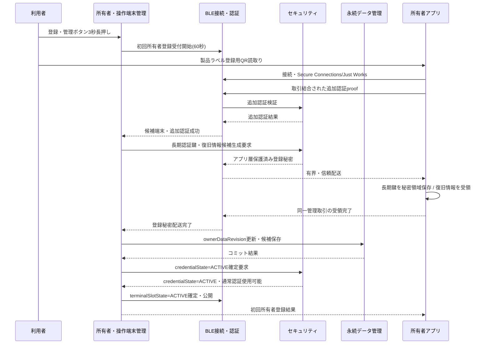

# Tank_Robot 所有者・操作端末管理基本設計

## 目次

1. 本書の目的
2. 設計方針と適用範囲
3. 責任分界と共通条件
4. 所有者状態・端末スロット・管理データ
5. 起動時読出しと利用可否判定
6. 管理操作の共通取引方式
7. 本体側登録・管理用物理操作
8. 初回所有者登録
9. 一般操作端末追加
10. 通常操作端末の切替え
11. 一般操作端末の削除・失効
12. 所有者復旧情報
13. 所有者再登録
14. 工場出荷状態への初期化
15. BLE接続・認証との連携
16. セキュリティとの連携
17. 永続データ管理との連携と中断復旧
18. システム状態・停止・異常との連携
19. 状態通知・ログ・利用者通知
20. 実行時間・固定資源・並行処理方針
21. 検証方針と確認ケース
22. 主対象要求との対応
23. 設計判断・後続事項
24. 他文書へのフィードバック
25. 初版の自己確認結果と引継ぎ条件

---

## 1. 本書の目的

### 1.1 目的

本書の目的は、公開用システム要求仕様「06. 所有者・操作端末管理」を実現するため、所有者・操作端末管理機能が保持する情報の意味、登録状態、端末役割、管理操作の成立条件、登録・削除・失効・再登録・工場出荷状態への初期化の処理順序、および関連機能との責任分界を、詳細設計へ展開可能な粒度まで具体化することである。

### 1.2 対象範囲

本書は、Tank_Robot本体における所有者登録状態、所有者端末1台、一般操作端末最大2台、端末役割、登録・追加・削除・失効、所有者再登録、所有者復旧情報および工場出荷状態への初期化の基本方式を具体化する。

BLE接続・暗号化・操作セッション、秘密情報の生成・暗号処理、永続データの物理保存、システム状態および安全停止は各担当機能の責任とし、本機能は所有者・操作端末情報の意味、登録状態、役割、役割ごとの権限規則、管理取引および関連機能との整合を管理する。

本書では、所有者端末を1台、一般操作端末を最大2台とし、端末役割を固定する。端末ごとに走行、砲塔、停止等の個別権限を任意設定する機能は設けない。

### 1.3 上位文書・関連文書

主対象要求は公開用システム要求仕様「06. 所有者・操作端末管理」とし、関連する公開用要求および完成済み基本設計について、所有者・操作端末管理との責任分界と連携に必要な範囲を参照する。

`20_要求仕様`および`30_コア要求仕様`は本書の上位要求として使用しない。公開用要求で未確定の方式について本書で具体化する場合は、本書の設計判断として明示する。

関連基本設計との整合確認結果を本書へ反映する。後続基本設計で具体化された責任分界・秘密情報保護・永続コミット方式が本書の外部振る舞いを具体化している場合は、その確定内容を本書でも使用する。

#### 1.3.1 上位文書

- [`docs/00_project_overview/01_製品目的・製品目標.md`](../../../00_project_overview/01_製品目的・製品目標.md)
- [`docs/10_requirements/06. 所有者・操作端末管理.md`](../../../10_requirements/06.%20所有者・操作端末管理.md)
- [`docs/20_basic_design/00_Tank_Robot 基本設計について.md`](<../../00_Tank_Robot 基本設計について.md>)
- [`docs/20_basic_design/01_システム構成/Tank_Robotシステム構成.md`](../../01_システム構成/Tank_Robotシステム構成.md)
- [`docs/20_basic_design/02_システムアーキテクチャ/Tank_Robotシステムアーキテクチャ.md`](../../02_システムアーキテクチャ/Tank_Robotシステムアーキテクチャ.md)

#### 1.3.2 関連するシステム要求仕様

- [`docs/10_requirements/02. システム状態管理.md`](<../../../40_公開用システム要求仕様/02. システム状態管理.md>)
- [`docs/10_requirements/04. スマートフォンアプリ.md`](<../../../40_公開用システム要求仕様/04. スマートフォンアプリ.md>)
- [`docs/10_requirements/05. BLE接続・認証.md`](<../../../40_公開用システム要求仕様/05. BLE接続・認証.md>)
- [`docs/10_requirements/09. 停止・緊急停止.md`](<../../../40_公開用システム要求仕様/09. 停止・緊急停止.md>)
- [`docs/10_requirements/11. Wi-Fi接続.md`](<../../../40_公開用システム要求仕様/11. Wi-Fi接続.md>)
- [`docs/10_requirements/14. ログ・診断.md`](<../../../40_公開用システム要求仕様/14. ログ・診断.md>)
- [`docs/10_requirements/17. 異常検出・復旧.md`](<../../../40_公開用システム要求仕様/17. 異常検出・復旧.md>)
- [`docs/10_requirements/18. 永続データ管理.md`](<../../../40_公開用システム要求仕様/18. 永続データ管理.md>)
- [`docs/10_requirements/19. データ・プライバシー管理.md`](<../../../40_公開用システム要求仕様/19. データ・プライバシー管理.md>)
- [`docs/10_requirements/20. セキュリティ管理.md`](<../../../40_公開用システム要求仕様/20. セキュリティ管理.md>)
- [`docs/10_requirements/21. 状態表示・利用者通知.md`](<../../../40_公開用システム要求仕様/21. 状態表示・利用者通知.md>)

#### 1.3.3 関連する基本設計

- [`docs/20_basic_design/03_機能別基本設計/01_システム状態管理/Tank_Robotシステム状態管理基本設計.md`](../01_システム状態管理/Tank_Robotシステム状態管理基本設計.md)
- [`docs/20_basic_design/03_機能別基本設計/03_停止・緊急停止管理/停止・緊急停止管理基本設計.md`](../03_停止・緊急停止管理/停止・緊急停止管理基本設計.md)
- [`docs/20_basic_design/03_機能別基本設計/04_異常管理/異常管理基本設計.md`](../04_異常管理/異常管理基本設計.md)
- [`docs/20_basic_design/03_機能別基本設計/09_BLE接続・認証/BLE接続・認証基本設計.md`](../09_BLE接続・認証/BLE接続・認証基本設計.md)
- [`docs/20_basic_design/03_機能別基本設計/11_Wi-Fi接続/Wi-Fi接続基本設計.md`](../11_Wi-Fi接続/Wi-Fi接続基本設計.md)
- [`docs/20_basic_design/03_機能別基本設計/13_設定管理/設定管理基本設計.md`](../13_設定管理/設定管理基本設計.md)
- [`docs/20_basic_design/03_機能別基本設計/16_永続データ管理/永続データ管理基本設計.md`](../16_永続データ管理/永続データ管理基本設計.md)
- [`docs/20_basic_design/03_機能別基本設計/17_セキュリティ管理/セキュリティ管理基本設計.md`](../17_セキュリティ管理/セキュリティ管理基本設計.md)

### 1.4 用語

| 用語 | 本書での意味 |
| --- | --- |
| 所有者状態 | 本体に有効な所有者情報が存在するか、およびその情報を安全に利用できるかを表す本機能固有状態 |
| 端末スロット | `OWNER`、`GENERAL_1`、`GENERAL_2`の固定論理枠 |
| `terminalRegistrationId` | 登録された操作端末を本体内で一意に識別するuint32識別子 |
| `authorizationRevision` | 端末の登録・有効性・役割・認証情報に関する現在世代を識別する情報 |
| `ownerDataRevision` | 本体ローカルの所有者・操作端末データ集合について、正常コミット済み版を識別するuint32値。VPS同期には使用しない |
| 登録取引 | 初回所有者登録または一般操作端末追加を一回の開始から成功・取消し・期限切れまで対応付ける処理単位 |
| 初回所有者登録追加認証 | 製品ラベルの登録用QRコードに対応する本体固有の256 bit登録秘密情報を用い、初回所有者登録時に登録対象本体の正当性を追加確認する認証。Bluetooth OOBペアリングそのものではない |
| 登録チケット | 一般端末追加時に対象新端末を確認する128 bit一回限り秘密情報 |
| 所有者復旧情報 | 所有者端末を使用できない場合の所有者再登録だけに使用する128 bit一回限り秘密情報 |
| 登録秘密配送 | 新しい端末長期認証鍵または新しい所有者復旧情報を登録対象アプリへ提供する処理。Just Worksリンク暗号化だけに依存せず、セキュリティ管理が所有する登録取引固有のアプリケーション層機密性・完全性保護を適用し、BLE接続・認証が有界なBLE配送・受領相関を担当する |
| 工場出荷状態 | 利用者固有の所有者・端末・認証情報等を無効化し、初回所有者登録前の状態へ戻した状態 |

---

## 2. 設計方針と適用範囲

### 2.1 基本方針

所有者・操作端末管理は次の原則で設計する。

1. 所有者状態、登録端末、端末役割、役割ごとの権限規則、失効状態および管理取引は本機能を正式な管理元とする。
2. 所有者端末1台、一般操作端末最大2台の固定役割構成とする。
3. BLE接続・認証、操作セッション、ボンディング処理はBLE接続・認証へ委譲し、本機能がBLE接続状態を重複管理しない。
4. 長期認証鍵、初回所有者登録用登録秘密情報、登録チケット、所有者復旧情報等の秘密情報保護・暗号学的検証はセキュリティ管理へ委譲する。登録端末へ新しい長期認証鍵または所有者復旧情報を配送する場合、Just Worksリンク暗号化だけに秘密性・完全性を依存させず、登録取引へ結び付けたアプリケーション層保護を必須とする。
5. データの物理保存、完全性確認、原子的更新、電源断回復および安全な消去は永続データ管理へ委譲する。
6. 管理操作を通常操作と並行して進めず、BLE接続待機状態かつアクチュエータ安全状態で開始する。
7. 登録・削除・再登録・初期化の途中状態を有効登録状態として公開しない。
8. 新規登録または所有者再登録では、候補認証情報の保存、登録秘密配送とアプリ受領確認、所有者データの永続コミットおよびセキュリティ管理の`credentialState=ACTIVE`確定をすべて確認するまで、対象端末を`terminalSlotState=ACTIVE`または登録完了として公開しない。
9. 削除・失効・再登録・初期化後に旧認証情報、旧操作セッションまたは旧管理取引を再利用しない。
10. 安全停止、緊急停止、電源保護その他の安全処理を管理操作より優先する。

### 2.2 対象範囲

本書は次を対象とする。

- 所有者未登録、登録済み、情報不正・利用不能の区別
- OWNER／GENERAL_1／GENERAL_2の固定端末スロット
- 端末役割と利用可能機能の意味、およびOWNER／GENERALの役割ごとに定める固定の権限規則
- 初回所有者登録
- 初回所有者登録時の追加認証成功を所有者登録成立条件として扱うこと
- 一般操作端末の追加
- 通常操作端末の切替条件
- 一般操作端末の削除・失効
- 所有者復旧情報の発行・検証状態
- 所有者再登録
- 登録チケット・所有者復旧情報を用いる登録対象確認と、登録秘密配送の成立条件
- 候補認証情報・所有者データ・登録秘密配送のコミット境界
- 工場出荷状態への初期化の開始・全体シーケンス
- 物理登録・管理操作の意味
- `terminalRegistrationId`、`authorizationRevision`、`ownerDataRevision`
- 管理処理中断・電源断時の利用可否
- BLE、セキュリティ、永続データ、システム状態、停止、異常、ログ・通知との連携

### 2.3 対象外

次は各担当機能で定め、本書で重複して最終判断しない。

- BLE Service、Characteristic、ペアリング、ボンディング、操作セッションの通信仕様、および所有者・操作端末管理の役割ごとの権限規則をBLE messageType/subtypeへ対応付けて権限を検査・適用する実装・wire契約
- HMAC-SHA-256、AES-GCM、長期認証鍵、初回所有者登録追加認証、登録チケット確認および所有者復旧情報確認の具体的な暗号演算・canonical byte列・鍵導出実装。ただし、登録チケットまたは所有者復旧情報の平文をJust Worksリンク上の認証根拠としてそのまま送信しないこと、ならびに新しい長期認証鍵・所有者復旧情報を登録取引固有のアプリケーション層機密性・完全性保護なしに配送しないことは本書の基本設計条件とする
- 暗号用途乱数生成器の内部実装
- 永続メモリ上のアドレス、ページ、ジャーナル、CRC／MACの具体配置
- システム状態遷移の最終判断
- アクチュエータ停止処理そのもの
- スマートフォンアプリの画面構成、QR描画、カメラ処理
- LED、7セグ等の具体的表示内容

### 2.4 初期製品で対象外とする拡張

公開用システム要求仕様「06. 所有者・操作端末管理」の将来検討事項に従い、初期製品では次を実装対象としない。

- 一般操作端末の一時無効化および単純再有効化
- VPSから一般操作端末を遠隔失効する機能
- 一般操作端末情報・一般操作者情報のVPS同期
- VPS所有者アカウント認証を使用した所有者再登録
- 現所有者から新所有者へ直接引き継ぐ専用の所有者変更
- 通常所有者変更と強制所有者変更を分離した所有者変更処理
- `ownerGeneration`、`ownerEpochId`、端末失効世代等を複数組み合わせた高度な所有者同期・競合解消

本書の`ownerDataRevision`は、本体ローカルの永続スナップショットの新旧を判定するためだけの内部版であり、上記の`ownerGeneration`やVPS同期世代として使用しない。

---

## 3. 責任分界と共通条件

### 3.1 関連機能との責任分界

| 機能 | 主な責任 |
| --- | --- |
| 所有者・操作端末管理 | 所有者状態、固定端末スロット、役割、役割ごとに定める固定の権限規則、登録・削除・失効、初回所有者登録時の追加認証成功確認、登録チケット・復旧情報による登録対象確認結果の取引相関、所有者再登録、工場初期化全体シーケンス、`authorizationRevision`の正式な管理、`terminalSlotState=ACTIVE`公開条件 |
| BLE接続・認証 | BLE transport、Secure Connections、ボンディング、アプリ認証、`sessionId`、所有者・操作端末管理のpolicyのBLE境界での権限検査・適用、登録通信、初回登録追加認証通信の相関、登録秘密の有界配送・受領相関、端末失効後のセッション無効化 |
| セキュリティ | 256 bit長期認証鍵、初回所有者登録用256 bit登録秘密情報の保護・追加認証検証、128 bit登録チケット・復旧情報、取引結合された登録対象確認proof、登録秘密配送のアプリケーション層機密性・完全性保護、認証情報の候補の利用可否、秘密情報消去・鍵無効化 |
| 永続データ管理 | 所有者データ集合・認証情報の候補に関する管理情報等の保存、完全性、原子的更新、中断復旧、ローカル版管理、安全な消去 |
| システム状態管理 | 管理操作開始可能条件、BLE接続待機状態、通常操作可否、状態遷移 |
| 停止・緊急停止管理 | 必要な安全停止、停止完了判定 |
| 異常管理 | 所有者データ異常・管理処理異常の影響度、処置、復旧可否 |
| スマートフォンアプリ | 所有者管理UI、初回所有者登録用製品QR読取り、登録チケットQR表示・読取り、復旧情報表示・入力、登録対象を確認するための認証用の証明データの生成、登録秘密の保護受領・秘密領域保存・受領完了通知、管理結果表示 |
| ログ・診断 | 管理イベントの保存方式、容量、保持期間、VPS送信 |

#### 3.1.1 端末の役割ごとの権限規則

登録済み操作端末の`OWNER`（所有者）／`GENERAL`（一般操作端末）について、役割ごとに許可する操作は、所有者・操作端末管理機能が定める。

初期製品では、端末ごとの権限ビットを個別に設定しない。
権限の判断には、現在の端末役割、`terminalSlotState`、`authorizationRevision`と、下表の固定した権限規則を使用する。

| 操作の種類 | GENERAL | OWNER | 状態・実行可否の最終判断 |
| --- | --- | --- | --- |
| 走行 `DRIVE_COMMAND` | 許可 | 許可 | システム状態管理＋走行制御 |
| 砲塔・砲身 `TURRET_COMMAND`／`BARREL_TARGET`／`TURRET_ARM` | 許可 | 許可 | システム状態管理＋砲塔・砲身制御 |
| 通常停止 `NORMAL_STOP` | 許可 | 許可 | 停止・緊急停止管理 |
| 緊急停止 `EMERGENCY_STOP` | 許可 | 許可 | 停止・緊急停止管理 |
| 緊急停止解除 `EMERGENCY_STOP_RELEASE` | 許可 | 許可 | システム状態管理＋停止・緊急停止管理 |
| 通常終了 `NORMAL_SHUTDOWN` | 許可 | 許可 | システム状態管理＋起動・終了・再起動管理 |
| 主要状態参照／`STATUS_QUERY` | 許可 | 許可 | システム状態管理／状態表示・利用者通知、および各状態の管理機能 |
| GENERAL端末追加・削除・失効その他の端末管理 | 不許可 | 許可 | 所有者・操作端末管理 |
| Wi-Fi設定 `WIFI_SETTING` | 不許可 | 許可 | Wi-Fi接続 |
| OWNER確認付き工場初期化要求その他のOWNER管理要求 | 不許可 | 許可 | 所有者・操作端末管理および対象機能 |

##### BLE接続・認証機能による権限確認

BLE接続・認証機能は、受信した`messageType`とサブタイプ（処理区分）を、上表の操作の種類へ対応付ける。
現在の認証済み端末の役割、`terminalSlotState=ACTIVE`および`authorizationRevision`を用いて、必要な権限を満たす要求だけを受け付ける。

同機能は、権限規則を独自に拡張・緩和しない。
未定義の操作や、本書の権限規則へ対応付けられない操作は、許可する側に倒さず拒否する。

新しい操作を追加する場合は、本書の権限規則と、BLE接続・認証機能のメッセージとの対応付けを、同じ変更単位で更新する。

##### 現在の状態と安全条件による実行可否の判断

権限確認に成功しても、それだけで現在の状態における実行を許可しない。
システム状態管理機能と対象機能が、現在のシステム状態、緊急停止、異常、電源および機能固有状態などを用いて、実行可否を最終判断する。

端末の権限が成立していることと、安全上の実行条件が成立していることを区別する。

##### 登録・復旧取引で別に確認する条件

次の処理は、登録済み端末の通常操作の権限とは別に、現在の登録・復旧取引を進めてよいか判断する。

- 初回OWNER登録
- GENERAL候補端末の登録用証明データ（proof）の確認と、登録秘密情報の受領
- OWNER再登録

各章で定める物理受付・管理取引の条件と、セキュリティ管理機能が定める証明データの検証条件を満たす場合だけ進める。
通常の`OWNER`／`GENERAL`の役割ごとの権限だけを根拠として、登録・復旧取引の認可を成立させない。

### 3.2 管理操作開始条件

所有者・操作端末情報を変更する管理操作は、少なくとも次をすべて満たした場合だけ開始する。

- システム状態管理から所有者管理操作開始可が提供されている。
- システム状態がBLE接続待機状態である。
- アクチュエータが安全状態であることを関連機能から確認できる。
- 緊急停止・異常その他により当該管理操作が禁止されていない。
- 本機能で別の管理取引が実行中でない。
- 必要な永続データ管理・セキュリティ機能を使用できる。

通常操作状態から所有者管理を開始する場合、アプリは通常操作を終了し、BLE接続・認証の操作セッション終了とシステム状態管理のBLE接続待機状態への遷移を確認してから管理要求を行う。

### 3.3 一度に一つの管理取引

初回所有者登録、一般端末追加、端末削除・失効、所有者再登録および工場初期化は、一度に一つだけ進行させる。

実行中に別の管理要求を受けた場合は、既存取引へ暗黙に統合せず、BUSYとして拒否する。

---

## 4. 所有者状態・端末スロット・管理データ

### 4.1 所有者状態

本機能は少なくとも次の所有者状態を区別する。

| 状態 | 意味 | 通常操作 |
| --- | --- | --- |
| `OWNER_UNREGISTERED` | 有効な所有者がまだ登録されていない | 禁止 |
| `OWNER_REGISTERED` | 有効な所有者端末および必要な認証情報を確認できる | 他条件成立時に許可候補 |
| `OWNER_DATA_INVALID` | 所有者・端末情報が破損、不整合、読出し不能または完全性未確認 | 禁止 |
| `OWNER_DATA_LOADING` | 起動時に永続データの読出し・検証中 | 禁止 |

これらはシステム状態ではなく、本機能固有状態である。

`OWNER_DATA_INVALID`を`OWNER_UNREGISTERED`へ暗黙変換しない。データ破損時に第三者が初回登録として所有者を上書きできないようにする。

### 4.2 固定端末スロット

端末役割は次の3スロットへ固定する。

| スロット | 役割 | 最大数 |
| --- | --- | ---: |
| `OWNER` | 所有者端末 | 1 |
| `GENERAL_1` | 一般操作端末 | 1 |
| `GENERAL_2` | 一般操作端末 | 1 |

一般端末追加時は空きまたは失効済みの一般スロットを使用する。登録上限到達時に既存端末を暗黙置換しない。

### 4.3 `terminalSlotState`

各端末スロットの登録・公開状態を`terminalSlotState`とし、所有者・操作端末管理を正式な管理元および単一writerとする。セキュリティ管理の`credentialState`とは別の状態であり、両者が同じ`ACTIVE`、`CANDIDATE`、`REVOKED`という列挙語を使用しても、更新主体と意味を混同しない。

- `EMPTY`：登録情報なし
- `ACTIVE`：現在有効な登録済み端末としてBLE接続・認証へ公開可能
- `REVOKED`：以前の登録端末を削除・失効済み。再認証不可
- `CANDIDATE`：登録取引中またはコミット後整合処理中の候補。永続コミット前、セキュリティ管理の`credentialState=ACTIVE`確定前または登録秘密配送確認前であり通常操作不可

`CANDIDATE`は有効登録数へ算入しない。`terminalSlotState=ACTIVE`は所有者・操作端末管理の登録記録を通常認証候補として公開可能であることを示し、セキュリティ管理の認証鍵が利用可能であること自体を意味しない。通常認証には、所有者・操作端末管理の`terminalSlotState=ACTIVE`とセキュリティ管理の`credentialState=ACTIVE`の両方を必要とする。

`REVOKED`スロットは新規登録で再利用できるが、以前の`terminalRegistrationId`、認証鍵および`authorizationRevision`を再利用しない。

### 4.4 端末登録情報

`terminalSlotState=ACTIVE`または`terminalSlotState=REVOKED`の端末記録は、少なくとも次の情報を持つ。

| 情報 | 内容 |
| --- | --- |
| `slotId` | OWNER／GENERAL_1／GENERAL_2 |
| `terminalRegistrationId` | uint32、0以外。登録端末識別 |
| `role` | OWNERまたはGENERAL |
| `terminalSlotState` | `EMPTY`／`CANDIDATE`／`ACTIVE`／`REVOKED` |
| `authorizationRevision` | uint32、現行権限世代 |
| `credentialRef` | セキュリティ機能が管理する長期認証鍵参照 |
| `registeredDataRevision` | 登録されたローカルデータ版 |
| `revocationReason` | 削除・所有者再登録・工場初期化等 |

BLEアドレスを`terminalRegistrationId`の代用としない。

### 4.5 `terminalRegistrationId`

BLE接続・認証の通信形式に合わせ、`terminalRegistrationId`はuint32とし、0を未登録用予約値とする。

新規登録ごとに新しい値を生成する。同一の現在データ集合内でOWNER、GENERAL_1、GENERAL_2およびREVOKED記録と重複しないことを確認する。

具体的な採番実装は詳細設計で定めるが、削除した端末を再登録する場合も以前の値を意図的に再利用しない。

### 4.6 `authorizationRevision`

`authorizationRevision`はuint32とし、`terminalSlotState=ACTIVE`の登録確定時は1以上の値とする。

同じ`terminalRegistrationId`の有効性、役割、認証情報または失効状態を変更する場合は値を更新し、BLE接続・認証へ新しい世代または失効を通知する。

新規登録によって`terminalRegistrationId`自体が変わる場合は、旧端末のrevisionを引き継がない。

`authorizationRevision`をwrapさせて旧世代と同じ値へ戻さない。現行初期製品では端末再登録時に新しい`terminalRegistrationId`を発行するため通常利用で上限到達を想定しないが、更新が必要な状態で次値を表現できない場合は当該権限変更・失効取引を正常完了とせず、現行状態を推測変更しない。異常管理へ管理データ世代枯渇として通知し、保守処置を要求する。

### 4.7 `ownerDataRevision`

`ownerDataRevision`は本体ローカルで所有者・操作端末データ集合の正常コミット済み版を識別するuint32値とする。

初回所有者登録、一般端末追加、削除・失効、所有者再登録および工場初期化でローカルデータ集合を更新した場合、新しいrevisionとして保存する。

この値はVPSへ同期せず、所有者競合解消、遠隔失効世代または所有者世代同期へ使用しない。

wraparoundを通常運用で許可しない。次のrevisionを表現できない場合、新しい所有者・端末情報変更取引および通常の工場初期化コミットを開始せず、最後の正常コミット済みデータをそのまま使用する。通常操作については最後の正常データと他の安全条件が成立する限り直ちに無効化しないが、所有者・端末変更機能を利用不可として異常管理および利用者通知へ保守必要状態を提供する。revisionを0または小さい値へ巻き戻して継続せず、復旧には定義された開発・保守手段を要求する。

---

## 5. 起動時読出しと利用可否判定

### 5.1 起動時処理

起動時は次の順序で所有者データを確立する。

1. 本機能を`OWNER_DATA_LOADING`とする。
2. 永続データ管理へ最新の正常コミット済み所有者データ集合を要求する。
3. 読出し結果、完全性結果、`ownerDataRevision`、保存状態を確認する。
4. セキュリティ管理へ`terminalSlotState=ACTIVE`端末に対応する`credentialState`、復旧検証情報および必要な候補／後処理metadataの利用可否を確認する。
5. 端末スロット数、役割、重複ID、`terminalSlotState=ACTIVE`の所有者数、revision等の意味整合を確認する。
6. 工場初期化継続マーカーを検出した場合は通常操作を禁止し、14.6の初期化継続処理へ移す。
7. 正常コミット済みownerデータとセキュリティ管理の`credentialState`が登録後処理途中を示す場合は、当該端末を通常認証へ公開せず6.6のコミット後整合処理を行う。
8. 有効な所有者が存在しない正常な工場出荷データなら`OWNER_UNREGISTERED`とする。
9. `terminalSlotState=ACTIVE`の所有者1台と、対応するセキュリティ管理の`credentialState=ACTIVE`を安全に確認できれば`OWNER_REGISTERED`とする。
10. 破損、不整合、読出し不能または安全に判断不能なら`OWNER_DATA_INVALID`とする。
11. システム状態管理、BLE接続・認証、状態表示・利用者通知へ利用可否を提供する。

### 5.2 正常な未登録と異常を区別する

永続領域が「工場出荷状態として正常にコミットされた未登録データ」である場合だけ`OWNER_UNREGISTERED`とする。

CRC/MAC不一致、revision不整合、中断復旧不能、必要認証情報欠損等を理由に所有者情報を読めない場合は`OWNER_DATA_INVALID`とする。

### 5.3 通常操作可否への提供

本機能はシステム状態管理へ次の論理情報を提供する。

- 所有者情報使用可否
- 有効所有者登録済みか
- 登録済み端末情報使用可否
- 現在認証端末の役割・有効性を確認可能か
- 所有者管理処理中か

システム全体として通常操作を許可する最終判断はシステム状態管理が行う。

---

## 6. 管理操作の共通取引方式

### 6.1 管理取引状態

所有者・操作端末情報を変更する処理は、次の共通状態を基本とする。

- `MGMT_IDLE`
- `MGMT_ARMING`
- `MGMT_ACCEPTING`
- `MGMT_PREPARING`
- `MGMT_COMMITTING`
- `MGMT_POST_COMMIT`
- `MGMT_COMPLETED`
- `MGMT_ABORTING`

具体的なソフトウェア列挙値は詳細設計で定める。

### 6.2 取引識別

一つの管理操作には`managementTransactionId`を付与し、次を同じ取引として対応付ける。

- 開始要求
- 物理操作確認
- 登録候補情報
- 登録対象確認proof・登録秘密配送・受領完了
- セキュリティ機能への秘密情報生成・認証情報の候補の保存・利用可能化・無効化要求
- 永続保存要求・結果
- BLEへの登録・失効通知
- 最終結果

過去取引の遅延応答を現在取引へ適用しない。

### 6.3 登録系取引のコミット点と`terminalSlotState=ACTIVE`公開条件

本機能が所有者・端末データ集合の永続更新を確定する時点は、本機能が新しい`ownerDataRevision`を指定し、永続データ管理から当該payloadの正常な保存処理の確定結果と新`persistRevision`を取得した時点とする。ただし、**新規登録または所有者再登録の`terminalSlotState=ACTIVE`公開・登録完了はownerDataRevisionコミットだけでは成立しない。**

新しい端末を`terminalSlotState=ACTIVE`としてBLE接続・認証へ公開し、利用者へ登録完了を返すには、少なくとも次をすべて満たす。

1. 現在の`managementTransactionId`に対する登録対象確認または追加認証が正常完了している。
2. セキュリティ管理が新端末用長期認証鍵を認証情報の候補として安全に生成・保存し、後続の利用可能化が可能であることを確認している。
3. 登録対象アプリへ必要な登録秘密をアプリケーション層保護付きで配送し、当該アプリから同じ管理取引に対応する受領・秘密領域保存完了を取得している。OWNER登録では所有者復旧情報も対象とする。
4. 永続データ管理が新しい`ownerDataRevision`を正常コミットしている。
5. セキュリティ管理が当該`ownerDataRevision`、`terminalRegistrationId`および`credentialRef`に対応する認証情報の候補を`credentialState=ACTIVE`へ確定し、通常認証に使用可能であることを本機能へ返している。

状態確定順序は、所有者・操作端末管理の`ownerDataRevision`コミット、セキュリティ管理の`credentialState=CANDIDATE`から`ACTIVE`への確定、所有者・操作端末管理の`terminalSlotState=CANDIDATE`から`ACTIVE`への確定・BLE接続・認証への公開とする。所有者・操作端末管理は`credentialState`を更新せず、セキュリティ管理は`terminalSlotState`を更新しない。

コミット前の候補情報、配送途中の秘密情報または`credentialState=ACTIVE`未確認credentialを、BLE接続・認証の通常認証用`terminalSlotState=ACTIVE`端末として公開しない。

### 6.4 取消しと再試行

管理操作は、受付期限内の明示的取消し、期限切れまたは前提条件喪失によって、永続コミット開始前なら取消し可能とする。BLE接続喪失時は、次の限定条件を除いて管理取引を取り消す。

- 初回OWNERまたはOWNER再登録で、proof成功前かつ認証情報の候補・所有者復旧用の秘密情報を未発行であり、各登録章が残り受付時間内の再接続を許可する場合。
- GENERAL追加で、第9.4節のOWNER接続から新GENERAL接続への計画的切替え、またはproof成功前の新GENERAL再試行を残り受付時間内で許可する場合。

これらの場合に維持できるのは、同じ`managementTransactionId`、登録対象role、当初の60秒受付期限および各登録章で明記した管理取引情報だけとする。旧`connectionGeneration`に属する操作セッション、challenge、nonce、auth attempt、認証用の証明データの検証成功状態、登録用一時session key、fragmentおよび送受信途中状態は維持しない。GENERAL追加では、セキュリティ管理が管理取引に限定して保持する`K_GENERAL_REG_AUTH`とticket検証情報だけを計画的切替え後へ引き継げる。

proof成功後に接続喪失、秘密情報の配送失敗またはapplication receipt未成立となった場合は当該管理取引を中止する。再試行には新しい物理受付と`managementTransactionId`を要求し、GENERAL追加では新しいticketも要求する。

取消し後に再試行する場合は、新しい`managementTransactionId`を発行する。一般端末登録ticket、候補長期認証鍵および候補復旧情報を過去取引から再利用しない。認証情報の候補や候補bondを作成済みであれば、セキュリティ管理/BLE接続・認証へ当該取引に対応する無効化・削除を要求する。後処理に失敗しても候補端末を`terminalSlotState=ACTIVE`へ昇格させない。

登録対象確認proofまたは追加認証が失敗した場合、同じproof、challenge、nonceまたは成功状態を再使用しない。proof成功前に受付期間内の再試行を許可する場合も新しい接続別認証試行として扱い、受付期限を延長しない。期限満了後は新しい物理受付・新しい管理取引を要求する。

### 6.5 優先要求

安全停止、緊急停止、電気安全上の処置または状態遷移により管理条件が失われた場合、永続コミット開始前であれば管理取引を中止する。

`MGMT_COMMITTING`開始後は、データ整合を壊す任意のロールバックを行わない。安全処理を優先した上で、永続データ管理の原子的更新・次回起動復旧へ委ねる。

### 6.6 コミット後整合処理

`ownerDataRevision`のコミット後、セキュリティ管理の`credentialState=ACTIVE`確定、BLE接続・認証への`terminalSlotState=ACTIVE`／`REVOKED`通知、鍵・ボンド後処理等の結果を取得できない場合、旧状態へ推測ロールバックしない。

新規登録または所有者再登録では、対象の新端末を通常認証へ公開せず`MGMT_POST_COMMIT`として必要な後処理を再確認する。再起動した場合も5.1の起動時整合確認で同じ`ownerDataRevision`、所有者・操作端末管理の`terminalSlotState`およびセキュリティ管理の`credentialState`を照合する。

- 安全に後処理を再実行できる場合は、同じコミット済みデータへ対応する`credentialState=ACTIVE`確定等を冪等に完了する。
- 完了可否を安全に一意化できない場合は、影響する端末を通常認証に使用せず異常管理へ通知する。
- OWNER再登録等で旧端末失効が既にコミット済みの場合、後処理失敗を理由として旧OWNER／GENERALを自動再有効化しない。

既存OWNER・既存GENERALを変更しない一般端末追加の後処理失敗では、正常な既存端末まで暗黙に失効させず、追加候補端末だけを利用不可として異常を報告する。

---

## 7. 本体側登録・管理用物理操作

### 7.1 使用する操作部

新しい専用ハードウェアを追加せず、システム構成で定義済みの「登録・管理用物理操作部」1つを使用する。

物理操作の判定は、通常の走行・停止操作とは独立した管理用入力として扱う。

### 7.2 初回所有者登録・一般端末追加・所有者再登録

通常の登録受付を開始する物理操作は、登録・管理用物理操作部の**3秒長押し**を基本設計値とする。

受付開始後の有効時間は**60秒**とする。

60秒以内に登録成功、明示的取消しまたは受付継続不能が成立した場合も受付を終了する。

### 7.3 所有者端末から要求する工場初期化

認証済み所有者端末から工場初期化要求を受け付けた場合は、要求受付後**60秒以内に5秒長押し**を物理確認として要求する。

所有者端末からの要求だけ、または5秒長押しだけでは工場初期化を開始しない。

### 7.4 強制工場初期化

所有者端末も所有者復旧情報も利用できない場合の強制工場初期化は、通常登録操作と明確に異なる次の二段階操作とする。

1. 電源投入時から登録・管理用物理操作部を10秒継続して押す。
2. 10秒成立後、一度操作部を離す。
3. システムが安全な所有者管理条件を確立した後、30秒以内に再度3秒長押しする。
4. 3秒再確認が成立した場合だけ強制工場初期化を開始する。

押しっぱなし、スイッチ固着または10秒長押しだけでは利用者データを消去しない。

起動直後に10秒条件を検出しても、その時点で破壊的処理を実行しない。実際の初期化開始はシステム状態管理から管理処理可能条件を得て、アクチュエータ安全状態を確認した後とする。

### 7.5 入力異常

物理操作部の入力を正常に確認できない場合、当該入力を「確認済み」とみなさない。

チャタリング除去、入力安定時間、GPIO構成等は詳細設計・ハードウェア設計で定める。

---

## 8. 初回所有者登録

### 8.1 開始条件

初回所有者登録は次をすべて満たす場合だけ開始する。

- 所有者状態が`OWNER_UNREGISTERED`
- 3章の管理操作開始条件が成立
- 登録・管理用物理操作部の3秒長押しが成立
- 別の管理取引が存在しない

`OWNER_DATA_INVALID`では初回所有者登録を許可しない。必要な復旧または工場初期化を要求する。

### 8.2 登録対象本体の確認と追加認証

初回所有者登録では、BLE接続・認証がアドバタイズするTank_Robot Service UUIDおよび公開短縮本体識別子等を使用し、アプリが意図した本体を画面上で識別できるようにする。

公開本体識別情報は秘密認証情報ではなく、これだけでは登録相手の正当性確認を完了したとは扱わない。

初回所有者登録では既存所有者端末が存在しないため、9章の一般端末登録チケット方式は使用しない。代わりに、製品ラベルの登録用QRコードに対応する本体固有の256 bit登録秘密情報を用いた追加認証を必須とする。

セキュリティ管理で定める追加認証方式に従い、`managementTransactionId`、`connectionGeneration`、登録認証試行、device challengeおよびapp nonce等へ結び付けたproofを用いる。登録秘密情報そのものをBLEへ送信して照合する方式を使用しない。本機能は現在の管理取引と候補端末に対応する追加認証成功結果だけを受け取り、成功を確認した場合に限り長期認証鍵・所有者復旧情報の候補生成へ進む。

QRコードはBluetooth OOBペアリングそのものとして使用せず、Secure Connections Just Worksで暗号化リンクを確立した後の初回所有者登録追加認証に使用する。

### 8.3 登録シーケンス

Secure Connections Just Worksによるリンク成立だけではOWNER候補を登録可能としない。追加認証が失敗、未完了、期限切れ、取引不一致または登録候補端末不一致となった場合は、長期認証鍵・復旧情報の登録秘密配送および永続コミットへ進まない。

初回OWNER端末の長期認証鍵はセキュリティ管理の`K_OWNER_REG_SESSION`＋AES-256-GCM保護とBLE接続・認証の有界な登録鍵エンベロープ配送を使用し、raw長期認証鍵をJust Worksリンク上へそのまま送信しない。所有者復旧情報も同じ登録取引へ結び付けたアプリケーション層機密性・完全性保護を用いて発行し、Just Worksリンク暗号化だけへ秘密性を依存させない。

### 8.4 登録情報

初回所有者登録では、現在の管理取引に対応する追加認証成功を確認した後、OWNERスロットへ新しい`terminalRegistrationId`、`authorizationRevision`、長期認証鍵参照およびローカルデータ版を候補として設定する。

GENERAL_1およびGENERAL_2はEMPTYとする。

第6.3節の条件をすべて満たすまでOWNERスロットを通常認証用`terminalSlotState=ACTIVE`として公開しない。

### 8.5 復旧情報の受渡し

所有者登録時に12章の新しい所有者復旧情報を生成する。

所有者復旧情報は公開用システム要求仕様「20. セキュリティ管理」で定める長期秘密情報であるため、セキュリティ管理が管理する登録取引固有のアプリケーション層機密性・完全性保護を適用し、BLE接続・認証の登録通信によって所有者アプリへ一度だけ提供する。Just Worksリンク暗号化だけで平文の復旧情報を配送しない。

アプリが復旧情報を受領したことを同じ`managementTransactionId`へ対応付けて確認してからownerデータの最終コミットへ進む。利用者がアプリ外へ実際に保存したかを本体が保証することはできないため、アプリ側で保存を促す。

### 8.6 失敗・中断・再試行

BLE候補端末が確定する前に接続失敗した場合は、60秒受付期間内で再接続を許可できる。

初回所有者登録追加認証が失敗、未完了、期限切れまたは取引不一致となった場合、当該候補をOWNERとして有効化せず、長期認証鍵または復旧情報を発行しない。再試行する場合は新しい認証試行・challenge・nonceを使用し、60秒受付期限を延長しない。

追加認証proof成功後に接続、登録用秘密情報の配送またはapplication receiptが失敗した場合は当該登録取引を中止し、認証情報の候補・候補復旧情報を無効化し、BLE接続・認証へ不完全登録に対応する候補bond削除を要求する。再試行時は新しい物理受付・新しい管理取引・新しい秘密情報を要求する。

永続コミットできなかった場合はOWNERスロットを`terminalSlotState=ACTIVE`にしない。永続コミット後にセキュリティ管理の`credentialState=ACTIVE`確定またはBLE接続・認証へのスロット公開を確認できない場合は6.6のコミット後整合処理へ移行し、登録完了を返さない。

候補用に生成した長期認証鍵および復旧情報は以後の登録へ再利用しない。

---

## 9. 一般操作端末追加

### 9.1 基本方式

一般操作端末追加では、認証済み所有者端末からの追加要求、本体物理操作および**128 bit一回限り登録チケット**を組み合わせる。

BLE物理接続はBLE接続・認証により同時1台であるため、所有者端末と登録対象新端末を同時接続しない。

登録チケットは新GENERAL候補を現在の登録取引へ結び付ける秘密情報として使用する。Just Worksリンク上へ登録チケット平文を送って一致比較する方式は採用せず、セキュリティ管理が登録チケットと現在取引から生成・検証する現在の取引に結び付けた認証用の証明データによって登録対象であることを確認する。

### 9.2 開始条件

次をすべて満たす場合に一般端末追加取引を開始する。

- 所有者状態が`OWNER_REGISTERED`
- BLE接続・認証が現在端末を認証済みOWNERとして確認済み
- GENERALスロットに空きまたは再利用可能なREVOKEDスロットがある
- 3章の管理操作開始条件が成立
- 所有者アプリから明示的な一般端末追加要求を受信
- 本体登録・管理用物理操作部の3秒長押しが成立

### 9.3 登録チケット

登録チケットは次とする。

- 128 bit暗号用途乱数
- 一回限り
- 登録受付60秒以内だけ有効
- 対象`managementTransactionId`および対象本体へ結び付ける
- GENERAL役割専用
- 通常BLE認証、所有者復旧、Wi-Fi認証等へ使用しない

セキュリティ管理がチケットを生成し、現在の登録取引に対応する検証情報を管理する。

本体側ではチケット平文を長期保存せず、セキュリティ管理が定める検証情報と取引情報だけを60秒の揮発または保護状態として保持する。ログへ平文を出力しない。

新GENERAL候補アプリはQRから得たチケットを用いて現在の取引に結び付けた認証用の証明データを生成し、rawチケットをBLEへ送信しない。proofは少なくとも現在の`managementTransactionId`、対象本体、`connectionGeneration`および一回限り認証試行情報へ結び付け、旧取引・旧接続・旧proofを新しい登録へ再利用できない方式をセキュリティ管理で確定する。

### 9.4 所有者端末から新端末への引継ぎ

1. 所有者端末で一般端末追加要求を行う。
2. 3秒物理操作を確認する。
3. セキュリティ管理が登録チケットを生成し、所有者アプリへ提供する。
4. 所有者アプリは対象本体識別情報、登録取引識別情報およびチケットをQRコードとして表示する。
5. 所有者アプリはチケット受領後、現在のBLE接続を終了する。
6. 本体は同じ登録取引を60秒期限まで保持し、一般端末登録用の接続を受け付ける。
7. 新しい一般端末アプリがQRを読み取り、対象本体へ接続する。
8. BLE接続・認証がSecure Connections Just Worksによる暗号化リンクを確立する。
9. 新端末はチケットを用いた現在の取引に結び付けた認証用の証明データを送信し、セキュリティ管理が現在の登録取引・接続世代に対して検証する。
10. proof成功後だけ、新GENERAL候補用の長期認証鍵候補をセキュリティ管理が生成する。
11. セキュリティ管理は登録チケットに基づく登録取引固有の一時保護コンテキストを用いて新GENERAL長期認証鍵をアプリケーション層で機密性・完全性保護し、BLE接続・認証が登録候補端末へ有界・信頼配送する。raw長期認証鍵をJust Worksリンク上へそのまま送信しない。
12. 新GENERALアプリが秘密情報保護領域へ保存し、同じ登録取引の受領完了を返した場合だけ9.6の登録コミットへ進む。

一時保護鍵の導出方式、proofのcanonical byte列およびAES-GCM等の具体暗号契約はセキュリティ管理で基本設計として確定し、詳細設計ではそのbyte layout・APIへ具体化する。

### 9.5 一回の受付で一台

有効な登録チケットproofを最初に正常検証した新端末を当該取引の対象として固定する。

対象確定後、同じ取引へ別端末を追加しない。

proof検証成功後はチケットを使用済み候補として扱い、同じチケット・proofによる再試行で別端末を登録しない。

proof検証成功前の単純なBLE接続失敗またはproof失敗は、残り受付時間内で新しい認証試行として再接続・再試行可能とする。受付期限を延長せず、旧challenge・nonce・proofを再利用しない。proof成功後に登録が失敗した場合は新しい登録取引・新しいチケットを要求する。

### 9.6 登録コミット

対象一般端末用の新しい`terminalRegistrationId`、`authorizationRevision`および長期認証鍵参照を生成し、選択したGENERALスロットをCANDIDATEとする。

セキュリティ管理の認証情報の候補の保存、新GENERALへの保護済み長期鍵配送およびアプリ受領完了を確認した後、永続データ管理へ新しい`ownerDataRevision`としてデータ集合の保存を要求する。

正常コミット後、セキュリティ管理が当該credentialを`credentialState=ACTIVE`として通常認証に使用可能としたことを確認してから、所有者・操作端末管理がスロットを`terminalSlotState=ACTIVE`とし、BLE接続・認証へ一般端末登録確定を通知する。`ownerDataRevision`コミットだけを理由としていずれの状態もACTIVEへしない。

### 9.7 失敗時

期限切れ、所有者切断後に新端末が現れない、proof不一致、新端末切断、登録秘密配送・保存確認失敗、鍵生成失敗または永続保存失敗の場合は既存OWNERおよび他GENERAL端末を変更しない。

失敗したチケット、proofおよび候補鍵を次の登録取引へ再利用しない。認証情報の候補をセキュリティ管理へ無効化要求し、作成済み候補ボンドがあればBLE接続・認証へ削除を要求する。後処理失敗時も候補端末をACTIVEへしない。

ownerDataRevisionコミット後のcredential利用可能化またはBLE接続・認証への通知失敗は6.6のコミット後整合処理へ移行し、既存OWNER・GENERALを維持したまま追加候補だけを通常利用不可とする。

---

## 10. 通常操作端末の切替え

### 10.1 強制引継ぎを行わない

一つの端末が通常操作に使用されている間、別の登録済み端末からの接続・認証を理由として現在端末の操作セッションを強制終了しない。

BLE接続・認証の物理接続数が1台であることもこの方針と整合する。

### 10.2 切替手順

通常操作端末を切り替える場合は次とする。

1. 現在端末で継続操作を終了する。
2. 必要な停止状態を確認する。
3. 現在のBLE接続・認証の操作セッションを終了する。
4. BLEリンクを終了する。
5. 新しい端末が接続する。
6. BLE接続・認証でSecure Connections、アプリ認証および端末権限確認を改めて実行する。
7. 本機能が当該`terminalRegistrationId`の`terminalSlotState=ACTIVE`、役割、`authorizationRevision`を提供する。
8. システム状態管理および各機能の通常操作条件が成立した後、新しい指令だけを使用する。

以前の端末の操作状態または操作指令を新しい端末へ引き継がない。

---

## 11. 一般操作端末の削除・失効

### 11.1 要求元

一般端末の削除・失効要求は、BLE接続・認証で認証済みOWNER端末であることを確認した要求だけを受け付ける。

GENERAL端末自身または未認証端末から他端末を削除できない。

### 11.2 削除と失効の扱い

初期製品では「削除」と「失効」を、端末を以後通常認証へ使用できなくするという安全上の効果では同じものとして扱う。

スロット状態はREVOKEDとし、旧`terminalRegistrationId`、失効理由および失効時`ownerDataRevision`を保持する。

再び同じスマートフォンを使用する場合も9章の新規登録を要求し、新しい`terminalRegistrationId`および長期認証鍵を発行する。

一時無効化と単純再有効化は2.4のとおり初期製品対象外とする。

### 11.3 削除シーケンス

1. OWNER端末から対象`terminalRegistrationId`を伴う削除要求を受ける。
2. 対象がACTIVEなGENERALスロットであることを確認する。
3. 既にREVOKEDなら冪等結果として扱い、別端末を削除しない。
4. 新しい`ownerDataRevision`で対象をREVOKEDとする候補データを生成する。
5. セキュリティ管理へ旧長期認証鍵の無効化準備を要求する。この時点では元へ戻せない消去を完了させない。
6. 永続データ管理へ新revisionをコミットする。
7. コミット成功直後、本機能は対象端末をREVOKEDとしてBLE接続・認証へ公開し、現行セッションを無効化させる。
8. セキュリティ管理へ旧長期認証鍵の最終無効化・安全な消去を要求する。
9. BLE接続・認証へ対応するボンド削除を要求する。
10. 鍵・ボンド後処理の結果を管理し、結果を所有者アプリへ返す。

### 11.4 現在操作中端末との競合

BLE同時1接続のため、通常のOWNER端末から削除操作を行う時点では対象GENERAL端末が同時接続中となる通常ケースはない。

それでも競合・遅延通知等によりBLE接続・認証が対象GENERALの現行操作セッションを保持していた場合、本機能は失効をBLE接続・認証へ即時通知する。

BLE接続・認証はセッションを無効化し、操作中であれば停止・緊急停止管理へ安全停止を要求する。本機能が安全停止を重複して直接実行しない。

### 11.5 後処理失敗

永続コミット成功後に鍵消去またはボンド削除が失敗しても、対象端末をACTIVEへ戻さない。

本機能が管理するREVOKED状態を認証判定の正式な根拠として維持し、旧鍵情報が物理的に残存していてもBLE接続・認証で通常認証を成功させない。

鍵・ボンド消去失敗は異常管理へ通知し、再試行・保守処置を判断できるようにする。

永続コミット自体が失敗した場合は候補REVOKEDを公開せず、ACTIVE状態を示す情報を変更しない。

---

## 12. 所有者復旧情報

### 12.1 目的

所有者復旧情報は、現在の所有者端末を紛失・故障等で使用できない場合に、同じ所有者として新しいOWNER端末を登録するためだけに使用する。

通常BLE認証、一般端末追加、Wi-Fi認証、VPS認証その他の用途へ使用しない。

### 12.2 生成

所有者復旧情報の実体は128 bitの暗号用途乱数とする。

セキュリティ管理が生成し、本体ごと・発行版ごとに新しい値を使用する。

### 12.3 表示形式

所有者アプリへ次の2形式を提供する。

- QRコードへ格納可能な機械読取り形式
- 人手入力用Base32文字列

人手入力用文字列は読み間違いを減らすため、I／L／O／0等の紛らわしい文字を避ける文字集合とし、4～5文字程度のグループへ区切る。

入力誤りを早期検出するため、復旧秘密そのものとは別に短いチェック文字を付与する。チェック方式は詳細設計で確定する。

### 12.4 本体保存

復旧情報の平文を本体の通常永続データへ保存しない。

セキュリティ管理が所有者再登録時の現在の取引に結び付けた認証用の証明データを検証でき、かつraw復旧情報を復元可能な平文として通常保存しない方式で、少なくとも次の情報を保持する。

- versionedな復旧検証情報または保護済み認証情報
- `recoveryRevision`
- 対応する`ownerDataRevision`
- VALID／USED状態

現行セキュリティ管理のversioned verifier方式を使用する場合も、再登録BLE通信でraw復旧情報を送信して単純比較する方式にはしない。proof検証に必要な保護方式はセキュリティ管理の基本設計で確定し、本機能は検証成功／失敗と取引相関だけを使用する。

### 12.5 有効期間

所有者復旧情報は時間経過だけでは失効させない。所有者が長期間保管しても再登録に使用できることを優先する。

次の場合に無効化する。

- 所有者再登録で正常使用された
- 工場出荷状態へ初期化された
- 新しい復旧情報のコミットによって旧版が置き換えられた

### 12.6 一回限り使用

所有者再登録が正常コミットし、新OWNERのcredential利用可能化まで確定した時点で、使用した復旧情報をUSEDとし、同じ値を以後使用できない状態を確定する。

同時に新しい所有者用の128 bit復旧情報を生成し、新OWNERアプリへ一度提供する。

再登録が永続コミット前に失敗した場合、旧復旧情報を不用意に消費しない。ただし認証試行失敗回数制御等のセキュリティ制限は別途適用する。

ownerDataRevisionコミット後の後処理中は、旧復旧情報を再利用可能へ戻さず6.6の整合処理で新状態を確定する。

### 12.7 アプリ側保持

アプリは所有者登録または再登録成功時に復旧情報を表示し、アプリ外の安全な場所へ保存できるようにする。

本体は利用者が実際に保存したことを保証できないため、復旧情報を失った場合は14章の強制工場初期化を必要とする。

---

## 13. 所有者再登録

### 13.1 対象

所有者再登録は、現在のOWNER端末を使用できないが、事前発行済みの有効な所有者復旧情報を保持している場合に使用する。

単なる一般端末追加や所有者権限の譲渡として使用しない。

### 13.2 開始条件

次をすべて満たす場合に所有者再登録受付を開始する。

- `OWNER_REGISTERED`である、または既存所有者データを正常に確認できる。
- BLE接続・認証に現在有効なOWNER操作セッションを要求しない再登録用通信経路が許可されている。
- 本体登録・管理用物理操作部3秒長押しが成立。
- 3章の安全な管理条件が成立。
- 別の管理取引がない。

所有者復旧情報を利用できない場合は再登録を開始しない。

### 13.3 再登録通信

新しい所有者候補端末は、BLE接続・認証の登録通信としてSecure Connections Just Worksによる暗号化リンクを確立する。

通常の登録済み端末用HMAC認証は旧端末鍵を持たないため前提としない。

所有者復旧情報は長期秘密情報であるため、raw復旧情報をJust Worksリンク上へ送信して本体で一致比較する方式は使用しない。新OWNER候補アプリは入力された復旧情報を用いて、セキュリティ管理が定める現在の`managementTransactionId`、対象Device ID、`connectionGeneration`、一回限りchallenge／nonce等へ結び付いた再登録時の認証用の証明データを生成する。セキュリティ管理が保存済みの保護済み検証情報を用いてproofを検証し、本機能は現在取引への成功結果だけを使用する。

proof成功後、セキュリティ管理は同じ復旧情報と現在取引に結び付いた一回限りの登録秘密配送保護コンテキストを確立し、新OWNER用長期認証鍵および新しい所有者復旧情報をJust Worksだけに依存せず保護配送できるようにする。具体暗号方式はセキュリティ管理の基本設計に従う。

### 13.4 成功時に変更する情報

復旧情報proofの検証成功後、新OWNER候補について次を生成する。

- 新しい`terminalRegistrationId`
- 新しい256 bit長期認証鍵
- 新しいOWNER用`authorizationRevision`
- 新しい128 bit所有者復旧情報
- 新しい`ownerDataRevision`

同時に、旧OWNER、GENERAL_1、GENERAL_2をすべてREVOKEDとする候補データを作る。

所有者再登録だけを理由としてWi-Fi設定、VPSデバイスcredential、VPS管理設定、SecurityGen、`highestCommittedGeneration`、`bootInstanceId`その他の製品固有・巻戻し防止情報を変更または削除しない。

### 13.5 コミット順序

1. 復旧情報proofを検証する。
2. セキュリティ管理が新OWNER候補の長期認証鍵候補を生成・保存可能な状態とする。
3. セキュリティ管理が新しい所有者復旧情報を生成する。
4. セキュリティ管理/BLE接続・認証の登録取引固有アプリケーション層保護を用いて、新OWNER長期認証鍵および新復旧情報を新OWNERアプリへ配送し、秘密領域保存・受領完了を同じ`managementTransactionId`で確認する。
5. 旧OWNER＋全GENERAL失効、新OWNER候補、旧復旧情報USED候補、新復旧検証情報VALID候補を一つの新`ownerDataRevision`候補として作る。
6. 旧端末鍵の無効化準備をセキュリティ管理へ要求する。
7. 永続データ管理へ原子的コミットを要求する。
8. 正常コミット後、セキュリティ管理が新OWNER credentialを`credentialState=ACTIVE`として通常認証に使用可能としたことを確認する。
9. 第8項確認後、所有者・操作端末管理が新OWNERの`terminalSlotState=ACTIVE`を確定し、BLE接続・認証へ旧全端末の失効と新OWNERスロットの公開を通知する。
10. セキュリティ管理へ旧全端末長期認証鍵の最終無効化を要求する。
11. BLE接続・認証に旧ボンド情報削除を要求する。
12. 再登録結果を新OWNERアプリへ通知する。

新OWNERのcredential利用可能化を確認する前に、登録成功を返さない。

### 13.6 失敗時

recovery proof成功前の単純なBLE接続失敗またはproof失敗は、残り受付時間内で新しい接続別認証試行として再接続・再試行可能とする。受付期限を延長せず、旧challenge、nonce、proof、session keyまたはfragmentを再利用しない。

proof成功後または候補秘密情報生成後に接続、登録用秘密情報の配送もしくはapplication receiptが失敗した場合は当該管理取引を中止し、新しい物理受付と新しい`managementTransactionId`を要求する。

永続コミット前に再登録が失敗・中断した場合、旧OWNERおよびGENERAL端末の登録状態を変更しない。

新OWNER候補用に生成した長期認証鍵・復旧情報は無効化し、BLE接続・認証に候補bondがあれば削除を要求する。再試行で再利用しない。

旧復旧情報は永続コミット前の失敗だけを理由としてUSEDにしない。

永続コミット成功後の新credential利用可能化、旧鍵・旧ボンド削除またはBLE接続・認証への通知の失敗は新ownerDataRevisionを推測ロールバックせず6.6のコミット後整合処理へ移行する。旧OWNER／GENERALを自動復元せず、新OWNERを通常認証へ公開できない間は所有者管理・通常操作を安全側に制限し異常管理へ通知する。

### 13.7 旧端末の自動復元禁止

再登録成功後、旧OWNERおよび旧GENERALを単純な再有効化で復元しない。

一般端末を再び使用する場合は、新OWNERによる9章の一般端末追加を行う。

---

## 14. 工場出荷状態への初期化

### 14.1 初期化開始方式

工場初期化は次の2方式を区別する。

- **OWNER確認付き初期化**：認証済みOWNERアプリ要求＋60秒以内の5秒物理確認
- **強制初期化**：所有者端末・復旧情報を使用できない場合の10秒起動長押し＋解放＋30秒以内3秒再確認

両方式ともデータ消去範囲は同じ工場出荷状態を目標とするが、開始認証経路を区別してログへ提供する。

### 14.2 初期化対象

本機能は工場初期化全体シーケンスの管理主体として、少なくとも次を削除または無効化対象とする。

- OWNER／GENERAL端末登録情報
- 失効情報および管理取引中情報
- 所有者復旧情報検証値
- 操作端末長期認証鍵
- BLEボンディング情報

Wi-Fi設定、その他の利用者設定・利用者データについては各関連要求・基本設計が定める工場初期化対象を当該機能へ削除要求する。本書だけで対象を勝手に拡張しない。

### 14.3 保持対象

少なくとも次を工場初期化で削除または巻き戻さない。

- 製品固有Device ID等のデバイス識別情報
- VPSデバイス認証情報
- 製造情報
- ハードウェア構成情報
- 校正情報
- 固定ブート・セキュアブートに必要な製品秘密情報・信頼アンカーのうち利用者所有者情報ではないもの
- 初回所有者登録用の本体固有登録秘密情報
- `SecurityGen`およびファームウェア巻戻し防止状態
- `highestCommittedGeneration`等の設定巻戻し防止状態
- `bootInstanceId`等、工場初期化で巻き戻してはならない単調管理情報
- FACTORY設定および製品provisioning/trust metadata

初回所有者登録用登録秘密情報は製品固有の登録用秘密情報であり、利用者が登録した所有者情報ではないため、工場出荷状態への初期化後も次回初回所有者登録に使用できるよう保持する。

具体的な保持データ一覧は設定管理/永続データ管理/セキュリティ管理、製品情報設計および各データ管理機能と整合させる。

### 14.4 初期化を二段階コミットとして扱う

工場初期化は、複数機能の利用者データを消去するため、各機能を順次即時削除してから結果をまとめる方式としない。

論理的に次の二段階とする。

#### 第1段階：RESET_PENDING確定

1. システム状態管理からBLE接続待機・アクチュエータ安全を確認する。
2. BLE接続・認証へ新規通常操作禁止・現行操作セッション無効化を要求する。
3. セキュリティ管理、Wi-Fi接続、設定管理、ログ・プライバシーその他工場初期化対象機能へ、対象データと消去可能性のPREPARE確認を要求する。
4. 各機能の準備結果を確認する。
5. 永続データ管理へ`factoryResetState=RESET_PENDING`、`managementTransactionId`および次`ownerDataRevision`を原子的にコミットする。

`RESET_PENDING`がコミットされるまでは不可逆な利用者データ消去を開始しない。

#### 第2段階：消去実行とFACTORY_DEFAULT_COMPLETE確定

6. セキュリティ管理へ全操作端末長期認証鍵・復旧情報の無効化／安全消去を要求する。
7. BLE接続・認証へ全操作端末ボンド削除・登録通信状態クリアを要求する。
8. Wi-Fi接続、設定管理、ログ・プライバシーその他の対象機能へ各自の工場初期化対象データ消去・無効化を要求する。
9. 各機能の完了結果を収集する。
10. 必須消去処理が正常完了した場合、永続データ管理へ工場出荷用所有者データ集合と`factoryResetState=FACTORY_DEFAULT_COMPLETE`をコミットする。
11. 正常コミット後、所有者状態を`OWNER_UNREGISTERED`とし、システム状態管理へ結果を提供する。

### 14.5 コミット後状態

`FACTORY_DEFAULT_COMPLETE`が正常コミットされた場合だけ、工場初期化正常完了として`OWNER_UNREGISTERED`へ移行する。

以前のOWNER／GENERALの認証を成功させない。

初回所有者登録を新たに行うまで通常操作を許可しない。

### 14.6 電源断・リセット・失敗

起動時に`RESET_PENDING`を検出した場合、旧所有者情報を通常操作へ再利用しない。

アクチュエータ安全状態を維持した上で、未完了の工場初期化対象データ消去を再開し、`FACTORY_DEFAULT_COMPLETE`を確定するまで通常操作を禁止する。

RESET_PENDING前に電源断した場合は、原子的保存が保証する旧正常`ownerDataRevision`を使用できる。

RESET_PENDING後に一部消去が失敗した場合は、工場初期化を「失敗したので旧所有者へ戻す」と扱わず、初期化継続が必要な状態として保持する。

消去処理を安全に継続できない場合は異常管理へ異常を通知し、通常操作禁止を維持する。

### 14.7 強制初期化の誤操作防止

10秒長押し成立だけで利用者データを消去しない。

一度ボタンを離し、明示的な再3秒操作が必要であることを状態表示・利用者通知へ提供する。

ボタン入力異常、不明または押しっぱなしでは確定しない。

---

## 15. BLE接続・認証との連携

### 15.1 BLE接続・認証機能へ提供する情報

所有者・操作端末管理機能は、BLE接続・認証機能へ少なくとも次の情報を提供する。

#### 端末情報と権限規則

- `terminalRegistrationId`
- 端末役割 OWNER／GENERAL
- `terminalSlotState`（`EMPTY`／`CANDIDATE`／`ACTIVE`／`REVOKED`）
- `authorizationRevision`
- 本書第3.1.1節で定める、端末の役割ごとの権限規則
- `ownerDataRevision`
- 端末失効通知

#### 登録取引の条件

- 現在の登録取引の有無・登録受付対象
- 初回所有者登録で追加認証を必須とする取引条件
- 一般端末登録チケット／所有者復旧情報に基づく登録対象確認が必要な取引条件

#### 提供した情報の使用範囲

BLE接続・認証機能は、現在の認証済み端末の役割、`terminalSlotState`および`authorizationRevision`と、本書第3.1.1節の権限規則を使用する。
受信したBLE `messageType`／サブタイプごとに必要な権限を確認する方法は、同節に従う。

同機能は、権限規則そのものを独自に変更せず、通信・セッション側の最終状態を管理する。

対象機能は、BLE側の権限確認成功を、現在の状態での実行成功とは扱わない。
自身が管理する状態と安全条件を用いて、実行可否を最終判断する。

### 15.2 BLE接続・認証から受け取る情報

本機能はBLE接続・認証から少なくとも次を受け取る。

- 現在接続端末の`terminalRegistrationId`
- アプリ認証成功・失敗
- 現在`sessionId`
- 管理要求の通信上の妥当性結果
- 登録候補端末の暗号化リンク成立
- 初回所有者登録追加認証、一般端末登録時の認証用の証明データ、所有者再登録時の認証用の証明データの結果および対応する`managementTransactionId`・候補端末情報
- 登録秘密配送の受領完了または失敗と取引相関
- ボンド作成・削除結果
- セッション無効化結果

### 15.3 権限変更時

端末をREVOKEDにした場合、または所有者再登録・工場初期化によって旧端末を無効にした場合は、永続コミット成功後にBLE接続・認証へ失効を通知する。

BLE接続・認証は当該端末の既存`sessionId`を無効化し、新しい通常操作を受け付けない。

### 15.4 登録取引とBLE接続情報の寿命

登録取引の内容・期限・再試行可否は本書で定める。BLE接続世代と分割データはBLE接続・認証が、一時認証鍵と登録用一時セッション鍵の保持期間はセキュリティ管理が、それぞれ正式に管理する。

| 登録経路 | 管理取引として維持できる情報 | `connectionGeneration`変更時に破棄する情報 | 接続変更後の扱い |
| --- | --- | --- | --- |
| 初回OWNER | 証明データの検証成功前に限り、`managementTransactionId`、OWNERの役割、当初の60秒期限 | チャレンジ、ノンス、認証試行、認証用の証明データの検証成功状態、`K_OWNER_REG_SESSION`、分割データ、候補接続・ボンド状態 | 残り期限内で新しい接続別認証試行を開始できる。証明データの検証成功後の失敗は新しい管理取引とする |
| GENERAL追加 | `managementTransactionId`、GENERALの役割、当初の60秒期限、セキュリティ管理の`K_GENERAL_REG_AUTH`と登録チケット検証情報 | 旧OWNER操作セッション、新旧接続のチャレンジ、ノンス、認証試行、認証用の証明データの検証成功状態、`K_GENERAL_REG_SESSION`、分割データ | OWNERから新GENERALへの計画的切替えと証明データの検証成功前の再試行だけ維持できる。証明データの検証成功後の失敗は新しい管理取引・登録チケットとする |
| OWNER再登録 | 証明データの検証成功前に限り、`managementTransactionId`、OWNER再登録の役割、当初の60秒期限 | チャレンジ、ノンス、認証試行、認証用の証明データの検証成功状態、`K_OWNER_REREG_SESSION`、分割データ、候補接続・ボンド状態 | 残り期限内で新しい接続別認証試行を開始できる。証明データの検証成功後の失敗は新しい管理取引とする |

一般端末追加では、OWNER端末との接続から新しいGENERAL候補端末との接続へ、同じ登録取引を計画的に引き継ぐ。本機能は、同じ`managementTransactionId`と60秒期限を維持する。

旧OWNERの操作セッション、`connectionGeneration`、チャレンジ、証明データ、登録用一時セッション鍵または分割データは保持しない。セキュリティ管理の`K_GENERAL_REG_AUTH`と登録チケットの検証情報だけを、同じ管理取引に対応する登録認証情報として維持する。新しいGENERAL接続では、チャレンジ、ノンスおよび認証試行を新しくする。

BLE接続・認証の登録データ配送は、3経路とも固定96 byte・最大3 fragmentとし、アプリから受領完了を確認するまで、同じ管理取引へ対応付ける。分割データおよび接続別の一時情報を、別の`connectionGeneration`へ持ち越さない。

### 15.5 ボンド情報

Bluetoothボンド情報および具体的なボンドハンドルの正式な管理元はBLE接続・認証とする。

本機能は端末の登録・失効状態を管理し、BLE接続・認証へ該当`terminalRegistrationId`または候補取引に対応するボンド作成／削除要求を提供する。

---

## 16. セキュリティとの連携

### 16.1 秘密情報の生成・管理責任

セキュリティ管理は少なくとも次を生成または管理する。

- 操作端末ごとの256 bit長期認証鍵
- 初回所有者登録用の本体固有256 bit登録秘密情報の保護および追加認証検証
- 一般端末追加用128 bit登録チケット
- 128 bit所有者復旧情報
- 登録チケット・所有者復旧情報をraw送信せず現在登録取引へ結び付けて確認するproof
- 新端末長期認証鍵・所有者復旧情報を保護配送する登録取引固有の一時保護コンテキスト
- `terminalRegistrationId`生成に暗号乱数を採用する場合の乱数

初回所有者登録用登録秘密情報の製造時生成・書込み・製品ラベルQRとの対応付けはセキュリティ管理および製造・製品情報側の設計で具体化し、本機能が通常の管理データとして生成・更新しない。

### 16.2 長期認証鍵

本機能は鍵値そのものを通常データ構造、ログ、状態表示へ保持・出力せず、セキュリティ管理が発行する`credentialRef`等の参照を管理する。

新規登録・再登録では、セキュリティ管理の認証情報の候補の保存と登録対象端末への保護配送・受領確認後にownerデータをコミットし、コミット後にセキュリティ管理の`credentialState=ACTIVE`確定を確認してから所有者・操作端末管理の`terminalSlotState=ACTIVE`を公開する。

端末失効・再登録・工場初期化時はセキュリティ管理へ対象鍵の無効化または安全な消去を要求する。

### 16.3 初回登録追加認証・登録チケット・復旧情報の検証

初回所有者登録では、セキュリティ管理が製品QRに対応する本体固有登録秘密情報を用いた追加認証を検証する。本機能は登録秘密情報そのものを保持・比較せず、現在の`managementTransactionId`および登録候補端末に対応する追加認証結果だけを受け取る。

一般端末追加の登録チケットおよび所有者再登録の復旧情報についても、raw秘密情報をBLE経由で送って単純比較する方式を使用しない。セキュリティ管理が一回限りchallenge／nonceと現在取引・接続世代へ結び付けたproofを検証し、本機能は成功／失敗と取引相関だけを使用する。

初回OWNER登録の`K_OWNER_REG_SESSION`＋AES-256-GCM方式はセキュリティ管理基本設計に従う。GENERAL登録および所有者再登録についても、各々の登録チケットまたは復旧情報を根拠とする取引固有の一時保護コンテキストをセキュリティ管理で基本設計として確定し、raw長期認証鍵・raw新復旧情報をJust Worksリンクへ露出しない。同方式のcanonical byte列、鍵導出式、nonce、AAD、fragment fieldおよび暗号APIだけを詳細設計で固定する。

### 16.4 ログへの秘密情報出力禁止

次をログへ平文出力しない。

- 長期認証鍵
- 初回所有者登録用登録秘密情報
- 製品ラベルの登録用QRコードに含まれる秘密部分
- 登録チケット
- 所有者復旧情報
- 復旧情報の完全なQR内容
- 登録時の認証用の証明データ、登録用一時保護鍵または復号後の登録秘密
- HMAC等の認証値

診断には取引ID、端末登録ID、結果理由、失敗回数、ローカルrevision等の秘密でない識別情報を使用する。

---

## 17. 永続データ管理との連携と中断復旧

### 17.1 情報の意味と更新の管理

本機能は所有者・端末データの意味、必須項目、更新条件および利用可否を所有する。

永続データ管理は保存領域、冗長化、CRC、原子的コミット、物理書込み順序および電源断後の保存データの物理的な復旧を担当する。セキュリティ管理はMAC生成・検証を所有し、本機能は`ownerDataRevision`、利用可否および機能上の条件に基づく復旧判断を担当する。

### 17.2 保存データ集合

再起動・電源再投入後も少なくとも次を保持する。

- 所有者状態の正常コミット情報
- `ownerDataRevision`
- OWNER／GENERAL_1／GENERAL_2の端末記録
- `terminalSlotState`
- `terminalRegistrationId`
- `authorizationRevision`
- 長期認証鍵参照
- 所有者復旧情報の検証情報・revision・使用状態
- 工場出荷状態の正常コミット識別
- 工場初期化`RESET_PENDING`／`FACTORY_DEFAULT_COMPLETE`状態

一般端末追加用登録チケットや通常の進行中短期登録取引は永続化しない。再起動時には失効した取引として破棄する。

初回所有者登録用の本体固有登録秘密情報は所有者データ集合の一部として扱わず、セキュリティ管理が定める製品固有秘密情報として別管理する。

認証情報の候補の物理保存・`credentialState`はセキュリティ管理/永続データ管理のcritical security datasetで管理し、ownerデータ側には`credentialRef`、`terminalSlotState`およびrevisionを保持する。起動時には両者の対応を確認し、`terminalSlotState=ACTIVE`と`credentialState=ACTIVE`の一方だけを根拠として通常認証を許可しない。

### 17.3 全体スナップショット更新

端末1件だけを独立して即時上書きするのではなく、論理上は所有者・端末データ集合全体を一つのローカルrevision付きスナップショットとして更新する。

詳細な差分書込み・ジャーナル実装は永続データ管理側で最適化できるが、読出し側には一つの正常コミット済み`ownerDataRevision`として見えることを要求する。

### 17.4 ローカル版競合

本機能が管理する保存対象データには`managementTransactionId`、期待する現`ownerDataRevision`および新`ownerDataRevision`を含め、永続データ管理への保存要求には直前の読出しで得た`expectedPersistRevision`を指定する。

本機能は期待する現`ownerDataRevision`をsemanticに照合し、永続データ管理は`expectedPersistRevision`をphysicalに照合する。いずれかが現在値と一致しない場合、遅延した古い管理取引を上書き適用しない。

これは本体内の遅延応答・重複書込みを防ぐためのローカル整合制御であり、VPSや複数本体間の所有者同期・競合解消には使用しない。

### 17.5 保存失敗

保存失敗時、候補データをACTIVEとして公開しない。

保存結果が不明な場合は、旧状態・新状態のどちらかを推測して通常操作を継続せず、永続データ管理の再読出し・完全性確認結果を待つ。

安全に一意化できない場合は`OWNER_DATA_INVALID`とする。

ownerDataRevisionの保存成功後にセキュリティ管理のcredential状態との対応だけが未確定の場合は、直ちにowner dataset破損とみなすのではなく6.6のコミット後整合処理を行う。安全に対応を確定できない場合は影響端末を利用不可とし、OWNERの正当性を保証できない場合は`OWNER_DATA_INVALID`とする。

---

## 18. システム状態・停止・異常との連携

### 18.1 システム状態管理

システム状態管理へ次を提供する。

- 所有者状態
- 所有者・端末データ使用可否
- 現在認証端末の登録有効性・役割
- 管理操作実行中／完了／失敗
- 工場初期化完了・所有者未登録結果
- 工場初期化継続中

システム状態管理から次を受け取る。

- BLE接続待機状態であること
- 所有者管理操作開始可否
- 状態遷移中であること
- 通常操作可否

### 18.2 安全停止との連携

端末失効を本機能が確定した場合はBLE接続・認証へ通知し、BLE接続・認証が現在操作セッションへの影響を判定する。

現在操作端末が無効化された場合の安全停止要求はBLE接続・認証から停止・緊急停止管理へ提供する。所有者・操作端末管理が停止処理を重複実行しない。

### 18.3 管理中の安全要求

管理取引中に緊急停止・安全停止が成立した場合、管理処理の結果通知より安全処理を優先する。

通常管理取引は永続コミット前なら中止する。工場初期化で`RESET_PENDING`確定後は通常操作を再開せず、初期化継続状態を維持する。

### 18.4 異常管理へ提供する情報

少なくとも次を異常管理へ通知できるようにする。

- 所有者データ破損・不整合
- 永続読出し不能
- 管理取引コミット失敗・結果不明
- ownerDataRevisionとcredential stateの不整合
- 鍵無効化と所有者データの不整合
- 登録秘密配送・受領相関の不整合
- 工場初期化後処理失敗・継続不能
- 登録取引内部整合性異常
- `ownerDataRevision`／`authorizationRevision`世代枯渇

異常の影響度・再起動・異常停止・復旧権限は異常管理が判断する。

---

## 19. 状態通知・ログ・利用者通知

### 19.1 状態表示・アプリへ提供する論理情報

少なくとも次を提供可能とする。

- 所有者未登録
- 所有者登録済み
- 所有者情報異常／利用不能
- 一般端末登録数と空き有無
- 登録受付中と残り受付期間
- 初回所有者登録追加認証待ち・失敗
- 一般端末追加待ち（OWNER切断後の新端末待ち）
- 登録秘密配送・保存確認中
- 所有者再登録受付中
- 工場初期化物理確認待ち
- 強制初期化の二段階確認待ち
- 工場初期化継続中
- 管理処理成功・失敗・取消し・期限切れ
- 所有者・端末管理の保守必要状態

具体的な画面文言、LED色、7セグコードは状態表示・アプリ設計で決める。

### 19.2 ログ・診断へ提供するイベント

少なくとも次の事象に関する情報を提供する。

- 起動時所有者データ読出し結果
- 初回所有者登録開始・追加認証成功／失敗・登録秘密配送結果・登録成功・失敗・期限切れ
- 一般端末追加開始・チケット発行・proof検証結果・登録秘密配送結果・成功・失敗
- 一般端末削除・失効
- 所有者再登録開始・復旧proof検証結果・登録秘密配送結果・完了
- 工場初期化開始方式・RESET_PENDING・完了・中断・継続結果
- `ownerDataRevision`更新・世代枯渇
- 端末失効によるBLE接続・認証への通知
- ownerDataRevisionとcredential state不整合
- 所有者データ不整合・保存失敗

秘密情報は16.4に従って記録しない。

### 19.3 利用者確認

一般端末削除、所有者再登録、工場初期化等の影響が大きい操作は、スマートフォンアプリ側で変更内容と影響を表示し、明示的な利用者要求を取得する。

本体側物理確認が必要な操作について、アプリ上の確認だけで代替しない。

---

## 20. 実行時間・固定資源・並行処理方針

### 20.1 基本時間

| 項目 | 基本設計値 | 備考 |
| --- | ---: | --- |
| 通常登録用物理長押し | 3 s | 初回所有者、一般端末追加、所有者再登録 |
| 登録受付期間 | 60 s | 登録成功・取消しで早期終了。認証proof再試行で延長しない |
| OWNER要求付き工場初期化物理確認 | 5 s | 要求後60 s以内 |
| OWNER要求付き初期化確認期限 | 60 s | 期限切れで取消し |
| 強制初期化第1段階 | 起動時10 s長押し | これだけでは消去しない |
| 強制初期化第2段階 | 解放後3 s長押し | 30 s以内 |
| 強制初期化再確認期限 | 30 s | 期限切れで取消し |
| 一般端末登録チケット | 128 bit、60 s、一回限り | 登録受付と同期限 |
| 所有者復旧情報 | 128 bit、一回限り | 時間失効なし |

3 s、60 s、5 s、10 s、30 sの各時間は、利用者の受付可否・破壊的操作成立可否を決めるため**基本設計で管理し、評価結果を基に確定する値**として扱う。E-01～E-04等の実機・UI評価で変更が必要となった場合は詳細設計だけで変更せず、本書へ正式値をフィードバックする。

初回所有者登録追加認証、一般端末登録時の認証用の証明データおよび所有者再登録時の認証用の証明データの認証試行期限・再送・リプレイ防止条件はBLE接続・認証/セキュリティ管理の基本契約に従う。いずれの再試行も本書の60秒登録受付期限を延長しない。

永続保存・秘密情報生成・BLE接続等の内部処理タイムアウトは各担当基本設計と整合して詳細設計で具体化できる。ただし、利用者から見た受付期限、ACTIVE公開条件、登録失敗・取消し・再試行可否または安全処理優先を詳細設計で変更しない。

### 20.2 固定資源

初期製品は端末スロットを3件固定とする。

管理取引は同時1件、登録チケットは同時1件、所有者復旧情報は現行1版を基本とする。

端末数に比例して無制限配列・動的メモリを増やさない。`malloc`／`free`を本機能の通常処理に使用しない。

### 20.3 並行処理

管理取引中でも緊急停止、安全停止、電気安全監視、異常監視を阻害しない。

ログ保存・アプリ通知の完了を安全処理の前提にしない。

### 20.4 CPU・RAM

所有者・端末データは固定3スロット＋1管理取引＋1復旧検証情報で構成し、詳細設計で静的RAM量、スタック量、永続データサイズを確定する。

暗号処理や永続書込みの待ち時間中に安全関連タスクを占有し続けない。

---

## 21. 検証方針と確認ケース

初版基本設計の成立性は、詳細設計・結合・実機評価で少なくとも次を確認する。

| ID | 確認内容 |
| --- | --- |
| T-01 | 工場出荷データを正常な`OWNER_UNREGISTERED`として識別する |
| T-02 | 所有者データ破損を未登録と誤認せず`OWNER_DATA_INVALID`にする |
| T-03 | OWNERは1台、GENERALは最大2台を超えて登録できない |
| T-04 | 同一`terminalRegistrationId`または同一認証情報を重複ACTIVE登録しない |
| T-05 | 登録上限時に既存端末を暗黙置換しない |
| T-06 | 初回所有者登録は3秒物理操作なしで開始しない |
| T-07 | 初回所有者登録受付が60秒で終了する |
| T-08 | 初回登録でQR追加認証未実施・不一致・別本体用・期限切れ・取引不一致の場合、不完全OWNERをACTIVEにせず長期認証情報を登録しない |
| T-09 | 所有者登録成功後に128 bit復旧情報を一度表示できる |
| T-10 | 復旧情報平文を本体永続データ・ログへ保存しない |
| T-11 | 一般端末追加は認証済みOWNER要求＋3秒物理操作の両方を要求する |
| T-12 | 128 bit登録チケットが取引ごとに異なり、60秒・一回限りとなる |
| T-13 | OWNER切断後も同一登録取引だけを期限内に新端末へ引き継ぐ |
| T-14 | 不正な登録チケットproofを持つ端末をGENERALとして登録しない |
| T-15 | 1回の登録受付で2台を登録しない |
| T-16 | GENERAL追加失敗でOWNERおよび既存GENERALを変更しない |
| T-17 | 通常操作端末の切替えで旧セッション・旧指令を自動引継ぎしない |
| T-18 | GENERAL削除・失効後に旧鍵・旧端末で認証できない |
| T-19 | REVOKED端末の再使用に新規登録・新規ID・新規鍵を要求する |
| T-20 | 対象端末失効時にBLE接続・認証へ通知し、残存セッションを無効化できる |
| T-21 | 所有者再登録に物理3秒操作と有効復旧情報proofの両方を要求する |
| T-22 | 不正復旧情報proofで所有者再登録しない |
| T-23 | 所有者再登録成功で旧OWNER＋全GENERALを失効させる |
| T-24 | 所有者再登録成功後に旧復旧情報を再使用できない |
| T-25 | 所有者再登録失敗時に旧登録集合を維持する |
| T-26 | 復旧情報を紛失した場合、所有者再登録を許可しない |
| T-27 | OWNER要求付き工場初期化にアプリ要求＋5秒物理確認を必要とする |
| T-28 | 強制初期化は10秒押下だけでは実行されない |
| T-29 | 強制初期化は10秒→解放→30秒以内3秒再押下でのみ確定する |
| T-30 | ボタン固着・押しっぱなしで強制初期化しない |
| T-31 | RESET_PENDING後の電源断で旧所有者へ戻さず初期化を継続する |
| T-32 | 工場初期化後に所有者・端末・復旧・操作認証情報を使用できず、製品固有の初回登録秘密情報は保持される |
| T-33 | 工場初期化でDevice ID、製造・校正情報、SecurityGen、highestCommittedGeneration、bootInstanceId等の保持対象を削除・巻戻ししない |
| T-34 | 工場初期化中の電源断後に不完全所有者状態で通常操作しない |
| T-35 | 管理取引中の緊急停止・安全停止を遅延させない |
| T-36 | 永続コミット失敗時に候補登録をACTIVEとして公開しない |
| T-37 | 過去`managementTransactionId`の遅延結果を現在取引へ適用しない |
| T-38 | `ownerDataRevision`不一致の古い保存要求を上書き適用しない |
| T-39 | ログ・状態通知に長期認証鍵、初回登録秘密情報、登録チケット、復旧情報、proofを平文で含めない |
| T-40 | `ownerDataRevision`をVPS同期・遠隔失効世代として使用しない |
| T-41 | 初回OWNER登録で長期認証鍵および所有者復旧情報をJust Worksだけに依存して平文配送せず、取引結合されたアプリケーション層保護と受領確認後だけ永続コミットへ進む |
| T-42 | GENERAL追加でraw登録チケットをBLE送信せず現在の取引に結び付けた認証用の証明データを検証し、長期認証鍵をアプリ層保護配送・秘密領域保存確認後だけACTIVE化する |
| T-43 | 所有者再登録でraw復旧情報をBLE送信せず現在の取引に結び付けた認証用の証明データを検証し、新OWNER長期認証鍵と新復旧情報をアプリ層保護配送・受領確認後だけACTIVE化する |
| T-44 | ownerDataRevisionコミット後に`credentialState=ACTIVE`確定結果を失った場合、新端末を`terminalSlotState=ACTIVE`として公開せず、再起動後も同じrevision、`terminalSlotState`および`credentialState`を照合して冪等に後処理または利用禁止できる |
| T-45 | candidate鍵・ボンド生成後に登録失敗した場合、候補を次取引へ再利用せず、後処理失敗時も通常認証へ公開しない |
| T-46 | `ownerDataRevision`または`authorizationRevision`の次値を表現できない場合にwrapせず、現正常データを維持して管理変更を拒否・保守要求できる |
| T-47 | 所有者・操作端末管理の役割ごとの権限規則に従い、GENERALでは通常操作・安全操作・主要状態参照を許可しOWNER-only端末管理／Wi-Fi設定／OWNER管理を拒否する。OWNERでは該当管理要求を許可候補とし、BLE接続・認証のBLE enforcementを通過してもシステム状態管理／domain側のSafety Gate不成立なら実行しない。未定義operationはfail-closedとなる |

---

## 22. 主対象要求との対応

公開用システム要求仕様「06. 所有者・操作端末管理」の40要求について、本基本設計との主な対応を次に示す。

| 要求 | 主な対応箇所 |
| --- | --- |
| SYS-OWNER-001～006 | 4章、5章 |
| SYS-OWNER-010～011 | 3章、4章 |
| SYS-OWNER-020～024 | 6～8章、15～17章 |
| SYS-OWNER-030～035 | 6～9章、15～17章 |
| SYS-OWNER-040～041 | 10章、15章 |
| SYS-OWNER-050～053 | 11章、15～18章 |
| SYS-OWNER-060～066 | 6章、12～13章、15～17章 |
| SYS-OWNER-080～085 | 7章、14章、16～18章 |
| SYS-OWNER-090 | 3章、6章、18章 |
| SYS-OWNER-100 | 4～5章、12～17章 |

各要求の通信・暗号・保存・システム状態・停止に関する実行責任は、それぞれの担当機能へ残す。

---

## 23. 設計判断・後続事項

### 23.1 設計判断

| ID | 判断 |
| --- | --- |
| D-01 | 登録・管理用物理操作部1個を共有し、通常登録は3秒長押し・受付60秒とする |
| D-02 | OWNER要求付き工場初期化は要求後60秒以内の5秒長押しで物理確認する |
| D-03 | 強制工場初期化は起動時10秒長押し→解放→30秒以内3秒再長押しの二段階とする |
| D-04 | 一般端末追加は128 bit一回限り登録チケットをQRでOWNER端末から新端末へ引き継ぎ、rawチケットをBLE送信せず現在の取引に結び付けた認証用の証明データで対象確認する |
| D-05 | BLE同時1接続を維持し、登録取引だけをOWNER切断後60秒以内に揮発保持する |
| D-06 | 所有者復旧情報は128 bit乱数とし、QR＋人手入力用Base32形式を提供する。再登録時はraw復旧情報をBLE送信せず現在の取引に結び付けた認証用の証明データで確認する |
| D-07 | 所有者復旧情報平文は本体永続保存せず、セキュリティ管理のversioned検証情報＋revision＋使用状態を保存する |
| D-08 | 端末スロットはOWNER／GENERAL_1／GENERAL_2の固定3件とする |
| D-09 | `terminalRegistrationId`はBLE接続・認証に合わせuint32、0予約、新規登録ごと新値とする |
| D-10 | `authorizationRevision`は本機能を正式な管理元とし、登録・失効状態変更時に更新し、wrapを許可しない |
| D-11 | 所有者データ集合を`ownerDataRevision`付きの一つのローカル論理スナップショットとしてコミットし、wrapを許可しない |
| D-12 | 永続コミット成功前の候補情報を有効登録として公開しない。新規登録では永続コミット後もcredential利用可能化確認までACTIVE公開しない |
| D-13 | 所有者再登録成功時に旧OWNER＋全GENERALを失効し、新OWNER・新復旧情報を一つの新revisionとして確定する |
| D-14 | 所有者データ破損を未登録へ自動変換しない |
| D-15 | 管理取引は同時1件とし、安全関連処理を管理取引より優先する |
| D-16 | 工場初期化はRESET_PENDINGを先に原子的コミットし、不可逆消去後にFACTORY_DEFAULT_COMPLETEを確定する |
| D-17 | 公開要求で将来対象外のVPS所有者同期・遠隔失効・所有者変更機能は初期製品へ追加しない |
| D-18 | 初回所有者登録は、物理登録受付＋Secure Connections Just Works＋製品QRの本体固有256 bit登録秘密情報による追加認証＋セキュリティ管理/BLE接続・認証のアプリ層保護済み登録秘密配送＋端末固有長期認証鍵登録の順で成立させ、Just Works単独ではOWNER登録を成立させない |
| D-19 | 初回OWNER、GENERAL追加、OWNER再登録のいずれも、新しい長期認証鍵や新復旧情報をJust Worksリンク暗号化だけに依存して配送せず、登録取引固有のアプリケーション層機密性・完全性保護とアプリ受領確認を要求する |
| D-20 | 登録系取引の完了は、登録対象確認、認証情報の候補の保存、登録秘密配送・保存確認、ownerDataRevisionコミット、credential利用可能化確認の全成立を必要とする |
| D-21 | 工場初期化ではSecurityGen、highestCommittedGeneration、bootInstanceId等の製品固有・巻戻し防止・単調管理情報を削除または巻き戻さない |
| D-22 | 登録済み端末の役割ごとに定める固定の権限規則は所有者・操作端末管理が定め、BLE接続・認証はmessageType／subtypeからrequired permissionへ対応付けてBLE境界で権限を検査・適用する。システム状態管理および各domain機能のSafety Gate／現在の状態での実行可否は別判定とし、未定義operationはfail-closedとする |

### 23.2 評価事項

| ID | 評価事項 |
| --- | --- |
| E-01 | 3秒・5秒・10秒の物理操作時間が誤操作防止と利用性の両面で妥当であること |
| E-02 | 強制初期化二段階操作を利用者が理解可能で、押しっぱなし誤消去を防げること |
| E-03 | OWNER端末→新GENERAL端末へのQR引継ぎがiPhone上で60秒以内に安定して完了すること |
| E-04 | 128 bit登録チケットのQR読取り・認証用の証明データの生成・期限切れ処理が実用的であること |
| E-05 | 所有者復旧情報のBase32文字列長・チェック文字・入力性 |
| E-06 | 初回所有者登録で製品ラベルQRの本体固有登録秘密情報による追加認証が、正しい本体・正しい登録取引だけで成立し、別本体QR・改変・旧取引・再送等を拒否できること |
| E-07 | 登録・再登録・削除の各電源断点で旧または新の正常revisionへ回復できること |
| E-08 | RESET_PENDING後の電源断・リセットから工場初期化を安全に完遂できること |
| E-09 | 端末鍵無効化と所有者データコミットの順序が安全側かつ回復可能であること |
| E-10 | 3端末の追加・削除・再登録繰返しでBLE接続・認証のボンド情報と端末登録情報が不整合にならないこと |
| E-11 | 管理処理中も安全停止・緊急停止・監視性能を維持できること |
| E-12 | GENERAL追加およびOWNER再登録でactive MITM・旧proof・旧接続・旧取引・欠損配送を与えても、登録チケット／復旧情報、新長期認証鍵および新復旧情報を取得・改変されず、不完全端末をACTIVE化しないこと |
| E-13 | ownerDataRevisionコミット直前・直後、credential利用可能化直前・直後、BLE接続・認証への通知直前・直後のreset／電源断で、旧状態の不正復活や候補端末の誤ACTIVE化を発生させないこと |

E-01～E-13は方式を未決定とする項目ではなく、採用方式・数値の成立性確認である。特にE-01～E-04で評価する3秒、60秒、5秒、10秒、30秒等の利用者動作・受付値は基本設計で管理し、評価結果を基に確定する値であり、変更時は本書へ反映する。成立しない場合は詳細設計だけで方式変更せず本基本設計を見直す。

### 23.3 初回所有者登録の追加認証【採用済み】

初回所有者登録では既存OWNERが存在しないため、一般端末追加の登録チケットと同じ引継ぎ方式は使用できない。

本設計では、物理登録受付＋Secure Connections Just Worksに加え、製品ラベルの登録用QRコードに対応する本体固有256 bit登録秘密情報による追加認証を必須とする。追加認証成功後にだけ新OWNER用長期認証情報の登録へ進む。

QRはBluetooth OOBペアリングそのものではなく、初回所有者登録取引に対するアプリケーション層の追加認証として使用する。登録秘密情報の生成・製品への設定・保護、認証対象データ、リプレイ防止および`K_OWNER_REG_SESSION`による登録秘密配送保護はセキュリティ管理で具体化済みの基本方式を使用する。

したがって、QR/OOB方式は将来強化候補ではなく、初期製品で採用する基本方式とする。

### 23.4 詳細設計事項

- `managementTransactionId`の具体型・採番方法
- `terminalRegistrationId`の具体的な生成アルゴリズム
- `authorizationRevision`・`ownerDataRevision`の具体的更新実装
- 物理入力のデバウンス・GPIO処理
- セキュリティ管理で基本方式を確定するGENERAL登録時の認証用の証明データ、OWNER再登録時の認証用の証明データ、一時保護コンテキストのcanonical byte列・鍵導出式・nonce/AAD・API表現
- 登録チケットQRデータ形式
- 復旧情報Base32文字集合・チェック文字方式
- セキュリティAPI・鍵参照形式
- 永続データスナップショット形式・物理コミット方式
- RESET_PENDING／FACTORY_DEFAULT_COMPLETEの具体的永続表現
- BLE接続・認証とのボンド作成・削除通知形式
- 登録秘密配送の具体fragment field・message subtype
- 所有者・操作端末管理の役割ごとの権限規則をBLE接続・認証のmessageType／subtypeへ対応付ける具体permission ID／mapping表
- ログevent ID・エラーコード

これら詳細事項は、本書で確定したraw登録秘密の非送信、アプリケーション層保護、受領確認、ACTIVE公開条件、役割ごとの権限規則、再開禁止および失敗時処置を変更しない。

---

## 24. 他文書へのフィードバック

### 24.1 F-01 BLE接続・認証【XR-002・XR-016反映済み】

BLE接続・認証のGATT基本構成、同時1接続、Secure Connections Just Works、初回OWNER登録鍵エンベロープおよび通常HMAC認証は変更しない。

BLE接続・認証には本書から次を通信契約として反映する。

- `terminalRegistrationId` uint32
- `authorizationRevision`の正式な管理と更新通知
- 所有者・操作端末管理が定めるOWNER／GENERALの役割ごとに定める固定の権限規則と、BLE接続・認証が担当するBLE `messageType`／subtype別enforcement
- 登録取引状態・登録対象ロール
- 初回所有者登録の追加認証結果と登録取引・候補端末の対応
- 一般端末追加時のOWNER切断→新端末接続引継ぎ
- 一般端末登録チケットをraw送信せず現在の取引に結び付けた認証用の証明データとして扱うこと
- OWNER再登録時の復旧情報をraw送信せず現在の取引に結び付けた認証用の証明データとして扱うこと
- 初回OWNER／GENERAL／再登録の登録秘密配送を有限メッセージで行い、アプリ保存完了を取引へ対応付けること
- 失効時のセッション無効化・ボンド削除

初回OWNER、GENERAL追加およびOWNER再登録のproof、登録用秘密情報の配送subtype、固定96 byte・最大3 fragment、application receiptならびに管理取引と接続別情報の寿命をBLE接続・認証へ反映済みである。所有者・操作端末管理は登録transaction、役割ごとの権限規則および成立条件の正式な管理元としての役割を維持し、BLE接続・認証はBLE enforcementを担当して所有者・操作端末管理のpolicyを独自に拡張しない。BLE接続・認証のwire値またはセキュリティ管理の暗号方式を所有者・操作端末管理で重複定義しない。

### 24.2 F-02 スマートフォンアプリ

アプリ基本設計で次を反映する。

- 3秒物理登録受付の案内と60秒残時間
- 初回所有者登録での製品ラベル登録用QRコード読取りと追加認証結果表示
- 一般端末追加用128 bit登録チケットQR表示
- 新GENERALアプリでのQR読取りとrawチケット非送信認証用の証明データの生成
- OWNER端末の意図的切断と登録結果再取得
- 所有者復旧情報のQR／Base32表示・入力とraw復旧情報非送信認証用の証明データの生成
- 長期認証鍵・新復旧情報の保護受領、OS秘密領域保存、受領完了応答
- 復旧情報の外部安全保管案内
- 工場初期化の5秒確認と強制初期化二段階操作案内

### 24.3 F-03 セキュリティ管理

セキュリティ管理の初回OWNER登録用`K_OWNER_REG_AUTH`、追加認証、`K_OWNER_REG_SESSION`、AES-256-GCM登録鍵配送およびowner recovery verifier方式を本書でも使用する。

セキュリティ管理には本書から次を追加整合事項としてフィードバックする。

- 一般端末登録チケットをraw BLE送信せず、現在の管理取引・接続世代・一回限りchallenge／nonceへ結び付けたproofで確認する方式
- GENERAL登録チケットを根拠とする一回限りの登録秘密配送保護コンテキストと、長期認証鍵の機密性・完全性保護
- 所有者再登録でraw復旧情報をBLE送信せず、保存済み保護検証情報を用いて現在の取引に結び付けた認証用の証明データを確認する方式
- OWNER再登録用の一回限り登録秘密配送保護コンテキストと、新長期認証鍵・新復旧情報の保護配送
- candidate credential保存→ownerDataRevisionコミット→credential利用可能化の冪等な状態契約
- 端末失効・再登録・初期化時の鍵無効化PREPARE／COMMIT順序

GENERAL登録の秘密情報受渡しを「詳細設計で同等保護を確認」だけに残さず、利用者から見た登録成立条件と秘密情報保護を決める基本方式はセキュリティ管理へ反映する。

### 24.4 F-04 永続データ管理

永続データ管理で確定済みの次を使用する。

- 所有者・端末データ集合を`ownerDataRevision`付きローカル論理スナップショットとして扱うこと
- 所有者・操作端末管理の期待`ownerDataRevision`照合と永続データ管理の`expectedPersistRevision`付き保存処理の確定
- 工場初期化RESET_PENDINGの原子的コミットと電源断復旧
- 復旧情報検証値・失効状態・工場出荷正常状態の永続保持
- 正常未登録と破損・不明を区別できる読出し結果
- 初回所有者登録用の製品固有登録秘密情報を所有者データ消去対象へ含めないこと
- factory reset後もSecurityGen、highestCommittedGeneration、bootInstanceId等を巻き戻さないこと

認証情報の候補はセキュリティ管理/永続データ管理のcritical security dataset、ownerデータは所有者・操作端末管理/永続データ管理のowner snapshotという責任分離を維持し、起動時に両者の対応を照合する。

### 24.5 F-05 状態表示・利用者通知／ログ

登録受付、初回登録追加認証、端末追加待ち、登録秘密配送・保存確認、所有者再登録、工場初期化確認、工場初期化継続、管理結果、管理データ世代枯渇・保守必要を示す状態情報を受け取り、具体表示・ログ形式を決定する。

### 24.6 F-06 Wi-Fiその他の工場初期化対象機能

工場初期化時に削除すべき利用者設定・利用者データは各機能の要求・基本設計に従う。

所有者・操作端末管理は全体シーケンスを管理し、RESET_PENDING確定前のPREPARE可否と、確定後の消去完了・失敗を各機能から取得する。

製品固有情報、SecurityGen、highestCommittedGeneration、bootInstanceId等の巻戻し防止・単調情報を削除対象へ混入させない。

---

## 25. 初版の自己確認結果と引継ぎ条件

### 25.1 自己確認結果

初版作成・レビュー反映時に次を確認した。

- 公開用システム要求仕様「06. 所有者・操作端末管理」の`SYS-OWNER-001～006`、`010～011`、`020～024`、`030～035`、`040～041`、`050～053`、`060～066`、`080～085`、`090`、`100`の全40要求へ主対応箇所を設定した。
- 公開用システム要求仕様「06. 所有者・操作端末管理」の6.12で基本設計・詳細設計に求められた10項目を、データ構造、端末識別、物理操作、受付時間、初回所有者登録追加認証、復旧情報、再登録操作、初期化操作、通知・ログ、内部状態として具体化した。
- OWNER／GENERALの役割ごとに定める固定の権限規則を所有者・操作端末管理が定めることを明文化し、BLE接続・認証のBLE enforcement、システム状態管理／各domainのSafety Gateと分離した。未定義operationを暗黙許可しない。
- 初回所有者登録は、物理登録受付＋Secure Connections Just Works＋製品QRの本体固有256 bit登録秘密情報による追加認証＋セキュリティ管理/BLE接続・認証のアプリ層保護済み登録秘密配送＋端末固有長期認証鍵登録の方式へ統一し、Just Works単独でOWNERを登録しないようにした。
- GENERAL追加では登録チケット、OWNER再登録では所有者復旧情報をraw BLE送信して照合する方式を禁止し、現在取引へ結び付けたproofを使用する基本条件とした。
- 初回OWNER、GENERAL追加、OWNER再登録の新しい長期認証鍵および新復旧情報は、Just Worksだけへ秘密性を依存させずアプリケーション層保護配送・アプリ保存確認を登録成立条件とした。
- ownerDataRevisionコミットだけで新端末をACTIVE化せず、credential利用可能化確認まで登録完了を返さないようにした。
- ownerDataRevisionコミット後の後処理不明時は旧状態へ推測ロールバックせず、候補端末を利用禁止のまま冪等整合処理する方式とした。
- 公開用システム要求仕様「06. 所有者・操作端末管理」で将来対象外とされた一時無効化、VPS遠隔失効・同期、VPSアカウント再登録、所有者変更、高度な所有者同期を初期製品へ追加していない。
- `ownerGeneration`という将来同期を想起させる名称を使わず、本体ローカル保存専用の`ownerDataRevision`へ整理した。
- 所有者端末1台、一般操作端末最大2台、固定役割という上位要求を変更していない。
- 正常未登録と所有者データ破損を分離した。
- 管理操作をBLE接続待機＋アクチュエータ安全状態で開始するようにした。
- BLE物理接続1台のまま、一般端末追加を登録チケットによる接続引継ぎで成立させた。
- 削除・失効した端末を単純再有効化せず、新規登録を要求した。
- 所有者再登録に物理操作＋一回限り復旧情報を要求し、成功時に旧全端末を失効するようにした。
- 復旧情報を128 bitとし、本体には平文でなくセキュリティ管理の検証情報を保存する方式とした。
- 強制工場初期化を10秒押下だけで実行せず、解放＋3秒再確認を必要とした。
- 工場初期化をRESET_PENDING→不可逆消去→FACTORY_DEFAULT_COMPLETEの二段階で扱い、電源断後に旧所有者へ戻らない方式とした。
- 工場初期化時に製品固有情報、初回所有者登録用登録秘密情報、SecurityGen、highestCommittedGeneration、bootInstanceId等を保持する責任分界を維持した。
- `ownerDataRevision`および`authorizationRevision`をwrapさせず、上限到達時に正常データを維持して管理変更を拒否する基本動作を確定した。
- 端末失効・再登録で永続コミット後に本機能が管理するREVOKED状態を先にBLE接続・認証へ反映し、鍵・ボンド後処理失敗時も旧端末を再有効化しない方式とした。
- BLE接続・認証、永続データ管理、セキュリティ管理、システム状態管理、停止・緊急停止管理、異常管理の責任を本機能へ不必要に移していない。
- 3秒、60秒、5秒、10秒、30秒等、利用者の操作成立・受付に影響する評価値を基本設計で管理し、評価結果を基に確定する値として位置付けた。
- 安全関連処理を管理取引より優先した。

### 25.2 初版完了の判断

D-01～D-22の基本方式は本書で確定した。

E-01～E-13は実機・結合評価で採用方式の成立性を確認する項目であり、初版基本設計の未決定事項ではない。評価により利用者動作・登録成立条件・秘密情報保護方式・ACTIVE公開条件を変更する場合は本書へフィードバックする。

F-01～F-06は、既存または今後レビューする関連基本設計へ反映するためのフィードバックである。BLE接続・認証/セキュリティ管理に対するGENERAL追加・OWNER再登録のproof／秘密配送基本方式の横断反映は必要だが、本書側の外部振る舞い・責任分界としては確定した。

現時点で、所有者・操作端末管理基本設計の初版完了を妨げるユーザー判断待ち事項は残していない。

---

**文書終端：全25章。基本方式は本書で確定し、実機評価事項および関連文書へのフィードバック事項は第23～25章に明記。**