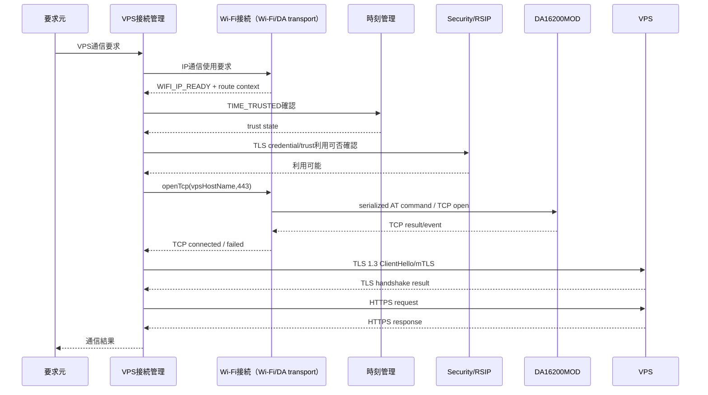

# Tank_Robot VPS接続・デバイス認証基本設計

## 目次

1. 本書の目的
2. 設計方針と適用範囲
3. 責任分界と共通条件
4. Device ID・VPS接続情報・製品固有情報
5. 内部状態・通信セッション・要求管理情報
6. DA16200MODを使用するTCP transport
7. TLS 1.3・相互TLS・デバイス認証
8. デバイス証明書・秘密鍵・信頼情報のプロビジョニング
9. VPS接続開始・終了シーケンス
10. HTTPS共通方式とAPI構成
11. 共通メッセージ・入力検証・資源上限
12. 複数通信要求の調停とTLSセッション共用
13. 設定データ取得
14. ログ・診断情報送信
15. OTA更新情報・ファームウェア取得・結果送信
16. VPSからのUTC時刻取得
17. システム状態・低消費電力・終了処理との連携
18. 切断・再接続・認証状態無効化
19. VPS通信異常・復旧・利用禁止
20. 状態通知・ログ・診断情報
21. 実行時間・通信性能・固定資源方針
22. 検証方針と確認ケース
23. 主対象要求との対応
24. 設計判断・後続事項
25. 他文書へのフィードバック
26. 初版の自己確認結果と引継ぎ条件

---

## 1. 本書の目的

### 1.1 目的

本書の目的は、公開用システム要求仕様「12. VPS接続・デバイス認証」を実現するため、本体からVPSへ開始する管理・保守用の通信を、詳細設計へ展開可能な粒度まで具体化することである。

### 1.2 対象範囲

本書は、Tank_Robot本体からインターネット上のVPSへ行う管理・保守用通信について、Device ID、VPS接続先、TCP transport、TLS 1.3、相互TLS、デバイス認証、HTTPS要求・応答、設定取得、ログ・診断送信、OTA更新用通信、時刻取得、通信セッション、再接続、異常検出および関連機能との責任分界を具体化する。

Wi-Fiアクセスポイント接続およびIP通信確立はWi-Fi接続機能、秘密鍵・証明書・信頼情報の保護および暗号処理基盤はセキュリティ機能、設定の検証・保存・適用は設定管理、ログの送信対象・再送要否はログ・診断、OTA更新開始・検証・書込みはOTA更新、RTC時刻の信頼状態・VPS時刻サンプルの採否・時刻補正は時刻管理が担当する。本機能は、これらを認証済みHTTPS通信へ接続する通信責務を担う。

本書では、VPS通信を次の用途に限定する。

- 管理設定パッケージの取得
- ログ・診断情報の送信
- OTA更新情報の確認
- OTA更新用ファームウェアの取得
- OTA更新結果の送信
- UTC時刻の取得

VPS、インターネットまたはWi-Fiを、走行、砲塔・砲身操作、通常停止、緊急停止または緊急停止解除の通常操作経路として使用しない。

#### 基本設計と詳細設計の区分

本書で定める接続・認証・HTTP・再接続の時間上限、再試行回数、通信データの容量上限、定期通信周期その他、利用者・関連機能から見た通信結果または通信可否を変える値は、本書または参照する担当基本設計で管理する値とする。実機評価で変更が必要となった場合は詳細設計だけで値を変更せず、当該基本設計へ評価結果をフィードバックして正式値を更新する。buffer内部配置、task、callback、parser実装等、外部振る舞いを変更しない実装値は詳細設計で具体化してよい。

### 1.3 上位文書・関連文書

主対象要求は公開用システム要求仕様「12. VPS接続・デバイス認証」とし、関連する公開用要求および完成済み基本設計を責任分界に必要な範囲で参照する。

`20_要求仕様`および`30_コア要求仕様`は本書の上位要求として使用しない。公開用要求で未確定の実現方式について本書で具体化する場合は、本書の設計判断として明示する。

関連基本設計との整合確認結果を本書へ反映する。後続基本設計で具体化された証明書・鍵ライフサイクル、ログ送信単位、OTA受信上限、時刻サンプル契約、Wi-Fi経路世代および製品情報責任が本書の外部振る舞いを具体化している場合は、その確定内容を本書でも使用する。

#### 1.3.1 上位文書

- [`docs/00_project_overview/01_製品目的・製品目標.md`](../../../00_project_overview/01_製品目的・製品目標.md)
- [`docs/10_requirements/12. VPS接続・デバイス認証.md`](<../../../40_公開用システム要求仕様/12. VPS接続・デバイス認証.md>)
- [`docs/20_basic_design/00_Tank_Robot 基本設計について.md`](<../../00_Tank_Robot 基本設計について.md>)
- [`docs/20_basic_design/01_システム構成/Tank_Robotシステム構成.md`](../../01_システム構成/Tank_Robotシステム構成.md)
- [`docs/20_basic_design/02_システムアーキテクチャ/Tank_Robotシステムアーキテクチャ.md`](../../02_システムアーキテクチャ/Tank_Robotシステムアーキテクチャ.md)

#### 1.3.2 関連するシステム要求仕様

- [`docs/10_requirements/03. 電源・省電力管理.md`](<../../../40_公開用システム要求仕様/03. 電源・省電力管理.md>)
- [`docs/10_requirements/11. Wi-Fi接続.md`](<../../../40_公開用システム要求仕様/11. Wi-Fi接続.md>)
- [`docs/10_requirements/13. 設定管理.md`](<../../../40_公開用システム要求仕様/13. 設定管理.md>)
- [`docs/10_requirements/14. ログ・診断.md`](<../../../40_公開用システム要求仕様/14. ログ・診断.md>)
- [`docs/10_requirements/15. OTA更新.md`](<../../../40_公開用システム要求仕様/15. OTA更新.md>)
- [`docs/10_requirements/17. 異常検出・復旧.md`](<../../../40_公開用システム要求仕様/17. 異常検出・復旧.md>)
- [`docs/10_requirements/18. 永続データ管理.md`](<../../../40_公開用システム要求仕様/18. 永続データ管理.md>)
- [`docs/10_requirements/20. セキュリティ管理.md`](<../../../40_公開用システム要求仕様/20. セキュリティ管理.md>)
- [`docs/10_requirements/21. 状態表示・利用者通知.md`](<../../../40_公開用システム要求仕様/21. 状態表示・利用者通知.md>)
- [`docs/10_requirements/22. 性能・品質・耐久性.md`](<../../../40_公開用システム要求仕様/22. 性能・品質・耐久性.md>)
- [`docs/10_requirements/24. 法令・規格・量産移行.md`](<../../../40_公開用システム要求仕様/24. 法令・規格・量産移行.md>)

#### 1.3.3 関連する基本設計

- [`docs/20_basic_design/03_機能別基本設計/04_異常管理/異常管理基本設計.md`](../04_異常管理/異常管理基本設計.md)
- [`docs/20_basic_design/03_機能別基本設計/05_電源・省電力管理/電源・省電力管理基本設計.md`](../05_電源・省電力管理/電源・省電力管理基本設計.md)
- [`docs/20_basic_design/03_機能別基本設計/11_Wi-Fi接続/Wi-Fi接続基本設計.md`](../11_Wi-Fi接続/Wi-Fi接続基本設計.md)
- [`docs/20_basic_design/03_機能別基本設計/13_設定管理/設定管理基本設計.md`](../13_設定管理/設定管理基本設計.md)
- [`docs/20_basic_design/03_機能別基本設計/14_ログ・診断/ログ・診断基本設計.md`](../14_ログ・診断/ログ・診断基本設計.md)
- [`docs/20_basic_design/03_機能別基本設計/15_OTA更新/OTA更新基本設計.md`](../15_OTA更新/OTA更新基本設計.md)
- [`docs/20_basic_design/03_機能別基本設計/16_永続データ管理/永続データ管理基本設計.md`](../16_永続データ管理/永続データ管理基本設計.md)
- [`docs/20_basic_design/03_機能別基本設計/17_セキュリティ管理/セキュリティ管理基本設計.md`](../17_セキュリティ管理/セキュリティ管理基本設計.md)
- [`docs/20_basic_design/03_機能別基本設計/18_製品情報管理/製品情報管理基本設計.md`](../18_製品情報管理/製品情報管理基本設計.md)
- [`docs/20_basic_design/03_機能別基本設計/20_時刻管理/時刻管理基本設計.md`](../20_時刻管理/時刻管理基本設計.md)
- [`docs/20_basic_design/04_インターフェース・通信/Tank_Robotインターフェース・通信基本設計.md`](../../04_インターフェース・通信/Tank_Robotインターフェース・通信基本設計.md)

### 1.4 外部技術資料

実装成立性の確認に、次の公開技術資料を参照する。

- Renesas RA8M2 Group Datasheet
- Renesas Flexible Software Package Documentation: RA8M2
- Renesas FSP: RSIP Protected Mode / RSIP Key Injection / PSA Crypto / Mbed TLS integration
- Mbed TLS 3.6系 TLS 1.3 documentation
- TLS 1.3 standard
- HTTP/1.1 standard

本書ではこれらを上位製品要求として扱わず、採用方式の実装可能性およびプロトコル仕様確認に使用する。

### 1.5 用語

| 用語 | 本書での意味 |
| --- | --- |
| `Device ID` | Tank_Robot本体をVPS側で一意に識別する公開識別子 |
| `WIFI_IP_READY` | Wi-Fi接続が正式に管理する、Wi-Fi接続およびDHCP完了後のIP通信利用可能状態 |
| Wi-Fi経路コンテキスト | Wi-Fi接続が提供する`wifiUseRequestId`、`wifiConnectTransactionId`、`wifiModuleGeneration`、`wifiCredentialRevision`等、現在のIP通信経路を以前の経路と区別する相関情報 |
| TCP transport | Wi-Fi接続機能によるRA8M2からの制御を通じて、DA16200MODのIPスタックとTCPクライアントソケットを使用する通信層。任意のバイト値を変更せずに受け渡せるデータ列を本機能へ提供する |
| TLSセッション | RA8M2上でMbed TLS等を使用して確立するTLS 1.3の暗号通信セッション |
| 認証済みVPS通信 | 接続先VPSの証明書検証と本体クライアント証明書認証が正常完了したTLSセッション |
| `vpsSessionId` | TLSセッションを本体内で一意に識別する64 bit乱数識別子 |
| `requestId` | VPSへの個々のHTTP要求を本体内で識別するuint64識別子 |
| 通信要求元 | 設定管理、ログ・診断、OTA更新、時刻管理等、本機能へVPS通信を要求する機能 |
| 時刻信頼状態 | 時刻管理が正式に管理する、RTC/UTCを証明書有効期間判定等へ使用してよいかの状態 |

---

## 2. 設計方針と適用範囲

### 2.1 基本方針

VPS接続・デバイス認証は次の原則で設計する。

1. VPS通信は本体から開始するHTTPS要求・応答方式とし、VPSから本体への常時接続型pushを使用しない。
2. 通常運用でVPS接続先は1つとする。
3. Wi-Fi/AP/DHCPおよびDA16200MODに対するRA8M2からの制御/TCP通信の基本操作はWi-Fi接続が担当し、本機能は`WIFI_IP_READY`後にWi-Fi接続の通信APIを使用してVPS向けTCP接続・TLS/HTTPSを管理する。
4. TLSおよびHTTPSはRA8M2側で実行し、DA16200MODはWi-Fi/IP/DNS/TCP stack/socketを物理実行する。VPS接続・デバイス認証からDA16200MODへAT Commandを直接発行しない。
5. 本体固有デバイス秘密鍵はRA8M2のRSIP-E50D Protected Mode/Wrapped Keyで保護し、DA16200MODへ保存しない。
6. TLS通信はTLS 1.3を基本とし、安全性を満たさない旧方式へ暗黙にdowngradeしない。
7. 接続先VPSの証明書検証と本体クライアント証明書認証の両方が完了するまで管理・保守データを送受信しない。
8. 信頼できるRTC時刻を使用できない場合、初期製品では通常VPS通信を開始しない。運用中に時刻信頼を失った場合も、第7.8節の安全側処理を行う。
9. VPSから受信した設定、更新情報、時刻その他を、受信しただけで適用・採用しない。
10. 一度に1本のTLSセッション、1件のHTTP要求を処理し、固定上限の通信資源を使用する。
11. 通信断、Wi-Fi経路世代変更または時刻信頼喪失後に旧TLS認証状態、受信途中データまたは未完了要求を自動復元しない。
12. VPS通信はBLE操作、安全監視、停止、緊急停止および電源保護より低い優先度とする。
13. HTTP応答の一時エラーとTCP/TLS接続喪失を区別し、HTTP要求を通信層判断だけで暗黙再送しない。

### 2.2 対象範囲

本書は次を対象とする。

- Device IDの形式と取得
- VPS接続先情報
- Wi-Fi接続のDA16200MOD TCP通信の基本操作を使用するVPS向けTCP connection/session
- TLS 1.3 client
- 相互TLSとサーバー証明書検証
- デバイス証明書・秘密鍵による本体認証
- HTTPS/HTTP 1.1要求・応答
- 設定パッケージ取得通信
- ログ・診断送信通信
- OTA manifest・firmware image取得通信
- OTA結果送信通信
- UTC時刻取得通信
- Wi-Fi経路コンテキストとの相関
- 通信要求の調停
- 切断・再接続
- VPS通信異常
- 通信資源、timeout、上限
- 状態・ログ・診断への情報提供

### 2.3 対象外

次は本書で最終判断しない。

- Wi-Fi AP選択、WPA2認証、DHCP
- DA16200MODに対するUART/AT Command発行、single in-flight arbitration、`moduleCommandId`生成、`wifiModuleGeneration`更新およびsocket primitiveのDA固有commandへの変換
- 設定パッケージのHMAC検証、値域検証、保存、適用、切戻し
- ログ生成、保存、送信対象選択、application batch再送要否
- OTA更新開始条件、署名検証、SecurityGen判定、Flash書込み、更新後起動確認
- RTC時刻の保持、時刻サンプルの最終採否、時刻信頼状態の最終判定、時刻補正方式
- TLS秘密鍵の内部Wrapped Key形式、RSIPレジスタ操作
- VPSサーバー実装、管理Webアプリ実装
- インターネット回線、DNSサーバー、Wi-Fiアクセスポイント自体の設計

### 2.4 初期製品で対象外とする拡張

公開用システム要求仕様「12. VPS接続・デバイス認証」の将来検討事項に従い、初期製品では次を対象外とする。

- 所有者VPSアカウント
- 所有者とDevice IDのVPS関連付け・同期
- 操作端末情報のVPS同期・遠隔失効
- VPSアカウントによる所有者再登録
- VPSから本体への常時push
- WebSocket、MQTT
- 複数VPSフェイルオーバー
- VPSからの接続先自動変更
- TLS Session Resumption
- HTTP body圧縮
- デバイス証明書のオンライン自動更新・ローテーション
- 複雑な通信要求priority、expiry、再評価
- VPSサービス終了専用ローカルモード
- RTC喪失時のVPSによるセキュア時刻ブートストラップ

---

## 3. 責任分界と共通条件

### 3.1 関連機能との責任分界

| 機能 | 主な責任 |
| --- | --- |
| VPS接続・デバイス認証 | Wi-Fi接続の通信APIを使用するVPS向けTCP接続・sessionの意味、TLS/HTTPS、相互TLS結果、要求・応答、通信切断・再接続、受信データの通信共通検証、Wi-Fi経路コンテキストとの相関 |
| 製品情報管理 | Device ID、製品・機種・HW・実行中FW識別情報の正式な管理・利用可否 |
| Wi-Fi接続 | DA16200MODに対するRA8M2からの制御、およびTCP通信の基本操作を提供する唯一の機能。AP接続、WPA2、DHCP、`WIFI_IP_READY`、Wi-Fi経路コンテキスト、Wi-Fi異常、Sleep/Wakeを管理する |
| セキュリティ | RSIP、デバイス秘密鍵保護、証明書・trust anchor保護、TLS最低セキュリティ条件、クライアント証明書ライフサイクル、鍵・証明書異常の判断 |
| 時刻管理 | RTC、時刻信頼状態、VPS取得UTC sampleの採否・RTT判定・補正、信頼時刻更新 |
| 設定管理 | 設定取得要求、設定package検証、generation、安全条件、保存・適用・rollback |
| ログ・診断 | 送信対象batch、最大64 event・16 KiB body、batch ID、application再送要否、送信済み確定、保存期間 |
| OTA更新 | 更新確認要求、manifest判断、image取得要求、chunk保存、hash/署名、更新開始・書込み・復旧、OTA全体deadline |
| 永続データ管理 | VPS接続情報、証明書metadata、trust情報、診断情報等のexact bytes、CRC、原子的保存、保存データの物理的な復旧およびデータ管理機能が指定するpolicyの機械的適用 |
| 異常管理 | VPS通信異常の影響度、復旧可否、利用禁止・復旧指示 |
| 電源・省電力管理 | `PWR_WIFI`、通信終了・中断、Sleep/Wake、低消費電力移行 |
| 状態表示・利用者通知 | VPS通信状態・異常の具体表示 |

### 3.2 VPS通信開始共通条件

通常VPS通信を開始する前に少なくとも次を確認する。

- Wi-Fi接続が現在世代の`WIFI_IP_READY`とWi-Fi経路コンテキストを提供している。
- VPS接続情報を安全に使用できる。
- 製品情報管理からDevice IDを正常に取得できる。
- デバイス証明書および秘密鍵を使用可能である。
- 接続先VPSのtrust anchorを使用可能である。
- 時刻管理が`TIME_TRUSTED`を提供している。
- 異常管理またはシステム状態によりVPS通信利用禁止となっていない。
- 低消費電力移行、終了処理、再起動等による通信終了要求が成立していない。

### 3.3 安全機能からの独立

VPS通信利用不能、証明書期限切れ、DNS失敗、TLS失敗、VPS停止その他のVPS異常だけを理由として、BLEによる基本操作、安全監視、停止処理または本体側緊急停止を禁止しない。

VPS通信処理のCPU・通信・メモリ使用により安全関連処理の期限を侵害しない。

---

## 4. Device ID・VPS接続情報・製品固有情報

### 4.1 Device ID生成元

Device IDは製品情報管理を正式な管理元とし、RA8M2が持つ128 bit Unique IDを元に、同じUnique IDからは常に同じ値を生成する。

外部表現は次を基本形式とする。

`TR1-xxxxxxxxxxxxxxxxxxxxxxxxxxxxxxxx`

- prefix：`TR1-`
- Unique ID：128 bitをlowercase hexadecimal 32文字で表現
- 全体長：36文字
- 文字列終端を除き固定長

Device IDは秘密情報として扱わないが、通常利用者が変更できる設定項目にはしない。

### 4.2 Device IDの利用

Device IDを少なくとも次へ使用する。

- VPS側のデバイス識別
- クライアント証明書と本体の対応確認
- HTTPS要求の対象Device ID
- VPS応答の対象確認
- 設定package対象確認への引渡し
- OTA manifest対象確認への引渡し
- 診断・ログのデバイス識別

Device IDを認証秘密情報の代わりには使用しない。

### 4.3 VPS接続情報

初期製品は通常VPS接続先を1件だけ保持する。

| 項目 | 基本方式 |
| --- | --- |
| `vpsHostName` | FQDN、最大253 octet、製造・開発設定 |
| `vpsPort` | TCP 443固定 |
| `apiBasePath` | `/api/v1/device`を基本 |
| `protocolMajor` | 1 |
| `protocolMinor` | 0 |
| `serverTrustAnchorRef` | セキュリティ管理が管理するtrust anchor参照 |
| `deviceCertificateRef` | セキュリティ管理が管理する本体固有クライアント証明書参照 |
| `devicePrivateKeyRef` | セキュリティ管理/RSIPが管理する本体固有Wrapped private key参照 |

所有者または一般操作者の通常操作からVPS接続先、証明書、秘密鍵、trust anchorを変更できない。

### 4.4 FQDNを使用する理由

接続先は固定IPではなくFQDNを基本とする。

DNS解決結果はTCP接続先候補として使用するが、DNS結果だけを接続相手の正当性確認へ使用しない。最終的な接続先確認はTLSサーバー証明書のhostname検証で行う。

### 4.5 工場初期化との関係

Device ID、VPS接続情報、デバイス証明書、デバイス秘密鍵およびtrust anchorは製品固有情報として扱い、通常の所有者再登録または工場出荷状態への初期化では削除しない。

これらの交換はセキュリティ管理の定義する有線開発・保守経路で行う。

---

## 5. 内部状態・通信セッション・要求管理情報

### 5.1 VPS通信状態

本機能は少なくとも次の内部状態を区別する。

| 状態 | 意味 |
| --- | --- |
| `VPS_UNAVAILABLE` | 前提条件不足または利用禁止 |
| `VPS_IDLE` | 通信可能だが未接続 |
| `TCP_CONNECTING` | TCP接続中 |
| `TLS_HANDSHAKING` | TLS 1.3 handshake中 |
| `VPS_AUTHENTICATED` | 相互TLS成功、HTTP要求可能 |
| `HTTP_TRANSACTION` | HTTP要求・応答処理中 |
| `VPS_CLOSING` | 通信終了中 |
| `VPS_RETRY_WAIT` | 一時的な接続確立障害後の再試行待ち |
| `VPS_FAULTED` | 同一条件で自動接続・通信を継続しない異常 |

これらはシステム状態ではない。

### 5.2 TLSセッション識別と経路相関

TLS handshake成功ごとに暗号用途乱数生成機能を用いて新しい64 bit `vpsSessionId`を生成する。

TLSセッションには、確立時のWi-Fi接続のWi-Fi経路コンテキストを対応付ける。少なくとも`wifiConnectTransactionId`、`wifiModuleGeneration`および`wifiCredentialRevision`を保持し、当該世代の`WIFI_IP_READY`にだけ対応するTLSセッションとして扱う。

切断、IP_READY喪失、`wifiModuleGeneration`変更または接続経路の世代変更後に同じ`vpsSessionId`を再利用しない。旧経路世代の遅延通知を現在TLSセッションの正常性根拠として使用しない。

TLS Session Resumptionは初期製品では使用しないため、再接続は常に新しいTLS handshakeと相互認証を行う。

### 5.3 HTTP要求識別

`requestId`はuint64とし、起動中に単調増加させる。0を無効値とする。

要求元が独自の取引識別子を持つ場合は、`requestId`とは別に保持する。

例：

- 設定package ID
- log batch ID
- OTA transaction ID
- firmware ID
- OTA chunk offset
- timeSyncRequestId

### 5.4 一度に一つのHTTP要求

同一TLSセッション内で同時に複数HTTP要求を送信しない。

HTTP pipeliningおよびHTTP/2 multiplexingは初期製品では使用しない。

---

## 6. DA16200MODを使用するTCP transport

### 6.1 責任分界

Wi-Fi接続は、`WIFI_IP_READY`およびWi-Fi経路コンテキストに加え、DA16200MODに対するRA8M2からの制御とTCP通信の基本操作を提供する唯一の機能とする。本機能はVPS向けTCP接続・セッションの扱いを定めるが、DA16200MODへAT Commandを直接発行せず、Wi-Fi接続の論理通信APIを使用する。

DA16200MODは、モジュール内でWi-Fi/IP/DNS/TCPスタックとTCPクライアントソケットの通信処理を実行する。Wi-Fi接続は、UART/AT Command、同時に進行させるモジュール要求を1件に制限する調停、`moduleCommandId`および`wifiModuleGeneration`を一元管理する。

DA16200MODではHTTPS処理を行わない。Wi-Fi接続の通信APIを介して、任意のバイト値を変更せずに受け渡せるTCPのデータ列を、RA8M2上のVPS接続・デバイス認証へ提供する。

### 6.2 TCP transport論理インターフェース

本機能はWi-Fi接続が提供するDA16200 TCP transport論理インターフェースから少なくとも次の機能・情報を使用する。

- 現在の`WIFI_IP_READY`
- `wifiUseRequestId`
- `wifiConnectTransactionId`
- `wifiModuleGeneration`
- `wifiCredentialRevision`
- `openTcp(vpsHostName, 443)`
- TCP接続完了・失敗通知
- `send(bytes, length)`
- 受信byte stream通知
- send完了・失敗
- socket状態取得
- `closeTcp()`
- DNS失敗、TCP reset、remote close、transport異常通知

`openTcp`、`send`、receive、socket status、`closeTcp`その他のsocket primitiveはすべてWi-Fi接続のsingle in-flight AT Command arbiterを経由する。本機能は`moduleCommandId`を生成せず、`wifiModuleGeneration`を更新せず、DA16200MODのAT Commandを直接発行しない。

一方、本機能はVPS接続先host/port、VPS向けTCP connection/sessionの状態・意味、接続結果のVPS通信上の扱い、TLS/HTTPS状態、`vpsSessionId`およびHTTP `requestId`を所有する。Wi-Fi接続のtransport primitive成功だけをVPS認証済み通信成功へ読み替えない。

具体的なAT Command文字列、socket ID、UART data mode、escape sequenceはWi-Fi接続の責任分界に従い詳細設計で定める。

### 6.3 UART上のデータ

TLS処理をRA8M2側で行うため、TCP socket確立後にRA8M2とDA16200MOD間を流れるVPS application dataはTLS recordとして暗号化済みである。

Device ID等の非秘密管理metadataを除き、HTTP body平文、client秘密鍵、TLS session secretをDA16200MODへ保存しない。

### 6.4 DNS

DA16200MOD側IP stackのDNS resolutionをWi-Fi接続の通信API経由で使用できる。

DNS失敗はVPS接続失敗として扱うが、証明書検証を省略したIP直指定への自動fallbackは行わない。

### 6.5 TCP接続状態・Wi-Fi経路状態の不明時

Wi-Fi接続からTCP socket状態を正常に取得できない場合、接続済みと楽観的に扱わずTLSセッションを利用不能とする。

Wi-Fi接続からIP経路喪失、`wifiModuleGeneration`変更、現在TLSセッションと異なる`wifiConnectTransactionId`／`wifiCredentialRevision`を通知された場合も、旧TCP/TLSセッションを継続利用しない。

---

## 7. TLS 1.3・相互TLS・デバイス認証

### 7.1 TLS処理主体

TLS/HTTPS処理主体はRA8M2とする。

RA8M2上のMbed TLS系libraryとRSIP-E50Dの暗号支援機能を使用する基本構成とする。

DA16200MODへclient秘密鍵を格納してHTTPS client機能を代行させない。

### 7.2 TLSバージョン

初期製品の通常VPS通信はTLS 1.3を使用する。

TLS 1.2以下への自動downgradeを行わない。

実機・VPS結合評価でTLS 1.3-only構成の成立を確認し、成立しない場合は詳細設計だけでTLS 1.2を有効化せず、本基本設計およびセキュリティ管理を見直す。

### 7.3 基本暗号suite

初期製品の基本cipher suiteは`TLS_AES_128_GCM_SHA256`とする。

TLS key exchangeはECDHE `secp256r1`を基本とする。

本体クライアント証明書はECDSA P-256 / SHA-256を基本とする。

server証明書で許可する署名方式、chain profileの具体集合はセキュリティ管理のセキュリティ詳細設計で固定するが、接続先検証を省略する方式は許可しない。

### 7.4 サーバー証明書検証

少なくとも次を確認する。

- trust chainが登録済みtrust anchorへ到達する。
- `vpsHostName`と証明書SAN/CNの接続先名が一致する。
- 証明書署名が正常である。
- server authentication用途が許可されている。
- 証明書有効期間を信頼時刻で確認できる。
- 非対応アルゴリズムまたは弱い方式へdowngradeしていない。

任意の自己署名証明書受入れ、hostname検証無効、verify-none等を通常運用で使用しない。

### 7.5 本体デバイス認証

VPSは本体固有クライアント証明書を検証し、本体をDevice IDへ対応付ける。

本体側はTLS handshake成功だけでなく、VPS APIから`DEVICE_ACTIVE`相当の利用可能結果が得られる場合は当該結果も管理する。

VPSからデバイス未登録、証明書失効、デバイス利用停止その他の結果を受信した場合、同一条件で管理・保守通信を継続しない。

### 7.6 RTC信頼状態

通常のTLS接続を開始する前に時刻管理から時刻信頼状態を取得する。

`TIME_TRUSTED`でない場合、通常TLS接続を開始しない。

初期製品では、証明書有効期間検証を一時的に省略してVPSから初期時刻を取得する方式を実装しない。

RTC時刻喪失時の復旧は時刻管理/セキュリティ管理で確定した物理アクセスを伴う開発・保守手段を使用する。

### 7.7 認証済み状態の成立

次をすべて満たした場合だけ`VPS_AUTHENTICATED`とする。

- 現在のWi-Fi接続のWi-Fi経路コンテキストが有効
- Wi-Fi接続の通信APIによるTCP接続正常
- TLS 1.3 handshake正常
- サーバー証明書検証正常
- クライアント証明書・秘密鍵による相互TLS正常
- handshake完了時点で`TIME_TRUSTED`
- セキュリティ管理からVPS認証利用禁止がない

### 7.8 時刻信頼喪失時の既存セッション

`TIME_TRUSTED`から`TIME_UNTRUSTED`へ遷移した場合、初期製品では安全側・単純側の基本方式として次を行う。

1. 新しいHTTP要求の受付を直ちに禁止する。
2. 実行中HTTP要求がある場合は正常完了扱いにせず`COMMUNICATION_INTERRUPTED`として要求元へ返す。
3. TLSを終了し、Wi-Fi接続の通信APIへ`closeTcp()`を要求してTCP socketを閉じ、`VPS_AUTHENTICATED`および`vpsSessionId`を無効化する。
4. 新しい`TIME_TRUSTED`が時刻管理から提供されるまで通常VPS通信を再開しない。

単一のVPS時刻サンプルがRTT超過、大きなoffsetまたは二回目sample不一致で時刻管理から拒否された場合でも、時刻管理が時刻信頼状態そのものを維持している限り、本節のセッション強制終了条件とはしない。

---

## 8. デバイス証明書・秘密鍵・信頼情報のプロビジョニング

### 8.1 デバイス秘密鍵

本体固有VPS認証秘密鍵はECDSA P-256とする。

初期provisioning時にRA8M2上でRSIP KeyPairGenerate相当を使用して生成し、private keyはWrapped Keyのまま保存する。raw private keyを本体外へexportせず、public keyだけを証明書発行工程へ提供する。

### 8.2 製造・プロビジョニング基本フロー

1. 製品情報管理に従ってRA8M2の128 bit Unique IDからDevice IDを確定する。
2. RA8M2上でRSIP KeyPairGenerate相当を使用し、本体固有ECDSA P-256鍵pairを生成する。
3. private keyをWrapped Keyのまま永続データ管理のcritical security datasetへ保存し、public keyだけを証明書発行工程へ提供する。
4. Device IDとpublic keyを対応付けて本体クライアント証明書を発行する。
5. クライアント証明書、必要なchain情報、VPS trust anchor、VPS接続情報を本体へ登録する。
6. certificate public keyと本体Wrapped private keyの対応をchallenge signing等で確認する。
7. VPS側device registryへDevice IDとクライアント証明書識別情報を対応付ける。
8. 相互TLS接続とDevice ID一致を製造検査し、すべて正常な場合だけdevice credentialをACTIVEとする。

### 8.3 クライアント証明書形式・基本プロファイル

セキュリティ管理で確定した初期基本方式を使用する。

- X.509 v3
- public key：ECDSA P-256
- certificate signature：ECDSA with SHA-256を基本
- keyUsage：digitalSignature
- extendedKeyUsage：clientAuth
- Device IDをcertificate subject/SANの識別情報へ対応付ける
- certificate serialはCA側で一意管理
- クライアント証明書有効期間：5年を初期基本値

具体的なSubject field、SAN表現、DER/PEM保存表現はセキュリティ管理およびVPS詳細設計で一意に固定する。本体runtimeではDERを基本候補とする。

### 8.4 trust anchor

サーバー証明書検証に使用するACTIVE trust anchor setは初期製品では1組を基本とする。

trust anchorは製造・開発・保守管理対象とし、所有者設定、通常VPS設定packageまたは通常OTAによって変更しない。

trust anchor更新が必要となる場合は、セキュリティ管理で定める物理アクセスを伴うwired maintenanceを使用する。

### 8.5 工場初期化

Device ID、クライアント証明書、device private Wrapped Key、VPS trust anchorおよびVPS接続情報は工場初期化で消去しない。

### 8.6 クライアント証明書の期限と保守交換

クライアント証明書有効期間5年はセキュリティ管理の初期基本値を使用する。

信頼時刻を利用可能な場合、クライアント証明書の期限まで90日以下となったことを保守警告として識別し、時刻管理/セキュリティ管理/状態表示・利用者通知およびログ・診断へ必要な情報を提供できるようにする。この警告だけを理由としてローカルBLE基本操作を禁止しない。

クライアント証明書期限切れ後、新しい通常VPS相互TLS接続を成功扱いにしない。初期製品ではonline自動rotationを行わず、交換が必要な場合はセキュリティ管理のwired maintenance手順を使用する。

---

## 9. VPS接続開始・終了シーケンス

### 9.1 接続開始契機

本機能は、設定管理、ログ・診断、OTA更新または時刻管理からVPS通信要求を受けた場合に接続を開始する。

起動したことだけを理由として無条件にVPSへ接続するのではなく、4機能の初回保守要求をまとめて発行する方式とする。

### 9.2 接続シーケンス

VPS接続・デバイス認証が要求するTCP open/send/receive/status/closeはWi-Fi接続の通信APIを経由し、Wi-Fi接続だけがDA16200MODへAT Commandを発行する。TCP/TLS確立中またはHTTP要求中にWi-Fi接続のWi-Fi経路コンテキストが変化した場合、旧経路上の結果を現在取引へ継続利用せず第18章の切断処理へ移る。

### 9.3 接続とHTTP通信の時間上限

#### 個別処理のタイムアウト

基本設計値は次とする。

| 処理 | タイムアウト |
| --- | ---: |
| DNSによる名前解決＋TCP接続 | 10秒 |
| TLS 1.3ハンドシェイク | 20秒 |
| TCP開始から相互TLS完了まで | 30秒 |
| HTTP応答ヘッダー待ち | 10秒 |
| 通常JSONの要求・応答全体 | 30秒 |
| OTAの1チャンク受信 | 30秒 |
| TLS/TCPの正常切断 | 5秒 |

#### VPS接続確立の130秒を計り始める時点

本機能のVPS接続確立取引は、現在世代の`WIFI_IP_READY`を取得し、VPS接続情報、`TIME_TRUSTED`、認証情報・信頼情報の利用可否など、接続開始の前提条件を確認してから開始する。

130秒の上限は、**最初のDNS/TCP/TLS接続試行を開始した時点**から連続して計る。再試行中の扱いは、第18.5節に従う。
Wi-Fi接続機能による初回のDA16200使用可能化や、初回のWi-Fi接続待ちは、この130秒に含めない。

#### 開始時の状態ごとの接続時間上限

通常の自動接続では、電源・省電力管理機能による電源状態変更が正常に成立し、Wi-Fi接続機能がDA16200を使用可能にする処理を開始できることを前提とする。
通信部の初期化またはスリープからの復帰が必要な場合は、その処理からWi-Fi接続、VPS接続の順に進める。

| 開始時に成立している状態 | 時間を計り始める時点 | 残る接続処理と各上限 | 接続確立までの上限 |
| --- | --- | --- | --- |
| DA16200の初期化または復帰が必要 | DA16200を使用可能にする処理の開始 | 初期化・復帰5秒＋Wi-Fi接続130秒＋VPS接続130秒 | 265秒 |
| DA16200は使用可能で、Wi-Fi接続が必要 | 最初のAP接続試行の開始 | Wi-Fi接続130秒＋VPS接続130秒 | 260秒 |
| 現在世代の`WIFI_IP_READY`が成立済み | 開始前提の確認後、最初のDNS/TCP/TLS接続試行を開始した時点 | VPS接続130秒 | 130秒 |
| 再利用可能な`VPS_AUTHENTICATED`セッションが存在 | 新しい接続確立の計時は行わない | 既存セッションを使用 | 新たな接続確立待ちなし |

上表の接続確立の終点は、`VPS_AUTHENTICATED`の確定とする。
Wi-Fi接続の130秒とVPS接続の130秒は、担当機能と計時開始点が異なる別の上限である。初回のWi-Fi接続待ちと、VPS接続確立取引の開始後に発生したWi-Fi再接続との違いは、第18.5節に従う。

#### 通常の自動接続へ含めない復旧処理

次の処理を、上記の通常自動接続へ暗黙に連結しない。

- 電源・省電力管理機能が行う、電力状態変更の異常処置
- 異常管理機能が明示的に開始する、別の復旧取引
- 利用禁止状態からの保守復旧

これらを理由として、同じ265秒の上限や本機能の130秒の計時を再開始し、無期限に延長しない。

#### HTTP処理と要求元の期限との関係

HTTP要求・応答の個別タイムアウトは、接続確立後のアプリケーション処理に適用する。
上記265秒へHTTP処理時間を一律に加算して、新しい共通のHTTP時間上限を設けない。

OTA更新機能などの要求元が処理全体の期限を持つ場合は、その期限を延長しない。
個別処理のタイムアウトによって、上位処理全体のタイムアウトを延長しない。

これらの時間値は、利用者・関連機能から見たVPS通信の振る舞いを定める、本書で管理する基本設計値である。
実機評価で変更する場合は、第24章の評価結果を本書へ反映する。

### 9.4 接続完了

HTTP要求を実行できる状態は`VPS_AUTHENTICATED`だけとする。

Wi-Fi接続済み、TCP接続済みまたはTLS socket作成済みを、認証済みVPS通信と同一視しない。

### 9.5 終了

通信終了要求時は次を行う。

1. 新規HTTP要求受付を停止する。
2. 実行中要求を正常完了または安全に中断する。
3. 受信途中bodyを正常完了扱いにしない。
4. TLS close_notify送信を可能な範囲で実行する。
5. Wi-Fi接続の通信APIへ`closeTcp()`を要求し、TCP socket close結果を取得する。
6. TLS session secretおよび一時bufferを無効化・clearする。
7. `vpsSessionId`とWi-Fi経路相関情報を無効化する。
8. Wi-Fi接続/電源・省電力管理へWi-Fi使用要求解放結果を返す。

---

## 10. HTTPS共通方式とAPI構成

### 10.1 HTTP方式

HTTPS application protocolはHTTP/1.1を基本とする。

初期製品では次を使用しない。

- HTTP/2
- HTTP/3
- WebSocket
- server push
- HTTP pipelining
- body compression

### 10.2 connection reuse

1本の認証済みTLSセッション内で複数のHTTP/1.1要求を順次実行できる。

最後の要求完了後、追加pending要求がなければ5秒のidle猶予後にTLS/TCPを切断する。

低消費電力移行、終了処理、再起動、Wi-Fi経路世代変更、時刻信頼喪失または異常処置ではidle猶予を待たず終了する。

### 10.3 共通request header

少なくとも次を使用する。

- `Host`
- `Content-Type`
- `Content-Length`
- `Connection`
- `X-TankRobot-Protocol`
- `X-Device-ID`
- `X-Request-ID`

Bearer tokenをdevice認証の代わりとして使用しない。

### 10.4 API基本構成

初期製品のURI基本形を次とする。

| 用途 | Method | URI基本形 |
| --- | --- | --- |
| 設定取得 | GET | `/api/v1/device/{deviceId}/config` |
| ログ・診断送信 | POST | `/api/v1/device/{deviceId}/logs` |
| OTA manifest取得 | GET | `/api/v1/device/{deviceId}/ota/manifest` |
| OTA image取得 | GET | `/api/v1/device/{deviceId}/ota/image/{firmwareId}` |
| OTA結果送信 | POST | `/api/v1/device/{deviceId}/ota/result` |
| UTC時刻取得 | GET | `/api/v1/device/{deviceId}/time` |

API base pathやminor version変更はprotocol互換性管理対象とする。

### 10.5 OTA Range取得

OTA imageはHTTP Range requestを使用して分割取得する。

`Range: bytes=start-end`を基本とし、VPS responseが要求offset、length、firmware IDと一致することを確認する。

HTTP redirectを自動追従しない。別hostへのredirectでtrust境界を変更しない。

### 10.6 Transfer-Encoding

初期製品では`Content-Length`が明示された応答を基本とする。

予期しない`Transfer-Encoding: chunked`等を詳細設計で明示対応していない場合は非対応応答として拒否する。

---

## 11. 共通メッセージ・入力検証・資源上限

### 11.1 metadata形式

設定metadata、OTA manifest、時刻、一般応答およびエラーはUTF-8 JSONを基本とする。

OTA image本体はbinaryとする。

### 11.2 共通response項目

JSON responseは用途に応じて少なくとも次を含める。

- `protocolVersion`
- `requestId`
- `deviceId`
- `result`
- `errorCode`
- 用途ごとのデータ本体

要求と一致しない`requestId`、Device IDまたはprotocol majorを正常応答として使用しない。

### 11.3 HTTP status分類

| status class | 基本扱い |
| --- | --- |
| 2xx | body検証後に成功候補 |
| 304 | 変更なし等、API定義に従う正常結果 |
| 400 | 本体要求形式またはprotocol不整合候補。自動無期限retryしない |
| 401/403 | device認証・利用許可異常候補。VPS利用禁止へ通知 |
| 404 | 対象なしまたはAPI不一致をAPIごとに分類 |
| 409 | generation/状態競合等として要求元へ通知 |
| 413 | size上限違反として失敗 |
| 429 | 一時制限。要求元へretryable結果として返し、通信層で短時間連続再送しない |
| 5xx | 一時VPS application障害候補。TCP/TLSが正常なら接続喪失とみなさず、要求元へretryable結果として返す |

HTTPステータスだけで、設定内容やOTA更新の条件が正しいと判断しない。

### 11.4 入力検証順序

1. HTTP status
2. header総長・個別長
3. `Content-Length`
4. MIME type
5. body上限
6. JSON parseまたはbinary長
7. protocol version
8. requestId
9. Device ID
10. 用途固有必須項目
11. 値域・offset・配列数
12. 要求元機能への引渡し

### 11.5 固定上限

初期基本値を次とする。

| 項目 | 上限 |
| --- | ---: |
| HTTP header総量 | 4 KiB |
| header count | 32 |
| 1 header line | 512 byte |
| 一般JSON response body | 16 KiB |
| 設定package transport body | 16 KiB |
| OTA manifest | 8 KiB |
| log upload 1 batch | 16 KiB、かつログ・診断の最大64 event |
| OTA 1 chunk | 16 KiB |
| 同時TLSセッション | 1 |
| 同時HTTP要求 | 1 |
| pending要求slot | 4機能分の固定slot |

設定package 16 KiBは設定管理、log 16 KiB/64 eventはログ・診断、OTA manifest 8 KiBおよびRange 16 KiBはOTA更新との機能間契約である。各受け手の確定上限より大きいtransport dataを正常入力として受け付けない。

OTA image全体サイズはOTA更新が定める上限を使用し、image全体をRAMへ保持しない。

### 11.6 不正size

header、body、配列、offset、Rangeその他の長さ情報が上限を超えた場合、対象dataを要求元へ提供せず、VPS通信異常候補として記録する。

---

## 12. 複数通信要求の調停とTLSセッション共用

### 12.1 pending要求

設定管理、ログ・診断、OTA更新、時刻管理ごとに固定1slotのpending要求を持つ。

同一要求元から複数要求を無制限FIFOへ積まない。

### 12.2 固定優先順位

複雑な動的priority管理を設けず、次の固定順を基本とする。

1. 実行中OTA image取得の継続
2. 設定取得
3. OTA manifest確認またはOTA結果送信
4. 時刻同期
5. ログ・診断送信

安全停止、緊急停止、終了、低消費電力移行および異常処置はこのpriorityより常に上位とする。

### 12.3 active要求のpreempt

通常の管理要求同士では、既にHTTP送受信を開始した要求を途中preemptしない。

ただし安全・終了・低消費電力要求、Wi-Fi経路喪失または時刻信頼喪失では正常完了を待てない場合、安全に中断する。

### 12.4 TLSセッション共用

1つの要求完了時に他のpending要求が存在し、同じVPS接続条件、同じWi-Fi経路コンテキストおよび`TIME_TRUSTED`が維持されている場合、同じ認証済みTLSセッションを順次使用できる。

各HTTP要求は独立した`requestId`を使用する。

### 12.5 定期要求の発生方針

VPS機能自身が設定適用・OTA開始を決定せず、各要求元へ次の基本周期をフィードバックする。

- 設定確認：起動後の最初の保守通信時に1回、その後30分ごとを基本
- OTA manifest確認：起動後の最初の保守通信時に1回、その後30分ごとを基本
- 時刻同期：起動後の最初の正常VPS通信時に1回、その後24時間ごとを基本
- ログ送信：ログ・診断のbatch条件による

低消費電力状態中は定期時刻到来だけを理由としてWi-Fi/VPSを起こさず、次回通常復帰後へ保留する。

30分・24時間は管理・保守通信の発生頻度を決める基本設計で管理する値であり、通信量・消費電力評価で変更する場合は本書および担当機能へフィードバックする。

### 12.6 periodic coalescing

設定確認、OTA確認、時刻同期等が近接している場合、1回のWi-Fi接続・TLSセッションにまとめて実行する。

---

## 13. 設定データ取得

### 13.1 責任

本機能は設定packageをVPSから完全受信し、通信共通検証を行って設定管理へ渡す。

packageのHMAC、schemaVersion、generation、安全値、適用条件、保存・適用・rollbackは設定管理/セキュリティ管理の責任である。

### 13.2 request

設定取得要求には少なくとも次を対応付ける。

- Device ID
- 現在有効なgeneration
- 対応schemaVersion
- firmware識別情報または互換性判断に必要な情報
- requestId

### 13.3 response

正常responseから少なくとも次を取得する。

- 設定package ID
- schemaVersion
- generation
- target Device ID
- package length
- 認証情報を含む設定package本体

完全受信前に設定管理へ正常packageとして提供しない。

### 13.4 変更なし

VPSが現在generationと同一または新規設定なしを正常に通知した場合、`NO_NEW_CONFIG`結果を設定管理へ返す。

### 13.5 適用禁止

設定packageを受信したことだけを理由として、本機能が設定を各機能へ適用しない。

---

## 14. ログ・診断情報送信

### 14.1 責任

ログ・診断がVPS送信対象として確定したbatchだけを送信する。

VPS接続・デバイス認証はログの保存期間、重要度、削除可否、application batch再送要否を決定しない。

### 14.2 batch送信

1 HTTP request bodyは**最大16 KiBかつ最大64 event**とする。

より大きな送信対象はログ・診断で複数batchへ分ける。

各batchへログ・診断が一意に識別可能な`logBatchId`を付ける。

### 14.3 送信完了

VPSから対象`logBatchId`に対する正常受領応答を得た場合だけ、当該batchをVPS送信完了としてログ・診断へ通知する。

TCP送信完了、TLS送信完了またはHTTP request送信完了だけではVPS受領完了としない。

### 14.4 通信断・application再送

response確定前に切断した場合、送信完了状態をUNKNOWNとしてログ・診断へ返す。

同じ`logBatchId`を再送するかどうかはログ・診断およびVPS APIのidempotency設計で決定する。ログ・診断で確定した「一送信機会で追加最大2回、1秒→2秒」のapplication batch再送policyを使用し、VPS接続・デバイス認証の接続確立retryをログbatch再送回数へ読み替えない。

VPS接続・デバイス認証はUNKNOWNとなったPOST bodyを、通信層判断だけで新しい`requestId`へ自動再送しない。

---

## 15. OTA更新情報・ファームウェア取得・結果送信

### 15.1 OTA manifest取得

OTA更新からmanifest確認要求を受け、認証済みVPS通信で自機向けOTA情報を取得する。

manifest transport上限は**8 KiB**とする。

少なくとも次をOTA更新へ提供する。

- target Device ID
- firmware ID
- SemVer
- BuildID
- SecurityGen
- image format/version
- target product/hardware
- image length
- image hash
- signature関連情報
- compatibility情報
- image取得情報
- response result

### 15.2 OTA開始判断を行わない

manifest受信後、VPS機能自身はOTA更新を開始しない。

対象、signature、SecurityGen、電源、停止、安全状態、記憶領域等のOTA開始条件はOTA更新が判断する。

### 15.3 firmware取得

OTA更新から指定された`firmwareId`、offset、lengthに従いRange requestでimageを取得する。

1 chunkは16 KiBとする。

最後のchunkだけ16 KiB未満を許可する。

### 15.4 chunk整合

各chunkについて少なくとも次を確認する。

- TLS/VPSセッションが有効
- 現在のWi-Fi経路コンテキストがTLS確立時と一致
- HTTP status正常
- firmware ID一致
- request range一致
- returned offset一致
- returned length一致
- 全体image sizeと範囲が矛盾しない

受信chunkのhash蓄積、外部Flashへの保存、全体hash・署名検証はOTA更新/セキュリティ管理の責任とする。

### 15.5 再取得

chunk取得が途中失敗した場合、そのchunkを正常取得扱いにしない。

OTA更新から同じoffsetの再取得要求を受けた場合、新しいHTTP `requestId`で取得する。

切断前の受信途中byte列を新しいTLSセッションへ連結しない。

VPS接続・デバイス認証内の接続確立retryを行う場合でも、OTA更新が管理するOTA全体15分deadlineを越える再試行を継続しない。

### 15.6 OTA結果送信

OTA更新から提供されたOTA transaction ID、firmware ID、更新結果、復旧結果等をPOSTでVPSへ送信する。

response確定前に切断した場合は送信結果をUNKNOWNとしてOTA更新へ返し、通信層判断だけでPOSTを暗黙再送しない。再送する場合は同じOTA transaction IDを用いたVPS APIの冪等性とOTA更新の判断に従い、新しいHTTP `requestId`を使用する。

OTA結果送信失敗だけを理由として、既に正常確定したfirmwareをrollbackしない。

---

## 16. VPSからのUTC時刻取得

### 16.1 前提

初期製品では通常VPS通信開始時点でRTC時刻が`TIME_TRUSTED`であることを前提とする。

したがってVPS時刻取得は時刻の初期ブートストラップではなく、既存の信頼時刻の同期・補正候補取得として使用する。

### 16.2 time responseとserver側契約

VPS time APIから少なくとも次を取得する。

- `serverUtcEpochMs`
- requestId
- Device ID
- response result

VPSは`serverUtcEpochMs`をresponse body送出直前に取得し、当該responseへ固定する。事前生成cacheの古い時刻、前回requestのresponseまたはrequest受付後から長時間経過した時刻値を時刻サンプルとして再利用しない。

### 16.3 VPS接続・デバイス認証が行う通信側検証・相関

VPS接続・デバイス認証は少なくとも次を確認・提供する。

- 正常な認証済みTLSセッションから取得したこと
- 現在の`requestId`一致
- Device ID一致
- HTTP/API response正常
- `serverUtcEpochMs`が整数表現として解析可能であること
- response全体が正常受信済みで、前回responseやcache残骸ではないこと
- request送信直前の同一起動内の単調増加するタイムスタンプ
- response受信完了時の同一起動内の単調増加するタイムスタンプ
- authenticated VPS session結果

request送信monotonic時刻とresponse受信monotonic時刻をUTC値で代用しない。

### 16.4 時刻サンプルの最終採否は時刻管理が行う

VPS sampleのcalendar範囲、RTT、receive時刻推定、現在RTCとの差、時刻補正可否および二回目sample要否は時刻管理が担当する。

時刻管理の現行基本設計では、少なくとも次を使用する。

- calendar範囲：2025-01-01T00:00:00Z以上、2100-01-01T00:00:00Z未満
- sample RTT受入れ上限：4,000 ms
- offset絶対値10分以下：accepted sample 1回で補正候補
- offset絶対値10分超：2秒以上60秒以内の二回目sampleを要求し、monotonic経過を加味した2 sampleが2秒以内で整合した場合だけlarge correction候補

RTT超過、large offsetまたは二回目sample不一致を、VPS接続・デバイス認証がTCP/TLS接続異常へ勝手に読み替えない。時刻管理が現在のTIME_TRUSTEDを維持する限り、当該sample拒否だけでVPSセッションを切断しない。

### 16.5 時刻適用

RTCへのstep correction、Trusted Time Record、`timeSyncGeneration`および信頼状態更新の意味は時刻管理が所有する。セキュリティ管理はstate MACを生成・検証し、永続データ管理は時刻管理が指定したrecordを物理的に保存する。

本機能はUTC sample、VPS認証状態、requestId、送受信monotonic timestampおよび取得結果を提供する。

### 16.6 RTC信頼喪失

RTCが未設定または信頼不能になった後、本機能だけでVPSへ接続して時刻を回復しない。

通常VPS通信は利用不能とし、第7.8節に従って既存VPSセッションも終了する。定義された開発・保守手段で時刻信頼を再確立する。

---

## 17. システム状態・低消費電力・終了処理との連携

### 17.1 通常操作中

VPS通信は通常操作中にも管理・保守上必要な範囲で実行できるが、BLE操作、安全監視および停止処理を優先する。

設定を取得しても通常操作中に即時適用しない。

OTA manifestを取得してもOTA更新開始条件が成立するまで更新を開始しない。

### 17.2 低消費電力移行

電源・省電力管理から通信終了・中断要求を受けた場合、次を行う。

- 新規要求を受け付けない。
- 実行中HTTP要求を可能なら完了、間に合わなければ中断する。
- 途中bodyを正常完了扱いにしない。
- TLSを終了し、Wi-Fi接続へ`closeTcp()`を要求する。
- 一時session情報・Wi-Fi経路相関情報を破棄する。
- Wi-Fi接続へWi-Fi使用解放を返す。
- 再接続timerを停止する。

### 17.3 低消費電力状態中

定期設定確認、OTA確認、時刻同期、ログ送信の期限到来だけを理由としてWi-Fiを復帰させない。

保留中の要求では、安全に保持できる要求内容だけを保持し、TLSセッションや処理途中のバッファは保持しない。

### 17.4 通常復帰

通常復帰だけを理由としてVPS接続を開始しない。

復帰後、保留中または新規の管理・保守要求が存在する場合にWi-Fi接続/電源・省電力管理へWi-Fi利用要求を出す。

### 17.5 終了・再起動

終了・再起動開始時は17.2と同様に通信を終了または安全に中断し、旧TLSセッションを再起動後へ引き継がない。

---

## 18. 切断・再接続・認証状態無効化

### 18.1 切断検出

少なくとも次を切断または認証状態喪失として検出する。

- Wi-Fi接続から通知されるTCP remote close/reset
- Wi-Fi接続から取得するsocket状態不明
- TLS alert/fatal error
- TLS read/write timeout
- Wi-Fi接続からのWi-Fi/IP喪失通知
- `wifiModuleGeneration`、`wifiConnectTransactionId`または`wifiCredentialRevision`の現在セッションとの不一致
- device certificate/key利用不能
- VPSからdevice disabled/revoked結果
- セキュリティ管理によるsecurity利用禁止
- 時刻管理によるTIME_TRUSTED喪失
- system/low-power終了要求

### 18.2 切断直後

1. `VPS_AUTHENTICATED`を取消す。
2. `vpsSessionId`を無効化する。
3. TLS session secretを破棄する。
4. 実行中`requestId`を未完了として確定する。
5. 受信途中bodyを破棄する。
6. 要求元へ`COMMUNICATION_INTERRUPTED`を通知する。
7. Wi-Fi経路相関情報を無効化する。
8. 必要に応じてWi-Fi接続の通信APIへsocket closeを要求する。
9. 再接続可能性を分類する。

### 18.3 自動再接続対象

VPS接続確立または既存接続喪失に関する次の一時障害を限定自動再接続対象とする。

- TCP connect timeout
- 一時的DNS失敗
- remote reset
- TLS transport timeoutで証明書異常がない場合
- Wi-Fi一時切断後、Wi-Fi接続が新しい経路コンテキストでIPを再確立した場合

HTTP 429または5xxを受信しただけでTCP/TLS接続喪失と扱わない。transportが正常なら第18.7節のrequest-level結果として扱う。

### 18.4 自動再接続しない条件

次は同じ条件のまま自動再試行しない。

- server証明書検証失敗
- hostname不一致
- クライアント証明書期限切れ・破損
- device private key利用不能
- device未登録・失効・利用停止
- protocol major非対応
- TLS version/cipher非対応
- 時刻信頼不能
- VPS接続情報異常
- 異常管理/セキュリティ管理による利用禁止

### 18.5 接続確立の再試行と期限

#### 試行回数と待ち時間

1回のVPS接続確立取引では、初回試行後の自動再試行を最大3回とする。
再試行前の待ち時間は、1回目が1秒、2回目が2秒、3回目が4秒とする。

各接続試行は、30秒以内に認証済みVPS通信の成立または失敗へ収束させる。
初回試行、最大3回の再試行およびその待ち時間を含め、取引全体を130秒以内に終了させる。
計時開始点は、第9.3節で定める、現在世代の`WIFI_IP_READY`取得後に最初のDNS/TCP/TLS接続試行を開始した時点とする。

#### 再試行中も計時を継続する

130秒は、同一起動内で単調に進む時刻を用いて連続して計る。
次の場合も、計時を停止したり、最初からやり直したりしない。

- VPS接続確立取引中にWi-Fi経路を喪失した場合
- Wi-Fi接続機能による再接続を待っている場合
- TCP/TLS接続を再試行する場合
- 1秒・2秒・4秒の再試行待ち時間中

Wi-Fi経路を再確立できた場合も、残り時間だけを使用して、新しいTCP/TLS接続試行を開始する。
Wi-Fi側の再接続が残り時間内に完了しない場合は、VPS接続確立取引をタイムアウトとして終了する。同じ取引へ新しい130秒を付与しない。

#### Wi-Fi接続側の130秒との区別

Wi-Fi接続機能の130秒は、同機能が管理するWi-Fi接続取引の上限である。
本機能のVPS接続確立取引とは別に管理し、両者の再試行回数を一つのカウンタへ統合しない。

| Wi-Fi接続が必要となる時点 | 本機能の130秒との関係 |
| --- | --- |
| 初回の`WIFI_IP_READY`を確立する前 | Wi-Fi接続の段階として処理する。本機能の130秒はまだ開始していない |
| VPS接続確立取引を開始した後 | Wi-Fi再接続を本機能の残り時間内で行う。本機能の期限の外側へ、Wi-Fi側の130秒を追加しない |

#### 再試行を使い切った後の扱い

本節の再試行は、TCP/TLSの認証済み接続を確立するためのものである。
HTTP要求の再送回数や、異常管理機能が管理する異常復旧の試行回数とは区別する。

接続確立の再試行を使い切った後、本機能が同じ取引を作り直して無期限に再開しない。
異常管理機能へ結果を提供し、明示的な復旧要求を受けた場合だけ、前提条件を再検証して新しい復旧取引を開始する。

### 18.6 再接続後

再接続時は新しいWi-Fi経路コンテキスト、新しいWi-Fi接続のTCP transport結果、新しいTLS handshake、相互認証、`vpsSessionId`を使用する。

切断前の未完了HTTP要求を正常完了としない。

要求元が再試行を希望する場合、新しいHTTP `requestId`を発行し、用途固有transaction IDを使って重複状態変更を防ぐ。

### 18.7 HTTP request retryと接続retryを分離する

HTTP requestを送信した後、正常responseを確定する前にtimeout・切断した場合、そのrequest結果はUNKNOWNとする。VPS接続・デバイス認証はPOST/状態変更系requestを通信層判断だけで暗黙再送しない。

HTTP 429/5xx等、TLS transport自体が正常な一時application errorも要求元へretryable分類として返し、要求元が用途固有transaction ID、idempotencyおよび自身のretry上限に従って再要求する。

GETであっても、要求元取引の取消し・期限切れ・OTA全体deadline等を無視してVPS接続・デバイス認証が無制限に再要求しない。

---

## 19. VPS通信異常・復旧・利用禁止

### 19.1 異常分類

少なくとも次を区別する。

- VPS connection configuration invalid
- Device ID unavailable
- クライアント証明書 unavailable/invalid/expired
- private key unavailable
- trust anchor unavailable
- time untrusted
- Wi-Fi route context lost/mismatch
- DNS failure
- TCP connect failure
- TLS handshake failure
- サーバ証明書 verification failure
- device authentication failure
- device disabled/revoked
- HTTP timeout
- unexpected disconnect
- malformed/unsupported response
- response size overflow
- TLS/application buffer exhaustion
- VPS communication task stall

クライアント証明書期限まで90日以下は、期限切れ異常とは分けて保守警告として扱う。

### 19.2 異常管理へ提供する情報

- 異常種別
- `vpsSessionId`
- `requestId`
- 要求元機能
- TLS/HTTP処理段階
- network/TLS/HTTP error分類
- 自動再試行可否
- 現在試行回数
- Wi-Fi/IP利用可否とWi-Fi経路世代
- 認証状態
- 時刻信頼状態
- 最終正常通信時刻

秘密鍵、証明書秘密情報、HTTP秘密payloadを異常情報へ含めない。

### 19.3 VPS異常時のシステム影響

VPS通信だけの異常を理由として制御部全体を自動再起動しない。

VPS通信機能を利用不能としても、BLE基本操作および安全機能を維持する。

設定取得不可、ログ未送信、OTA不可、時刻同期不可等の影響は各要求元機能へ通知する。

### 19.4 復旧

一時的な接続確立・transport障害は18章の限定再接続を行う。

認証・証明書・trust・Device ID・TIME_UNTRUSTED異常は自動接続を繰り返さず、異常管理/セキュリティ管理/時刻管理へ必要な情報を通知する。

異常管理から明示的な復旧要求を受けた場合、前提条件を再検証した後に新しい接続取引を開始する。

### 19.5 通信処理停止

VPS通信taskの進行監視を行い、状態遷移またはI/O進捗が規定時間更新されない場合はtask stall候補として通信を利用不能にする。

具体watchdog周期は内部実装異常検出であるため詳細設計で定めてよいが、各I/O timeoutより長く無期限停止を許さず、本書の外部timeoutまたは中断契約を緩和しない。

---

## 20. 状態通知・ログ・診断情報

### 20.1 状態通知

少なくとも次を提供する。

- VPS未接続
- VPS接続処理中
- TCP接続済み・TLS未認証
- VPS接続済み・認証済み
- 管理・保守通信中
- VPS接続失敗
- デバイス認証失敗
- クライアント証明書期限接近保守警告
- RTC信頼不能によるVPS利用不可
- VPS通信異常
- 自動再試行中
- VPS通信利用禁止

Wi-Fi接続済みとVPS通信利用可能を別状態として提供する。

### 20.2 診断情報

少なくとも次を提供する。

- 最終VPS接続結果
- 最終接続試行時刻
- 最終正常接続時刻
- TLS version/cipher suite識別情報
- server証明書検証結果
- クライアント証明書期限・期限接近状態
- device認証状態
- 最終HTTP処理種別
- 最終HTTP status
- 最終通信結果
- 最終切断理由
- 自動再試行回数
- 現在のWi-Fi経路世代
- 現在の時刻信頼入力状態
- CPU/RAM/通信high-water markの評価値

### 20.3 ログ

次をログ候補として提供する。

- VPS接続開始・成功・失敗
- TLS handshake結果
- 証明書検証失敗種別
- クライアント証明書期限接近・期限切れ
- device認証失敗
- HTTP要求種別・結果
- response validation失敗
- disconnect/reconnect
- retry exhausted
- time untrusted denial
- Wi-Fi route generation invalidation
- buffer/size上限超過
- 通信中断理由

秘密鍵、session secret、証明書private情報、設定秘密情報、Wi-Fi credential、raw auth dataを記録しない。

---

## 21. 実行時間・通信性能・固定資源方針

### 21.1 性能・通信契約値

基本設計値を次とする。

| 項目 | 基本値・目標 |
| --- | --- |
| DNS＋TCP connect | 10秒以内 |
| TLS 1.3 handshake | 20秒以内 |
| VPS認証済み接続全体 | 30秒以内 |
| 通常JSON request/response | 30秒以内 |
| OTA manifest transport上限 | 8 KiB |
| log batch transport上限 | 16 KiB、最大64 event |
| OTA chunk | 16 KiB、30秒以内 |
| VPS接続確立取引全体 | 130秒以内（最初のDNS/TCP/TLS接続試行開始から） |
| cold-path接続確立 | 265秒以内（DA16200使用可能化5秒＋Wi-Fi接続130秒＋VPS接続・デバイス認証130秒） |
| idle keep-alive | 5秒 |
| TLS同時session | 1 |
| HTTP in-flight | 1 |

cold-path 265秒は、電源・省電力管理の電源状態変更が正常に成立し、Wi-Fi接続がDA16200使用可能化処理を開始できる通常自動接続経路の上限である。Wi-Fi接続が既に`WIFI_IP_READY`を提供している場合はVPS接続・デバイス認証の130秒だけを接続確立上限とし、VPS接続・デバイス認証のphase開始後にWi-Fi経路を喪失してもVPS接続・デバイス認証の130秒を再開始しない。

これらは本書または各受け手基本設計との通信契約値である。DA16200MOD、TLS stack、VPS、実networkで評価し、成立しない場合は詳細設計だけで上限・timeout・retryを変更せず、本書および関係基本設計へ評価結果をフィードバックする。

### 21.2 RAM方針

標準`malloc/free`を通常運用で使用しない。

Mbed TLS等が動的allocationを必要とする場合、固定サイズの専用memory arenaまたは固定block allocatorを使用し、上限を起動時に確保する。

VPS通信working RAMは初版で128 KiB以下を設計上限とし、実機評価でhigh-water markを測定する。

この上限にはTLS I/O、certificate parse、HTTP header、JSON、OTA staging等の本機能固有working領域を含める。

RAM block内の具体配置・allocator class・stack分配は、本節の固定上限と安全関連taskの性能を変えない範囲で詳細設計の対象とする。

### 21.3 OTA RAM保持

firmware image全体をRAMへ保持しない。

16 KiB単位のstaging bufferを用いてOTA更新へ逐次引き渡す。

### 21.4 CPU優先度

TLS handshake、certificate検証、JSON parse、OTA transferを安全関連taskより低優先度で実行する。

最大負荷時でも安全監視、BLE操作、停止・緊急停止処理の期限を侵害しないことを実機評価する。

### 21.5 通信帯域

Wi-Fi接続のUART 230400 bpsおよびWi-Fi接続経由で利用するDA16200MOD TCP transportを前提とし、OTA imageの実効throughputを評価する。

VPS通信の帯域不足を安全制御側のtimeoutへ波及させない。

---

## 22. 検証方針と確認ケース

### 22.1 基本検証ケース

| ID | 確認内容 |
| --- | --- |
| T-01 | 製品情報管理のDevice IDがRA8M2 Unique IDから毎回同一形式で生成される |
| T-02 | 所有者操作・工場初期化でDevice IDが変化しない |
| T-03 | 現在世代のWIFI_IP_READY前にTCP/TLSを開始しない |
| T-04 | 正常なDNS/TCP接続後、RA8M2上でTLS 1.3相互認証が成功する |
| T-05 | TLS 1.2のみのserverへdowngradeせず接続失敗する |
| T-06 | server hostname不一致を拒否する |
| T-07 | 非信頼CAのserver証明書を拒否する |
| T-08 | server証明書期限外を拒否する |
| T-09 | クライアント証明書不正・失効・期限切れ時に認証済み状態へ入らない |
| T-10 | private keyをCPU/UART/logから平文取得できない |
| T-11 | RTC信頼不能時に通常VPS接続を開始しない |
| T-12 | TLS handshake成功前に設定・ログ・OTA dataを送信しない |
| T-13 | Wi-Fi接続済みとVPS認証済みを別状態で表示する |
| T-14 | HTTP requestId/Device ID不一致responseを拒否する |
| T-15 | 一般JSON 16 KiB、設定16 KiB、OTA manifest 8 KiBの各上限を超えるresponseを拒否する |
| T-16 | log batchが16 KiBまたは64 eventを超える場合、単一requestで送信しない |
| T-17 | 設定package完全受信前に設定管理へ正常提供しない |
| T-18 | log受領ACK前に送信完了扱いにしない |
| T-19 | OTA 16 KiB Range chunkを順序・offset一致で取得できる |
| T-20 | OTA chunk途中切断後に途中dataを正常chunk扱いしない |
| T-21 | 再接続後に旧HTTP要求を正常完了扱いしない |
| T-22 | 現在世代の`WIFI_IP_READY`取得後、最初のDNS/TCP/TLS試行開始から初回＋最大3retry、1/2/4秒backoffを含む130秒以内に接続確立取引が収束し、retryやWi-Fi再接続でtimerを再開始しない |
| T-23 | server証明書異常で同一条件自動retryを継続しない |
| T-24 | HTTP 429/5xxでtransport正常時にTLS切断と暗黙POST再送を行わず、要求元へretryable結果を返す |
| T-25 | TLS session終了後に認証状態・一時秘密情報・Wi-Fi経路相関が無効化される |
| T-26 | 複数要求が同じ経路世代の1本のTLS sessionで順次処理される |
| T-27 | 低消費電力移行で通信を安全に中断し、periodic要求だけで復帰しない |
| T-28 | VPS異常時もBLE基本操作・安全監視・停止が継続する |
| T-29 | `/time` responseのserverUtcEpochMsをresponse送出直前値としcache再利用せず、VPS接続・デバイス認証がrequest送信・response受信monotonic timestampと認証結果を時刻管理へ提供する |
| T-30 | TLS/HTTP malformed responseの大量受信でRAMが上限を超えない |
| T-31 | VPS working RAMが128 KiB設計上限内である |
| T-32 | OTA transfer中も安全関連task deadlineを満たす |
| T-33 | UART/TCP切断時にTLS認証状態を即時無効化する |
| T-34 | client cert/Device ID不一致をVPS側で拒否できる |
| T-35 | 工場初期化後もDevice ID/client cert/key/trust情報が維持される |
| T-36 | Wi-Fi接続のwifiModuleGeneration/wifiConnectTransactionId/wifiCredentialRevision変更後に旧TCP/TLS sessionを再利用しない |
| T-37 | クライアント証明書の5年基本有効期間と期限90日前の保守警告を確認し、警告だけでローカルBLE操作を禁止しない |
| T-38 | TIME_TRUSTEDからTIME_UNTRUSTEDへ遷移した場合、新規HTTP受付を禁止し実行中要求を未完了としてTLS/TCPを終了する |
| T-39 | 時刻管理がRTT超過・large offset・二回目sample不一致で時刻サンプルだけを拒否しTIME_TRUSTEDを維持した場合、VPS接続・デバイス認証がVPS sessionを誤って切断しない |
| T-40 | response未確定のlog/OTA結果POSTをVPS接続・デバイス認証が暗黙再送せず、用途固有transaction IDを用いた要求元policyへ返す |
| T-41 | `openTcp`／send／receive／socket status／`closeTcp`がすべてWi-Fi接続のsingle in-flight AT arbiterを経由し、VPS接続・デバイス認証からDA16200MODへ直接AT Commandを発行する第二経路が存在しない |
| T-42 | DA16200使用可能化が必要な通常cold pathで、使用可能化開始からWi-Fi接続、VPS接続・デバイス認証を順に実行し、265秒以内に`VPS_AUTHENTICATED`または失敗へ収束する |
| T-43 | VPS接続・デバイス認証の130秒の進行中にWi-Fi経路を喪失してWi-Fi接続が再接続しても、VPS接続・デバイス認証のdeadlineを停止・再開始せず、残り時間内にVPS再接続できない場合は同じVPS接続・デバイス認証の取引をtimeoutで終了する |

### 22.2 異常注入

少なくとも次を注入する。

- DNS failure
- TCP reset
- TLS alert
- server証明書期限切れ
- hostname mismatch
- クライアント証明書期限切れ・失効
- RTC信頼喪失
- Wi-Fi route generation変更
- response切断
- oversized header/body
- JSON破損
- requestId mismatch
- Device ID mismatch
- HTTP 403/429/500/503
- UART transport stall
- low-power中断

---

## 23. 主対象要求との対応

| 公開用システム要求仕様「12. VPS接続・デバイス認証」の要求 | 主対応章 |
| --- | --- |
| `SYS-CLOUD-001～004` | 2, 3, 6, 7, 17 |
| `SYS-CLOUD-020～025` | 4, 8, 9 |
| `SYS-CLOUD-030～033` | 7, 8, 9, 18 |
| `SYS-CLOUD-040～044` | 10, 11, 21 |
| `SYS-CLOUD-050～051` | 12, 13～16 |
| `SYS-CLOUD-060～063` | 13 |
| `SYS-CLOUD-070～071` | 14 |
| `SYS-CLOUD-080～084` | 15 |
| `SYS-CLOUD-090～092` | 16 |
| `SYS-CLOUD-100` | 9, 17 |
| `SYS-CLOUD-110～115` | 18 |
| `SYS-CLOUD-120～121` | 19 |
| `SYS-CLOUD-130～133` | 20 |

公開用システム要求仕様「12. VPS接続・デバイス認証」の48要求すべてを上表の主対応箇所へ割り当てた。

### 23.1 公開用システム要求仕様「12. VPS接続・デバイス認証」 第12.15節との対応

| 具体化対象 | 本書での扱い |
| --- | --- |
| VPS接続先項目 | 4章 |
| Device ID形式・生成 | 4章、製品情報管理 |
| TLS処理主体 | 7章：RA8M2 |
| HTTPS API | 10章 |
| message schema・binary transfer | 10, 11, 15章 |
| message最大長 | 11章。受け手基本設計の上限へ整合 |
| timeout | 9, 21章 |
| reconnect | 18章 |
| 設定確認timing | 12章 |
| OTA確認timing | 12章 |
| 時刻同期周期・妥当性 | 12, 16章、時刻管理 |
| log送信単位 | 14章、ログ・診断 |
| firmware分割取得 | 15章、OTA更新 |
| buffer | 11, 21章 |
| log/trace | 20章 |
| session/internal state | 5章 |
| 複数要求調停 | 12章 |
| 時刻妥当性 | 16章、時刻管理 |

---

## 24. 設計判断・後続事項

### 24.1 設計判断

| ID | 設計判断 |
| --- | --- |
| D-01 | TLS/HTTPSはRA8M2側で実行し、DA16200MODはWi-Fi/IP/DNS/TCP transportとする |
| D-02 | Device IDは製品情報管理を正式な管理元とし、RA8M2 128 bit Unique IDを`TR1-`＋32桁hexで表現する |
| D-03 | RTC時刻がTIME_TRUSTEDでない場合、初期製品では通常VPS通信を禁止する |
| D-04 | TLS 1.3 onlyを基本とし、TLS 1.2以下へ自動downgradeしない |
| D-05 | 基本cipher suiteを`TLS_AES_128_GCM_SHA256`、ECDHE P-256とする |
| D-06 | client認証鍵はECDSA P-256、本体固有鍵をRA8M2 RSIPで生成・Wrapped Key保護する |
| D-07 | VPS接続先はFQDN 1件、TCP 443固定を基本とする |
| D-08 | HTTPSはHTTP/1.1、1 TLS session、1 in-flight requestとする |
| D-09 | TLS Session Resumption、WebSocket、MQTT、HTTP/2/3を初期対象外とする |
| D-10 | metadataはJSON、OTA imageはbinary Range transferとする |
| D-11 | 設定package 16 KiB、log batch 16 KiB/64 event、OTA manifest 8 KiB、OTA Range chunk 16 KiBを各担当基本設計との通信契約とする |
| D-12 | 現在世代の`WIFI_IP_READY`取得後、最初のDNS/TCP/TLS接続試行開始から1試行30秒、初回＋最大3retry、1/2/4秒backoffを含むVPS接続確立取引を130秒以内に収束させ、Wi-Fi再接続やretryでtimerを再開始しない |
| D-13 | 設定・OTA確認は30分、時刻同期は24時間を基本とし、low-powerをperiodicだけで起こさない |
| D-14 | 固定pending slotと固定priorityを使用し、無制限FIFOを設けない |
| D-15 | 標準malloc/freeを使用せず、VPS通信working RAMを128 KiB以下の固定上限とする |
| D-16 | クライアント証明書・鍵・trust情報を工場初期化対象にしない |
| D-17 | Wi-Fi接続済み、TCP接続済み、TLS認証済み、HTTP処理中を別状態で管理する |
| D-18 | 再接続後に旧TLS session、旧request途中data、認証状態を復元しない |
| D-19 | TLS sessionをWi-Fi接続のwifiConnectTransactionId/wifiModuleGeneration/wifiCredentialRevisionへ結び付け、経路世代変更後に旧セッションを使用しない |
| D-20 | HTTP 429/5xxとTCP/TLS喪失を分離し、VPS接続・デバイス認証はresponse未確定POSTを通信層判断だけで暗黙再送しない |
| D-21 | VPS時刻取得は時刻管理へ認証結果とsend/receive monotonic timestampを提供し、sample採否・RTT・時刻差・補正は時刻管理が担当する |
| D-22 | TIME_TRUSTED喪失時は新規HTTP受付を禁止し、実行中要求を未完了としてTLS/TCPを終了する |
| D-23 | DA16200MODに対するRA8M2からの制御とTCP通信の基本操作は、Wi-Fi接続だけが提供する。VPS接続・デバイス認証は、Wi-Fi接続のAPIを利用してVPS向けのTCP接続・セッションとTLS/mTLS/HTTPSを管理し、DA16200MODへ直接AT Commandを発行しない |
| D-24 | 通常cold pathはDA16200使用可能化最大5秒＋Wi-Fi接続最大130秒＋VPS接続・デバイス認証最大130秒を順に合成して265秒以内とする。VPS接続・デバイス認証のphase開始後のWi-Fi再接続はVPS接続・デバイス認証の残りdeadline内で行い、同一VPS接続取引へ130秒を再付与しない |

### 24.2 評価事項

| ID | 評価事項 |
| --- | --- |
| E-01 | RA8M2＋RSIP＋Mbed TLSでTLS 1.3 mutual TLSが成立すること |
| E-02 | `TLS_AES_128_GCM_SHA256`、P-256 ECDHE/ECDSAの実装・VPS相互運用 |
| E-03 | RSIP Protected/Wrapped Keyでprivate keyを平文取得せずclient署名できること |
| E-04 | Wi-Fi接続のDA16200 TCP通信の基本操作でTLS binary streamを安定搬送できること |
| E-05 | UART 230400 bpsでOTA実効throughputが許容できること |
| E-06 | TLS handshakeのCPU時間・peak RAM・消費電流 |
| E-07 | サーバ証明書 chain/hostname/expiry失敗注入 |
| E-08 | Device ID/クライアント証明書 mapping、key/cert pair、5年certificate profileの製造検査 |
| E-09 | HTTP header 4 KiB、設定16 KiB、log 16 KiB/64 event、manifest 8 KiB等の上限防御 |
| E-10 | OTA 16 KiB Range取得とexternal storageへのstreaming |
| E-11 | low-power/終了/time trust loss時のsocket/TLS cleanup |
| E-12 | VPS接続・デバイス認証の接続確立取引が最初のDNS/TCP/TLS試行開始から初回＋3retryを含む130秒以内に収束し、Wi-Fi再接続を挟んでもtimerを再開始しないこと |
| E-13 | 設定・OTA30分周期、時刻24時間周期の通信量・消費電力 |
| E-14 | RTC喪失時にVPS接続を禁止しBLE安全機能へ影響しないこと |
| E-15 | TLS/OTA最大負荷時に安全task deadlineを侵害しないこと |
| E-16 | malformed/oversized response大量入力時のCPU/RAM耐性 |
| E-17 | Wi-Fi接続のWi-Fi route generation変更・再接続とTLS session無効化の相関 |
| E-18 | クライアント証明書期限90日前warning、期限切れ、wired交換運用 |
| E-19 | `/time` APIのserver timestamp生成位置、no-cache、RTT計測および時刻管理への相関情報引渡し |
| E-20 | DA16200使用可能化が必要な通常cold pathで5秒＋130秒＋130秒のphase合成が265秒以内に収束し、下位retryにより上位deadlineが再開始されないこと |

E-01～E-20は方式選択を未決定のままにする項目ではない。採用方式・通信契約・数値の成立性を確認する評価事項であり、成立しない場合は詳細設計だけで方式・上限・timeoutを変更せず、本書または値を管理する関連基本設計を見直す。

### 24.3 詳細設計事項

- RA8M2側TLS socket callbackとWi-Fi接続の通信API接続実装
- Wi-Fi接続側DA16200 AT data mode、socket ID、具体AT Commandとのmapping
- Mbed TLS build option、PSA/RSIP integration
- X.509 Subject/SANの具体field encoding、DER/PEM物理保存表現
- VPS trust anchorの具体証明書
- VPS実host name
- API JSON schemaの全fieldとerror code値
- HTTP parser実装
- fixed allocator block配置
- task/queue/event ID
- OTA storage書込みとのdouble buffering要否
- log batch wire format
- detailed timing trace point

これらは、本書で確定したTLSの処理主体、通信の基本操作を提供するWi-Fi接続とそれを利用するVPS接続・デバイス認証の担当範囲、証明書の基本条件・有効期間、通信上限、再試行の担当、時刻サンプルとWi-Fi経路世代の対応付け、および安全優先の方針を変更しない範囲で具体化する。

---

## 25. 他文書へのフィードバック

### 25.1 F-01 Wi-Fi接続【XR-018、XR-019反映済み】

Wi-Fi接続の確定済みの規則に従い、DA16200MODはWi-Fi/IP/DNS/TCPの通信処理を実行する。HTTPSの処理主体はRA8M2とする。RA8M2からのモジュール制御とTCP通信の基本操作はWi-Fi接続だけが提供し、VPS接続・デバイス認証は、その通信APIを利用する。

VPS接続・デバイス認証は次をWi-Fi経路コンテキストとして使用する。

- `wifiUseRequestId`
- `wifiConnectTransactionId`
- `wifiModuleGeneration`
- `wifiCredentialRevision`
- IP_READY／経路喪失結果

加えてWi-Fi接続の`openTcp`／send／receive／socket status／`closeTcp`を使用し、DA16200MODへ直接AT Commandを発行しない。TCP/TLS確立後に経路世代が変わった場合、旧TLS sessionを継続使用しない。

XR-019では、Wi-Fi接続とVPS接続・デバイス認証の接続処理を、別々の取引として管理する。計時区間は次のとおりとする。

| 処理区間 | 計時の起点・扱い | 上限 |
| --- | --- | --- |
| DA16200の使用可能化 | 必要な初期化または復帰を先行して行う | 5秒 |
| Wi-Fi接続 | 最初のAP接続試行の開始 | 130秒 |
| VPS接続 | 現在世代の`WIFI_IP_READY`取得後、最初のDNS/TCP/TLS試行の開始 | 130秒 |

VPS接続の処理区間に入った後のWi-Fi再接続は、VPS接続の残り時間内で行う。VPS接続のタイマーを停止・再開始しない。

DA16200の使用可能化から順に必要となる通常経路では、5秒＋130秒＋130秒＝265秒を合計上限とする。

### 25.2 F-02 セキュリティ管理

セキュリティ管理で次が確定済みであり、本書へ反映した。

- TLS 1.3 minimum policy
- `TLS_AES_128_GCM_SHA256`
- P-256 ECDHE/ECDSA
- RSIP Protected Mode/Wrapped Key
- VPS device keyをRA8M2で生成
- client X.509 certificateのkeyUsage/clientAuth、Device ID対応
- クライアント証明書有効期間5年、期限90日前warning
- ACTIVE trust anchor set 1組
- normal OTA/config packageによるtrust root変更禁止
- wired maintenanceによるcertificate/trust交換
- RTC信頼不能時のVPS禁止

TIME_TRUSTED喪失時にVPS接続・デバイス認証が既存sessionを終了する初期製品policyをセキュリティ管理/時刻管理の横断整合時に同じ契約へ反映する。

### 25.3 F-03 永続データ管理・製品情報管理

永続データ管理/製品情報管理の完成済み基本設計を使用する。

- Device IDの正式な管理元・製品/HW/FW識別情報の管理元：製品情報管理
- クライアント証明書、device private Wrapped Key metadata、server trust anchor等のcritical保存：永続データ管理/セキュリティ管理
- 製品固有情報をfactory resetで保持する

### 25.4 F-04 設定管理

- 起動後最初の保守通信で設定確認を要求する。
- 以後30分周期を基本とする。
- low-power中は周期到来だけでVPSを起こさない。
- response完全受信後にのみpackageを受領する。
- transport上限を16 KiBとする。
- transport成功を設定適用成功と扱わない。

### 25.5 F-05 ログ・診断

ログ・診断の確定値へ合わせる。

- log batch最大64 event・16 KiB body
- 一意な`logBatchId`
- VPS ACK取得時だけ送信完了
- unknown結果の再送判断はログ・診断が所有
- application batch再送は一送信機会で追加最大2回、1秒→2秒
- VPS接続・デバイス認証の接続確立retryをbatch再送回数へ読み替えない
- VPS通信状態・TLS結果の診断記録

### 25.6 F-06 OTA更新

OTA更新の確定値へ合わせる。

- 起動後最初の保守通信＋30分周期のmanifest確認
- manifest transport上限8 KiB
- image Range chunk 16 KiB
- chunkごとのoffset/length検証
- VPS通信はOTA開始・適用判断を行わない
- 途中chunkを完全imageへ混在させない
- VPS接続・デバイス認証のretryによってOTA全体15分deadlineを延長しない

### 25.7 F-07 時刻管理

時刻管理で具体化された契約を本書へ反映した。

- 起動後最初の正常VPS通信＋24時間周期を基本
- low-powerを周期だけで起こさない
- 時刻信頼状態をVPS接続前提へ提供
- `/time` responseの`serverUtcEpochMs`はresponse body送出直前に生成しcache reuseしない
- VPS接続・デバイス認証のrequestId、authenticated TLS結果、request send／response receive monotonic timestampを時刻管理へ渡す
- sample RTT 4秒、offset 10分、large correction二回確認等の最終判定は時刻管理が所有
- RTC喪失時は通常VPS bootstrapを行わずwired maintenanceで復旧する

TIME_TRUSTED喪失時にVPS接続・デバイス認証が既存sessionを終了するpolicyは時刻管理へフィードバックする。

### 25.8 F-08 状態表示・利用者通知

Wi-Fi接続済みとVPS認証済みを区別し、少なくともVPS未接続、接続中、認証済み、通信中、認証失敗、クライアント証明書期限接近、異常、RTC信頼不能による利用不可を表示に使用できる状態情報として受け取る。

---

## 26. 初版の自己確認結果と引継ぎ条件

### 26.1 自己確認結果

初版作成後の後続基本設計反映を含め、次を確認した。

- 公開用システム要求仕様「12. VPS接続・デバイス認証」の`SYS-CLOUD-001～004`、`020～025`、`030～033`、`040～044`、`050～051`、`060～063`、`070～071`、`080～084`、`090～092`、`100`、`110～115`、`120～121`、`130～133`の全48要求へ主対応箇所を設定した。
- 公開用システム要求仕様「12. VPS接続・デバイス認証」 第12.15節の18具体化対象へ基本方式または担当基本設計との契約を設定した。
- VPS通信を本体から開始するHTTPS要求・応答方式とし、push・WebSocket・MQTTを追加していない。
- VPS通信を走行・砲塔・停止・緊急停止の経路にしていない。
- TLS/HTTPS主体をRA8M2へ固定し、DA16200MODへdevice private keyを保存しない構成とした。
- XR-018の責任分界として、DA16200MODへのRA8M2からの制御とTCP通信の基本操作をWi-Fi接続へ一元化し、VPS接続・デバイス認証からDA16200MODへ直接AT Commandを発行しない構成へ統一した。
- XR-019の時間契約として、Wi-Fi接続130秒とVPS接続・デバイス認証130秒を別transactionとし、VPS接続・デバイス認証の130秒は`WIFI_IP_READY`取得後の最初のDNS/TCP/TLS試行開始から連続計時する。VPS接続・デバイス認証のphase中のWi-Fi再接続でtimerを再開始せず、通常cold pathは5秒＋130秒＋130秒＝265秒以内とした。
- Device IDを製品情報管理が提供する値へ統一し、RA8M2 128 bit Unique IDから固定形式で生成する構成を維持した。
- TIME_UNTRUSTED時VPS禁止を反映し、公開要求で将来扱いの時刻bootstrapを初期製品へ持ち込んでいない。
- TLS 1.3、cipher、ECDSA/P-256、server証明書検証の最低条件を具体化した。
- セキュリティ管理で確定したRA8M2内device key生成、クライアント証明書 5年、期限90日前warning、trust anchor 1組、wired交換を反映した。
- Wi-Fi接続のwifiConnectTransactionId/wifiModuleGeneration/wifiCredentialRevisionをTLS sessionへ対応付け、経路世代変更後に旧セッションを再利用しないようにした。
- Wi-Fi接続済み、TLS認証済み、管理通信中を分離した。
- 設定取得を設定適用と同一視していない。
- ログ・診断へ合わせlog batchを最大64 event・16 KiBとし、VPS ACK取得後だけ送信完了とした。
- OTA更新へ合わせOTA manifest transportを8 KiB、imageを16 KiB Range chunkとし、OTA全体15分deadlineをVPS接続・デバイス認証のretryで延長しないようにした。
- 時刻管理へ合わせVPS時刻サンプルのsend/receive monotonic相関を提供し、RTT・時刻差・large correction判断を時刻管理へ戻した。
- TIME_TRUSTED喪失時は新規HTTP受付と既存TLS sessionを安全側に無効化する初期製品policyとした。
- HTTP 429/5xx、一時application error、TCP/TLS接続喪失を分離し、response未確定POSTを通信層判断だけで暗黙再送しないようにした。
- TLS session 1本、HTTP request 1件、固定pending slot、固定バッファ上限とし、資源無制限消費を防止した。
- 標準malloc/freeを使用しない設計原則を維持した。
- 一時接続障害と認証・証明書異常を分離し、同一条件の認証失敗を無期限retryしないようにした。
- VPS通信異常だけで制御部全体を自動再起動しない責任分界を維持した。
- low-power中の定期通信だけを理由としてWi-Fiを復帰させない電源・省電力管理/Wi-Fi接続の方針と整合した。
- Device ID、クライアント証明書、device private key、trust anchorを工場初期化で削除しない所有者・操作端末管理/永続データ管理/セキュリティ管理の方針と整合した。

### 26.2 初版完了の判断

D-01～D-24の基本方式は本書で確定した。

E-01～E-20は採用方式、通信契約、性能および異常耐性を確認する実機・結合評価事項であり、初版基本設計の未決定事項ではない。

F-01～F-08は既存関連基本設計との反映状況または後続レビュー時に整合するフィードバックである。

現時点で、VPS接続・デバイス認証基本設計の初版完了を妨げるユーザー判断待ち事項は残していない。

---

**文書終端：全26章。基本方式は本書で確定し、実機評価事項および関連文書へのフィードバック事項は第24～26章に明記。**