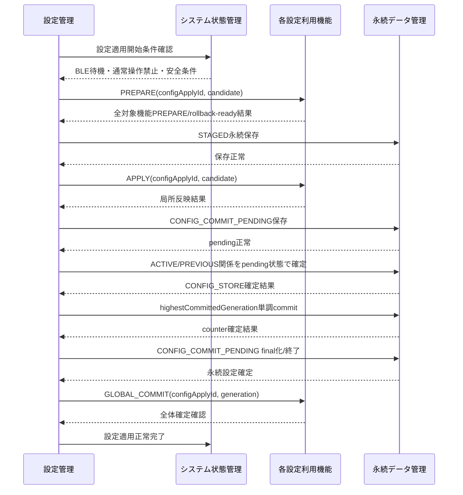

# Tank_Robot 設定管理基本設計

## 目次

1. 本書の目的
2. 設計方針と適用範囲
3. 責任分界と共通条件
4. 設定データモデルと論理スロット
5. 設定パッケージ共通形式
6. schemaVersion 1の設定項目と分類
7. generation・重複・巻戻し防止
8. VPSからの設定取得とSTAGED管理
9. 正当性・完全性検証との連携
10. 構文・意味・機能固有検証
11. 起動時読込みと代替設定選択
12. 新設定の適用開始条件
13. 設定適用トランザクション
14. 各機能とのPREPARE・APPLY・GLOBAL_COMMIT契約
15. 適用失敗・切戻し・部分適用防止
16. STAGED設定の保留・置換・破棄
17. 工場出荷設定と工場出荷状態への初期化
18. OTA更新・ファームウェア互換性との連携
19. システム状態・電源・省電力・終了処理との連携
20. 設定異常・復旧・通常操作禁止
21. 状態表示・ログ・診断
22. 実行時間・固定資源・排他方針
23. 検証方針と確認ケース
24. 主対象要求との対応
25. 設計判断・後続事項
26. 他文書へのフィードバック
27. 初版の自己確認結果と引継ぎ条件

---

## 1. 本書の目的

### 1.1 目的

本書の目的は、公開用システム要求仕様「13. 設定管理」を実現するため、VPSから取得する管理設定について、取得から検証、保存、適用、確定、切戻し、起動時読込みおよび工場出荷設定への復元までの基本方式を、詳細設計へ展開可能な粒度まで具体化することである。

### 1.2 対象範囲

本書は、Tank_Robot本体で使用するVPS管理設定について、設定パッケージ、schemaVersion、generation、取得後の候補管理、暗号学的検証との連携、意味検証、起動時読込み、適用条件、複数機能への一括適用、切戻し、工場出荷設定、設定異常および関連機能との責任分界を具体化する。

設定管理は、各機能固有の固定安全値、機構校正、製造情報、利用者がBLEで登録するWi-Fi認証情報およびVPS接続用秘密情報を一つの管理設定へ混在させない。VPS管理設定として遠隔変更を許可する項目だけを、一つの設定パッケージとして扱う。

#### 基本設計と詳細設計の区分

本書で定める設定項目、許容範囲、generation規則、適用・切戻し条件、時間上限および電源断時の回復方針は、利用者・関連機能から見た振る舞いを決める基本設計で定める事項とする。実機評価で変更が必要となった場合は詳細設計だけで値・方式を変更せず、本書または値を管理する担当基本設計へ評価結果をフィードバックして正式値を更新する。JSON parser内部表現、固定バッファ配置、task、event ID、排他実装等、外部振る舞いを変更しない実装方法は詳細設計で具体化してよい。

### 1.3 上位文書・関連文書

本書の主対象要求は公開用システム要求仕様「13. 設定管理」とし、関連する公開用要求および完成済み基本設計について、設定管理との責任分界・適用条件・設定項目の管理元の確認に必要な範囲を参照する。

`20_要求仕様`および`30_コア要求仕様`は本書の上位要求として使用しない。公開用要求で未確定の方式について本書で具体化する場合は、本書の設計判断として明示する。

関連基本設計との整合確認結果を本書へ反映する。後続基本設計で具体化されたHMAC canonical byte列、永続データの媒体分離・原子的更新、Device IDの正式な管理元、bootInstanceId、OTA互換性等が本書の外部振る舞いを具体化している場合は、その確定内容を本書でも使用する。

#### 1.3.1 上位文書

- [`docs/00_project_overview/01_製品目的・製品目標.md`](../../../00_project_overview/01_製品目的・製品目標.md)
- [`docs/10_requirements/13. 設定管理.md`](<../../../40_公開用システム要求仕様/13. 設定管理.md>)
- [`docs/20_basic_design/00_Tank_Robot 基本設計について.md`](<../../00_Tank_Robot 基本設計について.md>)
- [`docs/20_basic_design/02_システムアーキテクチャ/Tank_Robotシステムアーキテクチャ.md`](../../02_システムアーキテクチャ/Tank_Robotシステムアーキテクチャ.md)

#### 1.3.2 関連するシステム要求仕様

- [`docs/10_requirements/02. システム状態管理.md`](<../../../40_公開用システム要求仕様/02. システム状態管理.md>)
- [`docs/10_requirements/03. 電源・省電力管理.md`](<../../../40_公開用システム要求仕様/03. 電源・省電力管理.md>)
- [`docs/10_requirements/07. 走行制御.md`](<../../../40_公開用システム要求仕様/07. 走行制御.md>)
- [`docs/10_requirements/08. 砲塔・砲身制御.md`](<../../../40_公開用システム要求仕様/08. 砲塔・砲身制御.md>)
- [`docs/10_requirements/09. 停止・緊急停止.md`](<../../../40_公開用システム要求仕様/09. 停止・緊急停止.md>)
- [`docs/10_requirements/10. バッテリー・電気安全.md`](<../../../40_公開用システム要求仕様/10. バッテリー・電気安全.md>)
- [`docs/10_requirements/12. VPS接続・デバイス認証.md`](<../../../40_公開用システム要求仕様/12. VPS接続・デバイス認証.md>)
- [`docs/10_requirements/14. ログ・診断.md`](<../../../40_公開用システム要求仕様/14. ログ・診断.md>)
- [`docs/10_requirements/15. OTA更新.md`](<../../../40_公開用システム要求仕様/15. OTA更新.md>)
- [`docs/10_requirements/17. 異常検出・復旧.md`](<../../../40_公開用システム要求仕様/17. 異常検出・復旧.md>)
- [`docs/10_requirements/18. 永続データ管理.md`](<../../../40_公開用システム要求仕様/18. 永続データ管理.md>)
- [`docs/10_requirements/20. セキュリティ管理.md`](<../../../40_公開用システム要求仕様/20. セキュリティ管理.md>)
- [`docs/10_requirements/21. 状態表示・利用者通知.md`](<../../../40_公開用システム要求仕様/21. 状態表示・利用者通知.md>)

#### 1.3.3 関連する基本設計

- [`docs/20_basic_design/03_機能別基本設計/01_システム状態管理/Tank_Robotシステム状態管理基本設計.md`](../01_システム状態管理/Tank_Robotシステム状態管理基本設計.md)
- [`docs/20_basic_design/03_機能別基本設計/04_異常管理/異常管理基本設計.md`](../04_異常管理/異常管理基本設計.md)
- [`docs/20_basic_design/03_機能別基本設計/05_電源・省電力管理/電源・省電力管理基本設計.md`](../05_電源・省電力管理/電源・省電力管理基本設計.md)
- [`docs/20_basic_design/03_機能別基本設計/06_バッテリー・電気安全監視/バッテリー・電気安全監視基本設計.md`](../06_バッテリー・電気安全監視/バッテリー・電気安全監視基本設計.md)
- [`docs/20_basic_design/03_機能別基本設計/07_走行制御/走行制御基本設計.md`](../07_走行制御/走行制御基本設計.md)
- [`docs/20_basic_design/03_機能別基本設計/08_砲塔・砲身制御/砲塔・砲身制御基本設計.md`](../08_砲塔・砲身制御/砲塔・砲身制御基本設計.md)
- [`docs/20_basic_design/03_機能別基本設計/12_VPS接続・デバイス認証/VPS接続・デバイス認証基本設計.md`](../12_VPS接続・デバイス認証/VPS接続・デバイス認証基本設計.md)
- [`docs/20_basic_design/03_機能別基本設計/14_ログ・診断/ログ・診断基本設計.md`](../14_ログ・診断/ログ・診断基本設計.md)
- [`docs/20_basic_design/03_機能別基本設計/15_OTA更新/OTA更新基本設計.md`](../15_OTA更新/OTA更新基本設計.md)
- [`docs/20_basic_design/03_機能別基本設計/16_永続データ管理/永続データ管理基本設計.md`](../16_永続データ管理/永続データ管理基本設計.md)
- [`docs/20_basic_design/03_機能別基本設計/17_セキュリティ管理/セキュリティ管理基本設計.md`](../17_セキュリティ管理/セキュリティ管理基本設計.md)
- [`docs/20_basic_design/03_機能別基本設計/18_製品情報管理/製品情報管理基本設計.md`](../18_製品情報管理/製品情報管理基本設計.md)
- [`docs/20_basic_design/04_インターフェース・通信/Tank_Robotインターフェース・通信基本設計.md`](../../04_インターフェース・通信/Tank_Robotインターフェース・通信基本設計.md)

### 1.4 用語

| 用語 | 本書での意味 |
| --- | --- |
| 管理設定 | VPS上でシステム管理者・開発者が管理し、本体で遠隔変更を許可した設定 |
| 設定パッケージ | 一回の配信・検証・適用単位となる管理設定全体 |
| `schemaVersion` | 設定パッケージの構造・項目定義の互換性版 |
| `generation` | 同一Device IDに対する管理設定の新旧を識別する単調増加番号 |
| `highestCommittedGeneration` | 本体で一度でもACTIVEとして正常確定したgenerationの最大値。現在使用する設定の適用元がPREVIOUS/FACTORYへ変わっても、この値を小さくしない |
| FACTORY | 署名済みファームウェア・製品プロファイル側に保持する工場出荷設定 |
| ACTIVE | 現在正常に確定しているVPS設定パッケージ |
| PREVIOUS | ACTIVEの直前に正常確定していたVPS設定パッケージ |
| STAGED | 正常受信・検証済みだが、まだACTIVEとして確定していない候補設定。適用待ち中はRAM上候補として保持でき、APPLY開始前の永続取引では永続データ管理のSTAGED_AREAへ保存する |
| 現在使用する設定 | 現在各機能が実際に使用している設定。ACTIVE、PREVIOUSまたはFACTORYのいずれか |
| `configApplyId` | 一回の設定適用・切戻しを相関するuint32識別子 |
| `CONFIG_AUTH_BYTES_V1` | セキュリティ管理で定める、schemaVersion 1のHMAC計算用の正規化バイト列。JSONの表記差に左右されないよう、設定値を所定の符号化方式で正規化する |
| `CONFIG_COMMIT_PENDING` | CONFIG_STOREと`highestCommittedGeneration`が別の論理データ集合・媒体に保存されることを前提とする、永続的な確定待ち状態。複数のデータ集合にまたがる設定確定処理を、電源断後も一意に復旧するために用いる |
| PREPARE | 各機能が状態を変更せず候補設定を受入れ可能か、かつ必要時に変更前に使用していた設定へ安全に切戻し可能かを検証する段階 |
| APPLY | 各機能が候補設定を局所反映するが、全体確定前として通常操作に使用しない段階 |
| GLOBAL_COMMIT | 全機能反映と永続設定確定後、同一generationを正式設定として使用開始する通知 |
| ROLLBACK | 全体確定前の失敗時に、各機能を適用前に使用していた設定へ戻す処理 |

---

## 2. 設計方針と適用範囲

### 2.1 基本方針

設定管理は次の原則で設計する。

1. VPS管理設定を一つの設定パッケージとして扱い、初期製品で機能別の独立配信・部分更新を行わない。
2. schemaVersionごとに定義したREMOTE_MANAGED項目は全て含む完全snapshotとし、必須項目の省略を「変更しない」という意味に使用しない。
3. 管理設定と、製造・校正・秘密情報・利用者ローカル設定を分離する。
4. ACTIVE、PREVIOUS、STAGEDおよび上書き不能なFACTORYを論理的に区別する。
5. 新設定は、正当性・完全性・構文・意味・機能固有安全条件のすべてを確認してから候補とする。
6. 各機能のPREPAREをすべて成功させ、局所反映および切戻しが可能であることを確認してからAPPLYを開始する。
7. 設定適用中は通常操作を禁止し、部分適用状態を正常状態として外部へ公開しない。
8. RAM上STAGED候補、永続STAGED、局所APPLY、CONFIG_STORE確定、`highestCommittedGeneration`確定、GLOBAL_COMMITを分ける。CONFIG_STOREと巻戻し防止counterを一つの物理原子書込みと仮定せず、`CONFIG_COMMIT_PENDING`を用いた順序付き複数dataset取引で電源断後も一意に復旧する。
9. 設定管理が各機能固有の安全上限を勝手に緩和しない。最終値域・安全条件は各機能の局所validatorの判断に従う。
10. generationの巻戻しを禁止し、過去内容へ戻す運用では、同じ内容を新しいgenerationとしてVPSから再配信する。
11. highestCommittedGenerationをeffective generationとは分離し、ACTIVE破損・PREVIOUS fallback・FACTORY fallback・工場初期化だけで小さくしない。
12. HMAC検証はセキュリティ管理で定める`CONFIG_AUTH_BYTES_V1`に従い、JSON member順、空白、改行または数値文字列表現を認証結果へ影響させない。
13. 安全停止、緊急停止、電気安全処置、異常処置、終了処理を設定適用より優先する。

### 2.2 対象範囲

本書は次を対象とする。

- VPS管理設定パッケージの構造
- schemaVersion、packageId、generation、targetDeviceId
- 設定パッケージ最大容量・構文上限
- ACTIVE、PREVIOUS、STAGED、FACTORYの論理管理
- highestCommittedGenerationによる巻戻し防止
- VPS取得済み設定の候補化・保留・破棄
- セキュリティ機能によるHMAC検証との連携
- `CONFIG_COMMIT_PENDING`を用いる複数dataset永続確定・電源断復旧
- グローバル検証・機能固有検証
- 起動時設定選択
- BLE接続待機状態での一括適用
- PREPARE／APPLY／GLOBAL_COMMIT／ROLLBACK
- 工場出荷設定への復元
- 設定異常、ログ、診断、状態通知
- OTA更新時の設定互換性確認

### 2.3 対象外

次は本書の管理設定対象外とする。

- Wi-Fi SSID、Wi-Fi passphraseその他の所有者がBLEで登録するWi-Fi接続設定
- Device ID、VPS接続先、デバイス証明書、デバイス秘密鍵、trust anchor
- BLE操作端末長期認証鍵、所有者復旧情報
- ファームウェア署名検証鍵、SecurityGen
- 走行安全プロファイルに属する最大走行出力、加減速率、方向反転条件、中立判定値、走行固有過負荷・拘束しきい値・時間
- 砲塔・砲身の校正値`p0/p1000`、ハードウェアPWM絶対範囲、製造・保守校正値
- バッテリー・電流・温度センサの校正係数
- ファームウェア固定安全しきい値およびハードウェア固定保護値
- 開発・評価専用の短縮タイマ・試験用設定

これらを通常のVPS設定パッケージへ含めて変更可能にしない。

---

## 3. 責任分界と共通条件

### 3.1 関連機能との責任分界

| 機能 | 主な責任 |
| --- | --- |
| 設定管理 | パッケージ構造、generation、候補管理、全体検証、適用取引、複数dataset永続確定の意味・順序、一括確定、切戻し、effective source |
| VPS接続・デバイス認証 | 認証済みHTTPSによる設定パッケージ取得、通信結果、受信完全性 |
| セキュリティ | `K_CONFIG_MAC`、`CONFIG_AUTH_BYTES_V1`、HMAC-SHA-256検証、`highestCommittedGeneration`のstate MAC、秘密鍵保護 |
| 永続データ管理 | CONFIG_STORE各logical slotとcritical counterをそれぞれ原子的に保存し、`CONFIG_COMMIT_PENDING`等の設定管理所有metadataを保持して電源断復旧可能な結果を返す。全dataset共通distributed transaction managerは持たない |
| 製品情報管理 | Device ID、製品・hardware profileの正式な管理 |
| ログ・診断 | `bootInstanceId`の正式な管理、設定イベントの共通ログ保存、容量、VPS送信、診断参照 |
| システム状態管理 | 設定適用開始可能状態、BLE接続待機、通常操作禁止／再開の最終判断 |
| 各設定利用機能 | 自機能設定項目の意味、型・単位・安全値域、相互条件、局所反映、局所切戻し |
| 異常管理 | 設定異常の影響度、通常操作可否、復旧可否・復旧権限 |
| OTA更新 | 対象ファームウェアと設定・永続データ互換性、更新開始判断 |
| 状態表示・利用者通知 | effective source、代替設定、設定異常・適用結果の具体表示 |

### 3.2 各機能固有validatorを必須とする

設定管理はJSON schemaだけで安全な値と判断しない。

各設定利用機能は、候補設定について少なくとも次を返す。

- 対象項目を認識できるか
- 型・単位・範囲を使用可能か
- 現在製品・ハードウェア・校正プロファイルと互換か
- 設定項目間の機能固有整合が成立するか
- 現在ファームウェアで解釈可能か
- PREPARE可能か
- APPLY後、GLOBAL_COMMIT前に通常利用へ公開せず保持可能か
- 同一`configApplyId`で適用前に使用していた設定へ安全にROLLBACK可能か
- 反映後に通常動作を再開可能か

設定管理は、対象機能のvalidatorを迂回して候補設定を確定しない。

### 3.3 管理設定から安全上限を拡大しない

バッテリー・電気安全監視がファームウェア固定安全値・ハードウェア固定安全値として定めるしきい値は、設定パッケージで緩和しない。

走行制御の走行安全・性能設定は初期製品ではREMOTE_MANAGEDにせず、評価済みFACTORY／ファームウェア・製品profileを正式な設定の基準とする。設定パッケージで最大走行出力、加減速、反転条件、中立判定または走行固有過負荷・拘束条件を変更しない。

砲塔・砲身制御の機構・校正・PWM絶対範囲も、管理設定の値で拡大しない。

管理設定で変更できる値は、各機能が定義する安全包絡内で、通常値を安全側または評価済み範囲内へ調整できるものに限定する。

---

## 4. 設定データモデルと論理スロット

### 4.1 論理スロット

設定管理は次の4種類を区別する。

| スロット | 内容 | VPS更新 | 通常使用 |
| --- | --- | --- | --- |
| FACTORY | 製品・ハードウェア構成について評価済みの工場出荷設定 | 不可 | ACTIVE/PREVIOUS使用不能時に使用可能 |
| ACTIVE | 現在正常に確定したVPS設定 | 直接上書きせず新generation取引で更新 | 第1候補 |
| PREVIOUS | ACTIVE直前の正常VPS設定 | ACTIVE確定時に更新 | ACTIVE使用不能時の第2候補 |
| STAGED | 受信・検証済み未確定候補 | 新しい候補で置換可能 | 通常操作へ使用禁止 |

FACTORYはVPS設定更新によって上書き・消去しない。

### 4.2 effective source

現在実際に各機能へ提供している設定の出所を次で識別する。

- `EFFECTIVE_ACTIVE`
- `EFFECTIVE_PREVIOUS`
- `EFFECTIVE_FACTORY`
- `EFFECTIVE_NONE`

ACTIVEパッケージが永続領域に存在していても、検証失敗によってPREVIOUSを使用中の場合は`EFFECTIVE_PREVIOUS`とする。

### 4.3 管理情報

各VPS設定スロットは少なくとも次を管理する。

| 項目 | 型 | 意味 |
| --- | --- | --- |
| `packageId` | 128 bit / 32桁lowercase hex | 設定パッケージ識別子 |
| `schemaVersion` | uint16 | JSON schema互換性 |
| `generation` | uint32 | 設定新旧。0はVPS設定に使用しない |
| `targetDeviceId` | ASCII 36 byte | 製品情報管理の現在Device ID |
| `payloadLength` | uint16 | UTF-8 JSON全体長 |
| `payloadDigest` | SHA-256(`CONFIG_AUTH_BYTES_V1`) | 同一意味内容確認・診断用。HMACの代替ではない |
| `receivedBootInstanceId` | uint64 | ログ・診断の`bootInstanceId`。候補を受信した起動単位 |
| `verificationState` | enum | 未検証／正常／失敗 |
| `applyState` | enum | 未適用／適用中／正常／失敗／切戻し済み |

`highestCommittedGeneration`はスロットとは別に、永続データ管理のcritical monotonic metadataとして管理し、セキュリティ管理の`K_SEC_STATE_MAC`認証対象とする。

複数datasetをまたぐ設定確定には、少なくとも`configApplyId`、旧ACTIVE/PREVIOUS参照、新候補参照、新generationおよび永続確定段階を含む`CONFIG_COMMIT_PENDING`を使用する。具体record layoutは永続データ管理の詳細設計で定めてよいが、第13章の復旧意味を変更しない。

永続データ上の具体配置・冗長化方式は永続データ管理基本設計で定める。

### 4.4 FACTORYの扱い

FACTORYは通常のVPS設定パッケージと同じgeneration系列へ含めない。

`source=FACTORY`として識別し、VPS generation 0を「工場出荷設定の過去世代」として扱わない。

FACTORYの具体値は署名済みファームウェアまたは当該ファームウェアと不可分の製品プロファイルに保持し、現在の製品・ハードウェア構成に対応するものだけを使用する。

---

## 5. 設定パッケージ共通形式

### 5.1 JSON基本形式

初期製品の設定パッケージはUTF-8 JSONとする。

schemaVersion 1の例を次に示す。

```json
{
  "packageId": "0123456789abcdef0123456789abcdef",
  "schemaVersion": 1,
  "generation": 42,
  "targetDeviceId": "TR1-0123456789abcdef0123456789abcdef",
  "settings": {
    "power": {
      "longIdleMinutes": 10
    },
    "electricalWarnings": {
      "batteryLowWarningMv": 7200,
      "batteryLowTempWarningC": 5,
      "batteryHighTempWarningC": 45,
      "motorDriverHighTempWarningC": 70
    }
  },
  "auth": {
    "algorithm": "HMAC-SHA-256",
    "keyId": "cfg-mac-1",
    "tag": "BASE64URL_VALUE"
  }
}
```

schemaVersion 1では上記5つのREMOTE_MANAGED設定項目を完全snapshotとしてすべて必須とする。

設定項目の一部を省略して「既存値を維持する」という部分更新方式を使用しない。

### 5.2 必須top-level項目

| 項目 | 必須 | 条件 |
| --- | --- | --- |
| `packageId` | 必須 | 32桁lowercase hex |
| `schemaVersion` | 必須 | 初期値1 |
| `generation` | 必須 | uint32、1以上 |
| `targetDeviceId` | 必須 | 製品情報管理の現在Device IDと完全一致 |
| `settings` | 必須 | schemaVersionに定義された全REMOTE_MANAGED項目 |
| `auth` | 必須 | `algorithm=HMAC-SHA-256`、初期製品で許可した`K_CONFIG_MAC`識別、tag |

未知のtop-level項目またはschemaVersion 1で定義されていない設定group・leafを暗黙に無視しない。

### 5.3 サイズ・構文上限

初期製品では次を基本設計値とする。

| 項目 | 上限 |
| --- | ---: |
| 設定パッケージ全体 | 16 KiB |
| JSON nesting depth | 6 |
| leaf設定項目数 | 128 |
| object member数 | 128 |
| array element数 | 8 |
| key長 | 48 octet |
| 通常string値 | 64 octet |
| packageId | 32 octet固定 |
| Device ID | ASCII 36 octet固定 |

同一object内の重複keyを拒否する。

schemaVersion 1の設定値は定義済み整数型だけを許可し、小数、指数表現を意味値へ暗黙変換しない。NaN、Infinity、実装依存の数値表現、無効UTF-8を受け入れない。

### 5.4 JSON schemaの管理

`schemaVersion=1`を初期製品の最初のschemaとする。

既存各項目の意味、単位、安全方向を変更する場合、互換性を保てない変更を同じschemaVersionで行わない。

新しいREMOTE_MANAGED機能領域を追加する場合はschemaVersionを更新し、旧firmwareが新設定を部分解釈して適用しないようにする。

---

## 6. schemaVersion 1の設定項目と分類

### 6.1 設定項目の分類

設定項目を次の4区分で扱う。

| 区分 | 例 | VPS管理設定 |
| --- | --- | --- |
| REMOTE_MANAGED | 長時間未操作時間、評価済み安全範囲内の警告値 | 許可 |
| FIRMWARE_SAFETY_FIXED | 危険低電圧、通常操作継続不能温度、監視異常条件、走行安全・性能設定 | 禁止 |
| PRODUCT_CALIBRATION | サーボ校正端、センサ利得、ハードウェア版 | 禁止 |
| OWNER_LOCAL / PRODUCT_SECRET | Wi-Fi credential、Device秘密鍵等 | 禁止 |

### 6.2 schemaVersion 1の必須REMOTE_MANAGED項目

レビュー時点で、工場出荷値・管理設定範囲・安全方向が電源・省電力管理/バッテリー・電気安全監視基本設計で確定している次の5項目だけをschemaVersion 1に含める。

| JSON path | 型・単位 | 工場出荷値 | 許容範囲 | 制約 |
| --- | --- | ---: | --- | --- |
| `settings.power.longIdleMinutes` | uint8、min | 10 | 5～60、1分単位 | 0による省電力無効化不可 |
| `settings.electricalWarnings.batteryLowWarningMv` | uint16、mV | 7200 | 7200～7400、100 mV単位 | 低い方向へ変更不可 |
| `settings.electricalWarnings.batteryLowTempWarningC` | int8、℃ | 5 | 5～10、1 ℃単位 | 低い方向へ変更不可 |
| `settings.electricalWarnings.batteryHighTempWarningC` | int8、℃ | 45 | 40～45、1 ℃単位 | 高い方向へ変更不可 |
| `settings.electricalWarnings.motorDriverHighTempWarningC` | int8、℃ | 70 | 60～70、1 ℃単位 | 高い方向へ変更不可 |

電源・省電力管理およびバッテリー・電気安全監視の局所validatorを最終受入れ判定に使用する。

上記の工場出荷値・許容範囲は電源・省電力管理/バッテリー・電気安全監視が所有する基本設計値であり、本書が独自に別値を持つものではない。電源・省電力管理/バッテリー・電気安全監視の実機評価で正式値・範囲が変更された場合は、詳細設計だけを変更せず本書のschemaVersion 1定義・FACTORY値・VPS側schemaを同時に更新する。

### 6.3 電気安全の固定値を管理設定へ入れない

バッテリー・電気安全監視がファームウェア固定安全値として持つ通常操作継続不能値、危険値、保護継続時間、復旧条件、監視異常条件をschemaVersion 1へ含めない。

ハードウェア保護しきい値、ヒューズ定格、センサ校正値も管理設定へ含めない。

### 6.4 砲塔・砲身設定

砲塔・砲身制御では、機構・校正・評価済み限界と運用設定の組合せを局所確認する契約が必要とされている。一方、`V[2]=100 units/s`、`A[2]=2000 units/s²`等は砲塔・砲身制御が所有する評価確定待ちの基本設計値であり、評価完了前にVPS変更可能な正式運用範囲として扱わない。

このためschemaVersion 1では砲塔・砲身のREMOTE_MANAGED項目を含めない。

砲塔・砲身制御の実機評価後、REMOTE_MANAGEDを本当に必要とする運用項目、正式factory valueおよび評価済み変更範囲を砲塔・砲身制御/設定管理の基本設計として確定した場合にだけ、新schemaVersionとして追加する。

その際も`hardwareProfileId`、`mechanismRevision`、`servoVariantId[2]`、`calibrationRevision`を製品情報管理・砲塔・砲身制御が本体内で管理する正式な値と照合し、`p0/p1000`、`pHardwareMin/Max`、校正値およびPWM絶対安全範囲をVPS設定によって変更しない。

### 6.5 走行設定

公開用システム要求仕様「07. 走行制御」では、最大走行出力、加速、減速、方向反転、中立判定および過負荷・拘束判定に関する設定が要求されている。

走行制御基本設計では、これらを走行安全プロファイルに属する安全・性能設定として具体化したうえで、**初期製品ではREMOTE_MANAGEDにしない**方針を確定している。正式値は実機評価によって決定し、評価済みFACTORY／ファームウェア・製品profileから走行制御へ提供する。

したがってschemaVersion 1では`settings.drive`を受け付けず、走行制御完成を理由としてschemaVersion 1へ走行項目を追加しない。最大走行出力、加速・減速率、方向反転零保持時間、中立判定、走行固有過負荷・拘束しきい値・時間等をVPS管理設定によって変更可能にしない。

将来、運用上REMOTE_MANAGEDが必要となる走行項目を追加する場合は、正式factory value、評価済み変更範囲、安全方向、走行制御の局所validatorおよび固定安全上限との分離を改めて基本設計し、既存schemaVersion 1の意味を変更せず新schemaVersionとして追加する。

### 6.6 その他の設定

操作指令タイムアウトその他の通信・安全性能値、BLE通信値、Wi-Fi接続設定、VPS接続情報、秘密情報をschemaVersion 1へ含めない。

操作指令タイムアウトの具体値は停止・緊急停止管理が所有し、設定管理が過去の暫定値をREMOTE_MANAGED項目として復活させない。

後続基本設計でREMOTE_MANAGED化が必要となった場合、既存schemaを部分的に拡張するのではなくschemaVersion管理のもと追加する。

---

## 7. generation・重複・巻戻し防止

### 7.1 generation形式

`generation`はJSON integerで表現可能なuint32とし、範囲を1～4294967294とする。0および4294967295を通常配信に使用しない。

VPSは同一Device IDに対し、新しい管理設定内容を配信するたびにgenerationを増加させる。

### 7.2 巻戻し判定の基準

新候補の新旧判定は、現在使用している設定のgenerationではなく`highestCommittedGeneration`を基準とする。

ACTIVEが破損してPREVIOUSまたはFACTORYを使用していても、過去に正常確定した最大generationを小さくしない。

`G_floor=highestCommittedGeneration`とし、受信した候補設定の世代を`G_new`とする。

| 条件 | 処理 |
| --- | --- |
| 一度もVPS設定を正常確定していない | `G_new >= 1`を候補化可能 |
| `G_new > G_floor` | 新候補として検証 |
| `G_new == G_floor`かつ、現在の正常なACTIVEとpackageId・`payloadDigest`が一致 | 重複取得として扱い、保存も適用も行わない |
| `G_new == G_floor`で、正常なACTIVEとの同一性を確認できない | 世代の競合として拒否し、VPSへ新しいgenerationの発行を要求する |
| `G_new < G_floor` | 過去の世代への巻戻しとして拒否する |

`payloadDigest`はraw JSON byte列ではなく`CONFIG_AUTH_BYTES_V1`のSHA-256とし、JSON member順・空白等の表記差によって同一意味内容を別digestにしない。

### 7.3 過去内容へ戻す運用

過去に使用した設定内容へ戻したい場合、過去パッケージのgenerationをそのまま再配信しない。

VPS上で当該内容を新しいパッケージとして生成し、highestCommittedGenerationより大きい新generationを付与する。

### 7.4 highestCommittedGenerationの保護

highestCommittedGenerationは、次によって小さくしない。

- ACTIVE破損
- PREVIOUS fallback
- FACTORY fallback
- 再起動・電源再投入
- 工場出荷状態への初期化

工場初期化後にVPS管理設定を再適用する場合も、VPSはhighestCommittedGenerationより新しいgenerationを発行する。

セキュリティ管理に従い`highestCommittedGeneration`は`K_SEC_STATE_MAC`認証対象とし、永続データ管理のMRAM critical monotonic metadataへ保持する。CRCが正常でもstate MACを検証できない値を巻戻し判定へ使用しない。

CONFIG_STOREのACTIVE/PREVIOUSは外付けSerial NOR、`highestCommittedGeneration`はMRAM critical側であるため、両者を単一物理書込みで原子的に更新できるとは仮定しない。第13章の`CONFIG_COMMIT_PENDING`順序により整合させる。

### 7.5 wraparound

uint32上限近傍を通常運用で到達させない。

上限到達時にgenerationを0または小さい値へ自動resetしない。generation体系を変更する場合はschema／製品設計を改訂する。

---

## 8. VPSからの設定取得とSTAGED管理

### 8.1 取得主体

設定管理はVPS接続・デバイス認証へ設定取得要求を行い、VPS接続・デバイス認証から完全受信済みの設定パッケージと通信結果を受け取る。

設定管理がDA16200MOD、TCPまたはHTTPを直接操作しない。

VPS接続・デバイス認証は設定パッケージ上限16 KiBを事前に知り、Content-Length等から上限超過を判定できる場合は全量受信前に打ち切る。

### 8.2 取得と適用を分離する

設定パッケージの取得・検証は、VPS通信が許可される状態で実行できる。

新設定の適用は第12章の安全条件が成立するまで開始しない。

操作可能状態で新設定を受信しても、設定適用だけを理由として走行・砲塔操作を強制終了しない。候補を論理STAGEDとして現在起動中のRAMに保留し、自然にBLE接続待機状態へ移行した後に適用する。

### 8.3 STAGED化条件

次をすべて満たした場合だけ論理STAGED候補とする。

1. VPS接続・デバイス認証が受信完全を報告している。
2. 全体サイズが16 KiB以下である。
3. JSON構文・schema構造検証が正常である。
4. packageId、schemaVersion、generation、targetDeviceIdが形式上妥当である。
5. 第9章の正当性・完全性検証が正常である。
6. 第7章のgeneration判定に合格する。
7. schemaVersion 1の5項目すべてが存在し、未知設定がない。
8. 第10章の全体意味検証および対象機能validatorに合格する。

### 8.4 RAM上STAGEDと永続STAGEDの境界

適用条件成立待ちの論理STAGED候補は、現在起動中のRAMに保持することを基本とする。通常終了・再起動をまたいで再利用するために永続化しない。

第13章で全対象機能PREPAREが成功し、APPLYへ進む直前に、同じ`configApplyId`、packageId、generation、`receivedBootInstanceId`へ対応する候補を永続データ管理のSTAGED_AREAへ原子的に保存する。この永続STAGEDは設定適用取引と電源断復旧のための一時datasetであり、再起動後に自動適用する保留queueではない。

STAGEDをACTIVEとして各機能へ提供しない。STAGEDが存在しても現在使用している設定を変更しない。

状態表示または診断では「新設定待機中」を識別できるが、通常操作機能がSTAGED値を参照しない。

---

## 9. 正当性・完全性検証との連携

### 9.1 セキュリティ管理が定める鍵管理・暗号演算方式

設定管理はHMAC-SHA-256の鍵管理・暗号演算方式を重複実装しない。

セキュリティ管理に従い、設定データMAC鍵`K_CONFIG_MAC`は本体ごとに異なる256 bit HMAC-SHA-256 keyとし、他用途の秘密鍵と共用しない。本体ではRSIP HMAC Wrapped Keyとして使用する。

### 9.2 `CONFIG_AUTH_BYTES_V1`

schemaVersion 1のHMAC入力は、セキュリティ管理で確定したversioned canonical byte列`CONFIG_AUTH_BYTES_V1`を使用する。

論理encodingは次とする。

1. ASCII domain separator `TR1-CONFIG-HMAC-V1\0`
2. `packageId`：32桁hexをdecodeした16 byte
3. `schemaVersion`：uint16 big-endian
4. `generation`：uint32 big-endian
5. `targetDeviceIdLength`：uint8
6. `targetDeviceId`：製品情報管理のDevice IDのASCII byte列
7. `settingCount`：uint16 big-endian
8. schemaVersion 1の全設定項目を固定settingId昇順で連結

各設定項目は、`settingId:uint16 big-endian`、`valueType:uint8`、`valueLength:uint16 big-endian`、canonical value byte列で表現する。整数はschemaで符号有無・byte幅を固定してbig-endianとし、schemaVersion 1では浮動小数点を使用しない。

JSON objectのkey順、空白、改行、数値文字列表現および`auth` object自体はHMAC入力へ含めない。JSON parse後の意味値からcanonical byte列を再構築する。

固定settingIdの具体値および各項目のオフセットは詳細設計で一つに固定してVPSと本体で同じschema sourceを使用してよいが、上記canonical構造、認証対象項目またはdomain separatorを詳細設計だけで変更しない。

### 9.3 HMAC検証

設定管理は第10章の構造検証でcanonical byte列を安全に生成可能と確認した後、`CONFIG_AUTH_BYTES_V1`と受信`auth.tag`をセキュリティ管理へ渡す。

セキュリティ管理はWrapped `K_CONFIG_MAC`でHMAC-SHA-256を検証し、少なくともMATCH／MISMATCH／KEY_UNAVAILABLE／CANONICALIZATION_ERROR相当を返す。

`auth.algorithm`は`HMAC-SHA-256`だけを受け付ける。`auth.keyId`は初期製品で許可された`K_CONFIG_MAC`識別に限定し、受信値によって任意の別用途鍵を選択しない。

HMAC検証失敗、MAC鍵利用不能、keyId非対応、認証対象生成不能のいずれも候補設定へ使用しない。現在ACTIVE／現在使用する設定を変更しない。

セキュリティ事象・設定異常として必要情報を異常管理およびログ・診断へ提供する。

---

## 10. 構文・意味・機能固有検証

### 10.1 検証段階

候補設定は次の順で検証する。

1. byte長・UTF-8・JSON構文・duplicate key
2. top-level必須項目、各fieldの基本型・長さ・整数表現
3. 対応schemaVersionと、そのschemaでcanonical化するために必要な完全な設定field集合・未知field不存在
4. `CONFIG_AUTH_BYTES_V1`生成とSecurity HMAC検証
5. targetDeviceIdが製品情報管理の現在Device IDと一致
6. generationの巻戻し・重複・conflict判定
7. 本書で定義する共通値域・単位
8. 各機能固有validator
9. 機能間相互条件
10. 現在ファームウェア・製品profileとの互換性

非対応schemaやcanonical化不能な未知構造をHMAC処理へ渡さない。一方、値域・安全条件・generation受入れ等の意味判断をHMAC成功前の正当性判断として使用しない。

### 10.2 暗黙補正禁止

範囲外値を上限・下限へclampして受け入れない。

非対応enumをdefaultへ読み替えない。

未知項目を無視して一部だけ適用成功としない。

### 10.3 機能間整合

代表的な整合条件は次とする。

- バッテリー・電気安全監視の警告値が固定安全値を越えて安全性を低下させない。
- 低消費電力時間を0にして省電力を無効化しない。
- schemaVersionと現在ファームウェアの対応表が一致する。
- 対象Device IDが製品情報管理の自機Device IDと一致する。

### 10.4 validator結果

各機能のvalidator結果を次で区別する。

- `ACCEPT`
- `REJECT_RANGE`
- `REJECT_DEPENDENCY`
- `REJECT_PROFILE_MISMATCH`
- `REJECT_UNSUPPORTED`
- `REJECT_STATE`
- `ERROR`
- `NOT_APPLICABLE`

REJECTまたはERRORを一つでも含む候補を適用しない。

---

## 11. 起動時読込みと代替設定選択

### 11.1 起動時処理

起動時は次の順で現在使用する設定を選択する。

1. 永続データ管理から`highestCommittedGeneration`、CONFIG_STORE metadata、`CONFIG_COMMIT_PENDING`有無、ACTIVE／PREVIOUS候補を取得する。
2. セキュリティ管理による`highestCommittedGeneration`のstate MAC検証を含め、巻戻し防止状態を確認する。
3. `CONFIG_COMMIT_PENDING`が存在する場合は11.2の中断復旧を先に完了または安全側へ確定する。
4. `highestCommittedGeneration`を正常確認できる場合だけ、ACTIVE／PREVIOUSをVPS管理設定候補として使用する。
5. ACTIVEの保存完全性、HMAC、schema、targetDeviceId、generation、意味整合を再確認する。
6. ACTIVEが使用可能なら各機能へ起動用PREPAREを要求し、正常なら`EFFECTIVE_ACTIVE`とする。
7. ACTIVEが使用不能ならPREVIOUSを同じ基準で検証する。
8. PREVIOUSが正常なら`EFFECTIVE_PREVIOUS`とする。
9. ACTIVE／PREVIOUSを使用できない場合、現在製品・ハードウェアに対応するFACTORYを検証する。
10. FACTORYが正常なら`EFFECTIVE_FACTORY`とする。
11. FACTORYも使用できない場合は`EFFECTIVE_NONE`とし、安全な通常操作を許可しない。
12. 使用source、generation、highestCommittedGenerationの利用可否、検証結果をシステム状態管理、異常管理、ログ・診断へ提供する。

`highestCommittedGeneration`の正当性を確認できない場合、過去のVPS設定がrollbackされていないことを保証できないためACTIVE／PREVIOUSを通常effectiveへ採用しない。安全なFACTORYを使用可能なら`EFFECTIVE_FACTORY`としてローカル基本動作を継続可能とし、新VPS設定の受入れを禁止して異常管理・利用者通知へ保守必要情報を提供する。FACTORYも使用できなければ通常操作を禁止する。

### 11.2 `CONFIG_COMMIT_PENDING`の起動時復旧

#### 未完了情報の役割と照合対象

`CONFIG_COMMIT_PENDING`は、未完了の設定確定処理を起動時に復旧するための情報である。
CONFIG_STORE側の設定保存枠の更新と、MRAM側の`highestCommittedGeneration`の更新を、一度の物理書込みで一体として完了できるとは仮定しない。

起動時は、次の情報を照合する。

- 未完了の設定確定処理の管理情報
- 更新前のACTIVE／PREVIOUSへの参照
- 新しい候補設定
- 未完了の設定確定処理が対象とする設定世代（以下、比較式では`pending generation`と表す）
- 現在の`highestCommittedGeneration`

#### 比較結果ごとの復旧処理

| 条件 | 使用する設定または処置 | 未完了情報の扱い |
| --- | --- | --- |
| `highestCommittedGeneration < pending generation`で、単調増加する世代値の更新が成立していないことを確認できる | 新しい候補設定をACTIVEとして公開せず、更新前のACTIVE／PREVIOUSの関係を復元または維持する | 状態を安全に一意化できた後、未完了情報を破棄する |
| `highestCommittedGeneration == pending generation`で、新しい候補設定と保存枠の関係を正常に検証できる | 当該世代のCONFIG_STOREの確定を、繰り返し実行しても結果が変わらない方法で完了する | 確定処理の完了後、未完了状態を終了する |
| `highestCommittedGeneration > pending generation`、管理情報の不整合、候補設定の破損、または確定段階を安全に一意化できない | 未完了の候補設定を推測して適用しない。代替設定と異常通知は、下記に従う | 管理情報や候補設定を根拠に、どの段階まで確定したかを推測しない |

#### 復旧を安全に確定できない場合

上表の3行目に該当し、ACTIVE／PREVIOUSを使用しても不正な巻戻しにならないことを確認できない場合は、工場出荷設定（FACTORY）への代替を優先する。
異常管理機能へ、`CONFIG_GENERATION_STATE_INVALID`相当を通知する。

`highestCommittedGeneration`が一度大きい値で正常確定した後は、未完了処理の復旧に失敗したことを理由として、小さい値へ戻さない。

### 11.3 ACTIVE異常時にPREVIOUSを使う意味

PREVIOUSを現在使用する設定として使用しても、破損ACTIVEが正常になったとは扱わない。

`effectiveSource=PREVIOUS`、`activeConfigFault=true`を区別して保持する。

highestCommittedGenerationをPREVIOUS generationへ下げない。

### 11.4 FACTORY fallback

ACTIVE・PREVIOUSが使用不能でFACTORYを使用した場合も、`effectiveSource=FACTORY`を明示する。

highestCommittedGenerationが正常ならその値を維持する。highestCommittedGeneration自体が使用不能な場合は値を推測生成・巻戻しせず、VPS設定更新禁止を併記する。

FACTORYが安全な通常動作に必要な全設定を含む場合は、異常管理の影響度判断を経て通常操作可能とできる。

### 11.5 STAGEDの起動時扱い

前回起動で未適用の永続STAGEDを再起動後に自動適用しない。

起動時に通常のSTAGED記録だけが存在する場合は未確定候補として破棄する。ただし`CONFIG_COMMIT_PENDING`に結び付くSTAGEDは11.2の中断復旧が完了するまで勝手に破棄しない。

必要な新設定は次回VPS通信で再取得する。

---

## 12. 新設定の適用開始条件

### 12.1 必須条件

STAGEDの通常適用は次をすべて満たした場合だけ開始する。

- システム状態がBLE接続待機状態である。
- 左右DCモータが停止している。
- 走行駆動出力が禁止または無効である。
- 砲塔・砲身が動作していない。
- サーボPWM再開を伴う処理が進行中でない。
- 通常のアクチュエータ操作受付が禁止されている。
- 設定保存を安全に完了できる電源条件が成立している。
- 緊急停止・異常・終了・低消費電力移行その他の優先処理が進行中でない。
- STAGEDの検証結果が現在も有効である。
- 各対象機能がPREPARE可能かつ必要時ROLLBACK可能である。
- 永続データ管理が設定トランザクションを開始可能である。

### 12.2 操作可能状態で適用しない

操作可能状態へ動的適用しない。

設定適用のためだけに利用者の通常操作を強制中断しない。適用は次回BLE接続待機状態まで保留する。

### 12.3 条件喪失

適用開始前に条件を失った場合はSTAGEDを維持し、適用を開始しない。

PREPARE完了後、最初のAPPLY前に条件を失った場合はPREPARE状態を解除して保留へ戻す。

APPLY開始後の条件喪失は第15章の切戻しまたは優先処理連携へ移る。

---

## 13. 設定適用トランザクション

### 13.1 全体原則

設定適用を一つの`configApplyId`で管理する。

同一時点に複数の設定適用トランザクションを実行しない。

### 13.2 適用シーケンス



### 13.3 コミット点

設定管理が設定パッケージ全体の更新を確定する時点は、次をすべて満たした時点とする。

1. 全対象機能のPREPARE成功とrollback-ready確認
2. STAGED永続保存成功
3. 全対象機能のAPPLY正常完了
4. `CONFIG_COMMIT_PENDING`正常保存
5. CONFIG_STOREのACTIVE/PREVIOUS関係が新candidateに対応して正常確定
6. `highestCommittedGeneration`が新generationへstate MAC付きで正常確定
7. pending transactionが永続確定済みとしてfinalizeされ、起動時に一意に復旧可能
8. 各機能へのGLOBAL_COMMIT通知完了

8まで完了する前に新設定を「現在有効」と診断・表示へ報告しない。

### 13.4 複数データ集合の永続確定順序

永続データ管理機能は、CONFIG_STOREと`highestCommittedGeneration`を、別の論理データ集合・別の記憶媒体として扱う。
このため、両者を一つの物理的な書込み処理として更新することは要求しない。設定管理機能が、設定全体を確定するための処理順序を管理する。

#### 正常時の確定手順

1. 更新前のACTIVE／PREVIOUSへの参照、新しいSTAGED、新しい設定世代、`configApplyId`を含む`CONFIG_COMMIT_PENDING`を、先に永続化する。
2. CONFIG_STORE内で、旧ACTIVEをPREVIOUS、新STAGEDを新ACTIVE候補とする保存枠の関係を原子的に確定する。ただし、未完了情報が残る間は、設定管理上の最終確定は未完了とする。
3. 新ACTIVE候補を読み戻し、HMAC、設定世代および保存枠の関係を再確認する。
4. セキュリティ管理機能が提供する状態保護用MAC（state MAC）を用いて、MRAM側の`highestCommittedGeneration`を、新しい設定世代へ単調増加する形で確定する。
5. 世代値の確定成功を確認した後、CONFIG_STORE側の未完了処理を永続確定済みとして終了する。
6. その後にGLOBAL_COMMITへ進む。

#### ステップ4より前に失敗が確定した場合

新しい設定世代を正式化しない。
可能であれば、保存枠の関係を更新前に戻し、実行中の各機能が使用する設定をROLLBACKする。

#### ステップ4が成功した後

`highestCommittedGeneration`を旧値へ戻さない。

#### ステップ4以後の電源断・最終確定処理の失敗

ステップ4以後に電源断、または未完了処理を終了するための最終確定処理の失敗が発生した場合は、第11.2節の起動時復旧に従う。
新しい設定世代の確定を、繰り返し実行しても結果が変わらない方法で完了する。

安全に完了できない場合は、同節の条件に従ってPREVIOUS／FACTORYの代替設定を使用する場合でも、確定済み設定世代の下限を維持する。
ここでいう下限は、第7章の巻戻し判定に使用する`highestCommittedGeneration`を指す。実際に使用する設定が変わっても、この値を小さくしない。

### 13.5 GLOBAL_COMMIT

各機能はAPPLY成功だけでは、通常操作へ新generationの設定使用可能を公開しない。

GLOBAL_COMMITを受けて、同一`configApplyId`・generationに対応する局所設定を正式使用可能とする。

砲塔・砲身制御等、設定変更により旧動作の再開が危険となる機能では、GLOBAL_COMMIT時に旧目標・旧開始確認を新設定へ引き継がない。

---

## 14. 各機能とのPREPARE・APPLY・GLOBAL_COMMIT契約

### 14.1 共通要求

設定対象機能は少なくとも次の論理要求を受け付ける。

| 要求 | 目的 | 状態変更 |
| --- | --- | --- |
| `CFG_PREPARE` | 候補値・profile・現在状態・rollback可能性を検証 | なし |
| `CFG_APPLY` | 候補値を局所反映し、全体確定待ちへ入る | あり。通常利用禁止 |
| `CFG_GLOBAL_COMMIT` | 全体永続確定後に新設定を正式化 | あり |
| `CFG_ROLLBACK` | 適用前に使用していた設定へ戻す | あり |
| `CFG_ABORT_PREPARE` | PREPAREのみを取消す | なし |

### 14.2 共通相関情報

各要求・結果には少なくとも次を含める。

- configApplyId
- packageId
- generation
- 対象設定group
- 要求種別
- 結果
- 拒否・失敗理由
- 局所設定generation

### 14.3 PREPARE

PREPAREではハードウェア出力、タイマ設定、アクチュエータ目標、現在使用している設定を変更しない。

必要な型・範囲・依存・profile照合に加え、候補APPLY後に変更前に使用していた設定を再提示された場合に同一`configApplyId`でROLLBACK可能であることを確認する。

APPLYで不可逆なpersistent migration、校正書換え、秘密情報更新その他のROLLBACK不能処理が必要な候補は、初期製品の通常設定適用としてPREPARE成功にしない。

PREPARE結果を別generation・別configApplyIdへ流用しない。

### 14.4 APPLY

APPLY中、各機能は旧設定と新設定を混在させて通常操作を許可しない。

設定値のコピー・内部係数再計算・タイマ再初期化等を行い、局所反映結果を返す。

APPLY段階で各機能が独自に新generationを永続ACTIVE化したり、ROLLBACK不能な副作用を確定したりしない。設定パッケージ全体の永続確定は第13章の設定管理transactionだけが所有する。

### 14.5 ROLLBACK

ROLLBACKは同一configApplyIdのAPPLY済み機能だけに要求する。

各機能は適用前に使用していた設定または設定管理から再提示された旧設定を使用して局所状態を復元し、結果を返す。

rollback後に旧操作指令や旧アクチュエータ目標を自動再開しない。

---

## 15. 適用失敗・切戻し・部分適用防止

### 15.1 PREPARE失敗

一つでもPREPAREが失敗した場合、APPLYへ進まない。

現在使用している設定を維持する。

### 15.2 APPLY途中失敗

一つ以上の機能へAPPLYした後に失敗した場合、設定管理は次を行う。

1. 以降の未APPLY機能へ新設定を反映しない。
2. APPLY済み機能へ逆順でROLLBACKを要求する。
3. 全ROLLBACK結果を確認する。
4. 全機能で変更前に使用していた設定を復元できた場合だけ設定適用失敗として安全に終了する。
5. 一つでもrollback失敗・不明がある場合、設定整合不明として通常操作禁止を要求し、異常管理へ通知する。

### 15.3 永続確定途中の失敗

全機能でAPPLYが成功した後でも、次のいずれかに失敗した場合、新設定を正常に確定したとは扱わない。

- `CONFIG_COMMIT_PENDING`の保存
- CONFIG_STOREの保存枠の関係の確定
- `highestCommittedGeneration`の更新確定
- 未完了処理を永続確定済みとして終了する最終確定処理

失敗した段階と、結果を確認できるかによって、次のように処理する。

| 条件 | 処理 |
| --- | --- |
| `highestCommittedGeneration`の更新前に失敗が確定 | 可能な範囲でCONFIG_STOREの保存枠の関係を更新前へ戻し、各機能を変更前に使用していた設定へROLLBACKする |
| 保存結果が成功か失敗かを確認できない | 通常操作を再開しない。永続データ管理による読み戻しと、起動時復旧と同じ判定規則により、どの段階まで完了したかを一意に確認する |
| `highestCommittedGeneration`の更新成功後、最終確定処理に失敗、または結果を確認できない | 設定世代の下限を旧値へ戻さない。実行中の新設定を通常利用可能とはせず、異常管理へ通知する。第11.2節に従い、新しい世代を確定するか、安全な代替設定へ移行する |

### 15.4 GLOBAL_COMMIT失敗

永続設定確定後に一部機能のGLOBAL_COMMIT結果を確認できない場合、永続ACTIVEやhighestCommittedGenerationを旧generationへ巻き戻さない。

設定全体のランタイム整合を確認できないため通常操作禁止とし、異常管理へ設定適用後処理異常を通知する。

再起動等の復旧が許可された場合、起動時に永続ACTIVEを正式な設定として全機能へ再ロードする。

### 15.5 部分適用禁止

一部機能だけ新generationで通常動作し、他機能が旧generationで通常動作する状態を正常状態として確定しない。

各機能の診断情報には現在局所generationを含め、設定管理は全機能のgeneration一致を確認可能とする。

---

## 16. STAGED設定の保留・置換・破棄

### 16.1 保留条件

検証済み論理STAGEDは、適用条件がまだ成立しない間、現在起動中のRAMで保留できる。

保留中にACTIVE/現在使用する設定を変更しない。

### 16.2 新候補取得時

STAGED保留中に別候補を取得した場合は次とする。

- より大きいgenerationで正常検証済みなら旧STAGEDを破棄し、新候補へ置換できる。
- 同一generation・同一packageId・同一`payloadDigest`なら重複としてno-op。
- 同一generationで異内容または異packageIdならconflictとして拒否。
- highestCommittedGeneration以下の過去candidateは第7章に従って拒否。

### 16.3 STAGED破棄条件

次の場合、STAGEDを自動適用せず破棄する。

- 正常適用完了
- 適用失敗により候補自体が不正と判定
- より新しいcandidateへ置換
- 工場出荷状態への初期化
- 通常終了・再起動
- 現在ファームウェア変更によって互換性を再確認できない
- Securityが候補の正当性を失効または不明と判定

ただし`CONFIG_COMMIT_PENDING`に結び付く永続STAGEDは、pending復旧を完了する前に単純破棄しない。

再起動後に通常の前回STAGEDを自動適用しない。

---

## 17. 工場出荷設定と工場出荷状態への初期化

### 17.1 FACTORYの要件

FACTORYは対象製品・ハードウェア構成について安全性を確認済みであることを前提とする。

走行制御の最大走行出力、加減速率、方向反転条件、中立判定、走行固有過負荷・拘束条件、および砲塔・砲身制御の速度・加速度等について、評価確定待ちの基本設計値を評価未完了のまま正式工場出荷値へ昇格させない。

製品baseline確定時に、各機能の評価済みfactory valueをFACTORY／ファームウェア・製品profileへ固定する。走行制御の走行安全・性能値は初期製品のVPS設定パッケージではなく、この評価済みprofileから供給する。

### 17.2 VPS更新からの保護

通常のVPS設定パッケージでFACTORYを上書き・削除しない。

VPSから工場出荷設定そのものを変更するAPIを初期製品へ設けない。

### 17.3 工場出荷状態への初期化

所有者・操作端末管理の工場初期化シーケンスから設定管理へPREPARE要求を受けた場合、次を返す。

- ACTIVE/PREVIOUS/STAGEDが削除・無効化対象であること
- FACTORYは保持対象であること
- highestCommittedGenerationは巻戻し防止情報として保持対象であること
- 消去可能性・処理中状態

所有者・操作端末管理の`RESET_PENDING`確定後に、永続データ管理へVPS管理設定スロットの無効化を要求する。設定適用の`CONFIG_COMMIT_PENDING`が残存している場合は、工場初期化の不可逆消去へ進む前に通常設定利用を禁止し、所有者・操作端末管理のRESET_PENDINGを最上位の回復取引として扱う。

正常完了後、effective sourceをFACTORYへ切り替える準備を行う。システム全体の工場初期化完了は所有者・操作端末管理が確定する。

工場初期化後にVPS管理設定を再適用する場合、VPSは保持されたhighestCommittedGenerationより新しいgenerationを発行する。

### 17.4 所有者再登録

同一所有者の所有者端末再登録だけを理由としてACTIVE/PREVIOUS設定またはhighestCommittedGenerationを変更しない。

---

## 18. OTA更新・ファームウェア互換性との連携

### 18.1 起動時互換性

設定パッケージのschemaVersionを、現在実行中ファームウェアが解釈・安全適用可能であることを確認する。

### 18.2 OTA開始前の情報提供

OTA更新へ少なくとも次を提供する。

- 現在のeffective source
- ACTIVE schemaVersion/generation
- highestCommittedGeneration
- PREVIOUS利用可否
- FACTORY profileのschema互換情報
- 設定異常有無
- `CONFIG_COMMIT_PENDING`有無

OTA更新側は対象ファームウェアの設定互換性情報と照合し、更新開始可否を判断する。設定永続確定がpending中のままOTA開始へ進まない。

### 18.3 OTA後起動

新ファームウェア起動後、ACTIVEが非対応schemaとなった場合はPREVIOUSを盲目的に使用せず、同じ新ファームウェアで各候補を検証する。

ACTIVE、PREVIOUSのいずれも非対応でFACTORYだけが新ファームウェアと整合する場合はFACTORY fallbackを使用できる。

OTA更新成功そのものを設定パッケージgeneration更新理由としない。

### 18.4 互換性の安全側処理

設定互換性を確認できないまま通常操作を許可しない。

設定fallbackを使用した場合はOTA機能・ログ・診断へその事実を提供する。

---

## 19. システム状態・電源・省電力・終了処理との連携

### 19.1 システム状態管理

システム状態管理が設定適用開始可否および通常操作禁止を最終判断する。

設定管理が独自のシステム状態を追加しない。

### 19.2 低消費電力移行

設定適用が未開始でRAM上STAGED保留中の場合、低消費電力移行を妨げず、STAGEDを安全に破棄して移行する。

APPLY開始後は、ランタイム設定整合を確保するため、可能な範囲でROLLBACKまたは第13章の永続確定のいずれかの安全な境界まで処理し、その結果を電源・省電力管理へ返す。

`highestCommittedGeneration`を含む永続確定が開始済みの場合、単純なRAM rollbackだけで処理済みとせず、`CONFIG_COMMIT_PENDING`の段階を一意にしてから低消費電力移行可否を返す。

安全・電源異常による強制処理を設定整合処理より遅延させない。

### 19.3 通常終了・再起動

PREPARE前またはRAM上STAGED保留だけなら候補を破棄して終了可能とする。

APPLY途中なら切戻しを試行し、終了処理へ正常終了可能／設定整合不明を返す。永続確定段階へ入っている場合はpending情報を保持し、次回起動で11.2により一意に復旧可能な状態を確保する。

再起動後は第11章に従ってpending復旧後にACTIVE/PREVIOUS/FACTORYを再選択し、RAM上の途中反映を継続しない。

### 19.4 緊急停止・安全停止

設定処理中でも緊急停止・安全停止要求の受付・実行を阻害しない。

設定適用がBLE接続待機＋アクチュエータ安全状態に限定されていても、異常発生時の安全処理を設定トランザクション完了待ちにしない。

---

## 20. 設定異常・復旧・通常操作禁止

### 20.1 設定異常分類

少なくとも次を区別する。

- CONFIG_RECEIVE_INCOMPLETE
- CONFIG_OVERSIZE
- CONFIG_JSON_INVALID
- CONFIG_SCHEMA_UNSUPPORTED
- CONFIG_DEVICE_MISMATCH
- CONFIG_HMAC_FAILED
- CONFIG_GENERATION_ROLLBACK
- CONFIG_GENERATION_CONFLICT
- CONFIG_REQUIRED_ITEM_MISSING
- CONFIG_UNKNOWN_ITEM
- CONFIG_RANGE_INVALID
- CONFIG_CROSS_FIELD_INVALID
- CONFIG_PROFILE_MISMATCH
- CONFIG_FIRMWARE_INCOMPATIBLE
- CONFIG_STAGE_SAVE_FAILED
- CONFIG_PREPARE_FAILED
- CONFIG_APPLY_FAILED
- CONFIG_COMMIT_PENDING_FAILED
- CONFIG_SLOT_COMMIT_FAILED
- CONFIG_HIGHEST_GENERATION_COMMIT_FAILED
- CONFIG_COMMIT_RECOVERY_FAILED
- CONFIG_ROLLBACK_FAILED
- CONFIG_GLOBAL_COMMIT_UNCONFIRMED
- CONFIG_ACTIVE_CORRUPT
- CONFIG_PREVIOUS_CORRUPT
- CONFIG_FACTORY_UNUSABLE
- CONFIG_GENERATION_STATE_INVALID

### 20.2 影響度

新candidateだけの異常で現在使用している設定が正常な場合、現在設定を維持し、設定更新失敗として管理できる。

ACTIVE異常でも、正常な`highestCommittedGeneration`のもとでPREVIOUSまたはFACTORYを安全に使用できる場合は、代替設定使用中として異常管理へ情報を提供する。

安全に使用できる設定を一つも確立できない場合、通常操作を許可しない。

`highestCommittedGeneration`の正当性・state MAC・巻戻し防止状態を確認できない場合、ACTIVE／PREVIOUSの新旧を安全に保証できないためVPS設定をeffectiveへ採用せず、新VPS設定受入れも停止する。安全なFACTORYを検証できる場合だけFACTORYでのローカル動作可否を異常管理へ提示し、保守必要状態を通知する。

### 20.3 異常管理へ提供する情報

少なくとも次を提供する。

- 異常種別
- packageId、schemaVersion、generation（取得可能な範囲）
- effective source/generation
- highestCommittedGenerationまたはその利用不能状態
- CONFIG_COMMIT_PENDING有無・永続確定段階
- 失敗段階
- 対象機能group
- validator／永続／切戻し結果
- 通常操作可能性
- 代替設定利用可否
- 推奨復旧方式

### 20.4 自動的な安全値生成を行わない

不正設定を検出したとき、その場で「安全そうな値」を算出して新しい設定パッケージを生成しない。

正常に信頼できるACTIVE／PREVIOUSまたは署名済みFACTORYという定義済み候補だけを使用する。

---

## 21. 状態表示・ログ・診断

### 21.1 状態表示・利用者通知へ提供する状態・処理結果

少なくとも次を提供する。

- 現在使用する設定の取得元
- effective generation
- STAGED有無
- 設定適用中
- 設定永続確定中／中断復旧中
- 設定適用失敗
- PREVIOUS fallback中
- FACTORY fallback中
- 設定異常による通常操作制限
- generation管理異常によるVPS設定更新禁止

一般利用者へ設定内容の全項目を表示することは必須としない。

### 21.2 ログ対象

少なくとも次をイベントとしてログ・診断へ提供する。

- 設定取得開始・結果
- packageId/schemaVersion/generation
- HMAC検証結果
- generation reject/conflict
- global validation結果
- 機能別PREPARE結果
- STAGED保存結果
- APPLY開始・機能別結果
- CONFIG_COMMIT_PENDING開始・復旧結果
- ACTIVE/PREVIOUS slot確定結果
- highestCommittedGeneration更新結果
- 永続設定finalize結果
- GLOBAL_COMMIT結果
- ROLLBACK開始・機能別結果
- 起動時ACTIVE/PREVIOUS/FACTORY選択結果
- 工場出荷設定復元
- 設定異常

設定データMAC鍵、秘密情報またはHMAC tag全体を通常ログへ出力しない。

### 21.3 開発・保守診断

開発・保守者が少なくとも次を確認できるようにする。

- effective source
- ACTIVE packageId/schemaVersion/generation
- PREVIOUS packageId/schemaVersion/generation
- RAM／永続STAGED packageId/schemaVersion/generation
- highestCommittedGenerationまたは利用不能状態
- CONFIG_COMMIT_PENDING状態・configApplyId
- 各候補の検証結果
- 最終apply result
- 最終rollback result
- 各機能の局所generation
- factory profile識別子

---

## 22. 実行時間・固定資源・排他方針

### 22.1 基本時間

設定取得通信時間を除き、設定管理内部処理の基本上限を次とする。

| 処理 | 個別基本上限 |
| --- | ---: |
| JSON構文＋共通検証 | 100 ms |
| HMAC検証連携 | 500 ms |
| 全機能PREPARE | 1 s |
| STAGED永続保存 | 1 s |
| 全機能APPLY | 2 s |
| 永続設定確定（pending→CONFIG_STORE→highestGeneration→finalize） | 1 s |
| GLOBAL_COMMIT確認 | 500 ms |
| 設定適用トランザクション全体 | 10 s |
| rollback全体 | 5 s |

全体10 sは個別処理の累積、scheduler遅延および後処理余裕を含むhard upper boundとする。

安全処理による中断は上記時間を待たない。

上記時間値は評価確定待ちを含む設定管理が所有する基本設計値であり、実機評価で成立しない場合は詳細設計だけで延長せず本書へ結果を反映する。

### 22.2 固定資源

初期製品では次を基本上限とする。

- 設定package buffer：16 KiB以下
- JSON parser token／node：最大256個
- 設定leaf項目：最大128
- RAM上STAGED候補：1件
- 永続STAGED：1件
- ACTIVE：1件
- PREVIOUS：1件
- CONFIG_COMMIT_PENDING：1件
- 同時configApplyId：1件
- 対象機能group：最大16

標準`malloc/free`へ依存せず、固定長bufferまたは初期化時確保資源を使用する。

### 22.3 排他

設定適用中またはCONFIG_COMMIT_PENDING復旧中に別generationの設定適用を開始しない。

同じ設定groupを別経路から変更する管理機能を初期製品へ設けない。

Wi-Fi接続設定等、本書の対象外データは別トランザクションとして管理し、設定管理のACTIVE generationへ混在させない。

---

## 23. 検証方針と確認ケース

### 23.1 基本検証ケース

| ID | 確認内容 | 期待結果 |
| --- | --- | --- |
| T-01 | 正常schemaVersion1 package | STAGED化可能 |
| T-02 | 16 KiB超 | 受信・候補化拒否 |
| T-03 | JSON重複key | 拒否 |
| T-04 | HMAC不正 | ACTIVE変更なし |
| T-05 | Device ID不一致／36 byte形式不正 | 拒否 |
| T-06 | generation低下 | rollback reject |
| T-07 | ACTIVEと同generation・同packageId・同canonical digest | no-op |
| T-08 | 同generation・異内容または異packageId | conflict reject |
| T-09 | unknown schema | reject |
| T-10 | schema1の5項目の一つを欠落 | package全体reject |
| T-11 | schema1へ未知設定groupを追加 | package全体reject |
| T-12 | `longIdleMinutes=0` | reject |
| T-13 | `longIdleMinutes=5/60` | boundary accept |
| T-14 | バッテリー・電気安全監視の警告値の安全方向境界 | バッテリー・電気安全監視のvalidatorと一致 |
| T-15 | バッテリー・電気安全監視の固定危険値をpackageへ追加 | forbidden/unknown reject |
| T-16 | 砲塔groupをschema1へ送信 | unsupported reject |
| T-17 | `settings.drive`または走行制御の走行安全・性能設定をschema1へ送信 | unsupported/unknown reject。VPS変更不可 |
| T-18 | 操作可能状態でcandidate取得 | RAM上STAGED保留、動的適用しない |
| T-19 | BLE待機＋安全状態 | APPLY開始可能 |
| T-20 | PREPARE一機能拒否／rollback不能 | APPLYなし、旧設定維持 |
| T-21 | APPLY途中失敗 | APPLY済み機能rollback |
| T-22 | rollback全成功 | 旧effectiveへ復帰 |
| T-23 | rollback一部失敗 | 通常操作禁止＋異常管理への通知 |
| T-24 | 永続確定がhighestGeneration更新前に失敗 | 新設定未確定、旧effectiveへrollback／pending復旧 |
| T-25 | GLOBAL_COMMIT不明 | generationを戻さず通常操作禁止、再同期必要 |
| T-26 | ACTIVE破損/PREVIOUS正常 | PREVIOUS fallback、highestGeneration維持 |
| T-27 | ACTIVE/PREVIOUS破損/FACTORY正常 | FACTORY fallback、highestGeneration維持 |
| T-28 | 全候補使用不能 | 通常操作禁止 |
| T-29 | 通常STAGED状態で再起動 | STAGED自動適用なし |
| T-30 | 工場初期化 | VPS設定無効化＋FACTORY保持＋highestGeneration保持 |
| T-31 | 所有者再登録 | VPS設定・highestGeneration維持 |
| T-32 | OTA後schema非互換 | fallbackまたは通常操作禁止 |
| T-33 | apply中緊急停止 | 安全処理優先、設定整合を後処理 |
| T-34 | 10秒適用上限超過 | apply失敗扱い |
| T-35 | 各機能局所generation不一致 | 正常操作再開不可 |
| T-36 | PREVIOUS fallback時に旧generationをVPS再配信 | highestGeneration以下として拒否 |
| T-37 | 走行制御の評価済み走行安全profileを使用して通常走行し、schema1の変更で当該profileが変化しない | 走行安全profile維持 |
| T-38 | JSONのmember順・空白・改行だけを変更し同じ意味値・正しいtagを使用 | `CONFIG_AUTH_BYTES_V1`が一致し正常検証 |
| T-39 | HMAC対象のpackageId/schemaVersion/generation/targetDeviceId/設定値の一つを改変 | HMAC mismatchで拒否 |
| T-40 | highestCommittedGenerationの状態保護用MACが不正 | ACTIVE/PREVIOUSを使用せず、FACTORYの利用可否を判定する。VPS設定更新は禁止する |
| T-41 | CONFIG_COMMIT_PENDINGで、巻戻し防止の下限値が未更新のまま再起動 | 新候補をACTIVEとして公開せず、更新前のACTIVE/PREVIOUS関係へ復旧する |
| T-42 | CONFIG_COMMIT_PENDINGで、巻戻し防止の下限値が更新済みの状態で再起動 | 同じgenerationの候補を検証し、永続保存の確定処理を冪等に完了する。下限値を戻さない |

### 23.2 電源断試験

少なくとも次の各点で電源断を行う。

- RAM上STAGED保留中
- 永続STAGED保存中
- 永続STAGED保存後／APPLY前
- APPLY中
- 全APPLY後／CONFIG_COMMIT_PENDING保存前
- CONFIG_COMMIT_PENDING保存直後
- CONFIG_STORE ACTIVE/PREVIOUS関係確定中／確定直後
- highestCommittedGenerationの保存確定の直前／直後
- 確定待ち状態の完了処理中／直後
- 永続確定後／GLOBAL_COMMIT前

再起動後は、永続データ管理／セキュリティ管理が返す正常な確定済みデータ集合、`CONFIG_COMMIT_PENDING`およびhighestCommittedGenerationを使い、第11章の規則に従って状態を一意に再構築する。RAM上で途中まで反映された状態を継続しないことを確認する。

---

## 24. 主対象要求との対応

| 公開用システム要求仕様「13. 設定管理」の要求 | 主対応章 |
| --- | --- |
| `SYS-CFG-001～003` | 4, 5, 7 |
| `SYS-CFG-010～011` | 7, 8 |
| `SYS-CFG-020～021` | 9, 10 |
| `SYS-CFG-030～033` | 11 |
| `SYS-CFG-040～041` | 12, 19 |
| `SYS-CFG-050～054` | 13, 14 |
| `SYS-CFG-060～062` | 15 |
| `SYS-CFG-070～071` | 7, 11, 13 |
| `SYS-CFG-080～081` | 3, 9 |
| `SYS-CFG-090～092` | 4, 17 |
| `SYS-CFG-100～102` | 20 |
| `SYS-CFG-110～112` | 21 |

公開用システム要求仕様「13. 設定管理」の全34要求へ主対応箇所を設定した。

### 24.1 公開用システム要求仕様「13. 設定管理」 第13.14節の具体化状況

| 項目 | 本書での扱い |
| --- | --- |
| 1. 具体的設定項目 | 6章。schema1の5項目を確定 |
| 2. 型・単位・値域・default・相互関係 | 6章。電源・省電力管理/バッテリー・電気安全監視が所有する値を使用 |
| 3. schemaVersion/generation形式 | 5, 7章 |
| 4. JSON schema | 5, 6章。HMAC canonicalは9章 |
| 5. 最大容量 | 5章、16 KiB |
| 6. 未適用設定管理・破棄 | 8, 16章 |
| 7. 適用順序 | 13, 14章 |
| 8. 適用最大時間・失敗判定 | 22章、10 s |
| 9. 切戻し方法 | 14, 15章 |
| 10. ログ項目 | 21章 |
| 11. ACTIVE/STAGED/PREVIOUS/FACTORY・pending | 4, 11, 13, 16, 17章 |
| 12. 過去内容を新generationで再配信 | 7章 |

---

## 25. 設計判断・後続事項

### 25.1 設計判断

| ID | 設計判断 |
| --- | --- |
| D-01 | 設定パッケージは一つのUTF-8 JSON完全snapshotを配信・適用単位とする |
| D-02 | schemaVersion初期値を1、generationをuint32単調増加とする |
| D-03 | packageIdは128 bit／32桁lowercase hexとする |
| D-04 | 設定パッケージ上限を16 KiBとする |
| D-05 | FACTORY／ACTIVE／PREVIOUS／STAGEDの4論理区分とする |
| D-06 | 適用待ちSTAGEDはRAM保持を基本とし、APPLY直前のtransaction用STAGEDだけを永続化する。通常STAGEDは再起動後に自動適用しない |
| D-07 | 全対象機能PREPARE成功とrollback-ready確認後にAPPLYを開始する |
| D-08 | APPLY後は、`CONFIG_COMMIT_PENDING`の保存、CONFIG_STOREの保存枠の関係の確定、highestCommittedGenerationの更新確定、未完了処理を永続確定済みとして終了する処理の順で進める。別媒体への保存を、一つの物理的な原子更新と仮定しない |
| D-09 | 部分APPLY失敗は逆順ROLLBACKする |
| D-10 | highestCommittedGenerationを巻戻し判定の基準とし、セキュリティ管理のstate MACで認証する |
| D-11 | 過去内容へ戻す場合も新generationでVPS再配信する |
| D-12 | 管理設定から固定安全値・校正値・秘密情報を変更させない |
| D-13 | schemaVersion1は完成済み電源・省電力管理/バッテリー・電気安全監視の5項目だけを必須REMOTE_MANAGEDとする |
| D-14 | 設定適用全体10 s、rollback5 sを基本上限とする |
| D-15 | 起動時は未完了処理の復旧と設定世代の下限値の検証後に、ACTIVE→PREVIOUS→FACTORYの順で選択する。下限値が不正な場合はREMOTE設定を使用せず、安全なFACTORYだけを候補とする |
| D-16 | 安全に使用できる設定がない場合は通常操作を禁止する |
| D-17 | 工場初期化でもhighestCommittedGenerationを保持する |
| D-18 | 走行制御の最大走行出力、加減速、方向反転、中立判定、走行固有過負荷・拘束条件は初期製品でREMOTE_MANAGEDにせず、評価済みFACTORY／ファームウェア・製品profileから供給する |
| D-19 | schemaVersion 1の設定HMACはセキュリティ管理で定める`CONFIG_AUTH_BYTES_V1`に従い、raw JSON表記差を認証対象へ持ち込まない |
| D-20 | targetDeviceIdは製品情報管理が提供するASCII 36 byte Device IDを使用し、STAGED受信起動相関にはログ・診断のuint64 `bootInstanceId`を使用する |

### 25.2 評価事項

| ID | 評価事項 |
| --- | --- |
| E-01 | 16 KiB JSONの解析時間・RAM・token数 |
| E-02 | `CONFIG_AUTH_BYTES_V1`生成＋Security HMAC検証時間 |
| E-03 | 永続STAGED、pending、CONFIG_STORE slot、highestCommittedGeneration、finalizeの各commit時間と10 s全体予算 |
| E-04 | 各機能PREPARE/APPLY/ROLLBACKの最悪時間 |
| E-05 | 10 s全体上限内に収まること |
| E-06 | 各電源断点から旧正常設定または新正常設定の一方へ一意に復旧できること |
| E-07 | バッテリー・電気安全監視の警告設定境界値で固定安全値を弱めないこと |
| E-08 | 砲塔・砲身制御の評価済みprofile確定後の砲塔REMOTE_MANAGED候補 |
| E-09 | OTA前後のschema互換／factory fallback |
| E-10 | 不正JSON・過大array・深いnest・duplicate keyに対する固定資源性 |
| E-11 | apply中の安全停止・終了・低消費電力競合 |
| E-12 | highestCommittedGenerationのstate MAC、電源断、pending復旧、工場初期化越し保持 |
| E-13 | 走行制御で実機評価して確定した走行安全・性能値がFACTORY／製品profileから再現可能で、VPS設定適用によって変化しないこと |

E-01～E-13は採用方式・基本設計値の成立性確認である。結果により設定項目、値域、時間上限または永続確定方式を変更する場合は、詳細設計だけで変更せず本書および値・方式を定める関連基本設計へ反映する。

### 25.3 詳細設計事項

- JSON parser実装およびtoken layout
- `CONFIG_AUTH_BYTES_V1`の固定settingId具体値・各項目のオフセット。canonical構造・認証対象意味はセキュリティ管理/設定管理基本設計を変更しない
- 永続領域のslot address／record形式／CRC・MACの物理layout
- `CONFIG_COMMIT_PENDING`の具体record layout・commit marker。ただし第11・13章の段階意味と回復規則は変更しない
- configApplyId採番実装
- 機能別API／event ID／task間同期
- packageId生成方法のVPS側実装
- 固定バッファの具体配置
- schemaVersion1の正式JSON Schemaファイル

---

## 26. 他文書へのフィードバック

### 26.1 F-01 走行制御

**反映内容・状況：** 走行制御基本設計は完成し、最大走行出力、加速、減速、方向反転、中立判定、走行固有過負荷・拘束判定を走行安全プロファイルとして管理する方式が確定した。走行制御は初期製品でこれらをREMOTE_MANAGEDにしないため、本書のschemaVersion 1へ`settings.drive`を追加しない。

正式値は走行制御の実機評価で確定し、FACTORY／ファームウェア・製品profileへ固定する。設定管理のCFG_PREPARE/APPLY/GLOBAL_COMMIT/ROLLBACK契約は、将来走行REMOTE_MANAGED項目を新schemaVersionとして追加する場合に適用する。現時点では走行安全profileをVPS設定トランザクションの対象へ含めない。

将来REMOTE_MANAGED化する場合は、正式factory value、管理可能範囲、安全方向、固定安全上限との分離および走行制御の局所validatorを改めて基本設計し、新schemaVersionとして追加する。

### 26.2 F-02 砲塔・砲身制御

砲塔・砲身制御の評価確定待ち基本設計値は砲塔・砲身制御が所有するままとし、実機評価後にREMOTE_MANAGEDを本当に必要とする運用項目と、その正式factory value・評価済み変更範囲を砲塔・砲身制御/設定管理基本設計として確定する。

100 units/s／2000 units/s²等を評価未完了のままVPS変更可能な工場出荷値へ自動昇格させない。

追加する場合はhardwareProfileId、mechanismRevision、servoVariantId、calibrationRevisionとの照合をPREPARE契約へ含め、新schemaVersionとする。

### 26.3 F-03 セキュリティ管理

セキュリティ管理で設定パッケージHMAC-SHA-256の`CONFIG_AUTH_BYTES_V1`、`K_CONFIG_MAC`およびhighestCommittedGenerationの`K_SEC_STATE_MAC`保護が確定済みであり、本書へ反映した。

詳細設計では固定settingId具体値等をVPSと本体で一つに固定するが、packageId、schemaVersion、generation、targetDeviceIdおよび全settings値を認証対象から外したり、raw JSON表記差へ依存する方式へ変更したりしない。

### 26.4 F-04 永続データ管理

永続データ管理の「複数datasetへ不可逆処理が必要な場合はデータ管理機能が永続pending状態を先に確定する」という原則を受け、本書が`CONFIG_COMMIT_PENDING`の意味と回復順序を所有する。

永続データ管理へ次を要求する。

- STAGED、ACTIVE/PREVIOUS関係、CONFIG_METAの各更新をCONFIG_STORE内で原子的にcommit可能にする。
- `highestCommittedGeneration`をMRAM critical側の独立monotonic datasetとして保存し、セキュリティ管理のstate MAC検証結果を扱えるようにする。
- CONFIG_STOREとMRAM counterを一つの物理transactionへ統合せず、設定管理のpending metadata・transactionCorrelationIdにより中断段階を再構築可能にする。
- pendingが存在する起動時に、新candidateを勝手にACTIVE昇格または単純破棄しない。
- 工場初期化では所有者・操作端末管理のRESET_PENDINGを最上位取引とし、ACTIVE/PREVIOUS/STAGEDを無効化する一方、highestCommittedGenerationを保持する。

### 26.5 F-05 VPS接続・デバイス認証／管理Webアプリ／製品情報管理

VPS側では、同一Device IDのgenerationを単調増加させ、同一generationへ異なる内容を再発行しない運用とする。

過去内容へ戻す場合も新しいgenerationのパッケージとして作成・配信する。

本体の設定最大サイズ16 KiBと、schemaVersion 1が5項目の完全snapshotであり`settings.drive`を含まないことをAPI制約へ反映する。

targetDeviceIdは製品情報管理が正式に管理するASCII 36 byte Device IDを使用する。

工場初期化後の再設定もhighestCommittedGenerationより新しいgenerationを発行する。

### 26.6 F-06 ログ・診断／状態表示

第21章の設定状態・結果を受け取り、具体ログ形式・表示を決める。

ログ・診断のuint64 `bootInstanceId`をSTAGED受信起動相関に使用し、設定管理独自の別幅boot IDを新設しない。

代替設定使用中、generation管理異常、pending復旧中および設定異常を区別する。

### 26.7 F-07 OTA更新

対象ファームウェアが現在ACTIVE schemaVersionを解釈可能か、FACTORY fallbackで安全に起動可能かをOTA開始判断へ反映する。

`CONFIG_COMMIT_PENDING`中は設定永続確定が未完了であるため、通常OTA開始条件へ進めない。

OTA後の設定fallbackをOTA成功・失敗評価と混同しない。

---

## 27. 初版の自己確認結果と引継ぎ条件

### 27.1 自己確認結果

初版作成後の走行制御フィードバックおよびレビュー時点の後続基本設計を反映し、次を確認した。

- 公開用システム要求仕様「13. 設定管理」の`SYS-CFG-001～003`、`010～011`、`020～021`、`030～033`、`040～041`、`050～054`、`060～062`、`070～071`、`080～081`、`090～092`、`100～102`、`110～112`の全34要求へ主対応箇所を設定した。
- 公開用システム要求仕様「13. 設定管理」 第13.14節の12具体化項目へ基本方式を設定した。
- 設定パッケージを一つの完全snapshotとし、初期製品へ機能別部分更新を持ち込んでいない。
- schemaVersion 1は、工場出荷値と管理設定範囲が電源・省電力管理/バッテリー・電気安全監視で確定している5項目だけを必須REMOTE_MANAGEDとした。
- 走行制御基本設計完成後も走行安全・性能設定をREMOTE_MANAGEDへ追加せず、評価済みFACTORY／ファームウェア・製品profileを正式な設定の基準とする方針へ確定した。
- 砲塔・砲身制御の評価確定待ち値をVPS変更可能な工場出荷値として扱わず、砲塔REMOTE_MANAGED化を必要時の新schemaVersionへ送った。
- ACTIVE／PREVIOUS／STAGED／FACTORYを分離し、適用待ちのSTAGEDと、設定確定処理に用いる永続保存されたSTAGEDの境界を明確化した。
- セキュリティ管理で確定済みの`CONFIG_AUTH_BYTES_V1`、`K_CONFIG_MAC`、`K_SEC_STATE_MAC`を本書へ反映し、HMAC計算用の正規化方式を未決定事項として残していない。
- targetDeviceIdは製品情報管理が提供するDevice IDと対応付けた。STAGEDを受信した起動の識別には、ログ・診断のuint64 `bootInstanceId`を用いる。
- 全機能のPREPAREと切戻し可能性の確認、APPLY、確定待ち状態を用いた永続保存の確定、GLOBAL_COMMITの順に進め、一部だけの適用を正常としない方式とした。
- 永続データ管理の媒体分離に合わせ、CONFIG_STOREとhighestCommittedGenerationを単一の物理的な原子操作で確定できるとは仮定しない。`CONFIG_COMMIT_PENDING`を用い、電源断で中断しても一意に復旧する方式とした。
- highestCommittedGenerationの正常確定後は、確定待ち状態からの復旧に失敗したことを理由に、世代の下限値を巻き戻さない方式とした。
- highestCommittedGenerationの正当性を確認できない場合は、ACTIVE/PREVIOUSを信頼せず、安全なFACTORYだけを候補とし、VPS設定更新を禁止する方針を明確化した。
- ACTIVE確定前の失敗では、変更前に使用していた設定へ切り戻す方式を維持した。永続保存の確定後にGLOBAL_COMMITの結果が不明となった場合は、generationを巻き戻さず、通常操作を禁止する。
- 起動時にACTIVEが破損していればPREVIOUSを、それも使用不能ならFACTORYを検証して使用する方式を維持した。
- 巻戻しは、現在使用している設定のgenerationではなくhighestCommittedGenerationを基準に判定する。代替設定を使用している場合も、過去のgenerationを新設定として再受入れしない。
- highestCommittedGenerationを工場初期化で消去しない方式とした。
- generation低下を拒否し、過去内容への復元も新generation配信とした。
- 電源・省電力管理の`T_LONG_IDLE`を10分、5～60分、1分単位として反映した。
- バッテリー・電気安全監視の管理設定可能な4警告値だけを遠隔変更対象とし、固定安全値・校正値を設定管理から変更しないようにした。
- 操作指令タイムアウトの具体値を停止・緊急停止管理の責任とし、過去の暫定250 msを設定項目として復活させないようにした。
- Wi-Fi credential、Device秘密鍵、VPS endpoint、校正値等をVPS管理設定へ混在させていない。
- 設定適用をBLE接続待機＋アクチュエータ安全状態へ限定した。
- 設定適用中も安全停止・緊急停止・電気安全処置を優先した。
- 工場初期化でVPS管理設定を無効化しFACTORYへ戻す一方、所有者再登録だけでは設定を削除しない責任分界とした。
- OTA更新前後のschema互換とfallback、および設定永続確定pending中のOTA開始禁止を設定管理の契約へ反映した。
- 設定適用トランザクション全体の10 s hard upper boundを基本設計で管理し、評価結果を基に確定する値として明確化した。

### 27.2 初版完了の判断

D-01～D-20の設定管理基本方式は本書で確定した。

E-01～E-13は採用方式・基本設計値の成立性を確認する評価事項であり、初版基本設計のユーザー判断待ち事項ではない。

F-01～F-07は既存または今後レビューする関連基本設計へ反映するフィードバックである。F-01の走行制御に関する管理区分、F-03のSecurity canonical方式、製品情報管理のDevice ID責任は本書へ反映済みである。

走行制御については初期製品でREMOTE_MANAGED項目を持たないことを確定した。砲塔の追加REMOTE_MANAGED項目は、砲塔・砲身制御の実機評価で必要性、正式値および安全変更範囲が確定し、かつREMOTE_MANAGED化すると基本設計で判断した場合に新schemaVersionとして追加する後続事項であり、設定管理のパッケージ、世代管理、適用・切戻しアーキテクチャを決定するうえでの未決定事項ではない。

現時点で、設定管理基本設計の初版完了を妨げるユーザー判断待ち事項は残していない。

---

**文書終端：全27章。基本方式は本書で確定し、実機評価事項および関連文書へのフィードバック事項は第25～27章に明記。**
