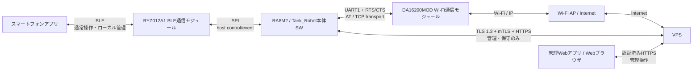
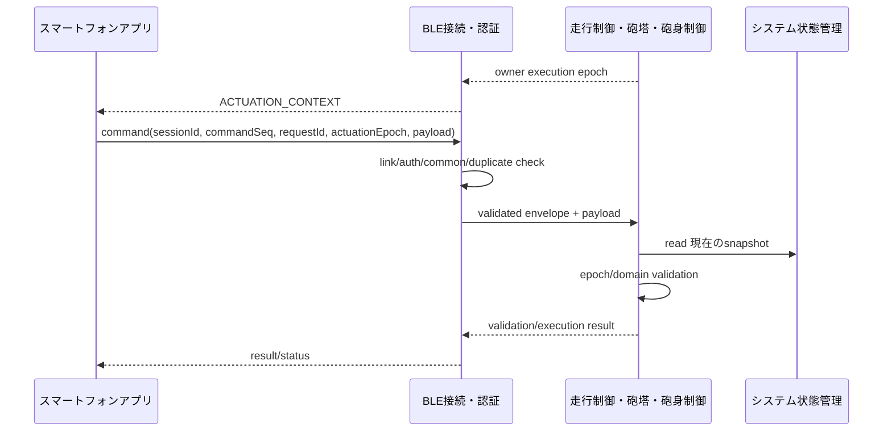

# Tank_Robot インターフェース・通信基本設計

## 目次

1. 本書の目的
2. 設計方針と適用範囲
3. インターフェース全体構成
4. インターフェースの分類と共通情報モデル
5. 識別子・世代・相関情報の共通規則
6. 要求・結果・重複・取消し・タイムアウトの共通規則
7. 状態・スナップショット・事象・時刻の共通規則
8. スマートフォンアプリ－Tank_Robot本体間BLEインターフェース
9. RA8M2－BLE通信モジュール間インターフェース
10. RA8M2－Wi-Fi通信モジュール間インターフェース
11. Tank_Robot本体－VPS間インターフェース
12. 管理Webアプリ－VPS間インターフェース
13. Tank_Robot本体内の機能間インターフェース
14. 通常操作・停止・緊急停止の横断インターフェース
15. 起動・終了・電源・低消費電力の横断インターフェース
16. 異常・復旧・システム監視の横断インターフェース
17. 設定・永続データ・ログ・OTA・時刻・セキュリティ・製品情報の横断インターフェース
18. ハードウェア信号・アクチュエータ・記憶デバイスのインターフェース方針
19. 優先度・時間性能・通信帯域・固定資源方針
20. 通信断・異常・縮退時の基本動作
21. 要求トレーサビリティ
22. 設計判断・後続事項
23. 他文書へのフィードバック
24. 初版の自己確認結果と引継ぎ条件

---

## 1. 本書の目的

### 1.1 目的

本書は、Tank_Robotの各基本設計で具体化したインターフェースを横断的に整理し、**「どの機能が情報の意味と更新を管理するか」「誰から誰へ何を渡すか」「要求・結果・状態・スナップショット・事象をどう区別するか」「識別子・世代・時刻をどう対応付けるか」「通信断・遅延・重複・確認不能時にどう扱うか」**を共通仕様として定義する。

### 1.2 対象範囲

本書は、Tank_Robotを構成する次の境界を対象とし、境界の両側を個別に詳細設計できるレベルの共通インターフェース仕様を定める。

- スマートフォンアプリとTank_Robot本体
- Tank_Robot本体とBLE通信モジュール
- Tank_Robot本体とWi-Fi通信モジュール
- Tank_Robot本体とVPS
- 管理WebアプリとVPS
- Tank_Robot本体内の主要機能間
- MCUと主要アクチュエータ、記憶デバイス、安全関連信号等

本書では、通信または連携する対象、目的、要求元・応答元、方向、通信・連携方式、メッセージまたはデータの種類、正常時の基本処理、タイムアウト・通信断・異常時の扱い、再送、優先順位および責任分界を定める。

個別のBLE GATT構成、Wi-FiモジュールのAT Command状態機械、VPSのHTTPS API、停止処理、設定適用、永続化等の機能固有仕様は、それぞれの機能別基本設計に従う。本書はそれらを再定義せず、複数機能・複数境界で共通して守るべきインターフェース契約を定める横断基本設計である。

本書で定める、情報種別、情報の意味と更新を管理する責任、識別子相関、再送・確認不能時の意味、外部通信の禁止用途、安全経路の優先、session/generation失効条件、bounded resource方針その他、機能間または外部から見た製品挙動を変える契約は基本設計で定める事項とする。実機評価で変更が必要となった場合は詳細設計だけで例外化せず、本書または当該連携規則を定める基本設計へ反映する。byte offset、C構造体、関数名、task/Process実装、mutex/critical section、driver API、pin/register等、基本設計の意味を変更しない内部実装は詳細設計で具体化してよい。ただしBLE接続・認証がBLE通信データ形式の基本設計として固定した共通header、fragment headerおよび`STATUS_SUMMARY_V1` 各項目のオフセット等は詳細設計で再定義しない。

詳細設計・実装・結合評価・実機評価は未完了。

### 1.3 上位文書・関連文書

本書は横断基本設計であり、単一の公開用システム要求仕様だけを主対象としない。上位要求として、[`04_Project/10_Tank_Robot/10_製品定義/02_製品目的・製品目標_公開用.md`](../../10_製品定義/02_製品目的・製品目標_公開用.md)および`40_公開用システム要求仕様/`の関連章を使用する。

`20_要求仕様`および`30_コア要求仕様`は上位要求として使用せず、公開用要求で削減・変更された機能を過去要求から復活させない。

#### 1.3.1 上位文書

- [`docs/00_project_overview/01_製品目的・製品目標.md`](../../../00_project_overview/01_製品目的・製品目標.md)
- [`docs/20_basic_design/00_Tank_Robot 基本設計について.md`](<../00_Tank_Robot 基本設計について.md>)
- [`docs/20_basic_design/01_システム構成/Tank_Robotシステム構成.md`](../01_システム構成/Tank_Robotシステム構成.md)
- [`docs/20_basic_design/02_システムアーキテクチャ/Tank_Robotシステムアーキテクチャ.md`](../02_システムアーキテクチャ/Tank_Robotシステムアーキテクチャ.md)

#### 1.3.2 関連するシステム要求仕様

- [`docs/10_requirements/01. 起動・終了・再起動.md`](<../../40_公開用システム要求仕様/01. 起動・終了・再起動.md>)
- [`docs/10_requirements/02. システム状態管理.md`](<../../40_公開用システム要求仕様/02. システム状態管理.md>)
- [`docs/10_requirements/03. 電源・省電力管理.md`](<../../40_公開用システム要求仕様/03. 電源・省電力管理.md>)
- [`docs/10_requirements/04. スマートフォンアプリ.md`](<../../40_公開用システム要求仕様/04. スマートフォンアプリ.md>)
- [`docs/10_requirements/05. BLE接続・認証.md`](<../../40_公開用システム要求仕様/05. BLE接続・認証.md>)
- [`docs/10_requirements/06. 所有者・操作端末管理.md`](<../../40_公開用システム要求仕様/06. 所有者・操作端末管理.md>)
- [`docs/10_requirements/07. 走行制御.md`](<../../40_公開用システム要求仕様/07. 走行制御.md>)
- [`docs/10_requirements/08. 砲塔・砲身制御.md`](<../../40_公開用システム要求仕様/08. 砲塔・砲身制御.md>)
- [`docs/10_requirements/09. 停止・緊急停止.md`](<../../40_公開用システム要求仕様/09. 停止・緊急停止.md>)
- [`docs/10_requirements/10. バッテリー・電気安全.md`](<../../40_公開用システム要求仕様/10. バッテリー・電気安全.md>)
- [`docs/10_requirements/11. Wi-Fi接続.md`](<../../40_公開用システム要求仕様/11. Wi-Fi接続.md>)
- [`docs/10_requirements/12. VPS接続・デバイス認証.md`](<../../40_公開用システム要求仕様/12. VPS接続・デバイス認証.md>)
- [`docs/10_requirements/13. 設定管理.md`](<../../40_公開用システム要求仕様/13. 設定管理.md>)
- [`docs/10_requirements/14. ログ・診断.md`](<../../40_公開用システム要求仕様/14. ログ・診断.md>)
- [`docs/10_requirements/15. OTA更新.md`](<../../40_公開用システム要求仕様/15. OTA更新.md>)
- [`docs/10_requirements/17. 異常検出・復旧.md`](<../../40_公開用システム要求仕様/17. 異常検出・復旧.md>)
- [`docs/10_requirements/18. 永続データ管理.md`](<../../40_公開用システム要求仕様/18. 永続データ管理.md>)
- [`docs/10_requirements/19. データ・プライバシー管理.md`](<../../40_公開用システム要求仕様/19. データ・プライバシー管理.md>)
- [`docs/10_requirements/20. セキュリティ管理.md`](<../../40_公開用システム要求仕様/20. セキュリティ管理.md>)
- [`docs/10_requirements/21. 状態表示・利用者通知.md`](<../../40_公開用システム要求仕様/21. 状態表示・利用者通知.md>)
- [`docs/10_requirements/22. 性能・品質・耐久性.md`](<../../40_公開用システム要求仕様/22. 性能・品質・耐久性.md>)
- [`docs/10_requirements/23. 保守・サポート・製品ライフサイクル.md`](<../../40_公開用システム要求仕様/23. 保守・サポート・製品ライフサイクル.md>)
- [`docs/10_requirements/24. 法令・規格・量産移行.md`](<../../40_公開用システム要求仕様/24. 法令・規格・量産移行.md>)

#### 1.3.3 関連する基本設計

- [`docs/20_basic_design/05_電源・ハードウェア/Tank_Robot電源・ハードウェア基本設計.md`](../05_電源・ハードウェア/Tank_Robot電源・ハードウェア基本設計.md)
- [`docs/20_basic_design/06_セキュリティ横断設計/Tank_Robotセキュリティ横断設計.md`](../06_セキュリティ横断設計/Tank_Robotセキュリティ横断設計.md)
- [`docs/20_basic_design/07_本体ソフトウェアアーキテクチャ/Tank_Robot本体ソフトアーキテクチャ基本設計.md`](../07_本体ソフトウェアアーキテクチャ/Tank_Robot本体ソフトアーキテクチャ基本設計.md)
- [`docs/20_basic_design/08_性能・品質・検証/Tank_Robot性能・品質・検証基本設計.md`](../08_性能・品質・検証/Tank_Robot性能・品質・検証基本設計.md)
- [`docs/20_basic_design/03_機能別基本設計/01_システム状態管理/Tank_Robotシステム状態管理基本設計.md`](../03_機能別基本設計/01_システム状態管理/Tank_Robotシステム状態管理基本設計.md)
- [`docs/20_basic_design/03_機能別基本設計/02_起動・終了・再起動管理/起動・終了・再起動管理基本設計.md`](../03_機能別基本設計/02_起動・終了・再起動管理/起動・終了・再起動管理基本設計.md)
- [`docs/20_basic_design/03_機能別基本設計/03_停止・緊急停止管理/停止・緊急停止管理基本設計.md`](../03_機能別基本設計/03_停止・緊急停止管理/停止・緊急停止管理基本設計.md)
- [`docs/20_basic_design/03_機能別基本設計/04_異常管理/異常管理基本設計.md`](../03_機能別基本設計/04_異常管理/異常管理基本設計.md)
- [`docs/20_basic_design/03_機能別基本設計/05_電源・省電力管理/電源・省電力管理基本設計.md`](../03_機能別基本設計/05_電源・省電力管理/電源・省電力管理基本設計.md)
- [`docs/20_basic_design/03_機能別基本設計/06_バッテリー・電気安全監視/バッテリー・電気安全監視基本設計.md`](../03_機能別基本設計/06_バッテリー・電気安全監視/バッテリー・電気安全監視基本設計.md)
- [`docs/20_basic_design/03_機能別基本設計/07_走行制御/走行制御基本設計.md`](../03_機能別基本設計/07_走行制御/走行制御基本設計.md)
- [`docs/20_basic_design/03_機能別基本設計/08_砲塔・砲身制御/砲塔・砲身制御基本設計.md`](../03_機能別基本設計/08_砲塔・砲身制御/砲塔・砲身制御基本設計.md)
- [`docs/20_basic_design/03_機能別基本設計/09_BLE接続・認証/BLE接続・認証基本設計.md`](../03_機能別基本設計/09_BLE接続・認証/BLE接続・認証基本設計.md)
- [`docs/20_basic_design/03_機能別基本設計/10_所有者・操作端末管理/所有者・操作端末管理基本設計.md`](../03_機能別基本設計/10_所有者・操作端末管理/所有者・操作端末管理基本設計.md)
- [`docs/20_basic_design/03_機能別基本設計/11_Wi-Fi接続/Wi-Fi接続基本設計.md`](../03_機能別基本設計/11_Wi-Fi接続/Wi-Fi接続基本設計.md)
- [`docs/20_basic_design/03_機能別基本設計/12_VPS接続・デバイス認証/VPS接続・デバイス認証基本設計.md`](../03_機能別基本設計/12_VPS接続・デバイス認証/VPS接続・デバイス認証基本設計.md)
- [`docs/20_basic_design/03_機能別基本設計/13_設定管理/設定管理基本設計.md`](../03_機能別基本設計/13_設定管理/設定管理基本設計.md)
- [`docs/20_basic_design/03_機能別基本設計/14_ログ・診断/ログ・診断基本設計.md`](../03_機能別基本設計/14_ログ・診断/ログ・診断基本設計.md)
- [`docs/20_basic_design/03_機能別基本設計/15_OTA更新/OTA更新基本設計.md`](../03_機能別基本設計/15_OTA更新/OTA更新基本設計.md)
- [`docs/20_basic_design/03_機能別基本設計/16_永続データ管理/永続データ管理基本設計.md`](../03_機能別基本設計/16_永続データ管理/永続データ管理基本設計.md)
- [`docs/20_basic_design/03_機能別基本設計/17_セキュリティ管理/セキュリティ管理基本設計.md`](../03_機能別基本設計/17_セキュリティ管理/セキュリティ管理基本設計.md)
- [`docs/20_basic_design/03_機能別基本設計/18_製品情報管理/製品情報管理基本設計.md`](../03_機能別基本設計/18_製品情報管理/製品情報管理基本設計.md)
- [`docs/20_basic_design/03_機能別基本設計/19_固定ブート・復旧/固定ブート・復旧基本設計.md`](../03_機能別基本設計/19_固定ブート・復旧/固定ブート・復旧基本設計.md)
- [`docs/20_basic_design/03_機能別基本設計/20_時刻管理/時刻管理基本設計.md`](../03_機能別基本設計/20_時刻管理/時刻管理基本設計.md)
- [`docs/20_basic_design/03_機能別基本設計/21_状態表示・利用者通知/状態表示・利用者通知基本設計.md`](../03_機能別基本設計/21_状態表示・利用者通知/状態表示・利用者通知基本設計.md)
- [`docs/20_basic_design/05_電源・ハードウェア/Tank_Robot電源・ハードウェア基本設計.md`](../05_電源・ハードウェア/Tank_Robot電源・ハードウェア基本設計.md)

### 1.4 用語

| 用語 | 本書での意味 |
| --- | --- |
| 管理元機能 | ある状態、識別子、データまたは判断について最終的な意味と更新責任を持つ機能 |
| 要求 | 受信側へ何らかの処理開始・変更・取消しを求める情報 |
| 結果 | 特定の要求または処理について、受付・進行・完了・失敗等を返す情報 |
| スナップショット | 特定時点または特定世代における状態・値・品質等を整合した一組として提供するread-only情報 |
| 事象 | ある時点で発生した出来事を通知する情報。管理元機能が保持する現在状態の代わりにはしない |
| 世代 | 同一種別の状態・設定・計測結果等について、新しい版または更新を過去のものと区別する情報 |
| 相関情報 | 異なる機能が発行した識別子同士を、一つの上位処理または物理処理へ対応付ける情報 |
| 確認不能 | 通信断、応答欠落、読戻し不能等により正常・失敗のどちらかを確定できない状態 |
| 単調時刻 | UTC補正の影響を受けず、起動中の経過時間・順序・タイムアウト判定に使用する時刻基準 |
| 論理的な一連の処理（logical transaction） | 複数の機能・データ集合・物理書込みにまたがる場合も、製品上の一つの処理として、関連する状態や結果の整合を保つ処理 |
| 物理的な原子更新（physical atomic update） | 永続データ管理等が、一つの論理データ集合または複製について、書込み途中の内容を現在有効なデータとして扱わない更新方式 |

---
## 2. 設計方針と適用範囲

### 2.1 基本方針

インターフェース・通信は次の原則で設計する。

1. **情報ごとに正式な管理元を一つにする。** 利用側は他機能の状態やデータを独自に再判定して別の管理元を作らない。
2. **要求・結果・状態・スナップショット・事象を区別する。** 「要求を受け付けた」ことを「処理が完了した」ことへ読み替えない。
3. **発行元識別子を保持する。** 異なる機能の識別子を一つへ上書きせず、必要な相関を明示する。
4. **旧世代・旧セッション・旧取引を現在の処理へ流用しない。** 再接続、再起動、設定変更、状態遷移等で失効した情報を自動再実行しない。
5. **不明を正常へ読み替えない。** 応答欠落、通信断、読戻し不能、品質不明等は正常完了とは扱わない。
6. **安全処理を外部通信へ依存させない。** BLE、Wi-Fi、インターネット、VPS、ログ保存または管理Webアプリの成否を停止・電源保護等の安全処理の前提にしない。
7. **認証成功だけで機能を実行しない。** 認証後も、現在のシステム状態、権限、安全条件および機能固有条件を実行側が確認する。
8. **再送と再実行を分離する。** transport requestの再送、logical transactionの再試行、物理処理の再実行を同一視しない。
9. **固定資源で成立させる。** 通信量または運転時間に比例して未処理要求・メッセージ・ログ用RAMが無制限に増加する構成にしない。
10. **個々の通信データの形式・送受信規則は担当機能の基本設計に従う。** 横断資料でUUID、AT Command、HTTP body等を別定義しない。
11. **物理的な更新の原子性と、データ内容を旧版へ戻せるかどうかの判断を分離する。** 正常な古い複製が存在することだけを理由に、過去の内容の版を復活させない。
12. **安全・制御deadlineをUTCへ依存させない。** 共通単調時刻または専用timerを使用する。

### 2.2 本書で定義する範囲

- システム境界ごとの通信用途と禁止用途
- 主要な送受信方向と責任主体
- インターフェース情報の分類
- 取引識別、世代、相関、重複、遅延結果の基本規則
- read-only状態およびスナップショットの基本規則
- 外部通信と機能固有判断の責任分界
- 本体内の主要機能間インターフェースの共通規則
- 安全関連処理、停止、電源、異常、設定、OTA等の横断相関
- 通信断、応答欠落、確認不能時の共通方針
- 優先度、固定資源および性能配分の基本方針
- 後続基本設計との責任関係
- 詳細設計・実装・結合評価へ引き継ぐ事項

### 2.3 本書で定義しない範囲

次は担当基本設計または詳細設計で定める。

- BLE CharacteristicのAttribute設定、messageType／subtypeの具体数値、ATT MTUの実装設定および内部構造体の配置。ただしBLE接続・認証で確定した共通header・登録fragment header・`WIFI_SETTING` fragment header・`STATUS_SUMMARY_V1`の各項目の順序／型／offset／payload長の基本的な通信データの形式・送受信規則は変更しない
- RYZ012A1 vendor command frame、SPI clock、CPOL/CPHA、DMA設定
- DA16200MOD AT Command列、UART parser内部実装
- HTTP header/JSONの最終schema、VPS内部処理
- 関数名、クラス名、C構造体、Queue/Slotの内部構造
- MCU pin、PCB配線、回路定数、信号電圧、立上り時間等の電気詳細
- DBテーブル、管理Web画面、VPSの内部class
- 詳細な試験手順、測定器、test data format

ただし、データ本体の総長上限、fragment数上限、timeout、retry上限、queue容量等が利用者から見た挙動または資源枯渇時の挙動を変える場合、その**値を管理する機能・文書と変更管理**は基本設計で明確にする。詳細設計の都合だけで無制限化しない。

### 2.4 インターフェース設計の責任分界

本書の横断ルールは個別機能の機能責任を奪わない。

例として、BLE共通messageが正常受信できたことはBLE接続・認証が判断するが、走行指令データの意味、現在の状態での実行可否、出力値は走行制御が判断する。BLE接続・認証は走行制御の代わりに走行可否を確定しない。

同様に、VPSから設定パッケージを正常にHTTPS受信できたことはVPS接続・デバイス認証が判断するが、設定の意味検証、generation、機能側での更新確定/rollbackは設定管理が判断する。通信成功を設定適用成功へ読み替えない。

矛盾が生じた場合は次の順序で扱う。

1. 製品目的・製品目標および公開用システム要求仕様を優先する。
2. システム構成・システムアーキテクチャで定めた責任分界を優先する。
3. 機能固有の状態、通信データの形式・送受信規則、アルゴリズム、閾値、一連の処理の意味およびデータの意味は担当機能別基本設計に従う。
4. 複数機能に共通する情報種別、相関、失敗時意味、境界ルールは本書を共通基準とする。
5. 本体ソフトウェア上のProcess、Scheduler、Queue/Slot/Snapshot等への実装割当ては`07_本体ソフトウェアアーキテクチャ`に従う。
6. 電源の管理単位と物理的な電源系統の対応、電源ツリー、電気信号、level translator、物理的なhardware protection回路・作用点・read-back、pin/connector等は`05_電源・ハードウェア`に従う。電源管理単位の識別子と論理電力状態は電源・省電力管理、監視値・判定しきい値・継続時間・hysteresis・安全条件・必要な保護作用はバッテリー・電気安全監視の各基本設計に従う。
7. trust boundary、credential、暗号domainその他の横断security原則は`06_セキュリティ横断設計`およびセキュリティ管理に従う。
8. 性能値の区分・評価方法・資源余裕・耐久評価は`08_性能・品質・検証`に従う。
9. 矛盾を暗黙に吸収せず、関係基本設計へのフィードバックとして修正する。

---
## 3. インターフェース全体構成

### 3.1 システム間通信



### 3.2 通信用途の分離

| 経路 | 使用目的 | 使用禁止 |
| --- | --- | --- |
| スマートフォン－本体 BLE | 走行、砲塔・砲身、通常停止、緊急停止、緊急停止解除、通常終了、状態確認、所有者・端末管理、Wi-Fi設定 | VPS経由遠隔操作への中継 |
| 本体－VPS Wi-Fi/HTTPS | 設定取得、ログ・診断送信、OTA情報・image取得、更新結果、UTC取得 | 走行、砲塔・砲身、通常停止、緊急停止、緊急停止解除の遠隔操作 |
| 管理Web－VPS | 管理者向け設定、ログ、OTA、デバイス・セキュリティ管理 | Tank_Robot本体への直接無線接続・直接操作 |
| 本体内機能間 | 状態、要求、処理結果、監視値、異常、保存要求等 | 他機能が管理する現在状態の直接書換え |

### 3.3 本体主要ハードウェアインターフェース

05_電源・ハードウェアの現在設計へ整合し、主要境界を次とする。

| 接続 | 基本方式 | 論理責任 |
| --- | --- | --- |
| RA8M2－RYZ012A1 | SPI 1ch＋IRQ＋RESET、`PWR_BLE_EN` | BLE接続・認証がBLE module host制御、電源・省電力管理/BLE接続・認証が電源連携 |
| RA8M2－DA16200MOD | UART1 230400 bps/8N1＋RTS/CTS、RESET/Wake、`PWR_WIFI_EN` | Wi-Fi接続がWi-Fi module host制御・TCP通信の基本操作提供、電源・省電力管理/Wi-Fi接続が電源連携 |
| RA8M2－DPC-XGL1-JP付属motor driver | I2C＋3.3V/5V bidirectional level translator＋独立`DRIVE_HW_ENABLE`/power protection | 走行制御機能が走行出力を制御、電源・省電力管理/バッテリー・電気安全監視/hardware safetyが電源・独立保護 |
| RA8M2－DS3218×2 | PWM×2＋`SERVO_PWM_OE`＋`PWR_SERVO` | 砲塔・砲身制御がPWM制御、電源・省電力管理/バッテリー・電気安全監視が電源・保護 |
| RA8M2－外付けSerial NOR | OSPI_B | 永続データ管理がpartition/storage、OTA更新/固定ブート・復旧がOTA candidate/previous用途 |
| RA8M2－電圧/電流/温度監視系 | ADC/DMA、digital protection status等 | バッテリー・電気安全監視が計測値・品質・電気安全状態を管理 |
| 本体E-STOP－走行出力無効化 | 通常software pathに依存しないhardware safety path | 05_電源・ハードウェア＋停止・緊急停止管理/走行制御 |
| 電源enable・power-good・protection | GPIO/PG/FLT/comparator/eFuse等 | 電源・省電力管理/バッテリー・電気安全監視＋05_電源・ハードウェア |

本表はpin、電圧、回路定数等を再定義しない。電源・省電力管理/バッテリー・電気安全監視欄は論理状態および安全判断の責任、電源・ハードウェア基本設計欄はそれらを実現する物理interfaceの責任を表し、同じ電源に対する各文書の担当範囲を重複させない。

### 3.4 本体内部の主要インターフェース群

本体内で受け渡す情報は、用途に応じて次の種類に分ける。

- **状態参照**：read-only 現在のSnapshot
- **通常操作要求**：BLEから走行制御/砲塔・砲身制御等へのCOMMAND
- **管理要求**：起動、終了、設定、OTA、所有者管理等のREQUEST/RESULT
- **安全要求**：停止、出力禁止、rail遮断、強制電源遮断等
- **計測スナップショット**：バッテリー・電気安全監視から制御・OTA・ログ等への品質付きSNAPSHOT
- **異常通知**：各機能から異常管理へのEVENT/transaction
- **保存要求**：データ管理機能から永続データ管理へのREQUEST
- **ログ事象**：各機能からログ・診断へのEVENT
- **システム監視進行情報**：重要ProcessからSystemMonitor/Power-IWDT経路へのCheckpoint/Generation

07_本体ソフトウェアアーキテクチャでは、これらの意味に対応してLatest-value Slot、固定Request Slot/Queue、Double Buffer+Generation Snapshot、Flag/Counter/Queue、Safety Latch等を使用する。意味を変えない限り具体データ構造は詳細設計でよい。

---
## 4. インターフェースの分類と共通情報モデル

### 4.1 インターフェース情報の分類

| 種別 | 目的 | 代表例 | 基本規則 |
| --- | --- | --- | --- |
| `COMMAND` | 現在の利用者操作意図を伝える | DRIVE_COMMAND、TURRET_DIRECTION | 古い指令をFIFO再生せず、失効後に自動実行しない |
| `REQUEST` | 特定処理の開始・変更・取消しを要求 | stop、shutdown、power change、config apply | 要求識別子を付け、結果と相関する |
| `RESULT` | 特定要求の受付・進行・完了等を返す | DriveStopResult、設定適用結果 | 要求IDと対応し、正常/失敗/不明を区別する |
| `SNAPSHOT` | 現在値・状態を整合した組で参照 | システム状態管理の状態、バッテリー・電気安全監視の監視値 | 世代・時刻・品質を含み、read-onlyで扱う |
| `EVENT` | 発生した出来事を通知 | fault、state change、security event | 管理元機能が保持する現在状態の代わりにはしない |
| `BULK_DATA` | 大きなデータを転送 | OTA image、log batch | fixed buffer/chunk/streamingを使用 |
| `SAFETY_SIGNAL` | 通常software通信より独立して安全処理を開始/維持 | E-STOP、hardware protection | 通常通信・ログ待ちに依存しない |

### 4.2 `COMMAND`の基本規則

通常操作指令は、過去の操作意図を順番に再生するtransaction queueとして扱わない。

- 継続操作はLatest-value Slot/Mailboxを基本とする。
- Safety Stop、E-STOP、セッション失効、状態遷移、電源再投入等では、対象機能が管理する実行世代を更新し、旧指令を失効させる。
- 再接続、復帰、ARM完了後に旧指令を自動実行しない。
- 同じセッションの未受信`commandSeq`であっても、停止等の失効境界より前の実行世代を持つ指令をcurrent操作へ昇格させない。
- STOP/E-STOPは通常COMMAND slotとは分離したSafety経路とする。

### 4.3 `REQUEST` / `RESULT`の基本規則

REQUESTは少なくとも論理上次を区別できるものとする。

- 処理の管理元・情報の提供元
- request type
- request identifier
- parent transaction/correlation
- target
- issue generation/time
- parameters

RESULTは少なくとも次を区別できるものとする。

- corresponding request identifier
- target
- accepted/rejected
- processing state
- completed/failed/cancelled/preempted/unknown
- result generation/time
- reason
- evidence scope

07_本体ソフトウェアアーキテクチャでは、同時1件で十分なら固定Request Slot、順序・複数同時要求が必要なら固定長Queueを使用できる。Queue/Slot方式がRESULTの意味を変えないこと。

### 4.4 `SNAPSHOT`の基本規則

SNAPSHOTは値だけでなく利用文脈を含む。

- source
- target/object
- value/state
- generation/revision
- capture/commit monotonic time
- quality/validity
- applicable state/session
- scope

複数fieldを一組で使用する場合、異なるgenerationが混在しない方式とする。本体ソフトアーキテクチャ基本設計の既定方式はDouble Buffer + Generationである。Atomic access、短時間Critical Section等を使う場合も整合性契約を変えない。

### 4.5 `EVENT`の基本規則

EVENTは発生履歴であり、現在も状態が継続中とは限らない。

現在状態を必要とする機能は、EVENTをきっかけとして、管理元機能が提供するSNAPSHOTまたはRESULTを再参照する。ログから現在状態を逆算しない。

### 4.6 `BULK_DATA`の基本規則

OTA image、log batch、diagnostic data等は全量をRAMに保持しない。

- 最大sizeを機能基本設計でboundedにする。
- Chunk、Range、Streamingを使用する。
- 受信途中のデータを、受信完了として公開しない。
- バッファの管理元、有効なデータ長、オフセット、対象の処理を明示する。
- 利用側が処理を完了する前に、提供側がバッファを再利用しない。

---
## 5. 識別子・世代・相関情報の共通規則

### 5.1 識別子の所有

本節の「意味・採番／更新の管理元機能」は、識別情報そのものの意味と、その値を生成・採番・更新する規則を定める機能を示す。記憶媒体への保存、MAC/AEAD等による完全性保護、起動時の物理書込み、ハードウェアの容量は、それぞれ別の役割・条件として扱い、必要な場合だけ補足欄へ記載する。数値が一致しても、別の管理元が発行したIDを同一の処理を示すものとはみなさない。

代表例を示す。

| 識別情報 | 意味・採番／更新の管理元機能 | 主な用途・現行契約 |
| --- | --- | --- |
| system state/transition generation | システム状態管理 | 現在のstate snapshotの新旧識別 |
| shutdown/restart identifiers | 起動・終了・再起動管理 | 通常終了・計画再起動transaction相関。end-to-end時間契約と最終タイムアウトの意味も起動・終了・再起動管理が所有 |
| bootAttemptId / startupTimingContext / iwdtTransferId | 固定ブート・復旧 | 固定ブートからアプリケーションへの引継ぎまでの起動試行、アプリケーション起動前の時間確認情報、およびIWDT移管の対応関係。起動・終了・再起動管理は同じ情報を利用して、起動処理全体の完了・期限超過を判定する |
| stop request ID | 停止・緊急停止管理 | 一つの停止取引 |
| stopStatusGeneration | 停止・緊急停止管理 | 同一起動内でのみ有効な現在の`StopStatusSnapshot`の新旧・整合識別。停止取引IDとは別管理 |
| fault notification transaction ID | 通知元 | 異常検出元から異常管理への通知transaction相関 |
| faultId | 異常管理 | 異常管理が確定した異常の識別 |
| faultGeneration / faultListGeneration | 異常管理 | 個々の異常情報／現在のactive fault snapshot全体の同一起動内でのみ有効な世代 |
| lowPowerTransitionId / power state change ID | 電源・省電力管理 | 省電力・power sequence |
| measurement/monitor generation | バッテリー・電気安全監視 | 計測snapshot・監視進行 |
| driveEpoch | 走行制御 | 走行実行世代。BLE通信データ形式では対象が走行の`actuationEpoch` fieldで搬送 |
| actuationEpoch | 砲塔・砲身制御 | 砲塔・砲身実行世代。BLE通信データ形式では対象が砲塔・砲身の`actuationEpoch` fieldで搬送 |
| connectionGeneration | BLE接続・認証 | BLE link世代 |
| sessionId | BLE接続・認証 | BLE application session |
| commandSeq | BLE接続・認証 | 同一セッション内COMMAND順序 |
| BLE requestId | BLE接続・認証 | BLE request/response相関 |
| terminalRegistrationId / ownerDataRevision / authorizationRevision | 所有者・操作端末管理 | 端末登録・認可revision |
| wifiModuleGeneration | Wi-Fi接続 | Wi-Fi module再初期化世代 |
| wifiConnectTransactionId / wifiUseRequestId | Wi-Fi接続 | Wi-Fi接続・利用要求 |
| wifiCredentialRevision | セキュリティ管理 | Wi-Fi認証情報の単調増加の版。Wi-Fi接続は設定項目の意味と受理条件を管理し、永続データ管理は記憶媒体への保存を担当する |
| vpsSessionId | VPS接続・デバイス認証 | 認証済みVPS session |
| HTTP requestId | VPS接続・デバイス認証 | 一つのHTTP request attempt |
| configApplyId / config generation | 設定管理 | 設定適用処理の識別子／設定パッケージの世代 |
| highestCommittedGeneration | 設定管理 | 設定の巻戻しを防ぐ下限値。セキュリティ管理がMACを、永続データ管理が物理保存を担当する |
| bootInstanceId | ログ・診断 | 起動単位。uint64単調値、factory resetでも巻戻さない |
| eventSequence | ログ・診断 | boot内event順。uint32 |
| logId | ログ・診断 | `bootInstanceId(64)+eventSequence(32)`の論理96 bit識別子 |
| correlationId | 発行元 | ログ・診断が共通64 bit field・相関規則を定義し、具体値は各発行元が生成する。128 bit IDを単純切詰めしない |
| otaOfferId / otaTransactionId | OTA更新 | OTA offer / OTA logical transaction |
| データ管理機能が付与する版 / generation | 各データ管理機能 | データ集合の内容の新旧と、使用可能な版の下限 |
| persistRevision / persistRequestId | 永続データ管理 | physical dataset更新世代／保存要求相関 |
| currentAllowedSecurityGen | セキュリティ管理 | firmware anti-rollback許可floor。OTA更新/固定ブート・復旧はOTA・boot判断で参照し、永続データ管理が記憶媒体への保存を担当 |
| runningImageSecurityGen | 製品情報管理 | signed running image由来の実行中firmware identity。固定ブート・復旧がboot時検証し、OTA更新がOTA状態との相関に使用 |
| productDataRevision / highestCommittedProductDataRevision | 製品情報管理 | Unit Product Dataの版と巻戻し防止の下限値。セキュリティ管理がMACを、永続データ管理が物理保存を担当する |
| firmwareBuildFingerprint | 製品情報管理 | running build識別、uint64 |
| timeTrustRevision / timeSyncGeneration / updateTransactionId | 時刻管理 | time trust/update相関 |
| statusGeneration | 状態表示・利用者通知 | 同一起動内でのみ有効な表示・通知用`UserStatusModel`／`STATUS_SUMMARY`変更 |

`INSTALL_REQUESTED`、`PRIMARY_OVERWRITE_STARTED`、`TRIAL_ARMED`、`trialAttempted`、`TRIAL_BOOT_VALIDATED`、`RECOVERY_BOOT_PENDING`等のOTA起動状態を表すマーカーは識別子ではないため、本表に共同の管理元を記載する対象には含めない。OTAの処理段階と本体アプリケーション側で確定する状態はOTA更新が、起動可否・起動先の判断に必要なマーカーは固定ブート・復旧が、それぞれ正式に管理する。永続データ管理は物理保存を提供する。

MRAM／Serial NORの物理総容量、電気接続、メモリデバイスの条件は、電源・ハードウェア基本設計を基準文書とする。用途別の領域分割・容量配分は、OTA更新／永続データ管理／固定ブート・復旧等の担当基本設計を、それぞれの基準文書とする。これらの管理責任を、本節の識別子の管理責任へ混在させない。

各基準文書ですでにbit幅やwrap条件が確定しているものはその値を使用し、本書の詳細設計項目へ戻さない。

### 5.2 親子取引の相関

複数機能をまたぐ一つの処理では、親IDを子IDへ置き換えない。

例：低消費電力移行

```text
lowPowerTransitionId  [電源・省電力管理]
          |
          +-- stopRequestId [停止・緊急停止管理]
          |       +-- DriveStopResult [走行制御]
          |       +-- ServoStopResult [砲塔・砲身制御]
          |
          +-- powerStateChangeRequestId [電源・省電力管理]
          +-- monitorModeChange correlation [電源・省電力管理/バッテリー・電気安全監視]
```

RESULTは必要な親IDと自身のrequest IDを対応付け、どの上位transactionに属するか追跡可能にする。

### 5.3 識別子の再利用禁止

- 完了済み取引のIDを意味の異なる新取引へ流用しない。
- rebootで同一起動内でのみ有効なIDが初期化される場合は`bootInstanceId`等と組み合わせる。
- 新BLE sessionで旧`commandSeq`を受け入れない。
- 遅延RESULTがcurrent transaction IDと一致しなければ現在完了へ使用しない。
- 128 bit等のIDをログ相関へ必要とする場合、下位64 bitを単純切詰めせず別64 bit correlationを発行するかfull IDをpayload/diagnosticに保持する。

### 5.4 世代・revisionの扱い

世代は同じ値を再読しただけでは進行を意味しない。

- バッテリー・電気安全監視：同一measurement generationを新測定にしない。
- BLE接続・認証：connectionGeneration変更でchallenge、認証用の証明データの検証成功状態、session key、envelope配送、fragment等のconnection-bound状態を破棄する。所有者・操作端末管理の管理transactionは別寿命とし、同一60秒deadline内の計画切替え・proof前再試行だけを限定許可する。
- Wi-Fi接続：wifiModuleGeneration変更で旧AT応答/IP routeを破棄する。
- 設定管理/セキュリティ管理/製品情報管理/時刻管理：monotonic revision/floorを、破損や失敗を理由に小さい値へ戻さない。
- 停止・緊急停止管理：`stopStatusGeneration`は停止・緊急停止管理が現在の`StopStatusSnapshot`を原子的に公開するときだけ進める。`stopRequestId`で代用しない。
- 異常管理：`faultGeneration`は個々の異常公開情報、`faultListGeneration`はactive fault snapshot全体の変更時に異常管理が進める。件数が同じでも要素または公開内容が変化した場合は後者を進める。
- 状態表示・利用者通知：`statusGeneration`は状態表示・利用者通知の表示・通知用summary変更時だけ進める。停止・緊急停止管理/異常管理のsource世代を再採番または上書きしない。
- 停止・緊急停止管理/異常管理/状態表示・利用者通知の各世代は同一起動内でのみ有効であり、0を未確立へ予約する。異なるboot間で単純大小比較せず、起動単位識別情報と組み合わせる。

---
## 6. 要求・結果・重複・取消し・タイムアウトの共通規則

### 6.1 受付と完了を分離する

概念上、少なくとも次を区別する。

| 状態 | 意味 |
| --- | --- |
| `ACCEPTED` | REQUESTとして受理。処理完了ではない |
| `IN_PROGRESS` | 実処理中 |
| `COMPLETED` | 定義した完了条件を満たした |
| `FAILED` | 正常完了不能が確定 |
| `CANCELLED` | 取消し後の扱いが確定 |
| `PREEMPTED` | 上位優先処理により中断 |
| `UNKNOWN` | 結果を確定できない |

全機能で同一enum数値を強制するものではなく、意味を共通化する。

### 6.2 logical REQUESTの重複

管理元が同じ論理要求IDでの再要求を許可するインターフェースでは、同じ物理処理を二重に開始しないことを基本とする。

- current処理と同じIDなら進行状態を返す。
- 管理元が確定済みの結果を保持していれば、同じ結果を返せる。
- result保持を保証できない場合は現在状態から成功を推測せずUNKNOWNまたは再照会可能状態を返す。

ただし、この原則を外部transport requestの自動再送ルールへ機械的に適用しない。

### 6.3 HTTP request attemptとlogical transactionを分離する

VPS接続・デバイス認証の`requestId`は一つのHTTP request attemptを識別する。HTTP request送信後、正常response確定前にtimeout/切断した場合は当該attemptを`UNKNOWN`とする。

- VPS接続・デバイス認証はPOST/状態変更系requestをtransport判断だけで暗黙再送しない。
- GETでも、処理の管理元による取消しや期限超過を無視して、無制限に再送しない。
- 429/5xxはTLS通信の喪失ではなく、再試行可能なアプリケーションの処理結果として、依頼元の機能へ返す。
- 依頼元の機能が再試行を許可する場合は、同じ用途別の処理と重複実行防止の情報を維持しつつ、**VPS接続・デバイス認証の新しいHTTP requestId**を使用する。
- OTA Range取得はOTA更新の初期方針に従い、送信済みRangeがtimeout/UNKNOWNまたは429/5xxとなった場合、同一OTA transaction内で自動同chunk再要求せず現在のimage取得を失敗とする。

### 6.4 取消し

取消しREQUESTを送っただけで取消し完了としない。

- cancel requested/accepted
- processing safely stopped/discarded
- cancel completed/result

を区別する。Safety処理は取消しresult待ちで遅延させない。

### 6.5 タイムアウト

タイムアウトは意味を定める機能が判断する。

- 停止・緊急停止管理：操作指令timeout
- Wi-Fi接続：Wi-Fi connect/AT transaction timeout
- VPS接続・デバイス認証：DNS/TCP/TLS/HTTP timeout
- OTA更新：OTA stage/overall deadline
- 固定ブート・復旧：boot/recovery timing
- 時刻管理：time sample/recheck timing

公開要求または担当基本設計で確定していない共通値を本書が新設しない。一方、担当基本設計で確定した値を「詳細設計で決める」に戻さない。

### 6.6 遅延結果・確認不能

- timeout/cancel後の遅延resultを別requestへ流用しない。
- Safety成立が不明なら成立扱いしない。
- stale dataをcurrentへ補完しない。
- retryを許す場合も親deadlineを暗黙延長しない。
- transport成功とdomain処理成功を分離する。

---
## 7. 状態・スナップショット・事象・時刻の共通規則

### 7.1 システム状態スナップショット

システム状態管理を正式な管理元とし、少なくとも次を整合した一組としてread-only提供する。

- `currentSystemState`
- `stateGeneration`
- `transitionInProgress`
- `transitionSourceState`
- `transitionTargetState`
- `transitionGeneration`
- `operationAvailability`
- `primaryRestrictionReason`

状態表示・利用者通知等は表示へ変換できるが、停止・緊急停止管理/異常管理/バッテリー・電気安全監視等の詳細情報から別の全体操作可否を合成しない。

### 7.2 電気安全監視値スナップショット

バッテリー・電気安全監視が電圧・電流・温度および派生値の正式な管理元として、必要に応じて次を提供する。

- object/measurement type
- engineering value/unit
- measurement/monitor generation
- capture monotonic time
- quality/validity
- time window/sample count
- window completeness
- power-domain context

情報を利用する機能は、未加工のADC値を用いて、バッテリー・電気安全監視が行った電気安全上の判断を独自にやり直さない。

### 7.3 状態と事象の区別

「BLE disconnect EVENT」と「現在BLE disconnected STATE」を同一視しない。EVENTはtrigger/history、STATE/SNAPSHOTはcurrent judgmentに使用する。

### 7.4 単調時刻とUTC

Safety/control deadline、timeout、継続時間、Scheduler/SystemMonitorは64 bit µs単調時刻または専用timerを使用する。

UTC/RTCは時刻管理基本設計に従い、log absolute time、certificate validity等に使用する。UTC補正でBLE timeout、stop deadline、overcurrent time window、OTA deadline等を変化させない。

### 7.5 時刻品質

UTCを持つdataには必要に応じて時刻管理の`TIME_QUALITY_NONE/UNTRUSTED/TRUSTED_HOLDOVER/TRUSTED_SYNCED`と`timeSyncGeneration`を対応付ける。

`TIME_TRUSTED`喪失時はVPS接続・デバイス認証が既存VPS sessionを終了し認証状態を無効化する。sample rejectだけでTIME_TRUSTEDが維持される場合は不要にsessionを切断しない。

---
## 8. スマートフォンアプリ－Tank_Robot本体間BLEインターフェース

### 8.1 用途

BLEをTank_Robotの通常操作および所有者向けローカル管理の唯一の無線操作経路とする。

- 走行操作
- 砲塔・砲身操作
- 通常停止
- 緊急停止／解除
- 通常終了
- 状態・異常情報取得
- 初回OWNER登録
- GENERAL端末追加・削除
- OWNER再登録
- Wi-Fi設定登録・変更
- 所有者に許可した復旧・管理要求

### 8.2 通信データの形式・送受信規則・データ長を定める文書

BLE GATT、共通application message、field、session/sequenceはBLE接続・認証基本設計に従う。

現行BLE接続・認証/状態表示・利用者通知のapplication message上限は64 byte、固定header 24 byteを前提とし、通常1message payloadを40 byte以下で設計する。状態表示・利用者通知 `STATUS_SUMMARY`のBLE通信データ形式 representationはBLE接続・認証 `STATE_SNAPSHOT`／`STATUS_SUMMARY_V1`に従い、protocol 1.0ではpayload 28 byte、header込み52 byteとする。

`sessionId`、`commandSeq`、`requestId`、`connectionGeneration`、対象機能が管理する実行世代を運ぶ`actuationEpoch`、BLEメッセージを本体で受信した単調時刻、指令の種別、および機能別のデータ本体を、必要に応じて対応付ける。BLE接続・認証は`ACTUATION_CONTEXT`で現在の操作世代を通知し、`STATUS_QUERY`による再取得を可能とする。

### 8.3 責任分界

| 処理 | BLE接続・認証側 | Domain機能側 |
| --- | --- | --- |
| BLE link/encryption/bond | 管理 | 結果使用 |
| app-layer auth/session | セキュリティ管理の暗号学的検証結果を使用し、認証済みsessionと`sessionId`の正式な管理元 | 所有者・操作端末管理のrole・権限とセキュリティ管理の`credentialState`を使用 |
| terminal slot state | `terminalSlotState=ACTIVE`だけを通常認証の候補として使用し、更新しない | 所有者・操作端末管理が`terminalSlotState`を正式に管理し、単独で更新する |
| credential state | セキュリティ管理へ検証を要求し、その結果を使用するだけで更新しない | セキュリティ管理が`credentialState`を正式に管理し、単独で更新する |
| session/connection generation/sequence | 正式な管理元 | 現在のcontext照合 |
| actuation epochのwire搬送 | 走行制御/砲塔・砲身制御の提供値を`ACTUATION_CONTEXT`とCOMMANDへ符号化し、生成・再採番しない | 走行制御は`driveEpoch`、砲塔・砲身制御は`actuationEpoch`を所有し一致を最終確認 |
| wire framing/size/reassembly | 管理 | logical objectを受領 |
| データ本体の内容・値域 | transport | 走行制御/砲塔・砲身制御/所有者・操作端末管理/Wi-Fi接続等 |
| system operation allowed | 最終判断しない | システム状態管理＋実行domain |
| execution/result | 搬送 | 実行domainが生成 |

### 8.4 最終有効受信情報

BLE受信・認証成功だけでは操作指令timeout用の最終有効受信を更新しない。

走行制御/砲塔・砲身制御等が、通信データ内の`actuationEpoch`と自身の現行実行世代の一致を含む機能固有validationに成功したことをBLE接続・認証へ返し、BLE接続・認証が対象別最終有効受信情報を確定する。epoch不一致の指令は、同じセッションの未受信`commandSeq`であっても最終有効受信情報を更新しない。停止・緊急停止管理が継続操作中対象と最終有効受信を使ってtimeoutを判断する。

走行messageで砲塔timeoutを延長する等、対象の異なる通信で最終有効受信を更新しない。

### 8.5 初回OWNER登録

初回OWNER登録は次を分離して成立させる。

1. 本体側物理登録許可
2. BLE Secure Connections / Just Works
3. 製品固有256 bit `K_OWNER_REG_AUTH`を根拠とするtransaction-bound HMAC proof
4. proof成功後に`K_OWNER_REG_SESSION`を導出
5. OWNER terminal 256 bit長期認証key＋recovery secretをAES-256-GCM protected envelopeで配送
6. appが秘密領域保存receiptを返す
7. 所有者・操作端末管理が`terminalSlotState=CANDIDATE`の登録データを`ownerDataRevision`として永続commitする
8. セキュリティ管理がcandidate metadataを照合し、`credentialState=CANDIDATE`から`ACTIVE`へ確定する
9. 所有者・操作端末管理がセキュリティ管理の確定結果を確認し、`terminalSlotState=CANDIDATE`から`ACTIVE`へ確定してBLE接続・認証へ公開する
10. BLE接続・認証は次回の通常認証で両状態を確認し、HMAC検証成功後に認証済み操作セッションと`sessionId`を生成する

raw登録secret、raw長期keyまたはraw recovery secretをJust Works linkへ平文で載せない。Just Works単独でOWNER登録を成立させない。

### 8.6 GENERAL端末追加

所有者・操作端末管理/セキュリティ管理の現行方式に従い、128 bit一回限りticketを根拠として`K_GENERAL_REG_AUTH`を導出する。

- raw ticketをBLEへ送信しない。
- `terminalRegistrationId`、`managementTransactionId`、`connectionGeneration`、challenge、app nonce、attempt等へproofを結合する。
- proof成功後に`K_GENERAL_REG_SESSION`で新GENERALの256 bit長期keyをAES-256-GCM保護配送する。
- app receipt後、所有者・操作端末管理の`ownerDataRevision` commit、セキュリティ管理の`credentialState=ACTIVE`確定、所有者・操作端末管理の`terminalSlotState=ACTIVE`公開の順で処理し、前段階を飛ばさない。
- raw ticket、proof、challenge、session keyおよびfragmentを別connectionGenerationへ持ち越さない。例外は、所有者・操作端末管理が同一管理transaction・元のdeadline内で許可するGENERAL追加の`K_GENERAL_REG_AUTH`保持だけとし、新接続では新しいchallenge／nonce／auth attemptを生成する。proof成功後に接続・配送・receiptが失敗した場合は新しい管理transaction・新ticketから開始する。

canonical byte layout、nonce/AAD、fragment byte fieldは詳細設計でよいが、proof/protected delivery/activation境界は基本設計である。

### 8.7 OWNER再登録

128 bitの所有者復旧用秘密情報（recovery secret）に基づくWrapped `K_OWNER_RECOVERY_AUTH`を使用する。所有者復旧用秘密情報そのものをBLEへ送信しない。

- 現在の取引に対応付けた`OWNER_REREG_AUTH_BYTES_V1`の証明データを検証する。
- `K_OWNER_REREG_SESSION`を使用し、新しいOWNERの鍵と所有者復旧用秘密情報をAES-256-GCMで保護して配送する。
- アプリから受領完了を確認した後、所有者・操作端末管理による新しい`ownerDataRevision`のコミット、セキュリティ管理による新しいOWNERの`credentialState=ACTIVE`の確定、所有者・操作端末管理による新しいOWNERの`terminalSlotState=ACTIVE`の公開の順に処理する。
- 古い認証情報または失効済みの認証情報へ、根拠が曖昧なまま戻さない。

**3種類の登録に共通する配送上限**

初回OWNER登録、GENERAL追加、OWNER再登録はいずれも、BLE接続・認証の共通の登録データ配送方式を使用する。

| 項目 | 上限・構成 |
| --- | --- |
| 論理登録データ | 最大96 byte |
| 分割データのヘッダー | 8 byte |
| 1分割当たりのデータ | 最大32 byte |
| 分割数 | 最大3 fragment |
| 同時配送数 | 1配送 |

**管理する機能**

| 機能 | 正式に管理する情報・条件 |
| --- | --- |
| 所有者・操作端末管理 | 管理取引、60秒の期限、`terminalSlotState` |
| セキュリティ管理 | 証明データ、一時セッション鍵、秘密情報の保持期間、`credentialState` |
| BLE接続・認証 | 認証済み操作セッション |

各機能は、他機能が管理する状態を代理で更新しない。

**通常認証の条件**

`credentialState=ACTIVE`でも、`terminalSlotState=ACTIVE`でなければ通常認証へ公開しない。逆の不整合がある場合、または状態を確認できない場合も、BLE接続・認証はセッションを成立させない。

**接続が変わった場合**

受信途中の分割データや接続に対応する認証状態を、別の`connectionGeneration`へ持ち越さない。

### 8.8 Wi-Fi設定のbounded multi-message transaction【XR-003反映済み】

Wi-Fi接続はSSID 1～32 octet、WPA2-Personal/AES-CCMP、passphrase 8～63 octetからなる論理Wi-Fi設定の意味・値域・候補化・保存を正式な管理元として管理する。論理データV1は4 byteのversion／mode／length情報とSSID／passphraseからなり、13～99 byteとする。

BLE接続・認証はBLE通信データ形式／分割データの再構成の仕様を定める機能として次を所有し、将来のスマートフォンアプリ基本設計はその送信側となる。

| 項目 | 確定値・規則 |
| --- | --- |
| 共通メッセージ | 最大64 byte、共通header 24 byte、payload最大40 byte |
| Wi-Fi fragment | 8 byte header＋最大32 byte data |
| 論理データ／fragment数 | 13～99 byte／最大4 |
| reassembly | 固定99 byte上限、同時1件 |
| 識別 | 全fragment、取消し、受付・最終結果で同一の非0 `requestId` |
| 順序 | index 0・offset 0から正順、連続offset |
| 再送 | 同一requestId・index・offset・totalLength・dataだけを許可し、物理送信ごとに新`commandSeq` |
| timeout | 先頭正常fragment受理から10秒。後続・再送で延長しない |
| cancel | complete objectのWi-Fi接続への引渡し前だけ成立し、zeroize後に`CANCELLED` |
| 接続境界 | BLE切断、`connectionGeneration`変更、session終了、OWNER権限失効でpartial dataをzeroize |
| handoff | wire・長さ関係が完全なobjectだけをWi-Fi接続へ一度引き渡す |

GATT Write応答はfragment受領だけを示す。Wi-Fi接続による受付後の`ACCEPTED`と、保存・接続確認後の最終結果を分離し、同じ`requestId`で通知する。Wi-Fi接続の接続確認最大30秒はBLE接続・認証の10秒reassembly timeoutと別に管理する。

unbounded fragment、別のセッション／別`requestId`の結合、partial dataの後日起動継続・永続化、complete前のWi-Fi接続による候補化、およびWi-Fi接続への引渡し後のtransport取消し成立を禁止する。

### 8.9 状態通知【XR-022反映済み】

#### 8.9.1 状態表示・利用者通知とBLE接続・認証の担当

状態表示・利用者通知機能（B21）は、`STATUS_SUMMARY`に含める情報の意味と確定条件を管理する。
具体的には、summary項目、通知対象となる変化、B21が管理する`statusGeneration`、および各情報の提供元機能が確定した値をそのまま使用する原則を定める。

BLE接続・認証機能（B09）は、B21が確定した現在のsnapshotをBLE通信形式へ変換して送信する。
`STATE_TX`の`STATE_SNAPSHOT`／`STATUS_SUMMARY_V1`を使用し、protocol 1.0では固定28 byte payload、共通header込み52 byte、little-endianのfield layoutとする。

B09は、B21の`statusGeneration`、異常管理機能（B04）の`faultListGeneration`、その他の提供元機能が管理する値を生成・再採番しない。

#### 8.9.2 認証直後の初回送信

認証成立後に`STATE_TX` Notificationが有効な場合、現在の`STATE_SNAPSHOT`を一回送信する。
これにより、接続・認証前に発生していた状態も含めて、スマートフォンアプリが現在状態へ同期できるようにする。

#### 8.9.3 通常状態の更新

初回送信後は、B21が通知対象となる変化を反映して新しい`statusGeneration`のsnapshotを公開したときに、最新の`STATE_SNAPSHOT`を通知する。

まだ送信していない通常summaryがある間に、さらに新しい`statusGeneration`が公開された場合、B09は未送信の通常状態を履歴FIFOへ積まず、**最新の一件へまとめる**ことができる。

この集約は送信上の最適化であり、B21の`statusGeneration`生成規則や各提供元機能の世代管理を変更しない。
中間の世代をすべてNotificationで受信できることを履歴保証とはしない。

#### 8.9.4 問い合わせ・再取得

`STATUS_QUERY`は、非0の`requestId`を使用して現在のsummaryを要求する。
B09は、同じ`requestId`を付けた現在の`STATE_SNAPSHOT`を返す。

次の場合は、`STATUS_QUERY`によって現在のsnapshotを再取得し、最新状態へ収束する。

- Notificationを受信できなかった場合
- `statusGeneration`に飛びがある場合
- BLEを再接続した場合
- 再認証した場合

管理中の異常（active fault）の詳細は、最大8件/pageで取得する。
B04の`faultListGeneration`が変更された場合は、進行中の詳細取得を破棄し、page 0から再取得する。

#### 8.9.5 安全通知の例外

前節の「未送信の通常状態を最新の一件へまとめる」処理は、`SAFETY_STATE_TX`の安全eventには適用しない。

通常状態の配送最適化によって、安全通知を最新値へ置き換えたり、途中の安全eventを省略したりしない。

#### 8.9.6 操作実行コンテキスト

BLE接続・認証機能の`ACTUATION_CONTEXT`は、B21の利用者向け`STATUS_SUMMARY`とは別のcommand execution contextとする。

次の値とその有効性を、管理元を変更せずスマートフォンアプリへ通知する。

- 走行制御が管理する`driveEpoch`
- 砲塔・砲身制御が管理する`actuationEpoch`
- 所有者・操作端末管理が管理する`authorizationRevision`

`ACTUATION_CONTEXT`は、認証成功、epoch変更、通常操作可否の再成立、および`STATUS_QUERY`時に取得できる。
スマートフォンアプリは、現在の実行コンテキストを確認する前に通常操作指令を生成・送信しない。

`STATUS_QUERY`では、現在の`STATE_SNAPSHOT`と現在の`ACTUATION_CONTEXT`を同じquery `requestId`へ対応付けて返してよい。
ただし、両者のgenerationや意味を統合しない。

### 8.10 切断・再接続

BLE切断または再認証で旧operation sessionを失効させる。

- old COMMANDを再実行しない。
- old pending normal commandを再送しない。
- 登録のin-flight fragment、challenge、認証用の証明データの検証成功状態およびsession keyを別connectionGenerationへ持ち越さない。同一登録取引の継続可否は所有者・操作端末管理の登録経路別規則に従う。
- `WIFI_SETTING`のin-flight fragmentは接続・session変更時にゼロで上書きして消去し、新しいセッション・新`requestId`のfragment 0から開始する。
- old `STATE_SNAPSHOT`をnew sessionのcurrent状態として再利用せず、再認証後にcurrent summaryを再同期する。
- 操作中切断は停止・緊急停止管理 safety stopへ連携する。
- reconnect後はnew auth/session/現在状態確認を必要とする。

---
## 9. RA8M2－BLE通信モジュール間インターフェース

### 9.1 採用方式

RA8M2とRYZ012A1間は05_電源・ハードウェアに従いSPI 1ch＋IRQ＋RESETを使用し、RA8M2をhost側制御主体とする。電源制御は`PWR_BLE_EN`を介し電源・省電力管理/BLE接続・認証と連携する。

### 9.2 host要求

一つのhost制御requestについて次を区別する。

- request issued
- response pending
- positive/negative response
- timeout
- module reset/reinitialize interruption

同一初期化、advertising開始/停止、切断、再初期化を重複開始しない。

### 9.3 module event

IRQ eventを通常周期pollだけに依存させず回収できる構成とする。

Safetyに直結するBLE message/eventは、状態通知・log・通常management通信より優先してBLE接続・認証から担当機能へ渡す。本体ソフトアーキテクチャ基本設計の実行基盤ではSafety EVENTを通常Event Queueと分離したLatch/予約資源で保護できる構成とする。

### 9.4 module再初期化

module reset/reinitialize後は旧connection state、pending host request、未処理eventをcurrentへ流用しない。復旧後もapp-layer authとoperation sessionを新規確立する。

### 9.5 詳細設計へ残す事項

SPI clock、CPOL/CPHA、CS timing、DMA、vendor frame、IRQ条件、RESET timing、host command timeoutの実装値は詳細設計で固定する。ただしhost request容量やtimeoutが外部挙動を変える場合、その上限はBLE接続・認証または性能基本設計の管理対象とする。

---
## 10. RA8M2－Wi-Fi通信モジュール間インターフェース

### 10.1 採用方式

RA8M2とDA16200MOD間はUART1、230400 bps、8N1、RTS/CTS hardware flow controlのAT Command方式とする。

DA16200MODは、Wi-Fi/AP/DHCP/IP/DNS/TCPスタック・ソケットの処理を実行する。RA8M2側からのDA16200MOD制御とTCP通信の基本操作は、Wi-Fi接続だけが提供する。VPS接続・デバイス認証その他の上位機能はWi-Fi接続の論理通信APIを使用し、DA16200MODへAT Commandを直接発行しない。TLS 1.3/HTTPS/mTLSは、VPS接続・デバイス認証の設計に従いRA8M2が担当する。

電源・補助信号は05_電源・ハードウェアおよびWi-Fi接続に従い、`PWR_WIFI_EN`、RESET、Wake等を使用する。

### 10.2 Wi-Fi設定の保持場所と参照対象

Wi-Fi設定はRA8M2側の最新正常commit済みcredentialを正式な情報として使用する。DA16200MOD NVRAMの保持値を正式な情報として使用しない。

現在の`wifiCredentialRevision`の認証・decryptに失敗しても、古いrevisionへ自動fallbackして過去networkを再有効化しない。

### 10.3 host取引

AT Commandは原則同時1 request in-flightとし、Wi-Fi接続の`moduleCommandId`、`wifiModuleGeneration`、command固有timeoutと応答を管理する。

TCP socketのopen/send/receive/status/closeに必要なDA16200MOD操作もWi-Fi接続の同じarbiterを経由する。VPS接続・デバイス認証はVPS向けTCP connection/sessionの意味を定めるが、host取引を直接発行しない。

AP接続は`wifiConnectTransactionId`、`wifiCredentialRevision`、試行番号等を相関する。module reinitialize/reset/power cycleで`wifiModuleGeneration`を更新し、old response/eventを新generationへ流用しない。

### 10.4 IP_READYとroute context

`WIFI_IP_READY`はAP/DHCP等が成立しIP routeを上位へ提供可能であることを意味し、TLS/mTLS/HTTPS/application domainの成功を意味しない。

VPS接続・デバイス認証はcurrent Wi-Fi route contextへTLS sessionを結び付ける。Wi-Fi route/generationが変化した場合、旧route上のTLS認証済み状態をcurrentへ継続利用しない。

### 10.5 safety独立

AT response待ち、AP scan、DHCP、reconnectでBLE operation、stop、E-STOP、BatterySafetyをblockしない。Wi-Fi unavailableでもローカルBLE安全機能を継続する。

---
## 11. Tank_Robot本体－VPS間インターフェース

### 11.1 用途

VPS通信は管理・保守専用とし、次に限定する。

- config取得
- log/diagnostic送信
- OTA manifest/image取得
- OTA result送信
- UTC取得

遠隔actuator operationに使用しない。

### 11.2 通信開始主体

通常運用ではTank_Robot本体からHTTPS requestを開始する。VPS常時pushで走行/砲塔/停止を開始する構成を採用しない。

### 11.3 層ごとの責任

```text
Wi-Fi/AP/DHCP/IP route        : Wi-Fi接続
DA16200 host/TCP primitive    : Wi-Fi接続
VPS TCP connection/session    : VPS接続・デバイス認証（Wi-Fi接続 transport APIのconsumer）
TLS 1.3 / mTLS                : VPS接続・デバイス認証 + セキュリティ管理 on RA8M2
HTTPS request/response         : VPS接続・デバイス認証
payload meaning                : 設定管理/ログ・診断/OTA更新/時刻管理等
payload semantic               : data owner
physical persistence           : 永続データ管理
cryptographic integrity        : セキュリティ管理
```

DA16200MODがTCPスタック・ソケットの処理を実行する一方、RA8M2側でDA16200MODを直接操作するソフトウェア機能は、Wi-Fi接続だけとする。VPS接続・デバイス認証がTCP接続・セッションを管理するとは、Wi-Fi接続の通信APIを利用してVPSへの接続を構成・解釈することを指す。AT Commandを発行する第二の機能を設けることは意味しない。

### 11.4 session/request/time trust

- VPS接続・デバイス認証 `vpsSessionId`：現在のauthenticated TLS session
- VPS接続・デバイス認証 `requestId`：一つのHTTP attempt
- 時刻管理 `TIME_TRUSTED`：サーバ証明書 validityを含む通常VPS利用前提

TIME_TRUSTED喪失、Wi-Fi route generation変更、security利用禁止等ではVPS接続・デバイス認証がcurrent sessionを終了・無効化する。

### 11.5 config取得

VPS接続・デバイス認証は認証済みtransportを提供し、設定管理が設定パッケージの意味、HMAC、generation、一連の処理の条件・順序・確定を管理する。HTTP成功をconfig適用成功にしない。

### 11.6 log送信

ログ・診断がsend target、UNSENT/SENT metadata、batchを管理しVPS接続・デバイス認証がtransportする。response確定不能ではSENTへ推測変更しない。

### 11.7 OTA通信

OTA更新がOTA全体を管理し、VPS接続・デバイス認証はmanifest/image/result transportを提供する。

- manifest body上限：VPS接続・デバイス認証/OTA更新の現行8 KiB
- image Range chunk：現行16 KiB
- sent Range result UNKNOWNをVPS接続・デバイス認証が暗黙再送しない
- initial OTA更新は同一OTA transaction内で当該chunkをapplication自動再要求せずcurrent image acquisitionを失敗とする
- OTA result POST UNKNOWNはlocal OTA resultを書換えず`otaResultReportState=PENDING`を維持し、後の再送はOTA更新の判断＋new HTTP requestIdとする

### 11.8 UTC取得

VPS接続・デバイス認証は認証済みVPSから`serverUtcEpochMs`とrequest/response monotonic timestamp等を時刻管理へ提供する。時刻管理がRTT、range、offset、Time Update transactionを判断する。

### 11.9 通信断

VPS断時は管理・保守requestを用途固有規則に従ってFAILED/UNKNOWN/PENDING等へ収束させるが、BLE operation、安全監視、stopをVPS復旧待ちにしない。

---
## 12. 管理Webアプリ－VPS間インターフェース

### 12.1 基本境界

管理Webアプリは管理者・開発者がVPS管理機能を利用するinterfaceであり、Tank_Robot本体へ直接BLE/Wi-Fi接続して操作しない。

### 12.2 主な用途

- device情報確認
- config登録・配信対象・適用結果
- log/diagnostic閲覧
- firmware/OTA管理
- security/maintenance管理
- audit情報

### 12.3 通信方式

browser↔VPSはauthenticated HTTPSを基本とする。具体auth/session/CSRF/API schemaは今後の管理Web/VPS基本設計で具体化する。

### 12.4 本体への反映状態を分離する

serverに登録したことをbody apply成功と表示しない。必要に応じて、VPS registered/body fetched/body verified/body applying/body confirmed/failed等を区別する。

---
## 13. Tank_Robot本体内の機能間インターフェース

### 13.1 論理契約と実装方式

本書は論理契約を定め、07_本体ソフトウェアアーキテクチャがsoftware resourceへ割り当てる。

現行基本方式はNo-RTOS cooperative Schedulerであり、別機能の`Xxx_Process()`を直接呼び出さない。

### 13.2 情報種別ごとの既定実装方向

| 情報種別 | 本体ソフトアーキテクチャ基本設計の基本方式 |
| --- | --- |
| 継続操作COMMAND | Latest-value Slot / Mailbox |
| STOP/E-STOP Safety EVENT | 通常command slotと分離したLatch/予約資源 |
| 同時1件REQUEST | 固定Request Slotを使用可能 |
| 複数・順序REQUEST | 固定長Queue |
| RESULT | request ID付き固定結果領域/Queue |
| SNAPSHOT | Double Buffer + Generationを既定推奨 |
| payloadなしEVENT | Flag/Counter |
| payload付き順序EVENT | 固定長Queue |
| BULK_DATA | Chunk + Fixed Buffer + Streaming |

具体C layoutやqueue depthは詳細設計で固定してよいが、boundedであること、Safety resourceが通常resource exhaustionから保護されることを変更しない。

### 13.3 直接書換え禁止

他機能内部state/dataを直接更新しない。

- 停止・緊急停止管理→走行制御：stop REQUEST
- 電源・省電力管理→砲塔・砲身制御：stop/power sequence
- 状態表示・利用者通知→システム状態管理：read-only Snapshot
- 永続データ管理：記憶媒体への保存を提供し、データの意味を書き換えない

### 13.4 同期型と非同期型

短いread-only Getter/軽量validationは同期call可能。外部応答、stop、power、config、OTA、persist等はnonblocking transaction/FSMへ分割する。

Process内で外部応答待ち、delay、無期限loop、全量Flash/crypto等をblocking完了させない。

### 13.5 snapshot原子参照

Double Buffer + Generationを既定方式とし、small atomic dataではAtomic accessまたは短時間Critical Sectionを使用できる。`volatile`だけを同期保証にしない。

---
## 14. 通常操作・停止・緊急停止の横断インターフェース

### 14.1 通常操作



BLE接続・認証による認証の成功だけで、走行制御／砲塔・砲身制御の出力を開始しない。走行では走行制御の`driveEpoch`を、砲塔・砲身では砲塔・砲身制御の`actuationEpoch`を、通信データ内の`actuationEpoch`へ対応付ける。停止前に送信済みのCOMMANDが停止後に到着した場合は、対象の制御機能が古い操作世代として拒否する。受信時点の現在の操作世代を、後から付け直さない。

### 14.2 stop transaction

停止・緊急停止管理が、一連の停止処理を管理する。

- stop type
- stop purpose
- 停止・緊急停止管理 stopRequestId
- upstream correlation
- target
- leaf result
- overall result

currentな停止・緊急停止状態は、stop transactionのRESULTとは別に、停止・緊急停止管理が所有するread-only `StopStatusSnapshot`として参照する。少なくともsafe stop状態・完了、E-STOP状態、解除可否・阻害理由、`stopStatusGeneration`、有効性および起動単位識別情報を同じ世代の組として扱う。`stopRequestId`をsnapshot世代へ読み替えない。

起動・終了・再起動管理/電源・省電力管理が同じphysical stopを各leafへ直接重複要求せず、停止・緊急停止管理へ一つのstop transactionとして委譲する。

### 14.3 leaf resultの証拠範囲

走行制御 `DriveStopResult`は制御出力0/禁止/pending破棄/driver I/O等の制御側証拠であり、encoderで実速度0を観測した証拠ではない。

砲塔・砲身制御 `ServoStopResult`はPWM停止等の制御側証拠であり、位置sensorで機械静止を測定した証拠ではない。

停止・緊急停止管理は証拠範囲を保ったまま全体停止resultを判断する。

### 14.4 E-STOP

E-STOPは通常operationより優先する。

- body E-STOPは05_電源・ハードウェアのindependent hardware pathで走行出力禁止を開始する。
- software ISR/event/停止・緊急停止管理の処理はhardware停止を待たせず、状態・result・後続安全処理を管理する。
- BLE E-STOP messageはBLE接続・認証→停止・緊急停止管理へ通常status/log/VPSより高優先で渡す。

---
## 15. 起動・終了・電源・低消費電力の横断インターフェース

### 15.1 Fixed Boot → Application Boot Handoff

固定ブート・復旧 fixed bootはapplication branch前にPRIMARY imageを検証し、Boot Handoff Blockへ少なくとも次の情報を渡す。

- magic/version/length/CRC
- bootAttemptId
- raw/normalized reset reason
- fixed boot identity
- boot mode/decision/result
- image role NORMAL/CANDIDATE/PREVIOUS
- running firmware identity
- `runningImageSecurityGen`
- `currentAllowedSecurityGen`
- product/model/hardwareProfile
- OTA install/trial/settlement summary
- recovery execution result/reason（local OTA final resultではない）
- fixed boot failure reason
- `startupTimingContext`（計時区分、適用上限、規定起点からHandoffまでの経過上限、残り時間、計時有効性、Application前timeout事実）
- IWDT ownership transfer state/id

secret/key/credentialをBoot Handoffへ含めない。Applicationはmagic/version/length/CRCを確認した後だけ使用する。

起動・終了・再起動管理は起動・再起動end-to-end時間契約とApplication到達後の最終timeout結果を所有し、固定ブート・復旧はApplication前区間の監視実行とtiming evidenceを所有する。システム状態管理はApplication上で自身が開始した状態遷移だけを監視する。

計画的再起動では、起動・終了・再起動管理がreset前に、再起動要求識別子、15秒上限、再起動開始からreset要求直前までの過小評価しない経過上限および完全性情報をreset-retained `rebootTimingContext`へ確定する。固定ブート・復旧はreset reasonと同contextを照合し、reset後の経過を加えて`startupTimingContext`をBoot Handoffへ格納する。主電源投入では10秒、再起動では15秒の規定起点を維持し、reset、Application branchまたはSystemState開始で全時間を再付与しない。

`startupTimingContext`が不正、期限超過または現在の`bootAttemptId`と不一致の場合は、正常起動の根拠に使用しない。resetを越える具体的なtimer、保守的budget合成、context byte layout、CRCおよび一回使用後の失効方式は、上記意味を変更しない範囲で詳細設計に定める。

### 15.2 起動結果

各機能resultは少なくとも、

- safe and available
- safe but unavailable/degraded
- safe state not established

を区別可能とする。異常管理がimpact/recovery、起動・終了・再起動管理がstartup sequenceを判断する。

起動・終了・再起動管理は`bootAttemptId`を伴う起動結果をシステム状態管理へ提供し、システム状態管理は確定した遷移先状態、`stateGeneration`、同じ`bootAttemptId`および正常／失敗を起動後状態確定結果として起動・終了・再起動管理へ返す。起動・終了・再起動管理がこの結果を規定時間内に取得した時点を起動・再起動end-to-end完了とし、起動結果送信またはApplication到達だけを完了としない。timeout後または終了済み`bootAttemptId`への遅延結果を正常化に使用しない。

### 15.3 IWDT ownership interface

リセット後のIWDT更新責任は、固定ブート・復旧の`FIXED_BOOT`が持つ。アプリケーションの初期化中は、版を持つBoot Watchdog Serviceを介し、有限の起動段階が進んでいることを確認する。

Power Managementの確立後は、同じbootAttempt/transfer IDを用いた一回の処理で、更新責任を`POWER_MANAGER`へ移管する。

- commit前：Boot Watchdog Serviceだけがfeed可能
- commit後：Power Managementだけがfeed可能
- individual Process/ISR/SystemMonitorは直接IWDT feedしない
- 更新責任が不明、または移管情報が不整合な場合に、二つの機能からIWDTを更新して対処しない

### 15.4 通常終了

起動・終了・再起動管理 shutdown identifierを親として、停止・緊急停止管理 stop→走行制御/砲塔・砲身制御 leaf stop→停止・緊急停止管理 aggregate→必要save→電源・省電力管理 power changeを相関する。local stop resultをpower OFF resultにしない。

### 15.5 低消費電力移行

電源・省電力管理 lowPowerTransitionIdを親として、stop、communication shutdown、monitor mode、power state、システム状態管理 state transitionを相関する。

通常software実装は本体ソフトアーキテクチャ基本設計の同一cooperative Schedulerを使用し、standard low-powerではSoftware Standby＋約1秒Safety interval wakeを基本とする。low-power中に危険状態が成立した場合はSafety/Event priorityを優先し、display等を必要に応じ選択復帰する。

### 15.6 復帰

復帰後はold COMMAND、old deadline、old checkpointを新しい実行根拠へ再利用しない。new execution/monitor generationでARMING→first normal checkpoint→MONITOREDへ進む。

---
## 16. 異常・復旧・システム監視の横断インターフェース

### 16.1 fault detectionと異常管理

各機能は自身のowned conditionで異常を検出し、異常管理へ通知する。異常管理は同じraw sensor/communication値を再判定せず、impact、treatment、recovery availabilityを管理する。

異常管理は、個々の異常の公開情報に`faultGeneration`を、現在発生中の異常のスナップショット全体に`faultListGeneration`を付ける。異なる世代の要素が混在しない読取り専用インターフェースとして公開する。状態表示・利用者通知は、そのスナップショットを参照し、提供元が管理する世代を生成・変更しない。

### 16.2 fault notification transaction

必要に応じて、notification transaction ID、source、target、detected condition、local first action、snapshot/referenceを渡し、異常管理は受付と確定faultIdを相関して返す。

Safety first actionは異常管理 response待ちにしない。

### 16.3 cause clearedとrecovery completeを分離

- 現在のabnormal value disappeared
- root/cause-clear condition established
- recovery allowed
- recovery request accepted
- local recovery success
- 異常管理 final recovery completed

を区別する。

### 16.4 SystemMonitorとProcess progress

本体ソフトアーキテクチャ基本設計の現行実行基盤では、BatterySafety/Drive/Turret等の重要Processの正常Checkpoint/Execution GenerationをSystemMonitorが確認する。

- SystemMonitor初期基本周期：10 ms
- 10 ms重要Processについて通常MONITORED中に30 ms以上正常完了が更新されない状態：初期stall abnormal candidate

これは評価確定待ちのsoftware architecture基本値であり、詳細設計だけで緩和しない。

SystemMonitor自身はIWDTを直接feedせず、確認したfresh progressを電源・省電力管理 PowerのIWDT更新許可条件へ提供する。

---
## 17. 設定・永続データ・ログ・OTA・時刻・セキュリティ・製品情報の横断インターフェース

### 17.1 設定管理

設定管理が定める現在の更新手順に従い、永続データ管理は、その更新処理で使用するSTAGED_AREAへの物理保存を担当する。

```text
RAM上の論理STAGED candidate
  -> all targets PREPARE + rollback-ready
  -> 永続データ管理 STAGED_AREAへatomic persist + 保存正常確認
  -> APPLY
  -> persist CONFIG_COMMIT_PENDING
  -> CONFIG_STORE ACTIVE/PREVIOUS metadata commit
  -> new ACTIVE verify
  -> highestCommittedGeneration monotonic commit
  -> pending finalize/clear
  -> GLOBAL_COMMIT
```

先頭の論理STAGED candidateは適用条件成立待ちのRAM上候補であり、永続STAGEDとは区別する。永続STAGEDは、全対象機能のPREPARE成功後かつ最初のAPPLY前にだけ保存する。

CONFIG_STOREとMRAM `highestCommittedGeneration`を一つのphysical atomic writeとは仮定しない。

- `highestCommittedGeneration`確定後はrollbackによって小さくしない。
- GLOBAL_COMMITの結果が不明でも、世代の下限値を巻き戻して旧設定を正常として扱わない。
- 起動時に`CONFIG_COMMIT_PENDING`がある場合は、設定管理が冪等な復旧処理を判断する。
- 永続データ管理は物理的な保存状態と保存確定の判断材料を提供し、設定内容の意味を判断しない。

### 17.2 永続データ管理

永続データに関する役割は、次のように分ける。

- データ管理機能は、内容の意味、データ内容の版、失効条件、代替データを使用できる条件、巻戻し防止の下限値、および状態の更新対象を管理する。
- 永続データ管理は、指定されたバイト列の保存、物理的なA/B複製、`persistRevision`、保存確定・読み戻し、CRC、記憶領域の管理、およびデータ管理機能が指定する方針の機械的な適用を担当する。
- セキュリティ管理は、HMAC／AEAD等の暗号学的検証結果を提供する。

保存用複製の復旧と、データ内容の旧版への巻戻しを分離する。

- `SAME_PERSIST_REVISION_ONLY`：同じ`persistRevision`を持つ冗長複製だけを使用できる。
- `OWNER_DECIDES`：PREVIOUS/FACTORY等の選択は、データ管理機能が意味を踏まえて判断する。
- `NO_OLDER_SEMANTIC_REVISION`：古い内容の版へ戻さない。

PERSISTは、CRCが正常な古い複製があることだけを理由に、失効済み認証情報、古いWi-Fi設定・校正・SecurityGen・下限値等を復活させない。各データ管理機能が、永続データ管理から取得する物理的な保存状態と、セキュリティ管理の暗号検証結果を用いて、現在有効な値と代替データの使用可否を判断する。

### 17.3 ログ・診断

ログ・診断の現行識別・record契約を使用する。

- `bootInstanceId` uint64
- `eventSequence` uint32
- logical `logId` 96 bit
- `correlationId` uint64、large ID単純切詰め禁止
- 128 byte fixed event record＋CRC32C
- committed event payload recordは不変
- SENT/UNSENT/lifecycle metadataは別管理
- `configGeneration`、`timeSyncGeneration`、time quality、running firmware fingerprintを対応付ける

Log/VPS送信失敗はSafety完了条件にしない。

### 17.4 OTA

OTA更新/固定ブート・復旧/起動・終了・再起動管理/システム状態管理の現在stateと結果を相関する。

1. OTA更新がcandidate/PREVIOUS準備後`INSTALL_REQUESTED`をcommitしcontrolled rebootを要求する。
2. 固定ブート・復旧 fixed bootがcandidate/PREVIOUS再検証後、first PRIMARY erase/program直前に`PRIMARY_OVERWRITE_STARTED`をcommitする。
3. candidate overwrite＋post-write verify成功後、固定ブート・復旧が`TRIAL_ARMED=true, trialAttempted=false`をcommitする。
4. candidate branch直前に固定ブート・復旧が`trialAttempted=true`をcommitする。
5. `TRIAL_ARMED=true && trialAttempted=false`でresetした場合、固定ブート・復旧が未実施trialを一回開始する。
6. `trialAttempted=true && !TRIAL_BOOT_VALIDATED`では、固定ブート・復旧が同candidateを再trialせずPREVIOUS recoveryへ進む。
7. candidate Applicationについて起動・終了・再起動管理が起動正常完了、システム状態管理がBLE接続待機状態を確定した後、OTA更新が`TRIAL_BOOT_VALIDATED=true`をcommitする。
8. `TRIAL_BOOT_VALIDATED=true`後のsettlement中resetでは固定ブート・復旧がcandidateを再検証してsettlement bootし、PREVIOUSへrollbackしない。
9. PREVIOUS recoveryでは、固定ブート・復旧がstaging、Overwrite、復元PRIMARY検証後に`RECOVERY_BOOT_PENDING`をcommitしてApplicationへHandoffする。
10. 復元Applicationについて起動・終了・再起動管理が起動正常完了、システム状態管理がBLE接続待機状態を確定した後、OTA更新が`RECOVERY_SUCCEEDED`とlocal result `FAILED_RECOVERED`を確定する。
11. OTA更新がlocal final resultの意味と`otaResultReportState=NOT_READY/PENDING/SENT`を管理する。pre-Application terminal failure時に固定ブート・復旧が`FAILED_RECOVERY`を代理commitする場合も、OTA更新の定義済み条件・schemaへ従う。

`internalPhase`はOTA更新が管理する処理段階、`RECOVERY_BOOT_PENDING`は固定ブート・復旧が起動可否・起動先の判断に使用するマーカー、`RECOVERY_BOOT`はOTA更新が本体アプリケーションの正常起動を確認している段階とする。固定ブート・復旧は、名称が定義された各マーカーを、起動可否・起動先の判断に用いる正式な情報とする。永続データ管理は、これらの意味を解釈せず物理保存する。

通信result、fixed boot result、Application起動結果、システム状態、trial/recovery normal validation、local final result、VPS report successを同一の「OTA成功」にしない。

### 17.5 時刻

時刻管理が定めるTime Update transactionに従う。

```text
TIME_UPDATE_PREPARED
  -> RTC set/readback
  -> candidate Trusted Time Record commit
  -> Time Update COMMITTED finalize
  -> trust/quality/timeSyncGeneration publish
```

Trusted Time RecordとTime Update Recordは別logical datasetであり、一つのphysical atomic writeとは仮定しない。ambiguous recoveryはTIME_UNTRUSTEDとし、old logical revisionを推測採用しない。

TIME_TRUSTED喪失時はVPS接続・デバイス認証 existing VPS sessionを終了する。

### 17.6 セキュリティ

セキュリティ管理をcryptographic service/credential stateの正式な管理元とし、境界ごとにformat/length/auth/authz/replay/integrityを確認する。

- raw secret/keyをlog/status/advertisingへ出さない。
- `K_SEC_STATE_MAC`はdataset domainを分離する。
- HMAC/signature成功だけでdomain処理やsystem operationを成功扱いしない。
- Wrapped Key/raw secret bufferのownership/zeroizationを明確にする。

### 17.7 製品情報

製品情報管理をDevice ID、Product Descriptor、running firmware identityおよびUnit Product Dataの正式な管理元とする。

- Device ID：RA8M2 Unique IDから、同じUnique IDには常に同じ値が得られる規則で生成し、文字列NVMの保持値を別の正式な情報として使用しない。
- running image identityはsigned running imageから取得し、OTA stateから推測しない。
- `runningImageSecurityGen`とセキュリティ管理 `currentAllowedSecurityGen`を分ける。
- Unit Product Dataの更新は、製品情報管理が`PRODUCT_DATA_COMMIT_PENDING`等を用いた一連の処理として管理する。`highestCommittedProductDataRevision`の確定後は、古い校正情報へ自動的に戻さない。

---
## 18. ハードウェア信号・アクチュエータ・記憶デバイスのインターフェース方針

### 18.1 I2C motor driver

走行制御がDPC-XGL1-JP付属motor driverとのI2C制御を所有する。05_電源・ハードウェアに従い、driver 5 V logicとRA8M2 3.3 V I/O間へI2C open-drain対応bidirectional level translatorを置く。

- request値とI2C transfer resultを区別する。
- timeout/unknown時にold non-zero outputを無条件再送しない。
- `PWR_DRIVE` OFF時にphantom powerしない。
- I2C commandだけをSafety shutdownの唯一手段にせず`DRIVE_HW_ENABLE`/power protectionと連携する。

### 18.2 Servo PWM

砲塔・砲身制御がDS3218×2 PWMを所有する。

- PWM requestとmechanical actual positionを区別する。
- PWM停止resultはcontrol-side evidenceでありmechanical rest measurementではない。
- `SERVO_PWM_OE`、`PWR_SERVO`、砲塔・砲身制御 output stateを相関する。
- PWM再開条件は砲塔・砲身制御が管理するARM／現在状態に従う。

### 18.3 監視入力

ADC入力、電流検出増幅器、NTC、保護状態信号その他の物理的な監視経路は、電源・ハードウェア基本設計に従う。バッテリー・電気安全監視は、ADC/DMA等で取得した未加工データを、品質情報付きの物理量のSnapshotへ変換し、監視値・品質・判定を管理する。情報を利用する機能が未加工値を用い、同じ安全しきい値による判定を独自に行わない。

### 18.4 独立Safety signal

E-STOP、short/serious overcurrent等、software message pathだけで必要Safety timeを保証しないものはhardware pathを併用する。

保護が必要となるcondition、thresholdおよび作用要求は停止・緊急停止管理/バッテリー・電気安全監視その他の担当機能が定め、物理的なinhibit/latch回路・作用点・信号電気条件・read-backは電源・ハードウェア基本設計に従う。hardware inhibit/latchの実状態とsoftware state認識を別情報として扱う。

### 18.5 外付けSerial NOR

永続データ管理をpartition/media coordinationの正式な管理元とする。OTA candidate/PREVIOUS、config、log等のbulk useが競合してもSafety/Controlをblockしない。

Traceはログ・診断/永続データ管理の現行設計どおりRAM-onlyであり、persistent trace partitionを追加しない。

---
## 19. 優先度・時間性能・通信帯域・固定資源方針

### 19.1 機能上の優先順位とScheduler priorityを分離する

本書の機能上の基本優先順位を次とする。

1. hardware independent protection / force-off
2. E-STOP / Safety Stop / immediate output inhibit
3. Electrical Safety / critical progress monitoring
4. normal actuator control
5. startup/shutdown/power state transaction
6. BLE normal operation/status
7. management change
8. OTA/persist non-emergency work
9. log/diagnostic/VPS background

これは製品上の意味の優先であり、task/Process priority numberそのものではない。

本体ソフトアーキテクチャ基本設計のNo-RTOS cooperative SchedulerはP0～P3程度を使用する。

- P0：Safety Immediate
- P1：Real-time Control / Monitor
- P2：System / Service
- P3：Background

READY理由により実効priorityを上げることができ、Process returnごとに再評価する。詳細priority number/tie-breakは本体ソフトウェアの詳細設計で固定する。

### 19.2 safety pathの非blocking

Safety処理が次を待たない。

- VPS response / Wi-Fi reconnect
- log save/upload
- normal status notification
- management request
- non-essential crypto
- long Flash/OSPI operation

本体ソフトアーキテクチャ基本設計のProcessは外部wait/busy waitを行わず短時間でreturnする。1回連続CPU占有は通常0.5 ms程度以下を目標、原則1 ms以下を初期設計指針とし、超える可能性があればsplit/DMA/async/library evaluationを行う。

### 19.3 fixed resource

- COMMAND：latest-value/constant count
- Safety EVENT：dedicated latch/reserved resource
- transaction：bounded fixed table/slot/queue
- Snapshot：fixed double buffer等
- log：bounded ring
- bulk：chunk/stream
- external comm buffer：protocol maxに基づくfixed upper bound

resource不足でSafety requestをsilent dropしない。

### 19.4 end-to-end performance

08_性能・品質・検証および公開用システム要求仕様「22. 性能・品質・耐久性」の上位値を使用する。

- normal operation start/output update E2E：150 ms max
- normal operation end/output reflect E2E：150 ms max
- normal/safe stop detection→stop output update start：100 ms max
- body E-STOP input→output inhibit start：50 ms max
- smartphone E-STOP→body output inhibit start：150 ms provisional requirement
- body valid E-STOP request receipt→output inhibit start：50 ms max
- continuous command basic send period：50 ms
- operation command timeout：300 ms from last valid receipt

各subsystem budgetは上位E2Eを満たすよう割り当て、detail designだけで上位値を変更しない。

### 19.5 resource evaluation

性能・品質・検証基本設計の初期resource targetへ整合する。

- CPU normal steady <=60%、max expected load <=80% except short peaks
- static RAM <=75% of available RAM design target
- stack peak <=70% of allocation
- communication buffer/queue not continuously >80%

これらは評価の基本設計初期値であり、Safety deadline不成立をresource target緩和で隠さない。

---
## 20. 通信断・異常・縮退時の基本動作

| 事象 | 基本動作 | 維持する原則 |
| --- | --- | --- |
| BLE切断 | 操作中なら停止・緊急停止管理 Safety Stop。session/registration fragment失効 | old COMMAND/registrationを再接続後へ流用しない |
| 有効operation更新停止 | 停止・緊急停止管理が対象継続操作をtimeout判断 | unrelated messageで延長しない |
| RYZ012A1 host異常 | BLE接続・認証 unavailable/reinitialize/fault | old sessionを復旧後へ流用しない |
| Wi-Fi AP/IP route喪失 | Wi-Fi接続 state/route invalidation、bounded reconnect | BLE local Safetyを停止させない |
| DA16200 host異常 | Wi-Fi接続 reinitialize/power cycle | module NVRAMの保持値を正式な情報として使用しない |
| TIME_TRUSTED喪失 | 時刻管理の通知→VPS接続・デバイス認証 existing VPS session終了 | untrusted sessionをauth済み扱いしない |
| VPS/TLS切断 | VPS接続・デバイス認証 session invalid、in-flight request未完了 | local BLE/Safety継続 |
| HTTP response不明 | request attempt UNKNOWN | VPS接続・デバイス認証がstate-changing requestを暗黙replayしない |
| HTTP 429/5xx | 再試行可能なアプリケーションの処理結果として依頼元へ返す | 通信の切断と混同しない |
| システム状態管理 Snapshot取得不能 | operation availabilityを推測しない | Safety decisionではUNKNOWNを禁止相当扱い |
| バッテリー・電気安全監視 Snapshot stale/invalid | old値をnew測定にしない | 0/previousで補完しない |
| internal queue full | Safety reserved resource優先 | silent Safety drop禁止 |
| stop leaf result不明 | 停止・緊急停止管理 overall stop successにしない | already inhibited outputを再有効化しない |
| fault notify response不明 | main notify successにしない | local first Safety actionを待たせない |
| power actual state不明 | requested/readyをactual powerへ読み替えない | safe side |
| physical persistent write中断 | 永続データ管理 same-logical-revision 保存データの物理的な復旧 | torn dataをcurrentにしない |
| 最新の内容の版が破損 | データ管理機能が定める代替データの使用方針に従う | PERSISTの判断で旧版を復活させない |
| CONFIG_COMMIT_PENDING | 設定管理 boot/idempotent recovery | generation floor巻戻し禁止 |
| OTA image request断/UNKNOWN | OTA更新/VPS接続・デバイス認証 contractでcurrent acquisition fail等 | same Range暗黙retry禁止 |
| `TRIAL_ARMED=true, trialAttempted=false` reset | one candidate trial | destructive markerだけで試行起動の実施回数の計上扱いしない |
| trialAttempted=true未VALIDATED | PREVIOUS recovery | second trial禁止 |
| OTA report POST UNKNOWN | local result維持、report PENDING | firmware/local result rollback禁止 |
| Time Updateの中断 | 時刻管理が内容の整合を確認して復旧する | 一意に判断できなければUNTRUSTEDとする |
| log/VPS送信失敗 | ログ・診断 unsent/loss policy | Safety継続 |

---
## 21. 要求トレーサビリティ

### 21.1 考え方

本書は横断基本設計である。機能固有SYS要求の1件単位traceは各機能別基本設計に従い、本章では境界をまたぐ要求群との関係を示す。

### 21.2 外部通信要求との対応

| 要求領域 | 本書主対応 | 個別仕様の基準文書 |
| --- | --- | --- |
| 公開用システム要求仕様「04. スマートフォンアプリ」 smartphone BLE operation/management/status | 3,8,14,20 | 機能別基本設計07～10、状態表示・利用者通知、将来smartphone基本設計 |
| 公開用システム要求仕様「05. BLE接続・認証」 BLE接続・認証 | 2～9,14,19,20 | BLE接続・認証、所有者・操作端末管理、セキュリティ管理 |
| 公開用システム要求仕様「06. 所有者・操作端末管理」の所有者・端末管理 | 5,6,8,17 | 所有者・操作端末管理、BLE接続・認証、セキュリティ管理 |
| 公開用システム要求仕様「11. Wi-Fi接続」 Wi-Fi | 3,8,10,15,20 | Wi-Fi接続、BLE接続・認証、セキュリティ管理 |
| 公開用システム要求仕様「12. VPS接続・デバイス認証」 VPS/mTLS/time | 3,6,10,11,17,20 | VPS接続・デバイス認証、セキュリティ管理、時刻管理 |
| 管理Web関連 | 3,12 | 将来管理Web/VPS基本設計 |

### 21.3 操作・停止・安全要求との対応

| 要求領域 | 本書主対応 | 個別仕様の基準文書 |
| --- | --- | --- |
| 公開用システム要求仕様「07. 走行制御」 Drive | 8,13,14,18～20 | 走行制御、停止・緊急停止管理、バッテリー・電気安全監視、BLE接続・認証 |
| 公開用システム要求仕様「08. 砲塔・砲身制御」 Turret/Barrel | 8,13,14,18～20 | 砲塔・砲身制御、停止・緊急停止管理、バッテリー・電気安全監視、BLE接続・認証 |
| 公開用システム要求仕様「09. 停止・緊急停止」 Stop/E-STOP | 5,6,14～16,18～20 | 停止・緊急停止管理、走行制御、砲塔・砲身制御、電源・省電力管理、電源・ハードウェア基本設計 |
| 公開用システム要求仕様「10. バッテリー・電気安全」 Battery/Electrical Safety | 7,15,16,18～20 | バッテリー・電気安全監視、電源・省電力管理、停止・緊急停止管理、電源・ハードウェア基本設計 |
| 公開用システム要求仕様「17. 異常検出・復旧」 Fault/Recovery | 5～7,16,20 | 異常管理＋detector owners |
| 公開用システム要求仕様「21. 状態表示・利用者通知」 Display/Notification | 7,8,13,17,20 | 状態表示・利用者通知、システム状態管理＋detail owners |
| 公開用システム要求仕様「22. 性能・品質・耐久性」 Performance/Quality | 6,14,16,19,20 | 性能・品質・検証基本設計＋各機能基本設計＋本体ソフトアーキテクチャ基本設計 |

### 21.4 管理・データ・セキュリティ要求との対応

| 要求領域 | 本書主対応 | 個別仕様の基準文書 |
| --- | --- | --- |
| 公開用システム要求仕様「01. 起動・終了・再起動」 Boot/Shutdown/Restart | 5,6,15 | 起動・終了・再起動管理、固定ブート・復旧、電源・省電力管理 |
| 公開用システム要求仕様「02. システム状態管理」 System State | 7,13,15 | システム状態管理 |
| 公開用システム要求仕様「03. 電源・省電力管理」 Power/Low Power | 5～7,15,19,20 | 電源・省電力管理、バッテリー・電気安全監視、本体ソフトアーキテクチャ基本設計、電源・ハードウェア基本設計 |
| 公開用システム要求仕様「13. 設定管理」 Config | 5,6,11,17,20 | 設定管理、VPS接続・デバイス認証、永続データ管理、セキュリティ管理 |
| 公開用システム要求仕様「14. ログ・診断」 Log/Diagnostic | 5,7,11,13,17,19,20 | ログ・診断、VPS接続・デバイス認証、永続データ管理 |
| 公開用システム要求仕様「15. OTA更新」 OTA | 5,6,11,15～20 | OTA更新、VPS接続・デバイス認証、永続データ管理、セキュリティ管理、固定ブート・復旧 |
| 公開用システム要求仕様「18. 永続データ管理」 Persistence | 5～7,13,17～20 | 永続データ管理＋data owners |
| 公開用システム要求仕様「19. データ・プライバシー管理」 Privacy | 8,11,12,17 | ログ・診断、永続データ管理、セキュリティ管理、future VPS/Web |
| 公開用システム要求仕様「20. セキュリティ管理」 Security | 5,6,8～12,16～20 | セキュリティ管理、BLE接続・認証、所有者・操作端末管理、VPS接続・デバイス認証、OTA更新/固定ブート・復旧 |
| 公開用システム要求仕様「23. 保守・サポート・製品ライフサイクル」 Support/Lifecycle | 11,12,15,17,18,20 | OTA更新、セキュリティ管理、固定ブート・復旧、電源・ハードウェア基本設計、性能・品質・検証基本設計 |
| 公開用システム要求仕様「24. 法令・規格・量産移行」 Manufacturing | 11,17,18 | セキュリティ管理、製品情報管理、電源・ハードウェア基本設計 |

---
## 22. 設計判断・後続事項

### 22.1 設計判断

| ID | 設計判断 |
| --- | --- |
| D-01 | 横断契約と各機能別基本設計で定める固有仕様を分離する |
| D-02 | normal actuator operationの無線経路をBLEに限定しVPS remote controlを禁止する |
| D-03 | 管理元が発行したIDを保持し、親・子・相関の関係で対応付ける |
| D-04 | COMMAND/REQUEST/RESULT/SNAPSHOT/EVENT/BULK_DATA/SAFETY_SIGNALを分離する |
| D-05 | COMMANDは最新の操作意図を表し、古い操作をFIFO順に再実行しない。停止等の失効境界は対象機能が管理する実行世代で区切る。`commandSeq`が未受信の値であることだけを理由に、旧操作を現在有効な操作として扱わない |
| D-06 | logical request duplicateとtransport request replayを分離する |
| D-07 | HTTP sent後UNKNOWNをVPS接続・デバイス認証がstate-changing requestとして暗黙replayしない |
| D-08 | BLE OWNER/GENERAL/OWNER再登録では、proof・protected secret delivery・receipt後に、所有者・操作端末管理 commit→セキュリティ管理 `credentialState=ACTIVE`→所有者・操作端末管理 `terminalSlotState=ACTIVE`公開→BLE接続・認証の次回通常認証セッション成立の順序を維持する |
| D-09 | `WIFI_SETTING`はWi-Fi接続の論理データ13～99 byteを、BLE接続・認証で定める8 byte header＋最大32 byte data、最大4 fragment、固定99 byte、10秒、同時1件で受信し、complete objectだけWi-Fi接続へ渡す |
| D-10 | システム状態管理が提供する現在のsystem Snapshotを正式な状態情報とし、表示等が再合成しない |
| D-11 | 本体softwareでは本体ソフトアーキテクチャ基本設計のLatest-value/Request Slot・Queue/Double Buffer+Generation/Safety Latchへ情報種別を割り当てる |
| D-12 | 停止・緊急停止管理を停止要求から結果確定までを管理する機能とし同一physical stopの重複開始を防ぐ |
| D-13 | Fixed Boot→Application Boot Handoffを固定ブート・復旧の契約で検証して使用する |
| D-14 | IWDT ownershipをFIXED_BOOT→POWER_MANAGERへ一回transactionで移管する |
| D-15 | 設定の更新は、CONFIG_COMMIT_PENDINGによる未完了状態の管理と、highestCommittedGenerationの単調増加を含む一連の処理として管理する |
| D-16 | physical persistent recoveryとlogical rollbackを分離しold logical revisionをPERSIST判断で復活させない |
| D-17 | ログ・診断 bootInstanceId/logId/correlation/time generation契約を共通診断相関へ使用する |
| D-18 | OTAのINSTALL_REQUESTED/PRIMARY_OVERWRITE_STARTED/TRIAL_ARMED/trialAttempted/TRIAL_BOOT_VALIDATED/settlement/local result/report stateを分離する |
| D-19 | TIME_TRUSTED喪失時にexisting VPS sessionを終了する |
| D-20 | Product/firmware identityは製品情報管理が管理する情報を使用する |
| D-21 | hardware safety pathをsoftware message pathから独立させる |
| D-22 | functional priorityと本体ソフトアーキテクチャ基本設計 Scheduler P0～P3を分離し、READY理由によるpriority elevationを許容する |
| D-23 | fixed resourceを使用しSafety requestをsilent dropしない |
| D-24 | UTCとSafety/control monotonic timeを分離する |
| D-25 | 電源領域は、電源・省電力管理の論理電力管理、バッテリー・電気安全監視の電気安全監視・判定、電源・ハードウェア基本設計の物理電源・hardwareというfacetごとに管理責任を分離する |
| D-26 | DA16200MODに対するRA8M2からの制御とTCP通信の基本操作は、Wi-Fi接続だけが提供する。VPS接続・デバイス認証はそのAPIを利用し、VPS向けTCP接続・セッションとTLS/mTLS/HTTPSを管理する。VPS接続・デバイス認証その他の上位機能からDA16200MODへ直接AT Commandを発行しない |
| D-27 | 状態表示・利用者通知が`STATUS_SUMMARY`の内容と確定条件を管理し、BLE接続・認証が`STATE_SNAPSHOT`／`STATUS_SUMMARY_V1`の通信形式を定義する。protocol 1.0の28 byteのデータ本体・52 byteのメッセージ、初回同期、未送信の通常通知を最新の一件にまとめる処理、および`STATUS_QUERY`による現在状態の再取得は、BLE接続・認証の契約に一本化する |

### 22.2 詳細設計事項

1. Public API/function/event/message structureの具体名・layout。
2. 本体ソフトアーキテクチャ基本設計 Process/Queue/Slot/Double BufferのC構造とmemory barrier/critical section。
3. 各IDを定める基準文書で未確定な内部補助IDのbit幅。
4. logical result cache/tableの具体保持件数・保持期間。ただし外部挙動を変える値は所有基本設計へ戻す。
5. BLE接続・認証 Characteristic Attribute設定、`ACTUATION_CONTEXT`を含むmessageType／subtypeの具体数値、操作context payloadのbyte offsetおよび内部構造体。BLE接続・認証で確定した共通header・登録fragment header・`WIFI_SETTING` fragment header・`STATUS_SUMMARY_V1` field layout／28 byte payload／52 byte messageは変更しない。
6. OWNER/GENERAL/OWNER再登録のcanonical bytes、nonce/AAD、envelope fragment byte layout。
7. `WIFI_SETTING` subtype・security modeの具体数値およびresult code mapping。BLE接続・認証で確定した99 byte・最大4 fragment・10秒・同時1件・取消し／破棄条件は変更しない。
8. RYZ012A1 SPI clock/CPOL/CPHA/IRQ/RESET/DMA。
9. Wi-Fi接続のDA16200 UART ring/parser/AT response separation、および`openTcp`／send／receive／status／`closeTcp`をDA16200 command/data modeへmappingする実装。
10. VPS接続・デバイス認証 HTTP schema/header/error code mapping。
11. management Web/VPS API endpoint/auth/session/schema。
12. motor driver I2C address/command/bus timing。
13. Servo PWM timer/channel/atomic compare update。
14. バッテリー・電気安全監視 Snapshot C layout。
15. 停止・緊急停止管理 stop request/leaf result C layout。
16. 設定管理 CONFIG_COMMIT_PENDING physical record layout/API。
17. 永続データ管理 dataset physical slot/layout/fallback metadata layout。
18. ログ・診断 event/log record payload field encoding。
19. OTA更新 OTA chunk buffer ownership。
20. セキュリティ管理 Security service API/secret buffer ownership/zeroization implementation。
21. 固定ブート・復旧 Boot Handoff C layout、`startupTimingContext`／reset-retained `rebootTimingContext`のlayout・CRC・失効、Boot Watchdog ABI。
22. 時刻管理 Time Record physical byte layout/HMAC canonical bytes。
23. task/ISR/NVIC具体priorityとlocking方式。

### 22.3 実装確認事項

- no unbounded dynamic allocation/queue
- safety reserved resource
- lost wake-up/race prevention
- ID/generation atomicity
- parser length/integer overflow/packing validation
- module reset old response discard
- reconnect old BLE command/registration fragment/state snapshot discard
- route change old TLS session invalidation
- storage/log/OTA priority inversion prevention
- no secret in log/assert/status/trace
- test/fault-injection interface disabled in normal product build
- VPS接続・デバイス認証からDA16200MODへのdirect AT pathなし。socket primitiveはWi-Fi接続のsingle in-flight arbiter経由

### 22.4 評価事項

| ID | 評価事項 | 主な確認内容 |
| --- | --- | --- |
| E-01 | BLE E2E operation | App→BLE→domain→outputの150 ms要求 |
| E-02 | BLE disconnect/timeout | target別valid receipt、old command restartなし |
| E-03 | BLE registration | OWNER/GENERAL/REREG proof、protected envelope、receipt、generation invalidation |
| E-04 | WIFI_SETTING fragmentation | 99 byte、最大4 fragment、固定バッファ、exact retry、正順／連続offset、10秒、取消し、session change、complete-only handoff |
| E-05 | BLE module host load | SPI/IRQ集中時Safety優先 |
| E-06 | Wi-Fi host load | Wi-Fi接続 UART/AT/TCP primitive/reconnectでControl阻害なし。VPS接続・デバイス認証 socket利用が同じarbiterを迂回しない |
| E-07 | VPS session/request | route/time trust loss、UNKNOWN、new requestId、429/5xx分類 |
| E-08 | stop transaction | normal/safe/E-STOP/shutdown/LP相関・重複停止防止 |
| E-09 | low-power transaction | transition/stop/power/monitor/state一致 |
| E-10 | Snapshot consistency | generation field混在なし |
| E-11 | SystemMonitor/IWDT | 10 ms周期の監視、進行停止判定の初期値30 ms、新しいCheckpoint、更新責任の移管 |
| E-12 | fault transaction | duplicate/unknown/recovery correlation |
| E-13 | config power-cut | CONFIG_COMMIT_PENDING各境界、floor巻戻しなし |
| E-14 | persistence rollback | same-revision 保存データの物理的な復旧とold logical fallback拒否 |
| E-15 | log correlation | bootInstance/logId/correlation large-ID rules |
| E-16 | OTA boot/trial | install marker、unattempted trial、attempted failure、settlement、report state |
| E-17 | OTA bulk | 16 KiB Range＋control/safety共存 |
| E-18 | time update | PREPARED/RTC/new record/finalize各power cut、trust loss VPS close |
| E-19 | product info | running firmware identity/revision/factory retention |
| E-20 | queue/buffer exhaustion | normal data制限＋Safety保持 |
| E-21 | CPU/RAM/stack | 本体ソフトアーキテクチャ基本設計/性能・品質・検証基本設計の最大同時負荷resource target |
| E-22 | hardware safety | hardware inhibitとsoftware state相関/latency |
| E-23 | 表示・状態通知 | 状態表示・利用者通知が定める内容とBLE接続・認証の`STATUS_SUMMARY_V1`との対応、28/52 byte、初回同期、未送信の通常通知を最新の一件へまとめる処理、`STATUS_QUERY`による再取得、異常詳細の世代、古い認証状態を表示しないこと |
| E-24 | long-run/repeat | IDs、generation、reconnect、resource leakなし |
| E-25 | security replay/modify | BLE/config/OTA/VPS old/modified data拒否 |
| E-26 | management Web/VPS | server registered≠body confirmedを区別 |

### 22.5 基本設計で管理し、評価結果を基に確定する値

次は実機・結合評価で成立性を確認するが、変更時は所有基本設計へ戻す。

- 本体ソフトアーキテクチャ基本設計 Process連続CPU占有 0.5 ms目標／1 ms初期指針
- SystemMonitor 10 ms、重要10 ms Processの30 ms stall候補
- 性能・品質・検証基本設計 CPU/RAM/stack/queue resource target
- BLE接続・認証 `WIFI_SETTING`の99 byte・最大4 fragment・10秒・固定バッファ契約のiOS実機成立性。変更時はBLE接続・認証/インターフェース・通信基本設計へ反映
- BLE接続・認証の`STATUS_SUMMARY_V1`について、28 byteのデータ本体・52 byteのメッセージ、未送信の通常通知を最新の一件にまとめる処理、および再取得がiOS実機で成立すること。通信形式を変更する場合は、BLE接続・認証／状態表示・利用者通知／インターフェース・通信基本設計へ反映する
- Wi-Fi接続が定める、モジュール制御・接続処理の時間に関する値
- VPS接続・デバイス認証 connect/HTTP timing/retry values
- OTA更新 OTA chunk/stage/overall timing
- 時刻管理 time sample/recheck values
- 状態表示・利用者通知 display/status notification upper bounds

### 22.6 現時点で利用者判断を要しない事項

本レビューで判明した不整合は、既に完成済みの基本設計で定めた契約へ合わせる修正であり、新しい製品方針選択を必要としない。

スマートフォンアプリ、VPS、管理Webの未作成基本設計では、本書の境界契約を引き継いでwire/API詳細を確定する。

---
## 23. 他文書へのフィードバック

### 23.1 システムアーキテクチャ

要求・結果・スナップショット・イベントの分離、管理元が発行したIDの保持、安全処理を通信に依存させない規則は、現行のシステムアーキテクチャと整合する。最終横断レビュー時に、本書の更新した契約を確認する。

### 23.2 本体ソフトウェアアーキテクチャ【反映済み】

本体ソフトアーキテクチャ基本設計はNo-RTOS cooperative Scheduler、P0～P3、Latest-value、fixed Queue/Slot、Double Buffer+Generation、Safety Latch、bounded resource、SystemMonitor/IWDT等を具体化済みである。本書はその実装割当てを再定義せず論理契約と整合した。

Wi-Fi接続がDA16200のFSMを、VPS接続・デバイス認証がTLS/HTTPのFSMを担当する既存の分担に合わせ、XR-018ではモジュール制御とTCP通信の基本操作をWi-Fi接続が提供することを明確化した。この分担の整理による本体ソフトアーキテクチャ基本設計の本文変更は不要である。

### 23.3 電源・ハードウェア【反映済み】

電源・ハードウェア基本設計はRYZ012A1 SPI/IRQ/RESET、DA16200 UART/RTS/CTS、`PWR_BLE_EN`/`PWR_WIFI_EN`、motor I2C level translation、`DRIVE_HW_ENABLE`、Servo power/PWM、安全信号等を具体化済みである。本書は、論理電力状態・変更transactionは電源・省電力管理、監視・判定・必要な保護作用はバッテリー・電気安全監視、物理的な電源系統・回路・信号・作用点・read-backは電源・ハードウェア基本設計を基準とし、論理interfaceへ反映した。

### 23.4 セキュリティ横断／セキュリティ管理【反映済み】

OWNER/GENERAL/OWNER再登録時の認証用の証明データ、protected secret envelope、dataset-domain MAC、wrapped secret、VPS trust、Boot trustの契約を本書へ反映した。

### 23.5 BLE接続・認証へのフィードバック【XR-002・XR-003・XR-011・XR-022反映済み】

初回OWNER／GENERAL追加／OWNER再登録のproof、protected secret envelope、app receipt、論理データ最大96 byte・最大3 fragment、および管理transactionとconnection-bound状態の寿命分離はXR-002でBLE接続・認証/所有者・操作端末管理/セキュリティ管理へ反映済みである。

`WIFI_SETTING`の論理データ13～99 byte、8 byte fragment header、最大32 byte data、最大4 fragment、固定99 byte、10秒、同時1件、exact retry、取消し、接続／session変更時zeroizeおよびcomplete-only Wi-Fi接続 handoffはXR-003でBLE接続・認証/Wi-Fi接続へ反映済みである。

`stopStatusGeneration`、`faultGeneration`、`faultListGeneration`および`statusGeneration`の所有者・更新契約はXR-008で停止・緊急停止管理/異常管理/状態表示・利用者通知へ反映済みである。停止前に送信済みの遅延走行指令は、XR-011で走行制御が所有する`driveEpoch`を`ACTUATION_CONTEXT`と`DRIVE_COMMAND.actuationEpoch`へ対応付け、走行制御が一致を最終確認する方式により排除した。

XR-022では、状態表示・利用者通知が`STATUS_SUMMARY`の内容と確定条件を管理し、BLE接続・認証が通信形式を定義する担当関係を確定した。`STATE_SNAPSHOT`／`STATUS_SUMMARY_V1`の28 byteのデータ本体・52 byteのメッセージ、認証後の初回同期、通知すべき変化が生じたときのNotification、未送信の通常通知を最新の一件にまとめる処理、`STATUS_QUERY`と同一の`requestId`による現在のスナップショットの再取得、および再接続後の再同期を、BLE接続・認証へ反映した。異常管理の`faultListGeneration`が変わった場合にページ0から再取得する規則も、同じ契約へ反映した。

### 23.6 スマートフォンアプリへの引継ぎ

- old unsent COMMANDをreconnect後に自動送信しない
- `ACTUATION_CONTEXT`で取得した現在の操作世代を、その後の新しい利用者入力から生成するCOMMANDへ含め、停止・操作不可・操作世代の変更時に旧指令を破棄する
- E-STOP high priority
- registration proof/protected secret receipt
- `WIFI_SETTING` 99 byte・最大4 fragment・10秒・正順送信・exact retry・取消し・受付／最終結果分離
- 状態表示・利用者通知が定める`STATUS_SUMMARY`の内容と、BLE接続・認証が定める`STATE_SNAPSHOT`／`STATUS_SUMMARY_V1`の通信形式を分離する。28 byteのデータ本体・52 byteのメッセージ、`statusGeneration`／`faultListGeneration`、初回同期、未送信の通常通知を最新の一件へまとめる処理、および`STATUS_QUERY`による現在状態の再取得の規則に従う
- request/resultのACCEPTED/COMPLETED/FAILED/UNKNOWN表示分離

### 23.7 VPS・管理Webへの引継ぎ

- body-originated HTTPSを前提とする
- remote actuator controlを追加しない
- HTTP requestIdとdomain transaction/idempotencyを分離する
- POST UNKNOWNをserver/app双方でidempotentに扱えるdomain contractを定義する
- config/log/OTA/timeのdomain stateを分離する
- server登録とbody confirmedを分離する

### 23.8 性能・品質・検証【反映済み】

性能・品質・検証基本設計は上位要求値、基本設計初期値、評価確定待ちを分離し、E2E timing、resource、通信、耐久の評価基準を定義済みである。本書のE-xxを性能・品質・検証基本設計および後続test designへ接続する。

---
## 24. 初版の自己確認結果と引継ぎ条件

### 24.1 自己確認結果

初稿作成後および後続基本設計との整合レビューで、次を確認・修正した。

- BLE近距離操作、Wi-Fi/VPS管理・保守、VPS remote actuator operation禁止を維持した。
- 機能別基本設計01～21で定める、各機能が情報の意味と更新を管理する責任を変更していない。
- 電源・ハードウェア基本設計/セキュリティ横断設計/本体ソフトアーキテクチャ基本設計/性能・品質・検証基本設計が完成済みである現状へ参照関係を更新した。
- COMMAND/REQUEST/RESULT/SNAPSHOT/EVENT/BULK_DATA/SAFETY_SIGNALの意味分離を維持した。
- 走行制御／砲塔・砲身制御が管理する実行世代を、BLE接続・認証の`ACTUATION_CONTEXT`とCOMMANDの`actuationEpoch`で搬送する契約を追加した。停止境界をまたぐ旧指令を、`sessionId`・`commandSeq`だけに依存せず排除する。
- 本体ソフトアーキテクチャ基本設計のLatest-value Slot、fixed Queue/Slot、Double Buffer+Generation、Safety Latchへ論理情報種別を対応付けた。
- functional priorityと本体ソフトアーキテクチャ基本設計 Scheduler P0～P3を別概念として明確化した。
- 本体ソフトアーキテクチャ基本設計のSystemMonitor 10 ms／30 ms initial stall valueを「未確定」扱いから評価確定待ち基本値へ整合した。
- 所有者・操作端末管理/セキュリティ管理のOWNER/GENERAL/OWNER再登録時の認証用の証明データ、protected credential delivery、app receipt/ACTIVE境界をBLE横断契約へ反映した。
- Wi-Fi接続の`WIFI_SETTING`論理データを13～99 byte、BLE接続・認証のBLE transportを8 byte header・最大32 byte data・最大4 fragment・固定99 byte・10秒・同時1件として確定し、partial fragmentをWi-Fi接続へ渡さない契約へ整合した。
- XR-018では、RA8M2からのDA16200MOD制御とTCP通信の基本操作をWi-Fi接続が、VPS向けTCP接続・セッションとTLS/HTTP FSMをVPS接続・デバイス認証が、それぞれ担当することを明確化した。VPS接続・デバイス認証からDA16200MODへの直接のATコマンド経路は禁止した。
- VPS接続・デバイス認証によるHTTP要求の送信試行と、機能側の一連の処理を分離した。送信後にUNKNOWNとなった場合の暗黙の再送禁止、および429/5xxを受けた場合に依頼元が再試行を判断する規則と整合させた。
- 設定管理がCONFIG_COMMIT_PENDINGとhighestCommittedGenerationを用いて管理する更新手順へ、関連するインターフェースを合わせた。
- 永続データ管理による保存データの物理的な復旧と、内容の旧版への巻戻しを分離した。古い内容の版を自動的に復活させない規則へ更新した。
- ログ・診断のbootInstanceId/logId/correlationId/time generation契約を横断相関へ反映した。
- OTA更新/固定ブート・復旧のINSTALL_REQUESTED、PRIMARY_OVERWRITE_STARTED、TRIAL_ARMED、trialAttempted、TRIAL_BOOT_VALIDATED、settlement、local result/report stateを反映した。
- SYS-OTA-104に従い未実施trialを一回開始し、attempt済み未VALIDATEDはPREVIOUS recoveryとする契約を反映した。
- 固定ブート・復旧 Boot HandoffおよびFIXED_BOOT→POWER_MANAGER IWDT ownership transferを起動interfaceへ追加した。
- 時刻管理が管理する時刻更新処理、データ集合ごとに認証対象を区別するMAC、およびTIME_TRUSTED喪失時のVPSセッション終了を反映した。
- 製品情報管理 Device ID/running firmware identity/Product Data revision contractを追加した。
- 状態表示・利用者通知が定める`STATUS_SUMMARY`の内容と、BLE接続・認証が定める`STATE_SNAPSHOT`／`STATUS_SUMMARY_V1`の通信形式の責任分界を整合させた。28 byteのデータ本体・52 byteのメッセージ、初回同期、未送信の通常通知を最新の一件へまとめる処理、`STATUS_QUERY`による現在状態の再取得、および異常詳細ページの再取得を、横断契約へ反映した。
- 電源・ハードウェア基本設計のactual hardware signal名、motor I2C level translation、安全enableへ整合した。
- 性能・品質・検証基本設計が完成済みのため「将来の評価基本設計」扱いをやめ、現行性能・資源基本値へ接続した。
- 安全処理を外部通信、log、表示、normal cryptoの完了待ちにしていない。
- `malloc/free`、unbounded queue、old operation replayを許可していない。

### 24.2 レビュー到達点

本書により、次を横断共通契約として確定した。

- source of truth
- information classification
- ID/generation/correlation
- logical requestとtransport attemptの分離
- duplicate/retry/cancel/timeout/unknown
- Snapshot/Event/time quality
- BLE registration/Wi-Fi fragmentation/status notification boundary
- Wi-Fi経路、DA16200の通信機能の提供元、TLS、およびVPS要求の担当範囲
- Boot Handoff/IWDT ownership
- config/persistence/log/OTA/time/security/product cross transaction
- hardware Safety path
- functional priorityとsoftware execution priority
- fixed resource/failure behavior

### 24.3 未完了事項

- 第22.2節の詳細設計事項
- 第22.3節の実装確認事項
- 第22.4節の結合・実機評価
- スマートフォン/VPS/管理Webの未作成基本設計とのAPI/wire具体化
- 全基本設計完成時の最終横断レビュー

### 24.4 次工程へ渡す条件

本書の共通責任分界、識別子相関、Snapshot、Request/Result、priority、bounded resourceおよび通信用途分離を維持して詳細設計へ展開する。

後続設計・実機評価で本書の契約が成立しない事実、部品制約、性能制約、安全上の不足が判明した場合、詳細設計内だけで例外化せず、本書または該当仕様を定める基準文書へフィードバックして改訂する。

現時点で、本書のレビュー完了を妨げるユーザー判断待ち事項はない。

---
**文書終端：全24章。システム間・主要ハードウェア間・本体内機能間の共通インターフェース規則を後続機能別基本設計01～21および横断基本設計へ整合し、詳細設計・実装・評価への引継ぎを定義する。**