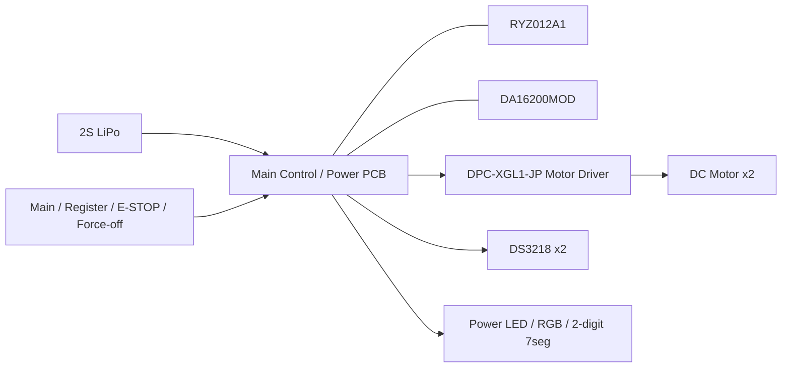
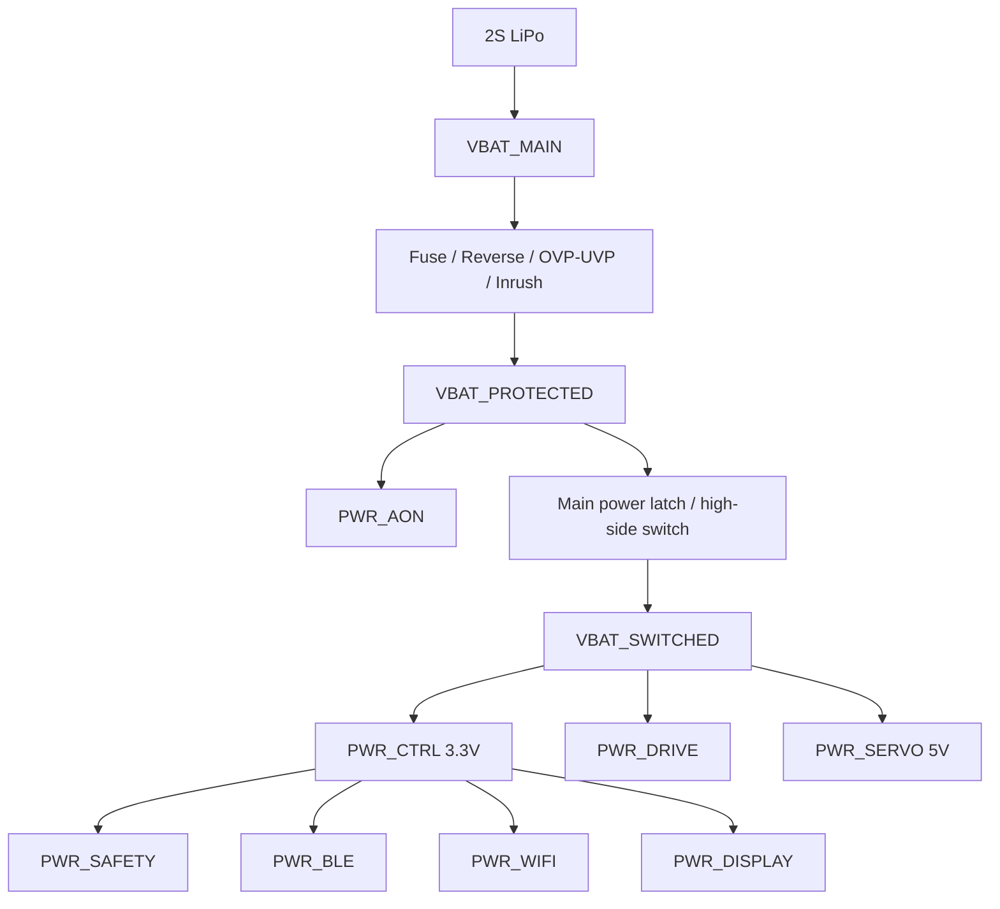
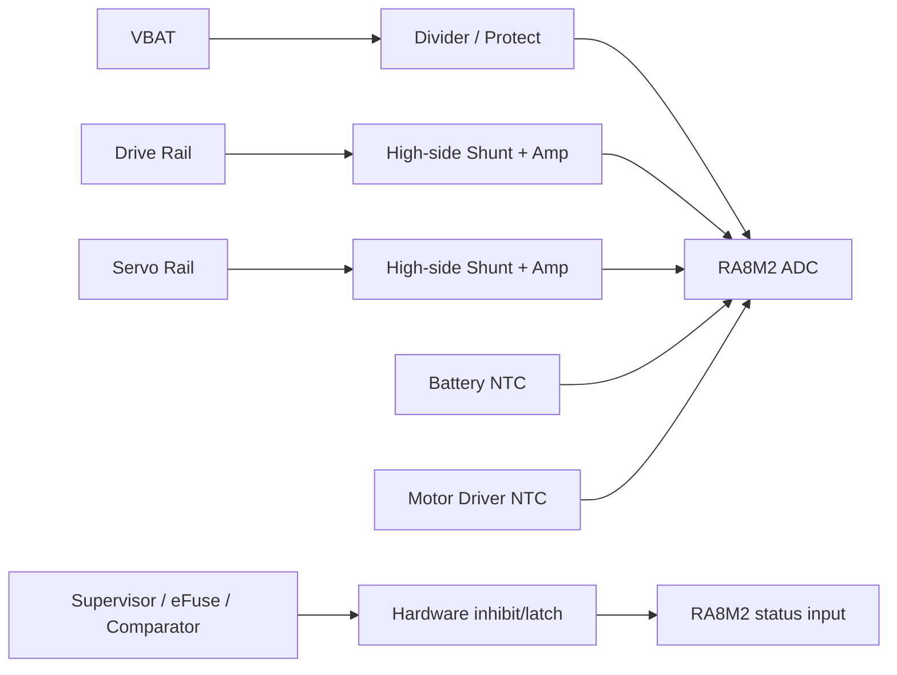

# Tank_Robot 電源・ハードウェア基本設計

## 目次

1. 本書の目的
2. 設計方針と適用範囲
3. 本体ハードウェア全体構成
4. 電源アーキテクチャ
5. バッテリー入力・入力保護
6. PWR_AON・主電源制御・通常終了・強制電源遮断
7. 制御・安全・通信・表示系3.3 V電源
8. 走行駆動電源・モータドライバ・I2C
9. サーボ電源・PWM・機構安全
10. 本体側緊急停止・独立安全経路
11. 電圧・電流・温度監視とハードウェア保護
12. RA8M2制御部・クロック・リセット・IWDT・RTC
13. BLE・Wi-Fi通信モジュールのハードウェア構成
14. 記憶部・固定ブート・有線復旧・保守インターフェース
15. 本体操作部・状態表示部
16. コネクタ・配線・ハーネス・可動部配線
17. PCB構成・接地・ノイズ・EMC・熱設計
18. 起動・リセット・電源断時のハードウェア安全状態
19. HW/SW責任分界と主要信号契約
20. MCU周辺資源・主要I/Oの割当方針
21. 電力・電流・熱・同時負荷の設計余裕
22. 開発・評価環境と製品構成の分離
23. 要求トレーサビリティ
24. 設計判断・後続事項
25. 評価事項
26. 他文書へのフィードバック
27. 初版の自己確認結果と引継ぎ条件

---

## 1. 本書の目的

### 1.1 目的

本書の目的は、Tank_Robot本体について、システム要求仕様および完成済み基本設計を実現するための主要ハードウェア構成、電源系統、安全関連回路、信号経路、主要インターフェース、HW/SW責任分界および実機評価前提を、詳細設計へ展開可能な粒度まで具体化することである。

本書は、Tank_Robot本体の電源・ハードウェアについて、単に部品を列挙するのではなく、**「どの電源をどのように生成・遮断するか」「ソフトウェアが停止しても何が安全側へ移るか」「どの物理信号を誰が制御・監視するか」「電源断・リセット・通信異常時に意図しないアクチュエータ動作をどう防ぐか」**を基本設計として具体化する。

### 1.2 対象範囲

本書では特に次を明確にする。

- 一つの2S LiPoバッテリーから各電源系統を生成する基本構成
- 主電源投入、通常終了後の自動遮断、最大電源保持時間および強制電源遮断のハードウェア構成
- 制御部、BLE、Wi-Fi、走行、サーボ、表示、安全監視および記憶部への電力供給・遮断構成
- リセット、電源断、配線断、通信異常時にアクチュエータを安全側へ維持するハードウェア条件
- 本体側緊急停止操作から走行駆動出力を通常ソフトウェア処理に依存せず無効化する独立経路
- バッテリー電圧、走行電流、サーボ電流、バッテリー温度およびモータドライバ温度の監視回路
- ソフトウェア監視と、ソフトウェアに依存しない電気保護との分担
- MCU、BLE/Wi-Fiモジュール、モータドライバ、サーボ、外付けSerial NOR、RTC、表示・操作部および保守インターフェースのハードウェア責任
- PCB、接地、配線、逆給電、ノイズ、熱、コネクタおよび実機評価上の基本条件

本書は回路図、部品表、PCB設計、ハーネス図または製造図面ではない。具体部品、ピン番号、回路定数、パターン幅、銅厚、コネクタ型式、ネジ、筐体寸法等は詳細設計で定める。

電源領域の設計内容は、同じ対象を次のfacetに分け、各文書で定める。

| 設計の観点 | 基準文書 | 定める内容 |
| --- | --- | --- |
| 論理電力管理 | 電源・省電力管理 | 電源管理単位の識別子、目標・論理実電力状態、変更中状態、電力状態変更transaction、低消費電力移行・復帰 |
| 電気安全監視・判定 | バッテリー・電気安全監視 | 監視値・品質、判定しきい値、継続時間、hysteresis、安全条件および必要な保護作用 |
| 物理電源・hardware | 電源・ハードウェア基本設計（本書） | domainと物理的な電源系統の対応、電源ツリー、回路、部品、配線、コネクタ、信号電気条件、監視回路、保護作用点およびread-back |

本書で定める物理電源ツリー、hardware protectionの回路方式・作用点、独立停止経路、reset/default安全状態、hardware guard、表示電源の物理構成その他の電気的成立条件は、評価確定待ちを含む本書で定める事項とする。電源・省電力管理の論理状態・transactionおよびバッテリー・電気安全監視のthreshold・安全判断・必要な保護作用は各文書からの設計入力として明示引用し、本書で独自に変更しない。具体部品、抵抗・コンデンサ値、pin、layout、配線幅、driver IC内部設定等、これらの基本挙動を変更しない実装方法は詳細設計で具体化してよい。

詳細回路設計、部品正式選定、基板設計、実装、結合評価および実機評価は未完了。

### 1.3 上位文書・関連文書

本書の上位要求は、[`04_Project/10_Tank_Robot/10_製品定義/02_製品目的・製品目標_公開用.md`](../../10_製品定義/02_製品目的・製品目標_公開用.md)および`40_公開用システム要求仕様/`を使用する。

`20_要求仕様`および`30_コア要求仕様`は上位要求として使用せず、公開用要求で削減・変更された機能を過去要求から復活させない。

#### 1.3.1 上位文書

- [`docs/00_project_overview/01_製品目的・製品目標.md`](../../../00_project_overview/01_製品目的・製品目標.md)
- [`docs/20_basic_design/00_Tank_Robot 基本設計について.md`](<../00_Tank_Robot 基本設計について.md>)
- [`docs/20_basic_design/01_システム構成/Tank_Robotシステム構成.md`](../01_システム構成/Tank_Robotシステム構成.md)
- [`docs/20_basic_design/02_システムアーキテクチャ/Tank_Robotシステムアーキテクチャ.md`](../02_システムアーキテクチャ/Tank_Robotシステムアーキテクチャ.md)

#### 1.3.2 関連するシステム要求仕様

- [`docs/10_requirements/01. 起動・終了・再起動.md`](<../../40_公開用システム要求仕様/01. 起動・終了・再起動.md>)
- [`docs/10_requirements/02. システム状態管理.md`](<../../40_公開用システム要求仕様/02. システム状態管理.md>)
- [`docs/10_requirements/03. 電源・省電力管理.md`](<../../40_公開用システム要求仕様/03. 電源・省電力管理.md>)
- [`docs/10_requirements/05. BLE接続・認証.md`](<../../40_公開用システム要求仕様/05. BLE接続・認証.md>)
- [`docs/10_requirements/07. 走行制御.md`](<../../40_公開用システム要求仕様/07. 走行制御.md>)
- [`docs/10_requirements/08. 砲塔・砲身制御.md`](<../../40_公開用システム要求仕様/08. 砲塔・砲身制御.md>)
- [`docs/10_requirements/09. 停止・緊急停止.md`](<../../40_公開用システム要求仕様/09. 停止・緊急停止.md>)
- [`docs/10_requirements/10. バッテリー・電気安全.md`](<../../40_公開用システム要求仕様/10. バッテリー・電気安全.md>)
- [`docs/10_requirements/11. Wi-Fi接続.md`](<../../40_公開用システム要求仕様/11. Wi-Fi接続.md>)
- [`docs/10_requirements/14. ログ・診断.md`](<../../40_公開用システム要求仕様/14. ログ・診断.md>)
- [`docs/10_requirements/15. OTA更新.md`](<../../40_公開用システム要求仕様/15. OTA更新.md>)
- [`docs/10_requirements/17. 異常検出・復旧.md`](<../../40_公開用システム要求仕様/17. 異常検出・復旧.md>)
- [`docs/10_requirements/18. 永続データ管理.md`](<../../40_公開用システム要求仕様/18. 永続データ管理.md>)
- [`docs/10_requirements/20. セキュリティ管理.md`](<../../40_公開用システム要求仕様/20. セキュリティ管理.md>)
- [`docs/10_requirements/21. 状態表示・利用者通知.md`](<../../40_公開用システム要求仕様/21. 状態表示・利用者通知.md>)
- [`docs/10_requirements/22. 性能・品質・耐久性.md`](<../../40_公開用システム要求仕様/22. 性能・品質・耐久性.md>)
- [`docs/10_requirements/24. 法令・規格・量産移行.md`](<../../40_公開用システム要求仕様/24. 法令・規格・量産移行.md>)

#### 1.3.3 関連する基本設計

- [`docs/20_basic_design/04_インターフェース・通信/Tank_Robotインターフェース・通信基本設計.md`](../04_インターフェース・通信/Tank_Robotインターフェース・通信基本設計.md)
- [`docs/20_basic_design/06_セキュリティ横断設計/Tank_Robotセキュリティ横断設計.md`](../06_セキュリティ横断設計/Tank_Robotセキュリティ横断設計.md)
- [`docs/20_basic_design/07_本体ソフトウェアアーキテクチャ/Tank_Robot本体ソフトアーキテクチャ基本設計.md`](../07_本体ソフトウェアアーキテクチャ/Tank_Robot本体ソフトアーキテクチャ基本設計.md)
- [`docs/20_basic_design/08_性能・品質・検証/Tank_Robot性能・品質・検証基本設計.md`](../08_性能・品質・検証/Tank_Robot性能・品質・検証基本設計.md)
- [`docs/20_basic_design/03_機能別基本設計/01_システム状態管理/Tank_Robotシステム状態管理基本設計.md`](../03_機能別基本設計/01_システム状態管理/Tank_Robotシステム状態管理基本設計.md)
- [`docs/20_basic_design/03_機能別基本設計/02_起動・終了・再起動管理/起動・終了・再起動管理基本設計.md`](../03_機能別基本設計/02_起動・終了・再起動管理/起動・終了・再起動管理基本設計.md)
- [`docs/20_basic_design/03_機能別基本設計/03_停止・緊急停止管理/停止・緊急停止管理基本設計.md`](../03_機能別基本設計/03_停止・緊急停止管理/停止・緊急停止管理基本設計.md)
- [`docs/20_basic_design/03_機能別基本設計/04_異常管理/異常管理基本設計.md`](../03_機能別基本設計/04_異常管理/異常管理基本設計.md)
- [`docs/20_basic_design/03_機能別基本設計/05_電源・省電力管理/電源・省電力管理基本設計.md`](../03_機能別基本設計/05_電源・省電力管理/電源・省電力管理基本設計.md)
- [`docs/20_basic_design/03_機能別基本設計/06_バッテリー・電気安全監視/バッテリー・電気安全監視基本設計.md`](../03_機能別基本設計/06_バッテリー・電気安全監視/バッテリー・電気安全監視基本設計.md)
- [`docs/20_basic_design/03_機能別基本設計/07_走行制御/走行制御基本設計.md`](../03_機能別基本設計/07_走行制御/走行制御基本設計.md)
- [`docs/20_basic_design/03_機能別基本設計/08_砲塔・砲身制御/砲塔・砲身制御基本設計.md`](../03_機能別基本設計/08_砲塔・砲身制御/砲塔・砲身制御基本設計.md)
- [`docs/20_basic_design/03_機能別基本設計/09_BLE接続・認証/BLE接続・認証基本設計.md`](../03_機能別基本設計/09_BLE接続・認証/BLE接続・認証基本設計.md)
- [`docs/20_basic_design/03_機能別基本設計/11_Wi-Fi接続/Wi-Fi接続基本設計.md`](../03_機能別基本設計/11_Wi-Fi接続/Wi-Fi接続基本設計.md)
- [`docs/20_basic_design/03_機能別基本設計/14_ログ・診断/ログ・診断基本設計.md`](../03_機能別基本設計/14_ログ・診断/ログ・診断基本設計.md)
- [`docs/20_basic_design/03_機能別基本設計/15_OTA更新/OTA更新基本設計.md`](../03_機能別基本設計/15_OTA更新/OTA更新基本設計.md)
- [`docs/20_basic_design/03_機能別基本設計/16_永続データ管理/永続データ管理基本設計.md`](../03_機能別基本設計/16_永続データ管理/永続データ管理基本設計.md)
- [`docs/20_basic_design/03_機能別基本設計/17_セキュリティ管理/セキュリティ管理基本設計.md`](../03_機能別基本設計/17_セキュリティ管理/セキュリティ管理基本設計.md)
- [`docs/20_basic_design/03_機能別基本設計/19_固定ブート・復旧/固定ブート・復旧基本設計.md`](../03_機能別基本設計/19_固定ブート・復旧/固定ブート・復旧基本設計.md)
- [`docs/20_basic_design/03_機能別基本設計/20_時刻管理/時刻管理基本設計.md`](../03_機能別基本設計/20_時刻管理/時刻管理基本設計.md)
- [`docs/20_basic_design/03_機能別基本設計/21_状態表示・利用者通知/状態表示・利用者通知基本設計.md`](../03_機能別基本設計/21_状態表示・利用者通知/状態表示・利用者通知基本設計.md)
- [`docs/20_basic_design/04_インターフェース・通信/Tank_Robotインターフェース・通信基本設計.md`](../04_インターフェース・通信/Tank_Robotインターフェース・通信基本設計.md)
- [`docs/20_basic_design/07_本体ソフトウェアアーキテクチャ/Tank_Robot本体ソフトアーキテクチャ基本設計.md`](../07_本体ソフトウェアアーキテクチャ/Tank_Robot本体ソフトアーキテクチャ基本設計.md)
- [`docs/20_basic_design/08_性能・品質・検証/Tank_Robot性能・品質・検証基本設計.md`](../08_性能・品質・検証/Tank_Robot性能・品質・検証基本設計.md)

### 1.4 用語

| 用語 | 本書での意味 |
| --- | --- |
| 電源ドメイン | 独立した役割、給電条件または遮断条件を持つ論理・物理電源系統 |
| 電源実状態 | 電源制御要求ではなく、power-good、電圧検出、保護状態等から確認した実際の給電状態 |
| AON | 主電源OFF時にもバッテリー接続中は必要最小限維持するAlways-On系 |
| 出力禁止 | アクチュエータへ新しい駆動要求を与えない状態。必ずしも負荷電源OFFを意味しない |
| 独立安全経路 | 通常Process、通常通信またはモータドライバI2Cの正常動作を前提とせず安全側へ移すハードウェア経路 |
| fail-safe | 電源喪失、配線断、未駆動、リセット等が発生したとき、危険側ではなく安全側の状態となる設計原則 |
| power-good | 対象電源が規定範囲に成立していることを示すハードウェア状態 |
| protection latch | 保護原因が瞬間的に解消しても、明示的な解除または再投入条件まで保持するハードウェア状態 |
| product board | 最終的なTank_Robot本体構成を意図する専用基板。EK-RA8M2等の評価ボードとは区別する |

---
## 2. 設計方針と適用範囲

### 2.1 基本方針

電源・ハードウェアは次の原則で設計する。

1. **一つの2S LiPoバッテリーを主電源とする。** 制御、通信、走行、サーボ、表示を最終的に一つのバッテリー系から供給する。
2. **制御・安全系と高電流アクチュエータ系を電源的に分離する。** 走行・サーボの負荷変動や保護動作でRA8M2・安全監視が停止しない構成とする。
3. **アクチュエータ系は個別に遮断可能とする。** `PWR_DRIVE`と`PWR_SERVO`を`PWR_CTRL`とは独立して停止できる。
4. **安全関連出力はreset/defaultで禁止側とする。** MCUが未初期化、高インピーダンス、reset中または異常停止中でも走行出力やサーボPWMを自動有効化しない。
5. **ソフトウェアだけに依存しない保護を持つ。** 短絡、重大過電流、危険低電圧、重大発熱、本体緊急停止等はハードウェア保護または独立経路を持つ。
6. **要求状態と実状態を分ける。** enable出力を出しただけで電源ON成功とせず、power-good、fault、電圧その他の確認を用いる。
7. **電源OFF中の逆給電を防ぐ。** MCU I/O、通信線、USB/保守機器または別電源からOFF中モジュール・アクチュエータへ意図しない給電を行わない。
8. **正常終了と強制遮断を分離する。** 主電源OFF操作では終了処理を待ち、終了完了または最大保持時間で自動遮断する。強制遮断はソフトウェアを待たない。
9. **本体側緊急停止をfail-safeにする。** 緊急停止回路の断線・コネクタ外れ・入力不明を解除済み正常状態としない。
10. **部品定格は最大正常負荷と異常時保護を両立させる。** 通常ピークで不要動作せず、危険領域へ到達する前に保護する。
11. **RF、アナログ監視、高電流電源をPCB上で分離する。** 1枚基板であっても機能ゾーンを物理的に分ける。
12. **評価可能性を確保する。** 電源、enable、protect、ADC、通信、安全信号に必要なテストポイントを持たせる。
13. **表示は安全処理から独立させる。** Power LED、RGB、7segを安全処理の成立条件にはしないが、状態表示・利用者通知のfixed boot early indicatorおよび低消費電力中の上位安全表示を成立させる電源・制御経路を確保する。

### 2.2 本書で定義する範囲

- 電源入力・分配・変換・遮断の基本構成
- 主電源操作、電源保持、最大保持、強制遮断のハードウェア方式
- 各電源ドメインの電気的役割と独立制御
- アクチュエータ出力のreset-safe構成
- 本体緊急停止の物理方式と独立走行停止経路
- バッテリー・電流・温度監視回路の方式
- 主要なハードウェア保護・ラッチ・read-back
- RA8M2、通信モジュール、外部Flash、RTC、操作・表示、保守I/Fの基本構成
- PCBゾーニング、接地、配線、熱、ノイズ、EMCの基本方針
- MCU周辺資源の予約方針
- HW/SW責任分界
- 詳細設計・評価へ引き継ぐ項目

### 2.3 本書で定義しない範囲

- 個別部品の最終型式・メーカー・購入先
- 抵抗、コンデンサ、シャント、RC、スナバ、補償回路等の最終定数
- PCBレイアウト、パターン幅、銅厚、ビア数、層構成
- RA8M2の具体ピン番号、FSP設定、レジスタ値
- BLE/Wi-Fiモジュールの詳細RF認証手続
- 筐体寸法、3D部品形状、ネジ・スペーサの具体設計
- 詳細なハーネス長・線材型式
- 試験手順・測定器・治具の詳細

### 2.4 確定値・暫定基本値・評価値の扱い

完成済みの機能別基本設計で既に確定した論理状態、transaction、監視値、判定、停止方式、通信方式、記憶構成、時刻構成およびセキュリティ境界を優先し、本書で同じ意味を別に定義しない。電源管理単位の名称と論理状態は電源・省電力管理、監視値・threshold・継続時間・hysteresis・安全条件・必要な保護作用はバッテリー・電気安全監視の各基本設計に従い、本書はdomainと物理的な電源系統の対応、回路、信号、部品、配線、コネクタ、物理作用点およびread-backとしてそれらの条件を実現する。

電源・省電力管理で確定済みの電源管理単位の名称・論理状態条件およびバッテリー・電気安全監視で確定済みの監視・判定しきい値・継続時間・hysteresis・必要な保護作用は、本書の物理設計入力として扱う。これらを満たす保護回路方式、部品、配線、信号電気条件、物理作用点およびread-backは電源・ハードウェア基本設計で定める。

バッテリー・電気安全監視で「暫定基本値」とされた電圧・電流・温度・容量等は本書で別値へ変更せず、初期回路設計および部品選定条件として使用する。性能・品質・検証基本設計で定めたAON/RTC電流、熱、長時間評価等の初期目標・条件も本書の回路成立性評価へ使用する。

実機評価で不成立となった場合は、抵抗値等の実装値だけを調整して製品挙動を変えず、必要に応じて電源・省電力管理/バッテリー・電気安全監視、本書、性能・品質・検証基本設計へフィードバックして基本設計値を改訂する。回路の成立性が確認できない値を「とりあえず最大値」で代用して通常操作を許可しない。

### 2.5 製品構成と開発・評価構成の分離

製品相当の基本構成は専用のTank_Robot main control/power PCBを前提とする。

EK-RA8M2、RTKYZ012A1B00000BE、US159-DA16200MEVZ、外付け評価回路、USB給電等は開発・評価用であり、製品電源構成の基準としない。

開発・評価時にUSBや外部電源を使用する場合でも、2S LiPo側へ逆給電しない構成または明示的な切離しを必須とする。

---
## 3. 本体ハードウェア全体構成

### 3.1 基本構成

初期製品相当構成は、主要な制御・電源・安全回路を一つのmain control/power PCBへ集約し、モータドライバ、DCモータ、DS3218、バッテリーおよび物理操作部を外部接続する構成を基本とする。

DPC-XGL1-JP付属モータドライバは初期製品で外部モジュールとして維持し、main PCBへモータドライバ回路そのものを再実装しない。

BLEおよびWi-Fiは採用済み無線モジュールを使用し、bare RF ICから独自無線部を設計しない。

### 3.2 PCB内の機能ゾーン

main PCBは少なくとも次のゾーンを論理・物理的に分ける。

| ゾーン | 主な構成 | 物理設計上の重点 |
| --- | --- | --- |
| AON・入力保護 | fuse、逆接続、主電源latch、強制遮断、VBATT | 低待機電流、安全保持、入力サージ |
| 制御デジタル | RA8M2、clock、reset、debug、logic | 安定3.3 V、decoupling、信号整合 |
| RF | RYZ012A1、DA16200MOD | antenna keep-out、motor/metalから距離 |
| アナログ安全 | 電圧・電流・温度監視、比較器 | Kelvin配線、ノイズ分離、ADC基準 |
| 高電流電源 | drive branch、servo 5 V、load switch/eFuse | 電流容量、熱、短絡、return path |
| 記憶 | external Serial NOR、OSPI | signal integrity、電源断整合 |
| 表示・操作 | LED、7seg driver、button input | ESD、利用者操作、誤操作防止 |

高電流returnをRA8M2/ADCのsignal ground経路へ流さない。

### 3.3 主要ハードウェア

| 区分 | 採用方針 |
| --- | --- |
| MCU | Renesas RA8M2 |
| BLE | RYZ012A1 module |
| Wi-Fi | DA16200MOD |
| 走行driver | DPC-XGL1-JP付属motor driver |
| DC motor | DPC-XGL1-JP付属 ×2 |
| Servo | DS3218 ×2 |
| Main battery | 2S LiPo 7.4 V nominal |
| External NVM | RA8M2 OSPI_Bから使用可能なSerial NOR 8 MiB以上 |
| RTC | RA8M2 internal RTC + 32.768 kHz SOSC |
| Security engine | RA8M2 RSIP-E50Dを使用し、初期製品で外付けsecure elementを必須としない |
| Power/Safety | dedicated regulator、load switch/eFuse、current sense、NTC、supervisor/comparatorをmain PCBに配置 |

---
## 4. 電源アーキテクチャ

### 4.1 電源ツリー

電源・省電力管理で定義した論理電源の管理単位を物理的な電源系統へ対応付ける次の電源ツリーは、電源・ハードウェア基本設計で定める。バッテリー・電気安全監視の監視・保護条件は、この物理構成が満たす設計入力として使用する。

図は主バッテリーからの給電系統を示す。RTC/VBATTには、この系統の`PWR_AON`由来の保持電源に加え、RTCバックアップ電池から給電する。二つの保持電源の構成と切替えは第6.7節に示す。

### 4.2 電源ドメインの基本条件

本書ではバッテリー・電気安全監視および性能・品質・検証基本設計の基本条件を部品選定の入力として使用する。

| Domain | 基本条件 | 本書での実現方針 |
| --- | --- | --- |
| `VBAT_MAIN` | 2S LiPo生入力、0～10 V監視可能 | fuse前後のtest pointを設ける |
| `VBAT_PROTECTED` | input protection後、通常7.0～8.4 V | AONとmain switchへ分岐 |
| `VBAT_SWITCHED` | main power ON時の共通主負荷入力 | high-side main switch後 |
| `PWR_AON` | main OFF時50 µA以下目標 | low-Iq regulator/supervisor、power latch、VBATT。性能・品質・検証基本設計のsystem main-off 100 µA以下目標のsub-budget |
| `PWR_CTRL` | 3.3 V ±5 %、連続3 A以上 | dedicated buck regulator |
| `PWR_BLE` | 3.3 V ±5 %、module max +20 %以上 | individual load switch |
| `PWR_WIFI` | 3.3 V ±5 %、瞬時max +30 %以上 | individual load switch + local bulk |
| `PWR_DRIVE` | protected battery、4 A continuous / 6 A 200 ms provisional | high-side eFuse/load switch + current monitor |
| `PWR_SERVO` | 5.0 V ±5 %、4 A continuous / 5 A 200 ms provisional | dedicated high-current buck + protection |
| `PWR_DISPLAY` | 3.3 V ±5 %、最大同時点灯電流+20 %以上 | switch/driverで低消費電力化、fixed boot/Application双方から制御可能 |
| `PWR_SAFETY` | 3.3 V ±5 %、監視回路最大電流+30 %以上 | `PWR_CTRL`と物理電源共有、低消費load switch下流に置かない |

### 4.3 独立制御

`PWR_DRIVE`および`PWR_SERVO`は、`PWR_CTRL`を維持したまま独立して遮断できることを必須とする。

`PWR_BLE`、`PWR_WIFI`および`PWR_DISPLAY`も個別のEnable信号を持つ。ただし、BLEは低消費電力状態で接続要求を復帰要因として通知するため、通常の低消費電力移行では給電を維持し、モジュール内部の低消費電力動作を使用する。

#### 本体アプリケーション動作中に信号を直接制御する機能

本体アプリケーションの動作中に、`PWR_BLE_EN`、`PWR_WIFI_EN`および`PWR_DISPLAY_EN`を直接制御するソフトウェア機能は、電源・省電力管理とする。

BLE接続・認証、Wi-Fi接続および状態表示・利用者通知は、それぞれBLE、Wi-Fi、表示の利用要求、局所状態、準備結果および完了結果を電源・省電力管理へ提供する。
これらの機能は、電源系統のEnable信号を直接変更しない。

このように、通常時のEnable信号については**信号を直接出力するソフトウェア機能を一つに定める**。

#### 保護回路による強制遮断

バッテリー・電気安全監視のSafety permit、E-STOP、force-off、eFuse、コンパレータ等の保護経路は、必要な場合にハードウェアのゲート回路を介してEnable信号をOFF側へ強制できる。

これは、電源・省電力管理と競合して同じEnable信号を出力する別のソフトウェア機能ではない。
通常の電源利用要求を処理する経路と、安全のために独立して遮断する保護経路を分けて扱う。

#### `PWR_DISPLAY_EN`の起動前後の担当

`PWR_DISPLAY`は、本体アプリケーションの動作中に加え、その起動前にも利用できる。
起動前は、固定ブート・復旧が状態表示・利用者通知の`EARLY_IND`を実行する。

固定ブートと本体アプリケーションは同一CPU上で同時には実行しない。
`PWR_DISPLAY_EN`を直接制御する担当は、次の順に一回だけ移管する。

| 時点 | `PWR_DISPLAY_EN`を直接制御する機能 |
| --- | --- |
| 本体アプリケーションへの制御移管前 | 固定ブート |
| 本体アプリケーションへの制御移管後 | 電源・省電力管理 |

固定ブートと電源・省電力管理が同時に`PWR_DISPLAY_EN`を駆動してはならない。

状態表示・利用者通知は、両期間の表示内容とその意味を定める。
本体アプリケーションの動作中に、電源系統のEnable信号を直接制御する機能にはしない。

### 4.4 enable信号のfail-safe

次のenableはMCU reset、高インピーダンス、未接続時にOFF側となるhardware biasを持つ。

- `PWR_DRIVE_EN`
- `PWR_SERVO_EN`
- `DRIVE_HW_ENABLE`
- `SERVO_PWM_OE`
- `PWR_BLE_EN`
- `PWR_WIFI_EN`
- `PWR_DISPLAY_EN`

ただしBLEの低消費電力復帰要件を満たすため、main power ON後に電源・省電力管理が必要とする期間はsoftwareによりON維持する。`PWR_DISPLAY_EN`はreset直後OFFから開始し、`PWR_CTRL_GOOD`成立後にfixed bootがearly表示を必要とする場合は明示的にONできる。Application handoff後は電源・省電力管理だけが`PWR_DISPLAY_EN`を直接制御し、状態表示・利用者通知の表示要求を電源・省電力管理が電力状態管理へ反映する。

### 4.5 電源実状態の確認

重要電源はenable commandだけでなく少なくとも次のいずれかを使用して実状態を確認する。

- regulator/load switch/eFuseの`PG`または`FLT`
- rail voltage comparator
- ADCでの電圧確認
- module初期化応答

安全上重要な`PWR_DRIVE`と`PWR_SERVO`は、enable pinのread-backだけを実電源状態としない。

---
## 5. バッテリー入力・入力保護

### 5.1 バッテリー

本体主電源は一つの2S LiPoとする。

初期回路設計および物理接続では、バッテリー・電気安全監視の電気安全条件を入力として次を使用する。

- nominal 7.4 V
- full charge 8.4 V
- capacity 2,200 mAh provisional
- continuous discharge 15 A以上
- 1 s peak 20 A以上
- 主電源コネクタはXT30U相当の極性key付きとし、バッテリー側を露出pinのないメス接点、本体側をオス接点とする
- 外部充電用balance端子は2S用JST-XH 3極相当とし、外部balance chargerだけに使用して本体回路へ接続しない

本体内でLiPo充電しない。充電は本体から取り外して外部2S balance chargerで行う。逆接続、挿抜時短絡、露出導体接触および本体給電中の充電を防ぐ物理構造は本書第16章とともに具体化する。

### 5.2 主ヒューズ

バッテリーコネクタ直後、回路分岐前に主ヒューズを配置する。

初期定格はバッテリー・電気安全監視に従い15 Aとし、正常最大負荷・突入で不要溶断せず、共通配線・コネクタの許容電流を超える前に保護できる時間電流特性を詳細設計で選定する。

### 5.3 逆接続・逆流

極性keyだけに依存せず、back-to-back MOSFETまたは同等の低損失方式で逆接続および逆流を防止する。

USB、保守接続、電源変換部または負荷側の電源から`VBAT_MAIN`へ逆給電する経路を設けない。

### 5.4 過電圧・低電圧保護

入力保護回路はバッテリー・電気安全監視の現行hardware protection値を満たす。これらは製品の安全動作を変えるため、詳細設計だけで別値へ変更しない。

| 項目 | 現行基本設計値 | hardware動作 |
| --- | --- | --- |
| input耐圧 | 少なくとも16 V以上 | 3S LiPo相当12.6 V誤接続でも通常起動せず後段損傷を防ぐ |
| 指定外高電圧境界 | 8.6 V以上 | 通常操作を開始しない |
| hardware過電圧遮断 | 公称8.7 V、許容差±0.1 V、作動範囲8.6～8.8 V、10 ms以下 | 後段給電を遮断または制限し原因をlatch |
| software危険低電圧 | 6.4 V以下、100 ms | バッテリー・電気安全監視が安全処理を判断 |
| hardware危険低電圧検出 | 公称6.5 V、許容差±0.1 V、作動範囲6.4～6.6 V、50 ms以下 | 走行等の出力許可を直接無効化し、原因latch、RA8M2通知、遮断処理開始 |
| hardware低電圧遮断 | 公称6.2 V、許容差±0.1 V、最低作動値6.1 V以上、50 ms以下 | softwareに依存せず主負荷を遮断し原因をlatch |

hardware過電圧・危険低電圧・低電圧遮断thresholdはVPS、BLE通常設定その他のruntime remote settingから変更不可とする。具体supervisor/eFuse/comparator型式、抵抗値、hysteresis実装は、上表の公称値・許容差・作用時間を満たすよう詳細設計で決定する。

低電圧hardware cutoffが作動して主負荷が遮断された後は、電圧回復だけで`VBAT_SWITCHED`を自動再投入しない。電源・省電力管理/バッテリー・電気安全監視の復旧条件を満たしたうえで、新しい主電源操作を必要とする。

### 5.5 突入電流

`VBAT_SWITCHED`、`PWR_CTRL`、`PWR_SERVO`、通信モジュールおよび外付けFlashのbulk capacitor充電による突入電流を、入力保護やLiPo保護回路の不要動作を起こさない範囲へ制限する。

soft-start、slew-rate control、eFuseまたはload switchの機能を利用する。

### 5.6 保護原因の保持

`PWR_AON`は、main power OFFまたは異常遮断後の次回起動診断に必要な粗い電源停止原因を可能な範囲で保持する。

少なくとも次を区別可能とする方向で詳細設計する。

- normal shutdown completion
- shutdown guard timer expiry
- force-off operation
- input protection / undervoltage cutoff
- drive branch protection
- servo branch protection

ハードウェアが保持する保護原因は、異常管理、バッテリー・電気安全監視およびログ・診断が管理する異常・ログ情報の代わりにはせず、次回起動時の補足診断情報として使用する。入力保護によってAON自体への電力供給が失われる場合、保護原因の情報を保持できないことがある。情報を保持できなかった場合に、原因を推測して正常扱いしない。

---
## 6. PWR_AON・主電源制御・通常終了・強制電源遮断

### 6.1 `PWR_AON`の役割

`PWR_AON`は`VBAT_PROTECTED`から分岐する低待機電力系とし、少なくとも次を維持する。

- 主電源操作検出
- main power latch
- force-off path
- normal shutdown maximum hold timer
- protection cause retention
- RTC VBATT backup supply

`PWR_AON`を通常softwareからOFFする機能を設けない。

### 6.2 主電源操作部

一般操作者の主電源操作部は、通常アクセス可能なmomentary push buttonを基本とする。

- main OFF時の操作：main power latchをsetし`VBAT_SWITCHED`を投入する。
- main ON時の操作：即時電源遮断せず、通常終了要求としてMCUへ通知する。

同じ主電源操作部によって起動と通常終了を開始できる公開用システム要求仕様「01. 起動・終了・再起動」の方針を維持する。

### 6.3 main power latch

`VBAT_SWITCHED`のmain high-side switchはAON側hardware latchで保持する。

MCUがpower hold出力を常時維持しないと電源が直ちに落ちる方式は採用せず、main buttonでsetしたlatchを次のいずれかでresetする方式を基本とする。

- 起動・終了・再起動管理からのnormal shutdown completeに対応する`MAIN_POWER_RELEASE`
- 15 s maximum hold timer expiry
- force-off operation
- hardware protectionによる強制main cutoff

reset/power glitchによってlatchが危険側へsetされない。

### 6.4 通常終了の15秒hardware guard

公開用システム要求仕様「01. 起動・終了・再起動」/公開用システム要求仕様「22. 性能・品質・耐久性」で定める最大電源保持時間15秒を、MCUだけのsoftware timerに依存させない。

main ON中に主電源OFF操作を検出した場合、AON側の独立hardware timerを開始する。

BLE等から開始した通常終了については、起動・終了・再起動管理が通常終了開始時にAON側へ`SHUTDOWN_GUARD_START`を要求する。

通常終了が15秒以内に完了した場合は、起動・終了・再起動管理から`MAIN_POWER_RELEASE`を受けてmain latchを先にclearする。

15秒に到達した場合は、software結果を待たずmain latchをclearする。hardware timerの具体部品、発振精度および公差は詳細設計で決定するが、worst caseで正常終了処理上限10秒より短く作動せず、要求された最大保持15秒を超えないよう設計する。

一度開始したshutdown guardは、通常操作の復帰によって暗黙にcancelしない。

### 6.5 強制電源遮断操作部

強制電源遮断は通常終了および緊急停止と目的が異なるため、初期製品では**主電源buttonとは別の、誤操作しにくいrecessed/guarded momentary control**を基本とする。

操作時はAON側hardwareからmain latch resetへ直接入力し、MCU応答、log、保存、BLEまたは状態遷移を待たない。

可能な場合は同時に`FORCE_OFF_NOTICE`をMCUへ通知するが、当該通知の受付を遮断条件としない。

force-off signalは、main latchだけでなく`PWR_DRIVE_EN`および`PWR_SERVO_EN`のhardware enable chainもOFF側へ強制し、主電源railの放電より先または同時にアクチュエータrailを無効化する。

### 6.6 自動再投入禁止

force-off、最大保持timer、undervoltage cutoffまたはhardware protectionによって電源が落ちた後、原因が解消しても自動でmain latchをsetしない。

再投入には主電源操作を新たに必要とする。

### 6.7 RTC VBATT

RA8M2のVBATTは、`PWR_AON`由来の低待機電力電源と、RTCバックアップ電池の2系統で保持する。通常は`PWR_AON`側を優先し、同電源の喪失時はRTCバックアップ電池で保持を継続する。初期製品は、交換可能な3 Vコイン形一次電池（CR2032クラス）を採用する。

保持電源の構成は、「RTC継続性・時刻復旧契約基本設計」の2章に従い、次の条件を満たす。

- `PWR_CTRL` OFF中も、主バッテリー接続中は`PWR_AON`由来の電源でRTCを保持する。
- VCC/VBATT間の逆流を防止する。
- RA8M2の許容電圧範囲を維持する。
- 主バッテリー側の待機電流は、`PWR_AON`全体50 µA以下の目標へ収める。
- 性能・品質・検証基本設計のRTC保持電源5 µA以下の目標を、`PWR_AON`内のVBATT給電部分の設計・評価目標として使用する。
- RTCバックアップ電池へ充電電流を流さず、同電池から`PWR_AON`や本体の通常動作用電源へ逆給電しない。
- 保持電源の切替えによって、RTC時刻や保持領域を初期化しない。

`PWR_AON` 50 µA以下は、性能・品質・検証基本設計の「主電源OFF時の主バッテリー待機電流100 µA以下」システム目標に対するハードウェア側への電流配分である。主バッテリー取外し中のRTCバックアップ電池の電流は、この配分の算定対象に含めない。

主バッテリーの取外しやAON入力保護による遮断だけを理由に、RTCの保持継続が失われたとは判定しない。保持継続を確認できない場合は、時刻管理が`TIME_UNTRUSTED`として扱う。確認に用いる情報と判定は、「RTC継続性・時刻復旧契約基本設計」の4章・5章に従う。

---
## 7. 制御・安全・通信・表示系3.3 V電源

### 7.1 `PWR_CTRL`

`PWR_CTRL`は`VBAT_SWITCHED`から生成する3.3 V制御系電源とする。

RA8M2、external Serial NOR、必要なlogicおよび通信/表示branchの上流電源として使用し、走行motor currentおよびservo currentを直接流さない。

バッテリー・電気安全監視の暫定値3.3 V ±5 %、continuous 3 A以上を初期選定条件とする。

regulatorは次を備えるものを優先する。

- soft-start
- current limit
- short protection
- overtemperature protection
- UVLO
- power-goodまたは同等のrail validity確認

### 7.2 `PWR_SAFETY`

電圧・電流・温度monitor、必要なcomparator、protection state sensingは`PWR_CTRL`と同一3.3 V sourceを使用してよいが、BLE/Wi-Fi/display個別load switchの下流へ置かない。

安全監視処理が通信省電力化によって停止しない構成とする。

### 7.3 control power-goodとactuator interlock

`PWR_CTRL`が規定範囲でない場合、アクチュエータ有効化をhardware上許可しない。

`PWR_DRIVE_EN`および`SERVO_PWM_OE`の最終hardware enable条件には、少なくとも`PWR_CTRL_GOOD`または同等のcontrol-power健全条件を含める。

これによりMCU rail低下中にdriver/servoだけが能動駆動する状態を避ける。

### 7.4 BLE/Wi-Fi load switch

`PWR_BLE`と`PWR_WIFI`は3.3 V sourceから個別load switchを介して供給する。

load switchは少なくとも次を満たす。

- default OFF bias
- current limitまたは上流短絡保護との協調
- OFF時reverse current/backfeed抑制
- module local bulk capacitorによるinrush管理

### 7.5 `PWR_DISPLAY`とPower LED

RGB LEDおよび2桁7segの表示負荷は`PWR_DISPLAY`で一括低消費電力化可能とする。`PWR_DISPLAY`はreset時default OFFとし、Application起動前はfixed boot `EARLY_IND`が必要な期間、Application handoff後は状態表示・利用者通知の表示要求を受けた電源・省電力管理が必要と判断する期間だけ明示的に有効化する。

Power LEDは`PWR_DISPLAY`の下流へ置かず`PWR_CTRL`から供給する。ただし`PWR_CTRL`へ直結して常時点灯する単純passive indicatorにはせず、状態表示・利用者通知の表示契約を実現できる低電流driver/transistor/GPIO制御経路を持つ。

- fixed boot/application通常電源供給中：連続点灯可能
- 低消費電力状態：状態表示・利用者通知の2.0 s周期、50 ms ON / 1.95 s OFFを実現可能
- 主電源OFF：消灯
- reset直後：不定点灯せず既知のOFF側から開始し、`PWR_CTRL_GOOD`確認後にfixed bootが必要な表示を開始可能

Power LEDは利用者向け表示であり、`PWR_CTRL_GOOD`や安全成立のread-backの正式な情報として使用しない。

RGB/7segをRA8M2 pinから直接大電流駆動せず、必要なtransistor/driver/current-limit段を設ける。

---
## 8. 走行駆動電源・モータドライバ・I2C

### 8.1 `PWR_DRIVE`

`PWR_DRIVE`は`VBAT_SWITCHED`から分岐し、高側load switch/eFuseを経由してDPC-XGL1-JP付属motor driverおよびDC motor系へ供給する。

初期定格はバッテリー・電気安全監視のcontinuous 4.0 A、200 ms 6.0 Aを満たす部品・配線を選定する。

`PWR_DRIVE`は次を備える。

- MCU/電源・省電力管理からの通常enable
- 本体E-STOP independent pathからのhardware inhibit
- バッテリー・電気安全監視 hardware protectionからのinhibit/latch-off
- fault/status read-back
- reset/default OFF

### 8.2 motor driver logic level

RA8M2は3.3 V logicである。

DPC-XGL1-JP付属motor driverは既確認の部品条件から5 V logicを前提とし、RA8M2 I2Cを直接接続しない。

初期製品では、driver側5 V logicとRA8M2 3.3 V I/Oの間に、I2C open-drain動作に適合するbidirectional level translatorを配置する。

motor driver側5 V logic supplyは`PWR_DRIVE`の使用状態と整合する小容量5 V subrailまたはdriver仕様に適合する供給を用いる。最終供給元はdriver pinout・消費電流を実測・確認して詳細設計で確定する。

### 8.3 I2C power isolation

`PWR_DRIVE` OFFまたはdriver logic OFF時に、RA8M2側SDA/SCLからlevel translator経由でdriverをphantom poweringしない。

translator enableをdriver-side power-goodへ連動させるか、OFF時high-impedanceとなる構成を採用する。

I2C pull-upは各電圧domainの正しい側へ配置し、5 VをRA8M2 pinへ印加しない。

### 8.4 hardware drive enable

走行出力をI2C commandだけで安全化しない。

論理的な`DRIVE_HW_ENABLE`を設け、少なくとも次の全条件成立時だけdrive可能とする。

- `PWR_CTRL_GOOD`
- E-STOP hardware loop released
- drive hardware protection not latched
- `PWR_DRIVE` power-good
- MCU/走行制御からのsoftware drive enable request

いずれか一つでも失われた場合、`DRIVE_HW_ENABLE`はOFF側となる。

motor driverにdedicated enable/standby inputが存在し、安全な無効化が保証できる場合は優先して使用する。存在しない、または安全性を確認できない場合は`PWR_DRIVE` high-side switch/eFuseのenableを独立停止経路として使用する。現物driver仕様を確認して最終方式を第25章で確定する。

### 8.5 read-back

走行制御の`DriveStopResult`で利用可能な範囲として、hardware側は少なくとも次を観測可能にする。

- `PWR_DRIVE` actual power-good/fault
- E-STOP hardware loop state
- hardware enable gate resultまたはその前提状態
- eFuse/load switch fault

driverが出力state/fault registerを提供する場合はI2Cで追加確認するが、存在しないread-backを仮定しない。

### 8.6 motor配線・ノイズ

DC motor配線は高di/dt配線としてcontrol/ADC/RF配線から離す。

必要に応じてmotor端子またはdriver近傍へnoise suppression capacitor、RC snubber、ferrite等を配置する。定数はEMC/波形評価で確定する。

左右motor connectorは極性・左右を誤接続しにくいkeyed/識別構造とする。

---
## 9. サーボ電源・PWM・機構安全

### 9.1 `PWR_SERVO`

`PWR_SERVO`は`VBAT_SWITCHED`から専用5 V switching regulatorを介してDS3218×2へ供給する。

バッテリー・電気安全監視の暫定値5.0 V ±5 %、continuous 4.0 A、200 ms 5.0 Aを満たす。

初期試作で外付けUBECを使用する場合でも、製品相当基本設計ではdedicated 5 V power stageとして扱い、USB/MCU 5 Vからservoを給電しない。

### 9.2 servo branch protection

`PWR_SERVO`はcurrent limit、short protection、overtemperature protectionおよびhigh-side current monitorを持つ。

電源・省電力管理から独立して遮断可能とし、PWM停止後にpower OFFできる。

### 9.3 PWM interface

RA8M2から2系統のservo PWMを出力する。

砲塔・砲身制御で採用した20 ms / 50 Hz基本周期を維持する。

servo signal電圧の正式VIH/VILを採用DS3218 variantで確認し、3.3 V direct-driveを無条件に前提としない。必要な場合は5 V logic-compatible buffer/level shifterを使用する。

servo側PWM lineには`SERVO_PWM_OE`を持つbuffer stageを設け、次の場合はhardware上high-impedanceまたは安全な無信号状態とする。

- MCU reset
- `PWR_CTRL_GOOD` loss
- `PWR_SERVO` off
- 砲塔・砲身制御からPWM disable要求

buffer OEにはdefault OFF biasを設ける。

### 9.4 PWM OFFと機械停止

PWM無信号やservo電源OFFを、砲塔・砲身の機械的位置を保持したことへ読み替えない。

PWM停止後に重力、慣性、外力で危険な落下・衝突・挟み込みを起こさないよう、機構質量、重心、摩擦、可動範囲およびcable routingで成立させる。

必要に応じてmechanical friction、counterbalanceまたは軽量化を用いるが、servo holding torqueだけを非常時安全手段としない。

### 9.5 `MANUAL_DATUM_ARM`用物理datum

砲塔・砲身制御の`MANUAL_DATUM_ARM`を利用者が実行できるよう、砲塔および砲身に目視可能なmanual datum markを設ける。

- power/PWM OFF状態で安全に合わせられる位置
- 左右・上下を誤認しにくいmark
- cable twistやmechanical interferenceを起こさない基準位置

limit switch/absolute encoderは初期必須構成に追加しない。

### 9.6 可動部配線

servo harness、砲塔側配線およびその他の可動部cableは、全許容可動範囲で引張、挟み込み、擦れ、断線またはconnector抜けを起こさないslack/strain reliefを持つ。

通常software可動範囲は、mechanical hard limitまたはcable限界より内側に安全marginを持たせる。

---
## 10. 本体側緊急停止・独立安全経路

### 10.1 緊急停止操作部

本体緊急停止操作部は、通常操作位置から直接操作可能で、主電源button・登録button・force-offと形状・配置・表示で区別できる**mechanically latching emergency-stop push button**を基本とする。

操作後は機械的に保持し、利用者が明示的に物理復帰するまでrelease状態へ戻らない。

### 10.2 normally-closed fail-safe loop

緊急停止hardware loopはnormally-closed contactを基本とする。

contact openをE-STOP active側とすることで、button操作だけでなく次も安全側へ扱える構成とする。

- wire break
- connector removal
- contact断線
- sense未確定

### 10.3 contact分離

初期製品では少なくとも2系統のcontactまたは同等に分離された経路を使用する方針とする。

| 経路 | 用途 |
| --- | --- |
| E-STOP hardware contact A | `DRIVE_HW_ENABLE`を通常SW/I2Cを介さず強制OFF |
| E-STOP sense contact B | RA8M2へE-STOP stateを通知し停止・緊急停止管理/システム状態管理の状態管理に使用 |

二つのcontact状態が矛盾する場合は正常releaseと扱わず、走行禁止・hardware faultとして異常管理へ通知する。

### 10.4 independent drive-stop path

contact Aは通常Process、BLE、I2C command、motor driver software protocolを経由せずdrive outputを無効化する。

preferred orderは次とする。

1. motor driverにhardware enable/standby inputが存在し、安全な無効化が保証できる場合は当該inputをhardware gateする。
2. 存在しない、または安全性を確認できない場合は`PWR_DRIVE` high-side eFuse/load switch enableを直接gateしてdrive powerを遮断する。

最終方式はDPC-XGL1-JP付属driver現物仕様で確定する。

### 10.5 software経路との関係

contact Bの変化はRA8M2へhardware interruptまたは高優先入力として通知する。

softwareは停止・緊急停止管理に従ってdrive stop、servo PWM stop、緊急停止状態管理、永続保持および利用者通知を行う。

hardware contact Aの成立はsoftware resultを待たない。

### 10.6 release

E-STOP physical buttonをrelease位置へ戻しても`DRIVE_HW_ENABLE`を即時自動再許可しない。

走行については、停止・緊急停止管理の明示的な緊急停止解除が正常完了し、システム状態管理が走行を含む通常操作を許可し、走行制御の再初期化・走行利用可否その他の走行再開条件が成立した後、新たなsoftware drive enableによってのみ`DRIVE_HW_ENABLE`を再許可する。停止前の走行指令は再利用せず、走行指令の再開条件は走行制御の`driveEpoch`契約に従う。

砲塔・砲身については、緊急停止解除後も砲塔・砲身制御の`OFF_UNREFERENCED`を維持し、砲塔・砲身制御が定める基準合わせおよび`MANUAL_DATUM_ARM`を完了するまでサーボPWMを再開しない。`MANUAL_DATUM_ARM`は砲塔・砲身のサーボ動作許可条件であり、`DRIVE_HW_ENABLE`の再許可条件には使用しない。

### 10.7 stop failure時の追加安全

停止・緊急停止管理がstop failureを確定した場合、hardware側は`PWR_DRIVE`および必要に応じ`PWR_SERVO`を個別遮断できる構成を提供する。

当該電源遮断は電源・省電力管理/バッテリー・電気安全監視の責任で実行・確認し、本書は物理経路を提供する。

---
## 11. 電圧・電流・温度監視とハードウェア保護

### 11.1 基本構成

監視値・判定しきい値はバッテリー・電気安全監視基本設計に従い、本書では計測回路と独立保護回路の物理構成を定める。

### 11.2 battery voltage monitor

バッテリー電圧は0～10.0 VをRA8M2 ADCへ安全に入力できる分圧・保護回路とする。

- resistor divider
- input current limiting
- clamp / ADC absolute max保護
- open/short等の診断を考慮
- low-power currentを抑えるswitchable dividerまたは高抵抗方式を検討

switchable dividerを用いる場合も、critical undervoltage protectionをADC dividerのON/OFFだけに依存させない。

### 11.3 drive current monitor

`PWR_DRIVE`の合計電流をhigh-side shunt＋current-sense amplifierで取得する。

初期物理方式は、2 mΩ、1 %以下、1 W以上、Kelvin接続対応のhigh-side shuntと、INA240A2相当のPWM common-mode transient耐性を持つ50 V/V級current-sense amplifierとする。バッテリー・電気安全監視の測定入力条件である0～20 A、校正後に読値の±5 %以内を満たすことを詳細設計および評価で確認する。

両電流検出増幅器の零電流出力は、0 Vへ張り付かないようADC基準の約10 %に相当する0.33 Vを基準とする。零電流と出力断線・電源喪失を区別し、正方向の最大測定電流でもADC入力上限を超えない構成とする。

最終gain、shunt resistance、power ratingおよびbandwidthは、バッテリー・電気安全監視の測定範囲・精度・診断条件・判定しきい値を変更しない範囲で詳細設計により確定する。これらの変更がバッテリー・電気安全監視の安全判断へ影響する場合は、電源・ハードウェア基本設計だけで変更しない。

### 11.4 servo current monitor

`PWR_SERVO`の2軸合計電流をhigh-side shunt＋current-sense amplifierで取得する。

初期物理方式は、5 mΩ、1 %以下、1 W以上、Kelvin接続対応のhigh-side shuntと、50 V/V級current-sense amplifierとする。バッテリー・電気安全監視の測定入力条件である0～8 A、校正後に読値の±5 %以内を満たし、第11.3節と同じbias・断線診断方針を適用する。

servo個別電流は初期必須監視としない。最終gain、shunt resistance、power ratingおよびbandwidthは、バッテリー・電気安全監視の測定範囲・精度・診断条件・判定しきい値を変更しない範囲で詳細設計により確定する。

### 11.5 temperature monitor

バッテリー・電気安全監視に従い、初期基本方式は10 kΩ / B=3950 K / 1 %相当NTCを使用する。

- battery surface NTCはバッテリーの広い面の中央付近へ、電気絶縁性を持つ熱伝導材を介して確実に接触させる。バッテリー交換時に所定位置へ接触しない状態を防ぐ保持構造とし、lead wireへ引張りを加えない
- motor-driver NTCはdriver発熱部品またはその直近のPCB上へ配置し、評価により最も高い温度との相関を確認する。motor風・外気だけを測定する位置に置かない

sensor connector抜け、wire break、shortを正常温度と扱わないbias/diagnostic rangeを持つ。バッテリー・電気安全監視の測定入力条件であるbattery surface -10～80 ℃、motor driver -10～125 ℃、使用する判定点で校正後±3 ℃以内を満たすことを評価する。

### 11.6 independent hardware protection

次の保護はsoftware ADC判定だけに依存しない。

| 対象 | hardware基本方式 |
| --- | --- |
| input short / major overcurrent | main fuse + eFuse/current limit |
| reverse polarity / reverse current | back-to-back MOSFET等 |
| input overvoltage | 第5.4節の公称8.7 V hardware OV cutoff |
| dangerous undervoltage | 第5.4節の公称6.5 V hardware detectorで出力許可を直接無効化 |
| overdischarge | 第5.4節の公称6.2 V main-load cutoff |
| drive short/major overcurrent | drive eFuse/current limit/latch-off |
| servo short/major overcurrent | servo power stage current limit + branch protection |
| severe overtemperature | regulator/driver internal thermal protectionおよび必要なcomparator cutoff |

hardware thresholdは通常remote settingで変更できない。第5.4節以外の過電流・過温度hardware設定についてバッテリー・電気安全監視が基本設計値を管理する場合も、その値を本書の部品・回路設計入力として使用し、詳細設計だけで安全挙動を変更しない。

### 11.7 protection latchとread-back

critical protectionは原因が一瞬消えても自動再投入を繰り返さないようlatch-offまたはバッテリー・電気安全監視で許可された限定復旧条件を持つ。

MCUへ少なくともprotect active/faultを通知し、バッテリー・電気安全監視/異常管理が原因と復旧条件を管理できるようにする。

### 11.8 analog layout

ADC reference、shunt sense、NTC配線、battery dividerはmotor/servo switching node、Wi-Fi RF、clock、high-current returnから離す。

analog groundを浮遊させずsystem groundと適切な一点/低impedance領域で結合し、高電流returnを測定ground経路へ流さない。

---
## 12. RA8M2制御部・クロック・リセット・IWDT・RTC

### 12.1 RA8M2

製品相当制御部はRA8M2 MCUを使用する。

EK-RA8M2 boardを製品本体へ搭載する前提とせず、専用PCBへRA8M2本体、必要clock、reset、decoupling、debug/service circuitを実装する。

### 12.2 reset-safe I/O

RA8M2 reset中のpin default、高impedanceおよびboot前状態に依存せず、external pull/bufferで次を安全側に固定する。

- drive enable OFF
- servo PWM output disabled
- actuator rail enable OFF
- Wi-Fi/BLE/display load switchは必要になるまでOFF
- Power LED controlは不定点灯しない既知OFF
- main latchはAON hardware stateに従う

RA8M2 GPIOを内部pullだけでcritical safety stateへ固定しない。

### 12.3 brownout / low-voltage reset

`PWR_CTRL`がMCU正常動作範囲を外れる前にRA8M2をresetさせるinternal LVD/BORおよび必要なexternal supervisorを使用する。

同時に`PWR_CTRL_GOOD` lossによってdrive/servo hardware enableをOFFにするため、MCUがbrownout中に不定outputを維持しない。

### 12.4 IWDT

電源・省電力管理/固定ブート・復旧/本体ソフトアーキテクチャ基本設計で確定したIWDT ownershipを使用する。IWDTはOFS auto-startを基本とし、reset直後からfixed boot/recoveryが正常進行確認に基づいて更新する。本体アプリケーション側Power Managementへ一回だけ更新実行権を移管した後は、個々のProcess/ISR/SystemMonitorがIWDTを直接更新しない。

hardware側ではIWDT clock、reset動作、Software Standby中継続およびreset時出力安全化が成立する設定を前提とする。具体OFS/timeout/window値は電源・省電力管理/本体ソフトアーキテクチャ基本設計の外部挙動・期限を満たすよう詳細設計で固定する。

### 12.5 clock

main clockおよびFSPに必要なoscillator構成はRA8M2推奨設計に従う。

RTCは時刻管理に従い32.768 kHz SOSCを使用する。

crystal、load capacitance、layout、起動時間、温度範囲は詳細設計で確定する。

### 12.6 RTC/VBATT

時刻管理に従い外付けRTC ICを初期必須としない。

RA8M2 VBATTの給電は、第6.7節の`PWR_AON`由来の保持電源とRTCバックアップ電池による。主バッテリーの取外しやAON側の遮断だけを理由に、RTCの保持継続を否定しない。保持継続を確認できない場合に古いRTC値を`TIME_TRUSTED`として扱わず、`TIME_UNTRUSTED`とする責任は時刻管理にある。

### 12.7 decoupling

RA8M2各VCC/analog/reference pinはmanufacturer hardware guideに従ってlocal decouplingを配置する。

high-current servo/drive bulk capacitorとMCU decouplingを同一細配線へ共用しない。

---
## 13. BLE・Wi-Fi通信モジュールのハードウェア構成

### 13.1 RYZ012A1

RA8M2－RYZ012A1はBLE接続・認証/インターフェース・通信基本設計に従いSPI＋IRQ＋RESET等を使用する。

具体SPI clock、CPOL/CPHA、DMA、pinは詳細設計で確定する。

RYZ012A1は`PWR_BLE`で給電し、module resetとpower-cycleを独立に実行可能とする。

### 13.2 DA16200MOD

RA8M2－DA16200MODはWi-Fi接続/インターフェース・通信基本設計に従いUART1＋RTS/CTSを使用する。

moduleは`PWR_WIFI`で給電し、sleep、reset、power-cycleを行える構成とする。

Wi-Fi transmit current peakによる3.3 V dipを防ぐlocal bulk capacitorをmodule近傍に配置する。

### 13.3 RF antenna placement

BLE/Wi-Fi antenna部はPCB edge側へ配置し、antenna keep-outに銅箔、高さのある金属、battery、motor、servo、large ground obstacleを置かない。

2.4 GHz module同士を必要以上に近接させず、vendor推奨keep-outを満たす。

### 13.4 coexistence

BLEとWi-Fiが同時に動作する場合、RF interference、supply dip、CPU/communication loadがBLE safety responseへ影響しないことを結合評価する。

初期製品で外付けRF switch、shared antennaまたは独自coexistence hardwareを必須としない。

### 13.5 module OFF時の逆給電

module power OFF時はSPI/UART/RTS/CTS/RESET等のI/Oからmoduleへphantom powerを与えない。

softwareで先にpinをsafe high-Zへ切り替えることに加え、series resistor、buffer、module I/O仕様またはload switch reverse blockingを利用してhardware成立性を確認する。

---
## 14. 記憶部・固定ブート・有線復旧・保守インターフェース

### 14.1 RA8M2内蔵MRAM

OTA更新/永続データ管理/固定ブート・復旧の論理境界を維持する。

内蔵MRAM 1 MiBの論理budgetを次とする。

- fixed boot/recovery executable＋trust領域：最大224 KiB
- `PERSIST_CRITICAL`：32 KiB
- PRIMARY application：最大768 KiB

このうち非PRIMARY領域は、fixed boot/recovery executable＋trust最大224 KiBと`PERSIST_CRITICAL` 32 KiBの合計256 KiBである。PRIMARY 768 KiBはこの256 KiBとは別の領域とする。

実際のlinker addressは詳細設計で確定する。

### 14.2 external Serial NOR

製品外付けmemoryは、RA8M2 OSPI_Bから使用可能なSerial NOR 8 MiB以上とする。

CANDIDATE、PREVIOUS、log/bulk persistent等を論理partitionし、power-offやresetで一つの用途の破損が他用途へ波及しないよう領域分離する。

exact partは次を満たすものを選定する。

- FSP/MCUbootとの接続成立性
- 8 MiB以上
- erase/program endurance
- read/program/erase性能
- 3.3 V compatibility
- supply current / deep power-down
- 長期供給性

### 14.3 OSPI signal

OSPI配線はhigh-speed digitalとしてlength/impedance/return pathを管理する。

RF antenna、ADC analog input、current shunt senseから距離を確保する。

### 14.4 通常保守UART

セキュリティ管理/ログ・診断に従い、通常保守用に3.3 V UART 115200/8N1参照専用interfaceを用意する。

normal operationではraw secret、key、Wi-Fi credential等を出力できない。

connector/padは通常利用者が誤って接続しにくい内部service位置とする。

### 14.5 wired recovery

固定ブート・復旧に従い、RA8M2 internal Boot Firmwareのserial programmingを最終有線復旧経路とする。

service pad/connectorとして少なくとも次を確保する。

- RX
- TX
- MD / boot mode control
- RESET
- GND
- 3.3 V reference

3.3 V referenceはprogrammerのlevel認識用とし、外部から本体主電源を無制限に給電するpower inputとして使用しない。

### 14.6 SWD/JTAG

DEVELOPMENT/EVALUATION用にSWD/JTAG test padまたはcompact debug footprintを用意する。

NORMAL_OPERATIONではセキュリティ管理/セキュリティ横断設計のsecurity profileに従って不要debug accessを無効またはアクセス制限する。

通常利用者から容易に触れられる外部connectorとして露出させない。

### 14.7 boot mode default

MD/boot mode pinはpower-on/reset時に通常application boot側となるhardware biasを持つ。

boot programming modeは物理service操作なしに通常runtime software commandだけで入れない。

---
## 15. 本体操作部・状態表示部

### 15.1 主電源button

主電源buttonは一般操作者が容易に操作できる位置へ配置し、momentary typeとする。

main OFF時のON操作とmain ON時のnormal shutdown requestに使用する。

### 15.2 登録・管理button

所有者登録・端末追加・工場初期化等の物理確認に使用する登録buttonは、main powerまたはE-STOPと誤認しない小型momentary inputとする。

software debounceと長押し時間判定を使用可能とするが、当該buttonに安全関連hardware cutoffを割り当てない。

### 15.3 E-STOP

E-STOPは赤色等の識別性が高いmechanically latching controlとし、main power、registration、force-offと明確に区別する。

詳細形状は筐体設計で決定するが、走行中の利用者が工具なしに直接操作可能とする。

### 15.4 force-off

force-offは通常利用中に誤って押しにくいrecessed/guarded controlとし、E-STOPとは明確に目的・表示を分ける。

force-offを緊急停止代替として案内しない。

### 15.5 Power LED

Power LEDは状態表示・利用者通知の表示契約を実現する利用者向け表示とし、`PWR_CTRL`から給電する。

- fixed boot/Applicationで通常電源供給中は連続点灯できる。
- 低消費電力状態では2.0 s周期、50 ms ON / 1.95 s OFFの短パルス点滅を実現できる。
- 主電源OFFでは消灯する。
- reset/high-Z時は不定発光しない。

したがって`PWR_CTRL`へ抵抗＋LEDを直結するだけの構成にはせず、低待機電流のdriver/transistorまたは同等のsoftware controllable pathを使用する。Power LEDは`PWR_CTRL` actual power-goodの安全証拠には使用しない。

### 15.6 RGB LED / 2-digit 7segとfixed boot early indicator

状態表示・利用者通知の表示仕様に従ってRGB LEDおよび2桁7segを`PWR_DISPLAY`から駆動する。

Application起動前でも固定ブート・復旧 fixed bootが状態表示・利用者通知 `EARLY_IND`を使用できるよう、`PWR_CTRL_GOOD`成立後にfixed bootが`PWR_DISPLAY_EN`と最小表示driverを初期化できるhardware pathを設ける。通常起動中、fixed boot failure、wired recovery required等で状態表示・利用者通知のearly RGB/7seg表示を出せることを成立条件とする。

固定ブートからApplicationへ分岐する直前に、固定ブート側の表示タイマ・走査更新源と`PWR_DISPLAY_EN`の直接制御を停止し、出力を既知の状態にする。本体アプリケーション側のIndicator Managerが表示HALを再初期化した後は、電源・省電力管理が`PWR_DISPLAY_EN`を直接更新して電力状態を管理する。状態表示・利用者通知は、表示内容と表示要求を管理する。両者が同時にGPIO・ドライバまたは電源系統のEnableを駆動する構成にはしない。

低消費電力状態では通常`PWR_DISPLAY`をOFFにできるが、状態表示・利用者通知 priority 1～8のpower danger、E-STOP、異常停止等を表示する必要が生じた場合、状態表示・利用者通知が表示要求を電源・省電力管理へ提供し、電源・省電力管理が必要な表示機能を選択的に復帰できる構成とする。

7seg multiplex/currentをRA8M2 pinへ直接集中させずdriver/transistor stageを設ける。display driverまたは`PWR_DISPLAY`の異常がactuator、安全監視、power protection、boot/recovery/IWDTを阻害しない。`EARLY_IND`表示失敗もboot/recovery成立条件にしない。

---
## 16. コネクタ・配線・ハーネス・可動部配線

コネクタ、配線、ハーネス、接点構造およびstrain reliefの物理仕様は電源・ハードウェア基本設計で定める。バッテリー・電気安全監視が定める連続・過渡電流、監視範囲、保護条件および温度条件を入力として、初期配線仕様を次のとおりとする。

| 区間 | 最小配線仕様 | 基本条件 |
| --- | --- | --- |
| バッテリー～主ヒューズ～共通分配 | 16 AWG相当、耐熱80 ℃以上 | 連続10 Aおよび瞬間15 Aで電圧降下・温度上昇を評価する |
| 共通分配～走行駆動系 | 18 AWG相当、耐熱80 ℃以上 | 連続4 Aおよび起動6 Aで評価する |
| 共通分配～サーボ電源変換部、5 Vサーボ幹線 | 18 AWG相当、耐熱80 ℃以上 | 連続4 Aおよび起動5 Aで評価する |
| 制御・通信・安全監視電源 | 22 AWG相当以上 | 最大負荷時の電圧降下が各電源定格内であることを確認する |

コネクタ、スイッチおよび保護部品の連続使用電流は製造元定格の70 %以下を設計目標とし、瞬間電流は時間電流特性またはpulse定格を確認する。異なる電圧または用途のconnectorは、極数、key形状または配置によって相互誤接続を防ぐ。同一形状を使用する場合も、誤接続時に危険な電圧または電流を印加しない保護を設ける。

### 16.1 battery connector

batteryはpolarized/keyed connectorを使用し、露出短絡しにくい接点構造とする。

fuseまでのunprotected配線長を最小化する。

### 16.2 high-current connector

`PWR_DRIVE`、motor、`PWR_SERVO`のconnector・wireはbranch provisional currentおよび温度上昇に対し余裕を持つ。

signal用細線connectorへ高電流を流さない。

### 16.3 motor connector

左右motorを誤配線しにくい識別、keyingまたは左右labelを持たせる。

motor cableはRF/ADC/service cableから分離してroutingする。

### 16.4 servo connector

DS3218 connectorはpower、GND、signalの逆差しを防止し、servo currentをcontrol ground connectorへ迂回させない。

2台のservo branchを適切なcurrent capacityで分配する。

### 16.5 sensor connector

battery NTC等の取り外しsensor connectorはopen/shortを検出できるbiasを持つ。

battery replacement時にsensor接続忘れを診断可能とする。

### 16.6 safety harness

E-STOP hardware loopはnormally-closedで、connector外れをactive安全側として扱う。

E-STOP cable/connectorは一般信号より識別しやすくし、容易に誤接続できない構造を採用する。

### 16.7 strain relief

battery、motor、servo、E-STOP、moving turret cableにはstrain reliefを設け、connector solder jointへ機械荷重を直接加えない。

### 16.8 service connector

service/debug connectorは通常利用者の配線と形状・配置を分け、battery/motor/servo connectorと誤接続できない。

---
## 17. PCB構成・接地・ノイズ・EMC・熱設計

### 17.1 ground/return

初期製品は非絶縁common ground systemを基本とする。

ただしreturn currentは用途別に管理する。

- motor high-current return
- servo high-current return
- regulator power return
- MCU/digital return
- analog sensing return
- RF return

motor/servo currentがADC referenceやMCU groundの細いreturn pathを共用しない。

### 17.2 shunt Kelvin routing

current shuntはpower pathへ配置し、sense amplifier inputはKelvin接続する。

high-current copper dropをmeasurement valueへ混入させない。

### 17.3 analog separation

battery divider、NTC、current sense amplifier outputはPWM、OSPI、motor、Wi-Fi antennaから離す。

ADC inputにはbandwidth/settlingを満たすRC filterと保護を配置する。

### 17.4 decoupling / bulk

- MCU/module：local ceramic decoupling
- Wi-Fi：TX peak用local bulk
- servo 5 V：大電流step用bulk
- motor driver：driver仕様に従うbulk/noise suppression

bulk容量を増やす場合はinrushとshutdown dischargeも同時に評価する。

### 17.5 antenna keep-out

RF module antenna下・正面にbattery、large copper、高電流wire、metal bracketを配置しない。

chassis最終組付け状態でRSSI/通信性能を評価する。

### 17.6 ESD/transient

利用者が触れるbutton、service connector、external harnessおよび長いcableはESD/transient流入点として扱う。

必要箇所にTVS、series resistor、RC、filterまたはprotection deviceを配置する。

battery/motor側transientが3.3 V digital/analogへ伝搬しないことを評価する。

### 17.7 thermal

servo regulator、drive eFuse、current shunt、connector、regulator、motor driver周辺は最大同時負荷と高周囲温度で温度上昇を評価する。

短時間5分の最大負荷試験は初期screeningとして使用できるが、これだけでthermal成立を確定しない。性能・品質・検証基本設計の利用モデルに従い、持続し得る負荷については熱平衡へ到達するまで、または最大連続利用2時間等の該当use-case durationまで評価する。一般操作者が触れる外装・battery・部品定格余裕等の合否条件も性能・品質・検証基本設計に従う。

PCB copper、thermal via、air flow、部品spacingはその評価結果で決定する。

### 17.8 creepage/clearance

本機は低電圧DCであるが、短絡・発熱・金属片によるbridgeを防ぐため、high-current pad間の間隔、solder mask、mounting screw周囲、battery input周辺に製造余裕を持つ。

---
## 18. 起動・リセット・電源断時のハードウェア安全状態

### 18.1 reset時の基本状態

| 対象 | reset/boot前のhardware状態 |
| --- | --- |
| `PWR_DRIVE` | OFF |
| `DRIVE_HW_ENABLE` | OFF |
| motor command | 新規nonzero出力不可 |
| `PWR_SERVO` | OFF |
| `SERVO_PWM_OE` | OFF |
| `PWR_BLE` | default OFF。Application起動要求に従い電源・省電力管理が有効化 |
| `PWR_WIFI` | default OFF。Applicationでは電源・省電力管理が必要時に有効化 |
| `PWR_DISPLAY` | default OFF。`PWR_CTRL_GOOD`後、Application前はfixed boot EARLY_IND、Application handoff後は電源・省電力管理が必要時のみ有効化 |
| Power LED | control default OFF。不定点灯禁止。`PWR_CTRL_GOOD`後にfixed boot/Applicationが表示開始 |
| `PWR_SAFETY` | `PWR_CTRL`成立後有効 |
| main latch | AON hardware stateに従う |

### 18.2 power-on sequence

基本順序を次とする。

1. main buttonでAON latchをset。
2. `VBAT_SWITCHED`をsoft-startで投入。
3. `PWR_CTRL`を成立させ、3.3 Vが定格範囲内で10 ms以上安定したことをpower-goodで確認する。
4. external pullによりactuator enable/PWMはOFFを維持。
5. RA8M2 reset解除・fixed boot開始。`PWR_CTRL_GOOD`確認後、fixed bootはPower LEDおよび必要な`EARLY_IND`のため`PWR_DISPLAY`を限定的に有効化できる。
6. fixed boot/recoveryが起動対象を確定してApplicationへhandoffする。表示timer/scanと`PWR_DISPLAY_EN`直接制御はfixed boot側で停止し、本体アプリケーション側では電源・省電力管理がrail Enableを、状態表示・利用者通知が表示内容を管理する。
7. バッテリー・電気安全監視 safety monitorを初期化しpower conditionを確認。
8. BLE接続・認証/Wi-Fi接続等を必要な順序で初期化する。必要な`PWR_BLE`／`PWR_WIFI`の投入は各機能の利用要求・起動要求を受けた電源・省電力管理が行う。
9. `PWR_DRIVE`/`PWR_SERVO`は個別機能の安全確認までOFFまたは出力禁止を維持する。
10. システム状態管理/停止・緊急停止管理/走行制御/砲塔・砲身制御の条件成立後だけ新しい操作によりactuatorを有効化する。

`PWR_DRIVE`と`PWR_SERVO`を投入する場合は同時投入せず、一方のpower-good確認後50 ms以上の間隔を設ける。実測でより長い安定時間が必要な場合は、安全側へ延長して関係基本設計へ反映する。

突入電流は、主ヒューズ、connector、switch、配線および保護回路の瞬間定格の70 %以下とし、突入中も`PWR_CTRL`および`PWR_SAFETY`が3.3 V ±5 %を外れないことを評価する。電源OFF側へ接続する信号にはseries resistor、bus switch、level translator、open-drainまたはHi-Z化を適用し、絶対最大定格超過およびphantom powerを防ぐ。

起動診断またはearly表示のためmotor/servoを自動的に動かさない。

### 18.3 normal shutdown sequence

1. main OFF/APP shutdown requestを起動・終了・再起動管理が受付。
2. shutdown hardware guard timerを開始。
3. 停止・緊急停止管理経由でactuator停止・出力禁止。
4. servo PWM OFF確認後`PWR_SERVO` OFF。
5. drive出力禁止確認後`PWR_DRIVE` OFF。
6. 必要な保存・通信終了。
7. 起動・終了・再起動管理 normal shutdown complete。
8. `MAIN_POWER_RELEASE`でmain latch clear。
9. `VBAT_SWITCHED`/`PWR_CTRL` OFF、AONのみ維持。

15秒hardware guard expiryは上記未完了でもmain latchをclearする。

### 18.4 unexpected reset

IWDT/software resetでは`VBAT_SWITCHED`が残る可能性があるため、MCU reset状態によってactuator enable/PWMをhardware OFFへ落とすことが重要となる。

reset解除後も以前のdrive/servo outputを自動復元しない。表示についても前Applicationのtimer/scan状態を引き継がずreset defaultからfixed bootが再初期化する。

### 18.5 control brownout

`PWR_CTRL_GOOD`を喪失した場合、drive enableおよびservo PWM enableをhardware OFFにする。

MCUが不定動作する電圧範囲でactuator outputを維持しない。

### 18.6 unexpected battery disconnect

battery connector抜け等ではnormal shutdownを保証できない。

power loss時にmotor/servoが意図せず再駆動するenergy pathを残さず、次回power-onは必ずreset-safe状態から開始する。

### 18.7 rail discharge

OFFしたrailの残留energyによるmodule誤動作、servo/power stage再投入またはbackfeedを防ぐため、必要なrailにはcontrolled dischargeまたは自然放電時間の上限を設計する。

具体discharge抵抗・時間は詳細設計で決定する。ただし残留energyが外部から見た再投入可否・安全停止完了・電源OFF完了を変える場合、その許容時間は担当基本設計へ戻して確定する。

---
## 19. HW/SW責任分界と主要信号契約

### 19.1 原則

hardwareは電気的な供給・遮断・保護・read-backを提供し、softwareは状態・取引・優先順位・復旧可否を管理する。

softwareがenableを要求したことをhardware成功と読み替えない。

hardware protectionが作動したことだけを、異常管理上の復旧完了と読み替えない。

### 19.2 主要論理信号

本節では、信号に関わる役割を次の三つに分けて示す。

| 役割 | 意味 |
| --- | --- |
| 信号を直接出力する主体 | 当該物理信号を実際に駆動する機能または回路 |
| 利用要求・状態処理を担当する機能 | 電源利用を要求する機能、または信号・状態を利用して判断や管理を行う機能 |
| 独立して遮断・禁止する保護回路 | 安全条件により、通常の制御要求とは別に出力をOFF側へ強制するハードウェア経路 |

本体アプリケーションの動作中は、負荷側電源のEnable信号を直接出力するソフトウェア機能を、電源・省電力管理に一本化する。
BLE接続・認証、Wi-Fi接続および状態表示・利用者通知は、利用要求、局所状態、準備結果および完了結果を電源・省電力管理へ提供するが、Enable信号を直接出力しない。

一方、バッテリー・電気安全監視のSafety permit、E-STOP、force-off、eFuse、コンパレータ等によって、保護回路がEnable信号をOFF側へ強制することがある。
これは、電源・省電力管理と競合する第二のソフトウェア出力主体とは扱わない。

`PWR_DISPLAY_EN`だけは、本体アプリケーションの起動前に固定ブートの`EARLY_IND`を使用するため、次の順に直接制御の担当を切り替える。

| 時点 | `PWR_DISPLAY_EN`を直接制御する機能 |
| --- | --- |
| 本体アプリケーションへの制御移管前 | 固定ブート |
| 本体アプリケーションへの制御移管後 | 電源・省電力管理のみ |

固定ブートは、本体アプリケーションへ処理を移す前に、固定ブート側のタイマー、表示走査およびEnable制御を停止する。
両者が同時に信号を駆動してはならない。

| 論理信号／状態 | 信号を直接出力する主体 | ハードウェア側の作用 | 利用要求・状態処理を担当する機能 |
| --- | --- | --- | --- |
| `MAIN_BUTTON` | メイン操作回路 | 常時電源系統の起動設定／MCUへの通知 | 起動・終了・再起動管理が起動・通常終了要求を判断 |
| `MAIN_POWER_RELEASE` | 起動・終了・再起動管理 | 主電源ラッチ解除 | 起動・終了・再起動管理がshutdown完了後だけ要求 |
| `SHUTDOWN_GUARD_START` | メイン操作回路／起動・終了・再起動管理 | 15 sタイマー開始 | 起動・終了・再起動管理がshutdownとの対応付けを管理 |
| `FORCE_OFF` | 強制遮断回路 | 主電源ラッチおよびアクチュエータEnableを直接OFF | ソフトウェアは取得可能な場合に理由を記録 |
| `PWR_CTRL_GOOD` | 電源レギュレータ／監視回路 | アクチュエータのインターロック | 起動処理・電源診断で状態を利用 |
| `PWR_DRIVE_EN` | 電源・省電力管理 | 走行駆動電源のEnable制御 | 電源・省電力管理が目標電力状態を管理 |
| `PWR_DRIVE_PG/FLT` | eFuse／ロードスイッチ | 実際の電源状態を通知 | 電源・省電力管理、バッテリー・電気安全監視、走行制御へ提供 |
| `PWR_SERVO_EN` | 電源・省電力管理 | サーボ電源のEnable制御 | 電源・省電力管理が目標電力状態を管理 |
| `PWR_SERVO_PG/FLT` | 電源レギュレータ／保護回路 | 実際の電源状態を通知 | 電源・省電力管理、バッテリー・電気安全監視、砲塔・砲身制御へ提供 |
| `HW_ESTOP_RELEASED` | E-STOP NCループ | 走行駆動を許可・禁止するハードウェアゲート | 停止・緊急停止管理が緊急停止状態を管理 |
| `DRIVE_HW_ENABLE` | ハードウェアANDゲート | 走行駆動を独立して許可・禁止 | 走行制御側でも走行許可条件を満たす必要がある |
| `SERVO_PWM_OE` | 砲塔・砲身制御＋ハードウェアインターロック | PWMバッファの出力許可・禁止 | 砲塔・砲身制御がPWM状態を管理 |
| `PROTECT_*` | 監視回路／eFuse／コンパレータ | 出力禁止または保護ラッチ | バッテリー・電気安全監視／異常管理が判定・復旧を管理 |
| `PWR_BLE_EN` | 電源・省電力管理 | BLE電源系統を制御 | BLE接続・認証は利用要求、BLE内部状態、準備結果および完了結果を電源・省電力管理へ提供 |
| `PWR_WIFI_EN` | 電源・省電力管理 | Wi-Fi電源系統を制御 | Wi-Fi接続は利用要求、Wi-Fi内部状態、準備結果および完了結果を電源・省電力管理へ提供 |
| `PWR_DISPLAY_EN` | 固定ブートの`EARLY_IND`（本体アプリケーション起動前）／電源・省電力管理（制御移管後） | RGB／7セグ表示電源を制御し、リセット直後はOFF | 状態表示・利用者通知が表示要求・表示内容を管理し、本体アプリケーション動作中の電源Enableは電源・省電力管理が管理 |
| `POWER_LED_CTRL` | 固定ブート／状態表示・利用者通知 | `PWR_CTRL`由来のPower LEDドライバを制御 | 通常ON・低消費電力点滅・OFF表示に使用し、電源良好状態の正式な判定情報には使用しない |

### 19.3 polarity

制御・状態・保護信号の電圧、pull、level変換、非通電時状態、逆給電防止および物理gateは電源・ハードウェア基本設計で定める。各論理状態、要求および安全判定の意味は電源・省電力管理/バッテリー・電気安全監視その他の担当機能が定め、電源・ハードウェア基本設計は次の電気的基本条件で実現する。

| 信号区分 | 電気的基本条件 | 非通電・初期化中の扱い |
| --- | --- | --- |
| 走行出力許可、サーボPWM許可 | 3.3 V push-pull出力を基本とし、受信側にpull-downを設ける。Lowを出力禁止とし、電源・省電力管理の要求と電気安全監視の安全許可をhardware論理積でgateする | いずれかの送信側の電源喪失、resetおよび端子Hi-Z時も出力禁止を維持する |
| 負荷側電源系統の投入許可 | `PWR_DRIVE`、`PWR_SERVO`、`PWR_BLE`、`PWR_WIFI`および`PWR_DISPLAY`について、電源・省電力管理機能の投入要求と電気安全監視機能の安全許可を個別の3.3 V論理入力として受け、hardware論理積がHighの場合だけ対象系統を投入する。いずれかのLowを電源停止とする | いずれかの入力が不成立、不明、電源喪失またはHi-Zの場合は、受信側pull-downによって対象系統を停止する。`PWR_CTRL`および`PWR_SAFETY`の初期投入には本信号を使用せず、`PWR_AON`上の独立入力保護許可を使用する |
| 各電源系統のpower-good | 3.3 V論理入力とし、受信側にpull-downを設ける。Highをpower-goodとする | 信号源の電源停止、断線または未初期化時はpower-goodと扱わない |
| 保護作動通知 | `PWR_SAFETY`へのpull-upを持つopen-drainを基本とし、Lowを保護作動とする | 信号源停止時にも保護作動または不明として安全側に判定できるよう、power-good信号と組み合わせる |
| 保護ラッチ・復帰入力 | `PWR_AON`で保持または取得できる構成とする | 主電源OFF中も必要な原因および復帰要因を失わない |
| 通信bus | 3.3 V系とし、電源OFFとなり得る側にbus switch、I/O isolationまたは同等の逆給電防止を設ける | 電源OFF側端子をHi-Zとし、busを有効levelへ駆動しない |

具体active-high/active-low、pin、pull抵抗値、電圧変換回路およびtiming marginは詳細設計で決める。ただし、安全関連信号はwire open、MCU Hi-Z、pull失効等を考慮し、危険側へ誤enableされにくいpolarityを選ぶ。

### 19.4 software shortcut禁止

software debug command、maintenance UART、VPS、BLE通常操作から、次を直接上書きできる汎用commandを設けない。

- main hardware protection latch
- E-STOP hardware gate
- critical overcurrent cutoff
- dangerous undervoltage cutoff
- reset-safe actuator disable

評価用fault injectionはDEVELOPMENT/EVALUATION専用治具または明示されたtest pointで行う。

---
## 20. MCU周辺資源・主要I/Oの割当方針

### 20.1 基本方針

本章では「何系統を確保するか」を基本設計とし、具体pin/channel番号は本体software/hardware詳細設計で最終決定する。

### 20.2 必須周辺資源

| 用途 | 必要資源 | 基本方針 |
| --- | --- | --- |
| RYZ012A1 | SPI 1ch + IRQ + RESET | BLE接続・認証の専用host interface |
| DA16200MOD | UART 1ch + RTS/CTS | Wi-Fi接続ではUART1を基本 |
| motor driver | I2C 1ch | 3.3/5 V level translator経由 |
| servo x2 | PWM output 2ch | 共通20 ms time base、砲塔・砲身制御 |
| external Serial NOR | OSPI_B | OTA更新/永続データ管理 |
| battery voltage | ADC 1ch以上 | バッテリー・電気安全監視 |
| drive current | ADC 1ch以上 | バッテリー・電気安全監視 |
| servo current | ADC 1ch以上 | バッテリー・電気安全監視 |
| battery temp | ADC 1ch以上 | バッテリー・電気安全監視 |
| motor driver temp | ADC 1ch以上 | バッテリー・電気安全監視 |
| protection status | GPIO/IRQ複数 | eFuse/comparator/status |
| power enable/PG | GPIO複数 | 本体アプリケーション動作中の電源系統のEnable信号を直接制御する機能は電源・省電力管理 |
| E-STOP | GPIO/IRQ + independent hardware path | 停止・緊急停止管理 |
| buttons | GPIO | main/register/force notice |
| Power LED | GPIO/driver 1ch | PWR_CTRL給電、状態表示・利用者通知の通常ON/低消費電力blink、fixed boot対応 |
| RGB/7seg | GPIO/SPI/driver interface + `PWR_DISPLAY_EN` | 表示内容は状態表示・利用者通知。`PWR_DISPLAY_EN`はApplication前fixed boot→Application後電源・省電力管理へ時系列handoff |
| RTC | internal RTC + SOSC | 時刻管理 |
| low-power wake | AGT1 + LOCO | 電源・省電力管理 |
| watchdog | IWDT | 電源・省電力管理/固定ブート・復旧/本体ソフトアーキテクチャ基本設計 |
| maintenance | UART/SCI | ログ・診断 |
| wired recovery | Boot Firmware対応SCI + MD/RESET | 固定ブート・復旧 |
| debug | SWD/JTAG pads | セキュリティ管理 development only |

### 20.3 PWM resource

servo PWMは同じ20 ms周期で2出力を必要とするため、pin muxが成立する場合は一つのGPT系counterから2outputを生成する構成を優先する。

pin制約により成立しない場合は2 timer channelを使用してもよいが、同期・resource余裕を評価する。

### 20.4 ADC

バッテリー・電気安全監視の1 ms current/voltage sampleを安定して取得するため、本体ソフトアーキテクチャ基本設計に従いhardware ADC scan/DMA利用を前提にresourceを確保する。1 ms acquisitionを1 ms周期software Processへ置き換えない。

Wi-Fi/TLS/OSPI処理によってADC sampleが欠落しないことを本体ソフトアーキテクチャ基本設計/性能・品質・検証基本設計の最大同時負荷条件で確認する。

### 20.5 service UARTとwired recovery

runtime maintenance UARTとBoot Firmware 2-wire SCIを同じphysical service connector/padへまとめられる場合は部品・pin削減のため優先する。

RA8M2 Boot Firmware pin要件とruntime pin muxが一致しない場合は、別padを設ける。

---
## 21. 電力・電流・熱・同時負荷の設計余裕

### 21.1 combined load

Tank_RobotはDC motor×2とDS3218×2を同時使用できるため、driveだけ、servoだけの単独最大値で電源を設計しない。

少なくとも次を同時負荷として評価する。

- DC motor x2 acceleration/turn
- servo x2 simultaneous movement
- Wi-Fi TX peak
- BLE active connection
- RA8M2 + external Flash access
- RGB/7seg active

### 21.2 battery/input budget

バッテリー・電気安全監視の`VBAT_PROTECTED` continuous 10 A / 1 s 15 A provisional capacityを初期入力設計条件とする。

servo 5 V output currentはbattery input currentと同じではないため、DC/DC効率を含むinput powerへ換算してcombined battery currentを計算する。

### 21.3 regulator derating

DC/DC、load switch、connector、fuse、shunt、MOSFETはnominal ratingぎりぎりで使用しない。

少なくとも次を考慮する。

- input voltage 6.0～8.6 V設計範囲
- ambient 10～35 ℃通常使用範囲および評価上の高温条件
- efficiency低下
- component tolerance
- startup current
- wiring voltage drop
- PCB temperature rise

### 21.4 3.3 V budget

`PWR_CTRL`ではRA8M2、RYZ012A1、DA16200MOD、Serial NOR、display、safety analog、logic driverの最大同時消費を積算する。

Wi-Fi peakとdisplay peakを平均値だけで見積もらない。

### 21.5 low-power / AON budget

主電源ONのlow-power stateと主電源OFFのAON stateを区別する。

- low-power state：PWR_CTRL/BLE/safetyを必要範囲で維持。性能・品質・検証基本設計の平均消費10 mA以下を初期評価目安とし、72時間以上最低目標／168時間以上設計目標との整合を確認する。
- main power OFF：system主バッテリー待機電流100 µA以下を性能・品質・検証基本設計の初期目標とする。その内訳として`PWR_AON`を50 µA以下のhardware sub-targetとする。
- RTC VBATT branch：5 µA以下を性能・品質・検証基本設計の初期目標とする。

AON currentはmain power button circuit、latch、supervisor、RTC VBATT、protection retentionをすべて含めて評価する。PWR_AON 50 µAを満たしても、AON外の漏れ・逆給電によりsystem main-off 100 µAを超える場合は合格としない。

### 21.6 thermal margin

最大同時負荷5分以上は部品選定・初期thermal screeningの最低条件として実施する。

最終成立確認は性能・品質・検証基本設計に従い、負荷が継続し得るuse caseでは熱平衡まで、または標準利用30分／最大連続利用2時間等の該当durationまで評価する。一般操作者が継続して触れる可能性がある外装45 ℃以下、battery表面45 ℃以下等の性能・品質・検証基本設計の初期熱目標、部品定格、battery試験中止条件を同時に満たすことを確認する。

短時間5分で問題がないことだけを理由に長時間thermal成立としない。regulator/eFuse/shunt/connector/PCBがthermal limitへ達する、温度が安定せず上昇を継続する、または性能・品質・検証基本設計/バッテリー・電気安全監視の安全条件へ達する場合は設計へフィードバックする。

---
## 22. 開発・評価環境と製品構成の分離

### 22.1 evaluation boards

EK-RA8M2、RTKYZ012A1B00000BE、US159-DA16200MEVZは開発・評価用とし、製品main PCBの電源・信号条件を置き換えない。

### 22.2 USB power

開発時のUSB 5 Vと2S LiPoを同時接続する場合、power ORing、jumper、isolationまたは明示手順によって相互逆給電を防止する。

「USBをつないでいるからPWR_CTRLが生きている」状態を製品のnormal shutdown/power loss評価に使用しない。

### 22.3 test point

教育・評価のため、少なくとも次の測定test pointを確保する方向とする。

- `VBAT_MAIN`
- `VBAT_PROTECTED`
- `VBAT_SWITCHED`
- 3.3 V `PWR_CTRL`
- 5 V `PWR_SERVO`
- `PWR_DRIVE`
- GND reference
- drive current sense output
- servo current sense output
- battery voltage ADC input
- temperature ADC input
- E-STOP hardware gate state
- drive/servo enable
- power-good/fault
- `PWR_DISPLAY_EN`
- Power LED control

通常利用者がshortさせやすい外部露出位置には配置しない。

### 22.4 fault injection

short/overcurrent/low-voltage/temp/communication break等のfault injectionは製品operational interfaceへ追加せず、evaluation harness/test boardで行う。

### 22.5 product safety verification

製品main PCB単体評価だけでなく、実際のbattery、motor driver、motor、servo、harness、mechanism、RF moduleを組み合わせたsystem-level評価を必須とする。

---
## 23. 要求トレーサビリティ

### 23.1 対応表の考え方

本書は横断基本設計であるため、各機能固有の要求1件ごとの詳細対応は起動・終了・再起動管理/停止・緊急停止管理/電源・省電力管理/バッテリー・電気安全監視/走行制御/砲塔・砲身制御/BLE接続・認証/Wi-Fi接続/OTA更新/永続データ管理/セキュリティ管理/固定ブート・復旧/時刻管理/状態表示・利用者通知の要求対応表に従う。

本章では、ハードウェア構成に直接影響する要求群と本書の主対応箇所を示す。

### 23.2 主な要求群との対応

| 要求群 | 主な対応箇所 |
| --- | --- |
| 公開用システム要求仕様「01. 起動・終了・再起動」 `SYS-PWR-001～005` | 6章、15章、18章 |
| 公開用システム要求仕様「01. 起動・終了・再起動」 `SYS-BOOT-010～011` | 4章、8章、9章、12章、18章 |
| 公開用システム要求仕様「01. 起動・終了・再起動」 `SYS-BOOT-030～034` | 11章～14章、18章 |
| 公開用システム要求仕様「01. 起動・終了・再起動」 `SYS-SHUT-010～013` | 8章、9章、18章 |
| 公開用システム要求仕様「01. 起動・終了・再起動」 `SYS-SHUT-030～033` | 6章、18章 |
| 公開用システム要求仕様「03. 電源・省電力管理」 `SYS-PM-003`を含む省電力安全要求 | 4章、7章、12章、13章、18章 |
| 公開用システム要求仕様「07. 走行制御」 走行driver/I2C/停止要求 | 8章、10章、18章、19章 |
| 公開用システム要求仕様「08. 砲塔・砲身制御」 servo/PWM/停止・機構安全要求 | 9章、18章 |
| 公開用システム要求仕様「09. 停止・緊急停止」 `SYS-STOP-050～055` | 10章、15章、16章 |
| 公開用システム要求仕様「09. 停止・緊急停止」 `SYS-STOP-060～062、080～093、100系` | 8章～10章、18章、19章 |
| 公開用システム要求仕様「10. バッテリー・電気安全」 `SYS-PWRSAFE-001～003` | 4章、5章、21章 |
| 公開用システム要求仕様「10. バッテリー・電気安全」 `SYS-PWRSAFE-010～013` | 4章、7章～11章、18章 |
| 公開用システム要求仕様「10. バッテリー・電気安全」 `SYS-PWRSAFE-020～034` | 5章、11章、18章 |
| 公開用システム要求仕様「10. バッテリー・電気安全」 `SYS-PWRSAFE-040～042` | 8章、9章、11章 |
| 公開用システム要求仕様「10. バッテリー・電気安全」 `SYS-PWRSAFE-050～056` | 5章、8章、9章、11章 |
| 公開用システム要求仕様「10. バッテリー・電気安全」 `SYS-PWRSAFE-070～074` | 11章、17章 |
| 公開用システム要求仕様「10. バッテリー・電気安全」 `SYS-PWRSAFE-080～084` | 5章、16章 |
| 公開用システム要求仕様「10. バッテリー・電気安全」 `SYS-PWRSAFE-090～094` | 4章～7章、17章、21章 |
| 公開用システム要求仕様「10. バッテリー・電気安全」 `SYS-PWRSAFE-100～101` | 11章、14章、18章 |
| 公開用システム要求仕様「10. バッテリー・電気安全」 `SYS-PWRSAFE-120～122` | 11章、19章、20章 |
| 公開用システム要求仕様「11. Wi-Fi接続」 Wi-Fi module/power要求 | 7章、13章、18章、20章 |
| 公開用システム要求仕様「15. OTA更新」 OTA memory/wired recovery要求 | 14章、20章、22章 |
| 公開用システム要求仕様「18. 永続データ管理」 persistent memory/power loss要求 | 14章、18章、22章 |
| 公開用システム要求仕様「20. セキュリティ管理」 debug/maintenance/security hardware要求 | 12章～14章、22章 |
| 公開用システム要求仕様「21. 状態表示・利用者通知」 indication hardware要求 | 4章、7章、15章、18章～20章 |
| 公開用システム要求仕様「22. 性能・品質・耐久性」 performance/power/resource/simultaneous load要求 | 17章、20章～22章、25章 |
| 公開用システム要求仕様「24. 法令・規格・量産移行」 battery/wireless/manufacturing/service要求 | 5章、13章～17章、22章、25章 |

### 23.3 上位要求との矛盾

本レビュー時点で、公開用システム要求仕様を変更しなければ成立しない新しい矛盾は確認していない。

本書で選択したmain power latch、force-off physical separation、E-STOP dual contact、fixed boot/Application共用表示電源経路等は、上位要求と後続基本設計の実現方式を具体化する基本設計判断である。

---
## 24. 設計判断・後続事項

### 24.1 設計判断

| ID | 設計判断 |
| --- | --- |
| D-01 | 製品相当構成はsingle 2S LiPoを主電源とする |
| D-02 | `VBAT_MAIN → VBAT_PROTECTED → VBAT_SWITCHED`と`PWR_AON`分岐を電源の基本骨格とする |
| D-03 | 主電源はAON hardware latchで保持し、normal shutdown completeまたはhardware conditionで解除する |
| D-04 | normal shutdown maximum hold 15 sをsoftware timerだけでなくAON hardware guardで保証する |
| D-05 | force-offはmain power buttonとは別のrecessed/guarded physical controlからhardware latchを直接解除する |
| D-06 | `PWR_DRIVE`と`PWR_SERVO`を`PWR_CTRL`から独立して遮断可能とする |
| D-07 | actuator enable/PWMはMCU reset/high-Z時にhardware default OFFとする |
| D-08 | E-STOPはmechanical latch + normally-closed fail-safe loopとする |
| D-09 | E-STOPはhardware drive-disable contactとMCU sense contactを分離する |
| D-10 | drive independent stopはdriver hardware enableを優先し、利用不能ならPWR_DRIVE high-side cutoffを使用する |
| D-11 | motor driver 5 V logicとRA8M2 3.3 V I2C間にbidirectional level translationを設ける |
| D-12 | servo PWMにはhardware OEを持つbuffer/level compatible stageを設ける |
| D-13 | voltage/current/temp safety thresholdsはバッテリー・電気安全監視基本設計に従い、本書で重複変更しない |
| D-14 | product boardはmain control/power PCB 1枚を基本とし、power/analog/RF/controlをzone分離する |
| D-15 | external NVMはOSPI_B Serial NOR 8 MiB以上とする |
| D-16 | RTCはRA8M2内蔵RTC＋32.768 kHz SOSCを使用する。VBATTは`PWR_AON`由来の電源を優先し、その喪失時はRTCバックアップ電池で保持する |
| D-17 | 初期製品で外付けRTC IC、secure element、TrustZone必須化を追加しない |
| D-18 | normal maintenance UART、wired recovery SCI、development debugは論理的に分離し通常利用者へ露出しない |
| D-19 | product hardwareへUSB給電を通常運用power pathとして持ち込まない |
| D-20 | バッテリー・電気安全監視のhardware OV/UV protection値（8.7 V OV、6.5 V危険UV、6.2 V cutoffと各公差・作用時間）を回路設計入力として固定する |
| D-21 | Power LEDはPWR_CTRL給電かつsoftware controllableとし、状態表示・利用者通知の通常ON／2 s-50 ms低消費電力blinkを実現し、power-goodの正式な情報にはしない |
| D-22 | PWR_DISPLAYはreset default OFFとするが、PWR_CTRL_GOOD後はfixed boot EARLY_INDがApplication起動前に限定的に有効化できる |
| D-23 | fixed boot→Application表示ownershipは時系列handoffとし、両者の同時駆動を行わない |
| D-24 | PWR_AON 50 µAをsystem main-off 100 µA目標のsub-budget、RTC VBATT 5 µAをbranch目標として評価する |
| D-25 | 5分最大負荷はthermal screeningであり、最終熱成立は性能・品質・検証基本設計の長時間use-caseと熱条件で確認する |
| D-26 | 本体アプリケーション動作中の`PWR_DRIVE_EN`、`PWR_SERVO_EN`、`PWR_BLE_EN`、`PWR_WIFI_EN`、`PWR_DISPLAY_EN`を直接出力するソフトウェア機能は電源・省電力管理とし、BLE接続・認証、Wi-Fi接続、状態表示・利用者通知等は利用要求・局所状態・準備／完了結果を提供する。`PWR_DISPLAY_EN`の直接制御担当は、本体アプリケーション動作前の固定ブートから、制御移管後の電源・省電力管理へ切り替える |

### 24.2 詳細設計事項

1. 2S LiPo正式型式、capacity、discharge rating、connector/harness。
2. 15 A main fuseの型式・time-current characteristic。
3. reverse-polarity/reverse-current MOSFET topology、device rating。
4. input eFuse/supervisorの型式、抵抗値、hysteresis、latch方式。ただし第5.4節/バッテリー・電気安全監視のhardware OV/UV公称値、公差、作用時間および安全動作は変更しない。
5. inrush/soft-start slope、bulk capacitance。
6. AON regulator、main latch、15 s guard timer、force-off logicの具体回路。guardのworst-caseは10 sより長く15 sを超えない。
7. `PWR_AON` total standby current budgetの各部割当と、RTC VBATT 5 µA branch allocation。
8. `PWR_CTRL` 3.3 V regulator型式・layout・thermal設計。
9. BLE/Wi-Fi/display load switch型式、reverse blocking、PG/FLT。
10. `PWR_DRIVE` eFuse/load switch型式、current limit、fault latch、discharge。
11. motor driver 5 V logic供給元、current、connector、level translator型式。
12. DPC-XGL1-JP motor driverのI2C address、bus speed、command、fault/enable pin、電気仕様。
13. independent drive stopがdriver enableまたはpower cutoffのどちらで成立するか。
14. `PWR_SERVO` regulator/UBEC相当回路の製品実装方式、5 V stability、current margin。
15. servo PWM buffer/level translator、OE、pull、series resistor。
16. drive/servo power-good/fault read-back回路。
17. battery divider ratio、switch、protection、RC、ADC source impedance。
18. drive/servo current shunt、amplifier gain、power rating、bandwidth。
19. battery/motor-driver NTC mounting、divider、open/short診断範囲。
20. hardware temperature comparator採否とthreshold回路。バッテリー・電気安全監視が基本値を管理する場合はその値を満たす。
21. RA8M2 exact package/pin mux、clock、reset、LVD、decoupling。
22. GPT/PWM channel、I2C channel、SPI channel、UART/SCI channel、ADC channel、OSPI_B pin allocation。
23. 32.768 kHz crystal、load capacitor、SOSC layout。
24. VBATT regulator/diode/ORing/逆流防止。
25. external Serial NOR exact type、mode、clock、partition physical allocation、deep power-down。
26. RYZ012A1/DA16200MOD antenna placement、keep-out、module connector/mounting。
27. maintenance UART/service connector pinout。
28. Boot Firmware wired recovery SCI、MD、RESET service pad pinout。
29. SWD/JTAG pad形状とNORMAL_OPERATION access restriction方式。
30. E-STOP switch exact type、2-contact rating、connector、wire-break diagnostic。
31. main/register/force-off button exact type・debounce・mechanical protection。
32. Power LED driver、RGB/7seg driver回路、current limit、multiplex方式、PWR_DISPLAY_ENおよびfixed boot/Application handoffの具体実装。
33. high-current connector、wire gauge、PCB copper、via、terminal rating。
34. ground/return/analog/RF zone layout。
35. ESD/TVS/snubber/ferrite等のEMC部品・定数。
36. rail discharge方式とpower-off timing。外部挙動を変える上限値が必要なら担当基本設計へ戻す。
37. test point配置と評価用fault injection interface。
38. enclosure/board mounting、battery固定、air flow、touch/short防止。
39. QR/security product labelの物理配置はセキュリティ横断設計と整合して決定する。

---
## 25. 評価事項

### 25.1 電源・保護評価

| ID | 評価項目 | 主な確認 |
| --- | --- | --- |
| E-01 | battery voltage sweep | バッテリー・電気安全監視の6.2/6.5/8.7 V hardware protection、公差・作用時間、software境界との大小関係 |
| E-02 | reverse polarity | downstreamへ危険電圧が出ない |
| E-03 | 3S相当誤接続 | 16 V以上入力耐圧、8.7 V OV protectionでnormal startせず後段損傷しない |
| E-04 | inrush | battery/BMS/fuse/eFuse不要動作なし |
| E-05 | main ON/OFF繰返し | unintended actuator動作なし |
| E-06 | normal shutdown | 5 s target/10 s upper、complete後自動power off |
| E-07 | shutdown hang | component toleranceを含めhardware guardが10 sより長く15 s以内でpower off |
| E-08 | force-off | MCU停止・通信停止状態でもmain power cutoff |
| E-09 | undervoltage protection/recovery | 6.5 V detect/6.2 V cutoff、作用時間、voltage reboundでauto restartしない |
| E-10 | `PWR_CTRL` brownout | actuator hardware enable OFF、reset-safe |

### 25.2 actuator power・停止評価

| ID | 評価項目 | 主な確認 |
| --- | --- | --- |
| E-11 | drive continuous/peak load | 4 A continuous、6 A 200 ms暫定条件で不要protectなし |
| E-12 | servo simultaneous load | 2servo同時動作、5 V sag、regulator temperature |
| E-13 | drive + servo + Wi-Fi simultaneous | control/safety rail維持、resetなし |
| E-14 | motor driver I2C fault | new output禁止、independent drive stop可能 |
| E-15 | E-STOP physical operation | I2C/softwareを停止させてもdrive hardware disable |
| E-16 | E-STOP wire break/connector removal | released正常と扱わずdrive禁止 |
| E-17 | E-STOP contact disagreement | faultとして検出、normal operation禁止 |
| E-18 | reset during drive | reset直後hardware enable OFF、旧output再開なし |
| E-19 | servo PWM reset | PWM gate OFF、旧PWM自動再開なし |
| E-20 | servo PWM/power off mechanics | fall/collision/pinch/cable damageなし |
| E-21 | MANUAL_DATUM_ARM | datum markが実使用で判別可能 |

### 25.3 電気安全監視評価

| ID | 評価項目 | 主な確認 |
| --- | --- | --- |
| E-22 | battery ADC accuracy | tolerance/temp/noise含めバッテリー・電気安全監視の判定margin成立 |
| E-23 | current sense accuracy/bandwidth | RMS/peak/overcurrent判定に必要な性能 |
| E-24 | NTC accuracy/placement | actual surface/driver temperature追従 |
| E-25 | sensor open/short | normal valueとして扱わない |
| E-26 | hardware overcurrent | software停止でもeFuse/current limit作動 |
| E-27 | protection latch | 原因消失だけで無期限auto retryしない |
| E-28 | protection read-back | バッテリー・電気安全監視/異常管理へ状態取得可能 |

### 25.4 communication/memory/display評価

| ID | 評価項目 | 主な確認 |
| --- | --- | --- |
| E-29 | BLE power-cycle/backfeed | off moduleへSPI経由給電なし |
| E-30 | Wi-Fi TX peak | 3.3 V dip/reset/BLE遅延なし |
| E-31 | BLE/Wi-Fi coexistence | RF/CPU/power干渉でsafety response劣化なし |
| E-32 | external Flash high load | OSPI noiseがADC/RFへ悪影響を与えない |
| E-33 | power loss during Flash operation | OTA更新/永続データ管理の復旧前提成立 |
| E-34 | wired recovery | Boot Firmware SCI/RFPでfixed boot含め復旧可能 |
| E-35 | NORMAL_OPERATION debug restriction | 不要SWD/JTAG/boot entryが通常利用者から使用不能 |
| E-36 | Power LED contract | normal/fixed boot ON、low-power 2 s/50 ms blink、main-off/reset-safe OFF、PWR_DISPLAY OFFでも成立 |
| E-37 | fixed boot EARLY_IND | Application未起動でもRGB/7seg early表示可能、handoff競合なし、表示故障でboot/recoveryをblockしない |
| E-38 | low-power priority display | PWR_DISPLAY OFF中にpower danger/E-STOP等で状態表示・利用者通知が表示要求し、電源・省電力管理の選択的復帰後にpriorityを表示できる |
| E-39 | 電源Enable信号の直接制御主体 | 本体アプリケーション動作中にBLE接続・認証、Wi-Fi接続、状態表示・利用者通知等から`PWR_BLE_EN`、`PWR_WIFI_EN`、`PWR_DISPLAY_EN`を直接出力できず、利用要求を電源・省電力管理が仲介する。固定ブートから本体アプリケーションへの制御移管前後でも`PWR_DISPLAY_EN`を同時に駆動しない |

### 25.5 EMC・熱・機械評価

| ID | 評価項目 | 主な確認 |
| --- | --- | --- |
| E-40 | motor noise | ADC/BLE/Wi-Fi/resetへの影響なし |
| E-41 | servo switching noise | control rail/ADCへの影響なし |
| E-42 | ESD | button/service/harnessから安全状態崩れなし |
| E-43 | high-current thermal | 5分screeningに加え性能・品質・検証基本設計 use-case/熱平衡条件でregulator/eFuse/shunt/connector/PCB温度余裕 |
| E-44 | RF final assembly | chassis/battery/motor込み通信性能 |
| E-45 | harness motion | turret全域で擦れ・挟み・断線なし |
| E-46 | connector misconnection | dangerous reverse/miswireを構造・表示で防止 |
| E-47 | vibration/repeated operation | connector loosen/false E-STOP/power faultなし |
| E-48 | AON/main-off current | PWR_AON 50 µA以下sub-budget、system main-off 100 µA以下、RTC VBATT 5 µA以下目標 |

### 25.6 評価で確認・フィードバックする値

少なくとも次は実機データを取得して成立性を確認する。ここに列挙したうち基本設計で既に値を持つものは「評価で自由に決め直す値」ではなく、成立しない場合に所有基本設計へフィードバックする対象である。

- battery正式capacity/discharge rating
- drive/servo最大同時電流
- regulator/eFuse thermal margin
- inrush current
- rail startup/shutdown timing
- shutdown guard timer tolerance（worst case 10 s超～15 s以内）
- バッテリー・電気安全監視 hardware OV/UV protectionの公称値、公差、作用時間の回路成立性
- motor driver logic/interface detail
- current sense shunt/gain
- NTC mounting/thermal response
- servo PWM electrical level
- E-STOP independent stop latency
- rail discharge time
- RF antenna placement margin
- EMC suppression component
- PCB copper/current rating
- PWR_AON/system main-off/RTC VBATT current
- Power LED low-power blink、fixed boot EARLY_IND、low-power priority表示の電源成立性
- 性能・品質・検証基本設計の長時間use-caseに対するthermal margin

---
## 26. 他文書へのフィードバック

### 26.1 システム構成

現行システム構成で未確定としていた事項のうち、本書で次を基本方式として具体化した。

- BLE host interface：SPI
- Wi-Fi host interface：UART1 + RTS/CTS
- external NVM：OSPI_B Serial NOR 8 MiB以上
- power tree：`VBAT_MAIN → VBAT_PROTECTED → VBAT_SWITCHED` + `PWR_AON`
- actuator rail：`PWR_DRIVE` / `PWR_SERVO`個別遮断
- E-STOP：mechanical latch、NC fail-safe、independent drive hardware gate
- RTC：RA8M2内蔵RTC＋32.768 kHz SOSCと、`PWR_AON`由来の保持電源／RTCバックアップ電池によるVBATT保持。
- wired recovery：Boot Firmware 2-wire SCI

これらの基本方式はシステム構成へ反映済みであり、システム構成では具体部品、ピン、回路定数、connector等を未確定事項として残す。

### 26.2 起動・終了・再起動管理

起動・終了・再起動管理の最大電源保持15 sをhardware AON guardで実現する設計とした。

起動・終了・再起動管理側の論理契約を変更する必要はないが、詳細設計時に`SHUTDOWN_GUARD_START`、`MAIN_POWER_RELEASE`、hardware cutoff causeをinterfaceへ具体化する。

### 26.3 停止・緊急停止管理

停止・緊急停止管理の本体E-STOP要求を、NC fail-safe contact＋independent drive hardware gateとして具体化した。

E-STOP senseとhardware gateの矛盾をhardware faultとして扱う契約は、停止・緊急停止管理基本設計 7.3「独立した走行駆動停止経路との関係」へ反映済みである。

### 26.4 電源・省電力管理/バッテリー・電気安全監視【整合反映済み】

電源・省電力管理の論理power domain・電力状態契約およびバッテリー・電気安全監視の監視・判定・必要な保護作用を設計入力として使用した。domainと物理的な電源系統の対応、hardware protection・monitor回路、配線、connector、信号電気条件、物理作用点およびread-backは電源・ハードウェア基本設計へ集約した。

バッテリー・電気安全監視で現在確定している公称8.7 V hardware OV、6.5 V hardware危険UV、6.2 V hardware cutoff、公差・作用時間を第5章・第11章へ反映した。回路部品選定で成立しない場合は本書だけで閾値を変更せずバッテリー・電気安全監視へフィードバックする。

本体アプリケーション動作中の負荷側電源Enable信号を直接出力するソフトウェア機能は、電源・省電力管理へ統一した。BLE接続・認証、Wi-Fi接続、状態表示・利用者通知その他の機能は、利用要求・局所状態・準備／完了結果を電源・省電力管理へ提供し、電源Enable信号を直接変更しない。バッテリー・電気安全監視のSafety permitおよびハードウェア保護による安全側への強制遮断は、別のソフトウェア出力主体ではなく、電源・ハードウェア基本設計の物理ゲートで電源・省電力管理の要求へ組み合わせる。

### 26.5 走行制御

motor driver 5 V logicとのlevel translation、independent drive hardware enable、actual power-good/fault read-backをhardware側で提供する。

DPC-XGL1-JP driverにdedicated enableがない場合はPWR_DRIVE cutoffをindependent pathとするため、E-14/E-15結果を走行制御/停止・緊急停止管理へ反映する。

### 26.6 砲塔・砲身制御

servo PWM buffer OE、reset-safe default OFF、manual datum markをhardware側で提供する。

PWM off後のmechanical safety成立性はE-20で評価し、砲塔・砲身制御の安全前提へフィードバックする。

### 26.7 本体ソフトウェアアーキテクチャ【反映済み】

本体ソフトアーキテクチャ基本設計はNo-RTOS協調Scheduler、P0～P3、ISR/DMA、Platform/FSP境界、ADC/DMA 1 ms acquisition、SystemMonitorおよびIWDT ownershipを具体化済みである。

本書のhardware event/enable/read-backは、本体ソフトアーキテクチャ基本設計に従ってPlatform/Device Driver/Processへ割り当てる。

- E-STOP：hardware path＋high-priority ISR/Event latch
- ADC：hardware scan/DMA＋BatterySafety Process
- eFuse/protection：short ISR capture＋管理元機能へ通知
- SPI/UART/I2C/OSPI：Device Driver/Platform境界
- power-good/fault：read-only snapshot/event
- reset/boot cause：bootstrapで早期capture

具体Process ID、ISR priority数値、Queue/Slot構造は詳細設計で固定するが、SafetyをBlockingさせない本体ソフトアーキテクチャ基本設計の原則は変更しない。

### 26.8 セキュリティ横断設計【反映済み】

セキュリティ横断設計およびセキュリティ管理のtrust boundaryへ、次の物理境界を整合済みとする。

- SWD/JTAG physical access
- maintenance UART
- wired recovery SCI/MD/RESET
- provisioning/service pad
- radio module hardware boundary
- QR/product label physical placement
- enclosure openingとservice access

### 26.9 固定ブート・復旧/状態表示・利用者通知 表示・固定ブート【整合反映済み】

状態表示・利用者通知のPower LED通常ON／低消費電力blinkとfixed boot `EARLY_IND`を成立させるため、第7章・第15章・第18章・第19章へPower LED software controlと`PWR_DISPLAY` fixed boot pathを反映した。

表示異常はboot/recovery/IWDTまたはSafety成立条件にしない。fixed boot→Application branchでは、fixed boot側のtimer/scan/`PWR_DISPLAY_EN`直接制御を停止してから、本体アプリケーション側で電源・省電力管理がrail Enable、状態表示・利用者通知が表示内容・表示要求を管理する時系列handoffを前提とする。

### 26.10 時刻管理/性能・品質・検証基本設計【整合反映済み】

時刻管理のRTC/VBATT continuity条件と、性能・品質・検証基本設計のmain-off 100 µA、RTC backup 5 µA、low-power 10 mA、長時間thermal評価を本書のhardware設計・評価へ反映した。

これらの初期値・目標を変更する必要が生じた場合は、詳細回路だけで条件を変更せず時刻管理/性能・品質・検証基本設計および本書へフィードバックする。

---
## 27. 初版の自己確認結果と引継ぎ条件

### 27.1 自己確認結果

初稿作成後および後続基本設計との整合レビューで次を確認・修正した。

- single 2S LiPo方針を維持した。
- 電源・省電力管理/バッテリー・電気安全監視の電源ドメインと電気安全責任を変更していない。
- バッテリー・電気安全監視のhardware OV/UV公称値、公差、作用時間を「詳細設計で決める値」から現行基本設計入力へ戻した。
- 公開用システム要求仕様「01. 起動・終了・再起動」のmain power、normal shutdown、15 s maximum hold、force-offをhardware構成へ展開した。
- shutdown guardはcomponent toleranceを含め10 sより長く15 s以内となる条件へ明確化した。
- main power OFF操作を即時遮断へ変更していない。
- force-offをlog/save/software response待ちに依存させていない。
- 公開用システム要求仕様「09. 停止・緊急停止」のmechanically latched E-STOP、wire-break safety、independent drive stopを具体化した。
- reset/high-Z/brownout時にactuator enable/PWMがsafe OFFとなる構成を定めた。
- drive/servo railをcontrol/safety railから独立遮断可能とした。
- PWM OFFをmechanical stop measuredとは扱っていない。
- 走行制御のI2C、砲塔・砲身制御のPWM、BLE接続・認証のSPI、Wi-Fi接続のUART、OTA更新/永続データ管理のOSPI_B、時刻管理のRTC/SOSCを一貫して使用した。
- external Serial NOR 8 MiB以上、PERSIST_CRITICAL 32 KiBの既存方針を維持した。
- 本体ソフトアーキテクチャ基本設計の完成後のADC/DMA、SystemMonitor、IWDT ownership、Platform/FSP境界を反映した。
- Power LEDをPWR_CTRL直結passive indicatorから状態表示・利用者通知の通常ON／低消費電力点滅を実現できるsoftware controllable表示へ修正した。
- 固定ブートがApplication起動前に状態表示・利用者通知の`EARLY_IND`を表示できるPWR_DISPLAY経路と、表示担当の引継ぎを明確化した。
- low-power中の上位安全表示でPWR_DISPLAYを選択的復帰できる電源・省電力管理/状態表示・利用者通知の契約を反映した。
- 本体アプリケーション動作中の負荷側電源Enable信号を直接出力するソフトウェア機能を電源・省電力管理へ統一し、BLE接続・認証、Wi-Fi接続、状態表示・利用者通知等は利用要求・局所状態を提供する機能として分離した。
- `PWR_DISPLAY_EN`は本体アプリケーション動作前の固定ブートから、制御移管後の電源・省電力管理へ担当を切り替え、同時駆動を禁止した。
- PWR_AON 50 µA、system main-off 100 µA、RTC backup 5 µAの関係を明確化した。
- 5分thermal試験だけを最終熱成立とせず、性能・品質・検証基本設計の長時間use-case・熱条件へ接続した。
- normal maintenance/debug/wired recoveryを通常利用者operationと分離した。
- USB/評価ボード給電を製品power architectureへ混在させていない。
- component type・回路定数・pin numberを未確認のまま確定していない。
- 詳細設計・評価へ残す事項を第24章・第25章に明示し、基本設計で管理する値を詳細設計へ先送りしていない。

### 27.2 レビュー到達点

本書により、Tank_Robot本体の電源・ハードウェアは、少なくとも次を詳細設計へ渡せる状態とした。

- power treeとdomain responsibility
- バッテリー・電気安全監視の現行hardware OV/UV protection threshold/latency
- normal shutdown / forced cutoff hardware architecture
- actuator fail-safe enable architecture
- E-STOP independent drive stop architecture
- voltage/current/temp sensing and protection architecture
- RA8M2 / radio / memory / RTC / service hardware boundaries
- fixed boot/Application display power/ownership boundary
- Power LED normal/low-power display hardware contract
- 本体アプリケーション動作中の電源Enable信号の直接制御主体と、固定ブートから本体アプリケーションへの担当移管契約
- PCB zoning, grounding, EMC, thermal policy
- MCU peripheral resource reservation
- evaluation-owned values and unresolved physical implementation details

### 27.3 未完了事項

本書は基本設計であり、次は未完了である。

- circuit schematic
- final BOM
- PCB layout
- harness/connector drawing
- enclosure/mechanical detailed design
- pin allocation/FSP configuration
- part datasheet based worst-case calculation
- thermal/EMC/RF analysis
- prototype assembly
- fault injection and system test

これらは未完了であるが、本書で確定した安全挙動・threshold・time limit・power/display ownershipを任意に変更できる未決事項を意味しない。

### 27.4 次工程への条件

本体ソフトウェアアーキテクチャは既に完成しているため、詳細設計では本書と本体ソフトアーキテクチャ基本設計のhardware responsibility、Platform/Driver境界、ISR/DMA、SystemMonitor/IWDT ownershipを同時に前提とする。

DPC-XGL1-JP motor driverのhardware enable/fault仕様、servo PWM electrical level、final regulator/eFuse capabilityなど、software APIまたは安全経路に直接影響する現物情報はsoftware driver interface確定前にE-14/E-15等で確認する。

後続詳細設計・実機評価で、本書の基本方式または評価確定待ち基本値が成立しないことが判明した場合は、詳細設計内だけで例外化せず、本書または値・意味を定める関連基本設計へフィードバックして改訂する。

現時点で、本書のレビュー完了を妨げるユーザー判断待ち事項は残していない。

---
**文書終端：全27章。単一2S LiPo、power tree、hardware protection、actuator fail-safe、独立E-STOP、monitoring、RTC/memory/service interface、fixed boot/Application表示電源、Power LED、電源Enable信号の直接制御主体、PCB/EMC/thermalおよび評価条件を最新基本設計へ整合し、詳細設計へ引き継ぐ。**