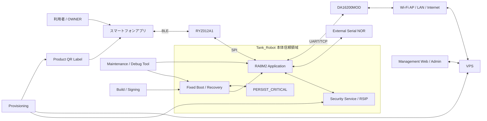

# Tank_Robot セキュリティ横断設計

## 目次

1. 本書の目的
2. 設計方針と適用範囲
3. セキュリティ目標・前提・非目標
4. 保護対象・情報分類
5. システム全体の信頼境界
6. 認証・認可・安全判断の横断原則
7. 所有者・BLE操作の信頼連鎖
8. スマートフォンアプリのセキュリティ境界
9. BLE通信モジュールの信頼境界
10. Wi-Fi・LAN・Wi-Fi通信モジュールの信頼境界
11. Tank_Robot本体－VPSのデバイス信頼連鎖
12. VPS・管理Webアプリ・管理者の信頼境界
13. ファームウェア・固定ブート・リリースの信頼連鎖
14. 設定・OTA・永続データの完全性連鎖
15. 秘密情報・鍵・信頼情報のライフサイクル
16. プロビジョニング・製品ラベル・製造境界
17. 工場初期化・所有者変更・廃棄時の境界
18. デバッグ・保守・有線復旧・物理アクセス
19. 外部入力検証・Replay・Rollback・資源枯渇対策
20. SafetyとSecurityの共存・可用性
21. ログ・監査・プライバシー・セキュリティ事象
22. ソフトウェア部品・ビルド・供給網
23. 脅威分析と攻撃面
24. 残余リスクと将来Hardening候補
25. 要求トレーサビリティ
26. 設計判断・後続事項
27. 他文書へのフィードバック
28. 初版の自己確認結果と引継ぎ条件

---

## 1. 本書の目的

### 1.1 目的

本書の目的は、Tank_Robotシステム全体について、複数のソフトウェア、通信経路、物理インターフェースおよび運用工程をまたいで成立させるセキュリティ境界と信頼関係を、後続の各アーキテクチャ・詳細設計へ展開可能な粒度まで具体化することである。

本書の役割は、**「どこまでを信頼するか」「境界を越えるときに何を確認するか」「誰のidentity・role・権限をどこで確定するか」「秘密情報がどこを通るか」「一つのシステム、機能または通信モジュールが侵害または故障したとき、別の境界まで無条件に信頼を伝播させないために何をするか」**をシステム全体で統合することである。

Tank_Robotでは、安全とセキュリティを独立した目的として扱いながら、セキュリティ処理の失敗・高負荷・外部攻撃によって停止、緊急停止、電源保護、安全監視を妨げないことを最優先の横断原則とする。

### 1.2 対象範囲

本書では特に次を明確にする。

- Tank_Robot本体、スマートフォン、BLE/Wi-Fi通信モジュール、VPS、管理Webアプリのtrust boundary
- 利用者、OWNER、GENERAL、登録済み操作端末、device、管理者、開発・保守者のidentityとroleの関係
- 初回OWNER登録、GENERAL端末追加、OWNER再登録、通常BLE認証、VPSデバイス認証、管理Web認証の独立性
- Secure Boot、firmware署名、SecurityGen、設定HMAC、critical state MAC、Product Data、Trusted Time等のtrust chain
- 各外部入力面に必要な認証、認可、完全性、Replay防止、Rollback防止、値・長さ・状態検証
- 秘密情報が平文となる範囲、保存場所、削除・失効・交換条件
- firmware build/signing、provisioning、製品ラベル、有線復旧を含む開発・保守境界
- 一部のシステム、機能または通信モジュールが侵害または故障しても、別の権限・安全機能へ無条件に信頼が伝播しないための分離
- セキュリティ処理と安全関連処理の優先関係
- 初期製品で受容する残余リスクと将来hardening候補

本書は、Tank_Robotの各機能別基本設計で確定した暗号方式、認証方式、鍵、Secure Boot、OTA、設定検証、永続データ保護等を再定義するものではない。

本書で定めるtrust boundary、認証・認可・Safety Gate分離、credentialの有効化境界、rollback/replayの意味、factory resetのdelete/retain境界、外部入力面のfail-closed条件、security failure時の製品挙動その他、複数機能または外部から見たセキュリティに関する振る舞いを変える契約は基本設計で定める事項とする。実機評価や後続アーキテクチャで変更が必要となった場合は、詳細設計だけで例外化せず、本書または値・方式を定める機能別基本設計へフィードバックする。具体的なRSIP API、byte offset、C構造体、Process/driver関数、mutex、pin、DLM bit等、基本設計上の意味を変更しない内部実装は詳細設計で具体化してよい。

スマートフォンアプリ・VPS・管理Webアプリの後続アーキテクチャ、詳細設計、実装、セキュリティ評価は未完了。

### 1.3 上位文書・関連文書

本書の上位要求は、[`04_Project/10_Tank_Robot/10_製品定義/02_製品目的・製品目標_公開用.md`](../../10_製品定義/02_製品目的・製品目標_公開用.md)および`40_公開用システム要求仕様/`とする。`20_要求仕様`および`30_コア要求仕様`は上位要求として使用せず、公開用要求で削減・変更された機能を過去要求から復活させない。

#### 1.3.1 上位文書

- [`docs/00_project_overview/01_製品目的・製品目標.md`](../../../00_project_overview/01_製品目的・製品目標.md)
- [`docs/20_basic_design/00_Tank_Robot 基本設計について.md`](<../00_Tank_Robot 基本設計について.md>)
- [`docs/20_basic_design/01_システム構成/Tank_Robotシステム構成.md`](../01_システム構成/Tank_Robotシステム構成.md)
- [`docs/20_basic_design/02_システムアーキテクチャ/Tank_Robotシステムアーキテクチャ.md`](../02_システムアーキテクチャ/Tank_Robotシステムアーキテクチャ.md)

#### 1.3.2 関連するシステム要求仕様

- [`docs/10_requirements/04. スマートフォンアプリ.md`](<../../40_公開用システム要求仕様/04. スマートフォンアプリ.md>)
- [`docs/10_requirements/05. BLE接続・認証.md`](<../../40_公開用システム要求仕様/05. BLE接続・認証.md>)
- [`docs/10_requirements/06. 所有者・操作端末管理.md`](<../../40_公開用システム要求仕様/06. 所有者・操作端末管理.md>)
- [`docs/10_requirements/11. Wi-Fi接続.md`](<../../40_公開用システム要求仕様/11. Wi-Fi接続.md>)
- [`docs/10_requirements/12. VPS接続・デバイス認証.md`](<../../40_公開用システム要求仕様/12. VPS接続・デバイス認証.md>)
- [`docs/10_requirements/13. 設定管理.md`](<../../40_公開用システム要求仕様/13. 設定管理.md>)
- [`docs/10_requirements/14. ログ・診断.md`](<../../40_公開用システム要求仕様/14. ログ・診断.md>)
- [`docs/10_requirements/15. OTA更新.md`](<../../40_公開用システム要求仕様/15. OTA更新.md>)
- [`docs/10_requirements/17. 異常検出・復旧.md`](<../../40_公開用システム要求仕様/17. 異常検出・復旧.md>)
- [`docs/10_requirements/18. 永続データ管理.md`](<../../40_公開用システム要求仕様/18. 永続データ管理.md>)
- [`docs/10_requirements/19. データ・プライバシー管理.md`](<../../40_公開用システム要求仕様/19. データ・プライバシー管理.md>)
- [`docs/10_requirements/20. セキュリティ管理.md`](<../../40_公開用システム要求仕様/20. セキュリティ管理.md>)
- [`docs/10_requirements/21. 状態表示・利用者通知.md`](<../../40_公開用システム要求仕様/21. 状態表示・利用者通知.md>)
- [`docs/10_requirements/22. 性能・品質・耐久性.md`](<../../40_公開用システム要求仕様/22. 性能・品質・耐久性.md>)
- [`docs/10_requirements/23. 保守・サポート・製品ライフサイクル.md`](<../../40_公開用システム要求仕様/23. 保守・サポート・製品ライフサイクル.md>)
- [`docs/10_requirements/24. 法令・規格・量産移行.md`](<../../40_公開用システム要求仕様/24. 法令・規格・量産移行.md>)

#### 1.3.3 関連する基本設計

- [`docs/20_basic_design/04_インターフェース・通信/Tank_Robotインターフェース・通信基本設計.md`](../04_インターフェース・通信/Tank_Robotインターフェース・通信基本設計.md)
- [`docs/20_basic_design/05_電源・ハードウェア/Tank_Robot電源・ハードウェア基本設計.md`](../05_電源・ハードウェア/Tank_Robot電源・ハードウェア基本設計.md)
- [`docs/20_basic_design/07_本体ソフトウェアアーキテクチャ/Tank_Robot本体ソフトアーキテクチャ基本設計.md`](../07_本体ソフトウェアアーキテクチャ/Tank_Robot本体ソフトアーキテクチャ基本設計.md)
- [`docs/20_basic_design/08_性能・品質・検証/Tank_Robot性能・品質・検証基本設計.md`](../08_性能・品質・検証/Tank_Robot性能・品質・検証基本設計.md)
- [`docs/20_basic_design/03_機能別基本設計/01_システム状態管理/Tank_Robotシステム状態管理基本設計.md`](../03_機能別基本設計/01_システム状態管理/Tank_Robotシステム状態管理基本設計.md)
- [`docs/20_basic_design/03_機能別基本設計/03_停止・緊急停止管理/停止・緊急停止管理基本設計.md`](../03_機能別基本設計/03_停止・緊急停止管理/停止・緊急停止管理基本設計.md)
- [`docs/20_basic_design/03_機能別基本設計/04_異常管理/異常管理基本設計.md`](../03_機能別基本設計/04_異常管理/異常管理基本設計.md)
- [`docs/20_basic_design/03_機能別基本設計/09_BLE接続・認証/BLE接続・認証基本設計.md`](../03_機能別基本設計/09_BLE接続・認証/BLE接続・認証基本設計.md)
- [`docs/20_basic_design/03_機能別基本設計/10_所有者・操作端末管理/所有者・操作端末管理基本設計.md`](../03_機能別基本設計/10_所有者・操作端末管理/所有者・操作端末管理基本設計.md)
- [`docs/20_basic_design/03_機能別基本設計/11_Wi-Fi接続/Wi-Fi接続基本設計.md`](../03_機能別基本設計/11_Wi-Fi接続/Wi-Fi接続基本設計.md)
- [`docs/20_basic_design/03_機能別基本設計/12_VPS接続・デバイス認証/VPS接続・デバイス認証基本設計.md`](../03_機能別基本設計/12_VPS接続・デバイス認証/VPS接続・デバイス認証基本設計.md)
- [`docs/20_basic_design/03_機能別基本設計/13_設定管理/設定管理基本設計.md`](../03_機能別基本設計/13_設定管理/設定管理基本設計.md)
- [`docs/20_basic_design/03_機能別基本設計/14_ログ・診断/ログ・診断基本設計.md`](../03_機能別基本設計/14_ログ・診断/ログ・診断基本設計.md)
- [`docs/20_basic_design/03_機能別基本設計/15_OTA更新/OTA更新基本設計.md`](../03_機能別基本設計/15_OTA更新/OTA更新基本設計.md)
- [`docs/20_basic_design/03_機能別基本設計/16_永続データ管理/永続データ管理基本設計.md`](../03_機能別基本設計/16_永続データ管理/永続データ管理基本設計.md)
- [`docs/20_basic_design/03_機能別基本設計/17_セキュリティ管理/セキュリティ管理基本設計.md`](../03_機能別基本設計/17_セキュリティ管理/セキュリティ管理基本設計.md)
- [`docs/20_basic_design/03_機能別基本設計/18_製品情報管理/製品情報管理基本設計.md`](../03_機能別基本設計/18_製品情報管理/製品情報管理基本設計.md)
- [`docs/20_basic_design/03_機能別基本設計/19_固定ブート・復旧/固定ブート・復旧基本設計.md`](../03_機能別基本設計/19_固定ブート・復旧/固定ブート・復旧基本設計.md)
- [`docs/20_basic_design/03_機能別基本設計/20_時刻管理/時刻管理基本設計.md`](../03_機能別基本設計/20_時刻管理/時刻管理基本設計.md)
- [`docs/20_basic_design/03_機能別基本設計/21_状態表示・利用者通知/状態表示・利用者通知基本設計.md`](../03_機能別基本設計/21_状態表示・利用者通知/状態表示・利用者通知基本設計.md)

### 1.4 用語

| 用語 | 本書での意味 |
| --- | --- |
| Trust Boundary | 境界の外側から受け取った情報を、そのまま正しいものとして扱わず、内側で使用する前に追加確認を行う境目 |
| Trust Root | それ以上別の情報を用いて通常動作時に正当性を確認しない信頼の起点。ファームウェア検証鍵、VPS trust anchor等 |
| Authentication | **認証**。相手が誰か、どの端末・デバイスか、または提示された認証情報が正しいかを確認すること |
| Authorization | **認可**。認証済みの相手に、要求した操作を実行する権限があるかを確認すること |
| Safety Gate | **安全判断**。認証・認可とは別に、現在のシステム状態、停止、異常、電源、機能固有条件から、その操作を実行して安全かを判断すること |
| Bearer Secret | 値を保持していること自体が認証根拠になる秘密情報。初回OWNER登録QR secret、GENERAL登録one-time ticket、OWNER recovery secret等 |
| Security Domain | 同一の信頼前提・権限で扱う論理領域。本書では物理的なハードウェア隔離を意味しない場合がある |
| Semantic Revision | 同一datasetのデータ内容の版。各データを管理する機能が管理する |
| Persist Revision | 永続データ管理が`(datasetId, logicalSlot)`ごとのA/B複製選択・競合検出に使用する保存処理の版。データ内容の版とは独立する |
| Rollback Floor | 一度確定した後に小さくしないgeneration/revision等の受入れ下限。対象データを管理する機能が管理する |
| Compromise | 攻撃、ソフトウェア故障、認証情報漏えい等により、その対象を信頼できない状態 |

---

---
## 2. 設計方針と適用範囲

### 2.1 基本方針

Tank_Robotの横断セキュリティは次の原則で設計する。

1. **一つの認証結果を別の境界へ自動的に引き継がない。** BLEリンクの暗号化、端末認証、端末の役割、システム全体としての操作可否は、それぞれ別に確認する。
2. **通信モジュールを信頼の起点（Trust Root）にしない。** RYZ012A1およびDA16200MODは通信処理を担当するモジュールとして使用し、長期アプリ認証鍵、VPSデバイス秘密鍵、ファームウェア検証の信頼の起点を正式に管理する機能にはしない。
3. **認証・認可の成功と、安全に実行できることを分ける。** 相手の認証と操作権限の確認に成功していても、本体側のSafety Gateが不成立なら、アクチュエータ操作や管理変更を実行しない。
4. **VPSを遠隔操縦の主体にしない。** VPS／管理Webは設定、ログ、OTA、保守の管理・保守処理を担当し、走行、砲塔・砲身、E-STOP解除を直接指令しない。
5. **秘密情報を平文で扱う範囲を最小限にする。** 平文の秘密情報をログ、表示、VPSの通常データ、デバッグ出力へ出さない。
6. **通信経路の暗号化だけに依存しない。** BLEでは経路別のアプリケーション層proof／HMAC、VPSではmTLS、ファームウェア・設定・重要状態では個別署名／MACを使用する。
7. **古いセッション・認証情報・ファームウェア・論理データの復活を防ぐ。** session、connection generation、ownerDataRevision、wifiCredentialRevision、SecurityGen、highest committed generation/revision等を用途ごとに管理する。
8. **外部記憶媒体の内容を無条件に信頼しない。** 外付けSerial NORや永続保存レコードは、用途に応じて署名、MAC、CRC、version、識別情報、revision floorを確認してから使用する。
9. **同じ版の冗長複製を使う復旧と、古い版へ戻すことを区別する。** 同じlogical revisionの正常な複製を使うことと、古いlogical revisionを再び有効にすることを同一視しない。
10. **安全処理をセキュリティ処理の可用性へ依存させない。** ローカルE-STOP、安全停止、電源保護、システム監視を、TLS、HMAC、ログ、VPS応答待ちによって遅延させない。
11. **結果不明を成功として扱わない。** タイムアウト、電源喪失、通信切断等で認証、保存確定、秘密情報配送の結果が不明な場合は、現在の状態・版・取引情報を照合して結果を確定する。
12. **初期製品の規模を守る。** 専用secure element、TrustZone分割、online自動root rotation、IDS、複雑なfleet IAM等を、必要性が確認できないまま追加しない。
13. **残余リスクを隠さない。** 初期製品では防げない物理攻撃、認証情報漏えい、hardware monotonic counterを採用しないことによる制約、同一privilege domainの限界を明示する。

### 2.2 本書で定義する範囲

- trust boundaryとsecurity domain
- identity・role・authorizationの横断関係
- OWNER/GENERAL/device/admin/firmwareのtrust chain
- external input surfaceと検証責任
- secret/trust informationのsystem-wide data flow
- provisioning、factory reset、maintenance、release signingの境界
- Replay、Rollback、credential activation/revocationの横断意味
- Safety/Security priority
- resource exhaustion、availability attack時の共通方針
- threat modelとresidual risk
- 後続architecture・詳細設計に守らせるsecurity contract

### 2.3 本書で再定義しない範囲

文書ごとの担当範囲と優先関係を次とする。

1. 製品目的・公開用システム要求仕様を上位とする。
2. システム構成・システムアーキテクチャで定めたシステム全体の構成と責任分界を維持する。
3. システム全体のtrust boundary、attack surface、認証・認可・Safety Gate分離、残余riskは本書を横断的な事項の基準文書とする。
4. 暗号アルゴリズム、鍵長、proof canonical data、credential state、RSIP/Wrapped Key、SecurityGen、`K_SEC_STATE_MAC`等はセキュリティ管理基本設計に従う。
5. BLE通信データ形式/session、VPS TLS/HTTPS、設定transaction、OTA/fixed boot、永続化、Product Data、Trusted Timeの機能の意味はBLE接続・認証/VPS接続・デバイス認証/設定管理/OTA更新/永続データ管理/製品情報管理/固定ブート・復旧/時刻管理の各基本設計に従う。
6. Process/Scheduler/ISR/DMA/Queue等の本体ソフトウェア実行基盤への割当ては`07_本体ソフトウェアアーキテクチャ`に従う。
7. physical access、power/reset-safe、service pad等は`05_電源・ハードウェア`に従う。
8. 性能・資源・長時間評価は`08_性能・品質・検証`に従う。
9. 矛盾を暗黙に吸収せず、該当仕様を定める基準文書へフィードバックする。

- RSIP具体API、key serialized format
- BLE GATT、Characteristic UUID、message byte layout
- TLS/HTTPS endpoint/schema
- config package具体byte列
- MCUboot image/TLVの具体offset
- persistent record physical layout
- smartphone UI、VPS class、DB table、management Web画面
- SWD/DLM/ALの最終bit設定
- penetration testの詳細procedure

これらは各担当基本設計または詳細設計に従う。

### 2.4 SecurityとSafetyの関係

Securityは「不正な主体や不正なdataを利用させない」ための境界であり、Safetyは「現在の状態で危険な動作をさせない」ための境界である。

- 認証に失敗した走行commandは実行しない。
- 認証に成功した走行commandでも、E-STOP中・異常中・電源条件不成立なら実行しない。
- physical E-STOPはauthenticationを要求せず、安全側処理を開始する。
- Security機能が故障または使用不能となった場合、通常操作や管理処理を禁止する場合があっても、既存の安全停止・電気保護を無効化しない。
- cryptographic verification失敗を理由として現在の危険出力を維持しない。安全側停止はverification完了を待たない。

---
## 3. セキュリティ目標・前提・非目標

### 3.1 セキュリティ目標

初期製品で保護する中心目標を次とする。

- 未登録端末から通常操作できない。
- GENERAL端末がOWNER専用管理操作を実行できない。
- 初回OWNER登録で、近傍第三者がJust Worksだけを利用してOWNER credentialを取得できない。
- GENERAL追加で、one-time ticketを持たない第三者が新GENERAL credentialを取得できない。
- OWNER再登録で、現在のrecovery secretを持たない主体が新OWNER credentialを取得できない。
- Wi-Fi credential、terminal key、device private key、MAC key等の秘密情報を通常interfaceから取得できない。
- 偽VPSへdeviceが管理情報を送信しない。
- 偽deviceがVPSへ正規deviceとして接続できない。
- 改変・偽造・rollbackされた設定、firmware、credential、Product Data、time trust等を正当な現在状態として利用しない。
- firmware/applicationの侵害または通信攻撃が、安全停止経路を無効化する前提を作らない。
- factory reset後に旧OWNER/GENERAL/Wi-Fi credentialが復活しない。
- debug/maintenance interfaceが通常利用者の権限昇格経路にならない。

### 3.2 攻撃者モデル

| 攻撃者 | 能力の例 | 主な対策 |
| --- | --- | --- |
| 近傍無線攻撃者 | BLE scan/connect、packet送信、radio妨害 | app-layer auth/proof、session/seq、rate limit |
| LAN攻撃者 | Wi-Fi LAN上packet観測・改変・偽server | TLS 1.3、mTLS、server verify |
| Internet攻撃者 | VPS endpointへのscan、通信妨害 | TLS、server-side auth、resource limit |
| 未登録利用者 | smartphone app使用、BLE接続試行 | terminal credential、role |
| GENERAL登録端末 | 正規GENERAL credential所持 | OWNER-only authorizationをdevice側で強制 |
| QR/ticket/recovery secret取得者 | bearer secretの撮影・転送・盗用 | transaction binding、利用期限/one-time、physical/OWNER条件、失効・reprovision |
| 物理アクセス攻撃者 | label撮影、service pad接触、筐体開放 | label配置、debug restriction、wired maintenance手順 |
| 悪意ある/侵害された管理端末 | Management Web sessionを使用 | server authz、audit、device-side validation |
| software supply-chain攻撃 | library/build/release改変 | version管理、offline signing、advisory review |

### 3.3 初期製品で完全防御を目的としないもの

- semiconductor decapsulation、microprobing等の侵襲型hardware attack
- 高度なside-channel/fault injectionによるsecret抽出
- root/jailbreak等で完全侵害されたsmartphone OS上のsecret保護
- 管理者PCまたはVPS root権限が完全侵害された場合の全管理情報保護
- 公衆Internet全体へのDDoS耐性
- RF jammerによるBLE/Wi-Fi availability loss

ただし、これらが発生した場合でも可能な範囲で**不正なactuator commandをfail-openで許可しない**ことを原則とする。

---
## 4. 保護対象・情報分類

### 4.1 分類

| 分類 | 意味 | 例 |
| --- | --- | --- |
| PUBLIC | 公開されてもsecurity rootを失わない | Device ID、製品型式、firmware version、device certificate |
| OPERATIONAL | 改変されると動作・安全性へ影響 | state、設定、Product Data、operation result |
| SENSITIVE | 利用者・network等の非公開情報 | SSID、diagnostic詳細、terminal metadata |
| SECRET | 認証・暗号の秘密値 | terminal key、Wi-Fi passphrase、`K_CONFIG_MAC` |
| TRUST_ROOT | 他dataの正当性判断起点 | `PK_FW_VERIFY`、VPS trust anchor、security MAC key |
| ROLLBACK_SENSITIVE | 過去版復活が権限・安全性へ影響 | SecurityGen、ownerDataRevision、highest committed generation/revision |
| SAFETY_CRITICAL | 改変・遅延が危険な動作へ影響 | stop condition、power protection state、operation availability |

一つのdataが複数分類に該当する場合は、より厳しい取扱いを適用する。

### 4.2 主な保護対象

| 保護対象 | 主分類 | 完全性/rollback | 意味／暗号／物理責任 |
| --- | --- | --- | --- |
| `K_OWNER_REG_AUTH` | SECRET | 必須 | セキュリティ管理/RSIP |
| `K_OWNER_REG_SESSION` | SECRET・一時 | transaction限定 | セキュリティ管理 |
| GENERAL registration ticket | SECRET・一時 bearer | one-time/期限 | 所有者・操作端末管理/セキュリティ管理 |
| `K_GENERAL_REG_AUTH` / `K_GENERAL_REG_SESSION` | SECRET・一時 | transaction限定 | セキュリティ管理 |
| terminal long-term key | SECRET | ownerDataRevision/credential state | 所有者・操作端末管理/セキュリティ管理 |
| OWNER recovery raw secret | SECRET bearer | device raw永続化なし | OWNER app/所有者・操作端末管理/セキュリティ管理 |
| `K_OWNER_RECOVERY_AUTH` / `K_OWNER_REREG_SESSION` | SECRET | recoveryRevision/ownerDataRevision | セキュリティ管理 |
| Wi-Fi credential | SECRET/SENSITIVE | `wifiCredentialRevision` | Wi-Fi接続（意味・revision）／セキュリティ管理（AEAD）／永続データ管理（物理保存） |
| `K_WIFI_STORE` | SECRET | key epoch/nonce uniqueness | セキュリティ管理 |
| VPS device private key | SECRET | credential state | セキュリティ管理/RSIP |
| device certificate | PUBLIC | revision/identity | VPS接続・デバイス認証/セキュリティ管理 |
| VPS trust anchor | TRUST_ROOT | state MAC/trust revision | セキュリティ管理 |
| `K_CONFIG_MAC` | SECRET | config generation | セキュリティ管理 |
| `K_SEC_STATE_MAC` | TRUST_ROOT/SECRET | dataset-domain MAC | セキュリティ管理 |
| `PK_FW_VERIFY` | TRUST_ROOT | fixed boot trust | セキュリティ管理/固定ブート・復旧 |
| 現在の許可済みSecurityGen | ROLLBACK_SENSITIVE | lower禁止 | セキュリティ管理/固定ブート・復旧 |
| highestCommittedGeneration | ROLLBACK_SENSITIVE | lower禁止 | 設定管理（意味・floor）／セキュリティ管理（MAC）／永続データ管理（物理保存） |
| Product Descriptor | PUBLIC/OPERATIONAL | boot compatibility | 製品情報管理 |
| Unit Product Data | OPERATIONAL/SAFETY_CRITICAL | productDataRevision floor | 製品情報管理（意味・floor）／セキュリティ管理（MAC）／永続データ管理（物理保存） |
| Trusted Time / Time Update | OPERATIONAL/ROLLBACK_SENSITIVE | time trust transaction/revision | 時刻管理（意味・floor）／セキュリティ管理（MAC）／永続データ管理（物理保存） |
| firmware image | PUBLIC相当 | signature/hash/SecurityGen | OTA更新/固定ブート・復旧 |
| config package | OPERATIONAL | HMAC/generation/機能側での更新確定 | 設定管理 |
| security event log | SENSITIVE | immutable event/CRC/access control | ログ・診断/セキュリティ管理 |
| Device ID | PUBLIC | identity consistency | 製品情報管理 |

### 4.3 Secretの共通取扱い

- log、diagnostic、display、BLE advertising、HTTP normal payloadへraw secretを出さない。
- 長期secretは可能な範囲でRSIP Wrapped Keyまたは認証付き暗号recordとして保持する。
- unavoidableなraw secret bufferは固定長・短時間・利用後zeroizeとする。
- crash dumpや任意memory dumpをNORMAL_OPERATIONへ設けない。
- secret valueではなくkey ID、revision、存在/有効性、失敗reasonをdiagnosticへ使用する。
- protected ciphertextであっても不要なdump・logを行わない。

---
## 5. システム全体の信頼境界

### 5.1 信頼境界図



矢印はdata flowを示し、矢印があること自体は信頼を意味しない。

### 5.2 Trust Boundary一覧

Trust Boundaryは、**相手側や境界の外側から受け取った情報を、そのまま正しいものとして扱わず、内側で使用する前に必要な確認を行う境目**である。
次の表では、「なぜ無条件に信頼しないか」と「境界の内側で何を確認するか」を対応付けて示す。

| 境界 | 外側を無条件に信頼しない理由 | 内側で必要な確認 |
| --- | --- | --- |
| 利用者→スマートフォンアプリ | 誤操作、別の利用者による操作、端末の侵害 | アプリの現在状態、入力値の範囲、OSによる認証情報の保護 |
| Smartphone→BLE link | 未登録端末、中間者攻撃（MITM）、再送攻撃（Replay） | LE Secure Connections、アプリケーション層の認証／proof、session／seq |
| RYZ012A1→RA8M2 | 通信モジュールの故障・改変、不正な形式のevent | 長さ・状態・generationの検証、アプリケーション層の認証 |
| DA16200MOD→RA8M2 | 通信モジュール自体を信頼の起点にしない | AT／eventの検証、TLSをRA8M2側で終端 |
| LAN/Internet→RA8M2 | 偽のアクセスポイント・サーバー、中間者攻撃（MITM） | TLS 1.3、server certificate、hostname、信頼できる時刻 |
| RA8M2→VPS | デバイスのなりすまし | クライアント証明書／mTLS、Device IDとの対応確認 |
| Management Web/Admin→VPS | 管理者アカウントやセッションの侵害・乗っ取り | サーバー側での認証・認可・監査記録 |
| VPS object→device domain | サーバー不具合、DB設定誤り、サーバー侵害 | config HMAC、firmware signature、generation／revision、設定内容の意味検証 |
| External NOR→RA8M2 | データ改変、古い保存状態の再投入、書込み途中の不完全データ | signature／MAC／CRC／revision／floor、データ管理機能が定める復旧方針 |
| PERSIST 保存用の複製→データ管理機能 | CRCが正常でも、過去のlogical revisionである可能性 | 同じlogical revisionか、rollback floor、データ管理機能による復旧判断 |
| Fixed Boot→Application | 署名済みイメージであるだけでは、起動後の安全成立まで確認できない | signature／hash／product／HW／Boot Interface／SecurityGen、Boot Handoff、起動時の安全条件 |
| Maintenance/Debug→device | 高い権限を持つ物理アクセス | profile、物理的な保守手順、許可項目一覧、秘密情報を外部へ出さないこと |
| Build→Release | 不正なビルド、誤ったビルド | 署名工程の分離、成果物識別情報、承認記録 |
| Provisioning→device/VPS/label | 信頼の起点となる秘密情報・信頼情報の投入 | Device IDとの対応、処理完了を確定する取引、記録内容の検証 |
| Product label→App | 所持しているだけで認証根拠となる秘密情報が漏えいする可能性 | 現物の所持、現在の取引に対応付けたproof、登録完了後に平文を保持しないこと |

### 5.3 同一MCU内も無条件信頼しない

初期製品ではTrustZoneを必須としないため、RA8M2 application内のProcessがhardware privilegeで完全分離されるとは仮定しない。それでもsoftware architectureとして、

- radio transport
- authentication/authorization
- Security service
- 状態・安全判断の管理元
- persistence
- actuator control

の責任を分け、raw secret pointerやgeneric NVM writeを無制限共有しない。

### 5.4 Device IDの位置付け

Device IDは製品情報管理がRA8M2 Unique IDから、同じUnique IDには常に同じ値が得られる規則で生成する公開識別情報（PUBLIC identity）であり、別のNVM文字列をidentityの正式な情報として重複保存しない。

ProvisioningではDevice IDそのものを任意に採番するのではなく、製品情報管理に由来するDevice IDへcertificate、config key、OWNER登録secret等を正しく対応付ける。

---

---
## 6. 認証・認可・安全判断の横断原則

### 6.1 三段階判定

外部の相手から操作要求を受けた場合は、少なくとも次の三段階を分けて確認する。

| 段階 | 確認する内容 |
| --- | --- |
| **認証（Authentication）** | 相手が誰か、どの端末・デバイスかを確認する |
| **認可（Authorization）** | 認証済みの相手に、要求された操作を実行する権限があるかを確認する |
| **安全判断（Safety Gate）** | 現在のシステム状態、E-STOP、異常、電源、対象機能の状態から、その操作を今実行して安全かを確認する |

この三つは別の判断であり、認証に成功しただけでは操作を許可しない。
認証・認可に成功していても、安全判断が不成立なら実行しない。

三段階のいずれかが不成立の場合、通常のアクチュエータ操作または管理変更を成功扱いしない。

### 6.2 通信・書込みの成功を機能処理の成功へ読み替えない

BLE write、TLS handshake、HTTP 2xx、Flash writeの成功は、それぞれ通信または物理的な書込み処理が成功したことを示す。
これらだけでは、その要求が機能として正常に受け入れられ、適用・確定まで完了したことを意味しない。

例えばVPSから設定パッケージを取得した場合は、少なくとも次を別々に確認する。

1. 現在のTLS／mTLS接続が正常であること。
2. HTTP responseが正常であること。
3. config HMACが正常であること。
4. Device ID、schema、generationが正常であること。
5. 各機能の`PREPARE`による意味検証が正常であること。
6. 設定管理機能が更新を正常に確定したこと。

通信の成功と、設定管理機能による最終的な更新成功を同一視しない。

### 6.3 結果状態

管理要求・credential登録・復旧等では、少なくとも`ACCEPTED / COMPLETED / FAILED / UNKNOWN`相当を区別し、request受付だけでCOMPLETEDへしない。

応答が不明な場合は、前回の成功・失敗を推測しない。管理元が保持する現在の状態、版、および処理の対応関係を照合して、結果を確定する。

### 6.4 Safety actionの例外

危険を低減する安全側要求は、通常actuationより強いauthenticationを必須としない場合がある。

- physical E-STOPは認証なしで成立する。
- hardware overcurrent/undervoltage protectionはsoftware authenticationを待たない。
- communication lossによるsafe stopは相手identityの再確認を待たない。

一方、**E-STOP解除、通常操作再開、credential登録、security trust変更等の安全側から権限側へ戻す処理**は、明示的な認証・認可・state条件を必要とする。

---
## 7. 所有者・BLE操作の信頼連鎖

### 7.1 初回OWNER登録Trust Chain

```text
本体の物理登録許可
  +
LE Secure Connections / Just Worksによる暗号化link
  +
製品ラベルQRのDevice ID + 256 bit登録秘密情報
  ↓
current transaction / connectionGeneration / challenge / nonceに結び付けたHMAC追加認証
  ↓
K_OWNER_REG_SESSION導出
  ↓
新OWNER terminal key + recovery secretをAES-256-GCM protected envelopeで配送
  ↓
OWNER AppがOS secret storageへ保存しreceiptを返す
  ↓
所有者・操作端末管理 ownerDataRevision commit
  ↓
セキュリティ管理 OWNER credentialState=ACTIVE
  ↓
所有者・操作端末管理 OWNER terminalSlotState=ACTIVE公開
```

Just Works単独、BLE link接続だけ、QR読取りだけ、secret envelope送信だけのいずれでもOWNERを成立させない。

### 7.2 初回OWNER QR秘密情報の役割

製品QRの登録秘密情報はBluetooth OOB pairing dataではない。物理的に製品を占有しlabelを読める主体と、現在のBLE登録transactionを暗号学的に結び付けるapplication-layer bearer secretとして使用する。

登録完了後、App側raw QR secretを通常credentialとして保持・再利用しない。本体側`K_OWNER_REG_AUTH`はfactory reset後の新しい初回OWNER登録に必要なproduct-specific rootとして保持する。

### 7.3 GENERAL端末追加Trust Chain

GENERAL追加は既存の認証済みOWNERによる管理操作を前提とする。

```text
認証済みOWNER + 所有者・操作端末管理 management transaction
  ↓
本体が128 bit one-time generalRegistrationTicket生成
  ↓
OWNER Appがticket/Device ID/transaction情報を新GENERALへQR等で伝達
  ↓
新GENERAL AppがticketからK_GENERAL_REG_AUTH導出
  ↓
connectionGeneration / challenge / nonce / authAttempt等へbindingしたHMAC proof
  ↓
K_GENERAL_REG_SESSION導出
  ↓
新GENERAL terminal keyをGENERAL_REG_SECRET_ENVELOPE_V1でAES-256-GCM保護配送
  ↓
App secret-store receipt + 所有者・操作端末管理 ownerDataRevision commit
  ↓
セキュリティ管理 GENERAL credentialState=ACTIVE
  ↓
所有者・操作端末管理 GENERAL terminalSlotState=ACTIVE公開
```

新しいGENERAL端末から本体へ、`generalRegistrationTicket`そのものをBLEで平文送信しない。登録チケットそのもの、証明データ、チャレンジ、セッション鍵および分割データは、別の`connectionGeneration`で再利用しない。

導出済みの`K_GENERAL_REG_AUTH`だけは、管理取引に対応付けて保持できる。ただし、所有者・操作端末管理が、同じ`managementTransactionId`と元の60秒期限内で許可する、計画的な接続切替えまたは証明データの検証成功前の再試行に限る。

新しい接続では、新しいチャレンジ、ノンスおよび認証試行を使用する。証明データの検証成功後に接続、配送または受領確認が失敗した場合は、管理取引を取り消して`K_GENERAL_REG_AUTH`も破棄し、新しい管理取引と登録チケットから開始する。

### 7.4 OWNER再登録Trust Chain

OWNER再登録はcurrent recovery secretの所持を認証根拠とし、raw recovery secretをBLEへ送らない。

```text
OWNER recovery secret
  ↓ Device ID bound derivation
K_OWNER_RECOVERY_AUTH
  ↓
managementTransactionId / connectionGeneration / recoveryRevision / challenge / nonceへbindingしたproof
  ↓
K_OWNER_REREG_SESSION導出
  ↓
新OWNER terminal key + 新recovery secretをOWNER_REREG_SECRET_ENVELOPE_V1で保護配送
  ↓
App secret-store receipt
  ↓
new ownerDataRevision commit
  ↓
セキュリティ管理 新OWNER credentialState=ACTIVE / old OWNER・GENERAL credentialState=REVOKED / old recovery auth USED
  ↓
所有者・操作端末管理 新OWNER terminalSlotState=ACTIVE公開 / old OWNER・GENERAL terminalSlotState=REVOKED
```

OWNER再登録でWi-Fi、VPS device identity、config MAC key、security state MAC key、firmware trust、SecurityGen、Product Data、Trusted Timeを変更・巻戻ししない。

### 7.5 認証情報の状態・端末スロットの状態・認証セッション

登録済み端末に関する状態と、それを更新する機能を次のように分離する。

| 状態・対象 | 正式な管理元・唯一の更新主体 | 意味 |
| --- | --- | --- |
| セキュリティ管理 `credentialState` | セキュリティ管理 | terminal credentialの鍵利用状態。`EMPTY / CANDIDATE / ACTIVE / REVOKED` |
| 所有者・操作端末管理 `terminalSlotState` | 所有者・操作端末管理 | 端末登録slotの登録・BLE接続・認証への公開状態。`EMPTY / CANDIDATE / ACTIVE / REVOKED` |
| 認証済み操作セッション／`sessionId` | BLE接続・認証 | 現在のBLE接続で成立した認証セッション |

- protected 秘密情報の配送前後に生成したcredentialを直ちに通常認証へ利用しない。
- App receiptと所有者・操作端末管理の`ownerDataRevision` 機能側での更新確定が成立し、candidate metadataと一致した後だけ、セキュリティ管理が`credentialState=ACTIVE`へ確定する。
- 所有者・操作端末管理はセキュリティ管理の確定結果を確認した後だけ`terminalSlotState=ACTIVE`としてBLE接続・認証へ公開する。
- BLE接続・認証は両状態のACTIVEとHMAC検証成功を確認した後だけ、認証済み操作セッションと`sessionId`を生成する。登録完了通知だけでsessionを自動成立させない。
- `credentialState=ACTIVE`でも`terminalSlotState=ACTIVE`でない端末は通常認証へ公開しない。逆の不整合または状態確認不能でもsessionを成立させず、再照合・異常通知へ進む。
- pre-commit failureはcandidateを削除する。
- post-commit result不明ではold revisionへ推測rollbackせずcurrent revisionを再照会して収束する。
- `credentialState=REVOKED`のcredentialをphysical backup/journalから復活させない。

### 7.6 通常操作Trust Chain

登録後は初回QR secret、GENERAL ticket、OWNER recovery secretを通常操作認証へ繰り返し使用しない。

通常操作はterminalごとのlong-term HMAC keyからcurrent BLE operation sessionを認証し、所有者・操作端末管理のrole/validityとシステム状態管理/停止・緊急停止管理/異常管理/電源・省電力管理/バッテリー・電気安全監視/走行制御/砲塔・砲身制御等のcurrent Safety Gateを組み合わせる。

### 7.7 OWNERとGENERALの分離

GENERALは公開要求/所有者・操作端末管理で許可された通常利用者機能に限定し、OWNER-only管理操作を実行できない。App UIで項目を隠すことだけをsecurity controlとせず、本体側でcurrent terminal roleを必ず再確認する。

### 7.8 登録済み端末失効

terminal credentialを失効した場合、セキュリティ管理が`credentialState=REVOKED`を、所有者・操作端末管理が`terminalSlotState=REVOKED`を各々確定し、BLE接続・認証がcurrent sessionを失効する。old snapshot、same-device app backup、physical redundant copy等からいずれの状態も自動ACTIVEへ戻さない。再利用する場合は新しい登録transactionと新credentialを必要とする。

---
## 8. スマートフォンアプリのセキュリティ境界

### 8.1 基本位置付け

スマートフォンアプリは利用者とのUIとBLE peerを担当するが、Tank_Robotの安全判断・roleの正式な管理元ではない。本体側が認証、role、state、payload、Safety Gateを再検証する。

### 8.2 Credential storage

次の長期credentialはiOS/iPadOSのKeychain等、OSが提供するcredential保護領域を使用することを基本とする。

- terminal long-term key
- OWNER recovery secret
- 必要なdevice/terminal identity metadata

初回QR raw secret、GENERAL registration ticket、registration session key等の一時secretを通常のapp preference、plain file、analytics logへ保存しない。登録transaction終了後に不要となったraw copyを保持しない。

具体Keychain accessibility、device-only/sync、backup/restore policyはスマートフォンアーキテクチャ・詳細設計で確定するが、revoked credentialがbackup restoreによって権限復活しないことを必須とする。

### 8.3 App local stateを権限の判断基準にしない

AppがOWNER/GENERALとlocal表示していても、本体側所有者・操作端末管理のcurrent terminal/role判定を正式な判定結果とする。端末失効、OWNER再登録、factory reset後に古いapp cacheから権限を復元できない。

### 8.4 OS compromiseの限界

root/jailbreak、malware、OS credential store完全侵害等によってterminal key/recovery secretが抽出された場合は、そのcredentialが盗用される可能性がある。初期製品ではremote attestationや専用hardware tokenを必須とせず、terminal revoke/re-register、必要に応じOWNER再登録を基本復旧手段とする。

### 8.5 UI上の状態分離

Appは少なくとも次を混同しない。

- BLE connected
- link encrypted
- terminal authenticated
- 現在のrole
- operation allowed/limited/prohibited
- management request accepted/completed/failed/unknown
- E-STOP release result
- credential registration ACTIVEかpendingか

「接続済み」を「操作可能」または「登録完了」とだけ表示しない。

---
## 9. BLE通信モジュールの信頼境界

### 9.1 Module責任

RYZ012A1はradio、Bluetooth stack、link encryption、GATT transportを担当する。

### 9.2 RA8M2側で維持するSecurity責任

次はRYZ012A1へ委譲しない。

- terminal long-term application keyの正式な管理
- OWNER/GENERAL registry
- 初回OWNER/GENERAL/OWNER再登録時の認証用の証明データの最終成立
- app-layer HMAC verification
- operation authorization
- system operation availability
- stop/fault/power Safety Gate

### 9.3 Module compromise時の影響上限

悪意ある/故障したBLE moduleはpacket drop/delay、connection偽通知、malformed event、availability低下を起こし得る。RA8M2はmodule eventを外部入力としてlength/state/generation validationし、app-layer authenticationを通らない通常操作を実行しない。

module compromiseによるavailability lossは停止・緊急停止管理/BLE接続・認証のcommunication-loss safetyへ連携できるが、radio moduleが独自にmotor/servo outputを制御する経路を設けない。

### 9.4 管理transactionの境界

registration proof、protected secret envelope、Wi-Fi設定fragment等のmulti-message transactionは、現在のmanagement transaction/session/connectionGenerationへbindingする。別のセッション、別transaction、reset前後のfragmentを結合しない。

---
## 10. Wi-Fi・LAN・Wi-Fi通信モジュールの信頼境界

### 10.1 Wi-Fiの用途限定

Wi-FiはVPS管理・保守通信専用とし、走行、砲塔、E-STOP解除等のremote control経路にしない。

### 10.2 DA16200MOD境界

DA16200MODはAP接続・DHCP/IP/DNS/TCP transportを提供するが、VPS server identityを最終判断しない。RA8M2側でTLS 1.3、サーバ証明書、hostname、device certificate/private-key operationを管理する。

### 10.3 LANをuntrusted networkとして扱う

家庭内LAN、AP、routerをtrusted internal networkとして扱わない。LAN上でpacketを観測・改変できる主体が存在しても、管理dataの機密性・完全性はTLSで保護する。

### 10.4 Wi-Fi credential

SSID、security mode、passphraseを含むWi-Fi設定全体をセキュリティ管理の`K_WIFI_STORE`によるAES-256-GCM protected blobとしてRA8M2側へ保持し、DA16200MOD NVRAMをcredentialの正式な保持場所にしない。

`wifiCredentialRevision`、nonce prefix/key epochをrollback/reuse防止へ使用し、現在のrevisionの認証・復号に失敗した場合にold revisionへfallbackして過去networkを再有効化しない。

DA16200MODへ接続のため一時的にcredentialを渡す必要がある場合、保持期間・module内部保存有無をWi-Fi接続の詳細設計で確認し、NVRAMに正式な情報の永続保持先を不要に設けない。

---
## 11. Tank_Robot本体－VPSのデバイス信頼連鎖

### 11.1 Device→VPS Trust

Tank_Robotはcurrent VPS trust anchorを用いてサーバ証明書 chain、接続先hostname、signature、有効期間を検証する。時刻管理のTIME_TRUSTEDが成立しない状態で通常VPS通信を開始しない。

### 11.2 VPS→Device Trust

VPSはdevice クライアント証明書とmTLSによりdevice identityを認証し、certificateと製品情報管理 Device IDの対応を確認する。本体private keyはRSIP Wrapped Keyとして生成・使用し、raw exportしない。

### 11.3 TLS基本契約

VPS接続・デバイス認証/セキュリティ管理の現行契約を使用する。

- TLS 1.3 onlyを基本
- `TLS_AES_128_GCM_SHA256`
- ECDHE P-256
- ECDSA P-256 クライアント証明書
- サーバ証明書/hostname/time validation必須
- TLS Session Resumptionなし

初期クライアント証明書 lifetime 5年と期限90日前保守警告のしきい値はセキュリティ管理の証明書運用policy・基本設計で管理する値とする。VPS接続・デバイス認証は時刻管理の信頼時刻を用いてcurrent certificateの期限を評価し、セキュリティ管理の90日thresholdに基づくwarning判定および期限切れ結果をTLS/mTLS利用可否・状態通知連携へ反映する。CA運用等で値を変更する場合はセキュリティ管理へ戻す。

### 11.4 TIME_TRUSTED喪失

TIME_TRUSTED喪失時は、新規HTTP要求を開始せず、既存TLS/TCP sessionを正常認証済みsessionとして継続利用しない。VPS接続・デバイス認証がrequestを未完了として終了し、`VPS_AUTHENTICATED`/sessionを無効化する。同じTIME_UNTRUSTED条件で自動再接続してcertificate validityを迂回しない。

時刻復旧は時刻管理のwired trusted time transaction等でTIME_TRUSTEDを再確立してから通常VPS通信を再開する。

### 11.5 mTLS後も個別object検証を行う

mTLSはtransport peerを認証するが、次を置換しない。

- config package HMAC/generation
- firmware署名/SecurityGen/signed metadata
- OTA manifest compatibility
- Product Data/critical state MAC/revision
- log batch identity
- device-side state/Safety Gate

これによりVPS application bug、DB誤設定、admin誤操作またはVPS侵害が、そのまま不正firmware/config/actuationへ直結しない構成とする。

### 11.6 VPS unavailable時

VPSへ接続できなくても、localに正常な設定と登録済みBLE credentialがありシステム状態管理/停止・緊急停止管理/異常管理/電源・省電力管理/バッテリー・電気安全監視等のSafety条件が成立する限り、BLE基本操作と本体安全機能をVPS依存で停止させない。

VPSを必要とする設定取得、ログ送信、OTA、通常時刻再同期等は利用不能または保留とする。

---
## 12. VPS・管理Webアプリ・管理者の信頼境界

### 12.1 Management Plane

管理WebアプリとVPSはmanagement planeであり、Tank_Robot runtimeの直接actuator control planeではない。管理者が実行できる操作は設定、ログ、firmware/OTA、device/security管理等に限定する。

### 12.2 管理者認証・認可

Management Webはanonymous管理操作を許可せず、管理者identityを認証しserver-side authorizationを行う。具体account schema、password hash、session方式、MFA採否は管理Web/VPSアーキテクチャで確定するが、client UIでbuttonを隠すことだけを認可としない。

### 12.3 高影響操作

少なくとも次を高影響管理操作としてaudit対象とする。

- config artifact/generationの登録・有効化
- firmware artifact登録・OTA campaign操作
- trust/credential maintenance metadata変更
- device情報の無効化・削除
- security recovery/maintenance result登録

### 12.4 VPS侵害時のdevice-side影響制限

VPS applicationが侵害された場合でも、unsigned firmwareをbootせず、invalid HMAC configを適用せず、Wi-Fi/VPSからactuator direct commandを受け付けず、現在のSafety GateをVPSがoverrideできないことをdevice-side boundaryとして維持する。

### 12.5 Firmware signing keyをVPSへ置かない

firmware signing private keyはOTA更新/セキュリティ管理に従いofflineまたは通常VPS runtimeから分離されたsigning environmentで管理する。VPSは署名済みartifactを配信するrepositoryであり、通常runtimeでrelease signing private keyを保持しない。

---
## 13. ファームウェア・固定ブート・リリースの信頼連鎖

### 13.1 Boot Trust Chain

```text
Fixed Boot trust boundary
  ↓ PK_FW_VERIFY
firmware ECDSA P-256 / SHA-256 verification
  ↓ signed product/hardware/format/Boot Interface metadata
current allowed SecurityGen anti-rollback
  ↓
PRIMARY / trial candidate application branch
  ↓
起動・終了・再起動管理 startup safety checks
  ↓
システム状態管理 normal operation availability
```

署名検証成功だけでは通常操作を許可しない。Boot integrityとruntime safety availabilityを分離する。

### 13.2 署名保護metadata

signed imageには少なくとも次を含める。

- application hash
- productFamilyId/modelId
- hardwareProfileId
- firmware identity
- image format version
- SecurityGen
- `bootInterfaceMin` / `bootInterfaceMax`
- config schema compatibility summary
- persistent format compatibility summary

manifestだけに存在する互換性宣言をboot trust rootとせず、OTA更新/固定ブート・復旧がmanifestとimage内署名保護metadataを照合する。

### 13.3 Fixed Bootのminimum security bootstrap

固定ブート・復旧 fixed bootはapplication Security Process起動前に動作するため、full Security serviceを前提としない。fixed boot trust sectionの`PK_FW_VERIFY`と、永続データ管理 minimum access pathから取得するSecurityGenおよび必要な`K_SEC_STATE_MAC`保護critical stateを利用するminimum security bootstrapだけを持つ。

full TLS、BLE HMAC、Wi-Fi AEADをfixed bootへ持ち込まない。fixed boot verifierと本体アプリケーション側Securityで、image hash、ECDSA P-256、signed metadata、SecurityGen、Product Descriptor、Boot Interfaceの意味を別仕様にしない。

### 13.4 OTA trial/recovery Trust Chain

OTA更新/固定ブート・復旧の現行transactionを使用する。

```text
candidate download + verify
  ↓
INSTALL_REQUESTED
  ↓ fixed boot
PRIMARY_OVERWRITE_STARTED
  ↓ candidate program + post-write verify
TRIAL_ARMED=true / trialAttempted=false
  ↓ branch直前
trialAttempted=true
  ↓ application startup validation
TRIAL_BOOT_VALIDATED
  ↓
settlement / SecurityGen等commit
  ↓
local final result
  ↓
otaResultReportState PENDING→SENT
```

- `TRIAL_ARMED=true && trialAttempted=false`でresetした場合、未実施trialを1回開始する。
- `trialAttempted=true && !TRIAL_BOOT_VALIDATED`では同candidateを再trialせずPREVIOUS recoveryへ進む。
- `TRIAL_BOOT_VALIDATED=true`後のsettlement中resetではcandidateを再検証してsettlementを継続し、PREVIOUSへ推測rollbackしない。
- PREVIOUSも現在の許可済みSecurityGen等のtrust policyを満たすことを必要とする。

### 13.5 Fixed Bootの独立性

fixed boot/recoveryは通常OTA対象外とし、applicationが通常APIからfirmware verify keyやfixed boot code/trustを任意変更しない。

### 13.6 Release Artifact / Signing Environment

Build環境とsigning環境を論理的に分離し、source build成功だけで正式release signatureを付与しない。signing private keyをsource repository、CI log、VPS runtime、firmware package、本体へ平文配置しない。

初期1人開発では大規模HSM基盤を必須としないが、通常開発source treeとrelease signing secretを同一平文ファイル管理しない運用を確立する。

---
## 14. 設定・OTA・永続データの完全性連鎖

### 14.1 Config Trust Chain

```text
VPS mTLS
  ↓
config package receive
  ↓
K_CONFIG_MAC HMAC
  ↓
Device ID / schemaVersion / generation / value validation
  ↓
RAM上の論理STAGED candidate
  ↓
all targets PREPARE + rollback-ready
  ↓
永続データ管理 STAGED_AREAへatomic persist + 保存正常確認
  ↓
APPLY
  ↓
CONFIG_COMMIT_PENDING
  ↓
CONFIG_STORE ACTIVE/PREVIOUS metadata commit + verify
  ↓
highestCommittedGeneration monotonic commit
  ↓
pending finalize/clear
  ↓
GLOBAL_COMMIT result
```

設定管理が更新手順を管理する。永続データ管理はその要求に従い、すべてのPREPAREが成功した後、かつAPPLYより前に、永続STAGEDを物理保存する。HMAC検証と内容の妥当性検証を通過していない候補は、永続STAGEDへの保存にもAPPLYにも進めない。

CONFIG_STOREと`highestCommittedGeneration`を一つのphysical atomic writeとは仮定しない。`highestCommittedGeneration`確定後は旧generationへ戻してcurrent設定を正常化しない。boot時pendingがあれば設定管理がidempotent recoveryを判断する。

### 14.2 Persistent Trustの共通原則

永続dataを「暗号化されている/されていない」だけで分類しない。

- confidentialityが必要なsecret：AEAD/Wrapped Key
- 巻戻し・認可へ影響する重要状態：データ集合ごとにドメインを分離したMAC、内容の版・世代、および管理元が管理する一連の更新処理
- firmware image：signature + hash + signed metadata
- diagnostic/log：CRC/immutable record/access control

永続データ管理による物理的なA/B複製の復旧と、データ内容の旧版への巻戻しを分離する。

| policy | 横断意味 |
| --- | --- |
| `SAME_PERSIST_REVISION_ONLY` | 同じ`persistRevision`の冗長copyだけで保存データの物理的な復旧可能 |
| `OWNER_DECIDES` | PREVIOUS/FACTORY等の意味選択をデータ管理機能が判断 |
| `NO_OLDER_SEMANTIC_REVISION` | old データ内容の版へ自動fallbackしない |

CRC/MACが正常という理由だけで、古いcredential、Wi-Fi設定、SecurityGen、Product Data、Trusted Time等をcurrentへ戻さない。

### 14.3 `K_SEC_STATE_MAC`のdomain分離

一つの`K_SEC_STATE_MAC`を複数critical datasetへ使用する場合、各canonical inputは少なくとも次へbindingする。

- versioned dataset-specific domain separator
- Device ID
- dataset/type ID
- formatVersion
- logical revision/generation
- データ集合の管理機能が定めるcanonical payload

別datasetの正常tagを他datasetへ流用できない構成とする。

対象には少なくとも、SecurityGen、highestCommittedGeneration、highestCommittedProductDataRevision、所有者情報・失効状態、Wi-Fi認証情報の版・鍵の世代、信頼ストアの管理情報、製品情報管理のProduct Data、時刻管理のTrusted Time/Time Update等を含める。

### 14.4 Unit Product Dataのrollback境界

Product Dataの更新では、製品情報管理が`PRODUCT_DATA_COMMIT_PENDING`等を用いた更新処理を管理し、候補スナップショットと`highestCommittedProductDataRevision`を整合させる。一つの物理的な書込みで両者を原子的に更新できるとは仮定しない。

新しいデータ内容の版への更新を確定した後は、最新のスナップショットの破損を理由に、古い校正・製造データへ自動的に戻さない。同じ`persistRevision`を持つ冗長な複製だけを、永続データ管理による物理的な復旧の対象とする。

### 14.5 Trusted Timeの完全性連鎖

時刻管理のTime Update transactionを使用する。

```text
TIME_UPDATE_PREPARED
  ↓
RTC set / readback
  ↓
candidate Trusted Time Record commit
  ↓
Time Update COMMITTED finalize
  ↓
TIME_TRUSTED / TIME_QUALITY / timeSyncGeneration publish
```

Trusted Time RecordとTime Update Recordは別logical datasetであり、一つのphysical writeとは仮定しない。power loss後にcandidate/previousを一意に判断できない場合はTIME_UNTRUSTEDとし、古いlogical time trust revisionを推測採用しない。

### 14.6 Wi-Fi credentialの完全性・機密性

Wi-Fi設定全体をAES-256-GCM protected blobとし、`wifiCredentialRevision`、key/nonce epochを管理する。factory resetではcredential削除に加えて`K_WIFI_STORE`/nonce prefixをrotateし、old ciphertextを再利用可能状態へ戻さない。

### 14.7 OTA Trust Chain

OTA download transport、firmware trust、boot/trial、settlement、result reportを別成功条件として扱う。HTTP response unknown、download failure、signature failure、trial failure、settlement failure、VPS result report pendingを一つの「OTA失敗/成功」へ潰さない。

---
## 15. 秘密情報・鍵・信頼情報のライフサイクル

### 15.1 Lifecycle共通段階

各secret/trust informationについて少なくとも次を定める。

1. generation
2. provisioning/registration
3. storage
4. use
5. rotation/replacement
6. revocation
7. deletion/retention
8. recovery

### 15.2 主な情報のLifecycle

| 情報 | 生成 | 通常保存 | 交換/失効 | factory reset |
| --- | --- | --- | --- | --- |
| `K_OWNER_REG_AUTH` | provisioning環境 | RSIP Wrapped | physical reprovision + label交換 | 保持 |
| `K_OWNER_REG_SESSION` | transaction | 一時secure context | transaction終了 | 破棄 |
| GENERAL registration ticket | セキュリティ管理 TRNG | OWNER→新GENERALへ一時伝達 | one-time/60 s window等所有者・操作端末管理の条件 | 破棄 |
| `K_GENERAL_REG_AUTH/SESSION` | ticketから導出 | 一時secure context | transaction終了 | 破棄 |
| terminal key | terminal登録時 | device Wrapped + phone secure storage | revoke/re-register | 削除 |
| OWNER recovery raw | OWNER登録/再登録 | device raw永続化なし。OWNER app secure storage | new recovery発行 | 利用者側旧値無効 |
| `K_OWNER_RECOVERY_AUTH` | recovery secretから導出 | RSIP Wrapped + revision/state | OWNER再登録でoldをUSED/失効 | 削除 |
| `K_OWNER_REREG_SESSION` | transaction | 一時secure context | transaction終了 | 破棄 |
| Wi-Fi credential | OWNER入力 | AES-256-GCM protected persistent | OWNERが新設定登録 | 削除 |
| `K_WIFI_STORE` | device | RSIP Wrapped | factory reset等でrotate | rotate |
| VPS device private key | provisioning/device key generation | RSIP Wrapped | wired maintenance | 保持 |
| device certificate | provisioning/maintenance | retained public record | wired maintenance | 保持 |
| VPS trust anchor | provisioning | retained trust record | wired maintenance | 保持 |
| `K_CONFIG_MAC` | provisioning | RSIP Wrapped | wired maintenance | 保持 |
| `K_SEC_STATE_MAC` | RSIP key generation | RSIP Wrapped | controlled maintenance only | 保持 |
| `PK_FW_VERIFY` | signing/provisioning trust | fixed boot trust section | wired maintenance | 保持 |
| 現在の許可済みSecurityGen | release/OTA settlement | critical monotonic record | monotonic update | 保持 |
| highestCommittedGeneration | config commit | critical monotonic record | monotonic update | 保持 |
| highestCommittedProductDataRevision | Product Data commit | critical monotonic record | monotonic update | 保持 |
| Product Data / Product Descriptor | manufacturing/maintenance | retained critical/product data | authorized maintenance | 保持 |
| Trusted Time / Time Update | trusted time transaction | retained critical state | 時刻管理 transaction | 保持 |

### 15.3 Key用途分離

少なくとも次を別key/contextとする。

- initial OWNER registration auth
- GENERAL registration auth/session
- OWNER recovery/re-registration auth/session
- terminal operation auth
- Wi-Fi storage encryption
- config authentication
- critical state MAC
- VPS TLS device identity
- firmware signing/verification

### 15.4 Client certificate運用

Device クライアント証明書のprofile、lifetime 5年および期限90日前保守警告のしきい値はセキュリティ管理の証明書運用policy・基本設計で管理する値とする。VPS接続・デバイス認証は時刻管理の信頼時刻を用いたcurrent certificateの期限評価を実行し、セキュリティ管理のthresholdに基づくwarning／期限切れ結果をVPS TLS/mTLS利用・状態通知へ反映する。値の変更はVPS接続・デバイス認証ではなくセキュリティ管理へフィードバックする。

### 15.5 Compromise時の基本復旧

| Compromise | 基本復旧 |
| --- | --- |
| terminal key漏えい | 当該terminal失効・再登録 |
| OWNER recovery secret漏えい | OWNER再登録等で新recovery発行・old recovery auth失効 |
| product QR登録secret漏えい | physical reprovision + product label交換 |
| GENERAL ticket漏えい | 現在のtransaction取消し/期限切れ。長期GENERAL credential発行済みなら当該terminal失効 |
| Wi-Fi credential漏えい | network credential変更・本体へ再登録 |
| VPS device credential異常 | certificate revoke + wired replacement |
| VPS trust anchor異常 | wired trust replacement |
| config MAC key異常 | config配信停止 + wired reprovision + VPS mapping更新 |
| firmware signing private key漏えい | release停止、影響範囲確認、trust root移行を保守手順で実施 |

通常remote commandだけでroot級trustを任意置換できる機能を設けない。

---
## 16. プロビジョニング・製品ラベル・製造境界

### 16.1 Provisioning Environment

Provisioningは通常runtimeより高権限の工程とする。

Device IDは製品情報管理がRA8M2 Unique IDから、同じUnique IDには常に同じ値が得られる規則で生成し、provisioning environmentはそのDevice IDへ次を正しく対応付ける。

- `K_OWNER_REG_AUTH`とproduct QR secret
- VPS device private key/certificate
- VPS trust anchor
- `K_CONFIG_MAC`
- `K_SEC_STATE_MAC`
- `PK_FW_VERIFY`
- SecurityGen初期state
- security profile
- Product Descriptor/manufacturing identityとの対応

`K_SEC_STATE_MAC`のraw値をprovisioning recordへ残す必要はなく、セキュリティ管理のRSIP key generation/secure stateとして成立させる。

### 16.2 Provisioning completion

一部secret/trustだけ投入済みの中間状態をNORMAL_OPERATIONとして使用しない。

少なくとも次を確認後にprovisioning completeを確定する。

- 製品情報管理 Device ID/Product Descriptor整合
- `K_OWNER_REG_AUTH`とQR mapping
- VPS key/certificate/trust mapping
- config/state MAC key利用可否
- firmware verify trust/SecurityGen初期state
- security profile
- crypto self-test
- required persistent metadata初期化

### 16.3 Product QR Label

QRはDevice IDと256 bit初回OWNER登録秘密情報を含むため、単なるpublic serial labelとして扱わない。

- 所有者が本体を物理的に占有して読取り可能
- 通常使用姿勢や公共展示で第三者に容易に撮影されにくい
- 外箱・Web掲載画像等へ登録secretを露出しない
- label交換時にold secretとの混在を避ける

具体位置は電源・ハードウェア/筐体詳細設計で決定する。

### 16.4 QR bearer secret compromise

QR bearer secretが第三者へ複製された疑いがある場合、同じlabelを信用し続ける運用を前提としない。初期製品ではremote root rotationではなくwired/physical reprovisioningとlabel交換を基本とする。

### 16.5 Provisioning記録

provisioning recordにはraw secret valueを不要に残さず、少なくとも次のmetadataを保持する。

- Device ID
- provisioning profile/version
- certificate serial/identity
- trust version
- QR/auth mapping検証結果
- provisioning completion/result
- product/hardware identity
- 実行日時/担当識別情報

---
## 17. 工場初期化・所有者変更・廃棄時の境界

### 17.1 Factory ResetのSecurity目的

factory resetは「すべての製品固有secretを消す」処理ではない。利用者・OWNERに属するcredential/network dataを削除し、製品固有identity、boot trust、anti-rollback floor、manufacturing/calibration/time trust等は保持する。

### 17.2 `RESET_PENDING`を先に確定する

factory resetでcredential削除やkey rotation等のirreversible処理を開始する前に、所有者・操作端末管理/永続データ管理の`RESET_PENDING`を永続確定する。

power loss/resetが途中で発生した場合は次回起動でreset transactionを再開し、old OWNER/Wi-Fi stateへ推測rollbackしない。完了確認後にpendingをclearする。

### 17.3 Delete / Rotate / Retain境界

**削除・失効するもの**

- OWNER/GENERAL terminal registry・terminal keys・credential state
- 現在のBLE operation/session credential
- `K_OWNER_RECOVERY_AUTH`、recovery revision/status
- Wi-Fi credential blob
- GENERAL ticket、registration session keyその他transient registration context
- user-specific management state/config valueは各事項を定める文書のfactory reset policyに従う

**rotateするもの**

- `K_WIFI_STORE`
- Wi-Fi nonce prefix/key epoch等、old Wi-Fi ciphertext reuseを防ぐstate

**保持するもの**

- 製品情報管理に由来するDevice ID / Product Descriptor
- product-specific `K_OWNER_REG_AUTH`
- VPS device private key/certificate/trust anchor
- `K_CONFIG_MAC`
- `K_SEC_STATE_MAC`
- `PK_FW_VERIFY` / fixed boot trust
- 現在の許可済みSecurityGen
- `highestCommittedGeneration`
- `highestCommittedProductDataRevision`
- Product Data/manufacturing/calibration
- 時刻管理 Trusted Time Record / Time Update Recordおよび有効なtime trust metadata
- rollback-sensitive counter/floorのうちその事項を定める文書がretainを要求するもの
- wired recovery capability / provisioning trust metadata

### 17.4 Old OWNER / credential復活禁止

factory reset後にold OWNER/GENERAL credential、old Wi-Fi credential、old recovery authをbackup/journal/physical redundant copyから自動復元しない。新OWNERは初回OWNER登録trust chainを最初から実行する。

### 17.5 OWNER再登録とFactory Resetを区別する

OWNER再登録はownerDataRevisionのcredential replacementでありfactory resetではない。

OWNER再登録ではold OWNER/GENERAL terminal keysとold recovery authを失効し、新OWNER key/recovery authを確定する。一方、`K_OWNER_REG_AUTH`、Wi-Fi設定/`K_WIFI_STORE`、VPS credential、config/state MAC key、firmware trust、SecurityGen、Product Data、Trusted Time等は変更しない。

### 17.6 廃棄・譲渡

製品譲渡ではfactory resetを基本とし、利用者固有data/credential削除完了を確認してから新OWNER登録する。

製品廃棄時のroot secret物理破壊レベルは初期製品で高度tamper-resistant disposalまで必須としないが、通常利用者dataを残したまま第三者へ譲渡しない手順を定める。

---
## 18. デバッグ・保守・有線復旧・物理アクセス

### 18.1 物理Security Boundary

電源・ハードウェア基本設計と整合し、少なくとも次を高権限physical interfaceとして扱う。

- SWD/JTAG
- maintenance UART
- wired recovery SCI
- MD/boot mode
- RESET
- provisioning/service pad
- enclosure内部のdebug pad

### 18.2 Profile別方針

| Profile | Debug/Program | Credential |
| --- | --- | --- |
| DEVELOPMENT | 開発に必要な範囲で許可 | production secretを使用しない |
| EVALUATION | 評価に必要な範囲へ限定 | evaluation credential |
| NORMAL_OPERATION | 不要debug/programを無効またはアクセス制限 | production credential |

### 18.3 Maintenance UART

通常の保守UARTは参照専用を基本とする。任意メモリの読出し・書込み、鍵の元の値の出力、起動用信頼情報の変更、所有者鍵の登録、アクチュエータへの直接指令は提供しない。

### 18.4 Wired Recovery

wired recoveryは通常利用者向けsoftware commandから入れない。physical boot mode、service pad、official programming tool等を必要とする。

一つの保守transactionとして少なくとも次を行う。

1. actuator/power safety確認
2. physical service access
3. 正規image/trustの選択
4. programming
5. verify
6. 必要なreprovisioning
7. normal boot
8. identity/security state確認
9. service record

### 18.5 Trust Replacement

firmware verification key、VPS trust anchor、device credential、product QR root等のroot級変更は、通常OWNER BLE操作、VPS config、通常OTAから任意に変更できない。

### 18.6 Trusted Time maintenance

TIME_TRUSTED喪失からの復旧は時刻管理のTime Update transactionを使用する。通常maintenance UARTへ汎用`TIME SET`を追加してcertificate validityを迂回しない。

### 18.7 Physical access residual

筐体を開けてservice padへ長時間アクセスできる攻撃者に対する完全tamper resistanceは初期製品の目標外とする。その代わりNORMAL_OPERATION debug restriction、secret non-export、service procedure、残余risk明示で対応する。

---
## 19. 外部入力検証・Replay・Rollback・資源枯渇対策

### 19.1 全外部入力を不信として扱う

次の入力は、送信元が正規に見える場合でも使用前に担当機能で検証する。

- BLE packet/message/fragment
- RYZ012A1 event
- DA16200MOD AT/event
- Wi-Fi/TCP byte stream
- HTTPS response
- config package
- OTA manifest/image
- external Serial NOR record
- maintenance command/input
- QR payload
- physical service mode input

### 19.2 検証層

必要な検証を次へ分ける。

- length/count/offset/type
- protocol state
- session/transaction identity
- cryptographic integrity/authentication
- version/product/hardware compatibility
- 内容として許容する値の範囲
- 現在の認可状態
- 現在のシステム／Safety条件

### 19.3 Replay防止

| 用途 | 主なReplay防止 |
| --- | --- |
| BLE operation | sessionId + commandSeq + connectionGeneration |
| initial OWNER registration | management transaction + connection + challenge/nonce/auth attempt |
| GENERAL registration | one-time ticket + management transaction + connection/challenge/nonce/attempt |
| OWNER re-registration | recoveryRevision + management transaction + connection/challenge/nonce/attempt |
| config | generation + `highestCommittedGeneration` |
| Wi-Fi credential | `wifiCredentialRevision` + key/nonce epoch |
| firmware | SecurityGen + install/trial state |
| Product Data | productDataRevision + `highestCommittedProductDataRevision` |
| Trusted Time | Time Update transaction + trusted-time revision/state |
| persistent security state | データ集合固有の版・世代、`K_SEC_STATE_MAC`、および管理元が管理する一連の更新処理 |

### 19.4 RollbackとReplayを区別する

通信packetの再送と、永続snapshot/firmware/configを過去logical revisionへ戻す攻撃を同じ対策で解決しない。

physical redundant copyが同じlogical revisionであることを確認して復旧することはrollbackではない。old logical revisionをcurrentへ戻す場合はデータ管理機能が明示的に許可するpolicyを必要とする。

### 19.5 HTTP retryとdomain transaction

VPS接続・デバイス認証の規則に従い、状態を変更するHTTP要求の送信後に応答が不明となっても、通信層は同じ要求を暗黙に再送しない。処理を管理する機能が再試行を判断する場合は、用途別の処理・重複実行防止の情報と、新しいHTTP要求の送信試行を区別する。

### 19.6 Resource Exhaustion

攻撃入力によってheap/queue/session/logが無制限に増加しない構成とする。

- request/message/bufferに固定上限
- 未認証peer/registration transactionの同時処理数を制限
- HMAC/TLS等の高価な処理前に可能な軽量syntax/length確認
- auth失敗のrate limit/backoff
- oversized request拒否
- log floodの抑制/集約
- `malloc/free`を通常本体処理で使用しない

現行セキュリティ管理の初期resource boundであるSecurity request descriptor 8 slot、active registration context 1 transaction、small crypto input copy最大256 byte、secure transient aggregate 96 byteを結合評価する。これらを変更する場合はセキュリティ管理へ戻し、resource不足を理由にsecret保護やSafety優先を弱めない。

### 19.7 Rate limitのSafety影響

rate limit/security backoffによってphysical E-STOP、hardware protection、既に成立したsafe stopを遅延させない。

---
## 20. SafetyとSecurityの共存・可用性

### 20.1 概念優先度

1. hardware protection / force-off / physical E-STOP
2. software safe stop / emergency-stop processing / electrical safety monitoring
3. critical state / real-time control / SystemMonitor
4. BLE authentication / normal local response
5. TLS / VPS / config / OTA crypto
6. log / audit / management background

これは製品上の優先意味であり、具体Process priority numberそのものではない。本体ソフトウェアアーキテクチャのP0～P3、Safety Latch、bounded Queue/Slot、cooperative Schedulerへ割り当てる。

### 20.2 Security failure時のFail-safe

Security serviceが正常利用できない場合、

- 新しいauthenticated operation/session/registrationを成立させない。
- config/OTA/critical state verificationを成功扱いしない。
- secretを平文fallbackで利用しない。
- credential/revocation/rollback-sensitive stateを安全に判断できない場合は権限を広げない。
- 異常管理/システム状態管理へ必要な利用不可・異常情報を提供する。

一方で、既に必要なstop、E-STOP、power protectionをSecurity service復旧待ちにしない。

### 20.3 Long-running Crypto

firmware hash、signature verify、TLS handshake等の長い処理はSafety-critical processingを長時間blockしない。No-RTOS cooperative実行基盤ではchunk/stream、bounded processing、async hardware engine、低い機能優先度等を使用し、Processが外部応答をbusy waitしない。

### 20.4 Communication DoS

BLE/Wi-Fi/VPS攻撃で通信が利用不能となっても、local physical E-STOP、SystemMonitor、battery/electrical protection、現在のactuator safe stop pathを維持する。BLE継続操作通信が失われた場合は停止・緊急停止管理/BLE接続・認証のsafe stopへ移行する。

### 20.5 Security event flood

security eventが大量発生してもlog記録・VPS送信がSafety処理より高優先にならない。repeat suppression/aggregationをログ・診断の契約に従って使用し、重要security状態そのものをsilent dropしない。

---
## 21. ログ・監査・プライバシー・セキュリティ事象

### 21.1 記録対象

少なくとも次をsecurity event候補とする。

- terminal authentication success/failure
- repeated auth failure/rate limit
- initial OWNER / GENERAL / OWNER re-registration proof success/failure
- terminal registration/revocation
- mTLS auth failure
- サーバ証明書/time trust failure
- config MAC/generation/floor failure
- firmware signature/SecurityGen/fixed boot trust failure
- critical state MAC / rollback-sensitive state不整合
- Product Data / time trust integrity failure
- debug/maintenance/recovery実行
- provisioning result
- trust/credential replacement

### 21.2 Event severityの横断方針

セキュリティ管理/ログ・診断の分類を使用する。

**IMPORTANTを基本とするもの**

- firmware trust/SecurityGen/fixed boot trust failure
- mandatory Security/RSIP/TRNG unavailable
- trust store/critical state MAC failure
- revoked/rollback-sensitive stateを安全に決定できない状態
- VPS credential/trust replacement failure等により管理通信を継続不能となる状態

**NORMAL/SECURITYを基本とするもの**

- 単発BLE auth mismatch
- 単発initial OWNER/GENERAL/OWNER再登録時の認証用の証明データ failure
- 通常のreplay/old-session/invalid-input rejection

repeated-auth上限到達、credential/auth key利用不能、異常管理のimpact上昇等でIMPORTANTへ昇格できる。event IDの具体値はログ・診断/セキュリティ管理の詳細設計で固定する。

### 21.3 記録禁止情報

次をrawで記録しない。

- product registration secret
- GENERAL registration ticket
- terminal key
- OWNER recovery raw secret
- `K_OWNER_RECOVERY_AUTH`
- Wi-Fi passphrase
- VPS private key
- config/state MAC key
- TLS session secret
- registration session key
- QR payload全体

### 21.4 AuditとSecurity Monitoringを区別する

初期製品では高度なIDS/SIEMを必須としない。logは主に、誰/どのdevice/operation種別、success/failure、reason category、time/order、configuration/firmware identityを後から追えるaudit evidenceとして設計する。

### 21.5 Privacy

security目的だからという理由だけで利用者情報を過剰収集しない。個人識別情報、network credential、device metadataの収集/保存/送信は公開用システム要求仕様「19. データ・プライバシー管理」に従う。

---
## 22. ソフトウェア部品・ビルド・供給網

### 22.1 管理対象

セキュリティ管理のcomponent inventoryをsystem-wide release構成へ取り込む。

- FSP/RSIP
- Mbed TLS
- MCUboot
- compiler/toolchain
- BLE module firmware
- Wi-Fi module firmware
- smartphone app build
- VPS/backend build
- management Web build
- provisioning/release tool

### 22.2 Version固定と再現性

releaseまたは評価結果が、使用したcomponent version、設定、build/signing artifactを再現できる状態にする。「最新versionであること」だけをsecurity判断根拠にしない。

### 22.3 Advisory Review

release時、主要dependency更新時、既知問題が報告された場合にsecurity advisoryを確認する。初期製品で自動vulnerability platformを構築することを必須としない。

### 22.4 Build ArtifactとSecretの分離

source repository、CI artifact、public release packageへ、signing private key、config/state MAC key、registration secret一覧、device private key、production Wi-Fi credentialを含めない。

### 22.5 Smartphone/VPS/Web

後続アーキテクチャではplatform/framework標準のsecurity update、dependency管理、secure configurationを使用し、独自暗号方式を追加しない。

---
## 23. 脅威分析と攻撃面

### 23.1 攻撃の入口・対象の一覧

| 攻撃の入口・対象 | 主な脅威 | 基本対策 | 残る影響 |
| --- | --- | --- | --- |
| BLEアドバタイズ・接続 | 未許可の接続、DoS | 認証前の権限制限、資源使用量の上限 | 無線妨害によるDoSは可能 |
| BLE操作メッセージ | なりすまし、再送攻撃、改ざん | 端末HMAC、セッション・連番・接続世代の確認、役割に応じた権限 | 端末鍵が盗まれた場合の、その端末へのなりすまし |
| 初回OWNER登録 | 近傍からの中間者攻撃、別個体のQRコードの使用 | 物理的な許可、QRの秘密情報による認証、登録処理との対応付け、保護された秘密情報の配送 | QR内の秘密情報の物理的な漏えい |
| GENERAL登録 | チケットの盗用・再送攻撃、別の登録処理との混同 | OWNER条件、一回限りのチケット、登録処理・接続との対応付け、保護された鍵配送 | 有効期間中のチケットが漏えいし、所持者に利用される可能性 |
| OWNER再登録 | 所有者復旧用の秘密情報の盗用・再送攻撃 | 復旧用の認証、版・登録処理との対応付け、新しい秘密情報の保護配送、旧認証情報の失効 | 所有者復旧用の秘密情報の漏えい |
| Wi-Fiアクセスポイント・LAN | 盗聴、中間者攻撃、不正なアクセスポイント | TLS/mTLS、サーバー検証 | Wi-Fiが利用できなくなる可能性 |
| DA16200MOD | 通信処理の侵害 | RA8M2でのTLS処理、秘密鍵をモジュールへ保持しない | DoS、通信量・タイミングの解析 |
| VPS接続先 | なりすまし | 信頼の基点、ホスト名、TLS、TIME_TRUSTEDの確認 | 信頼の基点の侵害 |
| 管理Web | アカウント・セッションの侵害 | 認可・監査、本体側の入力検証 | 管理者の権限内での悪用 |
| 設定配送 | 改ざん・巻戻し | HMAC、設定世代の下限、機能側での更新確定 | `K_CONFIG_MAC`の侵害 |
| OTAイメージ | 不正または古いイメージ | 署名、SecurityGen、製品・ハードウェア・Boot Interfaceの確認 | 署名鍵の侵害 |
| Product Data | 古い校正・付随情報への巻戻し | 状態保護用MAC、productDataRevisionの下限、管理元による更新確定 | 重要状態全体を、整合した過去の保存内容へ物理的に戻す攻撃（§24.1 RISK-02） |
| Trusted Time | 過去の時刻信頼情報・時刻更新処理への巻戻し | 状態保護用MAC、時刻更新処理、古い論理版の自動採用禁止 | RTCハードウェアや物理保存内容に対する攻撃 |
| 外付けNOR | ビット改ざん、過去データの再使用、書込み途中のデータ | 署名・MAC・CRC・版の確認、保護された状態情報への重要な下限値の保持 | DoS。重要状態全体の巻戻しは別のリスクとして扱う |
| 保守用UART | 秘密情報の抜出し、コマンドの注入 | 参照専用、秘密情報をそのまま出力しない、物理アクセスを必要とする | 物理アクセスによる攻撃 |
| SWD/JTAG | メモリの読出し・書換え | NORMAL_OPERATIONでの制限 | 物理的な侵襲による制限の迂回 |
| 有線復旧 | 未許可の再書込み、信頼情報の置換 | 物理的な保守アクセス、保守手順、検証 | 機体を物理的に所持する攻撃者による攻撃 |
| 製品QR | 秘密情報の撮影・複製 | 隠された位置への配置、製品の物理的な所持 | 所持者が利用できる秘密情報の漏えい |
| サプライチェーン（Supply chain） | 不正な依存ソフトウェア・ビルド | 版と脆弱性情報の管理、署名処理の分離 | 信頼しているツールの侵害 |

### 23.2 ThreatからSafetyへの波及

Security attackが次のSafety影響へ変換される経路を特に確認する。

- forged command → unexpected actuator motion
- communication DoS → stale operation continuation
- malicious/rollback config → unsafe parameter
- stale Product Data → invalid calibration
- malicious/rollback firmware → safety logic bypass
- CPU/resource exhaustion → control deadline miss
- power/RF attack → reset during actuation
- credential/revocation rollback → unauthorized operation

各経路について、停止・緊急停止管理/電源・省電力管理/バッテリー・電気安全監視/電源・ハードウェア等のsafe-state mechanismがsecurity controlとは別に存在することを確認する。

### 23.3 Threat Model更新条件

次の場合は本書のthreat modelを見直す。

- remote operationを追加する
- クラウド側へ所有者アカウントを追加する
- 新radio/interfaceまたはdevice-to-device通信を追加する
- TrustZone/secure element/hardware monotonic counterを追加する
- online root/credential rotationを追加する
- smartphone/VPS/Web architectureを大きく変更する

---
## 24. 残余リスクと将来Hardening候補

### 24.1 初期製品で明示受容する残余リスク

#### RISK-01 製品QRの登録秘密情報の漏えい

製品ラベルの登録秘密情報を第三者が物理的に取得した場合、秘密情報の再設定・ラベル交換まで、初回OWNER登録の追加認証の強度が低下する。対象の登録処理と対応付ける対策だけでは、持っていることが認証根拠となる秘密情報そのものの漏えいを無効化できない。

#### RISK-02 ハードウェアによる単調増加カウンタの非採用

通常のソフトウェア経路での巻戻しと、一部のデータだけを過去の内容へ差し替える攻撃は、次の対策で防止する。

- 設定管理・製品情報管理・時刻管理等のデータ管理機能が、内容の世代・版の下限を管理し、古い内容の自動採用を禁止する。
- セキュリティ管理が、データ集合ごとに認証対象を区別するMACを提供する。
- 永続データ管理が、データ管理機能の指定した方針を機械的に適用する。

一方、デバッグ・書込み制限を物理的に迂回し、重要なMRAM領域の全体を**相互に整合した過去の保存内容へ一括復元する高度な攻撃**を、専用のハードウェアによる単調増加カウンタなしに、時系列上完全に検出することはできない。この残余リスクは、外付けNOR単体の巻戻し対策の不足とは区別する。

#### RISK-03 TrustZoneを必須としないことによる隔離の限界

初期製品では、TrustZoneによるセキュア／非セキュア領域の分離を必須としない。そのため、正しく署名されたアプリケーションの内部で任意コードの実行が成立した場合、モジュール間の隔離には限界がある。

#### RISK-04 オンラインでの最上位の鍵・認証情報の交換を採用しない

VPSの信頼情報、デバイス認証情報、設定用MAC鍵、ファームウェアの信頼の基点となる情報の交換には、有線保守が必要である。緊急時にも、遠隔から全機体の最上位の鍵・認証情報を一括交換することはできない。

#### RISK-05 スマートフォンの侵害

端末鍵またはOWNERの復旧用秘密情報を保持するスマートフォンのOSが完全に侵害された場合、認証情報の盗難を完全には防げない。端末の失効・再登録、OWNER再登録を基本の復旧手段とする。

#### RISK-06 保守用の物理アクセス

長時間の物理アクセスと高度なデバッグ保護の迂回に耐える耐タンパー筐体は、初期製品の必須要件としない。

### 24.2 将来の保護強化の候補

- TrustZoneによる、セキュリティサービスと秘密情報へのアクセスの分離
- セキュアエレメント／ハードウェア単調増加カウンタ
- スマートフォンの端末固有鍵／ハードウェアで保護された鍵の利用強化
- オンラインでの証明書・信頼情報の更新
- 管理WebのMFA
- 集中型のセキュリティ監視／IDS
- 開封・改変の痕跡が残るラベル・筐体
- 製造用HSM・鍵書込み基盤
- SBOM・脆弱性スキャンの自動化

これらは必要性・運用規模・教育価値を評価して採否を決める。

---
## 25. 要求トレーサビリティ

### 25.1 対応表の考え方

本書は横断基本設計であるため、公開用システム要求仕様「20. セキュリティ管理」の暗号方式・鍵長・proof canonical data等の1件単位詳細対応はセキュリティ管理基本設計に従う。本章では複数のシステム、機能または通信経路をまたぐsecurity requirement groupと本書の主対応箇所を示す。

### 25.2 公開用システム要求仕様「20. セキュリティ管理」要求群との対応

| 公開用システム要求仕様「20. セキュリティ管理」要求群 | 本書の主対応 |
| --- | --- |
| `SYS-SEC-001～004` 基本原則・責任 | 2章、5章、6章、20章 |
| `SYS-SEC-010～014` 認証・認可・権限 | 6章～12章 |
| `SYS-SEC-020～027` BLE/terminal/OWNER credential | 7章～9章、15章～17章 |
| `SYS-SEC-040～041` Wi-Fi credential | 10章、14章、15章 |
| `SYS-SEC-050～054` VPS device authentication | 11章、12章、15章 |
| `SYS-SEC-060～061` external input/resource | 19章、20章 |
| `SYS-SEC-070～079` key/secret/trust lifecycle | 4章、13章～18章 |
| `SYS-SEC-090～091` config authentication | 14章、19章 |
| `SYS-SEC-100～109` firmware/boot/rollback | 13章、14章、18章、22章 |
| `SYS-SEC-120～122` persistent security data | 14章、15章、17章、19章 |
| `SYS-SEC-130～131` debug/maintenance | 18章、24章 |
| `SYS-SEC-140～142` input validation/availability | 19章、20章、23章 |
| `SYS-SEC-150～152` security abnormal/recovery | 20章、21章、24章 |
| `SYS-SEC-160～161` log/security event | 21章 |
| `SYS-SEC-170` trust/credential maintenance | 15章、18章、24章 |

### 25.3 関連要求・基本設計との対応

| 関連領域 | 主な対応 |
| --- | --- |
| 公開用システム要求仕様「04. スマートフォンアプリ」/公開用システム要求仕様「05. BLE接続・認証」 App・BLE session/replay | 6章～9章、19章 |
| 公開用システム要求仕様「06. 所有者・操作端末管理」 initial OWNER/GENERAL/OWNER re-registration/revocation | 7章、15章、17章 |
| 公開用システム要求仕様「11. Wi-Fi接続」 Wi-Fi credential/network boundary | 10章、14章、15章 |
| 公開用システム要求仕様「12. VPS接続・デバイス認証」 mTLS/HTTPS/Device ID/time trust | 11章、12章 |
| 公開用システム要求仕様「13. 設定管理」 config generation/機能側での更新確定 | 14章、19章 |
| 公開用システム要求仕様「14. ログ・診断」 security log/secret non-output | 21章 |
| 公開用システム要求仕様「15. OTA更新」 signed OTA/trial/recovery | 13章、14章、18章 |
| 公開用システム要求仕様「18. 永続データ管理」 persistent atomicity/rollback | 14章、17章、19章 |
| 製品情報管理 Product Data | 14章、17章、23章 |
| 時刻管理 Trusted Time | 11章、14章、17章、18章、23章 |
| 公開用システム要求仕様「19. データ・プライバシー管理」 privacy/data handling | 4章、21章 |
| 公開用システム要求仕様「22. 性能・品質・耐久性」 performance/resource | 19章、20章、26章 |
| 公開用システム要求仕様「23. 保守・サポート・製品ライフサイクル」 maintenance/lifecycle | 15章、18章、22章 |
| 公開用システム要求仕様「24. 法令・規格・量産移行」 provisioning/manufacturing | 16章、18章、22章 |

### 25.4 上位要求との矛盾

本レビュー時点で、公開用システム要求仕様を変更しなければ成立しない新しい矛盾は確認していない。本書は完成済みセキュリティ管理のcrypto/key方式を変更せず、後続機能別基本設計10～21で具体化されたtrust transactionを横断統合する。

---
## 26. 設計判断・後続事項

### 26.1 設計判断

| ID | 設計判断 |
| --- | --- |
| D-01 | セキュリティ管理と本横断設計を分離し、crypto/key/proof詳細はセキュリティ管理、system-wide boundaryは本書をそれぞれの基準文書とする |
| D-02 | RYZ012A1/DA16200MODをtrust rootとしない |
| D-03 | authenticated、authorized、Safety-allowedを別判定とする |
| D-04 | VPS/管理Webをmanagement planeとしremote actuator controlを許可しない |
| D-05 | initial OWNERをphysical permit + Just Works encrypted link + QR proof + protected credential delivery + app receipt + revision commitで成立させる |
| D-06 | GENERAL追加をexisting OWNER + one-time ticket proof + protected key delivery + app receipt + revision commitで成立させる |
| D-07 | OWNER再登録をrecovery proof + protected new OWNER/recovery delivery + revision commitで成立させ、old OWNER/GENERALを失効する |
| D-08 | セキュリティ管理の`credentialState`と、所有者・操作端末管理の`terminalSlotState`は、別々の状態としてそれぞれの機能が更新する。所有者・操作端末管理による保存確定 → セキュリティ管理による認証情報のACTIVE確定 → 所有者・操作端末管理による端末枠のACTIVE公開 → BLE接続・認証のセッション、の順序を維持する |
| D-09 | smartphone側長期credential/recovery secretをOS secure storageへ置き、local role cacheを権限の判断基準にしない |
| D-10 | LAN/APをtrusted networkとせずRA8M2終端TLS 1.3/mTLSを使用する |
| D-11 | TIME_TRUSTED喪失時にexisting VPS sessionを継続利用しない |
| D-12 | mTLS正常後もconfig HMAC、firmware signature、critical state MAC、revision/floor検証を維持する |
| D-13 | firmware signing private keyをVPS runtimeから分離する |
| D-14 | 固定ブート・復旧 fixed bootはminimum security bootstrapだけを持ちfull Security serviceを前提としない |
| D-15 | OTA unattempted trial、attempted failure、validated settlementを別trust stateとして扱う |
| D-16 | 設定の確定は、設定管理が一連の処理として管理する。CONFIG_STOREと設定世代の下限値を、一つの物理的な書込みで原子的に更新できるとは仮定しない |
| D-17 | physical redundant recoveryとold logical revision fallbackを分離する |
| D-18 | `K_SEC_STATE_MAC`をdataset-specific domainへ分離する |
| D-19 | Product Data/Trusted Timeをrollback-sensitive dataとして扱い、old logical revisionへ暗黙fallbackしない |
| D-20 | 工場出荷状態への初期化では、`RESET_PENDING`を先に保存・確定する。認証情報の削除・鍵の更新中に電源を失っても、旧所有者の状態へ戻らない |
| D-21 | factory resetでuser credentialを削除し、product/device trust、rollback floor、Product Data、Trusted Timeを保持する |
| D-22 | trust root級交換を通常remote commandから行わずwired maintenanceを基本とする |
| D-23 | product QR secretをpublic serial labelと区別する |
| D-24 | DEVELOPMENT/EVALUATION/NORMAL_OPERATIONでdebug/credential profileを分離する |
| D-25 | security処理をSafetyより低い機能優先とし、crypto/log/VPSでsafe stopをblockしない |
| D-26 | initial productでTrustZone、secure element、hardware monotonic counter、online root rotation、IDSを必須にしない |
| D-27 | hardware monotonic counter非採用時のfull critical snapshot rollbackを残余riskとして明示する |
| D-28 | firmware signing/build/provisioningを通常runtimeとは別の高権限security boundaryとして扱う |

### 26.2 詳細設計事項

1. Security service APIとcaller authorization、本体ソフトアーキテクチャ基本設計 Process/Platform mapping。
2. iOS/iPadOS Keychain accessibility、device-only/backup/sync policy。
3. QR/ticket/recovery/session raw secret zeroizeとcache禁止実装。
4. app role/session cacheの失効条件。
5. RYZ012A1 event parserのsize/state validation table。
6. DA16200MOD AT/event parserのsize/state validation table。
7. TLS trust store record、hostname、certificate error mapping。
8. VPS device certificateとDevice ID mapping schema。
9. Management Web admin identity/session/authz方式。
10. 高影響管理操作のauthorization matrix/audit schema。
11. firmware signing environmentの鍵保存・署名手順。
12. release artifact approval/checksum/signature record。
13. provisioning workstation/toolとproduction credential保護方式。
14. provisioning record schemaとsecret非保持確認。
15. QR label exact placement、format、print/access control。
16. terminal revoke後のapp/device双方のcleanup API。
17. credential/trust compromise別maintenance checklist。
18. SWD/JTAG DLM/AL/access restrictionの具体値。
19. maintenance UART command allowlist。
20. wired recovery service pad/physical access control手順。
21. external NOR datasetごとのintegrity/authentication matrix。
22. input interfaceごとの最大length/count/rate。
23. auth failure rate-limit/backoff具体値。
24. security event ID・severity・suppression。
25. sensitive log field redaction規則。
26. crypto処理のProcess scheduling、queue/resource実装。
27. long-running hash/TLSのchunk/async方式。
28. app/VPS/Web dependency/version inventory形式。
29. security profile build/provisioning flagの不整合検出。
30. trust root replacement後のknown-test artifact verification手順。
31. device廃棄・譲渡時のfactory reset verification手順。
32.各canonical proof/envelope/state-MACのbyte layout/AAD/nonce field。

詳細設計で、登録時の認証用の証明データの省略、credential ACTIVE条件、old logical fallback可否、root replacement経路、factory reset delete/retain境界等を変更しない。

### 26.3 実装時の確認事項

- secretをtemporary debug printしない。
- release buildでdebug backdoor/test credentialを無効化する。
- error/timeout/cancel/reset pathでも安全にゼロで上書きして消去する。
- parse前にlength upper boundを確認する。
- unsigned/invalid config/firmwareをtest convenienceで許可するcompile optionをNORMAL_OPERATIONに残さない。
- authentication resultとrole/Safety Gateを単一booleanへ潰さない。
- candidate credentialをnormal authへ使用しない。
- app/VPS/Webでserver-side/device-side validationを多層防御として維持する。
- log failureをSafety failureへ変換しない。
- result unknownをsuccessへ変換しない。

### 26.4 評価事項

| ID | 評価項目 | 主な確認 |
| --- | --- | --- |
| E-01 | unauthorized BLE terminal | 未登録端末で通常操作不可 |
| E-02 | OWNER/GENERAL privilege separation | GENERALがOWNER-only管理不可 |
| E-03 | wrong-device QR | 別機体QRでinitial OWNER登録不可 |
| E-04 | initial OWNER replay/MITM | old transaction/challenge/nonce拒否、secret envelope再利用不可 |
| E-05 | GENERAL registration | ticket replay/期限/別transaction/connection拒否、receipt前ACTIVE化なし |
| E-06 | OWNER re-registration | raw recovery非送信、proof replay拒否、old terminal/recovery失効 |
| E-07 | credential power-cut | `credentialState`、`terminalSlotState`、`ownerDataRevision`が矛盾せず、片方だけがACTIVEの間は認証セッションを成立させずに収束 |
| E-08 | terminal key theft simulation | revoke後古い認証情報利用不可 |
| E-09 | BLE module malformed event | RA8M2 parser fail-safe |
| E-10 | BLE packet/fragment flood | Safety deadline維持、resource bounded |
| E-11 | rogue AP/LAN MITM | server verify failure、secret leakなし |
| E-12 | DA16200 transport modification | TLS/mTLSで不正data利用不可 |
| E-13 | TIME_TRUSTED loss | existing VPS session終了、同条件で再接続しない |
| E-14 | fake VPS certificate | connection拒否 |
| E-15 | stolen/invalid device certificate | VPS側認証失敗/revocation反映 |
| E-16 | invalid config HMAC | apply不可 |
| E-17 | config power cut/rollback | CONFIG_COMMIT_PENDING recovery、generation floor低下なし |
| E-18 | unsigned firmware | boot/OTA拒否 |
| E-19 | signed old firmware | lower SecurityGen拒否 |
| E-20 | OTA trial reset | unattempted trial 1回、attempted未validatedはPREVIOUS、validated settlement継続 |
| E-21 | external NOR tamper | dataset別検証で利用不可 |
| E-22 | Product Data rollback | latest commit後old calibration自動復活なし |
| E-23 | Time Update power-cut | PREPARED/record/finalize各境界でTIME_TRUSTEDを誤成立させない |
| E-24 | state MAC domain separation | 別datasetのvalid tagを流用不可 |
| E-25 | factory reset | RESET_PENDING各境界でold OWNER/GENERAL/Wi-Fi復活なし |
| E-26 | factory reset retain | Device ID、root trust、floors、Product Data、time trust保持 |
| E-27 | 所有者再登録時の保持対象 | Wi-Fi/VPS/設定/セキュリティ/ファームウェア/Product Data/時刻信頼情報を変更しないこと |
| E-28 | NORMAL_OPERATION debug restriction | SWD/JTAG/boot entry制限成立 |
| E-29 | maintenance UART | secret/arbitrary write不可 |
| E-30 | wired recovery | physical procedure以外から入れない |
| E-31 | signing pipeline | unsigned/誤artifactを正式release扱いしない |
| E-32 | provisioning partial failure | incomplete deviceをNORMAL_OPERATION化しない |
| E-33 | QR label exposure review | 通常使用時に第三者が容易に撮影しにくい |
| E-34 | TLS/hash max load | BLE/Safety deadline維持 |
| E-35 | auth failure flood | CPU/log/resource枯渇なし |
| E-36 | Security resource bound | 8 slot/1 registration/256 byte/96 byte初期値成立 |
| E-37 | security event log | secret非出力・severity・相関可能 |
| E-38 | whole-critical-snapshot rollback | 論理対策範囲とRISK-02限界を確認 |
| E-39 | smartphone backup/restore | revoked credentialが権限復活しない |
| E-40 | compromised VPS simulation | unsigned firmware/invalid config/direct actuationがdeviceで拒否 |
| E-41 | trust replacement interruption | old/new trustが不定なNORMAL_OPERATIONにならない |
| E-42 | Safety under Security failure | Security/RSIP故障時もE-STOP/power protection継続 |

---
## 27. 他文書へのフィードバック

### 27.1 セキュリティ管理【反映済み】

セキュリティ管理は本横断設計をsystem-wide trust boundary/attack surfaceを定める基準文書として参照し、Security論理機能側をalgorithm、key、proof、credential state、critical MACの正式な管理元として維持する関係へ更新済みである。

### 27.2 BLE接続・認証との整合

初回OWNER登録・GENERAL追加・OWNER再登録について、認証用データの転送、認証情報・所有者復旧用の秘密情報の保護配送、アプリによる受領確認、論理データ最大96 byte・最大3分割、および管理処理と接続に依存する状態の有効期間の分離を、XR-002でBLE接続・認証、所有者・操作端末管理、セキュリティ管理およびインターフェース・通信基本設計へ反映済みである。

Wi-Fi設定の複数メッセージによる転送は、XR-003で反映済みである。Wi-Fi接続が定める論理データ13～99 byteを、BLE接続・認証が8 byteのヘッダ、最大32 byteの分割データ、最大4分割、固定99 byteの再構成領域、10秒、同時1件の条件で扱う。接続・セッション変更時は秘密情報をゼロで上書きして消去し、完全な設定を受信した後だけ引き渡す。

状態通知と異常一覧の世代管理は、状態表示・利用者通知基本設計およびBLE接続・認証基本設計 §10.10の現行の規則に従う。各機能が管理する状態・世代と、BLEで送信する通信形式の担当を維持する。

### 27.3 スマートフォンアプリへの引継ぎ

- terminal keyとOWNER recovery secretのOS secure storage
- initial QR/ticket/session raw secretのtransaction後非保持
- local role cacheを権限の判断基準としない
- connected/encrypted/authenticated/role/operation-availability表示の区別
- registration pending/ACTIVE/result unknownの区別
- credential失効時のlocal cleanup
- `WIFI_SETTING`はBLE接続・認証の99 byte・最大4 fragment・10秒契約で送信し、再送・取消し・再接続時にSSID／passphraseの不要copyを破棄
- app log/analyticsへsecret非出力
- revoked credentialのbackup restore対策

### 27.4 VPSアーキテクチャ・機能への引継ぎ

- mTLS device identityと製品情報管理 Device ID mapping
- config/firmware object validation責任との分離
- firmware signing private keyをVPS runtimeへ置かない
- admin authorization/audit
- request retry/idempotencyとdomain transactionの分離
- rate limit/input validation
- credential/trust metadata管理
- TIME_TRUSTED喪失時device session終了との整合

### 27.5 管理Webアプリアーキテクチャ・機能への引継ぎ

anonymous管理操作禁止、server-side authorization、高影響操作audit、secret非表示、direct actuator operation禁止を反映する。

### 27.6 電源・ハードウェア【反映済み】

SWD/JTAG、maintenance UART、wired recovery SCI/MD/RESET、provisioning/service pad、radio module boundary、product QR label、enclosure/service accessをphysical security boundaryとして整合済みである。

### 27.7 本体ソフトウェアアーキテクチャ【反映済み】

本体ソフトアーキテクチャ基本設計はNo-RTOS cooperative Scheduler、P0～P3、fixed Queue/Slot、Safety Latch、Platform/Driver/Process分離、SystemMonitor/IWDT ownershipを具体化済みである。

本書は、Security serviceをactuator Safety pathのblocking dependencyにせず、long-running cryptoをbounded処理とし、secret bufferとnormal bufferを意識的に分離し、security eventとSafety eventの機能優先を分離する契約として本体ソフトアーキテクチャ基本設計へ接続する。

### 27.8 インターフェース・通信【反映済み】

インターフェース・通信基本設計はauthenticated/authorized/Safety condition分離、GENERAL/OWNER再登録時の認証用の証明データ、protected secret delivery、HTTP UNKNOWN、config/OTA/time/persistent transaction等を横断契約へ反映済みである。

### 27.9 性能・品質・検証【反映済み】

性能・品質・検証基本設計のresource/性能/長時間評価にSecurity負荷を含め、crypto/TLS/security event floodがSafety deadlineを侵食しないことを評価する。

---
## 28. 初版の自己確認結果と引継ぎ条件

### 28.1 自己確認結果

初稿作成後および後続基本設計との整合レビューで、次を確認・修正した。

- セキュリティ管理のRSIP、algorithm、key length、SecurityGen等を横断側で別仕様にしていない。
- セキュリティ管理の完成後のsystem-wide trust boundaryを定める文書の関係へ更新した。
- Just Works単独をinitial OWNER認証根拠へ戻していない。
- initial OWNERでterminal keyだけでなくrecovery secret protected delivery/App receipt/ACTIVE commit境界を反映した。
- GENERAL one-time ticket proofとprotected terminal-key deliveryを追加した。
- OWNER recovery proofとOWNER再登録時のcredential replacementを追加した。
- セキュリティ管理の`credentialState`、所有者・操作端末管理の`terminalSlotState`、およびBLE接続・認証の認証セッションを、別々の状態として各担当機能だけが更新する方式とした。保存確定から通常認証までの確定順序を、横断契約へ反映した。
- スマートフォンアプリでOWNER recovery secretをsecure storageへ保持し、device側raw永続化を行わない境界を明確化した。
- RYZ012A1/DA16200MODをtrust rootにしていない。
- TIME_TRUSTED喪失時existing VPS session終了を反映した。
- VPS mTLS成功だけでconfig/firmware/critical stateを無条件使用する構成にしていない。
- 設定管理がCONFIG_COMMIT_PENDINGとhighestCommittedGenerationを用いて管理する更新手順へ、関連する契約を合わせた。
- OTA更新/固定ブート・復旧のINSTALL_REQUESTED、PRIMARY_OVERWRITE_STARTED、TRIAL_ARMED、trialAttempted、TRIAL_BOOT_VALIDATED、settlementを反映した。
- 永続データ管理による保存データの物理的な復旧と、内容の旧版への巻戻しを分離する規則を反映した。
- セキュリティ管理のdataset-domain `K_SEC_STATE_MAC`契約を反映した。
- 製品情報管理 Product Data / highestCommittedProductDataRevisionをrollback-sensitive trust chainへ追加した。
- 時刻管理 Trusted Time / Time Update transactionとold logical revision fallback禁止を追加した。
- factory resetのRESET_PENDING、K_WIFI_STORE rotation、delete/retain boundaryを最新セキュリティ管理へ整合した。
- OWNER再登録とfactory resetを分離し、Wi-Fi/VPS/Product Data/Time trustをOWNER再登録で変更しないようにした。
- 製品情報管理 Device IDをRA8M2 Unique ID由来の正式な情報として扱い、provisioningで任意採番しないよう修正した。
- fixed boot minimum security bootstrapとsigned Boot Interface metadataを反映した。
- 本体ソフトウェアアーキテクチャが完成済みである現状へSecurity/Safety priorityとbounded resourceを更新した。
- Security request 8 slot、1 registration context、256 byte small input、96 byte secure transientを評価確定待ちセキュリティ管理の所有値として接続した。
- external NORをtrusted storageと誤認していない。
- factory resetのuser data削除とproduct trust/anti-rollback floor保持を分離した。
- physical E-STOP、安全停止、電源保護をcrypto/TLS/log待ちに依存させていない。
- DEVELOPMENT/EVALUATION/NORMAL_OPERATIONのprofile境界を維持した。
- TrustZone/hardware monotonic counter/online root rotationを未実装なのに実装済みとして扱っていない。
- RISK-02を、通常logical rollback対策で解決済みの問題ではなく「critical state全体の整合したphysical rollback」という残余riskへ限定して明確化した。
- smartphone/VPS/Management Web未作成部分について、class/DB/API等を先行固定していない。

### 28.2 レビュー到達点

本書により、Tank_Robotシステムについて少なくとも次を共通security contractとして確定した。

- system-wide trust boundaries
- initial OWNER / GENERAL / OWNER re-registration trust chains
- credential candidate/activation/revocation boundary
- authentication / authorization / Safety Gate separation
- radio module trust limitations
- TLS/time-trust boundary
- firmware/fixed-boot/trial trust chain
- config/persistence/Product Data/Trusted Time rollback boundary
- secret/trust lifecycle
- provisioning/factory reset/maintenance boundaries
- external input validation/replay/resource policy
- Safety/Security priority
- security audit policy
- threat model and residual risks

### 28.3 未完了事項

- smartphone architecture/security storage detail
- VPS/backend architecture and admin authentication detail
- Management Web architecture/session detail
- exact DLM/AL/debug configuration
- exact provisioning/signing tooling
- concrete security event IDs
- final label/enclosure placement
- penetration/fault-injection evaluation
- credential compromise drill
- 第27.2節のBLE接続・認証 feedback反映

これらは本書で定めた境界を変更しない範囲で後続設計・評価へ具体化する。

### 28.4 ユーザー判断待ち事項

現時点で、本書のレビュー完了を妨げるユーザー判断待ち事項は残していない。

将来、Management Web MFA、TrustZone/secure element、hardware monotonic counter、online root credential rotation等を追加する場合は、運用規模、開発工数、risk、教育価値を比較して別途判断する。

---

**文書終端：全28章。暗号方式・鍵・proofはセキュリティ管理基本設計、個別transactionは各機能別基本設計を基準文書とし、本書はinitial OWNER/GENERAL/OWNER再登録、VPS、boot/OTA、config/persistence/Product Data/Time trust、factory reset、maintenanceを含むシステム全体の信頼境界・認証認可連鎖・rollback境界・残余riskを横断統合する。**