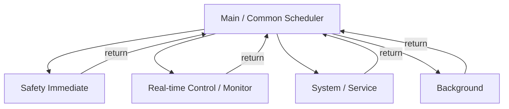
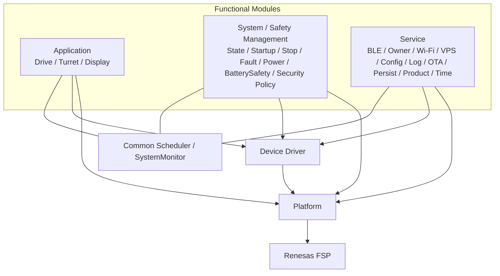
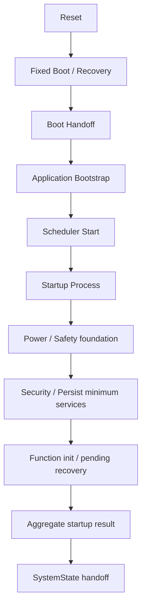

# Tank_Robot 本体ソフトアーキテクチャ基本設計

## 目次

1. 本書の目的
2. 本体ソフトアーキテクチャの設計方針
3. 実行アーキテクチャ方式の選定
4. ソフトウェア全体構成とレイヤ
5. 機能モジュールとProcessの責任分界
6. 共通Scheduler基本設計
7. READY・優先度・実行順序
8. 周期・Deadline・実行時間設計
9. 割込み・DMA・非同期イベント
10. 機能間データ連携と同期
11. 状態・データの管理と公開インターフェース
12. 起動・終了・再起動の実行モデル
13. 低消費電力・間欠動作の実行モデル
14. SystemMonitor・IWDT・進行監視
15. メモリ・固定資源管理
16. 長時間処理・通信・暗号・記憶処理
17. 異常検出とソフトウェア責任分界
18. 診断・実行統計・試験容易性
19. 論理機能のソフトウェア配置
20. 依存関係・禁止事項・FSP境界
21. 性能・成立性評価とRTOS再検討条件
22. 要求・関連基本設計との対応
23. 詳細設計事項
24. 設計判断・後続事項

---

## 1. 本書の目的

### 1.1 目的

本書は、Tank_Robot本体ソフトウェアについて、システム要求仕様および完成済み基本設計を実装可能なソフトウェア構造へ展開するための共通アーキテクチャを定義する。

本書の目的は、Tank_Robot本体ソフトウェアについて、次節に示す事項を詳細設計へ展開可能な粒度で定義することである。

### 1.2 対象範囲

本書では、Tank_Robot本体ソフトウェアについて、次を対象とする。

- ソフトウェアのレイヤ構成および責任分界
- 論理機能とソフトウェアModule/Processの関係
- RTOSを使用しない協調実行方式
- SchedulerとProcessの責任分界
- 周期処理、Event処理、Request処理、Timeout処理の実行方式
- Safety・Control・Service・Background処理の優先方式
- Processの実行時間、周期、開始期限および完了期限の扱い
- ISR、DMA、Process間の責任分界
- 機能間データ受渡し、機能側で管理する一連の処理および記憶媒体への保存の責任分離
- 起動、通常終了、再起動、低消費電力および復帰時の実行基盤
- Fixed Boot→Application Boot HandoffとIWDT ownership移管
- SystemMonitorとIWDTによるソフトウェア進行監視
- 静的メモリ、Queue、Buffer、secure transientその他の固定資源方針
- TLS、暗号、OTA、Flash等の長時間処理をSafety処理から分離する方式
- 実行統計、Traceおよび実機評価に必要な観測性
- RTOS導入を再検討する条件

本書では、個別機能の要求、内部状態、機能固有アルゴリズム、通信データの形式・送受信規則、異常影響度、停止成立条件、電気安全しきい値、credential proof、設定・永続・OTA・時刻の機能側で管理する一連の処理そのものを再定義しない。それらは各機能別基本設計および横断基本設計に従う。本書の役割は、各機能を同一の本体ソフトウェアとして実行するために必要な**レイヤ、依存方向、実行モデル、Scheduler、Process、優先度、時間、割込み、データ受渡し、監視および固定資源の共通規則**を定めることである。

本書で定める本体ソフトウェアの実行構成は次とする。

- No-RTOS協調実行方式およびPriority Class。
- 論理ProcessのREADY、周期、deadlineおよびbudget envelope。
- Process分割／統合時の不変条件と、Process連続CPU占有の共通上限。
- SystemMonitorのstate/phase別監視対象、チェックポイントが示す内容、monitorMode遷移および処理の進行停止の判定基準。
- IWDT feedへ使用する進行証拠のfreshness。
- Safety資源分離およびDisplayの実行優先契約。
- runtime上のlocal execution/resource allocationおよびRTOS再検討条件。

Boot Handoffのschema・各項目の意味およびIWDT ownership／移管契約は固定ブート・復旧/インターフェース・通信基本設計/電源・省電力管理、CPU/RAM/stack/queueの横断資源余裕・合否基準は性能・品質・検証基本設計、Security固定capacityはセキュリティ管理の各基本設計に従う。本書は、それらをruntimeへ組み込んで成立性を評価する。

実機評価で変更が必要となった場合は、詳細設計だけで変更せず、本書または値・連携規則を定める機能基本設計／横断基本設計／性能・品質・検証基本設計へ反映する。

具体Process ID、C構造体、FSP channel、NVIC priority数値、Queue実装、byte layout等、外部挙動および本書の共通上限を変更しない実装方法は詳細設計で具体化してよい。

詳細設計・実装・実機評価は未完了である。

### 1.3 上位文書・関連文書

#### 1.3.1 上位文書

- [`docs/00_project_overview/01_製品目的・製品目標.md`](../../../00_project_overview/01_製品目的・製品目標.md)
- [`docs/20_basic_design/00_Tank_Robot 基本設計について.md`](<../00_Tank_Robot 基本設計について.md>)
- [`docs/20_basic_design/01_システム構成/Tank_Robotシステム構成.md`](../01_システム構成/Tank_Robotシステム構成.md)
- [`docs/20_basic_design/02_システムアーキテクチャ/Tank_Robotシステムアーキテクチャ.md`](../02_システムアーキテクチャ/Tank_Robotシステムアーキテクチャ.md)

`20_要求仕様`および`30_コア要求仕様`は本書の上位要求または設計根拠として使用しない。公開用システム要求仕様で削減・変更された機能を過去資料から復活させない。

#### 1.3.2 関連するシステム要求仕様

- [`docs/10_requirements`](../../10_requirements)

#### 1.3.3 関連する基本設計

- [`docs/20_basic_design/03_機能別基本設計/01_システム状態管理/Tank_Robotシステム状態管理基本設計.md`](../03_機能別基本設計/01_システム状態管理/Tank_Robotシステム状態管理基本設計.md)
- [`docs/20_basic_design/03_機能別基本設計/02_起動・終了・再起動管理/起動・終了・再起動管理基本設計.md`](../03_機能別基本設計/02_起動・終了・再起動管理/起動・終了・再起動管理基本設計.md)
- [`docs/20_basic_design/03_機能別基本設計/03_停止・緊急停止管理/停止・緊急停止管理基本設計.md`](../03_機能別基本設計/03_停止・緊急停止管理/停止・緊急停止管理基本設計.md)
- [`docs/20_basic_design/03_機能別基本設計/04_異常管理/異常管理基本設計.md`](../03_機能別基本設計/04_異常管理/異常管理基本設計.md)
- [`docs/20_basic_design/03_機能別基本設計/05_電源・省電力管理/電源・省電力管理基本設計.md`](../03_機能別基本設計/05_電源・省電力管理/電源・省電力管理基本設計.md)
- [`docs/20_basic_design/03_機能別基本設計/06_バッテリー・電気安全監視/バッテリー・電気安全監視基本設計.md`](../03_機能別基本設計/06_バッテリー・電気安全監視/バッテリー・電気安全監視基本設計.md)
- [`docs/20_basic_design/03_機能別基本設計/07_走行制御/走行制御基本設計.md`](../03_機能別基本設計/07_走行制御/走行制御基本設計.md)
- [`docs/20_basic_design/03_機能別基本設計/08_砲塔・砲身制御/砲塔・砲身制御基本設計.md`](../03_機能別基本設計/08_砲塔・砲身制御/砲塔・砲身制御基本設計.md)
- [`docs/20_basic_design/03_機能別基本設計/09_BLE接続・認証/BLE接続・認証基本設計.md`](../03_機能別基本設計/09_BLE接続・認証/BLE接続・認証基本設計.md)
- [`docs/20_basic_design/03_機能別基本設計/10_所有者・操作端末管理/所有者・操作端末管理基本設計.md`](../03_機能別基本設計/10_所有者・操作端末管理/所有者・操作端末管理基本設計.md)
- [`docs/20_basic_design/03_機能別基本設計/11_Wi-Fi接続/Wi-Fi接続基本設計.md`](../03_機能別基本設計/11_Wi-Fi接続/Wi-Fi接続基本設計.md)
- [`docs/20_basic_design/03_機能別基本設計/12_VPS接続・デバイス認証/VPS接続・デバイス認証基本設計.md`](../03_機能別基本設計/12_VPS接続・デバイス認証/VPS接続・デバイス認証基本設計.md)
- [`docs/20_basic_design/03_機能別基本設計/13_設定管理/設定管理基本設計.md`](../03_機能別基本設計/13_設定管理/設定管理基本設計.md)
- [`docs/20_basic_design/03_機能別基本設計/14_ログ・診断/ログ・診断基本設計.md`](../03_機能別基本設計/14_ログ・診断/ログ・診断基本設計.md)
- [`docs/20_basic_design/03_機能別基本設計/15_OTA更新/OTA更新基本設計.md`](../03_機能別基本設計/15_OTA更新/OTA更新基本設計.md)
- [`docs/20_basic_design/03_機能別基本設計/16_永続データ管理/永続データ管理基本設計.md`](../03_機能別基本設計/16_永続データ管理/永続データ管理基本設計.md)
- [`docs/20_basic_design/03_機能別基本設計/17_セキュリティ管理/セキュリティ管理基本設計.md`](../03_機能別基本設計/17_セキュリティ管理/セキュリティ管理基本設計.md)
- [`docs/20_basic_design/03_機能別基本設計/18_製品情報管理/製品情報管理基本設計.md`](../03_機能別基本設計/18_製品情報管理/製品情報管理基本設計.md)
- [`docs/20_basic_design/03_機能別基本設計/19_固定ブート・復旧/固定ブート・復旧基本設計.md`](../03_機能別基本設計/19_固定ブート・復旧/固定ブート・復旧基本設計.md)
- [`docs/20_basic_design/03_機能別基本設計/20_時刻管理/時刻管理基本設計.md`](../03_機能別基本設計/20_時刻管理/時刻管理基本設計.md)
- [`docs/20_basic_design/03_機能別基本設計/21_状態表示・利用者通知/状態表示・利用者通知基本設計.md`](../03_機能別基本設計/21_状態表示・利用者通知/状態表示・利用者通知基本設計.md)
- [`docs/20_basic_design/04_インターフェース・通信/Tank_Robotインターフェース・通信基本設計.md`](../04_インターフェース・通信/Tank_Robotインターフェース・通信基本設計.md)
- [`docs/20_basic_design/05_電源・ハードウェア/Tank_Robot電源・ハードウェア基本設計.md`](../05_電源・ハードウェア/Tank_Robot電源・ハードウェア基本設計.md)
- [`docs/20_basic_design/06_セキュリティ横断設計/Tank_Robotセキュリティ横断設計.md`](../06_セキュリティ横断設計/Tank_Robotセキュリティ横断設計.md)
- [`docs/20_basic_design/08_性能・品質・検証/Tank_Robot性能・品質・検証基本設計.md`](../08_性能・品質・検証/Tank_Robot性能・品質・検証基本設計.md)

### 1.4 本書で再定義しない事項

次は各事項を定める基本設計に従い、本書ではソフトウェア実行上必要な共通規則だけを扱う。

- システム状態と状態遷移条件
- 通常停止、安全停止、緊急停止の成立条件と停止結果
- 異常の影響度、処置区分、復旧可否、復旧試行回数
- バッテリー・電気安全のしきい値、フィルタ、保護条件
- BLE/Wi-Fi/VPSの通信データの形式・送受信規則
- credential proof、credential ACTIVE/REVOKEDの意味
- 設定、Product Data、時刻、OTA等の機能側で管理する一連の処理の順序
- 永続データのphysical record layout
- ハードウェア回路、端子、レジスタ、FSP設定、具体API/byte layout

### 1.5 用語

| 用語 | 本書での意味 |
| --- | --- |
| Process | RTOS Taskではなく、協調Schedulerから呼び出され短時間で自発的にreturnする実行単位 |
| Task | 将来RTOS導入時にSchedulerから独立してscheduleされるRTOS Task。現行基本方式では使用しない |
| Scheduler | READY、優先度、時刻条件、実行可否を評価して次のProcessを選択する共通実行基盤 |
| READY | Processを呼び出すべき実行契機が成立している状態 |
| READY理由 | 周期到達、Event、Request、Timeout、Safety事象、Background work等 |
| 単調時刻 | UTC補正の影響を受けず同一起動中に後退しない経過時間基準 |
| 実行時間の上限 | 1回のProcess呼出しが連続してCPUを占有する時間の設計上の上限 |
| Deadline | 処理開始または完了に対して満たすべき期限 |
| Checkpoint | 監視対象Processについて、定められた処理区間の正常完了を示す情報。各監視区間の完了条件は第14.3.1節に従う |
| Execution Generation | Processまたは監視区間の新しい正常進行を識別する世代 |
| 実行scan | 同一優先度・同一期限Processへ固定順に実行機会を与える論理選択区間 |
| 機能側で管理する一連の処理 | Config、Product Data、Time、credential等について、データ管理機能が定める条件に基づいて更新を確定し、または復旧する処理 |
| 記憶媒体への保存 | MRAM/Serial NOR上のcopy、commit marker、CRC等を永続データ管理/Persistenceが実現する保存処理 |

---

## 2. 本体ソフトアーキテクチャの設計方針

### 2.1 Safetyを外部通信および非安全処理へ依存させない

停止、緊急停止、電源保護、安全監視および異常時の安全処理は、BLE/Wi-Fi/VPS、ログ、OTA、設定、暗号、表示その他の非安全関連処理の完了を待たない。

Security ServiceをアクチュエータSafety PathのBlocking依存にしない。通信Module Driver、authentication/authorization、Safety Gateを分離する。

### 2.2 機能責任と実行基盤を分離する

各機能は、自機能の状態、判断、データおよび処理結果を管理する。Schedulerは、いつ、どのProcessを呼び出すかを管理する。SystemState、Stop、Fault、Power、Driveなどの各機能が担当する、システム状態、停止方法、異常への処置、電源状態、走行出力などの判断は行わない。

### 2.3 機能状態を共通Lifecycleへ統合しない

Drive、Wi-Fi、Power、BatterySafety、Config、Security等の内部状態を一つの共通状態機械へ押し込まない。共通化するのは次の実行属性だけとする。

- executionEnabled
- READY/READY理由
- 実効Priority
- 周期/次回Release
- Deadline
- monitorMode
- executionGeneration/Checkpoint
- 実行統計

### 2.4 機能をProcessへ一対一対応させない

論理機能、Module、Processは一対一対応を前提としない。短時間のread-only queryだけで成立する機能は独立Processを不要とし、複数の異なるdeadlineを持つ機能は複数Processへ分けてよい。

詳細設計でProcessを分割・統合する場合も、第19.1節で定める論理Processの実行規則を維持する。

**分割・統合に共通する条件**

- 元のREADY契機を失わず、Priorityを下げず、開始／完了のDeadlineを緩和しない。
- 連続CPU占有時間の共通上限1.0 msを超えない。
- 監視対象の処理区間に、監視されない区間を作らない。
- Safety処理を、低優先度の処理の完了待ちにしない。

**複数の実装Processへ分割する場合**

論理ProcessのCheckpointは、実行規則上必要な一連の処理が完了した時点だけで成立させる。部分処理の進行だけを、全体の正常完了として扱わない。

**複数の論理Processを一つの実装Processへ統合する場合**

優先度（Priority）が高い処理、または期限（Deadline）が早い処理を実行した呼出しの中で、大量の低優先度の処理を継続しない。

### 2.5 通常動作中のBlockingを禁止する

Process内で外部応答待ち、delay待ち、無期限loop、完了までのbusy waitを行わない。待ちを伴う処理はFSM、非同期Driver、DMA、Chunk処理等へ分割する。

### 2.6 自動再開を行わない

起動、再起動、通信再接続、省電力復帰、異常復旧、E-STOP解除、OTA更新後に、以前の走行・砲塔・砲身操作を自動再開しない。通常操作再開には現在状態、安全条件、認証・権限を満たした後に受信した新しい有効指令を使用する。

### 2.7 内容と確定条件の管理をPersistenceへ移さない

永続データ管理（Persistence）は記憶媒体への保存を管理する。Config、Product Data、Time、認証情報、OTA等について、機能側での更新確定が成功したか、旧版へ戻してよいかを独自に判断しない。各データ管理機能が一連の処理の状態と復旧方針を定め、Persistenceは、要求された保存確定・復旧の基本操作とその結果を提供する。

---

## 3. 実行アーキテクチャ方式の選定

### 3.1 採用方式

初期製品の本体アプリケーション softwareは、**RTOSを使用しない協調実行方式**を採用する。



各Processは必要な処理の一部または状態遷移段階だけを実行し、短時間でSchedulerへreturnする。

### 3.2 RTOSを初期採用しない理由

現時点では各機能をnonblocking FSMとして構成可能であり、RTOS固有Task、Stack、Mutex、Priority inversionを初期段階から導入する必然性はない。協調方式は個人開発規模で実行順序、資源、時間を追跡・検証しやすい。

### 3.3 協調方式の成立条件

- 各Processが短時間でreturnする
- Blocking waitを行わない
- 長時間処理を分割/非同期化できる
- Safety/Control deadlineを最大負荷で満たす
- Libraryが長時間CPUを独占しない
- Process進行停止をSystemMonitorで検出できる
- IWDTがScheduler/CPU/SystemMonitorを含むsoftware全体停止を最終監視できる
- 性能・品質・検証基本設計のCPU/RAM/stack/queue余裕を満たす

### 3.4 非preemptiveであることの意味

協調Process実行中は別Processへpreemptしない。したがってP0事象のProcess開始遅延には、**事象発生時に実行中だった1回のProcess連続CPU占有時間**が直接加算される。

このため第8.5節の共通Process連続占有上限は単なるcoding styleではなく、Safety/Control deadlineを成立させるarchitecture blocking boundである。詳細設計は、各ProcessのWCET、ISR/Critical Section、P0/P1 backlogを組み合わせ、最悪READY→開始時間が停止・緊急停止管理/バッテリー・電気安全監視/走行制御/砲塔・砲身制御/状態表示・利用者通知/性能・品質・検証基本設計の期限を満たすことを示す。

### 3.5 将来のRTOS移行

RTOSが必要になっても、Moduleの公開インターフェース、Request/Result、Snapshot、Event、および機能ごとの更新・復旧処理の管理主体は、可能な限り維持する。必要なら、既存の協調Process群を一つのRTOS Task内で維持し、TLS/VPS等だけを別Taskへ分離する段階的な移行を許容する。

---

## 4. ソフトウェア全体構成とレイヤ

### 4.1 6層構成

1. Application
2. System / Safety Management
3. Service
4. Device Driver
5. Platform
6. FSP

共通Scheduler/SystemMonitorは製品機能レイヤとは分離した**共通実行基盤**とし、新しい製品機能レイヤまたはsystem stateを追加しない。



### 4.2 上位3層は責任分類

Application、System/Safety Management、Serviceの依存関係は、厳密な階段型ではない。Stop↔Drive、BatterySafety→Stop、Config→設定を利用する各機能等は、Public Interfaceを介して連携できる。ただし、相手Moduleの内部変数やProcessを直接操作しない。

### 4.3 Device Driver

外部device固有Protocol、初期化、transfer、local stateを扱う。代表例はmotor driver、BLE module、Wi-Fi module、Serial NOR等である。

### 4.4 Platform

RA8M2 peripheral/FSP依存を隠蔽する。GPIO、UART、SPI、I2C、ADC、DMA、Timer/Monotonic Time、IWDT、Low Power、Reset reason等を提供する。

### 4.5 FSP境界

Application/System/Service/Device DriverからFSPを直接呼ばない。FSP callbackもPlatformで受け、上位Processを直接呼ばずBuffer、Event、Latch、pendingへ変換する。

---

## 5. 機能モジュールとProcessの責任分界

### 5.1 機能Module

Moduleは機能責任、内部状態、正式に管理するdata、Public Interfaceを所有する。`Xxx_Process()`はModuleそのものではなくSchedulerから進行させるExecution Interfaceである。

### 5.2 Processを持つ条件

- 周期実行が必要
- Eventに応じてFSMを進める
- Requestを複数段階で処理する
- Timeout/Deadlineを監視する
- Background workを分割する

### 5.3 Processを持たないModule

短時間、nonblocking、限定副作用のGetter/変換/validationは独立Processを持たなくてよい。

### 5.4 Process間直接呼出しの禁止

別機能Processを直接呼び出さない。

```text
NG:  Ble_Process -> Drive_Process()
OK:  Ble_Process -> Drive Command Slot更新 -> return
     Scheduler -> Drive_Process()
```

短時間のPublic Getter、Request投入、Driver/Platform APIは同期関数として利用できる。

---

## 6. 共通Scheduler基本設計

### 6.1 Schedulerの責任

- Process静的登録
- executionEnabled
- READY/READY理由
- 実効Priority
- 周期/nextReleaseTime
- Timeout/Deadline
- 固定tie-break順
- Process開始/終了時刻
- 実行時間/滞留時間統計
- Overrun/Deadline missという実行事実

### 6.2 Schedulerが管理しない事項

System state、operation availability、停止成立、電気安全、fault impact、recovery可否、reboot要否、authentication/authorization、Drive/Turret制御内容、機能側での更新確定可否は判断しない。

### 6.3 Process登録

Processは通常動作中に動的生成・削除しない。少なくともProcess ID、Entry、基本/実効Priority、周期、実行時間の上限、固定順序、executionEnabled、pendingReasons、nextReleaseTime、nextDeadline、monitorMode、executionGenerationを静的/固定上限管理する。

第19.1節の論理Process実行契約に記載したREADY契機、Priority class、周期／Event方式、期限の定義、monitoring classおよびbudget envelopeは基本設計事項とする。詳細設計はこれらを具体Processへmappingし、より厳しいbudget/deadlineを割り当ててよいが、基本契約を緩和しない。

具体構造体、bit幅、登録APIは詳細設計で定める。

### 6.4 Scheduler基本ループ

```text
while (application is running)
    now = MonotonicTime_Get()
    periodic/timeout/deadlineからREADYを更新
    最優先READY Processを選択
    Processがあれば1回呼び出す
    return後に時間・結果・統計を更新
    すべてのREADY/Priorityを再評価
    READYなしならIdle / 低消費電力判断
```

SchedulerはProcessを途中で強制終了しない。

---

## 7. READY・優先度・実行順序

### 7.1 READY理由

- `PERIODIC_DUE`
- `EVENT_PENDING`
- `REQUEST_PENDING`
- `TIMEOUT_DUE`
- `SAFETY_EVENT`
- `BACKGROUND_WORK`

具体enum/bitは詳細設計事項とする。

### 7.2 READY情報とdata本体を分離する

READYは実行契機でありdata本体ではない。dataはFlag、Counter、Slot、Queue、Ring Buffer、Snapshot、Safety Latch等へ保持する。Process実行中に新Eventが到着しても一括clearで失わず、今回消費した情報だけを処理済みにする。

### 7.3 論理Priority Class

| Priority | 区分 | 主な対象 |
| --- | --- | --- |
| P0 | Safety Immediate | E-STOP後続、Safety Stop、危険電気事象、即時出力禁止に直結する処理 |
| P1 | Real-time Control / Monitor | BatterySafety、SystemMonitor、Drive、Turret、期限付きSafety表示更新等 |
| P2 | System / Service | SystemState、Startup、Power通常処理、BLE、Owner、Wi-Fi、VPS、Config、Security通常request、OTA、Persist、Time等 |
| P3 | Background | 通常Log整理、通常Display、diagnostic background等 |

ここでいうPriorityはProcess実行Priorityであり、製品上のSafety priorityそのものではない。

状態表示・利用者通知の通常表示reconciliation/pattern処理はP3を基本とする。一方、power danger/E-STOP等で提供元での情報確定から表示出力更新開始50 ms以内の契約を持つEventは、Display Processの実効PriorityをP1相当へ引き上げて処理できる構成とする。ただし表示更新は実際のE-STOP、停止、電源保護P0処理より優先せず、表示完了をSafety処理の成立条件にしない。

### 7.4 READY理由による実効Priority

同一ProcessでもREADY理由により実効Priorityを上げられる。高Priority理由を処理した同じ呼出しで大量の低Priority workを続けない。

### 7.5 同一Priorityの選択規則

1. 最も高いPriority Class
2. 同一Priorityでは最も近いDeadline
3. 同一Deadline/Deadlineなしでは固定tie-break順

Round-Robinは初期基本方式に採用せず、再現性・時間解析性を優先する。

### 7.6 同一Processの連続実行抑制

1実行scanで同じProcessは原則1回とする。未処理workは後続scanへ残す。Process return後に新しいSafety理由が成立した場合はscan公平性よりSafetyを優先して再選択する。

---

## 8. 周期・Deadline・実行時間設計

### 8.1 時間条件を分離する

| 項目 | 意味 |
| --- | --- |
| 周期 | 実行機会を作る間隔 |
| 実行時間の上限 | 1回のProcess連続CPU占有時間 |
| 開始期限 | Event/Request成立から処理開始まで |
| 完了期限 | Event/Request成立または開始から必要結果成立まで |

OverrunとDeadline missを同一異常にしない。

### 8.2 共通単調時刻

Scheduler、周期、Timeout、Deadline、実行時間、SystemMonitorにはRTC/UTCから独立した64 bit µs単位の単調時刻を使用する。同一起動中に後退させない。UTCは時刻管理のtrust管理を介してログ、証明書、管理用途へ使用する。

### 8.3 周期の基準

周期Processは前回実行時刻ではなく本来の周期系列を維持する。10 ms予定が12 msに遅れても次回を22 msへずらさず20 ms系列へ復帰する。

### 8.4 複数周期取りこぼし

過去周期を連続実行して追い付かない。最新入力/状態で原則1回処理し正規周期へ復帰する。古い走行・砲塔指令をFIFO再生しない。

### 8.5 Process連続実行時間の基本設計値

協調Schedulerの共通初期値を次とする。

- 通常設計目標：**0.5 ms以下**
- 原則上限：**1.0 ms以下**
- 1.0 ms超過可能性がある処理：Chunk化、DMA、非同期化、Hardware accelerator、方式変更を検討

1.0 msはSchedulerによる強制Timeoutではないが、非preemptive blocking boundを構成する**基本設計で管理し、評価結果を基に確定する値**である。個別Processのbudgetを詳細設計で1.0 ms以下へ割り当てることはできるが、共通上限を詳細設計だけで緩和しない。機能固有要求がより厳しい場合は機能固有値を優先する。

### 8.6 主要周期・表示更新の基本値

| 対象 | 基本方式 |
| --- | --- |
| 電圧・電流ADC取得 | Hardware ADC/DMA 1 ms。1 ms Processにはしない |
| BatterySafety判定 | 10 ms周期 |
| Drive | 10 ms周期 |
| Turret/Barrel | 10 ms周期 |
| SystemMonitor | 10 ms周期 |
| 状態表示・利用者通知 RGB pattern phase | 50 ms tick |
| 状態表示・利用者通知 source reconciliation | 100 ms |
| 状態表示・利用者通知の通常本体表示 | 提供元での情報確定→論理出力更新開始200 ms以内 |
| 状態表示・利用者通知 power danger/E-STOP表示 | 提供元での情報確定→論理出力更新開始50 ms以内。Safety本処理より後順位 |
| 状態表示・利用者通知 BLE status summary | 認証済み正常linkで提供元での情報確定→送信開始500 ms以内 |
| Wi-Fi/VPS/Config/OTA/Persist/Time | 固定高頻度pollingではなくEvent/FSM/Deadline中心 |
| Log | Background中心。重要Event受付は失わない |

個別機能基本設計に異なる値の定義がある場合はその値を優先し、本書だけで上書きしない。

### 8.7 Deadline違反

期限超過後に正規周期へ戻っても期限を満たしたことにはしない。Safety/Control系Deadline missはSystemMonitor/異常管理へ連携し、必要なSafety処理へ接続する。Background workは延期・抑制できる。

---

## 9. 割込み・DMA・非同期イベント

### 9.1 ISRの責任

ISRは短時間・nonblockingとし、原則として割込み要因clear、最小status/time capture、固定Buffer格納、DMA完了、Flag/Counter/pending、Safety Latch更新までとする。Processを直接呼ばない。

### 9.2 ISRで行わない処理

- 長いloop/Busy wait/delay
- Packet全解析
- TLS/暗号
- Flash/MRAM/OSPI write
- Log保存
- 複雑FSM
- `malloc/free`
- IWDT feed
- Process直接呼出し

### 9.3 ADC/DMA

```text
Timer -> ADC scan -> DMA -> fixed ping-pong/ring buffer
      -> completion/pending -> BatterySafety Process
```

CPU負荷が変動しても、1 ms周期のデータ取得が停止しない構成とする。サンプルの世代と有効性をバッテリー・電気安全監視へ渡す。情報を利用する機能は、未加工のADC値を別の判断基準として安全判定しない。

### 9.4 E-STOP

Hardware Safety Pathで走行出力禁止を開始し、MCU ISRはEventをLatchして停止・緊急停止管理 ProcessをREADYにする。software state/result処理がhardware停止を待たせない。

### 9.5 割込みPriority方針

1. Safety/Protection input
2. Safety/Control acquisition/completion
3. Operator communication
4. Normal communication/storage completion
5. Diagnostic/maintenance

具体NVIC/FSP数値は詳細設計で決めるが、この意味順序を逆転させない。

---

## 10. 機能間データ連携と同期

### 10.1 情報種別

インターフェース・通信基本設計の`COMMAND / REQUEST / RESULT / SNAPSHOT / EVENT / BULK_DATA / SAFETY_SIGNAL`をそのまま使用する。

### 10.2 COMMAND

継続操作はLatest-value Slot/Mailboxを基本とし、session/generation/sequence/受信時刻を確認する。STOP/E-STOPは通常COMMAND資源と分離する。

### 10.3 REQUEST / RESULT

複数要求の順序が必要なら固定Queue、同時1件なら固定Request Slotを用いる。RESULTはRequest/transaction IDへ対応付け、`COMPLETED / FAILED / UNKNOWN`等を区別する。response不明をsuccessへ推測変換しない。

### 10.4 SNAPSHOT

複数fieldを一組で公開する既定方式を**Double Buffer + Generation**とする。小さな共有値ではAtomic accessまたは短いCritical Sectionを使用できる。`volatile`だけを同期保証にしない。

### 10.5 EVENT

- 単純成立：Flag
- 回数を失えない：Counter
- payload順序：固定Queue
- Safety：専用Latch/予約資源

### 10.6 BULK_DATA

OTA image、Log batch等は全量RAM展開せずChunk + Fixed Buffer + Streamingを基本とする。

### 10.7 Process間排他

協調Process同士は同時実行しないためMutexは原則不要。保護対象は主にISR↔Process、DMA↔CPU、高Priority ISR↔低Priority ISRである。Critical Sectionへ長いcopy、Flash、crypto、waitを入れない。

### 10.8 機能側で管理する一連の処理と記憶媒体への保存

設定、Product Data、Trusted Time、認証情報、OTAの重要状態などについては、**そのデータを管理する機能が、一連の更新手順と「いつ新しい値を正式に有効とするか」を定める**。

永続データ管理（Persistence）は、各論理データ集合について、記憶媒体への書込み、読出し、および中断後の復旧に必要な処理を提供する。データ内容を正式に有効とする判断は行わない。

異なる論理データ集合を、1回の物理的な原子書込みで同時に確定できるとは仮定しない。現行の更新例は次のとおりである。

- 設定管理：`CONFIG_COMMIT_PENDING` → CONFIG_STOREの保存・検証 → `highestCommittedGeneration` → 最終確定
- 製品情報管理：Product Dataの候補・保留状態 → `highestCommittedProductDataRevision` → 最終確定
- 時刻管理：`TIME_UPDATE_PREPARED` → RTC設定・読戻し → Trusted Time Recordの保存確定 → Time Updateの最終確定
- 所有者・操作端末管理／セキュリティ管理：認証情報のCANDIDATE・受領結果・`ownerDataRevision`の保存確定 → ACTIVE

Processは、これらの処理でSchedulerを待ち状態のまま占有しないよう、非ブロッキングのFSMとして進める。各段階のRequestとResultは、同じtransaction IDを用いて対応付ける。

リセットまたは電源喪失後に未完了の取引が残っている場合は、その事項を定める基本設計に従って復旧を完了する。それまでは、新しい状態を利用する機能へ正常な現在値として公開しない。

また、保存用の複製でCRCまたはMACが正常であることだけを理由に、古い論理版へ戻さない。

---

## 11. 状態・データの管理と公開インターフェース

### 11.1 状態を書き換える機能を一つに定める

各Moduleは、自機能の内部状態と正式に管理するデータを、自身だけが書き換える。他のModuleは、それらの内部変数を直接参照・更新しない。

### 11.2 状態変更要求

他の機能は管理元のModuleへREQUESTを送る。管理元のModuleが、変更可否と機能上の結果を判断する。

### 11.3 永続データ責任

`Persist_Write()`相当の物理保存が成功したことだけで、設定・製品情報・時刻・認証情報等の更新が機能上も成功したとは扱わない。データ管理機能が、物理保存の結果、下限値と版、未完了状態、および関連データ集合の結果を確認し、現在有効なデータ内容・状態を決める。

### 11.4 Public Interface

Request受付、Result取得、Read-only Snapshot、Event、短時間Getterに限定し、内部State struct全体を公開しない。

### 11.5 Execution Interface

`Xxx_Process()`はScheduler専用で、他機能Public APIにしない。

### 11.6 管理元の判定を参照先で重複して行わない

利用側の機能は、管理元機能が確定した判定結果を元の測定値から再判定しない。例えばDriveは、BatterySafetyが提供する物理単位に換算した値へ、同じ電気安全しきい値を独自に適用しない。バッテリー・電気安全監視が提供する使用可否、理由、情報品質および世代（availability/reason/quality/generation）を使用する。

---

## 12. 起動・終了・再起動の実行モデル

### 12.1 Fixed Boot / Recovery

Reset直後は固定ブート・復旧 fixed boot/recoveryが、起動対象imageのsignature/hash、product/HW、Boot Interface、SecurityGen、install/trial/recovery stateを確認し、必要な復旧を行う。

固定ブート・復旧は起動・終了・再起動管理のend-to-end時間契約に従い、通常主電源投入では主電源投入、事前処理のないresetではreset発生、計画的再起動では起動・終了・再起動管理の`rebootTimingContext`が示す再起動開始を起点としてApplication前区間を監視する。fixed bootが直接計測できないhardware/reset区間はworst-case budgetを加算し、経過時間を過小評価しない。

通常BLE/Wi-Fi/Drive等をfixed bootへ持ち込まない。fixed bootは固定ブート・復旧/セキュリティ横断設計のminimum security bootstrapだけを使用する。

### 12.2 Boot Handoff

Boot Handoffのデータ構造、必須項目、版管理・長さ・CRC、各項目の意味、および固定ブート側の生成規則は、固定ブート・復旧基本設計第9章とインターフェース・通信基本設計第15.1節に従う。

本書では、本体アプリケーションが制御を受け取った直後に、両文書で確定した版付きのBoot Handoffを検証・取得し、必要な情報を実行時の各担当機能へ渡す処理を定める。

Boot Handoffの項目の追加・削除、各項目の意味、またはIWDT実行権の移管状態・識別子の意味は、本書だけで変更しない。

Application Bootstrapは、前回のIWDT・リセット要因やBoot Handoffの診断情報を、今回の起動時の初期化で上書きする前に、必要な担当機能へ引き渡す。Boot Handoffが不正・不整合の場合は、推測して正常な起動情報へ変換しない。

`startupTimingContext`は、現在の`bootAttemptId`とともに起動・終了・再起動管理へ渡す。Application Bootstrap、Scheduler開始またはSystemState初期化を、起動全体の新しい計時起点にしない。Boot Handoff時点の残り時間だけを、後続のStartupへ与える。

### 12.3 Application Bootstrap

Scheduler開始前のBootstrapは最小限とする。

- actuator出力禁止とhardware安全状態再確認
- Boot Handoff/reset reasonの検証・早期capture
- Schedulerに必要な最小Platform/Monotonic Time/Safety Input初期化
- Scheduler静的管理情報初期化
- Startup/SystemState最小情報初期化
- fixed boot側EARLY_IND timer/scanが停止済みであることを前提にApplication表示HALを後続で再初期化可能な状態へ置く

外部応答待ち、通信接続、full persistence scan、TLS、長い診断をBootstrapでblocking実行しない。

### 12.4 Scheduler開始後のStartup

本格StartupはScheduler上の起動・終了・再起動管理 FSMとして進める。依存関係を満たす範囲で並行進行できるが、必要な結果を確認せず後続段階へ進まない。起動・終了・再起動管理 FSMは`startupTimingContext`の残り時間を共通deadlineとして使用し、各内部deadlineや再試行で延長しない。



Wi-Fi/VPS実接続等、起動完了条件でない処理をStartup完了待ちへ含めない。

起動・終了・再起動管理が起動結果を同じ`bootAttemptId`でシステム状態管理へ渡した後、システム状態管理は遷移先状態と`stateGeneration`を確定して起動後状態確定結果を返す。この応答を起動・終了・再起動管理が残り時間内に取得した時点をend-to-end完了とする。timeout後のStartup resultまたはstate resultをREADYへ戻して再利用しない。

設定管理、製品情報管理、時刻管理、所有者・操作端末管理などで、永続データに関する一連の更新・復旧処理が未完了で残っている場合は、各データ管理機能が担当する基本設計に従って復旧する。各データに適用するREADY、ACTIVE、TRUSTEDなどの公開条件を満たした後に、利用する機能へデータを提供する。

### 12.5 IWDT更新責任の移管

IWDTの論理的な更新責任、移管状態・ID、および移管処理の意味は、固定ブート・復旧／インターフェース・通信基本設計／電源・省電力管理の各基本設計に従う。本節は、その契約を本体アプリケーションの実行環境で適用する順序と禁止事項を定める。

リセット後のIWDT更新責任は、固定ブート・復旧の`FIXED_BOOT`が持つ。Application Bootstrapと、Power Management確立前のStartupでは、版を持つBoot Watchdog Serviceを介し、有限の起動段階の正常な進行と`startupTimingContext`の残り時間を確認する。この間、固定ブート側がIWDT更新責任を維持する。

Power Managementの確立後は、起動・終了・再起動管理／電源・省電力管理／固定ブート・復旧／インターフェース・通信基本設計に従い、同じbootAttempt/transfer IDを用いた一回の処理で、更新責任を`POWER_MANAGER`へ移管する。

- commit前：Boot Watchdog Serviceだけがfeed可能
- commit後：Power Managementだけがfeed可能
- individual Process/ISR/SystemMonitorは直接feedしない
- transfer否定/不明/ID不一致時に二重feedまたは無条件feedへfallbackしない
- transfer成立前に起動正常完了や負荷側power enableへ進まない

### 12.6 OTA trial validation

Scheduler起動、Application `main()`到達、Bootstrap完了、BLE_WAIT到達だけを`TRIAL_BOOT_VALIDATED`としない。trial normal validationでは、起動・終了・再起動管理がApplication起動正常完了、システム状態管理がBLE接続待機状態を確定した後、OTA更新が`TRIAL_BOOT_VALIDATED`をcommitする。Architecture側は、その条件が成立するまでcandidateを「起動試行中」と扱えるexecution/transaction状態を維持する。

PREVIOUSによる復旧では、固定ブート・復旧が、復旧用データの準備、PRIMARYの上書き、検証、および`RECOVERY_BOOT_PENDING`の保存確定を行った後、Applicationへ制御を引き継ぐ。起動・終了・再起動管理／システム状態管理によって復元したApplicationの起動と状態が確定した後に、OTA更新が`RECOVERY_SUCCEEDED`と本体のOTA最終結果を確定する。

`RECOVERY_BOOT_PENDING`は固定ブート・復旧が管理する起動判断用マーカーであり、`RECOVERY_BOOT`はOTA更新が管理する処理段階である。本体ソフトウェアの実行方式を定める際も、両者を一つの実行時状態へ統合しない。

### 12.7 Initの意味

`Xxx_Init()`は内部変数、固定Buffer、初期State、静的関連付け等の短いlocal初期化に限定する。外部応答待ち、接続、長い診断はProcess FSMで行う。

### 12.8 通常終了

通常終了もScheduler上で実行する。終了開始後は新しい通常操作を禁止し、不要Processを順次executionDisabledにするが、Stop、BatterySafety、Fault、Power、SystemMonitor等は電源遮断直前まで必要に応じ実行する。Schedulerを先に停止しない。

### 12.9 計画的再起動

actuator安全化、必要保存、再起動理由保持を進め、最終条件成立後にResetを要求する。reset後は旧COMMAND、旧セッション、旧checkpointを再利用しない。

### 12.10 強制電源遮断

通常終了FSM完了を待たず、hardware force-off/電源保護を優先する。非必須communication、log、displayを待たない。

---

## 13. 低消費電力・間欠動作の実行モデル

### 13.1 Scheduler共通化

通常動作とlow-power interval wakeで別Schedulerを作らず、同じScheduler/Process定義を使用しexecutionEnabledとmonitorModeを切り替える。

### 13.2 低消費電力移行

各機能を安全な休止点まで進め、通常Processを意図的休止として除外する。意図的休止中はSystemMonitorの通常進行監視対象にしない。

### 13.3 Software Standby

標準low powerではRA8M2 Software Standbyへ移行しCPU/Scheduler/通常Processを停止する。通常Processの周期deadlineをSleep中に未処理missとして蓄積せず、復帰後に新しい基準へre-armする。

### 13.4 1秒Safety interval wake

```text
Software Standby
  -> 約1 s Wake
  -> minimal clock/peripheral restore
  -> BatterySafety LP monitor
  -> LP-required SystemMonitor checks
  -> Power/IWDT condition confirmation
  -> no wake reason requiring system transition
  -> Software Standby
```

内部wakeをsystem通常復帰としない。

### 13.5 非同期Wake

BLE接続要求、E-STOP、安全関連入力等は1秒周期を待たない。高速保護はSoftware Wakeに依存せずHardware Protection Pathを使用する。

### 13.6 通電維持縮退

PWR_DRIVE/PWR_SERVO等の通電維持縮退では、必要な1 ms current acquisition、100 ms温度等を維持可能な浅いlow-power modeを使用する。標準1秒間欠監視で代用しない。

### 13.7 通常復帰

1. wake reason保持
2. actuator output prohibited再確認
3. BatterySafety通常監視へ復帰
4. reasonに必要な機能だけ復帰
5. state/config/power整合確認
6. 必要ProcessをexecutionEnabled
7. SystemMonitor ARMING
8. first normal Checkpoint後MONITORED

### 13.8 休止前情報を再利用しない

old deadline、old operation pending、old checkpoint、old execution generationを復帰後の新しい正常進行根拠にしない。

---

## 14. SystemMonitor・IWDT・進行監視

### 14.1 役割分担

- SystemMonitor：Schedulerは動くが重要Processが進行しない状態を検出
- IWDT：Scheduler/CPU/SystemMonitorを含むsoftware全体停止を最終検出
- Hardware Protection：E-STOP、短絡、重大過電流等のsoftware非依存Safety path

SystemMonitorは製品状態や異常への処置を決定せず、**現在の処理段階で進行が必要な論理Processが、基本設計で定めた期限内に新しい正常進行情報を公開しているか**を監視する。

### 14.2 監視対象

すべてのProcessを一律に監視せず、現在のシステム状態・実行段階で正常な進行が必要な論理Processだけを対象とする。監視対象は第19.1節の論理Process実行契約と、次の状態・処理段階ごとの表を判断基準とする。詳細設計で対象を任意に追加・削除して、安全・IWDTの条件を変えない。

#### 14.2.1 システム状態・処理段階ごとの監視対象

| 実行段階 | SystemMonitor | 必須監視対象の基本集合 | 条件付き監視 | 監視対象外／別監視 | IWDT更新責任・進行を確認する根拠 |
| --- | --- | --- | --- | --- | --- |
| Fixed Boot／Recovery | 本体アプリケーション側のSystemMonitorは未起動 | － | － | 固定ブート・復旧の処理段階 | 固定ブート・復旧のBoot Watchdog Service |
| Application Bootstrap・Scheduler開始前 | 未起動 | － | － | Bootstrapの有限の処理段階 | 固定ブート・復旧のBoot Watchdog Service |
| Scheduler開始後Startup・IWDT移管前 | 10 msで起動し`ARMING`から開始。必要な対象を`MONITORED`へ移行 | Startup、Power foundation、BatterySafety、SystemMonitor cycle | 起動完了に必須のConfig/Persist/Security/Product/Timeの復旧処理等 | Drive/Turretは出力禁止かつ`executionDisabled`なら`NOT_MONITORED` | IWDT更新は固定ブート・復旧が担当する。Boot Watchdog Serviceへ起動段階の進行を渡す |
| 通常BLE待機／操作可能 | 有効 | BatterySafety、Power、SystemMonitor cycle | Drive/Turretは`executionEnabled`時、Stop/Faultは処理中のとき。期限付きサービス処理は、現在の状態・処理段階で進行が必要なとき | 待機中のサービス、通常のLogバックグラウンド処理、通常Displayは進行監視の必須対象外 | 電源・省電力管理のPower Managementが担当する。現在の必須監視対象について、新しい正常進行情報を確認する |
| E-STOP／異常停止 | 有効 | BatterySafety、Power、SystemMonitor cycle | Stop/Faultは処理中、Drive/Turretは安全出力確定まで必要な場合のみ | 安全出力確定後のDrive/Turret通常制御、非必須通信 | 電源・省電力管理。停止状態でも必要な安全処理の新しい進行情報を確認できればIWDTを更新できる |
| OTA更新 | 有効 | BatterySafety、Power、SystemMonitor cycle、実行中のOTA処理の進行 | OTAが要求中のPersist/Security、必要通信 | Drive/Turret通常制御は`executionDisabled`／`NOT_MONITORED` | 電源・省電力管理。OTA処理の進行停止を正常とみなしてIWDTを更新し続けない |
| 通常終了／計画再起動 | 有効 | BatterySafety、Power、SystemMonitor cycle | Stop、Fault、保存／終了に必須のPersist等 | 終了済みサービス、通常Display/Log等は順次除外 | 電源・省電力管理。必要処理の完了またはリセット直前まで、現在の処理の進行を確認する |
| 低消費電力への移行中 | 有効 | Power、BatterySafety、SystemMonitor cycle | Stop／保存等、休止への移行に必要な処理 | 休止確定済みの通常Process | 電源・省電力管理。休止への移行成立まで、通常のIWDT更新条件を維持する |
| Software Standby中 | 通常10/30 ms監視を停止 | － | 約1 s周期の復帰でBatterySafety LP monitor、Power/IWDT条件、必要最小限の監視を実行 | 通常周期Process | 電源・省電力管理／電源・ハードウェア基本設計の低消費電力時のIWDT条件に従う。休止中に通常のCheckpoint未更新を累積しない |
| 通常復帰 | 有効、必要対象を`ARMING`から開始 | Power、BatterySafety、SystemMonitor cycle | 復帰理由に応じDrive/Turret/BLE等 | 休止前のCheckpointは無効 | 復帰後初めて新しいCheckpointが成立した時点で`MONITORED`へ移行し、新しい進行情報だけをIWDT更新の根拠に使用する |

「`executionEnabled`であるが、その処理段階では正常な進行が不要」という曖昧な状態を作らない。正常な進行を要求しないProcessは、明示的に`NOT_MONITORED`へ切り替え、必要になった時点で`ARMING`から再開する。

### 14.3 Checkpoint

Checkpointは、**その論理Processが現在の処理段階で要求される監視対象の処理区間を正常完了したことを示す情報**とする。Processの呼出し開始、単なるポーリング、READYの確認、または「関数がreturnした」という事実だけをCheckpointにしない。

#### 14.3.1 論理Process別Checkpoint契約

| 論理Process／区分 | Checkpoint成立条件 | Checkpointにしないもの |
| --- | --- | --- |
| BatterySafety | 現在のサンプルの世代・有効性を確認し、バッテリー・電気安全監視の判定、必要な安全要求・公開する状態情報一式の更新まで、当該10 ms周期の処理を正常完了すること | ADCのコールバックだけ、古いサンプルの再読出し、判定前のreturn |
| Drive | 現在の指令・操作条件と安全条件の確認、制御計算、出力更新または安全な出力禁止、必要な診断情報の公開まで、当該10 ms周期の処理を正常完了すること | Processの呼出し開始、旧指令の再利用、出力更新前の部分処理 |
| Turret/Barrel | 現在の操作条件と安全条件の確認、各軸の制御計算、PWM更新または安全な出力禁止、必要な診断情報の公開まで、当該10 ms周期の処理を正常完了すること | 片軸だけの部分更新を全体の正常完了として扱うこと |
| Stop/E-STOP | 停止・緊急停止管理の停止処理で、現在の段階に必要な停止要求の発行・応答確認・状態更新について、一つの有限の段階を正常に進めること | ハードウェアのE-STOPラッチだけ、同じ段階を繰り返し確認するだけのポーリング |
| Startup | 起動・終了・再起動管理の起動FSMで現在の有限段階が成功して次へ進む、または担当機能が定めた期限付きの非同期処理から、新しい有効な結果を取り込む | 同じ待機状態を周期的に読むだけの処理、起動処理全体の期限延長 |
| Power | 現在の電源手順で有効な段階が進むこと。または、本体アプリケーション側のIWDT更新責任を持つときに、現在の監視結果と電源・省電力管理の条件を評価し、電源・IWDTの状態を正常に更新すること | 前回の監視結果の再利用、単なるProcess呼出し |
| SystemState/Fault | システム状態管理／異常管理が、現在の要求・イベントに対応する状態・処理結果・状態情報一式の更新を一段進めるか、確定すること | イベントを受け取っただけの処理、管理する状態を更新せずに繰り返すポーリング |
| deadline付きService FSM | Wi-Fi/VPS/Owner/Config/Security/Product/Time等で、現在の一連の処理に対する有効な応答、段階の完了またはタイムアウト処理によりFSMを一段進めること | 外部応答を待つ間の結果のないポーリング、同じ状態の再読出し |
| OTA/Persist | 分割処理、物理保存要求、検証、機能側での最終確定等、現在の一連の処理を有限の単位で正常に進めること | 大容量処理の途中で無条件に生存通知だけを更新すること |
| urgent Display | 状態表示・利用者通知の緊急表示が必要な入力を取り込み、対象となる論理表示出力の更新開始を期限内に成立させること | 通常の50/100 ms周期の呼出しだけ |
| SystemMonitor cycle | 現在の監視対象を一巡して評価し、各対象の進捗情報の新しさと期限の状態を判定したうえで、監視評価結果（monitor evaluation evidence）を公開すること | 一部の対象だけの評価、前回結果の再公開 |

実装Processを複数に分割した場合は、上表の論理Checkpointをどの実装Processが確定するかを、詳細設計で一意に対応付ける。分割した各Processが独立して生存通知を更新し、論理処理が未完了であることを隠してはならない。

### 14.4 monitorMode

- `NOT_MONITORED`
- `ARMING`
- `MONITORED`

`ARMING`は「監視開始要求は成立したが、この起動・復帰・処理段階での新しい正常Checkpointをまだ確認していない」状態である。`ARMING`から`MONITORED`への移行は、対象の論理Processが、現在の実行世代・処理段階において、第14.3.1節で定める最初の正常Checkpointを公開した場合だけ許可する。

次の場合は過去のCheckpointを再利用せず、必要に応じ`NOT_MONITORED`または`ARMING`へ戻す。

- reset／再起動
- Software Standbyからの通常復帰
- executionDisabled→Enabled
- 監視対象外phase→監視対象phase
- 担当機能が、失効を判定する世代または操作世代を更新した境界
- Process split/merge mapping変更を伴うsoftware update後の新起動

`ARMING`中も無期限の待機を許さない。初回Checkpointの成立期限には、第19.1節の周期、担当機能が定める期限、起動段階の期限を使用する。期限を超過した場合に、「まだARMINGだから正常」と扱わない。

### 14.5 SystemMonitor周期・stall基本契約

- SystemMonitor周期：**10 ms**
- BatterySafety／Drive／Turret等の10 ms重要Processが`MONITORED`中で、正常Checkpointの鮮度が**30 ms以上**になった状態：進行停止異常候補

10/30 msはWCET、最大負荷、停止時間要求を用いて実機検証する**基本設計で管理し、評価結果を基に確定する値**であり、詳細設計だけで緩和しない。

30 msは通常の処理期限を30 msへ延長する値ではない。10 ms周期のProcessが1周期の期限を超過した事実は、その時点で記録する。30 msは、「Scheduler自体は動いているが正常な進行が継続していない」と判定するための進行停止検出の上限時間である。

監視区分は次のとおりとする。

| monitoring class | freshness／stall契約 |
| --- | --- |
| 10 ms periodic critical | 担当機能が定める各周期の期限を守る。`MONITORED`中、Checkpointが30 ms更新されなければ進行停止の候補とする |
| P0/P2 finite transaction critical | 担当機能が定める現在の段階・処理の期限を使用する。共通の30 msを一律に適用しない |
| deadline付きservice transaction | 担当機能が定めるタイムアウト・段階の期限を使用する。外部応答を待つ間、結果のないポーリングでCheckpointを更新しない |
| urgent Display | 状態表示・利用者通知 50 ms開始deadlineを使用。通常Display livenessとは分離 |
| Background／best-effort | SystemMonitor liveness必須対象にしない。CPU/resource/deadline統計で評価 |

担当機能がより厳しい期限を定めている場合は、その事項を定める基本設計を優先する。

### 14.6 Function resultと進行監視を分離する

今回の呼出し結果、実行時間の超過、処理期限の超過、およびCheckpointで確認する進行状況は、別の情報として扱う。機能上の処理が正常でも、時間の違反があれば記録する。一回の機能エラーが発生した場合も、その状態で必要な安全処理・異常処理が正常に進行しているかどうかは区別して判断する。

### 14.7 IWDT更新責任

リセット後から本体アプリケーションへの移管を確定する前までは、固定ブート・復旧のFixed Boot/Boot Watchdog ServiceがIWDT更新責任を持つ。移管確定後は、電源・省電力管理のPower ManagementだけがIWDTを更新する。個別のProcess、ISR、SystemMonitorは直接更新しない。

#### 14.7.1 SystemMonitor進行証拠とIWDT feed

SystemMonitorは10 msごとの評価周期で、現在の処理段階の必須監視対象について次を確認する。

1. 対象の集合が、現在の状態・処理段階と一致している。
2. `MONITORED`対象について、現在の世代のCheckpointが所定の鮮度条件を満たしている。
3. `ARMING`対象が、初回Checkpointの期限を超過していない。
4. 現在の期限超過および進行停止の候補を見落としていない。
5. 監視対象変更がある場合は旧集合の正常結果を新集合へ流用していない。

すべての必須条件の評価を終えた監視周期の結果だけを、**新しい監視評価結果**としてPowerへ公開する。Power Managementは本体アプリケーション側のIWDT更新責任を持った後、電源・省電力管理の更新条件に加え、前回のIWDT更新に使ったものとは異なる新しい監視評価結果を確認しなければならない。同じ「前回正常」の結果を、複数回のIWDT更新へ再利用しない。

監視評価結果（monitor evaluation evidence）の具体的なカウンタ型、データを原子的に読み書きするための配置、および上限到達時の処理は、GR-04で扱う識別子・世代ライフサイクル基本設計と詳細設計に従う。ただし、**新しい評価結果だけをIWDT更新の進行根拠に使用できる**という条件は、本書で固定する。

SystemMonitor自身が停止し、新しい監視評価結果を公開できなくなった場合、Powerは古い結果だけを根拠としてIWDTを更新し続けない。これにより、SystemMonitor／Scheduler全体の停止をIWDTで最終的に検出する。

### 14.8 監視違反後の異常管理／電源・省電力管理の連携

SystemMonitorまたはSchedulerが処理期限の超過、Checkpointの鮮度不足、または進行停止の候補を検出した場合は、少なくとも論理Processの識別情報、検出種別、期待する期限・鮮度、観測時刻、および現在の実行条件を、異常イベントとして異常管理へ通知する。異常管理は、システムへの影響、処置、および復旧可否を判断する。

ただし、停止・緊急停止管理、バッテリー・電気安全監視、走行制御、砲塔・砲身制御等の基本設計で、直ちに実行する安全処理が定められている場合は、その処理を異常管理の後段の判断待ちにしない。

現在の処理段階でIWDT更新に必要な監視対象に鮮度不足または期限違反がある場合、Powerはその対象を正常な進行情報として数えず、電源・省電力管理のIWDT更新条件は満たされない。SystemMonitor自身がリセットやIWDT更新停止を直接決定するのではなく、異常管理の処置と、電源・省電力管理が定める現在のIWDT更新条件に従う。

Background／best-effortだけの遅延を理由にIWDT更新を禁止しない。更新に必須とする進行は、第14.2.1節の状態・処理段階ごとの監視対象と、第19.1節のmonitoring classで定める。

### 14.9 Fault中のIWDT

「faultが存在しないこと」をfeed条件にしない。E-STOP/異常停止等でも、そのstateで要求されるSafety処理・監視が正常進行している場合はcurrent条件でfeed可能とする。逆に正常state名であるだけではfeedしない。

---

## 15. メモリ・固定資源管理

### 15.1 動的メモリ禁止

通常本体処理で`malloc/calloc/realloc/free`を使用しない。Module state、Queue、Buffer、Snapshot、DMA、Scheduler情報、secure transientは固定上限を持つ。

外部Library内部で動的確保が避けられない場合は、最大量、失敗動作、fragmentation有無を採用前に確認し、無制限利用を認めない。

### 15.2 性能・品質・検証基本設計の資源余裕

本節のCPU/RAM/stack/queue資源余裕値と横断合否基準は性能・品質・検証基本設計に従い、本書はruntime architectureの成立性評価条件として適用する。本体ソフトアーキテクチャ基本設計はこれらの値を独自に変更しない。

最大想定負荷で次を評価基準とする。

- CPU：通常定常60 %以下、最大想定負荷では短時間peakを除き80 %以下
- 静的RAM総使用：利用可能RAMの75 %以下を設計目標
- stack：割当量の70 %以下
- communication buffer/message queue：最大負荷で80 %超過を継続しない

No-RTOSのため通常Processごとの独立Task stackは存在しない。stack 70 %基準はMain call stack、nested ISR、および使用Libraryを含む最悪call depthの実測peakへ適用する。将来Task分割した場合は各Task stackにも同基準を適用する。

### 15.3 Security固定資源

セキュリティ管理の現行初期値を本体resource設計へ取り込む。以下のcapacityの値の定義・変更責任はセキュリティ管理にあり、本書はruntimeの固定resource allocation、Busy/Backpressureおよび成立性評価へ反映する。

- Security request descriptor：8 slot固定
- active registration security context：1 transaction
- small crypto input copy：最大256 byte
- secure transient aggregate：96 byte固定
- raw long-term key export API：0

GENERAL/OWNER registrationやTLS/OTA負荷がこれらを超える場合、secret保護を弱めたりheapへ無制限退避したりせず、Busy/Backpressure/FSM分割またはセキュリティ管理基本設計の見直しで対処する。

### 15.4 Queue/Buffer上限とOverflow

| 情報 | 基本方針 |
| --- | --- |
| 最新操作COMMAND | old未実行値を保持せずlatestへ置換 |
| 通常Log | 低重要度drop可。drop countを記録 |
| 通常Event | 意味に応じ集約/制限/破棄 |
| Safety Request/Event | silent drop禁止。専用Latch/予約資源 |
| BULK_DATA | Backpressure/Chunk受付抑制 |
| Snapshot | 完成した最新generationだけ公開 |

### 15.5 Safety資源分離

通常communication、TLS、Log、OTA、diagnosticが資源を使い切ってもSafety Event、Stop、BatterySafety、SystemMonitorに必要な予約資源を失わない。

### 15.6 Work Buffer共用

大容量バッファは、同時使用しないこと、管理元、占有開始・終了、およびゼロによる上書き消去の要否が明確な場合だけ共用する。安全処理専用の資源を、OTA/TLS/Logへ無条件に共用しない。

### 15.7 Stack

再帰を原則使用せず、大きなautomatic arrayを避け、call depthを管理する。TLS/crypto/JSON等を含むPeak Stackをdebug/evaluation buildだけでなくrelease相当条件でも測定する。

### 15.8 揮発・保持・永続を分離する

実行統計等は揮発RAMへ保持してよく、SleepやResetをまたいで保持できることを成立条件にはしない。復帰理由、安全状態のラッチ情報、Boot/IWDTの原因情報、未完了の更新・復旧処理の情報等、保持を継続する必要がある情報は、その情報の管理元が定める設計に従い、保持領域、ハードウェアまたは永続データ管理へ保存する。不揮発メモリへ不要な周期書込みを行わない。

---

## 16. 長時間処理・通信・暗号・記憶処理

### 16.1 外部応答待ち

Wi-Fi、TCP/TLS、BLE module、Flash等の外部応答をbusy waitせずFSMでstart/wait/result/timeoutへ分割する。

### 16.2 CPU負荷の大きい処理

Hash、signature verify、crypto、JSON parse、large copyはChunk化、RSIP等Hardware accelerator、DMA、async APIを優先する。

### 16.3 Flash/MRAM/OSPI

イメージ全体のコピー・ハッシュ計算、Flashへの大量アクセス、複数データ集合にまたがる更新・復旧処理を、1回のProcess呼出しで完了まで待ち続ける方式にしない。小さな物理書込みAPI自体が同期式であっても、1回の最悪CPU占有時間が第8.5節と安全処理の期限を満たすことを確認する。

### 16.4 OTA

Firmware image全量RAM保持を行わずOTA更新/VPS接続・デバイス認証/永続データ管理のstream/chunk/staging bufferを使用する。長時間OTA中もSystemMonitor/IWDTを停止して成立させない。

### 16.5 TLS・暗号Library

TLS handshake全体が数秒でも、単一Process callが数秒returnしない構成にしない。Mbed TLS/RSIP APIごとの最大連続CPU占有、Peak RAM/Stackを実測する。

### 16.6 RTOSは長時間処理の万能解ではない

RTOSへ移行してもinterrupt maskやCPU monopolizeが長ければSafetyは実行できない。まずpreempt可否、Hardware accelerator、async/chunk化を確認する。

---

## 17. 異常検出とソフトウェア責任分界

### 17.1 検出主体

各機能は自機能が所有するstate、input、Driver/resultに基づき機能固有異常を検出する。

### 17.2 システム処置の判断主体

全体operation availability、fault treatment、recovery可否、system state等は異常管理/システム状態管理等の管理元機能へ通知して判断させる。各Processが独自にsystem state/reboot/fault stopを決めない。

### 17.3 Safety即時処理

期限付きSafety first actionは異常管理の最終判断を待たず、既存基本設計で許可されたStop Request、output inhibit、Hardware Protectionを開始し、並行してfault transactionを通知する。

### 17.4 復旧

auto reconnect/reinitialize等はその事項を定める基本設計の条件、回数上限、失敗後処置に従う。本書で個別回数を再定義しない。

### 17.5 result UNKNOWN

reset、timeout、communication loss等でdomain resultを確認できない場合はUNKNOWNを保持し、transport成功、前回state、physical write成功等からsuccessへ推測しない。必要に応じ現在のsnapshot/revision/transactionを再取得して収束する。

---

## 18. 診断・実行統計・試験容易性

### 18.1 Process統計

- execution count
- last start
- last normal completion
- last/max execution time
- overrun count
- deadline miss count
- executionGeneration
- 現在／直近のREADY reason

### 18.2 Scheduler統計

- Priority別実行回数
- READY滞留時間
- P0/P1 worst ready-to-start latency
- 最大連続CPU busy時間
- Idle/CPU utilization
- 同一Process連続READY
- deadline miss

### 18.3 固定資源統計

Queue/Ring/Security request slot等についてcurrent usage、high-water、overflow、drop、busy/backpressure回数を取得可能にする。

### 18.4 通常Logと詳細Trace

Process start/endを毎回persistent logにしない。通常はRAM統計を更新し、Overrun、Deadline miss、stall等の意味Eventだけログ・診断へ渡す。

### 18.5 Evaluation Trace

DEVELOPMENT/EVALUATIONでは固定Ring BufferでProcess ID、start/end、READY reason、Priority、result等を記録可能にする。Trace有効化によるCPU/RAM/Deadline影響を性能・品質・検証基本設計に従って測定する。

---

## 19. 論理機能のソフトウェア配置

| No. | 論理機能 | 主レイヤ | 主な実行方式 |
| ---: | --- | --- | --- |
| 1 | システム状態管理 | System/Safety | Request/Result FSM Process |
| 2 | 起動・終了・再起動管理 | System/Safety | Sequence/FSM Process |
| 3 | 停止・緊急停止管理 | System/Safety | P0 Event/Deadline Process |
| 4 | 異常管理 | System/Safety | Event/transaction Process |
| 5 | 電源・省電力管理 | System/Safety | Sequence/FSM/Deadline Process、本体アプリケーション側のIWDT更新責任 |
| 6 | バッテリー・電気安全監視 | System/Safety | 10 ms判断Process + ADC/DMA/HW protection |
| 7 | 走行制御 | Application | 10 ms周期Process |
| 8 | 砲塔・砲身制御 | Application | 10 ms周期Process |
| 9 | BLE接続・認証 | Service | Event/FSM Process |
| 10 | 所有者・操作端末管理 | Service | Request/registration/revision transaction FSM |
| 11 | Wi-Fi接続 | Service | Event/FSM/Timeout Process |
| 12 | VPS接続・デバイス認証 | Service | Event/FSM/HTTP transaction Process |
| 13 | 設定管理 | Service | Request + 機能側での更新確定/recovery FSM |
| 14 | ログ・診断 | Service | Event受付 + Background/Request Process |
| 15 | OTA更新 | Service | Sequence/Chunk/trial-settlement Process |
| 16 | 永続データ管理 | Service | physical storage Request/async Process |
| 17 | セキュリティ管理 | System policy + Service execution | Request/crypto FSM。Safety PathのBlocking dependencyにはしない |
| 18 | 製品情報管理 | Service | 短時間のQueryと、Product Dataの更新・復旧を管理するFSM |
| 19 | 固定ブート・復旧 | Special pre-Application | Scheduler開始前の処理、Boot Watchdog Serviceの管理 |
| 20 | 時刻管理 | Service | RTC/UTC Request/Timer + Time Update transaction |
| 21 | 状態表示・利用者通知 | Application | normal P3 periodic/Event。期限付きSafety表示Eventは実効P1相当 |

上表は責任・実行方式であり、`.c/.h`、Class、関数数、最終Process分割数を固定しない。

### 19.1 論理Process実行契約

詳細設計で具体的なProcessへ対応付ける際も、少なくとも次の実行規則を維持する。本節の期限は新しい機能要求を追加するものではない。各機能の基本設計で定めた周期、タイムアウト、および処理全体の期限を、本体ソフトウェアの実行方式に適用する。

すべてのApplication Processは、特記がない限り、1回の連続CPU占有時間を通常0.5 ms以下の目標、1.0 ms以下の原則上限とする。詳細設計では、各担当機能の期限を満たすため、これより厳しい実行時間の配分を行う。

#### 実行契機・優先度・周期

| 論理実行単位 | READYとなる主な契機 | 優先度 | 周期・実行方式 |
| --- | --- | --- | --- |
| SystemState | REQUEST/RESULT、状態遷移イベント、期限超過 | P2 | イベント／FSM |
| Startup | 起動段階のイベント・結果・期限超過 | P2 | 起動中のFSM |
| Stop/E-STOP | SAFETY_EVENT、停止要求、期限超過、受付確認・結果 | P0 | イベント・期限に応じて実行 |
| Fault | 異常イベント、処置・復旧結果、期限超過 | P0/P2 | 安全上の理由ではP0、通常の処理ではP2 |
| Power | 電源・安全イベント、手順の実行結果、IWDT判定時刻の到来 | P0/P2 | イベント／FSM／期限に応じて実行 |
| BatterySafety | PERIODIC_DUE、重大な電気安全イベント | P1 | 10 ms周期と安全イベント |
| Drive | PERIODIC_DUE、指令・操作条件の更新、停止・安全イベント | P1 | executionEnabled時は10 ms周期 |
| Turret/Barrel | PERIODIC_DUE、指令・操作条件の更新、停止・安全イベント | P1 | executionEnabled時は10 ms周期 |
| BLE | 受信・イベント、モジュール処理結果、認証・要求の期限超過 | P2 | イベント／FSM |
| Owner Management | 要求、登録結果、期限超過 | P2 | イベント／FSM |
| Wi-Fi | イベント、モジュール処理結果、接続・設定の期限超過 | P2 | イベント／FSM |
| VPS | イベント、TLS/HTTPの処理結果、期限超過 | P2 | イベント／FSM |
| Config | 要求、検証・保存結果、復旧イベント | P2 | イベント／FSM |
| Log/Diagnostic | 重要イベント、要求、BACKGROUND_WORK | P2/P3 | 重要イベントの受付と、バックグラウンドでの整理・送信準備 |
| OTA | 更新要求、分割処理・結果、インストール・最終確定のイベント | P2 | 手順管理・分割処理・FSM |
| Persistence | 物理保存の要求・結果、復旧処理 | P2 | 要求・非同期処理・分割処理 |
| Security | 暗号処理・要求・結果、登録・セキュリティ状態の復旧 | P2 | 要求・暗号処理のFSM |
| Product Data | 更新・復旧の要求・結果 | P2 | 要求／FSM |
| Fixed Boot/Recovery | リセット・起動段階の進行 | Application Schedulerの対象外 | 本体アプリケーション起動前に実行 |
| Time | RTC/UTCタイマー、時刻更新の要求・結果 | P2 | 要求・タイマー・FSM |
| Display normal | PERIODIC_DUE、提供元の情報の変更 | P3 | 表示パターン50 ms周期、情報の再照合100 ms周期 |
| Display urgent | 提供元からの緊急の安全イベント | 実効P1相当 | イベント |
| SystemMonitor runtime | PERIODIC_DUE | P1 | 10 ms周期 |

#### 開始・完了条件と監視条件

各論理実行単位について、処理の期限と、SystemMonitor／IWDTで監視する条件を次のように分ける。進行監視とCheckpointの定義は第14章に従う。

**SystemState**

- システム状態管理が定める現在の遷移期限内に処理を進め、結果を確定する。無期限の未完了状態を許さない。
- 期限のある遷移中だけ、その担当機能の期限で監視する。通常の待機中は、正常進行の必須監視対象から除外する。

**Startup**

- 起動・終了・再起動管理が定める起動処理全体の残時間と各段階の期限を超えずに進める。内部の再試行で期限を延長しない。
- 起動中は監視を必須とする。IWDT更新実行権の移管前はBoot Watchdog Serviceが起動段階の進行を確認する根拠にし、移管後は電源・省電力管理が現在の進行を確認する根拠にする。

**Stop/E-STOP**

- 現在実行中のProcessから制御が戻った後、SchedulerがP0として最優先で選択する。停止・緊急停止管理の停止条件・期限内で、有限の処理段階を進める。
- 停止処理の実行中は監視を必須とする。安全な出力を確定した後は、担当機能の状態に応じて監視を解除できる。

**Fault**

- 即時の安全処置を待たせず、異常管理の一連の処理を、担当機能が定める期限内に進める。
- 処置・復旧の実行中は監視し、異常管理の処置へつなげる。

**Power**

- 安全に関わる電源イベントはP0相当、通常の手順はP2で処理する。電源・省電力管理が定める電力状態遷移の期限を維持する。
- 本体アプリケーション側へIWDT更新実行権が移った後は、常時監視を必須とする。IWDTを更新するかを判断するたびに、新しい監視結果を使用する。

**BatterySafety**

- 10 msの周期系列を維持し、各周期の処理を次回の周期実行がREADYとなる時刻までに完了する。ハードウェア保護をソフトウェアの完了待ちにしない。
- MONITORED中、正常Checkpointからの経過時間が30 ms以上となった場合は、進行停止異常の候補とする。正常進行はIWDT更新の必須条件とする。

**Drive**

- 10 msの周期系列を維持し、各制御周期の処理を次回の周期実行がREADYとなる時刻までに完了する。停止・安全処理のP0経路を妨げない。
- 有効で通常制御が必要な間はMONITOREDとする。正常Checkpointからの経過時間が30 ms以上となった場合は、進行停止異常の候補とする。
- 安全停止後に無効化されている場合は、監視対象から除外する。

**Turret/Barrel**

- Driveと同様に、各軸の制御周期の処理を次回の周期実行がREADYとなる時刻までに完了する。
- 有効で通常制御が必要な間はMONITOREDとする。正常Checkpointからの経過時間が30 ms以上となった場合は、進行停止異常の候補とする。

**BLE**

- BLE接続・認証が定める操作・認証・再接続等の期限を延長せずに処理を進める。受信処理からアクチュエータ制御を直接呼び出さない。
- 期限があり、実行中の処理だけを監視する。通常の待機中はIWDT更新の必須監視対象から除外する。

**Owner Management**

- 所有者・操作端末管理およびセキュリティ管理が定める登録・失効処理の期限内で、有限の処理段階を進める。
- 実行中の処理が現在の段階に必須である場合だけ、担当機能の期限で監視する。

**Wi-Fi**

- Wi-Fi接続が定める期限内に処理を進める。外部応答を待つ間、他の処理を停止させない。
- 期限があり、実行中の処理だけを監視する。通常の未接続・待機状態はIWDT更新の必須監視対象としない。

**VPS**

- VPS接続・デバイス認証が定めるTLS/HTTPの期限、およびUNKNOWN・再試行の規則に従って処理を進める。
- 期限があり、実行中の処理だけを監視する。VPS未接続そのものを、実行時の進行停止として扱わない。

**Config**

- 設定の更新・復旧処理を、設定管理が定める期限内に進める。未完了の処理を、推測で正常確定済みとして扱わない。
- 起動中等、現在の処理を進めるために必須となる復旧処理の実行中は監視する。通常の待機中は監視対象から除外する。

**Log/Diagnostic**

- 重要イベントの受付を低優先度のバックグラウンド処理によって失わせない。大量の整理は小さな処理単位に分割する。
- バックグラウンドの整理処理は、正常進行の必須監視対象から除外する。重要イベントの経路は、容量超過と遅延で評価する。

**OTA**

- OTA更新および固定ブート・復旧が定める処理段階・期限に従い、分割した単位ごとに有限の処理を進める。1回の呼出しでイメージ全体を処理しない。
- OTA状態中は、実行中のOTA処理の進行を監視する。必要な永続データ管理・セキュリティ管理の処理も、条件に応じて監視する。

**Persistence**

- 呼出し元機能の一連の処理の期限を妨げず、有限の物理操作に分けて処理を進める。
- 現在のシステムの段階で必須となる要求だけを監視する。待機中は監視対象から除外する。

**Security**

- セキュリティ管理が定める期限と固定資源の範囲内で、有限の処理段階を進める。安全処理の経路を、セキュリティ処理の完了待ちにしない。
- 現在の段階で必須となる処理だけを監視する。通常の待機中はIWDT更新の必須監視対象から除外する。

**Product Data**

- 製品情報管理が管理する更新・復旧処理を、その期限内に進める。短時間の参照処理は、同期式の取得関数としてよい。
- 起動時に必須となる復旧処理等の実行中だけ監視する。

**Fixed Boot/Recovery**

- 固定ブート・復旧および起動・終了・再起動管理が定める処理全体の条件・期限に従う。Application Processには対応付けない。
- 固定ブート・復旧のBoot Watchdog Serviceが監視とIWDT更新実行権を担当する。

**Time**

- 時刻管理が定める時刻更新処理と期限に従って進める。UTC更新をSchedulerの単調時刻へ影響させない。
- 現在の処理に必須で、実行中の更新処理だけを監視する。通常のRTC読出しは、正常進行の必須監視対象から除外する。

**Display normal**

- 状態表示・利用者通知の通常表示200 ms以内・BLE概要通知500 ms以内の条件を満たす範囲で、低優先度で処理する。
- 通常表示はIWDT更新の必須監視対象から除外し、期限に関する統計で評価する。

**Display urgent**

- 状態表示・利用者通知の提供元で情報が確定してから50 ms以内に、論理出力の更新を開始する。P0の安全処理より後順位とする。
- 50 msの期限を監視するが、表示完了を安全処理の成立条件にはしない。

**SystemMonitor runtime**

- 現在の監視対象を次の監視周期までに評価し、新しい監視結果を公開する。
- Powerが、その新しい監視結果をIWDT更新の根拠として使用する。SystemMonitor自身はIWDTを直接更新しない。

#### 19.1.1 split／merge不変条件

詳細設計で上表の論理実行単位を一つ以上の実装Processへ分割／統合できる。ただし次をすべて満たす。

1. 元のすべてのREADY契機を失わない。
2. 元の最高Priorityより低くしない。READY理由による昇格も維持する。
3. 担当機能が定める開始・完了期限、周期系列、タイムアウトを緩和しない。
4. 各実装Processは0.5 ms目標／1.0 ms原則上限内に収める。mergeにより合計処理を1 callへ詰め込まない。
5. 論理Checkpointは契約上必要な全sub-stepが完了した場合だけcommitする。
6. split境界に未監視gapを作らず、transaction ID／generation／snapshot整合を維持する。
7. 高Priority workとBackground workをmergeした場合、高Priority work完了後に大量background処理を継続しない。
8. split/mergeを理由にSafety Event、Stop、BatterySafety、SystemMonitorの予約資源を減らさない。

### 19.2 共通実行基盤

Scheduler、SystemMonitor、実行統計、Safety Latch共通primitiveは21機能とは別のSoftware Runtimeとし、新製品機能やsystem stateとして扱わない。

---

## 20. 依存関係・禁止事項・FSP境界

### 20.1 許可する代表依存

- Application/System/Service → Device Driver
- Application/System/Service → Platform（MCU内蔵Peripheral抽象利用）
- Device Driver → Platform
- Platform → FSP
- 上位Module → 他上位Module Public Interface
- データ管理機能 → 永続データ管理/Persistence Public Request（physical storage）
- Scheduler → Process descriptor / Platform Monotonic Time

### 20.2 禁止する依存

- Application/System/Service/Device Driver → FSP直接呼出し
- Platform → 製品機能の意味判断
- 他Module内部変数への直接access
- 他機能Processの直接call
- communication receive → Motor/Servo Driver直接操作
- 利用側の機能が、Persistenceの物理レコードから機能上の状態を独自に選択すること
- Security ServiceをSafetyのBlocking dependencyにする
- ISR → Process直接call
- individual Process/ISR/SystemMonitor → IWDT直接feed
- 通常動作のunbounded Queue、`malloc/free`、無期限wait

### 20.3 Safety Interface

Stop/Electrical Safetyで短時間の直接Safety InterfaceをDriver/Platformへ設けてよい。ただしFSP直呼びにせず、hardware independent pathを置換しない。

### 20.4 Reset/Boot cause保全

Platform初期化では、固定ブート・復旧／電源・省電力管理／ログ・診断が必要とする前回のリセット・IWDTの原因情報やBoot Handoff情報を、担当機能が取得する前に消去・上書きしない。具体的なレジスタの読出し・消去の順序は、詳細設計で定める。

---

## 21. 性能・成立性評価とRTOS再検討条件

### 21.1 協調Scheduler成立性評価

本節では、本体ソフトアーキテクチャ基本設計が定める実行方式と、性能・品質・検証基本設計／セキュリティ管理／各担当機能が定める値を組み合わせて、成立性を評価する。CPU/RAM/スタック/キューの横断的な合否基準は性能・品質・検証基本設計、セキュリティの容量上限はセキュリティ管理、機能固有の期限・周期・上限は各担当機能の定義に従う。本書がそれらの管理元になることはない。

最大想定負荷で少なくとも次を測定する。

- 各Process WCET/平均/max
- P0/P1 READY→start worst latency
- 1 ms common nonpreemptive blocking boundの成立性
- Drive/Turret/BatterySafety/SystemMonitor 10 ms jitter/deadline
- ADC/DMA 1 ms sample欠損
- SystemMonitor 10 ms / 30 ms 処理の進行停止の判定
- 第19.1節の論理Process READY／deadline／split-merge不変条件
- 第14.2.1節の状態・処理段階ごとの監視対象の切替えとARMING→MONITORED
- fresh monitor evaluation evidenceを前回feedから再利用しないこと
- 状態表示・利用者通知 50/100 ms process、50/200/500 ms反映契約
- BLE operation + Drive + Turret + Wi-Fi/VPS + Log + Display同時負荷
- TLS/crypto/registration proof中のSafety/Control deadline
- OTA hash/copy/MRAM/OSPI中のSafety/Control deadline
- 機能が管理する更新・復旧処理の途中で電源断またはリセットが発生した場合の動作と、Schedulerの応答性
- CPU通常60 %以下、最大負荷80 %以下（短時間peak除く）
- static RAM 75 %以下目標
- stack peak 70 %以下
- queue/buffer 80 %超過の継続なし
- Security 8 slot/1 registration/256 byte/96 byte resource bound
- Low-power interval wake/IWDT条件
- shutdown/reboot中Safety優先

平均値だけでdeadlineやresource上限の成立を判断しない。

### 21.2 RTOS再検討条件

次のいずれかが成立した場合、RTOS導入または特定処理Task分離を再検討する。

1. TLS/crypto等の分割不能CPU占有でSafety deadlineを満たせない。
2. Flash/MRAM/OSPI等が分割・非同期化できず長時間CPUを占有する。
3. 協調Schedulerのworst-case loop/latencyでSafety/Control deadlineを保証できない。
4. 非同期FSM増加により協調方式の複雑性がRTOSより明確に高くなる。
5. 必須Middlewareが実質RTOSを要求しNo-RTOS適応の方が高riskとなる。
6. 性能・品質・検証基本設計のCPU/stack/queue余裕を、通常機能抑制・分割・hardware支援でも継続的に満たせない。

RTOS導入は評価結果に基づき、本書の基本方式変更として判断する。「将来必要かもしれない」だけでは導入しない。

---

## 22. 要求・関連基本設計との対応

| 参照領域 | 本書での主な対応 |
| --- | --- |
| 製品目的・目標 | 6層構成、Platform/FSP境界、Safety優先 |
| 公開用システム要求仕様「01. 起動・終了・再起動」/起動・終了・再起動管理/固定ブート・復旧 | Boot Handoff、Bootstrap、Startup、IWDT移管、Shutdown/Reboot |
| 公開用システム要求仕様「02. システム状態管理」/システム状態管理 | 管理元機能のSystemStateとProcess実行属性の分離 |
| 公開用システム要求仕様「03. 電源・省電力管理」/電源・省電力管理 | 共通Scheduler、Software Standby、周期的な復帰、IWDT更新責任 |
| 公開用システム要求仕様「05. BLE接続・認証」/BLE接続・認証 | BLE transportとactuator制御分離、Event/FSM |
| 公開用システム要求仕様「06. 所有者・操作端末管理」/所有者・操作端末管理/セキュリティ管理 | registration/credential transaction、fixed resource |
| 公開用システム要求仕様「07. 走行制御」/走行制御 | 10 ms Drive、latest COMMAND、checkpoint |
| 公開用システム要求仕様「08. 砲塔・砲身制御」/砲塔・砲身制御 | 10 ms Turret/Barrel、PWM、Safety優先 |
| 公開用システム要求仕様「09. 停止・緊急停止」/停止・緊急停止管理 | P0 Safety、E-STOP hardware/ISR、returnごとの再評価 |
| 公開用システム要求仕様「10. バッテリー・電気安全」/バッテリー・電気安全監視 | 1 ms ADC/DMA、10 ms判定、LP監視、Hardware Protection |
| 公開用システム要求仕様「11. Wi-Fi接続」/Wi-Fi接続 | Wi-Fi Event/FSM、nonblocking driver |
| 公開用システム要求仕様「12. VPS接続・デバイス認証」/VPS接続・デバイス認証/時刻管理 | TLS/HTTP FSM、TIME_TRUSTED、UNKNOWN/retry |
| 公開用システム要求仕様「13. 設定管理」/設定管理/永続データ管理/セキュリティ管理 | 設定管理が管理する更新・復旧処理と、記憶媒体への保存との分離 |
| 公開用システム要求仕様「14. ログ・診断」/ログ・診断 | immutable log、RAM stats/trace、boot/reset correlation |
| 公開用システム要求仕様「15. OTA更新」/OTA更新/固定ブート・復旧 | OTA chunk、trial/settlement、Boot Handoff |
| 公開用システム要求仕様「17. 異常検出・復旧」/異常管理 | local detectとsystem treatment責任分離 |
| 公開用システム要求仕様「18. 永続データ管理」/永続データ管理 | fixed resource、記憶媒体への保存、データ管理機能が指定するfallback policyの機械的適用 |
| 製品情報管理 | Product Dataの更新・復旧処理、デバイス・製品の識別情報 |
| 時刻管理 | UTC trustとmonotonic timeの分離、Time Update FSM |
| 公開用システム要求仕様「20. セキュリティ管理」/セキュリティ管理/セキュリティ横断設計 | Security非Blocking、resource bound、trust boundary |
| 公開用システム要求仕様「21. 状態表示・利用者通知」/状態表示・利用者通知/電源・ハードウェア基本設計 | normal/urgent display priority、EARLY_IND handoff |
| 公開用システム要求仕様「22. 性能・品質・耐久性」/性能・品質・検証基本設計 | CPU/RAM/stack/queue余裕、最大負荷、deadline評価 |
| インターフェース・通信基本設計 | COMMAND/REQUEST/RESULT/SNAPSHOT/EVENT/BULK_DATA、Boot Handoff、transaction |
| 電源・ハードウェア基本設計 | Hardware Event/Enable/Read-back、E-STOP、IWDT/low power/display基盤 |

### 22.2 文書間の優先順位

1. 製品目的・製品目標、公開用システム要求仕様
2. システム構成、システムアーキテクチャの責任分界
3. 機能固有state/threshold/protocol/algorithm/transactionは各機能別基本設計
4. 複数機能共通Interface契約はインターフェース・通信基本設計
5. security system-wide trust boundaryはセキュリティ横断設計、crypto/proofはセキュリティ管理
6. performance/resource横断合否は性能・品質・検証基本設計
7. 本体softwareのexecution/layer/Scheduler/Process/timing/ISR/memory/monitoringは本書

矛盾を本書だけで暗黙修正せず、該当仕様を定める基準文書へfeedbackする。

---

## 23. 詳細設計事項

### 23.1 Scheduler詳細

- `ProcessDescriptor`等のC構造体
- Process ID、Priority数値、READY bit
- 固定tie-break表
- scan管理、missed-release実装
- Deadline data structure
- Idle処理

Priority class、READY意味、選択順および第19.1節の論理実行契約は変更しない。

### 23.2 Timer / Platform

- 64 bit µs monotonic timeのRA8M2/FSP構成
- resetを越える起動・再起動end-to-end時間について、連続counterまたは過小評価しない保守的budget合成を行う方式
- `startupTimingContext`／`rebootTimingContext`の経過上限・残り時間計算、精度、丸め、CRCおよび失効
- 精度、wrap、atomic read
- Software Standby前後のtime base
- AGT1 low-power wake

### 23.3 Process時間設計

詳細設計へ残すのは、基本設計で確定した論理契約を具体実装へ割り当てる事項とする。

- 第19.1節の論理実行単位を具体Process ID／C関数へmappingすること
- 各具体Processの実行時間の配分を、0.5 msの目標・1.0 msの原則上限と、担当機能が定める期限の範囲内に収めること
- Deadline data structure、timer登録、READY bit等の実装方式
- WCET測定方法・instrumentation
- 担当機能が定める期限内での、実行時刻の揺らぎの許容範囲の配分
- overrun/deadline missの内部event payload／統計実装

論理ProcessのREADY契機、Priority、周期系列、開始／完了期限の定義、monitoring class、split/merge不変条件は詳細設計事項ではない。詳細設計だけで緩和・削除しない。

### 23.4 SystemMonitor / IWDT

詳細設計へ残すのは次の実装への対応付けとする。

- 第14.2.1節／第19.1節の論理監視対象を具体Process IDへmappingする表
- Checkpoint／execution generation／monitor evaluation evidenceのC構造体・atomic更新方式
- SystemMonitor scan順、比較処理、timestamp保持、診断統計
- `ARMING`／`MONITORED`／`NOT_MONITORED`の内部enum数値・table表現
- 異常管理へ通知するruntime anomaly eventの具体API／データ本体の項目配置
- Powerがfresh monitor evaluation evidenceを確認する具体API
- Boot Watchdog Service↔Power ManagerのIWDT更新責任を移管するAPI
- 電源・省電力管理が所有するIWDT timeout/windowを実現するFSP/OFS設定

監視対象の意味、状態・処理段階ごとの必須監視対象、Checkpointの成立条件、10 ms／30 msの基本規則、担当機能の期限を使用する監視区分、および新しい監視結果をIWDT更新の根拠に使用する規則は、詳細設計で変更しない。

### 23.5 ISR / Synchronization

- NVIC/FSP priority数値
- atomic/counter width
- Critical Section mask対象
- DMA ping-pong layout
- UARTリングバッファへの書込み側と読取り側の処理
- Snapshot swap手順

### 23.6 Boot / Persistent Transaction

- Boot Handoff physical layout/checksum/retention
- previous reset/IWDT cause capture/clear順
- 各機能が管理する更新・復旧処理について、処理を記述する情報、RequestおよびResultのデータ配置
- pending recovery dispatch順
- 永続データ管理 physical record API

内容と確定条件の管理元、rollback policy、commit成功条件を詳細設計で変更しない。

### 23.7 Resource / Module

- `.c/.h`/directory/Public-Private header
- Queue/Slot具体capacity（その事項を定める基本設計/性能・品質・検証基本設計の制約内）
- Main/ISR stack allocation
- Security 8 slot/1 context/256/96 byte実装
- static analysis rule

### 23.8 Library成立性

- Mbed TLS/RSIP連続CPU占有
- TLS Peak RAM/Stack
- OSPI/MRAM/FSP sync/async特性
- OTA Chunk sizeとSafety latency
- 必要に応じRTOS方式比較

---

## 24. 設計判断・後続事項

### 24.1 設計判断

| ID | 設計判断 |
| --- | --- |
| D-01 | 初期製品はRTOSなし協調Schedulerとする |
| D-02 | 実行単位をProcessとしRTOS Taskと区別する |
| D-03 | Schedulerは製品機能判断を持たない |
| D-04 | logical function/Module/Processを一対一にしない |
| D-05 | Process間直接callを禁止しPublic Interfaceで連携する |
| D-06 | Process Blockingを禁止し短時間returnする |
| D-07 | P0～P3の少数Priority Classを使用する |
| D-08 | READY理由による実効Priority昇格を許容する |
| D-09 | 同Priorityはdeadline→fixed tie-breakで選択しRound-Robinを初期採用しない |
| D-10 | Process returnごとにREADY/Priorityを再評価する |
| D-11 | Process連続CPU占有0.5 ms目標、1.0 ms原則上限を基本設計で管理する値とする |
| D-12 | 非preemptive blocking + ISR + higher-priority backlogでSafety deadlineを評価する |
| D-13 | 周期、Execution Budget、start deadline、completion deadlineを分離する |
| D-14 | 周期はabsolute seriesを維持しmissed releaseを古いwork連続実行で回収しない |
| D-15 | Scheduler/Deadline/SystemMonitorは64 bit µs monotonic timeを使用する |
| D-16 | ADC 1 msはHardware/DMA acquisitionとし1 ms Processを作らない |
| D-17 | BatterySafety/Drive/Turret/SystemMonitorは10 msを基本とする |
| D-18 | ISRはshort capture/pending化に限定する |
| D-19 | Snapshot既定方式をDouble Buffer + Generationとする |
| D-20 | normally `malloc/free`とunbounded Queueを禁止する |
| D-21 | Safety用Latch/予約資源をnormal workから分離する |
| D-22 | normal DisplayはP3、状態表示・利用者通知の50 ms urgent safety indicationはeffective P1相当で処理可能とするがSafety P0を待たせない |
| D-23 | 更新・復旧処理を管理する機能と、記憶媒体への保存を担当する永続データ管理の役割を分離する |
| D-24 | 固定ブート・復旧/インターフェース・通信基本設計で定めるBoot HandoffをApplication runtimeで検証し、previous reset/IWDT情報を上書き前にcaptureする |
| D-25 | 固定ブート・復旧/インターフェース・通信基本設計/電源・省電力管理で定めるFIXED_BOOT→POWER_MANAGER IWDT ownership移管契約をApplication runtimeへ適用し、Process/ISR/SystemMonitorからの直接feedを禁止する |
| D-26 | Scheduler/Bootstrap/BLE_WAIT到達だけをOTA trial validationにしない |
| D-27 | 通常/low-power interval wake/shutdown/rebootで同じScheduler modelを使う |
| D-28 | SystemMonitor 10 ms、10 ms重要Process stall候補30 msを基本設計で管理する値とする |
| D-29 | Process/ISR/SystemMonitorはIWDTを直接feedしない |
| D-30 | 性能・品質・検証基本設計で定めるCPU60/80、RAM75、stack70、queue80 %基準を本体architecture評価へ適用する |
| D-31 | セキュリティ管理で定めるSecurity 8 slot、1 registration context、256 byte small input、96 byte transientをruntime固定resourceとして適用する |
| D-32 | long crypto/OTA/Flashはchunk/async化しSafety deadlineを侵害する分割不能処理が残る場合は方式/RTOSを再検討する |
| D-33 | runtime statsはRAM中心、detail traceはDEVELOPMENT/EVALUATION固定Ringで扱う |
| D-34 | P0/P1およびdeadlineを持つP2/P3について第19.1節の論理Process READY・Priority・周期／Event・deadline・monitoring classを基本設計で固定する |
| D-35 | Process split/mergeを許容するが、READY・Priority・deadline・budget・Checkpoint・監視不変条件を維持する |
| D-36 | SystemMonitor監視対象をstate/phase別matrixで固定し、意図的休止とstallを区別する |
| D-37 | CheckpointはProcess entryではなく論理処理区間の正常完了証拠とし、空poll／部分処理で更新しない |
| D-38 | 30 msは10 ms重要Processのstall検出boundであり、10 ms正常deadlineを30 msへ緩和しない |
| D-39 | Power Managementは前回feedと異なるfresh monitor evaluation evidenceをIWDT feed根拠として確認し、old正常結果を反復使用しない |
| D-40 | monitor違反は異常管理へruntime anomalyとして通知し、現在のfeed必須対象がstaleなら電源・省電力管理 feed条件を満たさない。SystemMonitor自身は直接reset/feedしない |

### 24.2 評価事項

- 全Process WCETとREADY→start latency
- 0.5/1.0 ms基本値の成立性
- P0/P1 deadlineと最大backlog
- 10 ms period/jitter、SystemMonitor 30 ms stall
- logical Process→具体Process mappingとsplit/merge不変条件
- state/phase monitor matrix切替、ARMING→MONITORED、first checkpoint deadline
- monitor evaluation evidence freshnessとIWDT feed再利用禁止
- Display 50/100/200/50/500 msの結合成立性
- CPU/RAM/stack/queue資源余裕
- Security固定resource high-water
- TLS/RSIP/Mbed TLS最大連続占有
- OSPI/MRAM/FSP API分割可能性
- low-power interval wakeとIWDT
- Boot Handoff/IWDT移管reset injection
- 機能側で管理する一連の処理の各確定点でのreset/power-cut
- RTOS再検討要否

これらは成立性を確認する評価事項であり、本書で定めた方式・共通上限を詳細設計だけで変更できる未決事項ではない。

### 24.3 他文書との関係

- インターフェース・通信基本設計、電源・ハードウェア基本設計、セキュリティ横断設計、性能・品質・検証基本設計の契約に従う。
- 設定管理／永続データ管理／製品情報管理／時刻管理について、機能が管理する更新処理と物理保存の処理を分離する規則を、本体の実行環境へ適用する。
- 固定ブート・復旧／インターフェース・通信基本設計が定めるBoot Handoff、起動・再起動の全体の時間管理情報、およびIWDT更新責任の移管を、Application Bootstrap/Startupへ適用する。
- 状態表示・利用者通知のnormal表示と50 ms urgent safety indicationのPriority差を適用する。
GENERAL／OWNER再登録時の認証用証明データ、保護された秘密情報の配送データ、およびconnectionGenerationごとの有効期間は、BLE接続・認証が定める通信契約に従う。Wi-Fi設定の分割転送は、99 byte・最大4分割・10秒・固定バッファ・同時1件というBLE接続・認証の通信契約に従う。

`STATUS_SUMMARY`の内容と通信形式は、BLE接続・認証／状態表示・利用者通知／インターフェース・通信基本設計に従う。状態表示・利用者通知が内容と確定条件を管理し、BLE接続・認証が`STATE_SNAPSHOT`／`STATUS_SUMMARY_V1`の通信形式を定義する。これらの担当関係によって、本書の実行方式を変更する必要はない。
- 論理Process実行契約、split/merge不変条件、state/phase別SystemMonitor対象、チェックポイントが示す内容、fresh monitor evidence→IWDT feed契約は本書で定め、§23の引継ぎを実装への対応付けに限定する。

### 24.4 基本設計としての確定事項

本書の基本設計として、次を確定している。

- No-RTOS方式自体を変更する必要はない。
- 機能別基本設計01～21の各機能を同一Runtimeで実行する責任分界が成立する。
- P0/P1およびdeadlineを持つP2/P3の論理実行契約が、詳細設計で再選択不要な粒度まで確定している。
- SystemMonitorのstate/phase別監視対象、ARMING条件、チェックポイントが示す内容、処理の進行停止の判定およびIWDT feedへのfreshness連携が確定している。
- Fixed Boot/Application間のBoot Handoff、Display ownership、IWDT ownershipが曖昧でない。
- 機能側で管理する一連の処理と記憶媒体への保存の責任を混同していない。
- Safety Eventをnormal Queue/normal Display/Security負荷で失わない。
- 性能・品質・検証基本設計の資源余裕をarchitecture評価条件に含める。
- 評価確定待ち値と詳細実装値を区別する。
